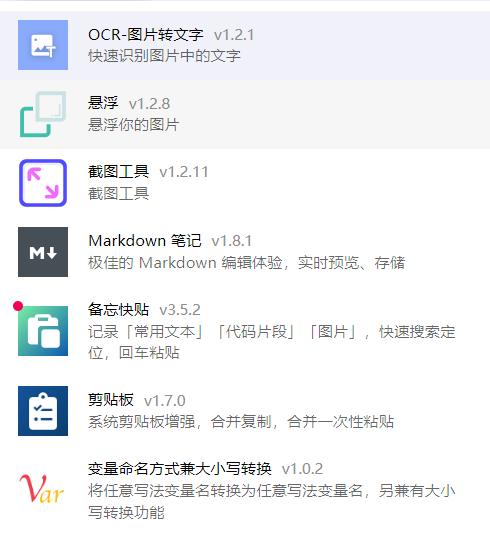
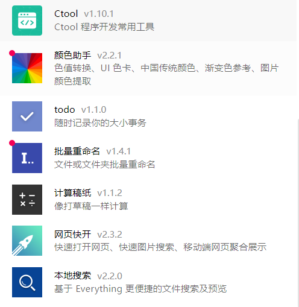
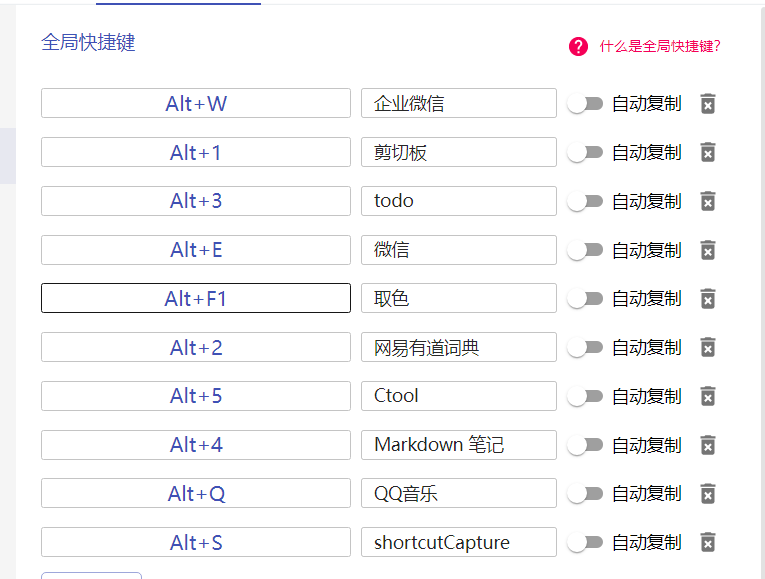

# uTools

> 官网链接:[官网链接](https://u.tools/)
>
> uTools 是一个极简、插件化、跨平台的现代桌面软件。通过自由选配丰富的插件，打造你得心应手的工具集合。
>
> 通过快捷键（默认 `alt + space` ）就可以快速呼出这个搜索框。它相当聪明，你可以往输入框内粘贴文本、图片、截图、文件、文件夹等等，能够处理此内容的插件也早已准备就绪，统一的设计风格和操作方式，助你高效的得到结果。
>

## 常用插件

>这里给出本人常用的几个插件
>
>  
>

## 全局快捷键设置

>本人常用快捷键
>
> 