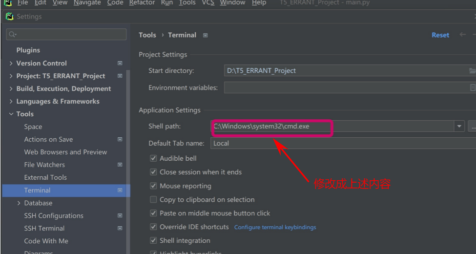

# pycharm下的终端进入项目虚拟环境



```
C:\Windows\system32\cmd.exe
```

设置后默认自动进入


[Selenium教程05：使用webdriver-manager自动下载浏览器驱动，再也不用担心driver版本的问题了_webdrivermanager-CSDN博客](https://blog.csdn.net/gxz888/article/details/135324353)