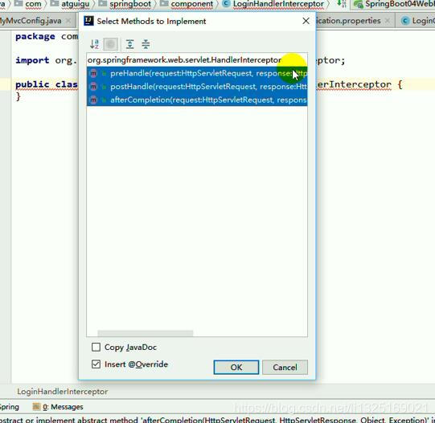
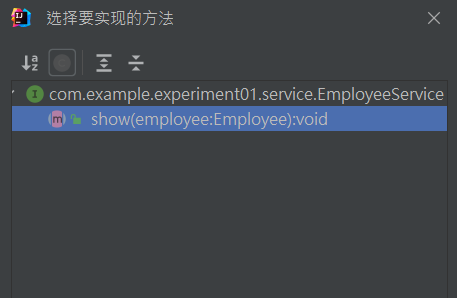
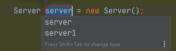

# Springboot中yml文件没有叶子图标的解决IDEA显示service服务

[IDEA显示services服务_idea 显示service_追求卓越583的博客-CSDN博客](https://blog.csdn.net/zhuiqiuzhuoyue583/article/details/128952012)


# IDEA test程序无法输入 This view is read-only 解决办法

### 问题

@test程序无法输入，按回车键显示如下：


### 解决办法

在IDEA ***Help -> Edit Custom VM Options*** 中**添加**如下代码，然后重启IDEA即可。

```bash
-Deditable.java.test.console=true
```

# idea重启

如下图所示
（1）通过File–>Invalidate Caches进入重启窗口


 

 （2）选择自己所需要的重启方式，四个按钮，一共三种重启方式：


# 导入jar包


# 普通项目转为maven项目


会自动创建项目结构


# IDEA的日常快捷键

### 通用型

| 说明                   | 快捷键           |
| ---------------------- | ---------------- |
| 复制                   | ctrl + c         |
| 粘贴                   | ctrl + v         |
| 删除选中内容，删除整行 | ctrl + x         |
| 撤销-undo              | ctrl + z         |
| 反撤销-redo            | ctrl + shift + z |
| 保存                   | ctrl + s         |
| 全选                   | ctrl + a         |

### 自动生成

| 说明                           | 快捷键      |
| ------------------------------ | ----------- |
| 智能提示                       | alt + enter |
| 调出生成getter/setter/构造器等 | alt+insert  |
| 选择环绕                       | ctrl+alt+t  |
| 自动生成变量, 相当于.var       | ctrl+alt+v  |
| 提示代码模板                   | ctrl+j      |

### 编辑相关

| 说明                        | 快捷键                   |
| --------------------------- | ------------------------ |
| 选中文本大小写的切换        | ctrl+shift+u             |
| 折叠/展开所有方法的具体实现 | ctrl+shift+ -/ +         |
| 复制光标所在行到下一行      | **ctrl+d**               |
| 光标直接跳到下一行          | **shift + enter**        |
| 光标直接跳到上一行          | ctrl +alt+ enter         |
| 只能向上/下移动一行代码     | ctrl+shift+↑/↓  (不推荐) |
| 可以向上/下移动一行或者多行 | **alt+shift+↑/↓**        |
| 多光标                      | Alt + 按住鼠标左键拖动   |

### 方法相关

| 说明                                  | 快捷键     |
| ------------------------------------- | ---------- |
| 抽取选中代码进行重构方法              | ctrl+alt+m |
| 在子类中, 重写父类的方法              | ctrl+o     |
| 在实现类中, 实现接口的方法            | ctrl+i     |
| 光标放在方法名上,  查看方法的形参列表 | ctrl+p     |
| 光标放在方法名上,  查看该方法的文档   | ctrl+q     |
| 查看方法所在的位置和调用位置          | ctrl+alt+h |

### 跳转相关

| 说明                                | 快捷键          |
| ----------------------------------- | --------------- |
| 进入光标所在的类                    | ctrl + 鼠标选中 |
| 光标放在接口类上,  跳转到对应实现类 | ctrl+alt+b      |
| 上/下一个浏览的地方                 | ctrl+alt+←/→    |
| 切换到前/后一个标签                 | alt+←/→         |
| 定位某行                            | ctrl+g          |

### 类结构相关

| 说明                              | 快捷键     |
| --------------------------------- | ---------- |
| 光标选中指定的类,  查看继承树结构 | ctrl+h     |
| UML关系图                         | ctrl+alt+u |

### 查找、替换与关闭

| 说明                                 | 快捷键       |
| ------------------------------------ | ------------ |
| 查找与替换                           | ctrl+r       |
| 搜索文本                             | ctlr+f       |
| 全项目搜索文本                       | ctrl+shift+f |
| 快速查找：选中的Word快速定位到下一个 | ctrl+l       |
| 直接定位到当前行的首位               | home         |
| 直接定位到当前行的末位               | end          |

### 调整格式

直接用idea自带的就行

| 说明                                         | 快捷键           |
| -------------------------------------------- | ---------------- |
| 格式化代码-reformat code                     | ctrl+alt+l       |
| 使用单行注释-comment with line comment       | ctrl + /         |
| 使用/取消多行注释-comment with block comment | ctrl + shift + / |
| 选中数行，整体往后移动-tab                   | tab              |
| 选中数行，整体往前移动-prev tab              | shift + tab      |

# 图示(杂)

抽取相同代码片段

Ctrl+Alt+M


alt+[Insert](https://so.csdn.net/so/search?q=Insert&spm=1001.2101.3001.7020)  用于自动生成get/set方法，toString方法等


 用于生成未重写或未实现方法

1、鼠标放在类的名称上，按住**Alt+Enter**键，如下图：
2、如下图：选择 【Implement methods】

3、如下图：全选，点击【ok】

4、如下图：已实现 实现类中的所有方法


Ctrl+alt+u 类图


shift + Enter 光标跳到下一行


c + j




`Ctrl+Shift+F`





# 详细准确的命中报错

<strong style="color:red">排查：查看报错所有日志的Caused by，**原因往往在最后一个Caused by。**</strong>

##  Error creating bean with name 问题

造成该报错无非这几个原因：扫描不到包、导包导错、注解没加或加错，类型、类名不正确等

### SSM、SpringBoot项目基础检查

1，[Spring项目](https://so.csdn.net/so/search?q=Spring项目&spm=1001.2101.3001.7020)配置文件，查看有没有开启注解扫描bean；

2，Spring项目配置文件，springmvc-config和applicationContext中，扫描Service、Contrller包的代码，查看包名是否写错；

3，分别看Controller、Service、Dao三层包中对应的注解是不是没加？如@Controller、@Service、@Mapper、@Repository等；

4、某个Spring容器托管的类你写成了抽象类，即abstract Class，抽象类是无法new的；

### 如果使用了JPA或[Hibernate]

1，检查@Query注解的SQL语句中表名应该是实体类名，看看是不是写错了；

2，检查实体类是不是加了@Entiy注解；

3，检查实体类的主键注解@Id对应的包是不是正确的，应该是import javax.persistence.Id，别导错了；

4，检查实体类@Entity包，包应该是javax.persistence.Entity，别导错了；

### 如果使用了[Mybatis]

1，检查SqlSessionFactory是不是为空；

2，@MapperSecan注解是不是没加？（SpringBoot启动类中开启mapper接口的扫描）；

3，XXXMapper.xml配置中parameterType如果是类类型，看类名是不是写错了；


# SPRING BOOT测试–如何禁用DEBUG和INFO日志

要禁用日志，请关闭`application.properties`和`logback-test.xml`的`logging.level`

## 1.1关闭登录`application.properties`

application.properties

```bash
logging.level.org.springframework=OFF
logging.level.root=OFF
```

Spring横幅下方的DEBUG或INFO日志现已关闭。

## 1.2在`src/test/resources`

创建一个`logback-test.xml` 。 同样，请在此处关闭日志记录。


logback-test.xml

```markup
<?xml version="1.0" encoding="UTF-8"?>
<configuration>
    <include resource="org/springframework/boot/logging/logback/base.xml" />
    <logger name="org.springframework" level="OFF"/>
</configuration>
```

好，刚刚离开了Spring标语。

Console

```bash
.   ____          _            __ _ _
 /\\ / ___'_ __ _ _(_)_ __  __ _ \ \ \ \
( ( )\___ | '_ | '_| | '_ \/ _` | \ \ \ \
 \\/  ___)| |_)| | | | | || (_| |  ) ) ) )
  '  |____| .__|_| |_|_| |_\__, | / / / /
 =========|_|==============|___/=/_/_/_/
 :: Spring Boot ::        (v2.1.2.RELEASE)
```

## 1.3关闭Spring标语

application.properties

```bash
logging.level.org.springframework=OFF
logging.level.root=OFF
spring.main.banner-mode=off
```

完成后，控制台现在应该为空。


[异常处理——SpringBoot项目启动后直接退出Process finished with exit code 1_springboot 启动直接结束打印错误信息-CSDN博客](https://blog.csdn.net/moneyshi/article/details/108437054?ops_request_misc={"request_id"%3A"162054562916780264021383"%2C"scm"%3A"20140713.130102334.pc_all."}&request_id=162054562916780264021383&biz_id=0&utm_medium=distribute.pc_search_result.none-task-blog-2~all~first_rank_v2~times_rank-10-108437054.first_rank_v2_pc_rank_v29&utm_term=进程已结束，退出代码为+1+idea)


# idea插件之：Grep Console 控制台输出最美日志颜色主题

 颜色参数

| 日志级别 | 前景色  | 背景色  |
| -------- | ------- | ------- |
| Error    | #FF0000 | #370000 |
| Warn     | #FFC033 | #1A0037 |
| Info     | #00FFF3 | 无      |
| Debug    | #808080 | 无      |


# 重装IDEA同步个人配置

1.首先将本地的设置上传到云端


2.勾选了`Auto Sync`：自动同步


3.点击小云朵


只有修改这里的配置才可以进行同步


# Redis Helper 插件


效果


# Springboot中配置文件没有叶子图标的解决

## Springboot中yml文件没有叶子图标

### 详情描述

如下图所示，log4j.yml文件并没有spring的叶子图标，这样用起来没有代码提示很不方便 


**解决方法：**

如下图所示


 

 


 原文参考：[springboot 如何解决yml没有spring的小叶子标志](https://www.jb51.net/article/242152.htm)

如果是在maven多模块项目，要保证 spring-boot-starter 引入包的依赖

```
<``dependency``>``  ``<``groupId``>org.springframework.boot</``groupId``>``  ``<``artifactId``>spring-boot-starter</``artifactId``>``</``dependency``>
```


## Spring配置文件（.yml）图标不是绿色小叶子


### 问题展示

项目的 `yml `文件一直不显示绿色小叶子，显示文本类型或者下图类型，影响项目启动运行。

先看一下我之前的 `yml `格式


### 问题解决

点击进入 `Setting `设置


ctrl+alt+s 选择 `plugins `查看是否下载 `yaml `插件


ctrl+alt+s ，去 `File Types `查看yml后缀名（我这里已加上了 `*.yml `）


点击 `+ `可以添加文件后缀


问题解决了


注：必要时可以 `Rubuild Project`


## 总结


# idea刷新项目、清除项目缓存

有时候项目运行之后会产生一些缓存，影响项目文件的提交和程序的运行，这时候我们可以清理项目的缓存并重启以消除这些影响。可以尝试清除调度程序的缓存或重新启动调度程序，以确保它不再尝试查找这个不存在的类。

方式：点击idea的左上角file---选择Invalidate caches即可刷新项目和清除项目缓存并重启。
