## PostMan测试

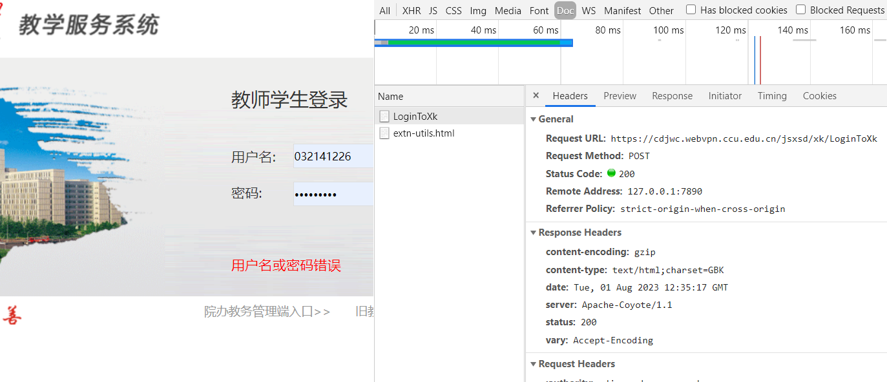

以广东培正学院强智教务系统为例：http://qzjw.peizheng.edu.cn/jsxsd/

步骤：
1.根据账户密码，去发起登录请求
请求地址：http://qzjw.peizheng.edu.cn/jsxsd/xk/LoginToXk
请求方式：PSOT
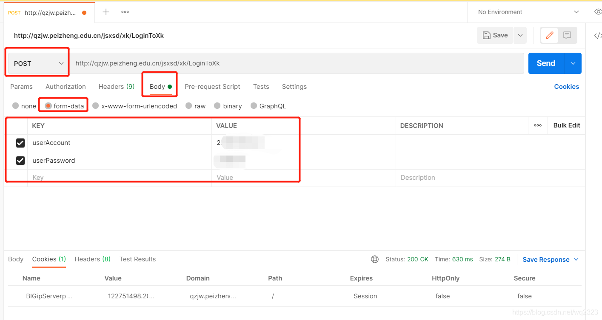
2.**因为强智还使用的JSP，所以基本都是 后端Session来存储用户信息，浏览器存入用户的cookie，在下一次请求当中将Cookie放入请求头。**

此处找到PostMan的heade信息：找到Set-Cookie
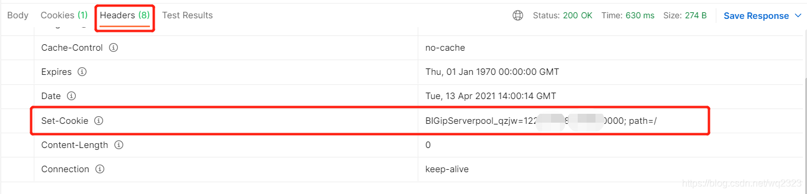

3.如果登录成功的话，这一串就是后端返回的Cookie信息了。有了Cookie信息，就相当于有了强智服务器识别你身份的钥匙，后续需要的各种操作，如查成绩，查信息，查课表，抢课，考勤等都可以使用。
拿到这个信息去继续请求：
请求地址：http://qzjw.peizheng.edu.cn/jsxsd/framework/xsMain_new.jsp?t1=1
请求方式：GET
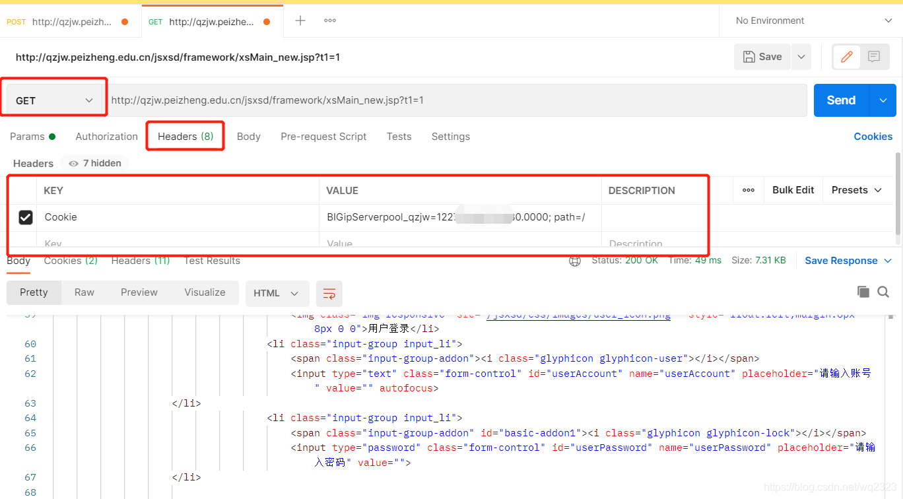

分析发现

```
请求地址：以广东培正学院强智教务系统为例：http://qzjw.peizheng.edu.cn/jsxsd/
请求方式：PSOT
账号密码通过base64加密
```

ccu教务系统分析:

**登录页面**

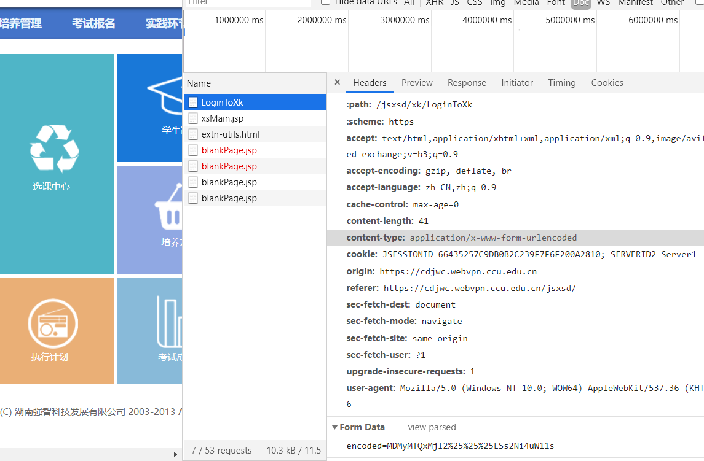


注意: view source 是请求里需要的.  view parse解析源码的里的数据展示

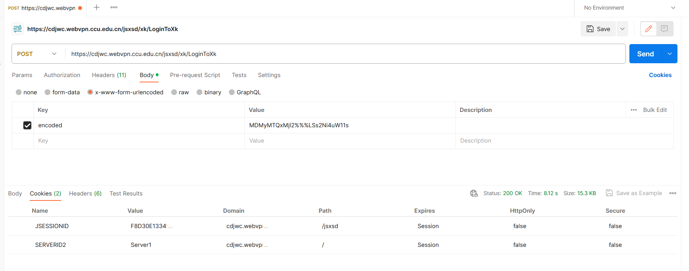

得到Cookie:

```c
JSESSIONID     B884FAC21A1688B9CF169EB5BDE0614B
SERVERID2      Serverl
```

课程表页面

https://cdjwc.webvpn.ccu.edu.cn/jsxsd/xskb/xskb_list.do

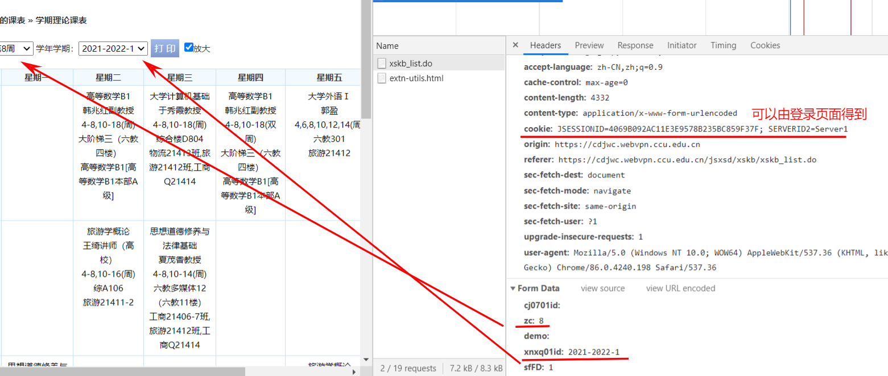

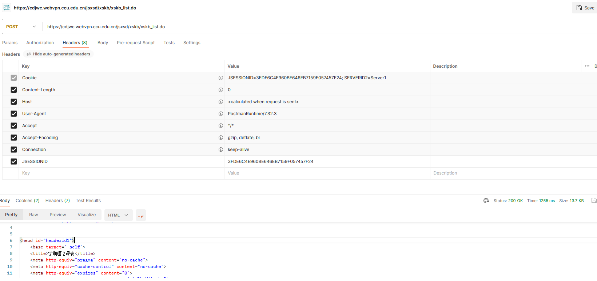


## Params、form-data、x-www-form-urlencoded、raw、binary的区别及后端接收方式

1、Params 的请求参数会出现在url中，为key=value格式，后端可以用@RequestParam接收。

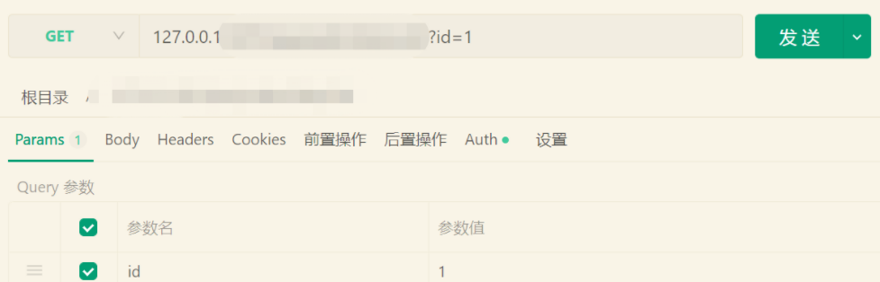

 2、form-data的请求是在body中，为key=value格式，同时可以传文件，Content-Type为multipart/form-data，后端可以用@RequestParam接收。

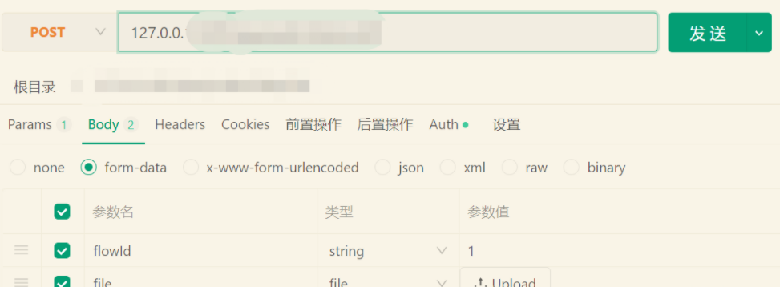

3、x-www-form-urlencoded的请求是在body中， 为key=value格式，无法传文件，Content-Type为application/x-www-form-urlencoded。

4、raw(不同api管理工具范围有细微区别)的请求是在body中，一般包含text、js、json等，可按照不同类型上传任意格式的文本，后端可以用@RequestBody接收。

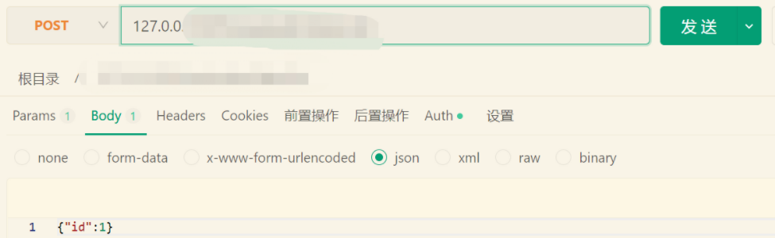

5、binary用于上传二进制数据，通常用来上传文件且一次只能上传一个文件。

# POST请求报错：“status“: 415, “error“: “Unsupported Media Type“, “message“: “Content type

## 使用Postman测试post请求时报错:

错误如下：

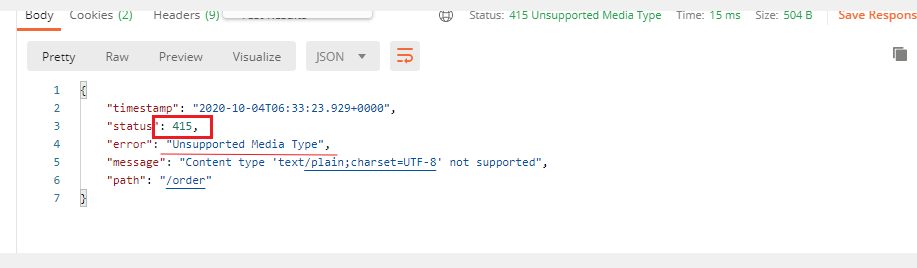

错误码：415表示不支持内容类型。

## 错误原因：

  我使用的是body传参，如果使用Body传参的话，就需要在设置Headers。
找了一下错误原因是没有正确设置内容类型标头。（下图为错误之处）

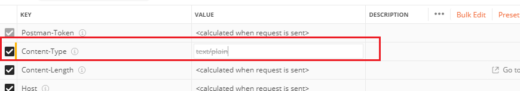

## 解决办法：

重新建一个请求，需要在Headers里添加如下配置：

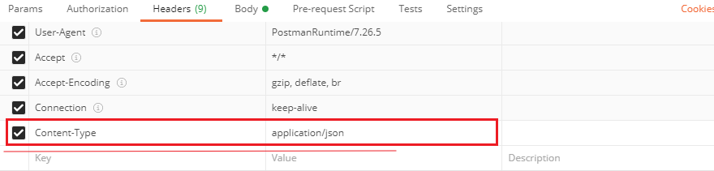


# Postman如何导入和导出接口文件


## **生成****json文件导入的方式**

### 2.1、导出json文件


选择版本，导出


选择导出文件存放位置


### 

### 2.2、导入json文件


选择导出的json文件进行导入


# Postman 导入导出 curl 命令详细步骤


[Postman 导入curl 、导出成curl、导出成对应语言代码-CSDN博客](https://blog.csdn.net/qq_41767116/article/details/121463916)
