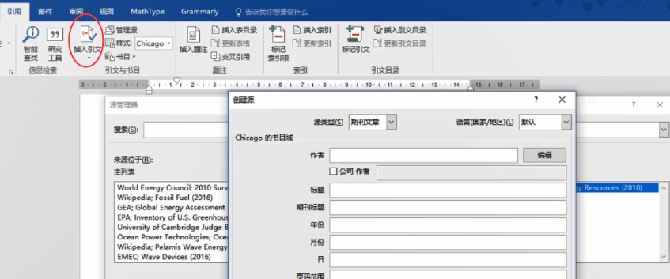

# word

## 快捷键

1 右键自定功能区，这样就不用打开设置进入了 

2 左键双击菜单栏任意一个功能名称两下，就可以隐藏菜单栏内容；之后再按两下还原 

3 Backspace(倒退鍵)，刪除游標左側的文字；Delete 刪除游標右側的文字 

4 快速选择内容的方法，将鼠标放到每一行的最前面，箭头就是变成白色，之后再上下选择，就会选中所有内容了；快速选中一个段落的方法还有，将滑鼠反到句子中间，然后很快的点击三次，就可以全部选中了 

5 word自带剪贴板，如果你有多个大片段落的复制和粘贴，这个功能就很实用。在开始标签页下

6 Ctrl + Return(回车)，插入分页符，也就是空白页。之前插入空白页都是一直按enter 常用情况下，分页符号是隐藏的，按（开始-->段落）的按钮显示  删除空白页的方法：选中这一页的光标，按delete。 

7 在页首页尾双击两下滑鼠，就可以进入页首页尾模式。页首页尾就是在一页输入的内容，在其它页面都会显示。页首，页尾其实很好插入，只要注意首页不同、奇偶页不同这几个要求就行 

8 word插入文本框，很好用，可以改善排版，而且文本框还能随便移动，有了这个功能，word也可以很方便的写卡片笔记了。另外word插入形状之后，如果想在形状上面书写内容，可以右键 填入文字 

​       插入文本框之后，再复制文字，往往会出现文字超出文本边框的情况，这种情况需要再建一个文本框。选中         第一个文本框，然后点形状格式-->文本-->创建链接，箭头就会变成一个圈，之后点击第二个文本框就可以了 

9 word本身也自带了很多的模板。比如，表格-->快速插入表格；文件-->新建 

10 在表格中，按下Delete只能删除内容，但是按下backspace可以连表格行都删除。 

11 想让文字垂直的话，布局-->文字方向，垂直即可 

12 打勾的插入，插入一个打勾图标即可；也可以插入-->符号，在Wingdings 2中插入 

13 word中插入图片不失真的方法：设置---高级---图像大小和质量 勾选 不压缩文件中的图像 

14 按F4可重复上一步操作。

15 Ctrl + G，快速定位到图片和标题，公式。就不用下滑查找了。标号自动更新 F9 

16  F4 重复上一步动作


## 自动保存


## 封面

​         

## 排版

### 尺规

1-2是一对，用来控制两边空白区域的大小

3-4是一对，用来控制文字外边和纸张边缘的距离

5-6是一对，用来调整首行

要注意，调整的时候如果是全文调整，需要全选，否则改变的只是被滑鼠所在段落。


### 定位位（制表符）

制表符是指Word水平标尺上显示的一种符号，这个符号就是制表位所在位置的标记。其作用是用以规范在文档中输入的各字符或者文本的位置。

+ 默认情况下，我们在Word文档中每按下一次【Tab】键，插入点即会自动向右侧移动2个字符的位置（制表位）

+ 5种制表符，分别为：左对齐式制表符、居中对齐式制表符、右对齐式制表符、小数点对齐式制表符、竖线对齐式制表符，它们都是用来指定文本的对齐方式。


**有两种设置方式：**

**1在标尺上设置制表位**

1. 单击标尺最左侧的制表符标记切换到需要的制表符对齐类型
2. 然后直接单击标尺上的某个位置，即可创建一个制表符，并定位位置设置制表位


**2在“制表位”对话框中设置（论文中多使用）**

点击【开始】-【段落】组右下角的“段落对话框启动器“按钮，打开”段落“对话框，然后单击”制表位“按钮，打开”制表位“对话框。


**例子**


## 样式与阶层

❗给样式设置快捷键

[Word ](https://www.bilibili.com/video/BV1BK4y1Y7iA?note=&p=1&t=605)

字元样式就是只有选中内容，才能套用样式；段落样式就是鼠标在段落的时候就可以套用样式；连接就是二者都有。样式套用的优先度如下图所示：也就是说虽然一段内容你设置了样式，但是如果你在开始页面直接修改样式，还是以最后修改的为准。


另外，标题1的样式往往都是新开一页，那么这个怎么设置呢，方法就是在段落的换行和分页里面，勾选段前分页就可以了。


### 样式

#### 创建正文样式

+ 创建样式；

+ 在格式设置中设置好格式；

+ 一般设置字体格式和段落格式，其他根据需要设置


自动更新：选中采用此样式的任一段内容并且做出修改，使用样式的其它文字会同步自动更新

基于该模板的新文档：新建文件，也会采用相同模板

**常用样式**


**例子**


#### 创建标题样式

+ 创建样式；

+ 格式--字体中设置标题字体格式；

+ 格式--段落中设置段落格式，设置大纲级别为一级，即为一级标题。


 

#### 编号的使用

创建多级列表

+ 定义新的多级列表；

+ 点击“更多”设置更多选项，设置多级列表各个级别的样式；
+ 关联各级别样式到各级标题。

**技巧：**

```
数字/字母+点+空格: 	  1. [空格][文字]
					   a. [空格][文字]
数字/字母+右圆括号+空格:  1) [空格][文字]
						iii）[空格][文字]
```

设置完成后，标题即会自动编号


### 阶层设定


防止列表缩排出问题，在样式中不设置段落缩排，而是右键单独设置缩排。缩排设置


缩排就是编号位置，凸排就是文本缩进


## 分栏符-分页符-分节符

[Microsoft Word 基础教学 19：分节符 & 论文页码设定哔哩哔哩bilibili](https://www.bilibili.com/video/BV1Mb411b77k?note=&p=1&t=195)

### 分页符&分栏符

+ 分页符号是将文字移动到下一页

+ 分栏符号是文字移动到下一栏

默认情况下，这些符号是不显示的，如果想显示的话，勾选下面的标记


另外，如果想去掉段落标记，如下图所示，可以设置-->显示-->取消勾选段落标记


#### 分节符 “下一页”

作用:  光标后内容, 从下一页开始


#### 分栏符

选中内容设定分栏 布局-->栏，可以自动将未选中和已选中的分开。未选中的还是单栏，并且形成两节。


**例子**


这样设定好之后，和wolai的拖动很像。还可以调整栏宽


**分栏设定，恢复原状**

首先恢复单栏，之后移除分节符和分栏符，移除的方法就是先显示，然后DELETE。删除的时候，要把游标放到符号的前面，然后按delete删除就可以了。

### 分节符

分节符号就是将一个文件划分为多个章节

+ 之所以会用到分节符号，是因为日常使用中，我们只想给一个页面转为横向，或者添加边框，但是实际操作之后，却发现所有页面都发生了变化，插入分节符就可以解决这个问题。

+ 有的时候我们也需要忽略掉节的影响，将版面设置用在整个文档，设置的方法就是布局-->页面设置-->应用于整篇文档。

+ 布局-->分隔符-->分节符。节显示，左下角右键，显示目前在第几节。默认是不勾选的

手动分行符号和段落标记符号；手动分行符号仍属于同一段落。


## 图片

word有很多图片效果，还有裁剪功能，裁剪功能很强大，可以裁剪出很多种不同的形状；还可以修改图片的明亮度和色调。总之图片处理还是挺强大的。


### 类型

**注：默认的环绕方式是【嵌入型】，常用的环绕方式是【嵌入型】和【四周环绕型】**

#### 嵌入型(默认)

当作一个大的文字看待


####  四周型

文字以矩形围绕图片


####  紧密型


####  穿越型


####  上下型环绕

和矩形不同，图片的左右是没有文字的


####  衬于文字下方

此时图片相当于背景


####  浮于文字上方

图片把文字遮住


####  编辑环绕顶点


**例子：**

如何制造下图所示效果, 图片格式--->删除背景-->文字环绕图片：紧密


### 图片排版

[Word图片排版技巧 - 知乎 (zhihu.com)](https://zhuanlan.zhihu.com/p/171656475)


#### 设置题注

插入题注之后，在样式里面就有题注了（不光是图片的题注，还有公式的），这时可以将题注参照正文和标题的方式，设置居中。


注意:  可以把题注设置成样式

#### 交叉引用

**搭配题注使用。选择引用，选择仅标签和编号**


#### 插入图表目录


**可以设置图表目录缩排：插入表目录-->修改-->修改-->格式-->段落-->缩进-->左侧 0字符**


### 图片技巧

#### 图片显示不全

选中图片，点击段落——缩进和间距——在间距中将行距更改为单倍行距/1.5倍行距


#### 图片不能移动

可以右击选择文字环绕，择文字环绕中的任何一种方式


#### 图片批量对齐

点击开始——替换（Ctrl+H），进入相应的对话框。然后将光标放在查找内容中，点击【更多】，在【特殊格式】中找到【图形】（或者直接输入^g），随后在替换为中选择【格式】——【段落】——【缩进和间距】——【对齐方式】为【居中】最后点击全部替换即可。


效果如图


#### 图片上插入形状


## 表格

按住shift调整栏宽时，不会影响到其它栏位的宽度

+ 快速调整表格


​		缩放整个页面，直接向下拖动表格，像是调整形状大小那样调整表格，直接拖动缩放

+ 表设计

  三线表的设计是最好看的

  + 标题线颜色深，行线颜色浅。
  + 表格 白色笔刷删除不必要间隔线
  + 文字靠左，金额靠右（让数字的最后一位对齐）

首先加水平框线，之后绘制需要加粗的框线

移动列使得表格的重心要回到页面的中央

●怎么设计一个带有缺口的表格

1移动表格的某行和某列，选择之后直接拖动即可。或者按住shift和alt不放，然后再按上下方向键

2当表格内容较多，横跨了好几页，这个时候可以视图-->多页，显示为多页，这一步就是为了方便校正，之后布局-->重复标题行


3插入简单的公式计算，比如加总，布局-->公式

4拆分表格的方法，鼠标放到要拆分表格的某一行（新表格的最后一行），然后点布局-->拆分表格。将两个表格合在一起操作类似，将第二个表格剪切，然后鼠标放到第一个表格最后一行，执行粘贴操作即可。

5表格的对齐：分散对齐：选中文字-->开始-->段落-->分散对齐。移除分散对齐的方式是点击分散对齐，然后选择移除

6如果你要插入的表格比较复杂的话，那么你可以选择绘制表格。如果画错的话，按住shift不放，就会变成一个橡皮擦。还可以绘制对角线哦


​               


另外还有布局-->对齐方式


7在表格的下面绘制填空线


方法仍然是使用定位点，定位点必须要搭配tab键才能使用，在表格中，按tab键的话，会自动跳到下一行，因此在表格中是Ctrl + Tab。之后双击制表符，选择引导符为第四种


## 页码

写论文的时候，要分别插入阿拉伯数字页码还有罗马数字页码，只需要将论文整体分成三部分就可以了。也就是插入分节符。双击页脚，插入页码。页眉和页脚-->页码-->设置起始页，修改为1即可。


**按esc键,保存设置**

## 对文章进行引用





## 文本删除行


## 公式

### 基本使用

Alt + = 插入公式


### 公式编号

使用“表格”对公式进行编号。 

## 把一个word文档内容插到另一个word里


## 特别功能

### 制作电子签名

[Photopea | Online Photo Editor](https://www.photopea.com/)
[我省纸我骄傲，一个小动作让你摇身一变成为环保小尖兵！同场加映 PDF 签名设定 | Word 教学 #26哔哩哔哩bilibili](https://www.bilibili.com/video/BV1xE411d7oV?note=&p=1&t=62)

以下流程是我简化之后，没有使用图像-->调整-->色阶；因为这些专业概念我也不懂，就只能死记硬背

最重要的其实就是删除背景，只剩下字体，这个ppt的删除背景也可以做到，但是试了之后，PPT的效果不好，因为PPT的裁剪并不是真的把图像裁剪了。还是得PS的魔术棒

1在一张白纸上面手写签名照-->拍照上传到电脑

2如果背景和字体颜色对比度不够强，可以图像-->自动对比度

3魔棒点击-->Delete，多进行几次，直到只剩下字体

4保存为图片，插入word里面即可

另外如果你需要经常签名的话，你可以把签名图片存为文档部件。插入-->文档部件-->自动图文集。当我们不需要的时候，只要选中右键在整理和删除中删除即可。

如果要在pdf文档中插入签名的话，很多pdf软件都有pdf签名的功能，只要选择导入文件，将保存好的手写签名图片导入就可以了。

### 合并列印

统一模板，抓取数据，批量打印。抓取数据，做好布局，合并文档。

314233123

这个功能很牛欸，它可以把表格的笔记形成单独的word卡片笔记啊。


合并列印可以实现邮件、标签还可以打印名牌


示例：直式文书 & 直式信封设定

Microsoft Word 基础教学 14：直式文书 & 直式信封设定_哔哩哔哩_bilibili

https://www.bilibili.com/video/BV1Mb411b7DB/?spm_id_from=333.788.recommend_more_video.-1


有了word的合并邮件的功能，主题阅读用Excel就不错了，将来可以直接转到word，然后转为md笔记。


合并列印项目：利用「邮件合并」制作带有图档的识别名牌？

[Microsoft Word 基础教学 24：如何利用「邮件合并」制作带有图档的识别名牌？哔哩哔哩bilibili](https://www.bilibili.com/video/BV1Mb411b7Hw?note=)

效果图


### 录制宏

[Microsoft Word 基础教学 23：如何整理 PDF 转贴过来的段落与录巨集？哔哩哔哩bilibili](https://www.bilibili.com/video/BV1Mb411b7pR?note=&p=1&t=340)

开发工具-->录制宏。可以把常用操作设置一个快捷键，然后快速实现。

先录制巨集，并设置快捷键，然后进行要录制的操作。

但是我没有实现，视频中举的例子是从pdf复制粘贴的文字会不连续，因此录制了一个宏，这样再复制文字，按一个快捷键就能将文字整理在一个段落里面了。


### 追踪修订

[Microsoft Word 基础教学 21：追踪修订哔哩哔哩bilibili](https://www.bilibili.com/video/BV1Mb411b773?note=&p=1&t=250)

审阅-->修订

追踪修订的三种格式：删除内容，新增内容，格式变更。


所有标记完之后，无标记查看修改后内容。


强制开启修订，防止别人忘记要修订，而直接在你原文上面修改。


滑鼠右键，接受变更。word比较功能，如果不幸别人还是在你的原文上面修改，你可以通过比较功能实现和修订一样的效果


### 流程图

[Microsoft Word 基础教学 17：流程图制作 & SmartArt哔哩哔哩bilibili](https://www.bilibili.com/video/BV1Mb411b7nR?spm_id_from=333.999.0.0)

word绘制流程图需要先加一个绘图画布，插入-->形状-->新建画布

只有在画布上面，箭头才会产生吸附。但是PPT就不需要，PPT本身就是画布


### 模板使用

[word模版应用：定制一个日常专属模版 - 哔哩](https://www.bilibili.com/read/cv3661530)


