# IDEA显示service服务

[IDEA显示services服务_idea 显示service_追求卓越583的博客-CSDN博客](https://blog.csdn.net/zhuiqiuzhuoyue583/article/details/128952012)


# IDEA test程序无法输入 This view is read-only 解决办法

### 问题

@test程序无法输入，按回车键显示如下：


### 解决办法

在IDEA ***Help -> Edit Custom VM Options*** 中**添加**如下代码，然后重启IDEA即可。

```bash
-Deditable.java.test.console=true
```


# idea重启

如下图所示
（1）通过File–>Invalidate Caches进入重启窗口


 

 （2）选择自己所需要的重启方式，四个按钮，一共三种重启方式：

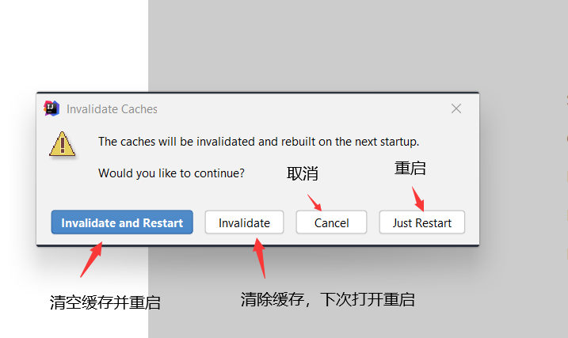


# IDEA的日常快捷键

### 通用型

| 说明                 | 快捷键           |
| -------------------- | ---------------- |
| 复制                 | ctrl + c         |
| 粘贴                 | ctrl + v         |
| 删除选中内容，或整行 | ctrl + x         |
| 撤销-undo            | ctrl + z         |
| 反撤销-redo          | ctrl + shift + z |
| 保存                 | ctrl + s         |
| 全选                 | ctrl + a         |

### 自动生成

| 说明                           | 快捷键      |
| ------------------------------ | ----------- |
| 智能提示                       | alt + enter |
| 调出生成getter/setter/构造器等 | alt+insert  |
| 选择环绕                       | ctrl+alt+t  |
| 自动生成变量, 相当于.var       | ctrl+alt+v  |
| 提示代码模板                   | ctrl+j      |

### 编辑相关

| 说明                        | 快捷键           |
| --------------------------- | ---------------- |
| 选中文本大小写的切换        | ctrl+shift+u     |
| 折叠/展开所有方法的具体实现 | ctrl+shift+ -/ + |
| 复制光标所在行到下一行      | ctrl+d           |
| 光标直接跳到下一行          | shift + enter    |
| 光标直接跳到上一行          | ctrl +alt+ enter |
| 只能向上/下移动一行代码     | ctrl+shift+↑/↓   |
| 可以向上/下移动一行或者多行 | alt+shift+↑/↓    |

### 方法相关

| 说明                                  | 快捷键     |
| ------------------------------------- | ---------- |
| 抽取选中代码进行重构方法              | ctrl+alt+m |
| 在子类中, 重写父类的方法              | ctrl+o     |
| 在实现类中, 实现接口的方法            | ctrl+i     |
| 光标放在方法名上,  查看方法的形参列表 | ctrl+p     |
| 光标放在方法名上,  查看该方法的文档   | ctrl+q     |
| 查看方法所在的位置和调用位置          | ctrl+alt+h |

### 跳转相关

| 说明                                | 快捷键          |
| ----------------------------------- | --------------- |
| 进入光标所在的类                    | ctrl + 鼠标选中 |
| 光标放在接口类上,  跳转到对应实现类 | ctrl+alt+b      |
| 上/下一个浏览的地方                 | ctrl+alt+←/→    |
| 切换到前/后一个标签                 | alt+←/→         |
| 定位某行                            | ctrl+g          |

### 类结构相关

| 说明                              | 快捷键     |
| --------------------------------- | ---------- |
| 光标选中指定的类,  查看继承树结构 | ctrl+h     |
| UML关系图                         | ctrl+alt+u |

### 查找、替换与关闭

| 说明                                 | 快捷键       |
| ------------------------------------ | ------------ |
| 查找与替换                           | ctrl+r       |
| 搜索文本                             | ctlr+f       |
| 全项目搜索文本                       | ctrl+shift+f |
| 快速查找：选中的Word快速定位到下一个 | ctrl+l       |
| 直接定位到当前行的首位               | home         |
| 直接定位到当前行的末位               | end          |

### 调整格式

直接用idea自带的就行

| 说明                                         | 快捷键           |
| -------------------------------------------- | ---------------- |
| 格式化代码-reformat code                     | ctrl+alt+l       |
| 使用单行注释-comment with line comment       | ctrl + /         |
| 使用/取消多行注释-comment with block comment | ctrl + shift + / |
| 选中数行，整体往后移动-tab                   | tab              |
| 选中数行，整体往前移动-prev tab              | shift + tab      |

# 图示(杂)

抽取相同代码片段

Ctrl+Alt+M

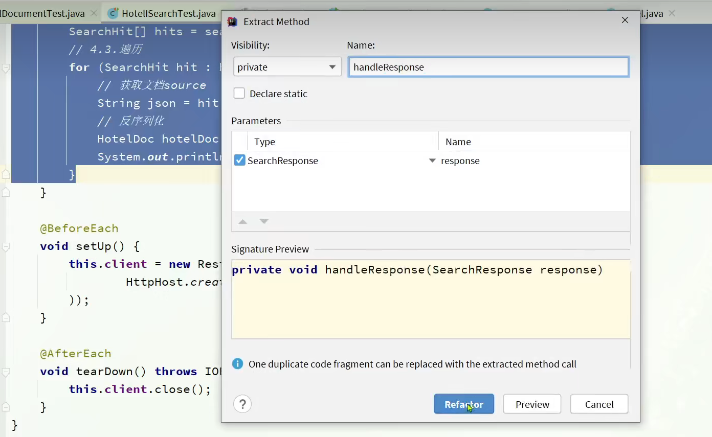


alt+[Insert](https://so.csdn.net/so/search?q=Insert&spm=1001.2101.3001.7020)  用于自动生成get/set方法，toString方法等

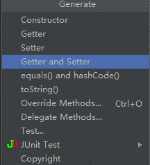


 用于生成未重写或未实现方法

1、鼠标放在类的名称上，按住**Alt+Enter**键，如下图：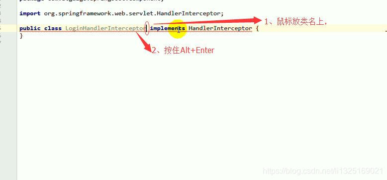
2、如下图：选择 【Implement methods】
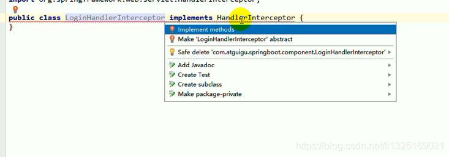
3、如下图：全选，点击【ok】

4、如下图：已实现 实现类中的所有方法


Ctrl+alt+u 类图

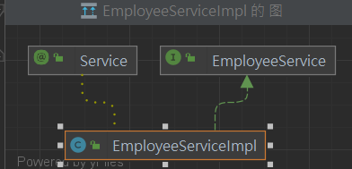


shift + Enter 光标跳到下一行


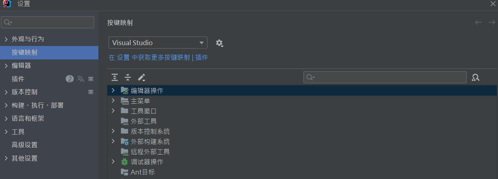


c + j

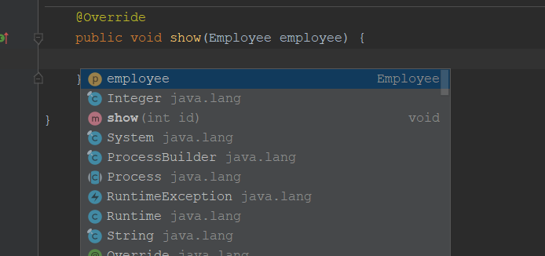


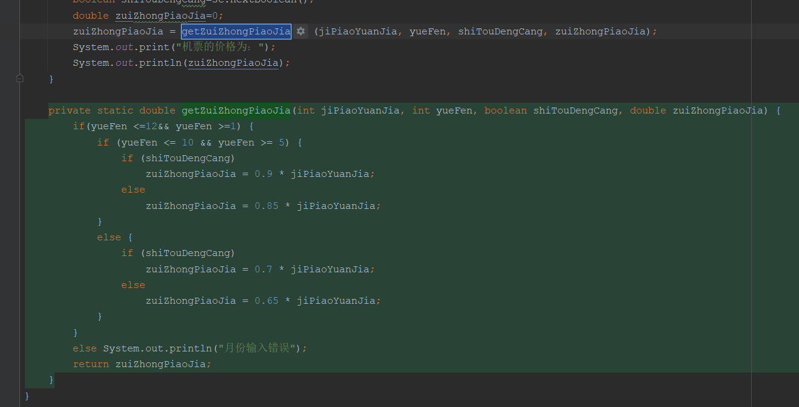


`Ctrl+Shift+F`


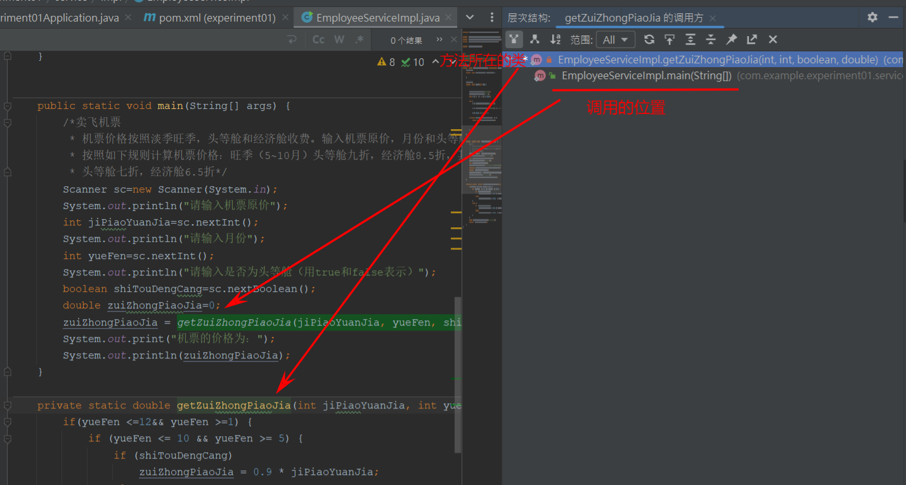


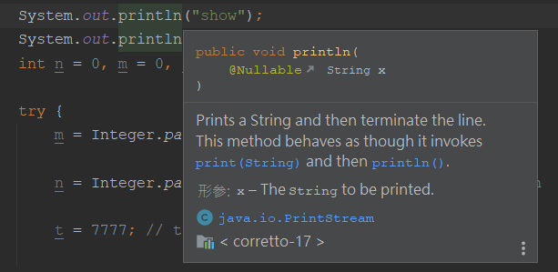