[Java基础学习笔记总结 - ~冰 - 博客园 (cnblogs.com)](https://www.cnblogs.com/ginb/p/7113409.html)

````
# 常用Java命令

## [javac](https://so.csdn.net/so/search?q=javac&spm=1001.2101.3001.7020)

javac命令用于将Java源代码编译成Java字节码文件（.class文件），以便在[Java虚拟机](https://so.csdn.net/so/search?q=Java虚拟机&spm=1001.2101.3001.7020)（JVM）上运行。

### 基本语法

```powershell
javac [options] source_file(s)
```

### 使用示例

```powershell
javac HelloWorld.java
```

### 参数说明

- options：javac命令提供了多个选项来控制[编译过程](https://so.csdn.net/so/search?q=编译过程&spm=1001.2101.3001.7020)和生成的字节码文件的行为。可以使用javac -help查看所有选项及其说明。
- source_file(s)：指定要编译的源代码文件的路径。可以使用通配符（*）来编译整个文件夹中的所有Java文件。例如，javac *.java会同时编译当前目录中的所有Java文件。

### 常见选项

- -d directory：指定编译生成的.class文件的输出目录。
- -classpath path：指定可供编译器使用的类路径。
- -source version：指定要编译的Java源代码的版本（例如，-source 8表示使用Java 8的语言功能进行编译）。
- -target version：指定要生成的字节码文件的Java版本（例如，-target 1.8表示要生成适用于Java 8的字节码文件）。
- -Xlint：启用编译器警告消息。
- -verbose：显示编译器的详细输出信息。

javac命令是编写和编译Java代码的必备工具之一。掌握其用法可以帮助开发人员更好地进行Java开发和调试。

## java

java命令用于启动Java虚拟机并执行Java程序。使用java命令可以在命令行中直接运行编译后的Java程序。

### 基本语法

```powershell
java [options] class [args...]
1
```

### 使用示例

```powershell
java HelloWorld
1
```

### 参数说明

- options：Java命令提供了多个选项来控制Java虚拟机和应用程序的行为。可以使用java -help查看所有选项及其说明。
- class：要运行的Java类名。
- args…：传递给主方法的参数。这些参数将作为字符串数组传递给main()方法。

### 常见选项

- -classpath path：指定Java虚拟机应该搜索类文件的路径。与javac编译器选项-cp相同。
- -Xmx size：指定堆大小的最大值，以字节为单位。例如，-Xmx1024m表示堆大小的最大值为1024 MB。
- -Xms size：指定初始堆大小，以字节为单位。
- -version：查看Java版本信息。
- -jar file：执行指定的JAR文件。
- -Dproperty=value：设置系统属性。例如，-Djava.awt.headless=true表示启用无头模式。

java命令是Java开发和调试的重要工具之一。熟练掌握其用法可以帮助开发人员更好地编写和运行Java程序。

## javap

javap命令用于查看编译后的Java类文件的信息。它可以解析字节码文件，并显示有关类及其成员的信息。

### 基本语法

```powershell
javap [options] class
1
```

### 使用示例

```powershell
javap HelloWorld
1
```

### 参数说明

- options：javap命令提供了多个选项来控制输出的内容和格式。可以使用javap -help查看所有选项及其说明。
- class：要查看的类名。该类必须已经编译成.class文件，否则javap将无法解析它。

### 常见选项

- -c：以指令列表的形式打印代码。这对于特定的“bytecode hacking”任务非常有用。
- -l：以行号和本地变量表的形式打印代码。
- -s：输出内部类型签名。
- -verbose：以更详细的方式输出类信息。
- -classpath path：指定类路径和搜索位置。
- -J：向Java虚拟机传递选项。例如，-J-Xms1024m会设置最小堆大小为1024 MB。
- -constants：只显示常量池中的常量，而不显示方法体的内容。

使用javap命令可以查看Java类的字节码信息，包括类名、父类、接口、构造函数、字段、方法名称和描述符等。熟练掌握javap命令可以帮助开发人员更好地理解Java应用程序的工作原理，并进一步了解Java虚拟机的内部结构。

## jar

jar命令用于创建和管理JAR格式的归档文件，也可以用于解压缩包和对JAR文件进行签名等操作。

### 基本语法

jar [options] archive_file file(s)

### 使用示例

jar cf myJar.jar *.class

### 参数说明

- options：jar命令提供了多个选项来控制生成的JAR文件的内容和行为。可以使用jar -help查看所有选项及其说明。
- archive_file：生成的JAR文件的名称。
- file(s)：需要添加到JAR文件中的文件或目录列表。

### 常见选项

- c：表示新建一个JAR文件。
- f：指定JAR文件的文件名以及可选路径
- v：输出生成过程中处理的文件列表。
- m：表示需要保留manifest文件。
- x：从JAR文件中提取指定的文件。
- t：列出JAR文件中存储的文件。
- u： 更新现有的JAR文件中的文件。
- i：为已有的JAR文件创建索引文件

使用jar命令还可以对JAR文件进行签名，以提高应用程序的安全性，防止被篡改。此外，在发布Java程序时，将代码打包成一个JAR文件也是很常见的做法，以便简化部署和分发过程。

jar命令是Java开发和部署的重要工具之一。熟练掌握其用法可以帮助开发人员更好地管理JAR文件和Java程序的部署。

## javadoc

javadoc命令用于生成Java文档。它可以分析源代码中的注释，并以HTML格式输出API文档。

### 基本语法

```powershell
javadoc [options] source_file(s)
1
```

### 使用示例

```powershell
javadoc HelloWorld.java
1
```

### 参数说明

- options：javadoc命令提供了多个选项来控制生成的文档内容和格式。可以使用javadoc -help查看所有选项及其说明。
- source_file(s)：指定要生成文档的源代码文件的路径。可以使用通配符（*）来生成整个文件夹中的所有源文件文档。

### 常见选项

- -d directory：指定生成文档的输出目录。如果没有指定，则默认在当前目录中创建一个名为“doc”的文件夹。
- -classpath path：指定可供javadoc使用的类路径。
- -subpackages pkg1:pkg2:…：指定需要包括的子包。
- -private：生成私有成员文档。
- -sourcepath path：指定源文件的搜索路径。这对于在不同的目录中使用源文件非常有用。
- -author：在生成的文档中包含作者信息。
- -version：在生成的文档中包含版本信息。

使用javadoc命令可以快速生成Java API文档，方便阅读和使用。编写清晰明了的注释并生成API文档是Java开发中的一个关键过程，因为它可以提高代码的可读性和可维护性，方便团队协作。

## jps

jps命令用于列出当前系统中正在运行的Java进程。它可以显示正在运行的Java虚拟机（JVM）以及它们的进程ID。

### 基本语法

```powershell
jps [options]
1
```

### 使用示例

```powershell
jps -v
1
```

### 参数说明

- options：jps命令提供了多个选项来控制输出的内容和格式。可以使用jps -help查看所有选项及其说明。

### 常见选项

- -q：只显示进程ID，而不显示JVM名称。
- -m：显示启动时传递给主类的参数。
- -l：显示主类的完全限定名以及传递给主类的参数。
- -v：显示JVM启动时的命令行信息。
- -V：显示jps版本信息。

使用jps命令可以快速查看当前系统中正在运行的Java进程，并获取它们的进程ID，用于在需要时管理或诊断Java应用程序。jps命令非常简单实用，但对于几乎所有的Java应用都会起到帮助作用。

## jstat

jstat命令用于监视Java应用程序的性能。它可以使用不同的选项打印出Java虚拟机（JVM）中各个内部组件的性能统计数据。

### 基本语法

```powershell
jstat [options] pid [interval [count]]
1
```

### 使用示例

```powershell
jstat -gcutil 1234
1
```

### 参数说明

- options：jstat命令提供了多个选项来控制输出的内容和格式。可以使用jstat -options查看所有选项及其说明。
- pid：正在运行的Java进程ID（可以使用jps命令获取）。
- interval：可选参数，指定两次采样之间的时间间隔（以毫秒为单位）。如果省略，则默认为1秒。
- count：可选参数，指定采样次数。如果省略，则默认为无限次。

### 常见选项

- -class：显示类加载、卸载情况以及持有类加载器的内存池的容量。
- -compiler：显示JIT编译器编译代码的方法以及编译时间。
- -gc：显示各个内存池的使用情况、申请内存、释放内存情况等信息。
- -gccapacity：显示整个堆（包括新生代和老年代）和各个内存池的容量信息。
- -gcutil：显示整个堆（包括新生代和老年代）和各个内存池的使用情况。

使用jstat命令可以实时查看Java应用程序的性能状况，例如堆内存的使用情况、类加载器的状态、JIT编译器运行时间等重要信息，有助于开发人员及时发现性能问题并进行优化。jstat命令非常灵活，可以根据不同的选项进行配置，方便获取需要的数据。

## jconsole

jconsole命令是Java开发环境（JDK）自带的图形化监视工具，它提供了一个友好的用户界面，用于可视化地监控和管理Java应用程序。它可以实时显示Java应用程序的性能指标、内存使用情况、线程状态等信息，还可以进行远程监控。

### 基本语法

```powershell
jconsole [optionally, hostname:port or service:jmx:rmi:///…]
1
```

### 使用示例

```powershell
jconsole
1
```

### 参数说明

- optionally, hostname:port or service:jmx:rmi:///…：可选参数，用于连接到要监控的Java进程。如果忽略此参数，则会打开一个对话框，允许您选择要监视的进程。

使用jconsole命令可以启动Java虚拟机（JVM），并以图形化的方式监视JVM的运行状况。图形界面中提供了各种监视面板，展示当前JVM的CPU使用率、内存使用情况、GC状态等，同时可以查看线程、类、MBean等信息。

除此之外，jconsole还提供了常规操作管理Java应用程序的功能，例如观察垃圾回收、查看堆内存使用情况、分析线程的执行情况等。此外，如要添加可扩展性，则可使用MBeans控制进一步管理应用程序。

jconsole是一种功能齐全、简单易用的监控工具，能够帮助开发团队及时发现并解决Java应用程序中的性能问题。

## jstack

jstack命令用于查看Java应用程序的线程信息和调用栈信息。它通常用于分析Java进程出现卡死、死锁等问题时定位问题原因。

### 基本语法

```powershell
jstack [ option ] pid
1
```

### 使用示例

- 查看Java进程的线程堆栈信息：

  ```powershell
  jstack 1234
  1
  ```

- 将线程堆栈信息输出到指定的文件：

  ```powershell
  jstack -F -l 1234 > java_thread_dump.txt
  1
  ```

### 参数说明

- F：指定在无响应状态下强制导出线程Dump（类似于kill -3 PID的效果）
- l：长列表格式，显示更多的详情信息

### 常见选项

- F：当普通输出方式已经失效时，强制输出线程堆栈信息
- l：风险较高，除了统计信息外，还会打印关于每个线程的锁和监视器（warning）
- m：会显示每个线程占用的内存情况
- h：显示在线命令帮助
- J：直接传递给JVM参数

需要注意的是，jstack命令只能获取Java进程当前的线程信息和调用栈信息，并不能记录历史数据，如果需要跟踪Java进程的历史性能指标，建议使用其他性能分析工具。
````


# IDEA常用快捷jian

[(22条消息) IDEA快捷new对象、for循环、判空、if条件判断等快捷输入，自动补全_idea new对象快捷键快速补齐_茂桑的博客-CSDN博客](https://blog.csdn.net/dayuiicghaid/article/details/125086421?spm=1001.2101.3001.6650.3&utm_medium=distribute.pc_relevant.none-task-blog-2~default~CTRLIST~Rate-3-125086421-blog-121455307.pc_relevant_multi_platform_whitelistv3&depth_1-utm_source=distribute.pc_relevant.none-task-blog-2~default~CTRLIST~Rate-3-125086421-blog-121455307.pc_relevant_multi_platform_whitelistv3&utm_relevant_index=5)

```java
1.new对象
new User().var
-->
User user = new User();
2. ctrl+alt+空格键
new ctrl+alt+空格键
-->
new User()

3.方法返回
要把一个变量返回时，直接把变量.return，就直接生成返回代码了：
name.retrun 
-->
return name;

4. for循环
直接把一个list对象.for，按回车，就会自动生成for循环体，但是是object类型的
array.for
--->
for(Object : arrayList）{
}
    
fori带索引的循环
fori
--->
for (int i = 0; i < ;i++){
    
}
    
一个对象.null，按回车就可以自动生成判空代码
user.null
--->
if (user == null){
    
}
    
一个boolean类型的值.if，就进行自动生成if判断代码
boolean ok = true;
ok.if
--->
if (ok){
    
}
```


alt + ins 快捷键

(1)当光标定位在代码，它可以用来生成构造函数、setter和getter，或者重写父类的方法。


(2)当光标定位到文件夹的时候，可以用来创建package、interface、class之类


快捷键  ctrl alt t

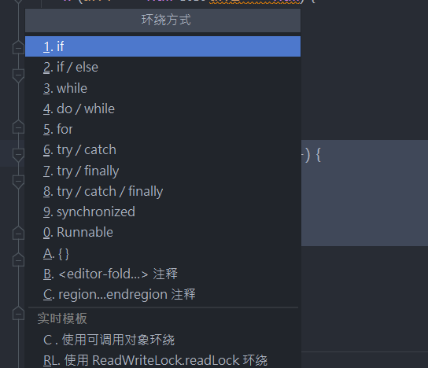

# 代码结构

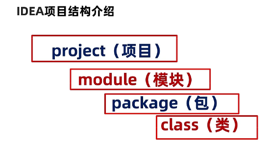

## **包机制**

+ 为了更好地组织类，Java 提供了包机制，用于区别类名的命名空间
  包语句的语法格式为:
  package pkg1[.pkg2[. pkg3...]
  + **一般利用公司域名倒置作为包名**
    为了能够使用某一个包的成员，我们需要在Java 程序中明确导入该包。使用"import"语句可
    完成此功能import package1[.package2..].(classname|*)

通常使用公司网址反写，可以有多层包，包名采用全部小写字母，多层包之间用”.”连接。
**类中包的声明格式：  package 包名.包名.包名…;** 
如：网址itheima.com，那么网址反写就为com.itheima

```java
package cn.itcast; //包的声明，必须在有效代码的第一行

import java.util.Scanner;
import java.util.Random;

public class Demo {}
```

**导包的格式： import 包名.类名; ** 

当程序导入指定的包后，使用类时，就可以简化了。

```java
//导入包前的方式
//创建对象
java.util.Random r1 = new java.util.Random();
        java.util.Random r2 = new java.util.Random();
        java.util.Scanner sc1 = new java.util.Scanner(System.in);
        java.util.Scanner sc2 = new java.util.Scanner(System.in);


//导入包后的方式
        import java.util.Random;
        import java.util.Scanner;
//创建对象
        Random r1 = new Random();
        Random r2 = new Random();
        Scanner sc1 = new Scanner(System.in);
        Scanner sc2 = new Scanner(System.in);
```

# 基础语法

## 注释

单行注释

```java
//这是一条单行注释 
public int i;
```

多行注释

```java
/* 这是
* 一段注释，
* 它跨越了多个行
*/ 
public void f() {}
}
```

文档注释 

```java
/** The first Thinking in Java example program.
* Lists system information on current machine.
* @author Bruce Eckel
* @author http://www.BruceEckel.com
* @version 1.0
*/
```

对于单行和多行注释，被注释的文字，不会被JVM解释执行；对于文档注释，可以被JDK提供的工具javadoc 所解析，生成一套以网页文件形式体现的该程序的说明文档；单行注释可以嵌套使用，多行注释不能嵌套使用。

## **关键字**

是被Java语言赋予特殊含义，具有专门用途的单词，比如class，int，double均为Java已经预设好的;

**组成关键字的字母全部小写** ,注意String不是关键字;Java 所有的组成部分都需要名字。类名。变量名以及方法名都被称为标识符

**goto与const是Java中的保留字，即没有赋予特殊含义却仍被Java占用的单词;**

## **标识符**

就是给类,接口,方法,变量等起名字时使用的字符序列,组成规则只能包含下面的内容,不能有其它内容:

-  英文大小写字母
- 数字字符
-  $和_

#### 注意事项

- **数字不能开头**
- 不可以使用关键字
- 严格区分大小写，不限制长度
- 起名时，尽量见名知意

#### 标识符中常见的命名规则

- 包名：多单词组成时所有字母均小写，使用.连接.比如：aaa.bbb.ccc
- 类名&接口名：大驼峰式。比如：AaaBbbCcc
- 变量名&方法名：小驼峰式。比如：aaaBbbCcc (个人喜欢)
- 常量名：多单词组成是所有字母均大写，使用_连接。比如：AAA_BBB_CCC

## 基本数据类型

Java是强类型语言，对于每一种数据都定义了明确的具体数据类型，变量必须要有明确的类型，什么类型的变量装载什么类型的数据。

### 数据类型的分类

#### 基本数据类型

基本数据类型是Java语言中内置的类型，分别是整数类型、小数类型、字符类型、布尔类型。

这四类基本类型是最简单、最基础的类型。

- 整数(byte、short、int、long)，默认的整数类型是int类型，long类型需添加"L"后缀。
- 小数(float、double)、字符类型(char)，默认的浮点类型是double类型。在Java中所有没有后缀以及使用“D”后缀（小写也可以，但建议使用大写）的小数都是double类型；float类型常量必须添加“F”后缀
- 字符类型（char）
- 布尔类型(boolean)

```JAVA
//整数
int num1 = 10;
byte num2 = 20;
short num3  = 30;
long num4  = 30L;   //Long类型要在数字后面加个L
    
//小数：浮点数
float num5 = 50.1F; //LfLoat类型要在数字后面加个
double num6 = 3.141592653589793238462643;
    
//字符
char name ='国';
        
//布尔值:	是非
boolean flag = true;
boolean flag2 = faLse;												
```

#### 引用数据类型

引用数据类型是强大的数据类型，它是基于基本数据类型创建的。JavaSE中提供了一个超级类库，类库中包含了近万种引用数据类型。**比如：数组、类、接口**。

```java
//字符串,String不是关键字，类
String namea = "指针";
```

**引用数据类型的使用**

与定义基本数据类型变量不同，引用数据类型的变量定义及赋值有一个相对固定的步骤或格式。

```java
数据类型  变量名 =  new 数据类型();
```

每种引用数据类型都有其功能，我们可以调用该类型实例使用其功能。

```java
变量名.方法名();
```

## **常量**

常量就是不变的数据量, 在程序执行的过程中其值不可以发生改变

**修饰符  final  不能被继承的**

```java
final double pi = 3.14;
```

### 常量分类

**整数类型**

- 十进制表示方式：正常数字，如 13、25等
- 二进制表示方式：以0b(0B)开头，如0b1011 、0B1001
- 十六进制表示方式：以0x(0X)开头，数字以0-9及A-F组成  如0x23A2、0xa、0x10
- 八进制表示方式：以0开头，如01、07、0721

**小数类型**，如1.0、-3.15、3.168等  (最好完全用同一种类型比较)

**布尔类型**， true、false

**字符类型**，字符必须使用’’ 包裹，并且其中只能且仅能包含一个字符。如'a'，'A', '0', '家'

**字符串类型**，一种引用类型，字符串必须使用""包裹，其中可以包含0~N个字符。如"我爱Java"，"0123"，""，"null"

#### **在程序中输出Java中的常量**

```java
public class Main {
    public static void main(String[] args) {
        //输出整数 十进制
        System.out.println(50);//50
        //输出整数，二进制, 数字开头0B
        System.out.println(0B11);//3
        //输出整数，八进制，数字开头0
        System.out.println(051);//41
        //输出整数，十六进制，数组开头0X  0-9 A-F
        System.out.println(0XE);//14
        //输出浮点数据
        System.out.println(5.0);//5.0
        //输出布尔数据，只有2个值，true，false 关键字
        System.out.println(true);//true
        System.out.println(false);//false
        //输出字符常量，单引号包裹，只能写1个字符
        System.out.println('a');//a
        //输出字符串常量，双引号包裹，可以写0-n个字符
        System.out.println("HelloWorld");//HelloWorld
    }
}
```

## **变量**

变量是内存中装载数据的小盒子，你只能用它来存数据和取数据。

### 定义变量

```java
数据类型  变量名  =  数据值；
int  a   =  100;
```

变量使用时有作用域的限制。

```java
public static void main(String[] args) {
    int x = 20;
    {
        int y = 20;
    }
    System.out.println(x);//读取x变量中的值，再打印
    System.out.println(y);//读取y变量中的值失败，失败原因，找不到y变量，因为超出了y变量作用范围，所以不能使用y变量
}
```

变量不可以重复定义。

```java
public static void main(String[] args){
      int x = 10;
      double x = 5.5;//编译失败，变量重复定义
}
```

### 数据类型转换

不同类型的变量可以在一起运算，但要先进行类型转换再运算。

- 范围小的数据类型值（如byte），可以直接转换为范围大的数据类型值（如int）；
- 范围大的数据类型值（如int），不可以直接转换为范围小的数据类型值（如byte）

**数据范围从小到大依次列出：byte -> short -> int -> long -> float -> double**

两种方式的数据类型转换


自动类型转换：表示范围小的数据类型转换成范围大的数据类型。格式：

```c++
范围大的数据类型 变量 = 范围小的数据类型值；
比如：double d = 1000; 
```

强制类型转换：表示范围大的数据类型转换成范围小的数据类型

```c++
范围小的数据类型  变量 = (范围小的数据类型) 范围大的数据类型值;
比如：int  i = (int)6.718;   //i的值为6
```

### 变量作用域

记忆:  **==类变量(static), 局部变量( 必须初始化值)—->直接用    实例变量—>new出来==** 

```c++
public class Variable {
    static int a11Clicks = 9:   //类变量(static)
    String str = "hello world"；  //实例变量
        
    public void method() {
        int i =0；              //局部变量
    }
}
```

**使用方式:**

```java
public class variable {

    // N01. 类变量: 加了static
    static double salary = 2000;


    //N02. 实例变量：从属于对象；如果不自行初始化，这个类型的默认值 0 0.0(相当于全局变量)(默认公有c++默认私有)
    //布尔值：默认是false //除了基本类型，其余的默认值都是null；
    String name;
    int age;

    //main方法
    public static void main(String[] args) {

        //N02. 局部变量 // 必须初始化值
        int i = 10;
        System.out.println(i);;

        //N02. 实例变量使用(需要new出对象) //变量类型 变量名字 = new variable()；
        variable var = new variable();
        System.out.println(var.age);
        System.out.println(var.name);

        //类变量 static (直接用)
        System.out.println(salary);
    }
    
    public void add(){
        
	}
}
```

##  运算符

**算数运算符**

加号（ +）、减号和负号（ -）、乘号（ *）、除号（ /）、取模（%）、自增（++）、自减（--）以及等号（ =）的用法与其他所有编程语言都是类似的 。

++,--运算符后置时，先使用变量a原有值参与运算操作，运算操作完成后，变量a的值自增1或者自减1。

l ++，--运算符前置时，先将变量a的值自增1或者自减1，然后使用更新后的新值参与运算操作。

**赋值运算符**

赋值（=）、加后赋值（+=）、减后赋值（-=）、乘后赋值（*=）、整除后赋值（/=）取模后赋值（%=）的用法与其他所有编程语言都是类似的 。

 **关系运算符**

等于（==）  不等于（!=） 小于（<） 大于（>）  小于等于（<=） 大于等于（>=）的用法与其他所有编程语言都是类似的 。

 **逻辑运算符**

与（&&）、或（||）、非（!）的用法与其他所有编程语言都是类似的 。

短路：当使用与或者或时，只要能判断出结果则后边的部分就不再判断。

 **三元运算符**

(条件表达式)？表达式1：表达式2；

```
int n = (3>2 && 4>6) ? 100 : 200;
//逻辑运算后的结果为false，运算结果为表达式2的值200,然后将结果200赋值给了变量n
```

## 输入输出

### 输入

#### Scanner类

Scanner类可以完成用户键盘录入，获取到录入的数据。

```java
导包： import   java.util.Scanner; 
```

```java
创建对象实例：Scanner sc = new Scanner(System.in); 
```

调用方法：

```java
int  i = sc.nextInt(); //用来接收控制台录入的数字
String s = sc.next();  //用来接收控制台录入的字符串, 接受下一个
```

例子:

**读取整数,小数:**

```c++
import java.util.Scanner;
public class ScannerDemo01 {
    public static void main(String[] args) {
        //创建Scanner引用类型的变量
        Scanner sc = new Scanner(System.in);
        //获取数字
        System.out.println("请输入一个数字");
        int n = sc.nextInt();
        System.out.println("n的值为" + n);
        //获取字符串
        String str = sc.next();
        System.out.println("str的值为" + str);
    }
}
```

运行结果如下图所示:

 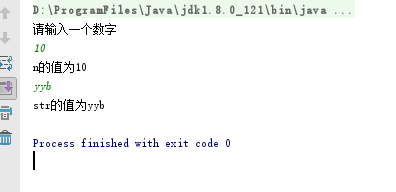

**单个输入:**

```java
scanner.next()
```

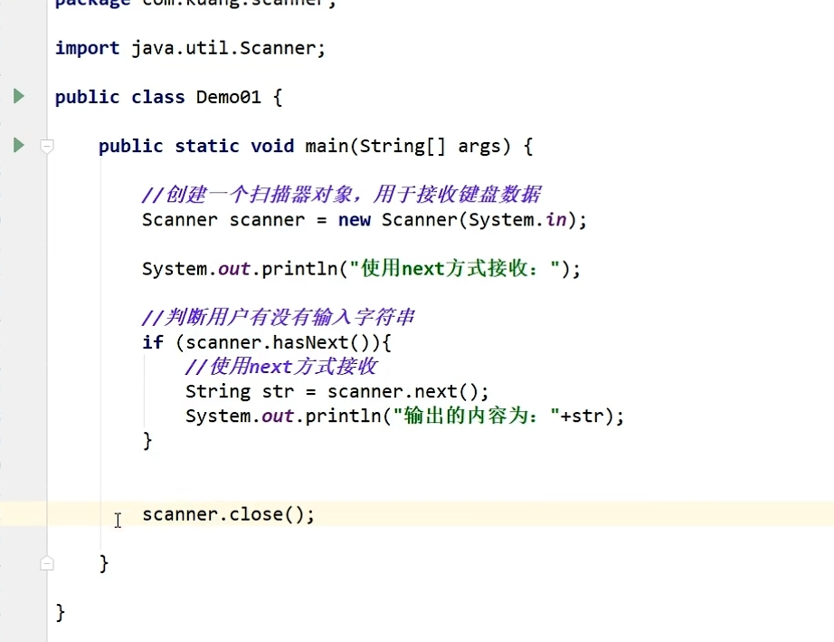

**整行输入:**

```java
scanner.nextLine()
```

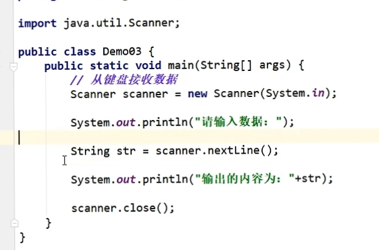

### 输出

```java
System.out.println(sum);         // 换行
System.out.print(sum);           // 不换行
System.out.printf("%d", sum);    // 格式化
```

%12d： “d” 表示decima Integer, 即十进制整数。12表示输出的最小空间为12。如果输出的数没有占满12位，输出会自动用空格占满前方。这也被称为“right-justified in a field of length 12”。 如果输出的是大于12位，所有的位都会被printf。

%12.1f：“f”表示double 类型。"1"表示小数点后保留几位. "12" 表示被输出的最小character数。如果输出的数没有占满12位，输出会自动用空格占满前方。

%15.5e： “e”表示指数（用于表示very big values），“15”同上， "5" 表示转化后的数小数点后保留5位。

%1.[5g](https://so.csdn.net/so/search?q=5g&spm=1001.2101.3001.7020)： “g”表示指数（用于表示very small values）， “1”同上， "5" 表示转化后的数小数点后保留5位。

```java
# 代码
double amount = 2.111;
System.out.printf( "%1.2f", amount );
 
#输出
2.11
 
#代码
int amount = 2;
System.out.printf( "%12d", amount );
 
#输出 (前面有11位空格）
           2
 
# 代码
double amount = 1.11;
System.out.printf( "%12.1f", amount);
 
#输出(前面有9位空格）
         1.1
 
#代码
double amount = 0.000000011;
System.out.printf( "%1.5g", amount );
 
#输出（小数点后保留5位）
1.10000e-08
 
#代码
double amount = 1100000000;
System.out.printf( "%1.5e", amount );
 
#输出（小数点后保留5位）
1.10000e+09
```

## **随机数类Random**

`java.util.Random`类来产生一个随机数发生器，也是最常用的一种，构造函数有两个，`Random()`和`Random(long seed)`。

- 第一个就是以当前时间为默认种子
- 第二个是以指定的种子值进行。

种子就是产生随机数的第一次使用值，随机是通过一个函数，将这个种子的值转化为随机数空间中的某一个点上，并且产生的随机数均匀的散布在空间中。以后产生的随机数都与前一个随机数有关。

```java
public static void main(String[] args) {
    Random rand = new Random();
    for (int i = 0; i < 10; i++) {
        System.out.println(rand.nextInt(100) + 1);
    }
}
```

**获得指定位随机数**

随机两位整数

```java
rand.nextInt(90) + 10; 
```

生成随机三位数的代码为：

```java
rand.nextInt(900) + 100;
```

**获取指定范围随机数**

生成区间 [64,128] 中随机值的代码为：

```java
rand.nextInt(65)+ 64;
```

最终公式如下：

```java
int randNumber = MIN + rand.nextInt(MAX - MIN + 1);
```

randNumber 属于`[MIN, MAX]`

```java
public void test1() {
    Random rand = new Random();
    int MAX = 100, MIN = 1;
    for (int i = 0; i < 10; i++) {
        System.out.print(rand.nextInt(MAX - MIN + 1) + MIN + " ");
    }
}
//62 100 76 96 80 66 67 10 55 16 
```

## 流程控制语句

### 选择结构if

if…else if…else语句用于对多个条件进行判断，进行多种不同的处理。if…else if…else语句具体语法格式如下：

```java
if (判断条件1) {
　　执行语句1
} else if (判断条件2) {
　　执行语句2
}
...
else if (判断条件n) {
　　执行语句n
} else {
　　执行语句n+1
}
```

### **switch语句**

格式如下：

```java
switch(整数选择因子或者字符串或者枚举) {
　　case 整数值 1 : 语句; break;
　　case 整数值 2 : 语句; break;
　　case 整数值 3 : 语句; break;
　　case 整数值 4 : 语句; break;
　　case 整数值 5 : 语句; break;
　　//..
　　default:语句;
}
```

switch 能将整数选择因子的结果与每个整数值比较。若发现相符的，就执行对应的语句（简单或复合语句）。若没有发现相符的，就执行default 语句。

### switch语句接受的数据类型

switch语句中的表达式的数据类型,是有要求的

- JDK1.0 - 1.4 数据类型接受 byte short int char
- JDK1.5 数据类型接受 byte short int char enum(枚举)
- JDK1.7 数据类型接受 byte short int char enum(枚举), String

在使用switch语句的过程中，如果多个case条件后面的执行语句是一样的，则该执行语句只需书写一次即可，这是一种简写的方式。

如下所示。SwitchDemo02.java

```
public class SwitchDemo02 {
    public static void main(String[] args) {
        int week = 2;
        switch (week) {
            case 1:
            case 2:
            case 3:
            case 4:
            case 5:
                // 当 week 满足值 1、2、3、4、5 中任意一个时，处理方式相同
                System.out.println("今天是工作日");
                break;
            case 6:
            case 7:
                // 当 week 满足值 6、7 中任意一个时，处理方式相同
                System.out.println("今天是休息日");
                break;
        }
    }
}
```

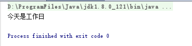

上述代码中，当变量week值为1、2、3、4、5中任意一个值时，处理方式相同，都会打印“今天是工作日”。同理，当变量week值为6、7中任意一个值时，打印“今天是休息日”。

## 循环语句

### while语句

while循环语句和选择结构if语句有些相似，都是根据条件判断来决定是否执行大括号内的执行语句。区别在于，while语句会反复地进行条件判断，只要条件成立，{}内的执行语句就会执行，直到条件不成立，while循环结束。while循环语句的语法结构如下：

```
while(循环条件){
    执行语句
    ………
}
```

### **循环语句for**

for循环语句是最常用的循环语句，一般用在循环次数已知的情况下。for循环语句的语法格式如下：

```
for（初始化表达式; 循环条件; 操作表达式）{

    执行语句
    ………
}

21.for --> 自动补全
```

在上面的语法结构中，for关键字后面()中包括了三部分内容：初始化表达式、循环条件和操作表达式，它们之间用“;”分隔，{}中的执行语句为循环体。

接下来分别用①表示初始化表达式、②表示循环条件、③表示操作表达式、④表示循环体，通过序号来具体分析for循环的执行流程。

### do…while语句

do…while循环语句和while循环语句功能类似，其语法结构如下：

```
do {

    执行语句
    ………
} while(循环条件);
```

在上面的语法结构中，关键字do后面{}中的执行语句是循环体。do…while循环语句将循环条件放在了循环体的后面。这也就意味着，循环体会无条件执行一次，然后再根据循环条件来决定是否继续执行。

 **无限循环**

最简单无限循环格式：

```
while(true){}

或

for(;;){}
```

无限循环存在的原因是并不知道循环多少次，而是根据某些条件，来控制循环。

 **循环嵌套**

嵌套循环是指在一个循环语句的循环体中再定义一个循环语句的语法结构。while、do…while、for循环语句都可以进行嵌套，并且它们之间也可以互相嵌套，如最常见的在for循环中嵌套for循环，格式如下：

```
for(初始化表达式; 循环条件; 操作表达式) {
    ………
    for(初始化表达式; 循环条件; 操作表达式) {
        执行语句
        ………
     }
    ………
}
```

## 跳转语句（break、continue）

跳转语句用于实现循环执行过程中程序流程的跳转，在Java中的跳转语句有break语句和continue语句。接下来分别进行详细地讲解。

### **break语句**

在switch条件语句和循环语句中都可以使用break语句。当它出现在switch条件语句中时，作用是终止某个case并跳出switch结构。当它出现在循环语句中，作用是跳出循环语句，执行后面的代码。

接下来通过下面一段代码，实现将当变量x的值为3时，使用break语句跳出循环，代码如下所示。BreakDemo.java

```
public class BreakDemo {
    public static void main(String[] args) {
        int x = 1; // 定义变量x，初始值为1
        while (x <= 4) { // 循环条件
            System.out.println("x = " + x); // 条件成立，打印x的值
            if (x == 3) {
                break;
            }
            x++; // x进行自增
        }
    }
}
```

```
在上述带代码中，通过while循环打印x的值，当x的值为3时使用break语句跳出循环。因此打印结果中并没有出现“x=4”。
```

### **标记**

当break语句出现在嵌套循环中的内层循环时，它只能跳出内层循环，如果想使用break语句跳出外层循环则需要对外层循环添加标记。接下来将ForForDemo.java稍作修改，控制程序只打印4行“*”，如下所示。BreakDemo02.java

```
public class BreakDemo02 {
    public static void main(String[] args) {
        int i, j; // 定义两个循环变量
        AA: for (i = 1; i <= 9; i++) { // 外层循环
            for (j = 1; j <= i; j++) { // 内层循环
                if (i > 4) { // 判断i的值是否大于4
                    break AA; // 跳出外层循环
                }
                System.out.print("*"); // 打印*
            }
            System.out.print("\n"); // 换行
        }
    }
}
```


BreakDemo02.java与ForForDemo.java实现原理类似，只是在外层for循环前面增加了标记“AA”。当i>4时，使用break AA;语句跳出外层循环。因此程序只打印了4行“*”。

### **continue语句**

continue语句用在循环语句中，它的作用是终止本次循环，执行下一次循环。接下来通过一个练习对1~100之内的奇数求和，ContinueDemo.java

```
public class ContinueDemo {
    public static void main(String[] args) {
        int sum = 0; // 定义变量sum，用于记住和
        for (int i = 1; i <= 100; i++) {
            if (i % 2 == 0) { // i是一个偶数，不累加
                continue; // 结束本次循环
            }
            sum += i; // 实现sum和i的累加
        }
        System.out.println("sum = " + sum);
    }
}
//sum = 2500
```

上述代码中，使用for循环让变量i的值在1~100之间循环，在循环过程中，当i的值为偶数时，将执行continue语句结束本次循环，进入下一次循环。当i的值为奇数时，sum和i进行累加，最终得到1~100之间所有奇数的和，打印“sum = 2500”。

在嵌套循环语句中，continue语句后面也可以通过使用标记的方式结束本次外层循环，用法与break语句相似，在此不再举例说明。

## 数组

### 一维数组(new)

**静态初始化:**

```java
类型[] 数组名 = {元素，元素，元素，……};
```

```java
int[] a = {1, 2, 3};
```

**动态初始化(推荐):**

```java
类型[] 数组名 = new 类型[]{元素，元素，……};
```

```java
int[] a = new int[3];
a[0] = 1;
a[1] = 2;
a[2] = 3;
```

### 二维数组

**初始化:**

```java
类型[][] 数组名 = new 类型[][]{元素，元素，……};
```

**二维数组的创建**

**静态初始化**

**(1)定义的同时赋值**

```java
int [][]arr={{1,2,3},{4,5,6},{7,8,9}};
```

```java
public class AiMing {
    public static void main(String[] args) {
        int arr[][]={{1,2,3},{4,5,6},{7,8,9}};
        for(int i=0;i<arr.length;i++)
        {
            for(int j=0;j<arr[i].length;j++)
            {
                System.out.print(arr[i][j]+" ");
            }
            System.out.println();
        }
    }
}
```

运行结果如下: 

```cobol
1 2 3 
4 5 6 
7 8 9
```

**动态初始化**

**(2)先声明，后创建数组对象**

```java
int [][] arr;
arr=new int[3][3];
```

```java
public class AiMing {
    public static void main(String[] args) {
        int arr[][];//声明二维数组
        arr=new int [3][3];//创建数组对象
        for(int i=0;i<arr.length;i++)
        {
            for(int j=0;j<arr[i].length;j++)
            {
                System.out.print(arr[i][j]+" ");
            }
            System.out.println();
        }
    }
}
```

运行结果如下:

```cobol
0 0 0 
0 0 0 
0 0 0 
```

**(3)在声明的同时创建数组对象**

```java
int [][] arr =new int [3][3];   //c++不能动态申请行时同时申请列
```

```java
public class AiMing {
    public static void main(String[] args) {
        int [][] arr =new int [3][3];
        for(int i=0;i<arr.length;i++)
        {
            for(int j=0;j<arr[i].length;j++)
            {
                System.out.print(arr[i][j]+" ");
            }
            System.out.println();
        }
    }
}
```

运行结果如下:

```cobol
0 0 0 
0 0 0 
0 0 0 
```

**Java中 length 和 length()的区别**

在Java中,str.length针对的是[数组](https://so.csdn.net/so/search?q=数组&spm=1001.2101.3001.7020)，而str.length()针对的是针对的字符串

**数组(str.length)** 的特点有：长度固定，类型固定。因此数组的长度就可以被视为是一种数组的属性

输入：

```java
int arr[] = new int[3];
int arr1[] = {1,2,3,3,4,5}; 
System.out.println(arr.length);
System.out.println(arr1.length);
1234
```

输出：

```java
3
6
12
```

**字符串(str.length())** : string 的内部机制是一个 char 数组，而 char 数组有自己的长度属性，所以 string 就没必要再去设置一个属性（多余的操作）

输入：

```java
string str = "what a pity world!";
System.out.println(str,length（）);
12
```

输出：

```java
17
```

**JVM内存划分**

 JVM对自己的内存划分为5个区域

- 寄存器:内存和CUP之间
- 本地方法栈: JVM调用了系统中的功能
- 方法和数据共享: 运行时期class文件进入的地方
- 方法栈:所有的方法运行的时候进入内存
- 堆:存储的是容器和对象

 **数组的内存**

int[] x; // 声明一个int[]类型的变量
x = new int[100]; // 创建一个长度为100的数组
接下来，通过两张内存图来详细地说明数组在创建过程中内存的分配情况。
第一行代码 int[] x; 声明了一个变量x，该变量的类型为int[]，即一个int类型的数组。变量x会占用一块内存单元，它没有被分配初始值
第二行代码 x = new int[100]; 创建了一个数组，将数组的地址赋值给变量x。在程序运行期间可以使用变量x来引用数组，这时内存中的状态会发生变化


 **数组中常见的异常**

数组操作中,常见的两个异常
数组的索引越界异常
空指针异常

**二维数组内存图**

举例:int[][] arr = new int[3][4];
外层数组长在内存开辟连续的3个大的内存空间,每一个内存空间都对应的有地址值
每一个大内存空间里又开辟连续的四个小的内存空间.

 

## 方法(类方法)

### **方法的语法格式**

在Java中，声明一个方法的具体语法格式如下：

```java
修饰符 返回值类型 方法名(参数类型 参数名1,参数类型 参数名2,．．．．．．){ 
    执行语句
    ……… 
    return 返回值;
}
```

- 修饰符：方法的修饰符比较多，有对访问权限进行限定的，有静态修饰符static，还有最终修饰符final等，这些修饰符在后面的学习过程中会逐步介绍
- 返回值类型：用于限定方法返回值的数据类型
- 参数类型：用于限定调用方法时传入参数的数据类型
- 参数名：是一个变量，用于接收调用方法时传入的数据
- return关键字：用于结束方法以及返回方法指定类型的值
- 返回值：被return语句返回的值，该值会返回给调用者

**方法使用的注意事项**

- 方法不调用，自己不执行
- 方法中不能定义方法， 但是，方法中可以调用方法
- 方法定义的位置在类中，其他方法的外面
- 方法中的“参数类型 参数名1，参数类型 参数名2”被称作参数列表，它用于描述方法在被调用时需要接收的参数，如果方法不需要接收任何参数，则参数列表为空，即()内不写任何内容。
- 如果方法没有明确的返回值类型，使用'空'类型， void表示
- void只能在方法返回值类型位置使用，不能作为普通的数据类型使用
- 如果方法返回值类型为void类型，可以省略 return ;

### 方法的调用

```java
public class Student{
    
    // 静态方法
	public static void say1(){
		System.out.println("学生说话了")；
	}
        
    // 非静态方法
    public void say2(){
		System.out.println("学生说话了")；
	}
    
    public static void main(String[] args){
		say1();  // 静态方法直接调用
        
        // 非静态方法调用
        Student student = new Student;
        student.say2();
    }
}
```

ps:	几乎和类变量一样

静态方法 和 非静态方法, 两者区别:

+ **静态方法和类一起加载,  非静态方法在类实例化之后才存在**
+ **静态方式可以直接用,非静态必须new出对象来**

###  方法的重载

Java允许在一个类中定义多个名称相同的方法，但是参数的类型或个数必须不同，这就是方法的重载。

比如，下面的三个方法互为重载关系

```java
public static int add(int x,int y) {逻辑} //两个整数加法

public static int add(int x,int y,int z) {逻辑} //三个整数加法

public static int add(double x,double y) {逻辑} //两个小数加法
```

接下来演示方法重载的方式如下所示。

```java
public class MethodDemo03 {
    public static void main(String[] args) {
        // 下面是针对求和方法的调用
        int sum1 = add(1, 2);
        int sum2 = add(1, 2, 3);
        double sum3 = add(1.2, 2.3);
        // 下面的代码是打印求和的结果
        System.out.println("sum1=" + sum1);
        System.out.println("sum2=" + sum2);
        System.out.println("sum3=" + sum3);
    }

    // 下面的方法实现了两个整数相加
    public static int add(int x, int y) {
        return x + y;
    }
    // 下面的方法实现了三个整数相加
    public static int add(int x, int y, int z) {
        return x + y + z;
    }
    // 下面的方法实现了两个小数相加
    public static double add(double x, double y) {
        return x + y;
    }
}
```


**重载的注意事项**

重载方法参数必须不同：

- 参数个数不同，如method(int x)与method(int x,int y)不同
- 参数类型不同，如method(int x)与method(double x)不同
- 参数顺序不同，如method(int x,double y)与method(double x,int y)不同

重载只与方法名与参数类型相关，与返回值无关。如void method(int x)与int method(int y)不是方法重载，不能同时存在

重载与具体的变量标识符无关。如method(int x)与method(int y)不是方法重载，不能同时存在

  **参数传递**

定义方法时，参数列表中的变量，我们称为形式参数

调用方法时，传入给方法的数值，我们称为实际参数

#### 参数传递图解与结论

 

通过上面的两段程序可以得出如下结论：

- 当调用方法时，如果传入的数值为基本数据类型（包含String类型），形式参数的改变对实际参数不影响
- 当调用方法时，如果传入的数值为引用数据类型（String类型除外），形式参数的改变对实际参数有影响

#### 命令行传参

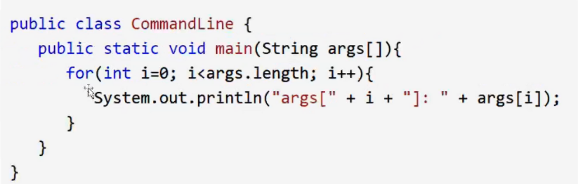

#### 可变参数

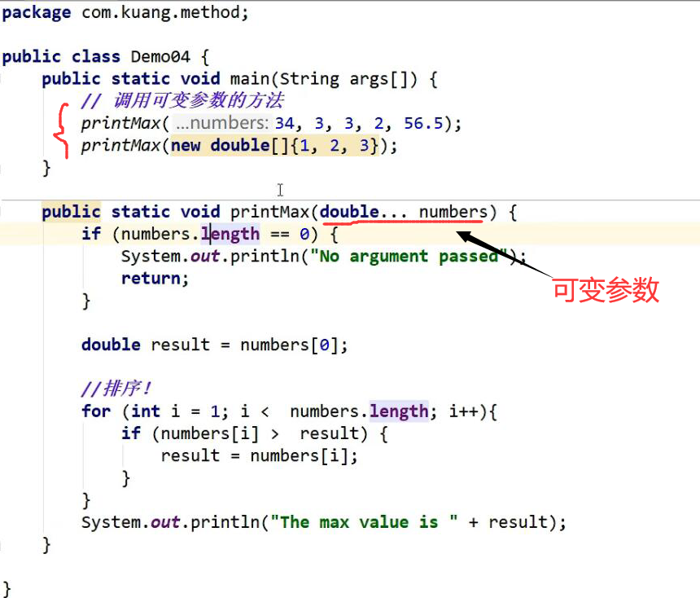


## ArrayList集合

### 集合的创建

创建集合的常用格式在此说明一下：
1、导包：import java.util.ArrayList;
2、创建对象：与其他普通的引用数据类型创建方式完全相同，但是要指定容器中存储的数据类型：
3、ArrayList<要存储元素的数据类型> 变量名 = new ArrayList<要存储元素的数据类型>();

- 集合中存储的元素，只能为<>括号中指定的数据类型元素；
- “<要存储元素的数据类型>”中的数据类型必须是引用数据类型，不能是基本数据类型；

下面给出8种基本数据类型所对应的引用数据类型表示形式:
基本数据类型 对应的引用数据类型表示形式

```
byte　　——> 　　Byte
short    ——>　　Short
Int　　——>    Integer
long    ——>　　Long
float    ——>　　Float
double    ——>　　Double
char    ——>　　Character
boolean    ——>　　Boolean
```

我们通过举几个例子，来明确集合的创建方式：

```
//存储String类型的元素
ArrayList<String> list = new ArrayList<String>();
//存储int类型的数据
ArrayList<Integer> list = new ArrayList<Integer>(); 
//存储Phone类型的数据
ArrayList<Phone> list = new ArrayList<Phone>();
```

### 集合中常用方法

```
boolean add（Object obj）    //将指定元素obj追加到集合的末尾
Object get（int index）      //返回集合中指定位置上的元素
int size（）    　　　　　　   //返回集合中的元素个数
```

下面通过代码演示上述方法的使用。ArrayListDemo01.java

```
package arraylist;
import java.util.ArrayList;
public class ArrayListDemo01 {
    public static void main(String[] args) {
// 创建ArrayList集合
        ArrayList<String> list = new ArrayList<String>();
// 向集合中添加元素
        list.add("stu1");
        list.add("stu2");
        list.add("stu3");
        list.add("stu4");
// 获取集合中元素的个数
        System.out.println("集合的长度：" + list.size());
// 取出并打印指定位置的元素
        System.out.println("第1个元素是：" + list.get(0));
        System.out.println("第2个元素是：" + list.get(1));
        System.out.println("第3个元素是：" + list.get(2));
        System.out.println("第4个元素是：" + list.get(3));
    }
}
//集合的长度：4
//第1个元素是：stu1
//第2个元素是：stu2
//第3个元素是：stu3
//第4个元素是：stu4
```

强调一点，ArrayList集合相当于是一个长度可变的数组，所以访问集合中的元素也是采用索引方式访问，第一个元素存储在索引0的位置，第二个元素存储在索引1的位置，依次类推。

### 集合的遍历

通过集合遍历，得到集合中每个元素，这是集合中最常见的操作。集合的遍历与数组的遍历很像，都是通过索引的方式，集合遍历方式如下：ArrayListDemo02.java

```java
package arraylist;
import java.util.ArrayList;
public class ArrayListDemo02 {
    public static void main(String[] args) {
        //创建ArrayList集合
        ArrayList<Integer> list = new ArrayList<Integer>();
        //添加元素到集合
        list.add(13);
        list.add(15);
        list.add(22);
        list.add(29);
        //遍历集合
        for (int i = 0; i < list.size(); i++) {//[获取集合中元素的个数]
            //通过索引，获取到集合中每个元素
            int n = list.get(i);//[获取集合中指定位置上的元素值];
            System.out.println(n);
        }
    }
}
//13
//15
//22
//29
```

上述代码中，定义了一个可以存储int元素的集合；接着实现将int类型数值存储到集合中；接着实现遍历集合元素。这里要强调一点，get方法返回值的类型为集合中元素的类型。

### 集合中的常用方法补充

ArrayList集合提供的一些常用方法，如下：

```java
boolean add（int index, Object obj）      //将指定元素obj插入到集合中指定的位置
Object remove（int index）    　　　　　 　//从集合中删除指定index处的元素，返回该元素
void clear（）    　　　　　　　　　　　　   //清空集合中所有元素
Object set（int index, Object obj）      //用指定元素obj替代集合中指定位置上的元素
```

## 面向对象

### improt

####  **import关键字引入Java类库中的类**

1. import 语句的作用是：当某个类中想要引入不在同一个包中的某个类时，就需要通过 import 语句进行引入；

2. 因为用户编写的类是不与Java类库中的类同属于一个包中的，所以用户需要引入类库中的某个类时，就需要通过import语句进行引入；

3. 通过 import 语句可以引入Java类库中的类和接口；

**当需要引入Java类库中的某个类时，如下演示：**

```java
import java.util.Date ;
```

**当需要引入Java类库中一个包中的全部类时，如下演示：**

```java
import java.util.*;
```

方式1: 	**使用 java.util 包中的 Date 类来显示本地时间，就需要通过 import 语句进行引入；**

```java
package Chapter_Four;
import java.util.Date;
public class Import_Test {
 
	public static void main(String[] args) {
		//创建Date对象
		Date dt = new Date();                     // 核心
        //通过对象调用方法，显示时间
		System.out.println("当前时间为："+dt.toString());
	}
}
```

方式2:   **要是不用 import 语句引入包中的类，也可以直接通过 包名+类名 进行引入**

```java
package Chapter_Four;
public class Import_Test {
 
	public static void main(String[] args) {
		//创建Date对象
		java.util.Date dt = new java.util.Date();      // 核心
        //通过对象调用方法，显示时间                 
		System.out.println("当前时间为："+dt.toString());
	}
}
```

#### **import 引入用户自定义包中的类**

//**编写用于功能设计的类：**

```java
package Chapter_Three.tests;  // 该类自己所属包

public class tests {
     //设计三角形面积计算的功能
	double sidex,sidey,sidez;
	public double getArea(){
		double size = (sidex+sidey+sidez)/2.0 ;
		double area = Math.sqrt(size*(size-sidex)*(size-sidey)*(size-sidez));
		return area;
	}
	public void setArea(double x,double y,double z){
		sidex = x;
		sidey = y ;
		sidez = z ;
	}
}
```

//**编写用于实现功能的类：**

```java
package Chapter_Four.testMain;     // 该类自己所属包

import Chapter_Three.tests.tests;  // 引入用户自定义包中的类   // 核心

public class testMain {
	public static void main(String[] args) {
		
        //调用实现功能的类
		tests ct = new tests();
		ct.setArea(11,11,11);
        System.out.println("三角形的面积为："+ct.getArea());
	}
 
}
```

**代码输出：**

**三角形的面积为：52.39453692895854**

**需要注意的是，三角形两边之和要大于第三条边，否则程序输出：NaN
需要注意的是，三角形两边之和要大于第三条边，否则程序输出：NaN**

### 对象的创建

+ **通过new的方式创建对象** 
+ **通过反射操作类**

```java
class User{
	public  int age;
	private  String name;

	User(){
		age = 0;
		name = "L";
	}
}

// 测试类的创建
public static void main(String[] args)
{
     // 方式1:
    User u = new User();
    // 方式2:
    Class<?> c3 = User.class;  // 具体见注解
}
```

### 构造器(就c++中的构造函数)

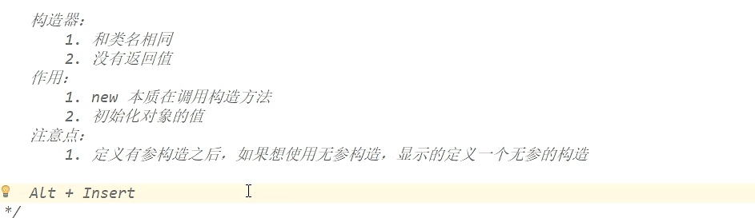

### this关键字

以在成员变量名前面加上this，来区别成员变量和局部变量。

```c++
class Person {
    private int age;
    private String name;

    public void speak() {
        this ( ) ;     //调用无参的构造方法
        this.name = "小强";
        this.age = 18;
        System.out.println("name=" + this.name + ",age=" + this.age);
    }
}
class PersonDemo {
    public static void main(String[] args) {
        Person p = new Person();
        p.speak();
    }
}
```

#### 创建对象内存分析

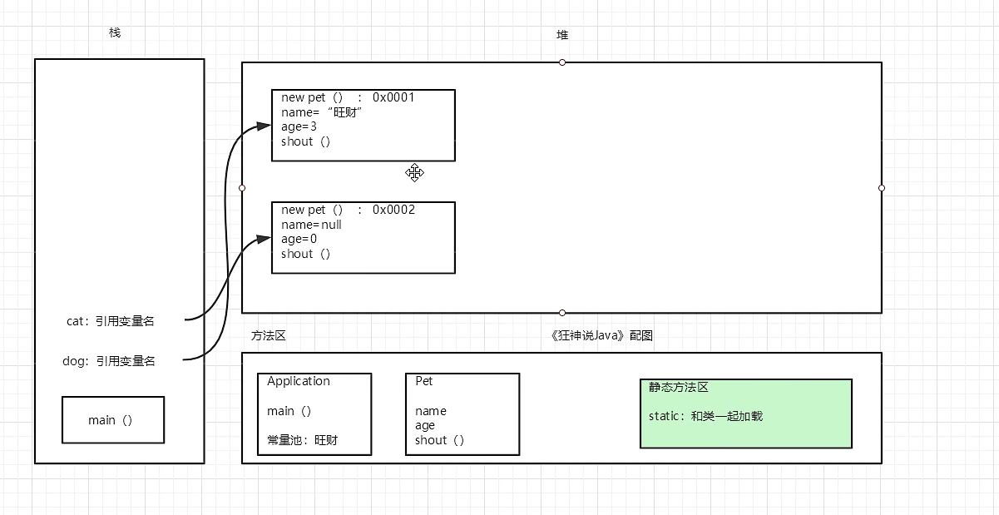

###  **封装(属性私有化)**

**访问权限表**

| 位置             | private | 默认   | protected | public |
| ---------------- | ------- | ------ | --------- | ------ |
| 同一个类         | 可以    | 可以   | 可以      | 可以   |
| 同一个包的类     | 不可以  | 可以   | 可以      | 可以   |
| 不同包的子类     | 不可以  | 不可以 | 可以      | 可以   |
| 不同包的不是子类 | 不可以  | 不可以 | 不可以    | 可以   |

```c++
class Person {
    // 类属性(这里是私有的)
    private int age;
    private String name;

    public void show() {
        System.out.println("age=" + age + ",name" + name);
    }
}
```

一般对成员属性的访问动作：赋值(设置 set)，取值(获取 get)，因此对私有的变量访问的方式可以提供对应的 setXxx或者getXxx的方法。

```c++
class Person {
    // 私有成员变量
    private int age;
    private String name;

    // 对外提供设置成员变量的方法
    public void setAge(int a) {
// 由于是设置成员变量的值，这里可以加入数据的验证
        if (a < 0 || a > 130) {
            System.out.println(a + "不符合年龄的数据范围");
            return;
        }
        age = a;
    }

    // 对外提供访问成员变量的方法
    public void getAge() {
        return age;
    }
}
```

### 继承**extends**

+ **[extends]()关键字**

```java
/*
* 定义员工类Employee
*/
public class Employee {
    String name; // 定义name属性
    // 定义员工的工作方法
    public void work() {
        System.out.println("尽心尽力地工作");
    }
}
```

```java
/*
* 定义研发部员工类Developer 继承 员工类Employee
*/
class Developer extends Employee {
    // 定义一个打印name的方法
    public void printName() {
        System.out.println("name=" + name);
    }
}
```

```java
/*
* 定义测试类
*/
public class Example01 {
    public static void main(String[] args) {
        Developer d = new Developer(); // 创建一个研发部员工类对象
        d.name = "小明"; // 为该员工类的name属性进行赋值
        d.printName(); // 调用该员工的printName()方法
        d.work(); // 调用Developer类继承来的work()方法
    }
}
```

注意 :

+ 在Java中，类只支持单继承，不允许多继承，也就是说一个类只能有一个直接父类，

  ```java
  class A{} 
  class B{}
  class C extends A,B{} // C类不可以同时继承A类和B类
  ```

#### 方法的重写

==相当于c++的虚函数==

当子类需要父类的功能，而功能主体子类有自己特有内容时，可以重写父类中的方法

+  在子类中，访问父类中的成员方法格式： super.父类中的成员方法(); 
+  为什么需要重写:
   + 父类的功能，子类不一定需要，或者不一定满足
     A1t + Insert；override;

**不能重写的**

1. static方法，属子类， 它不属于实例
2. finaL常量;
3. private方法;

```java
//手机类
class Phone{
    public void sendMessage(){
        System.out.println("发短信");
    }
    public void call(){
        System.out.println("打电话");
    }
    public void showNum(){
        System.out.println("来电显示号码");
    }
}

//智能手机类
class NewPhone extends Phone{

    //覆盖父类的来电显示号码功能，并增加自己的显示姓名和图片功能
    public void showNum(){             
        super.showNum();  //调用父类已经存在的功能使用super
		//增加自己特有显示姓名和图片功能
        System.out.println("显示来电姓名");
        System.out.println("显示头像");
    }
}
```

####  子父类中出现同名成员变量时

当子父类中出现了同名成员变量时，在子类中若要访问父类中的成员变量，必须使用关键字super来完成。super用来表示当前对象中包含的父类对象空间的引用。

+  在子类中，访问父类中的成员变量格式： super.父类中的成员变量 

```java
class Fu
{
    //Fu中的成员变量。
    int num = 5;
}
class Zi extends Fu
{
    //Zi中的成员变量
    int num = 6;
    void show()
    {
//子父类中出现了同名的成员变量时
//在子类中需要访问父类中非私有成员变量时，需要使用super关键字
//访问父类中的num
        System.out.println("Fu num="+super.num);
//访问子类中的num2
        System.out.println("Zi num2="+this.num);
    }
}
class Demo5
{
    public static void main(String[] args)
    {
        Zi z = new Zi(); //创建子类对象
        z.show(); //调用子类中的show方法
    }
}
```


### 多态

#### 多态的定义与使用格式

**相当于c++的父类指针可以指向子类指针**

多态的定义格式：就是父类的引用变量指向子类对象

```java
父类类型 变量名 = new 子类类型();
变量名.方法名();
```

普通类多态定义的格式

```java
父类 变量名 = new 子类();
如：  
class Fu {}
class Zi extends Fu {}

//类的多态使用
Fu f = new Zi();
```

抽象类多态定义的格式

```c
抽象类 变量名 = new 抽象类子类();
```

比如：

```
abstract class Fu {
    public abstract void method();
}
class Zi extends Fu {
    public void method(){
        System.out.println("重写父类抽象方法");
    }
}
//类的多态使用
Fu fu= new Zi();
```

接口多态定义的格式

```c
接口 变量名 = new 接口实现类();
```

比如：

```
interface Fu {
    public abstract void method();
}
class Zi implements Fu {
    public void method(){
        System.out.println("重写接口抽象方法");
    }
}
//接口的多态使用
Fu fu = new Zi();
```

####  注意事项

同一个父类的方法会被不同的子类重写。在调用方法时，调用的为各个子类重写后的方法。

```
Person p1 = new Student();
Person p2 = new Teacher();
p1.work(); //p1会调用Student类中重写的work方法
p2.work(); //p2会调用Teacher类中重写的work方法
```

当变量名指向不同的子类对象时，由于每个子类重写父类方法的内容不同，所以会调用不同的方法。

#### 多态-成员的特点

多态出现后会导致子父类中的成员变量有微弱的变化。看如下代码

```
class Fu {
    int num = 4;
}
class Zi extends Fu {
    int num = 5;
}
class Demo {
    public static void main(String[] args) {
        Fu f = new Zi();
        System.out.println(f.num);//4
        Zi z = new Zi();
        System.out.println(z.num);//5
    }
}
```

**多态成员变量**

当子父类中出现同名的成员变量时，多态调用该变量时：
编译时期：参考的是引用型变量所属的类中是否有被调用的成员变量。没有，编译失败。
运行时期：也是调用引用型变量所属的类中的成员变量。
简单记：编译和运行都参考等号的左边。编译运行看左边。

多态出现后会导致子父类中的成员方法有微弱的变化。看如下代码

```
class Fu {
    int num = 4;
    void show()    {
        System.out.println("Fu show num");
    }
}
class Zi extends Fu {
    int num = 5;
    void show()    {
        System.out.println("Zi show num");
    }
}
class Demo {
    public static void main(String[] args) {
        Fu f = new Zi();
        f.show();
    }
}
```

**多态成员方法**

编译时期：参考引用变量所属的类，如果没有类中没有调用的方法，编译失败。
运行时期：参考引用变量所指的对象所属的类，并运行对象所属类中的成员方法。
简而言之：编译看左边，运行看右边。

#### instanceof关键字

我们可以通过instanceof关键字来判断某个对象是否属于某种数据类型。如学生的对象属于学生类，学生的对象也属于人类。
使用格式：

```
boolean b = 对象 instanceof 数据类型;
```

如

```
Person p1 = new Student(); // 前提条件，学生类已经继承了人类
boolean flag = p1 instanceof Student; //flag结果为true
boolean flag2 = p2 instanceof Teacher; //flag结果为false
```

#### 多态-转型

多态的转型分为向上转型与向下转型两种：

1. 把子类转换为父类，向上转型:  自动

2. 把父类转换为子类，向下转型：强制转换

向上转型：当有子类对象赋值给一个父类引用时，便是向上转型，多态本身就是向上转型的过程。
使用格式：父类类型 变量名 = new 子类类型(); 如：Person p = new Student();
向下转型：一个已经向上转型的子类对象可以使用强制类型转换的格式，将父类引用转为子类引用，这个过程是向下转型。如果是直接创建父类对象，是无法向下转型的！
使用格式：子类类型 变量名 = (子类类型) 父类类型的变量; 如:Student stu = (Student) p; 

**多态的好处与弊端**

当父类的引用指向子类对象时，就发生了向上转型，即把子类类型对象转成了父类类型。向上转型的好处是隐藏了子类类型，提高了代码的扩展性。
但向上转型也有弊端，只能使用父类共性的内容，而无法使用子类特有功能，功能有限制。看如下代码

```
//描述动物类，并抽取共性eat方法
abstract class Animal {
    abstract void eat();
}

// 描述狗类，继承动物类，重写eat方法，增加lookHome方法
class Dog extends Animal {
    void eat() {
        System.out.println("啃骨头");
    }

    void lookHome() {
        System.out.println("看家");
    }
}

// 描述猫类，继承动物类，重写eat方法，增加catchMouse方法
class Cat extends Animal {
    void eat() {
        System.out.println("吃鱼");
    }

    void catchMouse() {
        System.out.println("抓老鼠");
    }
}

public class Test {
    public static void main(String[] args) {
        Animal a = new Dog(); //多态形式，创建一个狗对象
        a.eat(); // 调用对象中的方法，会执行狗类中的eat方法
// a.lookHome();//使用Dog类特有的方法，需要向下转型，不能直接使用

// 为了使用狗类的lookHome方法，需要向下转型
// 向下转型过程中，可能会发生类型转换的错误，即ClassCastException异常
// 那么，在转之前需要做健壮性判断 
        if( !a instanceof Dog){ // 判断当前对象是否是Dog类型
            System.out.println("类型不匹配，不能转换");
            return;
        }
        Dog d = (Dog) a; //向下转型
        d.lookHome();//调用狗类的lookHome方法
    }
}
```

+ **对象能执行哪里方法，主要看对象左边的类型:** 


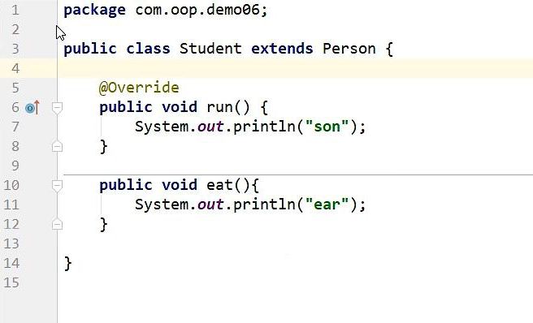

### 接口

对比:

+ 普通类：只有具体实现

+ 抽象类: 具体实现和规范(抽象方法)都有
+ 接口：只有规范！自己无法写方法~专业的约束

**[interface]()   接口 **  (有点像c++里的头文件)   和 [implements]() 结合使用 

一切事物均有功能，即一切事物均有接口。

作用:

1. 约束

2. 定义一些方法，让不同的人实现～10

3. public abstract
4. public static fina]
5. 接口不能被实例化,  接口中没有构造方法
6. implements可以实现多个接口(相当于解决了java继承只能单继承)
7. 必须要重写接口中的方法~

#### 接口的定义

```java
public interface 接口名 {
    抽象方法1;
    抽象方法2;
    抽象方法3;
    数据(默认为常量);
}
```

#### 类实现接口

```java
class 类 implements 接口名 {
    重写接口中方法
} 
```

#### 接口的多实现

```java
interface Fu1
{
    void show1();
}
interface Fu2
{
    void show2();
}
class Zi implements Fu1,Fu2// 多实现。同时实现多个接口。
{
    public void show1(){}
    public void show2(){}
}
```

多个接口之间也可以使用extends进行继承。

```java
interface Fu1{
    void show();
}
interface Fu2{
    void show1();
}
interface Fu3{
    void show2();
}
interface Zi extends Fu1,Fu2,Fu3{
    void show3();
}
```

#### 类继承类同时实现接口

```java
class Fu {
    public void show(){}
}
interface Inter {
    pulbic abstract void show1();
}
class Zi extends Fu implements Inter {
    public void show1() {
    }
}
```

#### 接口和抽象的区别

```java
interface 缉毒{
    public abstract void 缉毒();
}
//定义犬科的这个提醒的共性功能
abstract class 犬科{
    public abstract void 吃饭();
    public abstract void 吼叫();
}
// 缉毒犬属于犬科一种，让其继承犬科，获取的犬科的特性，

//由于缉毒犬具有缉毒功能，那么它只要实现缉毒接口即可，这样即保证缉毒犬具备犬科的特性，也拥有了缉毒的功能
class 缉毒犬 extends 犬科 implements 缉毒{

    public void 缉毒() {
    }
    void 吃饭() {
    }
    void 吼叫() {
    }
}
class 缉毒猪 implements 缉毒{
    public void 缉毒() {
    }
}
```

相同点:

- 都位于继承的顶端,用于被其他类实现或继承;
- 都不能直接实例化对象;
- 都包含抽象方法,其子类都必须覆写这些抽象方法;

区别:

- 抽象类为部分方法提供实现,避免子类重复实现这些方法,提高代码重用性;接口只能包含抽象方法;
- 一个类只能继承一个直接父类(可能是抽象类),却可以实现多个接口;(接口弥补了Java的单继承)
- 抽象类是这个事物中应该具备的内容, 继承体系是一种 is..a关系
- 接口是这个事物中的额外内容,继承体系是一种 like..a关系

二者的选用:
优先选用接口,尽量少用抽象类;

例子:

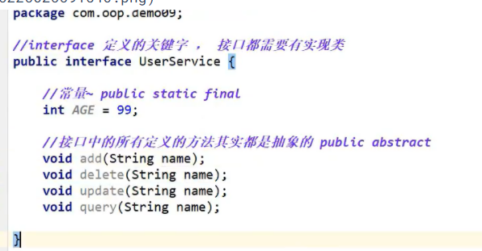


#### 类与类，类与接口，接口与接口之间的关系

类与类之间：继承关系，单继承，可以是多层继承
类与接口之间: 实现关系，单实现，也可以多实现
接口与接口之间：继承关系，单继承，也可以是多继承
Java中的类可以继承一个父类的同时，实现多个接口

## final、static、匿名对象、内部类

### final关键字

final是个修饰符，它可以用来修饰类，类的成员，以及局部变量。

#### final的特点

final修饰类不可以被继承，但是可以继承其他类。

```java
class Yy {}
final class Fu extends Yy{} //可以继承Yy类
class Zi extends Fu{} //不能继承Fu类
//final修饰的方法不可以被覆盖,但父类中没有被final修饰方法，子类覆盖后可以加final。
```

```java
class Fu {
    // final修饰的方法，不可以被覆盖，但可以继承使用
    public final void method1(){}
    public void method2(){}
}
class Zi extends Fu {
    //重写method2方法
    public final void method2(){}
}
```

```java
final修饰的变量称为常量，这些变量只能赋值一次。
 final int i = 20;
 i = 30; //赋值报错，final修饰的变量只能赋值一次
引用类型的变量值为对象地址值，地址值不能更改，但是地址内的对象属性值可以修改。
final Person p = new Person();
Person p2 = new Person();
p = p2; //final修饰的变量p，所记录的地址值不能改变
p.name = "小明";//可以更改p对象中name属性值
//p不能为别的对象，而p对象中的name或age属性值可更改。
//修饰成员变量，需要在创建对象前赋值，否则报错。(当没有显式赋值时，多个构造方法的均需要为其赋值。)
```

```java
class Demo {
    //直接赋值
    final int m = 100;

    //final修饰的成员变量，需要在创建对象前赋值，否则报错。
    final int n;
    public Demo(){
    //可以在创建对象时所调用的构造方法中，为变量n赋值
        n = 2016;
    }
}
```

### **static关键字**

被static修饰的成员变量属于类，不属于这个类的某个对象。

核心:   共享,初始化一次

注意:  

1. ==静态内容是优先于对象存在，只能访问静态，不能使用this/super。静态修饰的内容存于静态区。==

2. ==同一个类中，静态成员只能访问静态成员。==

```java
class Demo {
    //静态成员变量
    public static int num = 100;
    //静态方法
    public static void method(){
        System.out.println("静态方法");
    }
}
class Test {
    public static void main(String[] args) {
        System.out.println(Demo.num);
        Demo.method();
    }
}
```

**其它:**

1. **静态代码块**

   ```java
   public class Person {
   //2：赋初值
   {
   System.out.println("匿名代码块")
   }
       
   //1：只执行一次
   static {
   System.out .println("静态代码块")
   }
       
   //3
   public Person(）{
   System.out .println("构造方法")
   }
   ```


2. **静态导入包**


### 抽象类

**[abstract](javascript:;)   标识符**(c++里没有这个)

**注意: 抽象类abstract不能直接实例化, 只能指向子类**

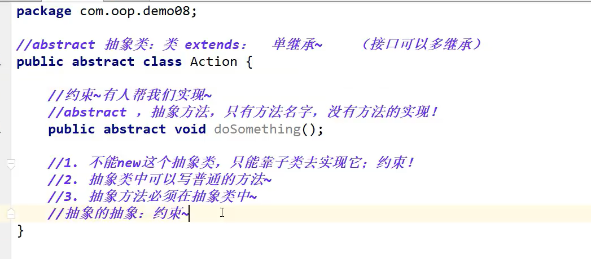

### 匿名对象

匿名对象是指创建对象时，只有创建对象的语句，却没有把对象地址值赋值给某个变量。

```java
public class Person{
    public void eat(){
        System.out.println();
    }
}

//创建一个普通对象
Person p = new Person();
//创建一个匿名对象
new Person();
```

匿名对象的特点：

创建匿名对象直接使用，没有变量名。

```
new Person().eat() //eat方法被一个没有名字的Person对象调用了。
```

匿名对象在没有指定其引用变量时，只能使用一次。

```
new Person().eat(); 创建一个匿名对象，调用eat方法
new Person().eat(); 想再次调用eat方法，重新创建了一个匿名对象
```

匿名对象可以作为方法接收的参数、方法返回值使用

```java
class Demo {
    public static Person getPerson(){
//普通方式
//Person p = new Person(); 
//return p;

//匿名对象作为方法返回值
        return new Person();
    }
    public static void method(Person p){}
}
class Test {
    public static void main(String[] args) {
//调用getPerson方法，得到一个Person对象
    Person person = Demo.getPerson();
//调用method方法
    Demo.method(person);
//匿名对象作为方法接收的参数
    Demo.method(new Person());
    }
}
```

### 内部类

#### 内部类的分类

定义格式：

```java
class 外部类 {
    修饰符 class 内部类 {
    //其他代码
    }
}
```

访问方式： 外部类名.内部类名 变量名 = new 外部类名().new 内部类名();

```java
class Body {//外部类，身体
    private boolean life = true; //生命状态

    public class Heart { //内部类，心脏
        public void jump() {
            System.out.println("心脏噗通噗通的跳")
            System.out.println("生命状态" + life); //访问外部类成员变量
        }
    }
}

//访问内部类
public static void main(String[] args) {
//创建内部类对象
   Body.Heart bh = new Body().new Heart();
//调用内部类中的方法
   bh.jump();
}
```

#### 匿名内部类(实际)

定义的匿名内部类有两个含义：

- 临时定义某一指定类型的子类
- 定义后即刻创建刚刚定义的这个子类的对象

定义匿名内部类的作用与格式
作用：匿名内部类是创建某个类型子类对象的快捷方式。
格式：

```java
new 父类或接口(){
    //进行方法重写
};
```

```java
//已经存在的父类：
public abstract class Person{
    public abstract void eat();
}
	//定义并创建该父类的子类对象，并用多态的方式赋值给父类引用变量
	Person p = new Person(){
  		 public void eat() {
            System.out.println(“我吃了”);
       	}
	};

//调用eat方法
p.eat();
```

##### 1.一般情况的内部类

**public类可以没有，但是如果有的话，public修饰的类名必须与源文件名保持一致；并有且仅有一个**

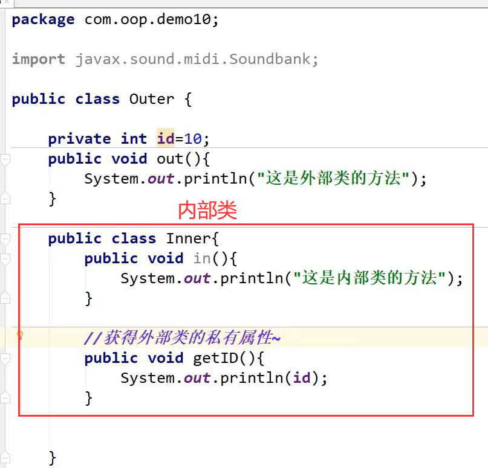

**调用 : **

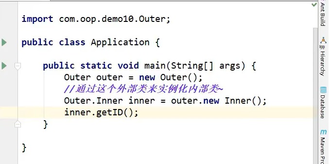

##### **2. 局部内部类**

**在一个类的方法里面:**

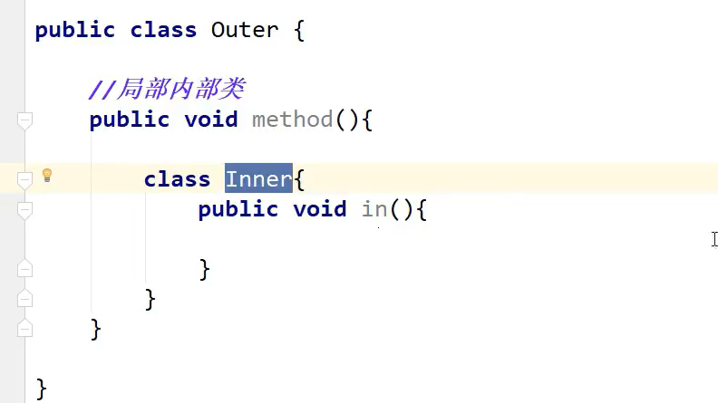


##### 3. 没有名字的初始化类

**可以简单的使用方法**

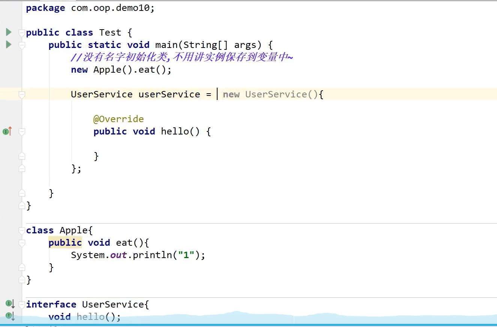


# 常用API

## 正则表达式

正则表达式（英语：Regular Expression，在代码中常简写为regex）。正则表达式是一个字符串，使用单个字符串来描述、用来定义匹配规则，匹配一系列符合某个句法规则的字符串。在开发中，正则表达式通常被用来检索、替换那些符合某个规则的文本。

### 正则表达式的匹配规则

参照帮助文档，在Pattern类中有正则表达式的的规则定义，正则表达式中明确区分大小写字母。我们来学习语法规则。

正则表达式的语法规则：

```
字符：x
含义：代表的是字符x
例如：匹配规则为 "a"，那么需要匹配的字符串内容就是 ”a”
字符：\\
含义：代表的是反斜线字符'\'
例如：匹配规则为"\\" ，那么需要匹配的字符串内容就是 ”\”
字符：\t
含义：制表符
例如：匹配规则为"\t" ，那么对应的效果就是产生一个制表符的空间
字符：\n
含义：换行符
例如：匹配规则为"\n"，那么对应的效果就是换行,光标在原有位置的下一行
字符：\r
含义：回车符
例如：匹配规则为"\r" ，那么对应的效果就是回车后的效果,光标来到下一行行首
字符类：[abc]
含义：代表的是字符a、b 或 c
例如：匹配规则为"[abc]" ，那么需要匹配的内容就是字符a，或者字符b，或字符c的一个
字符类：[^abc]
含义：代表的是除了 a、b 或 c以外的任何字符
例如：匹配规则为"[^abc]"，那么需要匹配的内容就是不是字符a，或者不是字符b，或不是字符c的任意一个字符
字符类：[a-zA-Z]
含义：代表的是a 到 z 或 A 到 Z，两头的字母包括在内
例如：匹配规则为"[a-zA-Z]"，那么需要匹配的是一个大写或者小写字母
字符类：[0-9]
含义：代表的是 0到9数字，两头的数字包括在内
例如：匹配规则为"[0-9]"，那么需要匹配的是一个数字
字符类：[a-zA-Z_0-9]
含义：代表的字母或者数字或者下划线(即单词字符)
例如：匹配规则为" [a-zA-Z_0-9] "，那么需要匹配的是一个字母或者是一个数字或一个下滑线
预定义字符类：.
含义：代表的是任何字符
例如：匹配规则为" . "，那么需要匹配的是一个任意字符。如果，就想使用 . 的话，使用匹配规则"\\."来实现
预定义字符类：\d
含义：代表的是 0到9数字，两头的数字包括在内，相当于[0-9]
例如：匹配规则为"\d "，那么需要匹配的是一个数字
预定义字符类：\w
含义：代表的字母或者数字或者下划线(即单词字符)，相当于[a-zA-Z_0-9]
例如：匹配规则为"\w "，，那么需要匹配的是一个字母或者是一个数字或一个下滑线
边界匹配器：^
含义：代表的是行的开头
例如：匹配规则为^[abc][0-9]$ ，那么需要匹配的内容从[abc]这个位置开始, 相当于左双引号
边界匹配器：$
含义：代表的是行的结尾
例如：匹配规则为^[abc][0-9]$ ，那么需要匹配的内容以[0-9]这个结束, 相当于右双引号
边界匹配器：\b
含义：代表的是单词边界
例如：匹配规则为"\b[abc]\b" ，那么代表的是字母a或b或c的左右两边需要的是非单词字符([a-zA-Z_0-9])
数量词：X?
含义：代表的是X出现一次或一次也没有
例如：匹配规则为"a?"，那么需要匹配的内容是一个字符a，或者一个a都没有
数量词：X*
含义：代表的是X出现零次或多次
例如：匹配规则为"a*" ，那么需要匹配的内容是多个字符a，或者一个a都没有
数量词：X+
含义：代表的是X出现一次或多次
例如：匹配规则为"a+"，那么需要匹配的内容是多个字符a，或者一个a
数量词：X{n}
含义：代表的是X出现恰好 n 次
例如：匹配规则为"a{5}"，那么需要匹配的内容是5个字符a
数量词：X{n,}
含义：代表的是X出现至少 n 次
例如：匹配规则为"a{5, }"，那么需要匹配的内容是最少有5个字符a
数量词：X{n,m}
含义：代表的是X出现至少 n 次，但是不超过 m 次
例如：匹配规则为"a{5,8}"，那么需要匹配的内容是有5个字符a 到 8个字符a之间
```

### 正则表达式规则匹配练习

请写出满足如下匹配规则的字符串:

规则："[0-9]{6,12}"

该规则需要匹配的内容是：长度为6位到12位的数字。如：使用数据"123456789"进行匹配结果为true；使用数据"12345"进行匹配结果为false。

 

规则："1[34578][0-9]{9}"

该规则需要匹配的内容是：11位的手机号码，第1位为1，第2位为3、4、5、7、8中的一个，后面9位为0到9之间的任意数字。

如：使用数据"12345678901"进行匹配结果为false；使用数据"13312345678"进行匹配结果为true。

 

规则："a*b"

该规则需要匹配的内容是：在多个a或零个a后面有个b；b必须为最后一个字符。

如：使用数据"aaaaab"进行匹配结果为true；使用数据"abc"进行匹配结果为false。

### 字符串类中涉及正则表达式的常用方法

public boolean matches(String regex) //判断字符串是否匹配给定的规则

举例：校验qq号码.

1: 要求必须是5-15位数字

2: 0不能开头

代码演示：

```
String qq = "604154942";
String regex = "[1-9][0-9]{4,14}";
boolean flag2 = qq.matches(regex);
```

举例：校验手机号码

1：要求为11位数字

2：第1位为1，第2位为3、4、5、7、8中的一个，后面9位为0到9之间的任意数字。

代码演示：

```
String phone = "18800022116";
String regex = "1[34578][0-9]{9}";
boolean flag = phone.matches(regex);
```

public String[] split(String regex) //根据给定正则表达式的匹配规则，拆分此字符串

举例：分割出字符串中的的数字

[](javascript:void(0);)

```
代码演示：String s = "18-22-40-65";
String regex = "-";
String[] result = s.split(regex);

代码演示：
String s = "18 22 40 65";
String regex = " ";
String[] result = s.split(regex);
```

[](javascript:void(0);)

public String replaceAll(String regex,String replacement)//将符合规则的字符串内容，全部替换为新字符串

举例：把文字中的数字替换成*

代码演示：

```
String s = "Hello12345World6789012";
String regex = "[0-9]";
String result = s.replaceAll(regex, "*");
```

### 正则表达式练习

匹配正确的数字，匹配规则：

匹配正整数：”\\d+”

匹配正小数：”\\d+\\.\\d+”  

匹配负整数：”-\\d+”

匹配负小数：”-\\d+\\.\\d+”

匹配保留两位小数的正数：”\\d+\\.\\d{2}”

匹配保留1-3位小数的正数：”\\d+\\.\\d{1,3}”

匹配合法的邮箱，匹配规则：

”[a-zA-Z_0-9]+@[a-zA-Z_0-9]+(\\.[a-zA-Z_0-9]+)+”

”\\w+@\\w+(\\.\\w+)+”

获取IP地址(192.168.1.100)中的每段数字，匹配规则：

　　”\\.”

## Date

类 Date 表示特定的瞬间，精确到毫秒。

继续查阅Date类的描述，发现Date拥有多个构造函数，只是部分已经过时，但是其中有未过时的构造函数可以把毫秒值转成日期对象。

```
//创建日期对象，把当前的毫秒值转成日期对象
Date date = new Date(1607616000000L);
System.out.println(date);
//打印结果：Fri Dec 11 00:00:00 CST 2020
```

可是将毫秒值转成日期后，输出的格式不利于我们阅读，继续查阅API，Date中有getYear、getMouth等方法，可以他们已经过时，继续往下查阅，看到了toString方法。

点开toString()方法查阅，原来上面打印的date对象就是默认调用了这个toString方法，并且在这个方法下面还有让我们参见toLocaleString方法，点进去，这个方法又过时了，从 JDK 1.1 开始，由 DateFormat.format(Date date) 取代。既然这个方法被DateFormat.format(Date date) 取代，那么就要去查阅DateFormat类。

### Date类常用方法

把日期对象转换成对应的时间毫秒值

```
  Date date = new Date();
  l=date.getTime();
  System.out.println(l);
```

毫秒的0点,时间原点; 公元1970年1月1日,午夜0:00:00 英国格林威治  毫秒值就是0

System.currentTimeMillis() 返回值long类型参数，用于获取当前日期的毫秒值 ，必须依赖毫秒值

## DateFormat

DateFormat 是日期/时间格式化子类的抽象类，它以与语言无关的方式格式化并解析日期或时间。日期/时间格式化子类（如 SimpleDateFormat类）允许进行格式化（也就是日期 -> 文本）、解析（文本-> 日期）和标准化。

我们通过这个类可以帮我们完成日期和文本之间的转换。

继续阅读API，DateFormat 可帮助进行格式化并解析任何语言环境的日期。对于月、星期，甚至日历格式（阴历和阳历），其代码可完全与语言环境的约定无关。

### 日期格式

要格式化一个当前语言环境下的日期也就是日期 -> 文本），要通过下面的方法来完成。DateFormat是抽象类，我们需要使用其子类SimpleDateFormat来创建对象。

构造方法


DateFormat类方法

 

代码演示：

```
//创建日期格式化对象,在获取格式化对象时可以指定风格
DateFormat df= new SimpleDateFormat("yyyy-MM-dd");//对日期进行格式化
Date date = new Date(1607616000000L);
String str_time = df.format(date);
System.out.println(str_time);//2020年12月11日
```

DateFormat类的作用：即可以将一个Date对象转换为一个符合指定格式的字符串，也可以将一个符合指定格式的字符串转为一个Date对象。

指定格式的具体规则我们可参照SimpleDateFormat类的说明，这里做简单介绍，规则是在一个字符串中，会将以下字母替换成对应时间组成部分，剩余内容原样输出：

- 当出现y时，会将y替换成年
- 当出现M时，会将M替换成月
- 当出现d时，会将d替换成日
- 当出现H时，会将H替换成时
- 当出现m时，会将m替换成分
- 当出现s时，会将s替换成秒

### DateFormat类常用方法

format方法，用来将Date对象转换成String

parse方法，用来将String转换成Date（转换时，该String要符合指定格式，否则不能转换）。

代码演示：

练习一：把Date对象转换成String

```
Date date = new Date(1607616000000L);//Fri Dec 11 00:00:00 CST 2020
DateFormat df = new SimpleDateFormat(“yyyy年MM月dd日”);
String str = df.format(date);
//str中的内容为2020年12月11日
```

练习二：把String转换成Date对象

```
String str = ”2020年12月11日”;
DateFormat df = new SimpleDateFormat(“yyyy年MM月dd日”);
Date date = df.parse( str );
//Date对象中的内容为Fri Dec 11 00:00:00 CST 2020
```

## Calendar

Calendar是日历类，在Date后出现，替换掉了许多Date的方法。该类将所有可能用到的时间信息封装为静态成员变量，方便获取。

Calendar为抽象类，由于语言敏感性，Calendar类在创建对象时并非直接创建，而是通过静态方法创建，将语言敏感内容处理好，再返回子类对象，如下：

### Calendar类静态方法

Calendar c = Calendar.getInstance();  //返回当前时间

### Calendar类常用方法

public static Calendar getInstance() //获取日期对象

public int get(int field)//获取时间字段值，字段参见帮助文档

YEAR 年

MONTH 月，从0开始算起，最大11；0代表1月，11代表12月。

DATE 天

HOUR 时

MINUTE分

SECOND秒

代码演示：

```
Calendar c = Calendar.getInstance();
int year = c.get(Calendar.YEAR);
```

public void add(int field,int amount)//指定字段增加某值

代码演示：

```
Calendar c = Calendar.getInstance();
//修改当前时间为3天后
c.add(Calendar.DATE, 3);
//修改当前时间为5小时后
c.add(Calendar.HOUR, 5);
```

public final void set(int field,int value)//设置指定字段的值

代码演示：

```
Calendar c = Calendar.getInstance();
//设置时间为2020年5月20日
c.set(Calendar.YEAR, 2020);
c.set(Calendar.MONTH, 4);
c.set(Calendar.DATE, 20);
```

public final Date getTime()//获取该日历对象转成的日期对象

代码演示：

```
Calendar c = Calendar.getInstance();
Date d = c.getTime();
```

注意事项

- 西方星期的开始为周日，中国为周一。
- 在Calendar类中，月份的表示是以0-11代表1-12月。
- 日期是有大小关系的，时间靠后，时间越大。

### 日期相关类练习

求出自己已经出生多少天

代码实现：

[](javascript:void(0);)

```
public static void main(String[] args) {
    Calendar my = Calendar.getInstance();
    //设置出生年月日 1995-05-10
    my.set(Calendar.YEAR, 1995);
    my.set(Calendar.MONTH, 4);
    my.set(Calendar.DATE, 10);
    //计算天数
    long day =(System.currentTimeMillis()-my.getTimeInMillis())/(24*60*60*1000L);
    System.out.println(day);
}
```

## 基本类型包装类

Java中有8种基本的数据类型，可是这些数据是基本数据，想对其进行复杂操作，变的很难。怎么办呢？
在实际程序使用中，程序界面上用户输入的数据都是以字符串类型进行存储的。而程序开发中，我们需要把字符串数据，根据需求转换成指定的基本数据类型，如年龄需要转换成int类型，考试成绩需要转换成double类型等。那么，想实现字符串与基本数据之间转换怎么办呢？
Java中提供了相应的对象来解决该问题，基本数据类型对象包装类：java将基本数据类型值封装成了对象。封装成对象有什么好处？可以提供更多的操作基本数值的功能。8种基本类型对应的包装类如下：


其中需要注意int对应的是Integer，char对应的Character，其他6个都是基本类型首字母大写即可。

**基本数据类型对象包装类特点：用于在基本数据和字符串之间进行转换。**

### 将字符串转成基本类型

解析 parse


parseXXX(String s);其中XXX表示基本类型，参数为可以转成基本类型的字符串，如果字符串无法转成基本类型，将会发生数字转换的问题 NumberFormatException

```
System.out.println(Integer.parseInt("123") + 2);
//打印结果为 125
```

### 将基本数值转成字符串

有3种方式：

- 基本类型直接与””相连接即可；34+""
- 调用String的valueOf方法；String.valueOf(34) ；


- **调用包装类中的toString方法**；Integer.toString(34) ；


### 基本类型和对象转换

使用int类型与Integer对象转换进行演示，其他基本类型转换方式相同。

### 基本数值---->包装对象

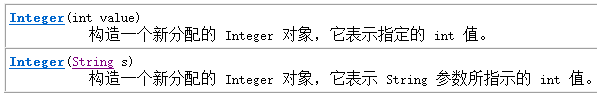


```
Integer i = new Integer(4);//使用构造函数函数
Integer ii = new Integer("4");//构造函数中可以传递一个数字字符串

Integer iii = Integer.valueOf(4);//使用包装类中的valueOf方法
Integer iiii = Integer.valueOf("4");//使用包装类中的valueOf方法
```

### 包装对象---->基本数值


```
int num = i.intValue();
```

### 自动装箱拆箱

在需要的情况下，基本类型与包装类型可以通用。有些时候我们必须使用引用数据类型时，可以传入基本数据类型。
比如：
基本类型可以使用运算符直接进行计算，但是引用类型不可以。而基本类型包装类作为引用类型的一种却可以计算，原因在于，Java”偷偷地”自动地进行了对象向基本数据类型的转换。
相对应的，引用数据类型变量的值必须是new出来的内存空间地址值，而我们可以将一个基本类型的值赋值给一个基本类型包装类的引用。原因同样在于Java又”偷偷地”自动地进行了基本数据类型向对象的转换。
自动拆箱：对象转成基本数值
自动装箱：基本数值转成对象

```
Integer i = 4;//自动装箱。相当于Integer i = Integer.valueOf(4);
i = i + 5;//等号右边：将i对象转成基本数值(自动拆箱) i.intValue() + 5; 加法运算完成后，再次装箱，把基本数值转成对象。
```

自动装箱(byte常量池)细节

当数值在byte范围之内时，进行自动装箱，不会新创建对象空间而是使用已有的空间。

[](javascript:void(0);)

```
Integer a = new Integer(3);
Integer b = new Integer(3);
System.out.println(a==b);//false
System.out.println(a.equals(b));//true

System.out.println("---------------------");
Integer x = 127;
Integer y = 127;
//在jdk1.5自动装箱时，如果数值在byte范围之内，不会新创建对象空间而是使用原来已有的空间。
System.out.println(x==y); //true
System.out.println(x.equals(y)); //true
```

[](javascript:void(0);)

## System类

在API中System类介绍的比较简单，我们给出定义，System中代表程序所在系统，提供了对应的一些系统属性信息，和系统操作。
System类不能手动创建对象，因为构造方法被private修饰，阻止外界创建对象。System类中的都是static方法，类名访问即可。在JDK中，有许多这样的类。
常用方法

currentTimeMillis() 获取当前系统时间与1970年01月01日00:00点之间的毫秒差值

exit(int status) 用来结束正在运行的Java程序。参数传入一个数字即可。通常传入0记为正常状态，其他为异常状态

gc() 用来运行JVM中的垃圾回收器，完成内存中垃圾的清除。

getProperty(String key) 用来获取指定键(字符串名称)中所记录的系统属性信息

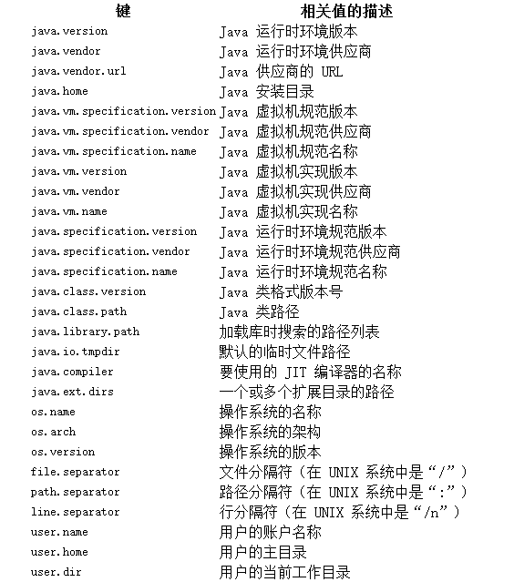

arraycopy方法，用来实现将源数组部分元素复制到目标数组的指定位置

### System类的方法练

验证for循环打印数字1-9999所需要使用的时间（毫秒）

```
public static void main(String[] args) {
        long start = System.currentTimeMillis();
        for (int i=0; i<10000; i++) {
            System.out.println(i);
        }
        long end = System.currentTimeMillis();
        System.out.println("共耗时毫秒：" + (end-start) );
    }
```

练习二：将src数组中前3个元素，复制到dest数组的前3个位置上

复制元素前：src数组元素[1,2,3,4,5]，dest数组元素[6,7,8,9,10]
复制元素后：src数组元素[1,2,3,4,5]，dest数组元素[1,2,3,9,10]

```
 public static void main(String[] args) {
        int[] src = new int[]{1,2,3,4,5};
        int[] dest = new int[]{6,7,8,9,10};
        System.arraycopy( src, 0, dest, 0, 3);
        //代码运行后：两个数组中的元素发生了变化

        //src数组元素[1,2,3,4,5]
        //dest数组元素[1,2,3,9,10]
    }
```

练习三：循环生成100-999之间的的三位数并进行打印该数，当该数能被10整除时，结束运行的程序

```
 public static void main(String[] args){
        Random random = new Random();
        while(true){
            int number = random.nextInt(900)+100; //0-899 + 100
            if (nmumber % 10 == 0) {
                System.exit(0);
            }
        }
    }
```

## Math类

Math 类是包含用于执行基本数学运算的方法的数学工具类，如初等指数、对数、平方根和三角函数。
类似这样的工具类[工具类，代表能够完成一系列功能的类，在使用它们时，不用创建对象，该类中方法为静态方法]，其所有方法均为静态方法，并且一般不会创建对象。如System类

常用方法

abs方法,结果都为正数

```
double d1 = Math.abs(-5); // d1的值为5
double d2 = Math.abs(5); // d2的值为5
```

ceil方法，结果为比参数值大的最小整数的double值

```
double d1 = Math.ceil(3.3); //d1的值为 4.0
double d2 = Math.ceil(-3.3); //d2的值为 -3.0double d3 = Math.ceil(5.1); // d3的值为 6.0
```

floor方法，结果为比参数值小的最大整数的double值

```
double d1 = Math.floor(3.3); //d1的值为3.0
double d2 = Math.floor(-3.3); //d2的值为-4.0
double d3 = Math.floor(5.1); //d3的值为 5.0
```

max方法，返回两个参数值中较大的值

```
double d1 = Math.max(3.3, 5.5); //d1的值为5.5
double d2 = Math.max(-3.3, -5.5); //d2的值为-3.3
```

min方法，返回两个参数值中较小的值

```
double d1 = Math.min(3.3, 5.5); //d1的值为3.3
double d2 = Math.max(-3.3, -5.5); //d2的值为-5.5
```

pow方法，返回第一个参数的第二个参数次幂的值

```
double d1 = Math.pow(2.0, 3.0); //d1的值为 8.0
double d2 = Math.pow(3.0, 3.0); //d2的值为27.0
```

round方法，返回参数值四舍五入的结果

```
double d1 = Math.round(5.5); //d1的值为6.0
double d2 = Math.round(5.4); //d2的值为5.0
```

random方法，产生一个大于等于0.0且小于1.0的double小数

```
double d1 = Math.random();
```

## Arrays类

此类包含用来操作数组（比如排序和搜索）的各种方法。需要注意，如果指定数组引用为 null，则访问此类中的方法都会抛出空指针异常NullPointerException。

### 常用方法

sort方法，用来对指定数组中的元素进行排序（元素值从小到大进行排序）

```
//源arr数组元素{1,5,9,3,7}, 进行排序后arr数组元素为{1,3,5,7,9}
int[] arr = {1,5,9,3,7};
Arrays.sort( arr );
```

toString方法，用来返回指定数组元素内容的字符串形式

```
int[] arr = {1,5,9,3,7};
String str = Arrays.toString(arr); // str的值为[1, 3, 5, 7, 9]
```

binarySearch方法，在指定数组中，查找给定元素值出现的位置。若没有查询到，返回位置为-1。要求该数组必须是个有序的数组。

```
int[] arr = {1,3,4,5,6};
int index = Arrays.binarySearch(arr, 4); //index的值为2
int index2= Arrasy.binarySearch(arr, 2); //index2的值为-1
```

### Arrays类的方法练习

练习一：定义一个方法，接收一个数组，数组中存储10个学生考试分数，该方法要求返回考试分数最低的后三名考试分数。

[](javascript:void(0);)

```
  public static int[] method(double[] arr){
        Arrays.sort(arr); //进行数组元素排序（元素值从小到大进行排序）
        int[] result = new int[3]; //存储后三名考试分数
        System.arraycopy(arr, 0, result, 0, 3);//把arr数组前3个元素复制到result数组中
        return result;
    }
```

[](javascript:void(0);)

## 大数据运算

### BigInteger

java中long型为最大整数类型,对于超过long型的数据如何去表示呢.在Java的世界中,超过long型的整数已经不能被称为整数了,它们被封装成BigInteger对象.在BigInteger类中,实现四则运算都是方法来实现,并不是采用运算符.
BigInteger类的构造方法:

构造方法中,采用字符串的形式给出整数
四则运算代码：

[](javascript:void(0);)

```
  public static void main(String[] args) {
//大数据封装为BigInteger对象
        BigInteger big1 = new BigInteger("12345678909876543210");
        BigInteger big2 = new BigInteger("98765432101234567890");
//add实现加法运算
        BigInteger bigAdd = big1.add(big2);
//subtract实现减法运算
        BigInteger bigSub = big1.subtract(big2);
//multiply实现乘法运算
        BigInteger bigMul = big1.multiply(big2);
//divide实现除法运算
        BigInteger bigDiv = big2.divide(big1);
    }
```

[](javascript:void(0);)

### BigDecimal

在程序中执行下列代码,会出现什么问题?

```
System.out.println(0.09 + 0.01);
System.out.println(1.0 - 0.32);
System.out.println(1.015 * 100);
System.out.println(1.301 / 100);
```

double和float类型在运算中很容易丢失精度,造成数据的不准确性,Java提供我们BigDecimal类可以实现浮点数据的高精度运算

构造方法如下:

建议浮点数据以字符串形式给出,因为参数结果是可以预知的
实现加法减法乘法代码如下:

[](javascript:void(0);)

```
 public static void main(String[] args) {
//大数据封装为BigDecimal对象
        BigDecimal big1 = new BigDecimal("0.09");
        BigDecimal big2 = new BigDecimal("0.01");
//add实现加法运算
        BigDecimal bigAdd = big1.add(big2);

        BigDecimal big3 = new BigDecimal("1.0");
        BigDecimal big4 = new BigDecimal("0.32");
//subtract实现减法运算
        BigDecimal bigSub = big3.subtract(big4);

        BigDecimal big5 = new BigDecimal("1.105");
        BigDecimal big6 = new BigDecimal("100");
//multiply实现乘法运算
        BigDecimal bigMul = big5.multiply(big6);
    }
```

# 异常

异常继承体系总结：

- Throwable: 它是所有错误与异常的超类（祖宗类）
- Error 错误
- Exception 编译期异常,进行编译JAVA程序时出现的问题
- RuntimeException 运行期异常, JAVA程序运行过程中出现的问题

异常与错误的区别

异常：指程序在编译、运行期间发生了某种异常(XxxException)，我们可以对异常进行具体的处理。若不处理异常，程序将会结束运行。


捕获抛出异常

###  捕获抛出异常

快捷键 ctrl alt 7 / ctrl alt t

**代码块的捕获异常**

**catch  *v.*接住；抓住，**

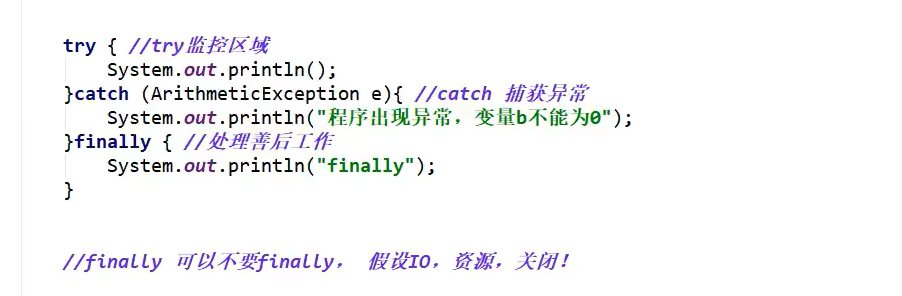


自动填写代码

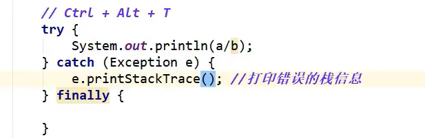


**throw   *v.*投，掷，抛**

**抛出方法的异常**

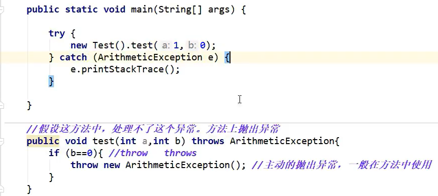

###  自定义异常类

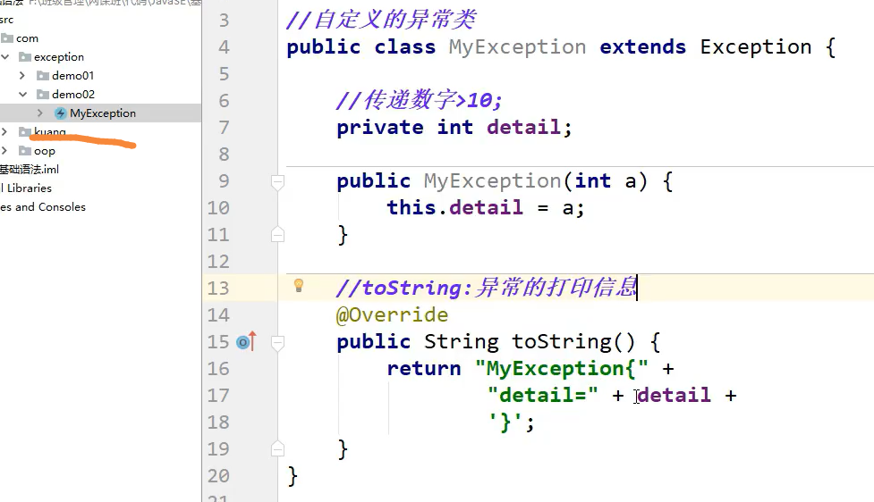

**test ; **


# java Switch语法 中能使用 String


