# 一 JVM介绍

## 1.1 什么是JVM

JVM是Java Virtual Machine（[Java虚拟机](https://baike.baidu.com/item/Java虚拟机/6810577)）的缩写，JVM是一种用于计算设备的规范，它是一个虚构出来的[计算机](https://baike.baidu.com/item/计算机/140338)，是通过在实际的计算机上仿真模拟各种计算机功能来实现的。

引入Java语言虚拟机后，Java语言在不同平台上运行时不需要重新编译。Java语言使用Java虚拟机屏蔽了与具体平台相关的信息，使得Java语言[编译程序](https://baike.baidu.com/item/编译程序/8290180)只需生成在Java虚拟机上运行的目标代码（[字节码](https://baike.baidu.com/item/字节码/9953683) class），就可以在多种平台上不加修改地运行。


开源

JSR-292  JVM标准规范


## 1.2 为什么要学JVM

 	程序出现OOM（内存溢出），不知道怎么去解决

上线后不在知道怎么设置JVM参数，智能采用默认

面试的时候不知道怎么回答 

## 1.3 JVM发展史

1990年，在sun计算机公司中，由Jams Gosling 领导的小组Green，开发出新的程序语言，命名与Oak，后重新命名与Java（爪哇到）logo。

1995年，sun正式发布Java和HotJava产品，Java首次公开亮相。

1996年，sun公司发布JDK1.0

1998年，JDK1.2版本发布，同时发布了JSP/Servlet/EJB规范，以及java分成J2ME  J2SE  J2EE.表面java开始向企业、桌面应用和移动设备应用3大领域挺进。

2000年，JDK1.3发布， java hotspot virtual machine正式发布，成为Java的默认虚拟机。

2003年，java平台的scala正式发布，同年Groovy也加入了java

2004年，JDK1.5发布，同年jdk1.5改名javase 5.0.

2006年，JDK6发布，同年，java开源并建立OpenJDK。HotSpot虚拟机也成为了 OpenJDK的默认虚拟机。

2007年，java平台迎来了新伙伴clojuer

2008年，oralce收购了BEA，得到了JRockit虚拟机。

2009年，Twitter宣布把后台大部分程序从Ruby迁移到Scala，这是Java平台的又一次大规模应用。

2010年，oralce收购sun，获得java和两个虚拟机Hotspot和JRockit。整合:HotRocit。

2011年,  JDK7发布，正式启用垃圾回收G1

2017年，JDK9发布，将G1设置成默认的GC，替代CMS，同年IBM  J9开源。

2018年，Android的java侵权判决，Google赔偿Oralce计88亿美金，同年oralce宣告JavaEE成为历史，JDBC/JMS/SERVLET赠送给eclipse基金会，同年，JDK11发布，LTS版本的JDK，发布革命性的ZGC，调整JDK授权许可。

2019年，JDK12发布，加入RedHat领导开发的shenandoah GC   

# 二、JVM的体系结构

语言排行榜：https://www.tiobe.com/tiobe-index/


## 2.1 java虚拟机的所在位置


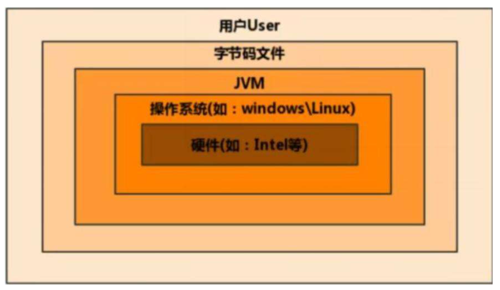


## 2.2 JDK 结构图

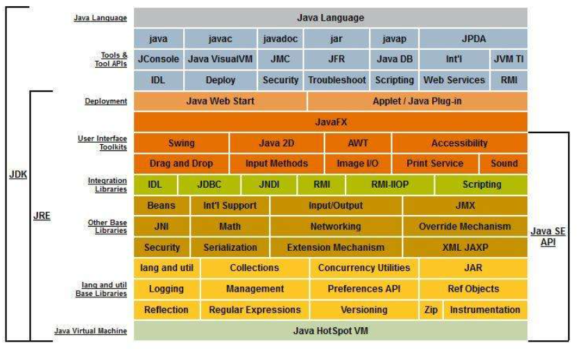


## 2.3 JVM的整体结构

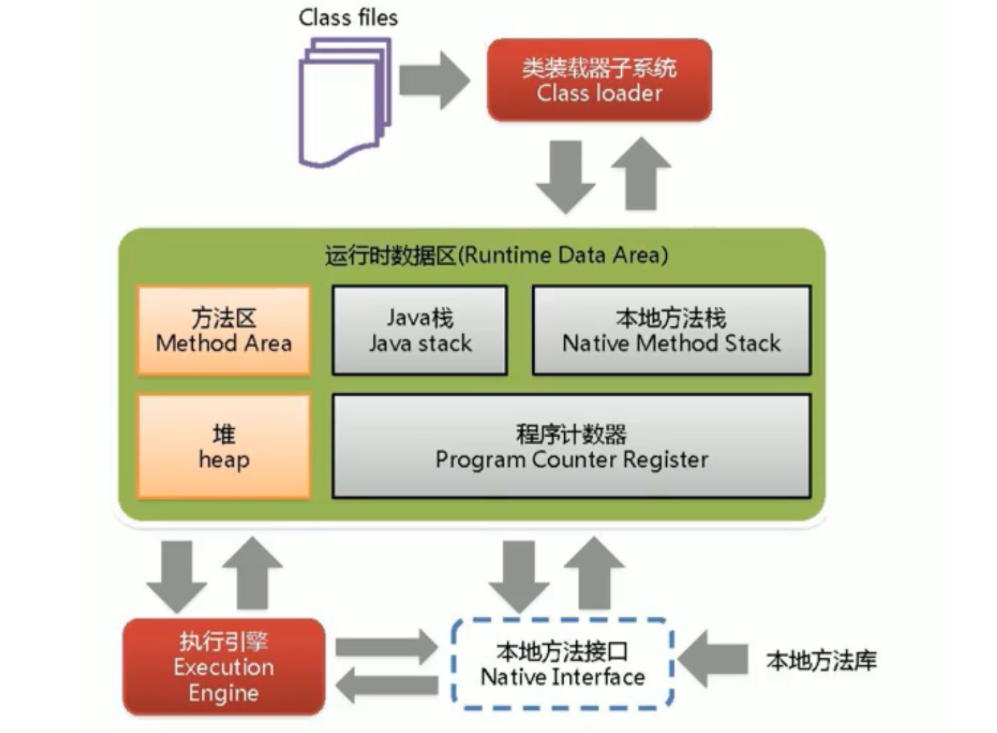

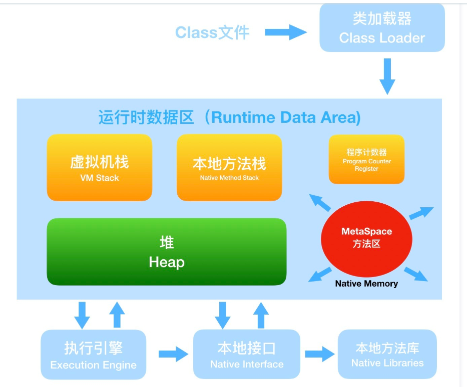

上图在用的Hotspot虚拟机  j9


## 2.4 JDK7和JDK8内存内存结构区别

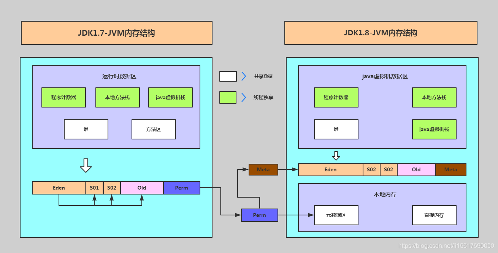


# 三 各模块详细讲解

### 3.1 java classloader代码执行流程

https://blog.csdn.net/Xxy605/article/details/123089053

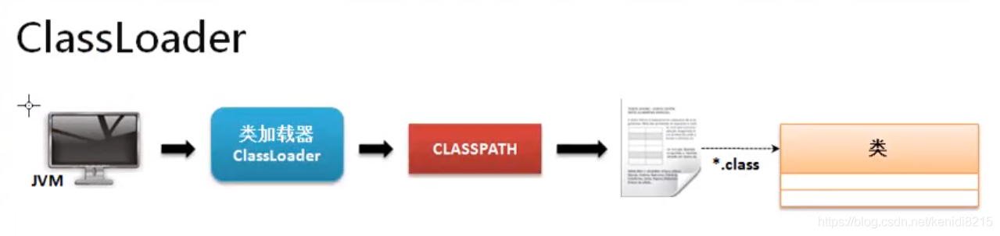

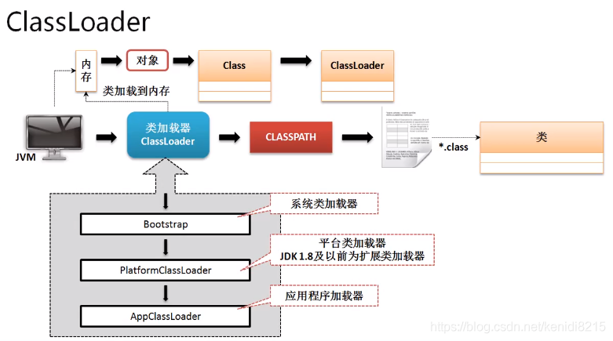  

BOOTSTRAP 类加载 java API   平台类（扩展类反射）加密 修改类属性 方法 等 app 自定义


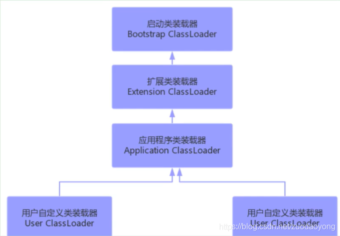


*1.引**导类加载器：*用c++编写，是JVM自带的类加载器，负责java平台核心库，用来装载核心类库，该加载器无法直接获取；

*2.扩展类加载器：*负责jre/lib/ext目录下的jar包或 -D java.ext.dirs 指定下的jar包装入工作库

*3.系统类下载器：*负责java-classpath或者 -D java.class.path所指的目录下的类与jar包装入工作，是最常用的加载器


```java
public class Test06 {
    public static void main(String[] args) throws ClassNotFoundException {

        //系统类加载器
        //sun.misc.Launcher$AppClassLoader@18b4aac2
        ClassLoader systemClassLoader = ClassLoader.getSystemClassLoader();
        System.out.println(systemClassLoader);

        //系统类加载器的父类->扩展类加载器
        //sun.misc.Launcher$ExtClassLoader@4554617c
        ClassLoader parent = systemClassLoader.getParent();
        System.out.println(parent);

        //扩展类加载器的父类->根加载器
        //null(C/C++，javas是获取不到的)
        ClassLoader parent1 = parent.getParent();
        System.out.println(parent1);

        //获取当前类的类加载器
        //sun.misc.Launcher$AppClassLoader@18b4aac2
        ClassLoader classLoader = Class.forName("com.han.reflection.Test06").getClassLoader();
        System.out.println(classLoader);

        //测试jdk内部的类是谁加载的，获取java.lang.Object类加载器
        //null
        classLoader = Class.forName("java.lang.Object").getClassLoader();
        System.out.println(classLoader);

        //如何获取系统类加载器可以加载的路径
        /*
D:\java\jdk\jdk 1.8\jdk\jre\lib\charsets.jar;
D:\java\jdk\jdk 1.8\jdk\jre\lib\deploy.jar;
D:\java\jdk\jdk 1.8\jdk\jre\lib\ext\access-bridge-64.jar;
D:\java\jdk\jdk 1.8\jdk\jre\lib\ext\cldrdata.jar;
D:\java\jdk\jdk 1.8\jdk\jre\lib\ext\dnsns.jar;
D:\java\jdk\jdk 1.8\jdk\jre\lib\ext\jaccess.jar;
D:\java\jdk\jdk 1.8\jdk\jre\lib\ext\jfxrt.jar;
D:\java\jdk\jdk 1.8\jdk\jre\lib\ext\localedata.jar;
D:\java\jdk\jdk 1.8\jdk\jre\lib\ext\nashorn.jar;
D:\java\jdk\jdk 1.8\jdk\jre\lib\ext\sunec.jar;
D:\java\jdk\jdk 1.8\jdk\jre\lib\ext\sunjce_provider.jar;
D:\java\jdk\jdk 1.8\jdk\jre\lib\ext\sunmscapi.jar;
D:\java\jdk\jdk 1.8\jdk\jre\lib\ext\sunpkcs11.jar;
D:\java\jdk\jdk 1.8\jdk\jre\lib\ext\zipfs.jar;
D:\java\jdk\jdk 1.8\jdk\jre\lib\javaws.jar;
D:\java\jdk\jdk 1.8\jdk\jre\lib\jce.jar;
D:\java\jdk\jdk 1.8\jdk\jre\lib\jfr.jar;
D:\java\jdk\jdk 1.8\jdk\jre\lib\jfxswt.jar;
D:\java\jdk\jdk 1.8\jdk\jre\lib\jsse.jar;
D:\java\jdk\jdk 1.8\jdk\jre\lib\management-agent.jar;
D:\java\jdk\jdk 1.8\jdk\jre\lib\plugin.jar;
D:\java\jdk\jdk 1.8\jdk\jre\lib\resources.jar;
D:\java\jdk\jdk 1.8\jdk\jre\lib\rt.jar; //rt.jar
E:\ideaIC_workspaces\javaSE\out\production\javaSE; //我们自己类的
D:\software\idea\ideaIC\IntelliJ IDEA Community Edition 
2021.2.3\lib\idea_rt.jar
*/
        System.out.println(System.getProperty("java.class.path"));
    }
}
```


#### 3.1.1、双亲委派机制


　　双亲委派机制是指当一个类加载器收到一个类加载请求时，该类加载器首先会把请求委派给父类加载器。每个类加载器都是如此，只有在父类加载器在自己的搜索范围内找不到指定类时，子类加载器才会尝试自己去加载。


双亲委派模型工作工程：


　　1.当Application ClassLoader 收到一个类加载请求时，他首先不会自己去尝试加载这个类，而是将这个请求委派给父类加载器Extension ClassLoader去完成。  


　　2.当Extension ClassLoader收到一个类加载请求时，他首先也不会自己去尝试加载这个类，而是将请求委派给父类加载器Bootstrap ClassLoader去完成。  


　　3.如果Bootstrap ClassLoader加载失败(在<JAVA_HOME>\lib中未找到所需类)，就会让Extension ClassLoader尝试加载。  


　　4.如果Extension ClassLoader也加载失败，就会使用Application ClassLoader加载。  


　　5.如果Application ClassLoader也加载失败，就会使用自定义加载器去尝试加载。  


　　6.如果均加载失败，就会抛出ClassNotFoundException异常。


例子：


　　当一个Hello.class这样的文件要被加载时。不考虑我们自定义类加载器，首先会在AppClassLoader中检查是否加载过，如果有那就无需再加载了。如果没有，那么会拿到父加载器，然后调用父加载器的loadClass方法。父类中同理会先检查自己是否已经加载过，如果没有再往上。注意这个过程，直到到达Bootstrap classLoader之前，都是没有哪个加载器自己选择加载的。如果父加载器无法加载，会下沉到子加载器去加载，一直到最底层，如果没有任何加载器能加载，就会抛出ClassNotFoundException。

#### 3.1.2、自定义加载器两种方式：

【方法1】 加载ClassLoaderIntroduce路径下sayHello文件中得的Hello类。这里采用继承ClassLoader而非URLClassLoader，因此需要手动编写findclass()方法的加载逻辑以及该方法中获取字节码流的逻辑。

```java
public class MyClassLoader {

    private static class customizedClassLoader extends ClassLoader{
        @Override
        protected Class<?> findClass(String name) throws ClassNotFoundException {
            File file = new File("D:/CodeEdit/Java/BasicKnowledgeLearning/JVM/src/ClassLoaderIntroduce/", name.replace(".","/").concat(".class"));
            try{
                FileInputStream fis = new FileInputStream(file);
                ByteArrayOutputStream bos = new ByteArrayOutputStream();

                int length = 0 ;
                while((length=fis.read()) != 0){  // 以二进制流的形式读取文件
                    bos.write(length);
                }

                byte[] data = bos.toByteArray();   // 将二进制流转为byte数组

                bos.close();
                fis.close();

                return defineClass(name,data, 0, data.length);  // 将二进制流转为类对象

            }catch(Exception e){
                e.printStackTrace();
            }

            return super.findClass(name);  // 抛出ClassNotFindException异常
        }

    }


    public static void main(String[] args) throws ClassNotFoundException, IllegalAccessException, InstantiationException {
        ClassLoader classLoader = new customizedClassLoader();
        Class clazz = classLoader.loadClass("ClassLoaderIntroduce.Hello");  // 加载其他的类

        Hello h = (Hello)clazz.newInstance();   // 类实例化
        h.sayHello();

        System.out.println(classLoader.getClass().getClassLoader());
        System.out.println(classLoader.getParent());
    }
}
运行结果：Hello JVM!
jdk.internal.loader.ClassLoaders$AppClassLoader@78308db1
jdk.internal.loader.ClassLoaders$AppClassLoader@78308db1
```

**【方法2】** 加载ClassLoaderIntroduce路径下sayHello文件中得的Hello类。这里采用继承URLClassLoader，因此实现自定义加载类就很简洁。

```java
public class MyClassLoader {
    // 基于URLClassLoader实现自定义类加载器
    private static class customizedClassLoader extends URLClassLoader{
        public customizedClassLoader(URL[] urls) {
            super(urls);
        }
    }

    public static void main(String[] args) throws ClassNotFoundException, IllegalAccessException, InstantiationException, MalformedURLException {
       String rootDir = "D:/CodeEdit/Java/BasicKnowledgeLearning/JVM/src/";
       File file = new File(rootDir);
       URI uri = file.toURI();
       URL[] urls = {uri.toURL()};

       customizedClassLoader loader = new customizedClassLoader(urls);

       Class<?> object = loader.loadClass("ClassLoaderIntroduce.Hello");
       System.out.println(object.newInstance().toString());
       
    }

}
```


### 3.2 jvm运行时数据区

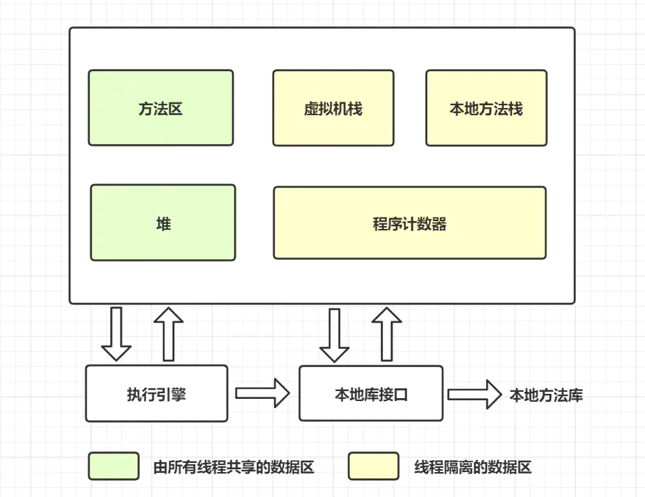


#### 1、方法区概念

Hotspot虚拟机，方法区有个别称non-heap（非堆），方法区可以看作是一块独立于堆的内存空间

（1）方法区与java堆一样，是各个线程共享的内存区域

（2）方法区在[jvm](https://so.csdn.net/so/search?q=jvm&spm=1001.2101.3001.7020)启动的时候被创建，并且它的实际的物理内存空间中和java堆区一样都是可以不连续的

（3）方法区的大小，跟堆空间一样，可以选择固定大小或者扩展

（4）方法区的大小决定了系统可以保存多少个类，如果系统定义了太多的类，导致方法区溢出，虚拟机同样会抛出内存溢出错误

java8以前（java.lang.OutOfMemoryError:PermGen space）或者java8以后（java.lang.OutOfMemoryError:Metaspace）

（5）关闭jvm就会释放这个区域的内存

#### 2、Hotspot的方法区演进过程

jdk7以前，方法区的实现是永久代，jdk8开始方法区的实现使用元空间取代了永久代。

元空间和永久代最大的区别是：元空间不在虚拟机设置的内存中，而是使用本地内存

#### 3、设置方法区的内存大小

jdk7之前

（1）-XX:PermSize设置永久代初始分配空间默认是20.75M（方法区）

（2）-XX:MaxPermSize设置最大永久代分配空间，32位机器默认64M，64位机器默认82M

（3）当jvm加载的类信息容量超过了这个值，会报异常java.lang.OutOfMemoryError:PermGen space

jdk8及以后

（1）元数据区大小可以使用参数-XX:MetaspaceSize和-XX:MaxMetaspaceSize指定（元空间）

（2）默认值依赖于平台，windows下，-xx:MetaspaceSize是21.75M，-XX:MaxMetaspaceSize的值是-1，即没有限制

（3）默认情况下，虚拟机会耗尽所有的可用系统内存，如果元数据区发生溢出，虚拟机一样会抛出OutOfMemoryError:Metaspace

（4）-xx:MetaspaceSize：设置初始的元空间大小。对于一个64位的服务器端jvm来说，其默认值-xx:MetaspaceSize的值是21M，这就是初始的高水位线，一旦触及这个水位线，Full GC将会触发并卸载没用的类，然后高水位线会被重置。新的高水位线的值取决于GC后释放了多少元空间。如果释放的空间不足，那么在不超过MaxMetaspaceSize时，适当提高该值。如果释放空间过多，则降低该值。

（5）如果初始高水位线设置过低，上述高水位线调整情况发生很多次，通过垃圾回收器的日志可以观察到Full GC多次调用。为了避免频繁的GC，建议将-XX:MetaspaceSize设置为一个相对较高的值。


#### 4、处理OOM

（1）OOM或者heap space异常，一般使用内存映像分析工具对dump出来的堆存储快照分析，分析是内存泄漏还是内存溢出

（2）如果是内存泄漏，可进一步通过查看GC roots的引用链，查找到泄漏对象是通过怎样的路径与GC Roots相关联并导致垃圾收集器无法自动回收。

（3）如果不是内存泄漏，那就是说对象必须存活，此时需要增加虚拟机的参数（-Xmx和-Xms）(堆，栈)。


#### 5、方法区内部结构

方法区存储信息主要：类型信息，域（Field）信息，方法（Method）信息，常量，静态变量，即时编译器编译后的代码缓存

##### 1、类型信息

对每个加载的类型（类class、接口、枚举、注解），jvm必须在方法区存储以下类型信息

（1）类型的完整有效名称（全名=报名.类名）

（2）类型直接父类的完整有效名（接口和java.lang.Object，没有父类）

（3）类型的修饰符（public，abstract，final的某个子集）

（4）类型直接接口的一个有序列表

##### 2、域（Field）信息

（1）保存类型的所有域的相关信息以及域的声明顺序

（2）域的相关信息：域名称，域类型，域修饰符（public，private，protected，static，final，volatile，transient）

##### 3、方法（Method）信息

jvm保存所有方法的以下信息，同域信息一样的包括声明顺序

（1）方法名称

（2）方法返回参数（或者void）

（3）方法参数的数量和类型（按顺序）

（4）方法的修饰符（public，private，protected，static，final，synchronized，native，abstract）

（5）方法的字节码，操作数栈、局部变量表及大小（abstract和native除外）

（6）异常表（abstract和native除外），每个异常处理的开始位置，结束位置，代码处理在程序计数器中的偏移地址、被捕获的异常类的常量池索引。

##### 4、常量池

一个有效的字节码文件除了包含类的版本信息，字段，方法以及接口等描述信息外，还包含一项信息那就是常量池，包含各种字面量（数量值，字符串值）和对类型（类），域和方法的符号引用。

常量池，可以看作是一个表，虚拟机指令根据这张常量表找到要执行的类名，方法名，参数类型，字面量等类型

（1）方法区，内部包含了运行时常量池

（2）字节码文件，内部包含了常量池

###### 常量池的作用

一个java源文件的类，接口，编译后产生一个字节码文件。而java中字节码需要数据支持，通常这种数据会很大以至于不能直接存储在字节码里，换一种方式，可以存储到常量池里。

###### 运行时常量池

（1）运行时常量池是方法区的一部分，常量池表是class文件的一部分，用于存放编译期生成的各种字面量与符号引用，这部分内容将在类加载存放到方法区的运行时常量池中。

（2）运行时常量池创建时机：在加载类和接口到虚拟机后，就会创建对应的运行时常量池

（3）jvm为每一个已加载的类型（类或者接口）都维护一个常量池，池中的数据项和数组项类似，使用索引访问

（4）运行时常量池中包含多种不同的常量，包括编译期就已经明确的数值字面量，也包括到运行期解析后才能获得的方法或者字段引用。此时不再是常量池中的符号地址了，这里换成真实地址

（5）运行时常量池类似于传统编程语言的符号表，但是它所包含的数据比符号表更加丰富

（6）当创建类或者接口的运行时常量池，如果构造运行时常量池所需的内存空间超过了方法区所能提供的最大值，则jvm会抛出OutOfMemoryError异常。

（7）运行时常量池具备动态性，比如使用String类的intern方法加入运行时常量池中

### 3.3 堆  

**堆的概述**

一个JVM实例只有一个堆内存，堆也是Java内存管理的核心区域，堆在JVM启动的时候创建，其空间大小也被创建，是JVM中最大的一块内存空间，所有线程共享Java堆，物理上不连续的逻辑上连续的内存空间，几乎所有的实例都在这里分配内存，在方法结束后，堆中的对象不会马上删除，仅仅在垃圾收集的时候被删除，堆是GC（垃圾收集器）执行垃圾回收的重点区域。

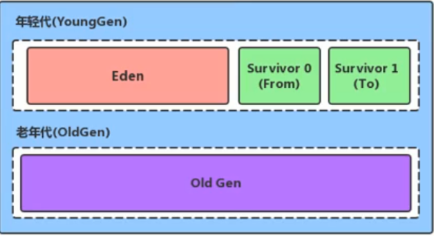

Java7及以前将堆空间逻辑上分成三部分：新生区+养老区+永久代

Java8及以后将堆内存逻辑上分为：新生区+养老区+元空间

**新生代：**

1.新生代使用了复制算法
2.新生代为gc的重点对象，经官方测试70%对象都生命周期都会在新生代中完结
3.新生代又分为了eden、survivor0、survivor1，对象创建先放在eden中，经过一定时间还幸存就会放在幸存者区
4.内存比例分默认为：8:1:1
5.新生代收集器：Minor GC/Young GC

**eden(新生区)**

当初始加载对象时会进入新生区

 **survivor（幸存区）**

幸存区又分为from 和 to —谁为空谁为to ，始终都会有一个区域为空。

幸存区不会主动进行垃圾回收，只会eden回收时才会附带进行gc

当在幸存区中的阈值达到了15后（默认15可修改）会自动进入老年代

当新生区（eden）出现了内存不足时，会进行YGC，那么会将没有指针的对象回收，还有指针引向的对象放入survivor1或者survivor2区域中，eden清空，数据放入一个survivor中。—当第二次进行gc那么会将eden数据放入另一个空的survivor中，并且将当前survivor中有效数据，放入空的survivor中，一次类推。


**老年代**

1.较大的对象数据会放入老年代

2.年代的数据都是相对于持久的不会频繁的gc

*3.(MajorGC / Old GC) 在进行majorgc时会至少进行一次minorGc ，而且majorgc的效率是比minorGc 慢10倍的
**4.老年代收集器：MajorGC / Old GC 要区分与Full GC*

 yangGC只会在eden区满的时候进行，不会在survivor区满的时候进行，eden区GC时也会把survivor区进行GC，当survivor中age=15时会将数据放入老年区。

如果对象在EDEN出生并且经过一次MinnorGC后依然存活，并且能被Survivor容纳的话，将会被放在幸存者区，并将对象年龄设为1，每熬过一次MinnorGC，age增加一岁，当age增加到15时，会被放入老年代

**总结**

minorGC YaungGC MajorGC(OldGC) Full GC  (System.gc())


1.争对幸存者S0和S1区的总结：复制之后有交换，谁跟谁是to

2.关于垃圾回收：频繁在新生代中收集，很少在养老区收集，几乎不在永久代/元空间中收集

3.对象的执行流程

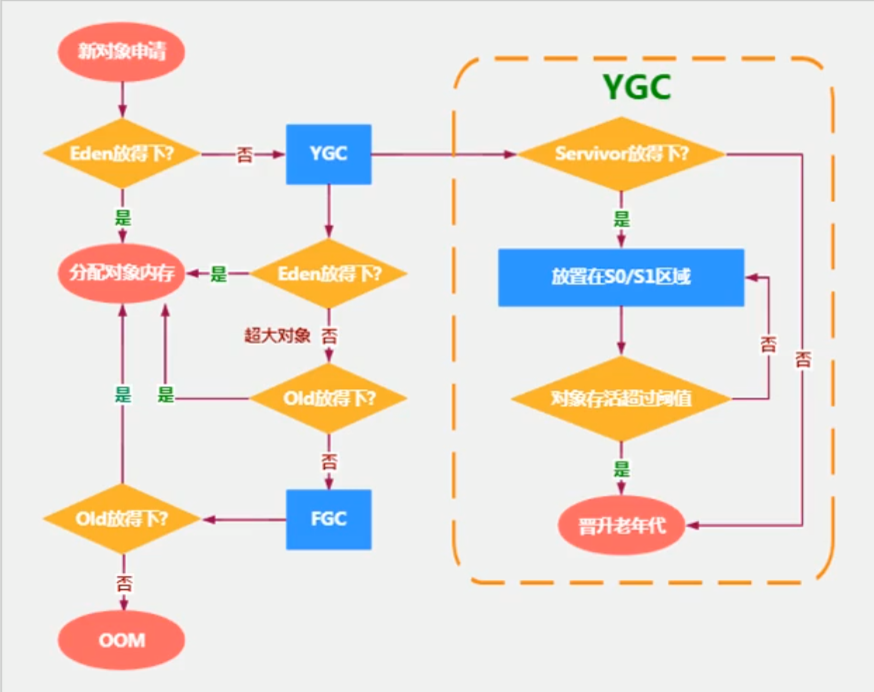


### 3.4 栈

###### 栈的概念

栈（stack）又名堆栈，它是一种运算受限的线性表。限定仅在表尾进行插入和删除操作的线性表。这一端被称为栈顶，相对地，把另一端称为栈底。向一个栈插入新元素又称作进栈、入栈或压栈，它是把新元素放到栈顶元素的上面，使之成为新的栈顶元素；从一个栈删除元素又称作出栈或退栈，它是把栈顶元素删除掉，使其相邻的元素成为新的栈顶元素。主管程序运行，生命周期和线程同步，线程结束，栈内存就释放了。不存在垃圾回收问题。

栈帧（Stack Frame）是用于支持虚拟机进行方法调用和方法执行的数据结构，它是虚拟机运行时数据区中的虚拟机栈（Virtual Machine Stack）的栈元素。

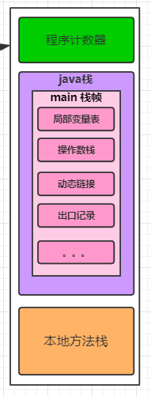

局部变量表（Local Variable Table）是一组变量值存储空间，用于存放方法参数和方法内部定义的局部变量。并且在Java编译为Class文件时，就已经确定了该方法所需要分配的局部变量表的最大容量。

局部变量表存放了编译期可知的各种基本数据类型(boolean、byte、char、short、int、float、long、double)「String是引用类型」，对象引用(reference类型) 和 returnAddress类型（它指向了一条字节码指令的地址）

[


](https://blog.csdn.net/weixin_44364444/article/details/110248863)

局部变量表的容量以变量槽为最小单位，每个变量槽都可以存储32位长度的内存空间，例如boolean、byte、char、short、int、float、reference。

对于64位长度的数据类型（long，double），虚拟机会以高位对齐方式为其分配两个连续的Slot空间，也就是相当于把一次long和double数据类型读写分割成为两次32位读写。


操作数栈同样也可以在编译期确定大小。

Frame 被创建时，操作栈是空的。操作栈的每个项可以存放 JVM 的各种类型数据，其中 long 和 double 类型（64位数据）占用两个栈深。

方法执行的过程中，会有各种字节码指令往操作数栈中写入和提取内容，也就是出栈和入栈操作（与 Java 栈中栈帧操作类似）。操作栈调用其它有返回结果的方法时，会把结果 push 到栈上（通过操作数栈来进行参数传递）。


动态链接（Dynamic Linking）

　每个栈帧都包含一个指向运行时常量池中该栈帧所属方法的引用，

　持有这个引用是为了支持方法调用过程中的动态连接（Dynamic Linking）。

　在类加载阶段中的解析阶段会将符号引用转为直接引用，这种转化也称为静态解析。

　另外的一部分将在每一次运行时期转化为直接引用。这部分称为动态连接。

返回地址（Return Address）

方法开始执行后，只有 2 种方式可以退出 ：方法返回指令，异常退出。


栈的两类异常 5   100

如果虚拟机栈容量不可以动态扩展，当线程请求的栈深度大于虚拟机允许的最大容量，就会抛出 StackOverFlowError 异常；

如果虚拟机栈容量可以动态扩展，当栈无法申请到足够的内存会抛出 OutOfMemoryError 异常。

HotSpot 虚拟机不支持动态扩展，所以只有在创建线程申请内存时因为无法获得足够的内存才会导致 OutOfMemoryError 异常。


### 3.5  程序计数数

**作用：**PC寄存器用于存储向下一条指令的的地址，也是即将要执行的指令地址。

PC寄存器介绍：

1）是一块很小的内存空间，几乎可以忽略不记，也是运行速度最快的存储区域。

2）在JVM规范中，每个线程都有自己的程序计数器，是线程私有的，生命周期与线程的生命周期一致。

3）任何一个事件一个一个线程都只有一个方法在执行，也就是所谓的当前方法，程序计数器会存储当前线程正在执行的java方法的JVM指令地址：如果是在执行native（本地方法），则是未指定。

4)它是程序控制流的指示器，分支、循环、跳转、异常处理、线程恢复等基础功能都需要这个计数器来完成。

5）字节码解释器工作就是通过改变计数器的值来选取吓一跳需要执行的字节码指令

6）它是唯一一个在java虚拟机规范中没有规定任何oom的区域。


JVM 栈描述的是每个线程 Java 方法执行的内存模型：每个方法被执行的时候，JVM 会同步创建一个栈帧用于存储局部变量表、操作数栈、动态链接、方法出口 等信息。


 栈是运行时单位，而堆是存储的单位，即栈解决的是运行问题，即程序如何执行，或者如何处理数据，功能类似于计算机硬件 PC寄存器。堆解决的是数据存储的问题，即数据怎么放、放哪儿。


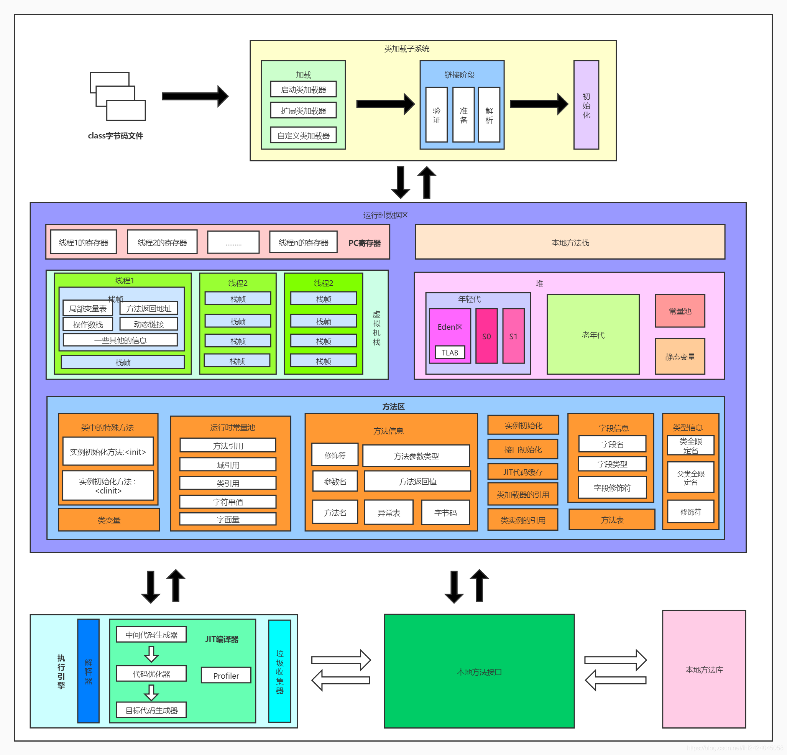

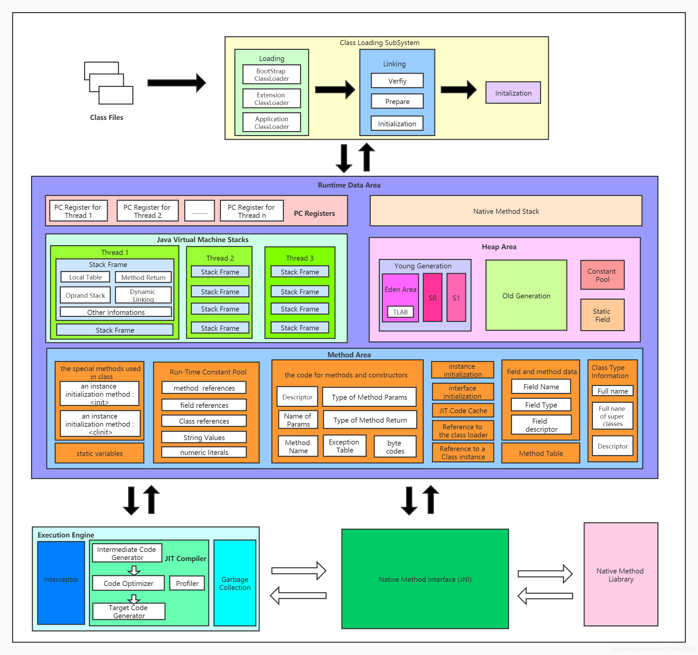


# 四、JVM常用命令整理

## 3.1  概述

先概括几个命令：


jps（JVM Process Status Tool）：显示指定系统内所有的HotSpot虚拟机进程。

jstat（JVM statistics Monitoring）：用于监视虚拟机运行时状态信息的命令，它可以显示出虚拟机进程中的类装载、内存、垃圾收集、JIT编译等运行数据。

jmap（JVM Memory Map）：用于生成heap dump文件，如果不使用这个命令，还可以使用-XX:+HeapDumpOnOutOfMemoryError参数来让虚拟机出现OOM的时候·自动生成dump文件。

jhat（JVM Heap Analysis Tool）：命令是与jmap搭配使用，用来分析jmap生成的dump，jhat内置了一个微型的HTTP/HTML服务器，生成dump的分析结果后，可以在浏览器中查看

jstack: 用于生成java虚拟机当前时刻的线程快照。

## 3.2 命令详解

jps

描述：显示指定系统内所有的HotSpot虚拟机进程。


命令格式：jps [options] [hostid]

-l	输出主类全名或jar路径

-q	只输出LVMID

-m	输出JVM启动时传递给main()的参数

-v	输出JVM启动时显示指定的JVM参数

$ jps -l -m


 jstat

描述：用于监视虚拟机运行时状态信息的命令，它可以显示出虚拟机进程中的类装载、内存、垃圾收集、JIT编译等运行数据。


命令格式：jstat [option] LVMID [interval] [count]


参数	描述

option	操作参数

LVMID	本地虚拟机进程ID

interval	连续输出的时间间隔

count	连续输出的次数


option参数总览：

class	class loader的行为统计。Statistics on the behavior of the class loader.

compiler	HotSpt JIT编译器行为统计。Statistics of the behavior of the HotSpot Just-in-Time compiler.

gc	垃圾回收堆的行为统计。Statistics of the behavior of the garbage collected heap.

gccapacity	各个垃圾回收代容量(young,old,perm)和他们相应的空间统计。Statistics of the capacities of the generations and their corresponding spaces.

gcutil	垃圾回收统计概述。Summary of garbage collection statistics.

gccause	垃圾收集统计概述（同-gcutil），附加最近两次垃圾回收事件的原因。Summary of garbage collection statistics (same as -gcutil), with the cause of the last and

gcnew	新生代行为统计。Statistics of the behavior of the new generation.

gcnewcapacity	新生代与其相应的内存空间的统计。Statistics of the sizes of the new generations and its corresponding spaces.

gcold	年老代和永生代行为统计。Statistics of the behavior of the old and permanent generations.

gcoldcapacity	年老代行为统计。Statistics of the sizes of the old generation.

gcpermcapacity	永生代行为统计。Statistics of the sizes of the permanent generation.

printcompilation	HotSpot编译方法统计。HotSpot compilation method statis


jmap

描述：


用于生成heap dump文件.

如果不使用jmap，还可以以使用-XX:+HeapDumpOnOutOfMemoryError参数来让虚拟机出现OOM的时候，自动生成dump文件。

jmap不仅能生成dump文件，还可以查询finalize执行队列、Java堆和永久代的详细信息，如当前使用率、当前使用的是哪种收集器等。

命令格式： jmap [option] LVMID


dump	生成堆转储快照

finalizerinfo	显示在F-Queue队列等待Finalizer线程执行finalizer方法的对象

heap	显示Java堆详细信息

histo	显示堆中对象的统计信息

permstat	to print permanent generation statistics

F	当-dump没有响应时，强制生成dump快照


jhat

描述：命令是与jmap搭配使用，用来分析jmap生成的dump，jhat内置了一个微型的HTTP/HTML服务器，生成dump的分析结果后，可以在浏览器中查看。

jhat [dumpfile]


命令	描述

-stack false	true

-refs false|true	关闭对象引用跟踪(tracking of references to objects)。 默认值为 true. 默认情况下, 返回的指针是指向其他特定对象的对象,如反向链接或输入引用(referrers or incoming references), 会统计/计算堆中的所有对象。>

-port port-number	设置 jhat HTTP server 的端口号. 默认值 7000.>

-exclude exclude-file	指定对象查询时需要排除的数据成员列表文件(a file that lists data members that should be excluded from the reachable objects query)。 例如, 如果文件列列出了 java.lang.String.value , 那么当从某个特定对象 Object o 计算可达的对象列表时, 引用路径涉及 java.lang.String.value 的都会被排除。>

-baseline exclude-file	指定一个基准堆转储(baseline heap dump)。 在两个 heap dumps 中有相同 object ID 的对象会被标记为不是新的(marked as not being new). 其他对象被标记为新的(new). 在比较两个不同的堆转储时很有用.>

-debug int	设置 debug 级别. 0 表示不输出调试信息。 值越大则表示输出更详细的 debug 信息.>

-version	启动后只显示版本信息就退出>

-J< flag >	因为 jhat 命令实际上会启动一个JVM来执行, 通过 -J 可以在启动JVM时传入一些启动参数. 例如, -J-Xmx512m 则指定运行 jhat 的Java虚拟机使用的最大堆内存为 512 MB. 如果需要使用多个JVM启动参数,则传入多个 -Jxxxxxx.

[


](https://blog.51cto.com/u_15294985/3007862)

jstack

描述：jstack用于生成java虚拟机当前时刻的线程快照。线程快照是当前java虚拟机内每一条线程正在执行的方法堆栈的集合，生成线程快照的主要目的是定位线程出现长时间停顿的原因，如线程间死锁、死循环、请求外部资源导致的长时间等待等。 线程出现停顿的时候通过jstack来查看各个线程的调用堆栈，就可以知道没有响应的线程到底在后台做什么事情，或者等待什么资源。 如果java程序崩溃生成core文件，jstack工具可以用来获得core文件的java stack和native stack的信息，从而可以轻松地知道java程序是如何崩溃和在程序何处发生问题。另外，jstack工具还可以附属到正在运行的java程序中，看到当时运行的java程序的java stack和native stack的信息, 如果现在运行的java程序呈现hung的状态，jstack是非常有用的。


命令：jstack [option] LVMID


option	描述

-F	当正常输出请求不被响应时，强制输出线程堆栈

-l	除堆栈外，显示关于锁的附加信息

-m	如果调用到本地方法的话，可以显示C/C++的堆栈


jinfo

描述：是实时查看和调整虚拟机运行参数。


命令：jinfo [option] [args] LVMID


option	描述

-flag	输出指定args参数的值

-flags	不需要args参数，输出所有JVM参数的值

-sysprops	输出系统属性，等同于System.getProperties()


https://blog.51cto.com/u_15294985/3007862#1__2

调优案例分析

[https://blog.csdn.net/qq_39989608/article/details/122838542?spm=1001.2101.3001.6650.6&utm_medium=distribute.pc_relevant.none-task-blog-2%7Edefault%7EBlogCommendFromBaidu%7ERate-6-122838542-blog-128989803.235%5Ev38%5Epc_relevant_anti_vip&depth_1-utm_source=distribute.pc_relevant.none-task-blog-2%7Edefault%7EBlogCommendFromBaidu%7ERate-6-122838542-blog-128989803.235%5Ev38%5Epc_relevant_anti_vip&utm_relevant_index=13](https://blog.csdn.net/qq_39989608/article/details/122838542?spm=1001.2101.3001.6650.6&utm_medium=distribute.pc_relevant.none-task-blog-2~default~BlogCommendFromBaidu~Rate-6-122838542-blog-128989803.235^v38^pc_relevant_anti_vip&depth_1-utm_source=distribute.pc_relevant.none-task-blog-2~default~BlogCommendFromBaidu~Rate-6-122838542-blog-128989803.235^v38^pc_relevant_anti_vip&utm_relevant_index=13)


## JVM GC算法

JVM垃圾判定算法

### 引用计数算法(Reference Counting)


引用计数算法是通过判断对象的引用数量来决定对象是否可以被回收。

给对象中添加一个引用计数器，每当有一个地方引用它时，计数器值就加1；当引用失效时，计数器值就减1；任何时刻计数器为0的对象就是不可能再被使用的。

优点：简单，高效，现在的objective-c用的就是这种算法。

缺点：很难处理循环引用，相互引用的两个对象则无法释放。因此目前主流的Java虚拟机都摒弃掉了这种算法。


举个简单的例子，对象objA和objB都有字段instance，赋值令objA.instance=objB及objB.instance=objA，除此之外，这两个对象没有任何引用，实际上这两个对象已经不可能再被访问，但是因为互相引用，导致它们的引用计数都不为0，因此引用计数算法无法通知GC收集器回收它们。

```java
public class ReferenceCountingGC {
    public Object instance = null;

    public static void main(String[] args) {
        ReferenceCountingGC objA = new ReferenceCountingGC();
        ReferenceCountingGC objB = new ReferenceCountingGC();
        objA.instance = objB;
        objB.instance = objA;

        objA = null;
        objB = null;

        System.gc();//GC
    }
}
[GC (System.gc()) [PSYoungGen: 3329K->744K(38400K)] 3329K->752K(125952K), 0.0341414 secs] [Times: user=0.00 sys=0.00, real=0.06 secs] 
[Full GC (System.gc()) [PSYoungGen: 744K->0K(38400K)] [ParOldGen: 8K->628K(87552K)] 752K->628K(125952K), [Metaspace: 3450K->3450K(1056768K)], 0.0060728 secs] [Times: user=0.05 sys=0.00, real=0.01 secs] 
Heap
 PSYoungGen      total 38400K, used 998K [0x00000000d5c00000, 0x00000000d8680000, 0x0000000100000000)
  eden space 33280K, 3% used [0x00000000d5c00000,0x00000000d5cf9b20,0x00000000d7c80000)
  from space 5120K, 0% used [0x00000000d7c80000,0x00000000d7c80000,0x00000000d8180000) s01
    
  to   space 5120K, 0% used [0x00000000d8180000,0x00000000d8180000,0x00000000d8680000)s02
    
 ParOldGen       total 87552K, used 628K [0x0000000081400000, 0x0000000086980000, 0x00000000d5c00000)
  object space 87552K, 0% used [0x0000000081400000,0x000000008149d2c8,0x0000000086980000)
 Metaspace       used 3469K, capacity 4496K, committed 4864K, reserved 1056768K
  class space    used 381K, capacity 388K, committed 512K, reserved 1048576K

Process finished with exit code 0
```

### 可达性分析算法（根搜索算法）

可达性分析算法是通过判断对象的引用链是否可达来决定对象是否可以被回收。

从GC Roots（每种具体实现对GC Roots有不同的定义）作为起点，向下搜索它们引用的对象，可以生成一棵引用树，树的节点视为可达对象，反之视为不可达。

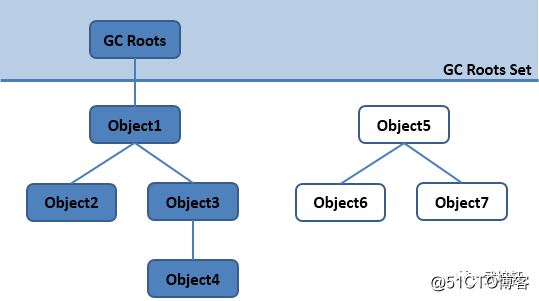

在Java语言中，可以作为GC Roots的对象包括下面几种：


•虚拟机栈（栈帧中的本地变量表）中的引用对象。

•方法区中的类静态属性引用的对象。

•方法区中的常量引用的对象。

•本地方法栈中JNI（Native方法）的引用对象


真正标记以为对象为可回收状态至少要标记两次。


四种引用

**强引用**就是指在程序代码之中普遍存在的，类似"Object obj = new Object()"这类的引用，只要强引用还存在，垃圾收集器永远不会回收掉被引用的对象。


**软引用**是用来描述一些还有用但并非必需的对象，对于软引用关联着的对象，在系统将要发生内存溢出异常之前，将会把这些对象列进回收范围进行第二次回收。如果这次回收还没有足够的内存，才会抛出内存溢出异常。在JDK1.2之后，提供了SoftReference类来实现软引用。


Object obj = new Object();

SoftReference<Object> sf = new SoftReference<Object>(obj);


**弱引用**也是用来描述非必需对象的，但是它的强度比软引用更弱一些，被弱引用关联的对象，只能生存到下一次垃圾收集发生之前。当垃圾收集器工作时，无论当前内存是否足够，都会回收掉只被弱引用关联的对象。在JDK1.2之后，提供了WeakReference类来实现弱引用。


Object obj = new Object();

WeakReference<Object> wf = new WeakReference<Object>(obj);


**虚引用**也成为幽灵引用或者幻影引用，它是最弱的一中引用关系。一个对象是否有虚引用的存在，完全不会对其生存时间构成影响，也无法通过虚引用来取得一个对象实例。为一个对象设置虚引用关联的唯一目的就是能在这个对象被收集器回收时收到一个系统通知。在JDK1.2之后，提供给了PhantomReference类来实现虚引用。


Object obj = new Object();

PhantomReference<Object> pf = new PhantomReference<Object>(obj);


JVM垃圾回收算法

常见的垃圾回收算法包括：标记-清除算法，复制算法，标记-整理算法，分代收集算法。


在介绍JVM垃圾回收算法前，先介绍一个概念。


Stop-the-World


Stop-the-world意味着 JVM由于要执行GC而停止了应用程序的执行，并且这种情形会在任何一种GC算法中发生。当Stop-the-world发生时，除了GC所需的线程以外，所有线程都处于等待状态直到GC任务完成。事实上，GC优化很多时候就是指减少Stop-the-world发生的时间，从而使系统具有高吞吐 、低停顿的特点。

[


](https://blog.51cto.com/u_14901336/2522948)

### 标记—清除算法（Mark-Sweep）

之所以说标记/清除算法是几种GC算法中最基础的算法，是因为后续的收集算法都是基于这种思路并对其不足进行改进而得到的。标记/清除算法的基本思想就跟它的名字一样，分为“标记”和“清除”两个阶段：首先标记出所有需要回收的对象，在标记完成后统一回收所有被标记的对象。

标记阶段：标记的过程其实就是前面介绍的可达性分析算法的过程，遍历所有的GC Roots对象，对从GC Roots对象可达的对象都打上一个标识，一般是在对象的header中，将其记录为可达对象；

清除阶段：清除的过程是对堆内存进行遍历，如果发现某个对象没有被标记为可达对象（通过读取对象header信息），则将其回收。

不足：

•标记和清除过程效率都不高

•会产生大量碎片，内存碎片过多可能导致无法给大对象分配内存。

[


](https://blog.51cto.com/u_14901336/2522948)

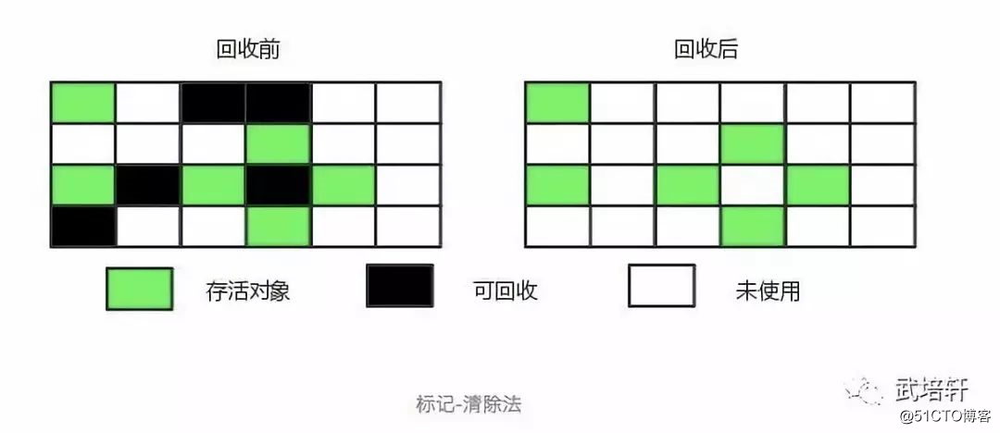

### 复制算法（Copying）

将内存划分为大小相等的两块，每次只使用其中一块，当这一块内存用完了就将还存活的对象复制到另一块上面，然后再把使用过的内存空间进行一次清理。

现在的商业虚拟机都采用这种收集算法来回收新生代，但是并不是将内存划分为大小相等的两块，而是分为一块较大的 Eden 空间和两块较小的 Survior 空间，每次使用 Eden 空间和其中一块 Survivor。在回收时，将 Eden 和 Survivor 中还存活着的对象一次性复制到另一块 Survivor 空间上，最后清理 Eden 和 使用过的那一块 Survivor。HotSpot 虚拟机的 Eden 和 Survivor 的大小比例默认为 8:1，保证了内存的利用率达到 90 %。如果每次回收有多于 10% 的对象存活，那么一块 Survivor 空间就不够用了，此时需要依赖于老年代进行分配担保，也就是借用老年代的空间。

不足：

•将内存缩小为原来的一半，浪费了一半的内存空间，代价太高；如果不想浪费一半的空间，就需要有额外的空间进行分配担保，以应对被使用的内存中所有对象都100%存活的极端情况，所以在老年代一般不能直接选用这种算法。

•复制收集算法在对象存活率较高时就要进行较多的复制操作，效率将会变低。

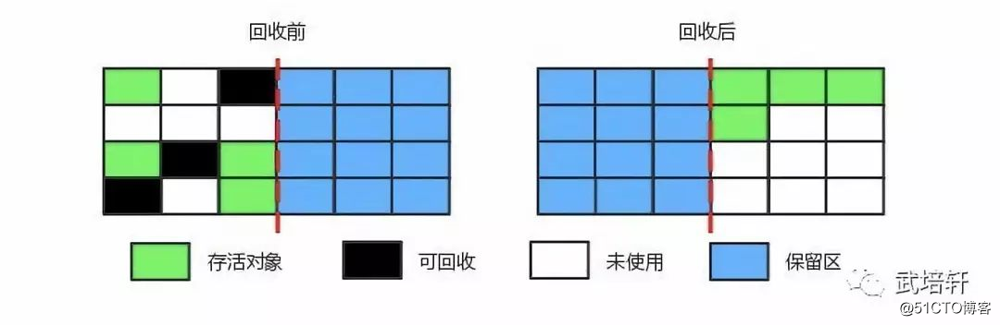

### 标记—整理算法（Mark-Compact）标记清楚算法和复制算法合体


标记—整理算法和标记—清除算法一样，但是标记—整理算法不是把存活对象复制到另一块内存，而是把存活对象往内存的一端移动，然后直接回收边界以外的内存，因此其不会产生内存碎片。标记—整理算法提高了内存的利用率，并且它适合在收集对象存活时间较长的老年代。

不足：

效率不高，不仅要标记存活对象，还要整理所有存活对象的引用地址，在效率上不如复制算法。

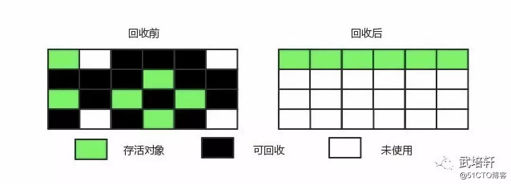

### 分代收集算法(Generational Collection)

分代回收算法实际上是把复制算法和标记整理法的结合，并不是真正一个新的算法，一般分为：老年代（Old Generation）和新生代（Young Generation），老年代就是很少垃圾需要进行回收的，新生代就是有很多的内存空间需要回收，所以不同代就采用不同的回收算法，以此来达到高效的回收算法。


新生代：由于新生代产生很多临时对象，大量对象需要进行回收，所以采用复制算法是最高效的。

老年代：回收的对象很少，都是经过几次标记后都不是可回收的状态转移到老年代的，所以仅有少量对象需要回收，故采用标记清除或者标记整理算法。