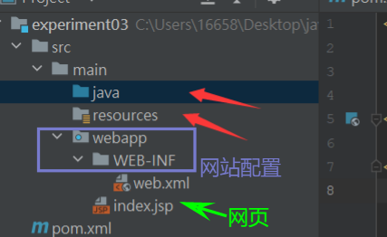
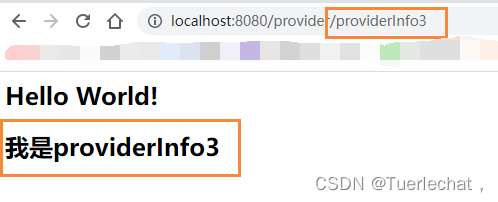
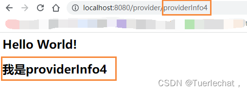
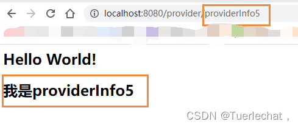
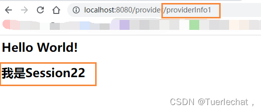
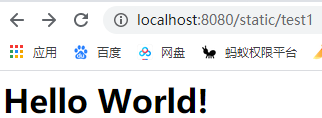
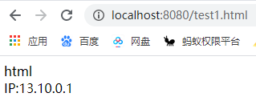
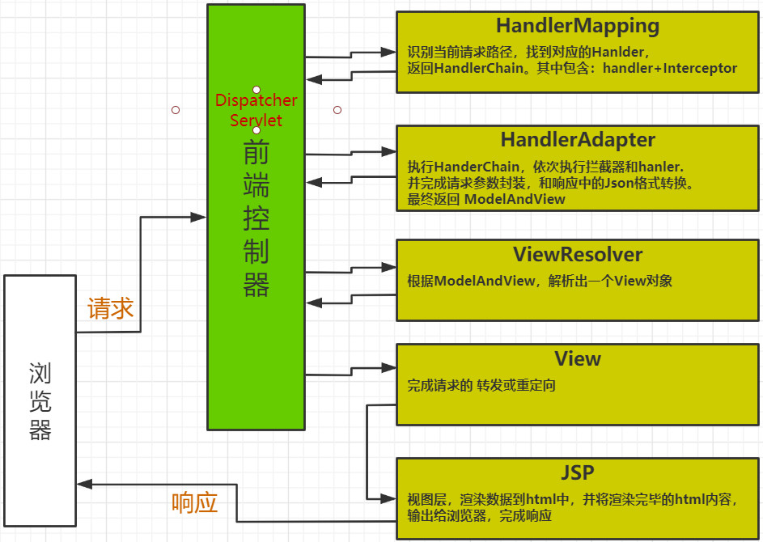

# 一、SpringMVC

在没有springMVC时，需要编写了大量的Servlet(HttpServlet) , 也就是表示层实现)来处理来自浏览器的各种请求，但是我们发现，仅仅是几个很小的功能，以及几个很基本的页面，我们都要编写将近十个Servlet，如果是更加大型的网站系统，比如淘宝、B站，光是一个页面中可能就包含了几十甚至上百个功能，想想那样的话写起来得多恐怖。

## 1.1 引言

**java开源框架，Spring Framework的一个独立模块。**

 **MVC框架,在项目中开辟MVC层次架构**

**对控制器中的功能 包装 简化 扩展践行工厂模式，功能架构在工厂之上**

## 1.2 MVC架构

### 1.2.1 概念

| 名称       | 职责                                                         |
| ---------- | ------------------------------------------------------------ |
| Model      | 模型：即业务模型，负责完成业务中的数据通信处理，对应项目中的 service和dao |
| View       | 视图：渲染数据，生成页面。对应项目中的Jsp                    |
| Controller | 控制器：直接对接请求，控制MVC流程，调度模型，选择视图。对应项目中的Servlet |


### 1.2.2 好处

-  MVC是现下软件开发中的最流行的代码结构形态; 
-  人们根据负责的不同逻辑，将项目中的代码分成 M V C 3个层次; 
-  层次内部职责单一，层次之间耦合度低; 
-  符合低耦合 高内聚的设计理念。也实际有利于项目的长期维护。 

# 二、创建SpringMVC项目

## 2.1 创建项目


在控制台显示BUILD SUCCESS，项目创建完成


默认创建的项目目录，resource存放配置文件，webapp目录存放web页面和组件

在main目录上右键，选择New-->Directory创建java目录


添加java和resource



## 2.2 在 IDEA中配置Tomcat

**1、添加tomcat**


**2、相关配置**


**3、关联网站**


4、**启动tomcat**


## 2.3 基本使用

代码见  [基本使用.zip](code\基本使用.zip) 

### 导入依赖

```xml
<dependency>
    <groupId>org.springframework</groupId>
    <artifactId>spring-webmvc</artifactId>
    <version>5.1.6.RELEASE</version>
</dependency>
```

补充: 下面是javaweb的依赖, springMVC不需要添加

```xml
<dependency>
    <groupId>javax.servlet</groupId>
    <artifactId>javax.servlet-api</artifactId>
    <version>3.1.0</version>
</dependency>
```

不是必须同时添加这两个依赖。这两个依赖是针对不同的场景和用途的。

+ `javax.servlet-api`依赖是用于开发Servlet相关的Java EE应用程序的，包括使用Servlet、Filter、Listener等相关的API。这个依赖是在使用Java EE规范的Web容器（如Tomcat）中开发和运行应用程序时需要的。

+ `spring-webmvc`依赖是用于开发基于Spring MVC框架的Web应用程序的。这个依赖包含了Spring MVC框架的核心类和依赖项，可用于编写控制器、处理请求、渲染视图等。

### 配置web.xml

配置核心(前端)控制器  struts2

https://struts.apache.org/getting-started/hello-world-using-struts2.html

作为一个MVC框架，首先要解决的是：如何能够收到请求！

所以MVC框架大都会设计一款前端控制器，选型在 Servlet 或 Filter两者之一,在框架最前沿率先工作，接收所有请求。

此控制器在接收到请求后，还会负责springMVC的核心的调度管理，所以既是前端又是核心。

```xml
<!DOCTYPE web-app PUBLIC
        "-//Sun Microsystems, Inc.//DTD Web Application 2.3//EN"
        "http://java.sun.com/dtd/web-app_2_3.dtd" >
<web-app xmlns:xsi="http://www.w3.org/2001/XMLSchema-instance"
         xmlns="http://xmlns.jcp.org/xml/ns/javaee"
         xsi:schemaLocation="http://xmlns.jcp.org/xml/ns/javaee
                      http://xmlns.jcp.org/xml/ns/javaee/web-app_4_0.xsd"
         version="4.0"
         metadata-complete="true">
    <display-name>Archetype Created Web Application</display-name>

    <!--    拓展配置方式（推荐）-->
    <!-- 配置SpringMVC的前端控制器，对浏览器发送的请求统一进行处理 -->
    <!--处理中文乱码-->
    <filter>
        <filter-name>encodingFilter</filter-name>
        <filter-class>org.springframework.web.filter.CharacterEncodingFilter</filter-class>
        <init-param>
            <param-name>encoding</param-name>
            <param-value>UTF-8</param-value>
        </init-param>
        <init-param>
            <param-name>forceEncoding</param-name>
            <param-value>true</param-value>
        </init-param>
    </filter>
    <filter-mapping>
        <filter-name>encodingFilter</filter-name>
        <url-pattern>/*</url-pattern>
    </filter-mapping>
    <servlet>
        <servlet-name>springMVC</servlet-name>
        <servlet-class>org.springframework.web.servlet.DispatcherServlet</servlet-class>
        <!-- 通过初始化参数指定SpringMVC配置文件的位置和名称 -->
        <init-param>
            <!-- contextConfigLocation为固定值 -->
            <param-name>contextConfigLocation</param-name>
            <!-- 使用classpath:表示从类路径查找配置文件，例如maven工程中的src/main/resources -->
            <param-value>classpath:springMVC.xml</param-value>
        </init-param>
        <!--
             作为框架的核心组件，在启动过程中有大量的初始化操作要做
            而这些操作放在第一次请求时才执行会严重影响访问速度
            因此需要通过此标签将启动控制DispatcherServlet的初始化时间提前到服务器启动时
        -->
        <load-on-startup>1</load-on-startup>
    </servlet>
    <servlet-mapping>
        <servlet-name>springMVC</servlet-name>
        <!--
            设置springMVC的核心控制器所能处理的请求的请求路径
            /所匹配的请求可以是/login或.html或.js或.css方式的请求路径
            但是/不能匹配.jsp请求路径的请求
        -->
        <url-pattern>/</url-pattern>
    </servlet-mapping>
</web-app>
```

### 后端控制器

等价于之前定义的Servlet

```java
package cn.lfj.controller;

@Controller //声明这是一个控制器
@RequestMapping("/hello")  //访问路径 ，等价于url-pattern
public class HelloController {
	@RequestMapping("/test1")  //访问路径
	public String hello1(){
		System.out.println("hello world");
		return "index"; // 跳转:/index.jsp  
	}
	@RequestMapping("/test2") //访问路径
	public String hello2(){
		System.out.println("hello c9");
		return "views/users";//  跳转:/views/user.jsp
	}
}
```

```java
package cn.lfj.controller;

@Controller
public class AnnotationHandler {

	/**
	 * 业务方法
	 * 使用ModelAndView完成数据传递、视图解析
	 */
	@RequestMapping("/modelAndViewTest")
	public ModelAndView modelAndViewTest(){
		ModelAndView modelAndView = new ModelAndView();
		modelAndView.addObject("name","Jack");
		modelAndView.setViewName("show");
		return modelAndView;
	}

	/**
	 * 业务方法
	 * 使用Model传值，String进行视图解析
	 */
	@RequestMapping("/modelTest")
	public String modelTest(Model model){
		model.addAttribute("name","Lucy");
		return "show" ;
	}

	/**
	 * 业务方法
	 * 使用Map传值，String解析视图
	 */
	@RequestMapping("/mapTest")
	public String mapTest(Map<String,String> map){
		map.put("name","Lilei");
		return "show";
	}

}
```

### 前端页面


index.jsp

```html
<html>
<body>
<h2>Hello World!</h2>
</body>
</html>
```

show,jsp

```jsp
<%@ page contentType="text/html;charset=UTF-8" language="java" %>
<%@ page isELIgnored="false" %>
<html>
<head>
    <title>Title</title>
</head>
<body>
    ${name}
</body>
</html>

```

user.jsp

```jsp
<%@ page contentType="text/html;charset=UTF-8" language="java" %>
<html>
<head>
    <title>user</title>
</head>
<body>
<h1> user</h1>
</body>
</html>
```

### 配置文件

默认名称：核心控制器名-servet.xml   默认位置：WEB-INF

随意名称：mvc.xml      随意位置：resources   但需要配置在核心控制器中

```xml
<beans 	xmlns="http://www.springframework.org/schema/beans"
		xmlns:context="http://www.springframework.org/schema/context"
		xmlns:mvc="http://www.springframework.org/schema/mvc" 
		xmlns:xsi="http://www.w3.org/2001/XMLSchema-instance" 
		xsi:schemaLocation="http://www.springframework.org/schema/beans
							http://www.springframework.org/schema/beans/spring-beans.xsd
							http://www.springframework.org/schema/context
							http://www.springframework.org/schema/context/spring-context.xsd
							http://www.springframework.org/schema/mvc
							http://www.springframework.org/schema/mvc/spring-mvc.xsd">

	<!-- 告知springmvc  哪些包中 存在 被注解的类 -->
	<context:component-scan base-package="com.qf.controller"></context:component-scan>
	<!-- 注册注解开发驱动 -->
	<mvc:annotation-driven></mvc:annotation-driven>
    
	<!-- 视图解析器
	     作用：1.捕获后端控制器的返回值="index"
	          2.解析： 在返回值的前后 拼接 ==> "/index.jsp"
	 -->
	<bean class="org.springframework.web.servlet.view.InternalResourceViewResolver">
		<!-- 前缀 -->
		<property name="prefix" value="/"></property>
		<!-- 后缀 -->
		<property name="suffix" value=".jsp"></property>
	</bean>
</beans>
```

### 访问

配置Tomcat虚拟路径为空

```java
http://localhost:8080             #默认访问src/main/webapp/index.jsp
```


```java
http://localhost:8080/hello/test1
```


```java
http://localhost:8080/hello/test2
```


```java
http://localhost:8080/modelTest
```


# 三、接收请求参数

------

## 3.1 基本类型参数

请求参数和方法的形参 同名即可

```java
	// id  name gender
	// http://localhost:8989/xxx/../test1?id=1&name=zzz&gender=false&birth=2018-12-12 12:20:30
	@RequestMapping("/test1")
	public String testParam1(@RequestParam("id") Integer id,
							 @RequestParam("name") String name,
							 @RequestParam("gender") Boolean gender,
							 @DateTimeFormat(pattern="yyyy-MM-dd HH:mm:ss") Date birth){
		System.out.println("test param1");
		System.out.println(id + name + gender + birth);
		return "index";
	}
```

springMVC默认可以识别的日期字符串格式为： YYYY/MM/dd HH:mm:ss通过@DateTimeFormat可以修改默认日志格式

## 3.2 实体收参

请求参数和实体的属性 同名即可

```java
public class User {
	private Integer id;
	private String name;
	@DateTimeFormat(pattern="yyyy-MM-dd")
	private Date birth;
	private Boolean gender;
	//set/get ...
}

//http://localhost:8989/.../test2?id=1&name=zzz&gender=false&birth=2018-12-12 12:20:30
@RequestMapping("/test2")
public String testParam2(User user){
    System.out.println("test param2");
    System.out.println("user:"+user);
    return "index";
}
```

## 3.3 数组收参

简单类型的 数组

```html
<form action="${pageContext.request.contextPath}/param/test3">
    <input type="checkbox" name="hobby" value="fb"/>足球
    <input type="checkbox" name="hobby" value="bb"/>篮球
    <input type="checkbox" name="hobby" value="vb"/>排球
    <input type="submit" value="提交"/>
</form>
```

```java
//http://localhost:8989/.../test3?hobby=football&hobby=basketball
@RequestMapping("/test3")
public String testParam3(String[] hobby){
    for(String h:hobby){
        System.out.print(h+" ");
    }
    return "index";
}
```

## 3.4 集合收参

```plain
<form action="${pageContext.request.contextPath}/param/test4" method="post">
    id:<input type="text" name="users[0].id"/>
    name:<input type="text" name="users[0].name"/>
    gender:<input type="text" name="users[0].gender"/>
<br/>
    id:<input type="text" name="users[1].id"/>
    name:<input type="text" name="users[2].name"/>
    gender:<input type="text" name="users[3].gender"/>
    <input type="submit" value="提交"/>
</form>
```

```java
public class UserList {
	//private User[] users;
	private List<User> users;
	//set/get..
}


// <input type="text" name="users[0].id"/>
// post请求：http://...?users[0].id=1&users[0].name=zhangsan&users[0].birth=2018-12-12&users[1].id=2&....
@RequestMapping("/test4")
public String testParam4(UserList userList){
    for(User user:userList.getUsers()){
        System.out.println(user);
    }
    return "index";
}
```

## 3.5 路径参数

```java
// {id} 定义名为id的路径；【/hello/{id}】的匹配能力和【/hello/*】等价
// http://localhost:8989/.../hello/10   {id}匹配到10
@RequestMapping("/hello/{id}")
// @PathVariable将{id}路径匹配到值赋给id参数
// 路径名和参数名相同则@PathVariable("id")可简写为 @PathVariable
public String testParam5(@PathVariable("id") Integer id){
    System.out.println("id:"+id);            
    return "index";
}

// http://localhost:8989/.../hello/tom   {username}匹配到tom
@RequestMapping("/hello/{username}")
public String testParam6(@PathVariable("username") String name){//将{username}路径匹配到的值赋给name参数
    System.out.println("username:"+name);
    return "index";
}
```

## 3.6 总结【`重点`】:crossed_swords:

详细见[前后端相互传数据方式总结.md](C:\Users\16658\Documents\GitHub\java_note\note\spring boot3\前后端相互传数据方式总结\前后端相互传数据方式总结.md)

```java
package cn.lfj.controller;

import cn.lfj.entity.People;
import org.springframework.format.annotation.DateTimeFormat;
import org.springframework.stereotype.Controller;
import org.springframework.web.bind.annotation.*;

import java.util.Date;

/**
 * @Author: LFJ
 * @Date: 2023-10-17 17:20
 */

@Controller
public class FrontParameter {

	// @RequestParam()
	/**
	 * RequestParam(value = "参数名", required = false(表示该值非必须), defaultValue = "默认值")
	* http://localhost:8989/test1?id=1&name=zzz&gender=false&birth=2018-12-12 12:20:30
	 * param: id name gender birth
	 * get post都可以, body传参一般都用get
	 **/
	@RequestMapping("/test1")
	public String testParam1(@RequestParam("id") Integer id,
							 @RequestParam(value = "name", required = false, defaultValue = "李刚") String name,
							 @RequestParam(value = "gender", required = false) Boolean gender,
							 @DateTimeFormat(pattern="yyyy-MM-dd HH:mm:ss")
								 @RequestParam(value = "birth", defaultValue = "2023-12-12 12:20:30") Date birth){
		System.out.println("test param1");
		System.out.println(id + "--" + name+ "--" + gender+ "--" + birth);
		return "index";
	}


	// @PathVariable()
	/**
	 * PathVariable(value = "参数名", required = 默认值)  注:没有defaultValue
	 * http://localhost:8080/test2/1234/john/true/2023-01-01 12:00:00
	 * param: id name gender birth
	 * get post都可以, body传参一般都用get
	 **/
	@RequestMapping("/test2/{id}/{name}/{gender}/{birth}")    //PathVariable顾名思义需要固定url路径
	public String testParam2(@PathVariable("id") Integer id,
							 @PathVariable(value = "name") String name,
							 @PathVariable(value = "gender", required = false) Boolean gender,
							 @DateTimeFormat(pattern="yyyy-MM-dd HH:mm:ss")
							 @PathVariable(value = "birth",  required = false) Date birth){
		//为空时指定默认值
		if (birth == null) {
			birth = new Date("2023-12-12 12:20:30");
		}
		System.out.println("test param2");
		System.out.println(id + "--" + name+ "--" + gender+ "--" + birth);
		return "index";
	}


	// @RequestBody
    // @RequestBody注解用于指示方法接受的JSON格式数据会被自动转换为对象。
	/**
	 * http://localhost:8080/test3
	 * body: {"peoplename":"张刚","student":{"studentname":"你好"}}
	 * get post都可以, body传参一般都用post
	 * @param
	 */
	@RequestMapping("/test3")
	@ResponseBody
	public People testParam3(@RequestBody People people) {
		System.out.println("打印参数:" + people.getPeoplename() + people.getStudent().getStudentname());
		return people;
	}

}
```

## 3.7 中文乱码

首先，页面中字符集统一

```js
//JSP : 
	<%@page  pageEncoding="utf-8" %>
//HTML : 
    <meta charset="UTF-8">
```

其次，tomcat中字符集设置，对get请求中，中文参数乱码有效

```markdown
Tomcat配置：URIEncoding=utf-8
```

最后，设置此filter，对post请求中，中文参数乱码有效

```xml
<!-- 此过滤器会进行：request.setCharactorEncoding("utf-8"); -->
<filter>
    <filter-name>encoding</filter-name>
    <filter-class>org.springframework.web.filter.CharacterEncodingFilter</filter-class>
    <init-param>
        <param-name>encoding</param-name>
        <param-value>utf-8</param-value>
    </init-param>
</filter>
<filter-mapping>
    <filter-name>encoding</filter-name>
    <url-pattern>/*</url-pattern>
</filter-mapping>
```

响应乱码

```xml
<mvc:annotation-driven>
        <!--设置响应输出字符集-->
        <mvc:message-converters>
            <bean class="org.springframework.http.converter.StringHttpMessageConverter">
                <property name="supportedMediaTypes">
                    <list>
                        <value>text/html;charset=utf-8</value>
                    </list>
                </property>
            </bean>
        </mvc:message-converters>
    </mvc:annotation-driven>
```

# 四、页面跳转

------

## 4.1 转发forward

```java
@RequestMapping("/forw")
class ForwardController{
    @RequestMapping("/test1")
    public String testForward(){
        System.out.println("test forward1");
        // 转发跳转 /views/users.jsp
        // return "views/users";//和下一行等价
        return "forward:/views/users.jsp";
    }
    @RequestMapping("/test2")
    public String testForward2(){
        System.out.println("test forward2");
        //转发到  /forw/test1
        return "forward:/forw/test1"; //绝对路径
    }
}
```

## 4.2 重定向redirect

```java
@RequestMapping("/redir")
class RedirectController{
    @RequestMapping("/test1")
    public String testRedirect1(){
        System.out.println("test redirect1");
        //重定向到 /redir/test1
        //return "redirect:test1"; //相对路径(转发到本类中的test1)
        return "redirect:/redir/test1";//绝对路径
    }
    @RequestMapping("/test2")
    public String testRedirect2(){
        System.out.println("test redirect2");
        //重定向到 /views/users.jsp
        return "redirect:/view/user.jsp";
    }
}
```

## 4.3 异同

相同点：页面都会实现跳转

不同点：

- 请求转发的时候，url地址栏不会产生变化。307
- 重定向的时候，url地址栏会发生变化。302

## 4.4 重定向与转发

```java
public String index1(User user)
{
    .....
    return "redirect:/user.jsp";//重定向
    return "forward:页面";//转发 
}
```

当我们使用重定向时可以解决一些传参问题，比如两个Controller的传参问题

### Controller传参到另一个Controller中

> - 有时候可能会碰到这样的问题：
>   - 在A的Controller中传参到B的Controller中，
>   - 而A的返回值是作为B的参数，
>   - 并且本身请求A的参数中有一些需要进行一些处理后才能用于请求B（而可能甚至我们并不需要用到注入Service的方法（这个条件也是。。。亿点死亡😅））
>   - A中一些传参名需要更改成对应B中的传参名（尤其这个条件很致命😅，相同的参数数量，可能其中有一个需要经过处理后再改参数名再传到B的Controller中作为请求参数之一）

这时候那个需要进行一定处理的参数传到B的Controller时，会发现传过去的这个参数为null，而无论用到上文的request作用域中的什么Model、ModelAndView、Map等方法时均会失灵（是这种感觉），但是明明代码又没有问题

#### 解决方法

用`RedirectAttributes attributes`传参

```java
@RequestMapping("xxx")
public String xxx(String 无需做处理可直接请求下一个controller的参数, String 需要经过处理才能请求下一个controller的参数（且传递过去的参数名会变），假设此参数叫做a1, RedirectAttributes attributes){

    //一系列处理操作....

    String a2 = xxxxx;	//此时a1参数经过处理转换成a2
    
    //用attributes.addAttribute("key",value)来传递参数（可以发现方法中写好的参数是不用再次添加的，可能是被存进request作用域中了，上面提到的Model、Map等方法也是如此，不确定是否可以不写，不过这样本人试了的确是即使没写也直接传过去了）
    attributes.addAttribute("a2", a2);
    //写好重定向的路径即可
    return "redirect:/aaaa/bbbbbbbbb";
}
```

拆分来看是这样的（因为这个问题让我心态炸了一下午，所以解释起来会很磨叽😬，而且这个情况应该也比较少，网上一堆不靠谱的）：

1、用`RedirectAttributes attributes`传参

2、用`attributes.addAttribute("key",value)`来传递参数

3、写好重定向的路径即可（不用多写什么其它乱七八糟的）

```java
return "redirect:/aaaa/bbbbbbbbb";
```

## 4.5 跳转细节

-  在增删改之后，为了防止请求重复提交，重定向跳转 
-  在查询之后，可以做转发跳转 

# 五、返回响应

**前端jsp**

jsp中用EL表达式 取值,  重点复习 EL  JSTL

```jsp
<%@ page contentType="text/html;charset=UTF-8" isELIgnored="false" language="java" %>
<html>
<body>
<h2>Hello World!</h2>
<h2>${uname}</h2>
<h2>${msg}</h2>
</body>
</html>
```


##  ① 页面间参数传递

C得到数据后，跳转到V，并向V传递数据。进而V中可以渲染数据，让用户看到含有数据的页面

转发跳转：Request作用域

重定向跳转：Session作用域

### request作用域

#### 1、@ModelAttribute注解(常用)

Controller层

```java
@RequestMapping("/providerInfo1")
public ModelAndView providerInfo1(@ModelAttribute("uname") String uname) {
    return new ModelAndView("/hello");
}
```

效果


#### 2、ModelAndView对象（较麻烦）

> 使用mav.addObject();

Controller层

```java
@RequestMapping("/providerInfo2")
public ModelAndView providerInfo2() {
    ModelAndView mav = new ModelAndView("/hello");
    String msg = "我是providerInfo2";
    mav.addObject("msg", msg);
    return mav;
}
```

效果


```java
//modelandview 可以集中管理 跳转和数据
@RequestMapping("/test")
public ModelAndView testData(){//返回值类型为ModelAndView
    //新建ModelAndView对象
    ModelAndView mv = new ModelAndView();
    // 设置视图名，即如何跳转
    mv.setViewName("forward:/index.jsp");
    // 增加数据
    mv.addObject("age",18);
    return mv;
}

//jsp中用EL表达式 取值即可
${requestScope.age}
```

#### 3、用Model传参（常用）

> 使用model.addAttribute();

Controller层（返回类型是String）

```java
@RequestMapping("/providerInfo3")
public String providerInfo3(Model model) {
    String msg = "我是providerInfo3";
    model.addAttribute("msg", msg);
    return "/hello";
}
```

效果



```java
//model中的数据，会在V渲染之前，将数据复制一份给request
@RequestMapping("/test")
public String testData(Model model){
    model.addAttribute("name", "张三");
    return "index";
}

//jsp中用EL表达式 取值即可
${requestScope.name}
```

#### 4、用map传参（常用）

> 使用map.put();

Controller层（返回类型是String）

```java
@RequestMapping("/providerInfo4")
public String providerInfo4(Map<String, Object> map) {
    String msg = "我是providerInfo4";
    map.put("msg", msg);
    return "/hello";
}
```

效果



#### 5、使用HttpServletRequest传参

需要先引入servlet-api.jar

pom.xml

```xml
<!-- javax-Servlet -->
<dependency>
    <groupId>javax.servlet</groupId>
    <artifactId>servlet-api</artifactId>
    <version>2.5</version>
</dependency>
```

Controller层

```java
@RequestMapping("/providerInfo5")
public ModelAndView providerInfo5(HttpServletRequest request) {
    String msg = "我是providerInfo5";
    request.setAttribute("msg", msg);
    return new ModelAndView("/hello");
}
```

效果



### session作用域

#### 1、@SessionAttributes

只能定义在类上,作用是将指定的Model中的键值对添加至session中

Controller层

```java
@Controller
@SessionAttributes(value = {"uname"})
@RequestMapping("provider") //模块路径：更清晰也防止映射路径访问同名混乱出现问题
public class ProviderController {
    
    @RequestMapping("/providerInfo")
    public ModelAndView providerInfo(String uname) {
        ModelAndView mav = new ModelAndView("/hello");
        mav.addObject("uname",uname);
        return mav;
    }
}
```

效果


先访问providerInfo加入参数添加session，再访问其它方法（providerInfo1）能够接收到

> @SessionAttributes(types=User.class)会将model中所有类型为 User的属性添加到会话中。
> @SessionAttributes(value={“user1”, “user2”}) 会将model中属性名为user1和user2的属性添加到会话中。
> @SessionAttributes(types={User.class, Dept.class}) 会将model中所有类型为 User和Dept的属性添加到会话中。
> @SessionAttributes(value={“user1”,“user2”},types={Dept.class})会将model中属性名为user1和user2以及类型为Dept的属性添加到会话中。

#### 2、以Servlet方式存储

```xml
<!-- javax-Servlet -->
<dependency>
    <groupId>javax.servlet</groupId>
    <artifactId>servlet-api</artifactId>
    <version>2.5</version>
</dependency>
```

##### 1.使用HttpServletRequest

Controller层

```java
@RequestMapping("/providerInfo11")
public ModelAndView providerInfo11(HttpServletRequest request) {
    String msg = "我是Session11";
    request.getSession().setAttribute("msg", msg);
    return new ModelAndView("/hello");
}
```

##### 2.使用HttpSession

Controller层

```java
@RequestMapping("/providerInfo22")
public ModelAndView providerInfo22(HttpSession session) {
    String msg = "我是Session22";
    session.setAttribute("msg", msg);
    return new ModelAndView("/hello");
}
```

可以先进入然后再分别返回providerInfo1方法中试一下

效果



运行的是providerInfo1方法但仍然保存着providerInfo22的session值

## ② @ResponseBody

`@ResponseBody`注解用于指示方法返回的对象会被自动转换为JSON格式的数据。

### 传对象参数

使用@ResponseBody注解

Controller层

```java
@RequestMapping("findProviderJson")
@ResponseBody
public Provider findProviderJson() {
    Provider provider = new Provider();
    provider.setProName("呆古米");
    provider.setProCode("222");
    provider.setCreationDate(new Date());

    return provider;
}
```

效果


想为null时不返回可以用上面说过的（放在实体类所需属性或类上）：

```java
@JsonSerialize(include = JsonSerialize.Inclusion.NON_NULL)
```

效果


### 传集合参数

Controller层

```java
@RequestMapping("findProviderListJson")
@ResponseBody
public List<Provider> findProviderListJson() {
    List<Provider> providers = new ArrayList<>();

    Provider provider1 = new Provider();
    provider1.setProName("呆古米");
    provider1.setProCode("222");
    provider1.setCreationDate(new Date());

    Provider provider2 = new Provider();
    provider2.setProName("海胆kuma");
    provider2.setProCode("333");
    provider2.setCreationDate(new Date());

    providers.add(provider1);
    providers.add(provider2);

    return providers;
}
```

效果


### 传日期参数

【**第一种办法**】在该属性上添加@JsonFormat(pattern = “yyyy-MM-dd”)注解，代码如下：

```java
package com.mango.json.bean;

import com.fasterxml.jackson.annotation.JsonFormat;

import java.util.Date;

public class User {

    private Integer id;
    
    @JsonFormat(pattern = "yyyy-MM-dd")  // 重要
    private Date birthday;

    public Date getBirthday() {
        return birthday;
    }

    public void setBirthday(Date birthday) {
        this.birthday = birthday;
    }
    
    public Integer getId() {
        return id;
    }

    public void setId(Integer id) {
        this.id = id;
    }
}
```

【**第二种办法**】json肯定离不开ObjectMapper，因为json格式和java中的对象之间进行转换就是通过ObjectMapper类, 重写方法

WebMvcConfig.java

```java
package com.mango.json.config;

import com.fasterxml.jackson.databind.ObjectMapper;
import org.springframework.context.annotation.Bean;
import org.springframework.context.annotation.Configuration;
import org.springframework.http.converter.json.MappingJackson2HttpMessageConverter;

import java.text.SimpleDateFormat;

@Configuration
public class WebMvcConfig {

    @Bean
    MappingJackson2HttpMessageConverter mappingJackson2HttpMessageConverter(){
        MappingJackson2HttpMessageConverter converter = new MappingJackson2HttpMessageConverter();
        ObjectMapper objectMapper = new ObjectMapper();
        objectMapper.setDateFormat(new SimpleDateFormat("yyyy-MM-dd"));
        converter.setObjectMapper(objectMapper);
        return converter;
    }
}
```

## servlet(javaweb方式)

引入servlet-api.jar

pom.xml

```xml
<!-- javax-Servlet -->
<dependency>
    <groupId>javax.servlet</groupId>
    <artifactId>servlet-api</artifactId>
    <version>2.5</version>
</dependency>
```

Controller层

```java
public String cs(HttpServletRequest request, HttpServletResponse response, HttpSession session){
    session.setAttribute("username","123");
    return "user";
}
不是以`？参数`的形式显示且比较美观
请求路径为：.../ts1/参数.html
    如：..../ts1/1.html或..../ts1/10.html
```

```java
@RequestMapping(value="/ts1/{user_id}.html")
public String index1(@PathVariable("user_id") Long user_id)
{
    System.out.println("id======"+user_id);
    return "user";
}
```

## 总结【`重点`】:crossed_swords:

 [传值[全总结].zip](..\..\note\spring boot3\前后端相互传数据方式总结\传值[全总结].zip) 

```xml
<!--使用HttpSession所需依赖-->
<!-- javax-Servlet -->
<dependency>
    <groupId>javax.servlet</groupId>
    <artifactId>servlet-api</artifactId>
    <version>2.5</version>
</dependency>
```

```jsp
<%@ page contentType="text/html;charset=UTF-8" isELIgnored="false" language="java" %>
<html>
<body>
<h2>Hello World 后端参数传递!</h2>
<h2>${uname}</h2>
<h2>${msg}</h2>
</body>
</html>
```

```java
package cn.lfj.controller;

import cn.lfj.entity.People;
import org.springframework.format.annotation.DateTimeFormat;
import org.springframework.stereotype.Controller;
import org.springframework.ui.Model;
import org.springframework.web.bind.annotation.RequestBody;
import org.springframework.web.bind.annotation.RequestMapping;
import org.springframework.web.bind.annotation.RequestParam;
import org.springframework.web.bind.annotation.ResponseBody;
import org.springframework.web.servlet.ModelAndView;

import javax.servlet.http.HttpSession;
import java.util.Date;

/**
 * @Author: LFJ
 * @Date: 2023-10-18 17:01
 */

@Controller
@RequestMapping("/BackParameter")
public class BackParameter {

	// 转发
	/**
	 * http://localhost:8080/BackParameter/test1
	 * param: id name gender birth
	 **/
	@RequestMapping("/test1")
	public String testParam1(Model model){
		String msg = "我是---request---forward:/BackParameter.jsp";
		model.addAttribute("msg", msg);
		// return "hello";
		return "forward:/BackParameter.jsp";
	}

	// 重定向
	/**
	 * http://localhost:8080/BackParameter/test2
	 * 重定向到: http://localhost:8080/BackParameter.jsp
	 **/
	@RequestMapping("/test2")
	public String providerInfo22(HttpSession session) {
		String msg = "我是---session---redirect:/BackParameter.jsp";
		session.setAttribute("msg", msg);
		//return new ModelAndView("redirect:/hello");
		return "redirect:/BackParameter.jsp";
	}

	// @RequestBody
	/**
	 * http://localhost:8080/BackParameter/test3
	 */
	@RequestMapping("/test3")
	@ResponseBody
	public People testParam3() {
		People people = new People();
		people.setCount(100);
		people.setPeoplename("张刚");
		return people;
	}
}
```


# 六、静态资源

## 6.1 静态资源问题

静态资源：html，js文件，css文件，图片文件

静态文件没有url-pattern,所以默认是访问不到的，之所以可以访问，是因为，tomcat中有一个全局的servlet：org.apache.catalina.servlets.DefaultServlet，它的url-pattern是 "/",是全局默认的Servlet.  所以每个项目中不能匹配的静态资源的请求，有这个Servlet来处理即可。

但，在SpringMVC中DispatcherServlet也采用了 “/” 作为url-pattern, 则项目中不会再使用全局的Serlvet，则静态资源不能完成访问。

## 6.2 解决方案1

DispathcerServlet采用其他的url-pattern

 此时，所有访问handler的路径都要以 action结尾！！

```xml
<servlet>
  	<servlet-name>mvc9</servlet-name>
  	<servlet-class>org.springframework.web.servlet.DispatcherServlet</servlet-class>
</servlet>
<servlet-mapping>
    <servlet-name>mvc9</servlet-name>
    <url-pattern>*.action</url-pattern>
</servlet-mapping>
```

## 6.3 解决方案2(推荐)

DispathcerServlet的url-pattern依然采用 "/",但追加配置

```xml
<!-- 
  额外的增加一个handler，且其requestMapping:  "/**" 可以匹配所有请求，但是优先级最低
  所以如果其他所有的handler都匹配不上，请求会转向 "/**" ,恰好，这个handler就是处理静态资源的
  处理方式：将请求转会到tomcat中名为default的Servlet
  -->
<mvc:default-servlet-handler/>
```

这个配置会额外增加一个handler(controller类中的每一个方法都是一个handler), 且其 requestMapping 为: /**, 可以匹配所有请求, 但是优先级最低(注: /* 匹配任意单级路径, 如/a, /b等, /**匹配任意单, 多级路径, 如/a, /a/b/c..等), 所以如果其他所有的handler都匹配不上, 不会直接返回404, 而是会将请求转向该 /**, 恰好这个 handler 就是处理静态资源的处理方式: tomcat 中的 default servlet.

由此, 我们可以按原来的方式顺利访问 servlet 和静态资源:



 

​                                                          

## 6.4 解决方案3

- mapping是访问路径，location是静态资源存放的路径
- 将/html/ **中 /**匹配到的内容，拼接到 /hhh/后
  http://..../html/a.html  访问 /hhh/a.html

```xml
<mvc:resources mapping="/html/**" location="/hhh/"/>
```

# 七、Json处理（了解）

------

#### 7.1 导入依赖

```xml
<!-- Jackson springMVC默认的Json解决方案选择是 Jackson，所以只需要导入jackson的jar，即可使用。-->
<dependency>
    <groupId>com.fasterxml.jackson.core</groupId>
    <artifactId>jackson-databind</artifactId>
    <version>2.9.8</version>
</dependency>
```

#### 7.2 使用[@ResponseBody ]()

```java
@Controller
public class JsonController{    
	@RequestMapping("/test1")
    @ResponseBody //将handler的返回值，转换成json(jackson),并将json响应给客户端。
    public User hello1(){
        System.out.println("hello world");
        User user = new User();
        return user;
    }
    // @ResponseBody还可以用在handler的返回值上
    @RequestMapping("/test2")
    public @ResponseBody List<User> hello2(){
        System.out.println("hello world");
        List<User> users = Arrays.asList(new User(),new User());
        return users;
    }
    // 如果返回值已经是字符串，则不需要转json，直接将字符串响应给客户端 
    @RequestMapping(value="/test3",produces = "text/html;charset=utf-8") //produces 防止中文乱码
    @ResponseBody 
    public String hello2(){
        System.out.println("hello world");
        return "你好";
    }
}
```

#### 7.3 使用[@RestController ]() 

Controller类上加了@RestController注解，等价于在类中的每个方法上都加了[@ResponseBody ]() 

```java
@Controller
@RestController
public class JsonController{
    @RequestMapping("/test1")
    public User hello1(){
        System.out.println("hello world");
        User user = new User();
        return user;
    }
    //@ResponseBody还可以用在handler的返回值上
    @RequestMapping("/test2")
    public List<User> hello2(){
        System.out.println("hello world");
        List<User> users = Arrays.asList(new User(),new User());
        return users;
    }
}
```

#### 7.4 使用[@RequestBody ]()

#### [**@RequestBody** ]() , 接收Json参数

##### 7.4.1 定义Handler

```java
class User{
    private Integer id;
    private String name;
    private Boolean gender;
    //set get
}
```


```java
@RequestMapping("/users")
public String addUser(@RequestBody User user){//@RequestBody将请求体中的json数据转换为java对象
    System.out.println("cap2");
    System.out.println("Post user :"+user);
    return "index";
}
```


注意 ：1、 采用@RequestBody 首先得设置 请求头content-type:application/json

2、你的参数必须是json格式


##### 7.4.2 Ajax发送json


```javascript
var xhr = new XMLHttpRequest();
xhr.open("post","${pageContext.request.contextPath}/users?"+new Date().getTime());
xhr.setRequestHeader("content-type","application/json");//设置请求头
xhr.send('{"id":1,"name":"shine","gender":"true"}');//传递json串
```


```javascript
//ajax
var user = {id:1,name:"shine"};
$.ajax({
    url:'${pageContext.request.contextPath}/json2/test4',
    type:'post',
    contentType:"application/json",//声明请求参数类型为 json
    data:JSON.stringify(user),// 转换js对象成json
    success:function(ret){
        console.log(ret);
    }
});
```


##### 7.4.3 @RequestParam  

1、支持三种请求方式：parms、from-data，x-www-form-urlencoded;


prams: url?username=admin&pwd=123456

from-data: username=admin,pwd=123456


x-www-form-urlencoded:{username:"admin",pwd:"123456"}


#### 7.5 Jackson常用注解 （了解）


##### 7.5.1 日期格式化


@JsonFormat(pattern="yyyy-MM-dd HH:mm:ss",timezone = "GMT+8")


```java
public class User{
	private Integer id;
	private String name;
	@JsonFormat(pattern="yyyy-MM-dd HH:mm:ss",timezone = "GMT+8")
	private Date birth;
    ....
    get/set
}
```


##### 7.5.2 属性名修改


@JsonProperty("new_name")


```java
public class User{
	@JsonProperty("new_id") //不再使用原属性名，而是 "new_id"
    private Integer id;
	private String name;
    ....
    get/set
}
输出的json：{“new_id”:xx,"name":"xx"}
```


##### 7.5.3 属性忽略


[@JsonIgnore ]() 


```java
public class User{
    private Integer id;
    @JsonIgnore // 生成json时，忽略此属性
	private String name;
    ....
    get/set
}
输出json时: {"id":xx}
```


##### 7.5.4 null和empty属性排除


Jackson 默认会输出null值的属性，如果不需要，可以排除。

 

@JsonInclude(JsonInclude.Include.NON_NULL) //null值 属性不输出
@JsonInclude(value= JsonInclude.Include.NON_EMPTY) // empty属性不输出( 空串，长度为0的集合，null值)


```java
public class User{
    private Integer id;
    @JsonInclude(JsonInclude.Include.NON_NULL) // 若"name==null" 忽略此属性
	private String name;
    @JsonInclude(value= JsonInclude.Include.NON_EMPTY)  // 若hobby长度为0或==null 忽略此属性
    private List<String> hobby;
    ....
    get/set
}
如果name=null,且 hobby长度为0，则输出json时：{"id":xx}
```


##### 7.5.5 自定义序列化


[@JsonSerialize(using ]() = MySerializer.class) // 使用MySerializer输出某属性 


```java
public class User {
    private Integer id;
    private String name;
    @JsonSerialize(using = MySerializer.class)
    private Double salary = 10000.126;//在输出此属性时，使用MySerializer输出
    ....
    get/set
}
则输出json时：{"id":xx,"name":"xxx","salary":10000.13}
```


```java
public class MySerializer extends JsonSerializer<Double> {

    // value即 Double salary的值
    @Override 
    public void serialize(Double value, JsonGenerator gen, SerializerProvider serializers) throws IOException {
        // 将Double salary的值 四舍五入
        String number = BigDecimal.valueOf(value).setScale(2, BigDecimal.ROUND_HALF_UP).toString();
        // 输出 四舍五入后的值
        gen.writeNumber(number);
    }
}
```


#### 7.6 FastJson


##### 7.6.1 导入依赖


```xml
<!-- FastJson -->
<dependency>
    <groupId>com.alibaba</groupId>
    <artifactId>fastjson</artifactId>
    <version>1.2.54</version>
</dependency>
```


##### 7.6.2 安装FastJson


```xml
<mvc:annotation-driven>
    <!-- 安装FastJson,转换器 -->
    <mvc:message-converters>
        <bean class="com.alibaba.fastjson.support.spring.FastJsonHttpMessageConverter">
            <!-- 声明转换类型:json -->
            <property name="supportedMediaTypes">
                <list>
                    <value>application/json</value>
                </list>
            </property>
        </bean>
    </mvc:message-converters>
</mvc:annotation-driven>
```


```javascript
// 获取子页面的iframe
var iframe = window['layui-layer-iframe' + index];
// 向子页面的全局函数child传参
iframe.child(data);

window.child = function (e){
            var data = e;
            console.log(e)
            $("#id").val(e.id);
            $("#name").val(e.name);
            $("#password").val(e.password)
        }
```


##### 7.6.3 使用


[@ResponseBody ]()  [@RequestBody ]() [@RestController ]() 使用方法不变 


##### 7.6.4 常用注解


 

- 日期格式化：@JSONField(format="yyyy/MM/dd")
- 属性名修改：@JSONField(name="birth"）
- 忽略属性：[@JSONField(serialize ]() = false) 
- 包含null值：[@JSONField(serialzeFeatures ]() = SerializerFeature.WriteMapNullValue)  默认会忽略所有null值,有此注解会输出null  

- - [@JSONField(serialzeFeatures ]() = SerializerFeature.WriteNullStringAsEmpty)  null的String输出为"" 

 

- 自定义序列化：[@JSONField(serializeUsing ]() = MySerializer2.class) 

 


```java
public class User implements Serializable{
	@JSONField(serialize = false)
    private Integer id;
    @JSONField(name="NAME",serialzeFeatures = SerializerFeature.WriteNullStringAsEmpty)
	private String name;
    @JSONField(serialzeFeatures = SerializerFeature.WriteMapNullValue) 
    private String city;
	@JSONField(format="yyyy/MM/dd")
	private Date birth;
    @JSONField(serializeUsing = MySerializer2.class)
    private Double salary;
	...
}
```


```java
public class MySerializer2 implements ObjectSerializer {
    @Override
    public void write(JSONSerializer serializer, Object object, Object fieldName, Type fieldType,
                      int features) throws IOException {
        Double value = (Double) object; // salary属性值
        String text = value + "元";// 在salary后拼接 “元”
        serializer.write(text); // 输出拼接后的内容
    }
}
```


```java
new User(1，null，null，new Date()，100.5);
// 如上对象，转换json：
{NAME:""，city:null，"birth":"2020/12/12"，"salary":"100.5元"}
```


# 八、异常解析器(HandlerExceptionResolver):crossed_swords:

## 8.1 现有方案，分散处理

Controller中的每个Handler自己处理异常

 此种处理方案，异常处理逻辑，分散在各个handler中，不利于集中管理

```java
public String xxx(){
    try{
    	...
    }catch(Exception1 e){
    	e.printStackTrace();
        return "redirect:/xx/error1";
    }catch(Exception2 e){
    	e.printStackTrace();
        return "redirect:/xx/error2";
    }
}
```

## 8.2 异常解析器，统一处理（推荐）

 定义一个“异常解析器” 集中捕获处理 所有异常, 当使用throws抛出自定义异常时,自动跳转到异常解析器中

```java
//实现HandlerExceptionResolver 点回车,实现resolveException类
public class MyExResolver implements HandlerExceptionResolver{
	/**
	 * 异常解析器：主体逻辑
	 * 执行时刻：当handler中抛出异常时，会执行：捕获异常，并可以跳到错误页面
	 */
	@Override
	public ModelAndView resolveException(HttpServletRequest request,
			HttpServletResponse response, Object handler, Exception ex) {
		ex.printStackTrace();//打印异常栈
		//创建一个ModelAndView
		ModelAndView mv = new ModelAndView();
		//识别异常
		if (ex instanceof Exception1) {
			mv.setViewName("redirect:/xxx/error1");
		}else if(ex instanceof Exception2){
			mv.setViewName("redirect:/xxx/error2");
		}else{
			mv.setViewName("redirect:/xxx/error");
		}
		return mv;
	}
}
```

```xml
<!-- 声明异常解析器 -->	
<bean class="com.baizhi.exception.resolver.MyExResolver"></bean>
```

### 实例

**配置文件**

```xml
<!-- 声明异常解析器 -->
<bean class="cn.lfj.exception.resolver.MyExResolver"></bean>
```

**exception.resolver**

```java
package cn.lfj.exception.resolver;

import cn.lfj.exception.PermissionException;
import javafx.fxml.LoadException;
import org.springframework.web.servlet.HandlerExceptionResolver;
import org.springframework.web.servlet.ModelAndView;

import javax.servlet.http.HttpServletRequest;
import javax.servlet.http.HttpServletResponse;

/**
 * @Author: LFJ
 * @Date: 2023-10-18 21:22
 * <p>
 * 将在 handler中抛出异常时执行
 * 将捕获任何一个handler的中任何一个异常
 * * 异常解析器：主体逻辑
 * * 执行时刻：当handler中抛出异常时，会执行：捕获异常，并可以跳到错误页面
 * @param: httpServletRequest
 * @param: httpServletResponse
 * @param: o
 * @param: e
 * @return 返回一个ModelAndview，作用在于跳转错误视图
 */
public class MyExResolver implements HandlerExceptionResolver {
	@Override
	public ModelAndView resolveException(HttpServletRequest httpServletRequest, HttpServletResponse httpServletResponse, Object o, Exception e) {
		e.printStackTrace();//打印异常栈, 上线时删除
		//创建一个ModelAndView
		ModelAndView mv = new ModelAndView();
		//识别异常
		if (e instanceof LoadException) {
			mv.setViewName("redirect:/user/login");   //跳转handler，handler转发login.jsp
		} else if (e instanceof PermissionException) {
			mv.setViewName("redirect:/user/perm");   //跳转handler,handler 转发 权限不错误页面
		} else {
			mv.setViewName("redirect:/user/global");
		}
		return mv;
	}
}
```

**exception**

```java
package cn.lfj.exception;

/**
 * @Author: LFJ
 * @Date: 2023-10-18 21:29
 */
public class LoginException extends RuntimeException{
	public LoginException() {
	}

	public LoginException(String message) {
		super(message);
	}
}

```

```java
package cn.lfj.exception;

/**
 * @Author: LFJ
 * @Date: 2023-10-18 21:30
 */
public class PermissionException extends RuntimeException{

	public PermissionException() {
	}

	public PermissionException(String message) {
		super(message);
	}
}
```

**controller**

```java
package cn.lfj.controller;

import cn.lfj.exception.LoginException;
import org.springframework.stereotype.Controller;
import org.springframework.web.bind.annotation.RequestMapping;

/**
 * @Author: LFJ
 * @Date: 2023-10-18 21:41
 */

@Controller
@RequestMapping("/user")
public class UserController {

	// 抛出异常
	/*
	 * http://localhost:8080//user/test1
	 * 抛出异常: 跳转到http://localhost:8080/user/global
	 */
	@RequestMapping("/test1")
	public String test1() {
		if (1 == 1)
			throw new LoginException("test01~~");
		return "index";
	}

	//
	@RequestMapping("/login")
	public String login_page() {
		System.out.println("登录页面");
		return "login";
	}

	//http://localhost:8080//user/perm
	@RequestMapping("/perm")
	public String perm_error() {
		System.out.println("权限不足页面");
		return "perm_error";
	}

	@RequestMapping("/global")
	public String global_error() {
		System.out.println("全局错误页面");
		return "global_error";
	}
}
```

**jsp页面**

创建 login.jsp,  perm_error.jsp, global_error.jsp页面

# 九、拦截器(HandlerInterceptor):crossed_swords:

**作用：抽取handler中的冗余功能**

代码见 [拦截器.zip](code\拦截器.zip) 

## 9.1 自定义拦截器

```java
//实现HandlerInterceptor 点回车,实现HandlerIntercepto类
public class MyInter1 implements HandlerInterceptor{
	//主要逻辑：在handler之前执行：抽取handler中的冗余代码
	@Override
	public boolean preHandle(HttpServletRequest request,
			HttpServletResponse response, Object handler) throws Exception {
		System.out.println("pre~~~");
        /*
        response.sendRedirect("/springMVC_day2/index.jsp"); //重定向到index.jsp页面
        return false;//中断请求
        */
		return true;//放行，后续的拦截器或handler就会执行
	}
    
	//在handler之后执行:进一步的响应定制
	@Override
	public void postHandle(HttpServletRequest request,
			HttpServletResponse response, Object handler,
			ModelAndView modelAndView) throws Exception {
		System.out.println("post~~");
	}
    
	//在全部页面渲染完毕之后，执行：资源回收
	@Override
	public void afterCompletion(HttpServletRequest request,
			HttpServletResponse response, Object handler, Exception ex)
			throws Exception {
		System.out.println("after~~");
	}
}
```

## 9.2 设置拦截路径

**配置文件**

```xml
<mvc:interceptors>
    <mvc:interceptor>
        <mvc:mapping path="/inter/test1"/> <!-- 拦截url: xxxx/inter/test1 -->
        <mvc:mapping path="/inter/test2"/> <!-- 拦截url: xxxx/inter/test2 -->
        <mvc:mapping path="/inter/test*"/> <!-- 拦截test开头 -->
        <mvc:mapping path="/inter/**"/> <!-- /** 任意多级任意路径 -->
        <mvc:exclude-mapping path="/inter/a/**"/>   <!--不拦截此路径-->
        <bean class="com.baizhi.interceptor.MyInter1"></bean>   <!--拦截器类-->
    </mvc:interceptor>
</mvc:interceptors>
```


# 十、文件上传和下载

------

## 10.1 依赖

```xml
<dependency>
    <groupId>javax.servlet</groupId>
    <artifactId>servlet-api</artifactId>
    <version>3.1</version>
</dependency>
<!--文件下载上次-->
<dependency>
    <groupId>commons-io</groupId>
    <artifactId>commons-io</artifactId>
    <version>2.4</version>
</dependency>
<dependency>
    <groupId>commons-fileupload</groupId>
    <artifactId>commons-fileupload</artifactId>
    <version>1.3.3</version>
    <exclusions>
        <exclusion>
            <groupId>javax.servlet</groupId>
            <artifactId>servlet-api</artifactId>
        </exclusion>
    </exclusions>
</dependency>
<!--jackson-->
<!-- https://mvnrepository.com/artifact/com.fasterxml.jackson.core/jackson-databind -->
<dependency>
    <groupId>com.fasterxml.jackson.core</groupId>
    <artifactId>jackson-databind</artifactId>
    <version>2.13.3</version>
</dependency>
```

## 10.2  前端

enctype="multipart/form-data"表示下载东西

```html
<%@ page contentType="text/html;charset=UTF-8" language="java" %>
<%@ page isELIgnored="false" %>
<html>
<head>
    <title>文件上传和下载</title>
    <script src="https://cdn.bootcdn.net/ajax/libs/jquery/3.6.0/jquery.min.js"></script>
</head>
<body>
<table border="1">
    <tr>
        <td width="200" align="center">文件上传${msg}</td>
        <td width="300" align="center">下载列表</td>
    </tr>
    <tr>
        <td height="100">
            <form action="${pageContext.request.contextPath}/fileload"
                  method="post" enctype="multipart/form-data">
                <input type="file" name="files" multiple="multiple"><br/>
                <input type="reset" value="清空"/>
                <input type="submit" value="提交"/>
            </form>
        </td>
        <td id="files"></td>
    </tr>
</table>
</body>
<script>
    $(document).ready(function () {
        var url = "${pageContext.request.contextPath }/getFilesName";
        $.get(url, function (files) {
            var files = eval('(' + files + ')');
            for (var i = 0; i < files.length; i++) {
                $("#files").append("<li>" +
                    "<a href=${pageContext.request.contextPath }" + "" +
                    "\\" + "download?filename=" + files[i].name + ">" +
                    files[i].name + "</a></li>");
            }
        })
    })
</script>
</html>
```

## 10.3 配置上传解析器

配置文件

```xml
<!-- 上传解析器  id必须是：“multipartResolver”-->
<bean id="multipartResolver" 
      class="org.springframework.web.multipart.commons.CommonsMultipartResolver">
<!-- 最大可上传的文件大小  单位：byte  超出后会抛出MaxUploadSizeExceededException异常，可以异常解析器捕获 -->
    <property name="maxUploadSize" value="1048576"></property>
</bean>
```

## 10.4 pojo

```java
package cn.lfj.pojo;

public class Resource {
	private String name;                //name属性表示文件名称

	public Resource() {
	}

	public Resource(String name) {
		this.name = name;
	}

	public String getName() {
		return name;
	}

	public void setName(String name) {
		this.name = name;
	}
```

## 10.5 utils

```java
package cn.lfj.utils;

public class JSONFileUtils {
	public static String readFile(String filepath) throws Exception {
		FileInputStream fis = new FileInputStream(filepath);
		return IOUtils.toString(fis);
	}

	public static void writeFile(String data, String filepath)
			throws Exception {
		FileOutputStream fos = new FileOutputStream(filepath);
		IOUtils.write(data, fos);
	}
}
```

## 10.6 controller

```java

@Controller
public class FileController {
	/**
	 * 文件上传
	 */
	@RequestMapping("fileload")
	public String fileLoad(MultipartFile[] files, HttpSession request) throws Exception {
		String path = request.getServletContext().getRealPath("/") + "files/";    //设置上传的文件所存放的路径
		//创建Jackson的ObjectMapper对象，用于对象和JSON的转换。
		ObjectMapper mapper = new ObjectMapper();
		if (files != null && files.length > 0) { //判断是否有上传的文件
			//循环获取上传的文件
			for (MultipartFile file : files) {  //遍历上传的文件
				//获取上传文件的名称
				String filename = file.getOriginalFilename();
				ArrayList<Resource> list = new ArrayList<>();  //创建一个Resource对象的集合，用于存储文件信息。
				// 文件夹中是否有同名文件
				//读取files.json文件中的文件名称
				String json = JSONFileUtils.readFile(path + "/files.json");
				if (json.length() != 0) {
					//将files.json的内容转为集合
					list = (ArrayList<Resource>) mapper.readValue(json, new TypeReference<List<Resource>>() {
					});
					for (Resource resource : list) {
						//如果上传的文件在files.json文件中有同名文件，将当前上传的文件重命名，以避免重名
						if (filename.equals(resource.getName())) {
							String[] split = filename.split("\\.");
							filename = split[0] + "(1)." + split[1];
						}
					}
				}
				// 设置文件保存的全路径
				String filePath = path + filename;
				// 保存上传的文件
				file.transferTo(new File(filePath));
				list.add(new Resource(filename));
				json = mapper.writeValueAsString(list); //将集合中转换成json
				//将上传文件的名称保存在files.json文件中
				JSONFileUtils.writeFile(json, path + "/files.json");
			}
			request.setAttribute("msg", "(上传成功)");
			return "forward:/fileload.jsp";
		}
		request.setAttribute("msg", "(上传失败)");
		return "forward:/fileload.jsp";
	}

	@ResponseBody
	@RequestMapping(value = "/getFilesName",
			produces = "text/html;charset=utf-8")
	public String getFilesName(HttpSession request,
							   HttpServletResponse response) throws Exception {
		String path = request.getServletContext().getRealPath("/") + "files/files.json";
		String json = JSONFileUtils.readFile(path);
		return json;
	}

	/**
	 * 根据浏览器的不同进行编码设置，返回编码后的文件名
	 */
	public String getFilename(HttpServletRequest request, String filename) throws Exception {
		// IE不同版本User-Agent 中出现的关键词
		String[] IEBrowserKeyWords = {"MSIE", "Trident", "Edge"};
		// 获取请求头代理信息
		String userAgent = request.getHeader("User-Agent");
		for (String keyWord : IEBrowserKeyWords) {
			if (userAgent.contains(keyWord)) {
				// IE内核浏览器，统一为UTF-8编码
				return URLEncoder.encode(filename, "UTF-8");
			}
		}
		// 火狐等其他浏览器统一为ISO-8859-1编码显示
		return new String(filename.getBytes(StandardCharsets.UTF_8), StandardCharsets.ISO_8859_1);
	}

	/**
	 * 文件下载
	 */
	@RequestMapping("/download")
	public ResponseEntity<byte[]> fileDownload(HttpServletRequest request, String filename) throws Exception {
		// 指定要下载的文件所在路径
		String path = request.getSession().getServletContext().getRealPath("/files/");
		filename = new String(filename.getBytes(StandardCharsets.ISO_8859_1), StandardCharsets.UTF_8);
		// 创建该文件对象
		File file = new File(path + File.separator + filename);
		// 设置响应头
		HttpHeaders headers = new HttpHeaders();
		// 对文件名编码，防止中文文件乱码
		filename = this.getFilename(request, filename);
		// 通知浏览器以下载的方式打开文件
		headers.setContentDispositionFormData("attachment", filename);
		// 定义以流的形式下载返回文件数据
		headers.setContentType(MediaType.APPLICATION_OCTET_STREAM);
		// 使用Sring MVC框架的ResponseEntity对象封装返回下载数据
		return new ResponseEntity<byte[]>(FileUtils.readFileToByteArray(file), headers, HttpStatus.OK);
	}
}
```

运行结果


注意

### 2.1、使用servlet-api的2.5版本时

```
<dependency>
    <groupId>javax.servlet</groupId>
    <artifactId>servlet-api</artifactId>
    <version>2.5</version>
    <scope>compile</scope>
</dependency>
```

```
 ServletContext servletContext = request.getSession().getServletContext();
```

### 2.2、使用servlet-api的3.1版本时

```
<!-- https://mvnrepository.com/artifact/javax.servlet/javax.servlet-api -->
 <dependency>
     <groupId>javax.servlet</groupId>
     <artifactId>javax.servlet-api</artifactId>
     <version>3.1.0</version>
     <scope>provided</scope>
 </dependency>
```

```
ServletContext servletContext = request.getServletContext()
```

# 十二、验证码

------

### 12.1 作用

防止暴力攻击，前端安全保障

#### 12.2 导入jar

```xml
<!-- Kaptcha -->
<dependency>    
  <groupId>com.github.penggle</groupId>    
  <artifactId>kaptcha</artifactId>    
  <version>2.3.2</version>    
  <exclusions>        
    <exclusion>            
      <groupId>javax.servlet</groupId>            
      <artifactId>javax.servlet-api</artifactId>        
    </exclusion>    
  </exclusions>
</dependency>
```

## 12.3 声明验证码组件

```xml
<servlet>
    <servlet-name>cap</servlet-name>
    <servlet-class>com.google.code.kaptcha.servlet.KaptchaServlet</servlet-class>
    <init-param>
      <param-name>kaptcha.border</param-name>
      <param-value>no</param-value>
    </init-param>
    <init-param>
      <param-name>kaptcha.textproducer.char.length</param-name>
      <param-value>4</param-value>
    </init-param>
    <init-param>
      <param-name>kaptcha.textproducer.char.string</param-name>
      <param-value>abcdefghijklmnopqrstuvwxyzABCDEFGHIJKLMNOPQRSTUVWXYZ0123456789</param-value>
    </init-param>
    <init-param>
      <param-name>kaptcha.background.clear.to</param-name>
      <param-value>211,229,237</param-value>
    </init-param>
    <init-param>
      <!-- session.setAttribute("captcha","验证码") -->
      <param-name>kaptcha.session.key</param-name>
      <param-value>captcha</param-value>
    </init-param>
  </servlet>
  <servlet-mapping>
    <servlet-name>cap</servlet-name>
    <url-pattern>/captcha</url-pattern>
  </servlet-mapping>
```

### 12.4 Page

```html

<script>
    $(function(){
        $("#cap").click(function(){
            //刷新验证码
            path = $(this).attr("src")+"?"+new Date().getTime(); // f
            $(this).attr("src",path);
        });
    });
</script>
```

# 十三、REST:crossed_swords:

------

## 13.1 开发风格

是一种开发风格，遵从此风格开发软件，符合REST风格，则RESTFUL。

两个核心要求： 

- 每个资源都有唯一的标识(URL)
- 不同的行为，使用对应的http-method

每个资源都有唯一的标识

| 访问标识                                 | 资源              |
| ---------------------------------------- | ----------------- |
| http://localhost:8989/xxx/users          | 所有用户          |
| http://localhost:8989/xxx/users/1        | 用户1 pathvarbale |
| http://localhost:8989/xxx/users/1/orders | 用户1的所有订单   |

每个请求都有明确的动词(GET，POST，PUT，DELETE)

**看东西(GET),放东西(POST),该东西(put), 丢东西(DELETE)**

| 请求方式 | 标识                                     | 意图                                               |
| -------- | ---------------------------------------- | -------------------------------------------------- |
| GET      | http://localhost:8989/xxx/users          | <font color=red>查询所有</font>用户                |
| GET      | http://localhost:8989/xxx/users/1        | <font color=red>查询</font>用户1                   |
| GET      | http://localhost:8989/xxx/users/1/orders | <font color=red>查询</font>用户1的所有订单         |
| POST     | http://localhost:8989/xxx/users          | 在所有用户中<font color=red>增加一个</font>        |
| POST     | http://localhost:8989/xxx/users/1/orders | 在用户1的所有订单中<font color=red>增加</font>一个 |
| PUT      | http://localhost:8989/xxx/users          | 在所有用户中<font color=red>修改一个</font>        |
| DELETE   | http://localhost:8989/xxx/users/1        | <font color=red>删除</font>用户1                   |

## 13.3 使用


### 13.3.1 定义Rest风格的 Controller

```java
@RestController
public class RestController {
    
    // /users  整体
    @GetMapping("/users")
    public List<User> queryAllUsers(){
        System.out.println("get");
        List<User> users = ....
        return users;
    }

    @PostMapping("/users")
    public String addUser(@RequestBody User user){
        System.out.println("Post user :"+user);
        return "{status:1}";
    }
    
    @PutMapping("/users")
    public String updateUser(@RequestBody User user){
        System.out.println("Put user" user:"+user);
        return "{status:1}";
    }

    //   /users/{id} 个体                     
    @GetMapping("/users/{id}")
    public String queryOneUser(@PathVariable Integer id){//@PathVariable 接收路径中的值
        System.out.println("Get user id:"+id);
        return "{status:1}";
    }

    @DeleteMapping("/users/{id}")
    public String deleteOneUser(@PathVariable Integer id){//@PathVariable 接收路径中的值
        System.out.println("delete user id:"+id);
        return "{status:1}";
    }
}
```

### 13.3.2 Ajax请求

```html
<script>    
	function putUser(){ // 发送更新请求 （增加请求发送方式也是如此）
        var xhr = new XMLHttpRequest();
    	//定义 put，delete,get,post方式 即可，不用定义_method
        xhr.open("put","${pageContext.request.contextPath}/users");
    	// 设置请求头
        xhr.setRequestHeader("content-type","application/json")；
        // 设置请求参数
        var user = {id:1，NAME:"shine"，city:"bj"，"birth":"2020/12/12"，"salary":100.5};
        xhr.send(JSON.stringify(user));
        xhr.onreadystatechange=function(){
            if(xhr.readyState==4 && xhr.status==200){
                var ret = xhr.responseText;
                // 解析json，并输出
                console.log(JSON.parse(ret));
            }
        }
    	/*$.ajax({
            url:'${pageContext.request.contextPath}/rest04/users',
            type:'put',
            contentType:"application/json",//声明请求参数类型为 json
            data:JSON.stringify(user),// 转换js对象成json
            success:function(ret){
                console.log(JSON.parse(ret));
            }
        });*/
    }

	function delUser(){  // 发送删除请求
        var xhr = new XMLHttpRequest();
        //定义 put，delete,get,post方式 即可，不用定义_method
        xhr.open("delete","${pageContext.request.contextPath}/rest04/users/1");
        xhr.send();
        xhr.onreadystatechange=function(){
            if(xhr.readyState==4 && xhr.status==200){
                var ret = xhr.responseText;
                console.log(JSON.parse(ret));
            }
        }
    }
</script>
```

# 十四、跨域请求

------

## 14.1 域

域：协议+IP+端口

-  http://localhost:8989 
-  http://localhost:8080 
-  http://www.baidu.com:80 

## 14.2 Ajax跨域问题

-  Ajax发送请求时，不允许跨域，以防用户信息泄露。 
-  当Ajax跨域请求时，响应会被浏览器拦截(同源策略)，并报错。即浏览器默认不允许ajax跨域得到响应内容。 
-  互相信任的域之间如果需要ajax访问，(比如前后端分离项目中，前端项目和后端项目之间)，则需要额外的设置才可正常请求。 

## 14.3 解决方案

-  允许其他域访问 
-  在被访问方的Controller类上，添加注解 

```java
@CrossOrigin("http://localhost:8080") //允许此域发请求访问
public class SysUserController {
	...
}
```

-  携带对方cookie，使得session可用 
-  在访问方，ajax中添加属性：withCredentials: true

```javascript
$.ajax({
     type: "POST",
     url: "http://localhost:8989/web/sys/login",
     ...,
     xhrFields: {
       // 跨域携带cookie
       withCredentials: true
     }
});

或
var xhr = new XMLHttpRequest();
// 跨域携带cookie
xhr.withCredentials=true;
```


# 十五、SpringMVC执行流程

------

|                                                              |
| ------------------------------------------------------------ |
|  |

# 十六、Spring整合

------

#### 16.1 整合思路

此时项目中有两个工厂

- DispatcherServlet 启动的springMVC工厂==负责生产C及springMVC自己的系统组件
- ContextLoaderListener 启动的spring工厂==负责生产其他所有组件
- springMVC的工厂会被设置为spring工厂的子工厂，可以随意获取spring工厂中的组件
- 整合过程，就是累加：代码+依赖+配置。然后将service注入给controller即可

#### 16.2 整合技巧

两个工厂不能有彼此侵入，即，生产的组件不能有重合。

```xml
<!-- 告知SpringMVC  哪些包中 存在 被注解的类
	use-default-filters=true 凡是被 @Controller @Service  @Repository注解的类，都会被扫描
	use-default-filters=false 默认不扫描包内的任何类, 只扫描include-filter中指定的类
	只扫描被@Controller注解的类
-->
<context:component-scan base-package="com.zhj" use-default-filters="false">
 	<context:include-filter type="annotation" expression="org.springframework.stereotype.Controller"/>
</context:component-scan>
```

```xml
<!-- 告知Spring
     唯独不扫描@Controller注解的类 -->
<context:component-scan base-package="com.zhj" use-default-filters="true">
	<context:exclude-filter type="annotation" expression="org.springframework.stereotype.Controller"/>
</context:component-scan>
```

## 2.3、基于注解配置SpringMVC

 使用注解配置SpringMVC，只需要修改springmvc.xml文件：

```
<!--将AnnotationHandler自动扫描到IOC容器中-->
<context:component-scan base-package="com.springdemo.controller"></context:component-scan>

<!--配置视图解析器-->
<bean class="org.springframework.web.servlet.view.InternalResourceViewResolver">
    <!--配置前缀-->
    <property name="prefix" value="/"></property>
    <!--配置后缀-->
    <property name="suffix" value=".jsp"></property>
</bean>
```

创建AnnotationHandler类，使用注解实现：

```java
import org.springframework.stereotype.Controller;
import org.springframework.web.bind.annotation.RequestMapping;
import org.springframework.web.servlet.ModelAndView;

@Controller
public class AnnotationHandler {

    /**
     * 业务方法
     * 使用ModelAndView完成数据传递、视图解析
     */
    @RequestMapping("/modelAndViewTest")
    public ModelAndView modelAndViewTest(){
        ModelAndView modelAndView = new ModelAndView();
        modelAndView.addObject("name","Jack");
        modelAndView.setViewName("show");
        return modelAndView;
    }

}
```

启动Tomcat


业务方法还可以使用以下两种方式实现：
（1）使用Model传值，String解析视图

```
/**
 * 业务方法
 * 使用Model传值，String进行视图解析
 */
@RequestMapping("/modelTest")
public String modelTest(Model model){
    model.addAttribute("name","Lucy");
    return "show" ;
}
```

启动Tomcat


（2）使用Map传值，String解析视图

```
/**
 * 业务方法
 * 使用Map传值，String解析视图
 */
@RequestMapping("/mapTest")
public String mapTest(Map<String,String> map){
    map.put("name","Lilei");
    return "show";
}
```

启动Tomcat


### 2.4、解决客户端请求乱码问题

在web.xml中配置filter

```
<!--处理中文乱码-->
  <filter>
    <filter-name>encodingFilter</filter-name>
    <filter-class>org.springframework.web.filter.CharacterEncodingFilter</filter-class>
    <init-param>
      <param-name>encoding</param-name>
      <param-value>UTF-8</param-value>
    </init-param>
    <init-param>
      <param-name>forceEncoding</param-name>
      <param-value>true</param-value>
    </init-param>
  </filter>
  <filter-mapping>
    <filter-name>encodingFilter</filter-name>
    <url-pattern>/*</url-pattern>
  </filter-mapping>
```

### 2.5、配置静态资源访问

在web.xml中配置：

```
<!--设置访问静态资源-->
<servlet-mapping>
  <servlet-name>default</servlet-name>
  <url-pattern>*.css</url-pattern>
</servlet-mapping>
<servlet-mapping>
  <servlet-name>default</servlet-name>
  <url-pattern>*.js</url-pattern>
</servlet-mapping>
<servlet-mapping>
  <servlet-name>default</servlet-name>
  <url-pattern>*.jpg</url-pattern>
</servlet-mapping>
```
