## 前端笔记

### 1. node环境

官网：https://nodejs.org


注意，node可以比我稍低，但不要更高

### 2. 下载vue-admin-template

[vue-element-admin](http://panjiachen.github.io/vue-element-admin) 是一个后台前端解决方案，它基于 [vue](https://github.com/vuejs/vue) 和 [element-ui](https://github.com/ElemeFE/element)实现。它使用了最新的前端技术栈，内置了 i18 国际化解决方案，动态路由，权限验证，提炼了典型的业务模型，提供了丰富的功能组件，它可以帮助你快速搭建企业级中后台产品原型。 

https://panjiachen.gitee.io/[vue-element-admin](https://so.csdn.net/so/search?q=vue-element-admin&spm=1001.2101.3001.7020)-site/zh/guide/

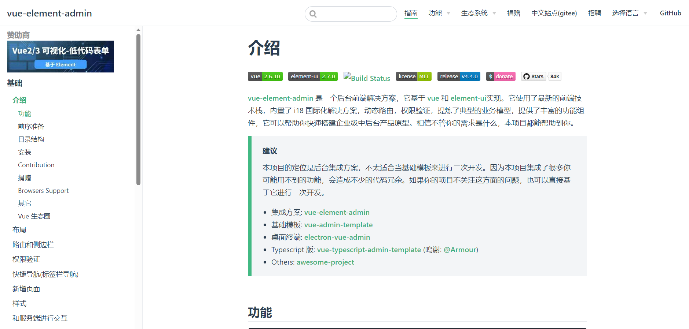

 **目录结构**

```
├── build                      // 构建相关  
├── config                     // 配置相关
├── src                        // 源代码
│   ├── api                    // 所有请求
│   ├── assets                 // 主题 字体等静态资源
│   ├── components             // 全局公用组件
│   ├── directive              // 全局指令
│   ├── filtres                // 全局 filter
│   ├── icons                  // 项目所有 svg icons(图标)
│   ├── lang                   // 国际化 language
│   ├── mock                   // 项目mock 模拟数据
│   ├── router                 // 路由
│   ├── store                  // 全局 store管理
│   ├── styles                 // 全局样式
│   ├── utils                  // 全局公用方法
│   ├── vendor                 // 公用vendor
│   ├── views                   // view(页面)
│   ├── App.vue                // 入口页面
│   ├── main.js                // 入口 加载组件 初始化等
│   └── permission.js          // 权限管理
├── static                     // 第三方不打包资源
│   └── Tinymce                // 富文本
├── .babelrc                   // babel-loader 配置
├── eslintrc.js                // eslint 配置项
├── .gitignore                 // git 忽略项
├── favicon.ico                // favicon图标
├── index.html                 // html模板
└── package.json               // package.json
```

### 3. 项目初始化

1. 解压至非中文无空格目录下

2. [vscode](https://so.csdn.net/so/search?q=vscode&spm=1001.2101.3001.7020)打开项目

3. package.json所在的目录下安装依赖

   ```
   npm config set registry http://registry.npm.taobao.org/
   ```

   ```
   npm install
   ```

4. 运行测试

   ```
   npm run dev
   ```

   

5. 配置修改

   

   

6. 重启测试

### 4. 登录页修改

1. 中文描述

2. 背景图

   图片放在assets里面，然后修改.login-container

   ```css
   background-image: url('../../assets/bg.jpeg');
   ```

   登录框调整

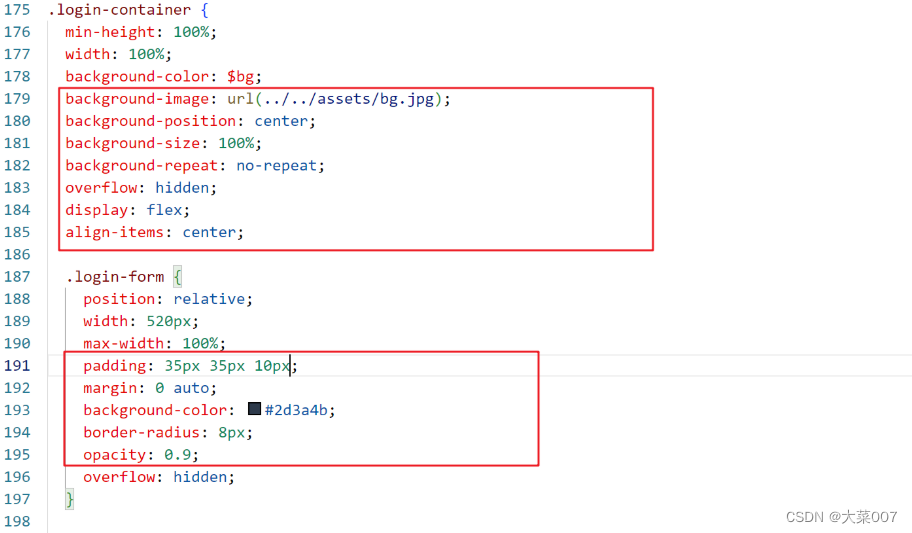

1. 登录用户名取消限制
   

### 5. 修改右上角用户下拉菜单

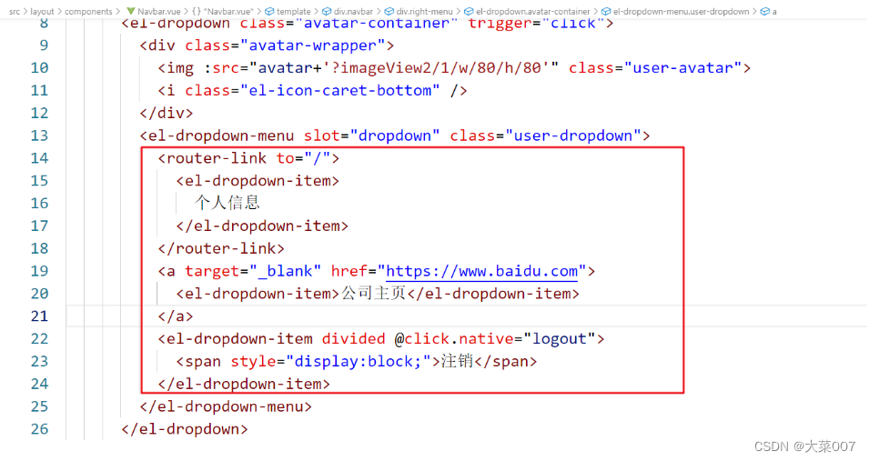


### 6. 首页面包屑导航


### 7. 菜单初始化

1. 在src\views目录下创建[sys模块](https://so.csdn.net/so/search?q=sys模块&spm=1001.2101.3001.7020)目录、test模块目录（充数用，后续可用作权限分配测试）

2. 在sys下创建user.vue、role.vue两个组件文件

   在test下创建test1.vue、test2.vue、test3.vue

3. 修改路由配置

   ```js
   {
       path: '/sys',
       component: Layout,
       redirect: '/sys/user', //重定向
       name: 'sys',
       meta: { title: '系统管理', icon: 'sys' }, //标题,图标
       children: [
         {
             // 二级菜单
           path: 'user',
           name: 'user',
           component: () => import('@/views/sys/user'), // 组件
           meta: { title: '用户管理', icon: 'userManage' } //icons\svg中的图标userManage
         },
         {
           path: 'role',
           name: 'role',
           component: () => import('@/views/sys/role'),
           meta: { title: '角色管理', icon: 'roleManage' }
         }
       ]
     },
   
     {
       path: '/test',
       component: Layout,
       redirect: '/test/test1',
       name: 'test',
       meta: { title: '功能测试', icon: 'form' },
       children: [
         {
           path: 'test1',
           name: 'test1',
           component: () => import('@/views/test/test1'),
           meta: { title: '测试点一', icon: 'form' }
         },
         {
           path: 'test2',
           name: 'test2',
           component: () => import('@/views/test/test2'),
           meta: { title: '测试点二', icon: 'form' }
         },
         {
           path: 'test3',
           name: 'test3',
           component: () => import('@/views/test/test3'),
           meta: { title: '测试点三', icon: 'form' }
         }
       ]
     }
   
   ```

   图标svg文件可上 https://www.iconfont.cn/ 下载

   注意: 图标放在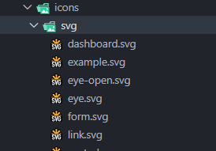目录下

效果


### 8. 标签栏导航(没用)

1. **@/layout/components/AppMain.vue**
   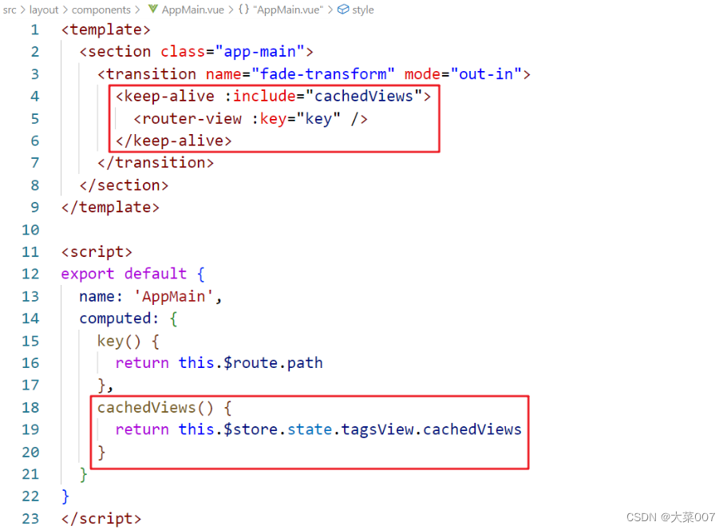

   ```html
   <keep-alive :include="cachedViews">
       <router-view :key="key" />
   </keep-alive>
   ```

   ```js
   cachedViews() {
       return this.$store.state.tagsView.cachedViews
   }
   ```

2. **复制vue-element-admin项目中的文件到相应的目录中**

   @/layout/components/TagsView
   @/store/modules/tagsView.js
   @/store/modules/permission.js

3. **修改文件@store/getters.js**
   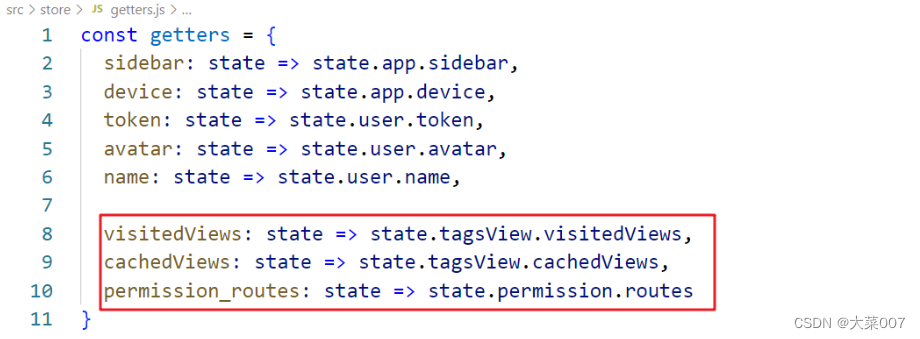

   ```js
   visitedViews: state => state.tagsView.visitedViews,
   cachedViews: state => state.tagsView.cachedViews,   
   permission_routes: state => state.permission.routes
   ```

4. **修改文件@store/index.js**
   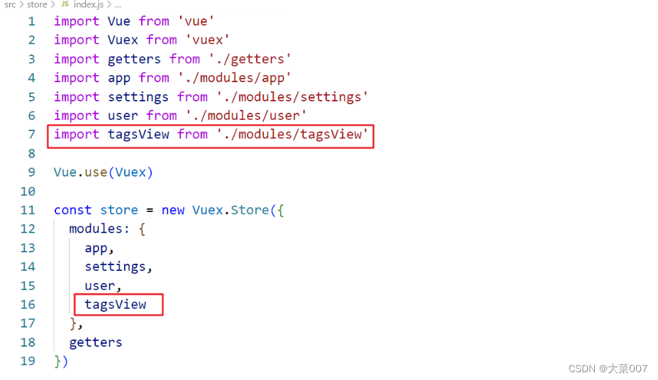

5. **修改文件@\layout\index.vue**
   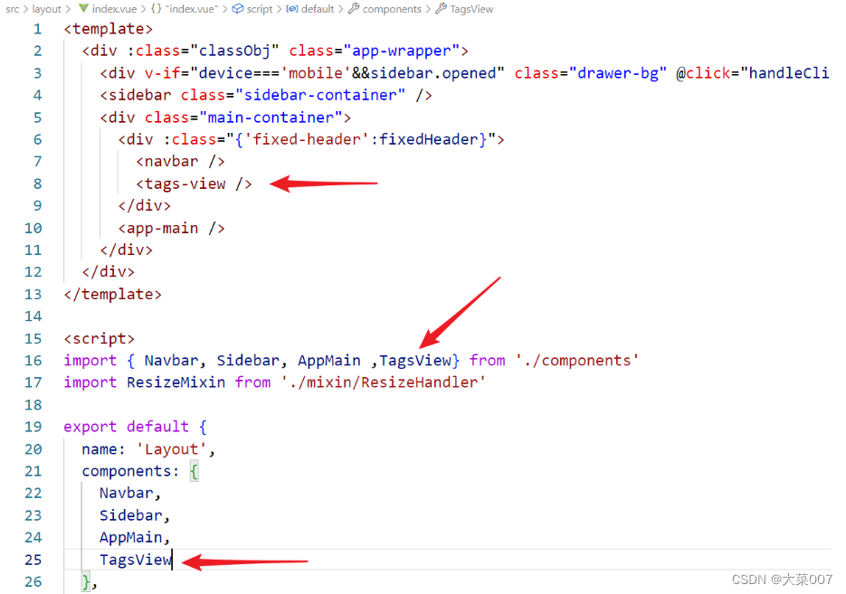

6. **修改文件@layout\components\index.js**

   新增

   ```js
   export { default as TagsView } from './TagsView'
   ```

7. **Affix 固钉**
   当在声明路由是 添加了 Affix 属性，则当前tag会被固定在 tags-view中（不可被删除）
   

报错vue-admin-template-4.4.0\src\layout\components\TagsView\ScrollPane.vue修改如下


### 9. 登录接口梳理

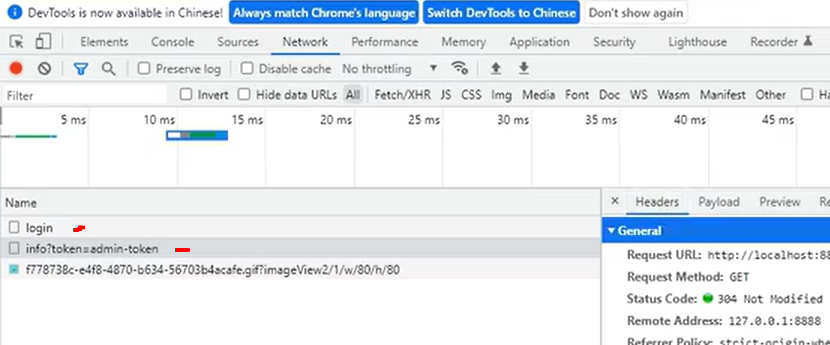

| 接口         | url          | method |
| ------------ | ------------ | ------ |
| 登录         | /user/login  | post   |
| 获取用户信息 | /user/info   | get    |
| 注销         | /user/logout | post   |

**响应**

```js
{"code":20000,"data":{"token":"admin-token"}}

{"code":20000,"data":{"roles":["admin"],"introduction":"I am a super administrator","avatar":"https://wpimg.wallstcn.com/f778738c-e4f8-4870-b634-56703b4acafe.gif","name":"Super Admin"}}

{"code":20000,"data":"success"}
```

### 10. 对接后端接口

1. 修改 .env.development 中的base api，打包部署的话要修改.env.production

   ```js
   VUE_APP_BASE_API = 'http://localhost:9999'
   ```

2. 修改vue.config.js，屏蔽mock请求
   

3. 修改src\api\user.js，将url中的/vue-admin-template去掉

   

4. 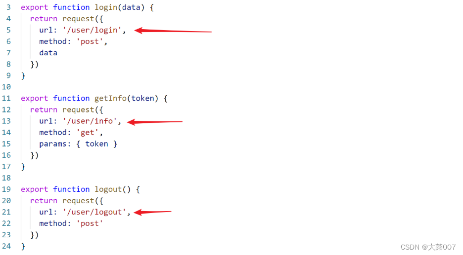

5. 重启

6. 测试，预期会出现跨域错误

7. 后端做跨域处理测试应该成功，并可在调试窗口观察接口调用情况

### 11. 用户管理页面模块

官网: [组件 | Element](https://element.eleme.cn/2.13/#/zh-CN/component/installation)

使用Element 注意使用版本一致的package.json文件里有相应的依赖版本


**预览**
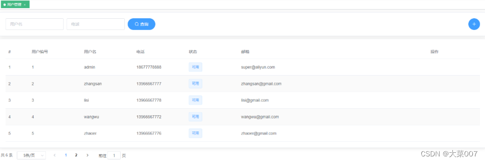

- **用户查询**

  1. 定义userManager.js

  2. 分页序号处理

     ```html
     <template slot-scope="scope">
         {{(searchModel.pageNo-1) * searchModel.pageSize + scope.$index + 1}}
     </template>
     ```

- **用户新增**

  1. 窗口关闭后数据还在

     监听close，清理表单

  2. 表单数据验证

     常规验证

     自定义验证

  3. 窗口关闭后上次验证结果还在

- **用户修改**

- **用户删除**'


用户模块

通过用户名和电话查询用户信息, 思路: 后端返回查询结果


```vue
<template lang="">
    <div>
        <!-- 搜索栏 -->
        <el-card id="search">
            <el-row>
                <el-col :span="4">
                    <el-input v-model="input" placeholder="用户名"></el-input>
                </el-col>
                <el-col :span="4">
                    <el-input v-model="input" placeholder="电话"></el-input>
                </el-col>
                <el-col :span="8" :offset="1">
                    <el-button type="primary" round icon="el-icon-search">查询</el-button>
                </el-col>
                <el-col :span="7" align="right">
                    <el-button type="primary"  icon="el-icon-plus" circle></el-button>
                </el-col>
            </el-row>
        </el-card>
        <!-- 结果列表 -->
        <el-card>
            <el-table :data="userList" stripe style="width: 100%">
            <el-table-column type="index" label="" width="80">
            </el-table-column>
            <el-table-column prop="id" label="用户ID" width="180">
            </el-table-column>
            <el-table-column prop="username" label="用户名" width="180">
            </el-table-column>
            <el-table-column prop="phone" label="电话" width="180">
            </el-table-column>
            <el-table-column prop="phone" label="电子邮件">
            </el-table-column>
            <el-table-column label="操作" width="180">
            </el-table-column>
            </el-table>
        </el-card>
        <!-- 分页组件 -->       
        <!-- <el-pagination
            @size-change="handleSizeChange"
            @current-change="handleCurrentChange"
            :current-page.sync="searchModel.pageNo"
            :page-sizes="[5, 10, 20, 50]"
            :page-size="100"
            layout="total,sizes, prev, pager, next"
            :total="total">
        </el-pagination> -->
        <div style="display: flex; justify-content: center;">
        <el-pagination
            @size-change="handleSizeChange"
            @current-change="handleCurrentChange"
            :current-page.sync="searchModel.pageNo"
            :page-sizes="[5, 10, 20, 50]"
            :page-size="100"
            layout="total, sizes, prev, pager, next"
            :total="total">
        </el-pagination>
        </div>
    </div>
</template>
<script>
export default {
    data(){
        return {
            searchModel: {
                pageNo: 1,
                pageSize: 10
            },
            userList: [],
            total: 0
        }
    },
    methods:{
        handleSizeChange(){

        },
        handlecurrentchange(){

        }
    }
}
</script>
<style lang="">

</style>
```

中文显示


```
import locale from 'element-ui/lib/locale/lang/zh-CN' // lang i18n
```


# api

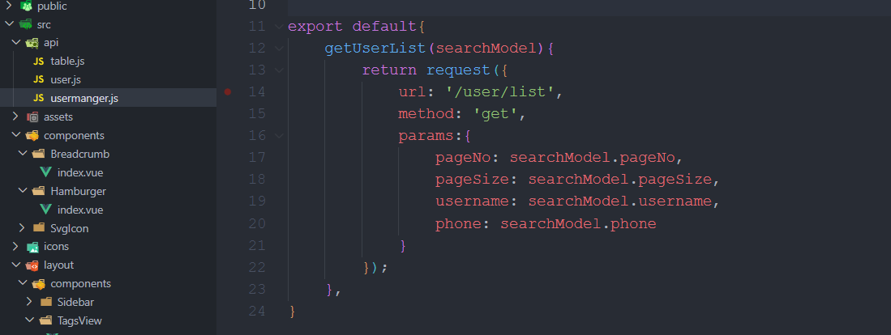


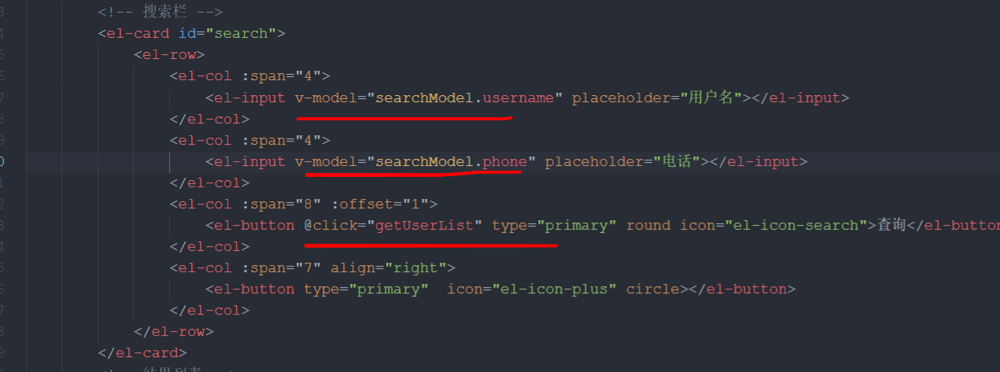


修改

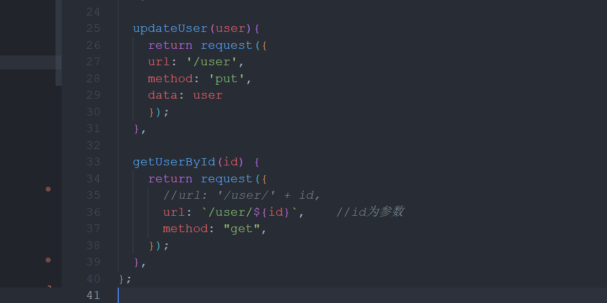

删除


