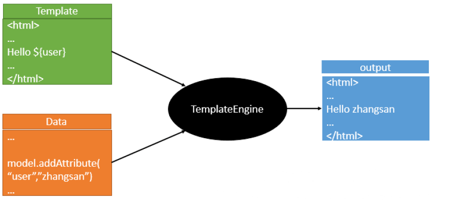
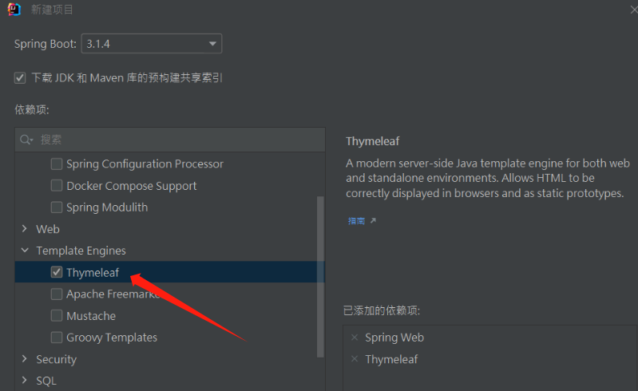
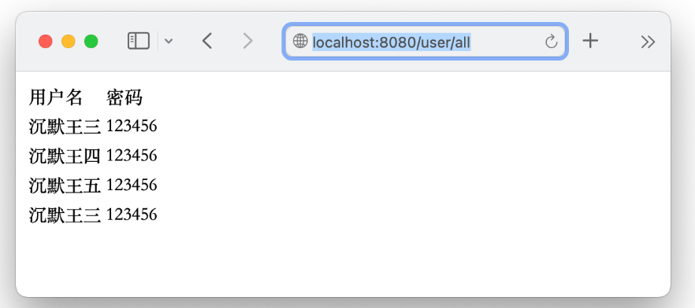
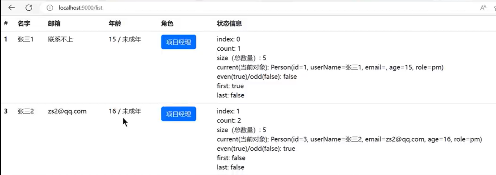

# Thymeleaf模板引擎(页面)

由于 **SpringBoot** 使用了**嵌入式 Servlet 容器**。所以 **JSP** 默认是**不能使用**的

如果需要**服务端页面渲染**，优先考虑使用 模板引擎。

两种模式:

1. `前后分离模式`： `@RestController `响应JSON数据

2. `前后不分离模式`：@Controller + Thymeleaf模板引擎

==模板引擎页面默认放在 src/main/resources/templates==

**SpringBoot** 包含以下模板引擎的自动配置

- FreeMarker
- Groovy
- **Thymeleaf**    https://www.thymeleaf.org/ 
- Mustache

# Thymeleaf 简介

- 1、Thymeleaf 是 Web 和独立环境的现代服务器端 Java 模板引擎，能够处理HTML，XML，JavaScript，CSS 甚至纯文本。
- 2、Thymeleaf 的主要目标是提供一种优雅和高度可维护的创建模板的方式。为了实现这一点，它建立在自然模板的概念上，将其逻辑注入到模板文件中，不会影响模板被用作设计原型。这改善了设计的沟通，弥补了设计和开 发团队之间的差距。
- 3、Thymeleaf 也从一开始就设计了Web标准 - 特别是 HTML5 - 允许您创建完全验证的模板，Spring Boot 官方推荐使用 thymeleaf 而不是 JSP。
- 4、Thymeleaf 官网：https://www.thymeleaf.org/
- 5、Thymeleaf 在 Github 的主页：https://github.com/thymeleaf/thymeleaf
- 6、Spring Boot 中使用 Thymeleaf 模板引擎时非常简单，因为 Spring Boot 已经提供了默认的配置，比如解析的文件前缀，文件后缀，文件编码，缓存等等，程序员需要的只是写 html 中的内容即可。

## [模板引擎](https://github.com/andanyoung/springnotes/blob/master/notes/Thymeleaf/1.Thymeleaf模板引擎简介与入门.md#模板引擎)

1）市面上主流的 Java 模板引擎有：JSP、Velocity、Freemarker、Thymeleaf

2）JSP本质也是模板引擎，Spring Boot 官方推荐使用 “Thymeleaf”模板引擎

3）模板引擎原理图如下，模板引擎的作用都是将模板(页面)和数据进行整合然后输出显示，区别在于不同的模板使用不同的语法，如 JSP 的 JSTL 表达式，以及 JSP 自己的表达式和语法，同理 Thymeleaf 也有自己的语法 



## Thymeleaf整合

### 依赖

#### 方法1: idea创建项目时导入



#### 方法2: Maven

```xml
<dependency>
    <groupId>org.springframework.boot</groupId>
    <artifactId>spring-boot-starter-thymeleaf</artifactId>
</dependency>
```

### 配置

 application.properties文件

```properties
#thymelea模板配置
spring.thymeleaf.prefix=classpath:/templates/
spring.thymeleaf.suffix=.html
spring.thymeleaf.mode=HTML5
spring.thymeleaf.encoding=UTF-8
#热部署文件，页面不产生缓存，及时更新
#开发期间关闭，上线以后开启
spring.thymeleaf.cache=false
```

### HTML中添加

```html
<!DOCTYPE html>
<html xmlns:th="http://www.thymeleaf.org">
```

## 基本使用

**UserController.java**

```java
@Controller
@RequestMapping("/user")
public class UserController {
    @Resource
    private UserService userService;

    @RequestMapping("/all")
    public String all(Model model) {
        model.addAttribute("users", userService.findAll());
        return "all";
   
}
```

**在 resources/templates 目录下新建 all.html 文件**

```html
<!DOCTYPE html>
<html lang="zh" xmlns:th="http://www.thymeleaf.org">
<head>
    <meta http-equiv="content-type" content="text/html;charset=utf-8">
    <title>Thymeleaf</title>
</head>
<body>
    <table>
        <tr>
            <td>用户名</td>
            <td>密码</td>
        </tr>
        <tr th:each="user:${users}">
            <td th:text="${user.name}"></td>
            <td th:text="${user.password}"></td>
        </tr>
    </table>
</body>
</html>
```

在浏览器地址栏里输入 `http://localhost:8080/user/all` 访问接口



## Thymeleaf基础语法

### 1. 核心用法

`th:xxx`**：动态渲染指定的 html 标签属性值、或者th指令（遍历、判断等）**

- `th:text`：标签体内文本值渲染
- `th:utext`：不会转义，显示为html原本的样子。
- `th:属性`：标签指定属性渲染
- `th:attr`：标签任意属性渲染
- `th:if   th:each  ...`：其他th指令

`表达式`**：用来动态取值**

- `${}`**：变量取值；使用model共享给页面的值都直接用${}**
- `@{}`**：url路径；**
- `#{}`：国际化消息
- `~{}`：片段引用
- `*{}`：变量选择：需要配合th:object绑定对象

例子:

注意:  

+ `<h1>${msg}</h1>会报错, 并不能像vue那种{{}}一样使用`

+ ```html
  <!--  <span th:text="${user.name}"></span>  报错--> 
  <span   th:if="${user != null}" th:text="${user.name}"></span>  <!--一定要加限制不然会报错 -->
  <span  th:if="${user == null}">xxx</span>
  ```

```xml
<!DOCTYPE html>
<html lang="en" xmlns:th="http://www.thymeleaf.org">
<head>
    <meta charset="UTF-8">
    <title>Title</title>
</head>
<body>
<h1>你好：<span th:text="${msg}"></span></h1>

<hr/>
th:text： 替换标签体的内容； 会转义
th:utext: 替换标签体的内容; 不会转义html标签，真正显示为html该有的样式
<h1 th:text="${msg}">哈哈</h1>
<h1 th:utext="${msg}">呵呵</h1>
<hr/>
<hr/>
th: 任意html属性； 动态替换任意属性的值

<br/>
th:attr：任意属性指定

<br/>
th：其他指令


<br/>
2.jpg  @{} 专门用来取各种路径


3. 使用工具类
转大写
<h1 th:text="${#strings.toUpperCase(name)}"></h1>
<h1 th:text="${'前缀：'+name+'后缀'}"></h1>
拼串
<h1 th:text="|前缀哈哈 ${name} 后缀呵呵|"></h1>
</body>
</html>
```

```java
package com.atguigu.web.controller;

import com.atguigu.web.bean.Person;
import com.atguigu.web.service.AService;
import jakarta.servlet.http.HttpServletRequest;
import lombok.extern.slf4j.Slf4j;
import org.springframework.beans.factory.annotation.Autowired;
import org.springframework.stereotype.Controller;
import org.springframework.ui.Model;
import org.springframework.web.bind.annotation.ExceptionHandler;
import org.springframework.web.bind.annotation.GetMapping;
import org.springframework.web.bind.annotation.RequestParam;
import org.springframework.web.bind.annotation.ResponseBody;

import java.util.Arrays;
import java.util.List;


/**
 * @author lfy
 * @Description
 * @create 2023-04-13 16:37
 */
@Controller //适配 服务端渲染   前后不分离模式开始
public class WelcomeController {

    @Autowired
    AService aService;

    /**
     * 利用模板引擎跳转到指定页面
     * @return
     */
    @GetMapping("/well")
    public String hello(@RequestParam("name") String name,
                        Model model, HttpServletRequest request){
				// 页面发送一个参数name,比如localhost:9000/well?name=李四


        //把需要给页面共享的数据放到model中
        String text = "<span style='color:red'>"+name+"</span>";
        model.addAttribute("msg",text);


        model.addAttribute("name",name);

        aService.a();

        //路径是动态的
        model.addAttribute("imgUrl","/4.jpg");
        //数据库查出的样式
        model.addAttribute("style","width: 400px");

        model.addAttribute("show",false);

        //模板的逻辑视图名
        //物理视图 =  前缀 + 逻辑视图名 + 后缀
        //真实地址 = classpath:/templates/welcome.html
        return "welcome";
    }
}
```

**系统工具&内置对象：**[**详细文档**](https://www.thymeleaf.org/doc/tutorials/3.1/usingthymeleaf.html#appendix-a-expression-basic-objects)

- `param`：请求参数对象
- `session`：session对象
- `application`：application对象
- `#execInfo`：模板执行信息
- `#messages`：国际化消息
- `#uris`：uri/url工具
- `#conversions`：类型转换工具
- `#dates`：日期工具，是`java.util.Date`对象的工具类
- `#calendars`：类似#dates，只不过是`java.util.Calendar`对象的工具类
- `#temporals`： JDK8+ `**java.time**` API 工具类
- `#numbers`：数字操作工具
- `#strings`：字符串操作
- `#objects`：对象操作
- `#bools`：bool操作
- `#arrays`：array工具
- `#lists`：list工具
- `#sets`：set工具
- `#maps`：map工具
- `#aggregates`：集合聚合工具（sum、avg）
- `#ids`：id生成工具

### 2. 语法示例

**表达式：**

- 变量取值：${...}
- url 取值：@{...}
- 国际化消息：#{...}
- 变量选择：*{...}
- 片段引用: ~{...}

**常见：**

- 文本： 'one text'，'another one!',...
- 数字： 0,34,3.0,12.3,...
- 布尔：true、false
- null: null
- 变量名： one,sometext,main...

**文本操作：**

- 拼串： +

- 文本替换：| The name is ${name} |

  ```xml
  拼串
  <h1 th:text="|前缀哈哈 ${name} 后缀呵呵|"></h1>
  ```


**布尔操作：**

- 二进制运算： and,or
- 取反：!,not

**比较运算：**

- 比较：>，<，<=，>=（gt，lt，ge,le）
- 等值运算：==,!=（eq，ne）

**条件运算：**

- if-then： (if)?(then)
- if-then-else: (if)?(then):(else)
- default: (value)?:(defaultValue)

**特殊语法：**

- 无操作：_

**所有以上都可以嵌套组合**

```html
<div th:text='User is of type ' + (${user.isAdmin()} ? 'Administrator' : (${user.type} ?: 'Unknown'))/>
```

### 3. 属性设置

1. th:href="@{/product/list}"
2. th:attr="class=${active}"
3. th:attr="src=@{/images/gtvglogo.png},title=${logo},alt=#{logo}"  //批量设置属性
4. th:checked="${user.active}"

```html
<p th:text="${content}">原内容</p>
<a th:href="${url}">登录</a>

```

### 4. 遍历

语法：  `th:each="元素名,迭代状态 : ${集合}"`

```html
<tr th:each="prod : ${prods}">
  <td th:text="${prod.name}">Onions</td>
  <td th:text="${prod.price}">2.41</td>
  <td th:text="${prod.inStock}? #{true} : #{false}">yes</td>
</tr>

// 加上迭代状态
<tr th:each="prod,iterStat : ${prods}" th:class="${iterStat.odd}? 'odd'">
  <td th:text="${prod.name}">Onions</td>
  <td th:text="${prod.price}">2.41</td>
  <td th:text="${prod.inStock}? #{true} : #{false}">yes</td>
</tr>
```

iterStat 有以下属性：

- index：当前遍历元素的索引，从0开始
- count：当前遍历元素的索引，从1开始
- size：需要遍历元素的总数量
- current：当前正在遍历的元素对象
- even/odd：是否偶数/奇数行
- first：是否第一个元素
- last：是否最后一个元素

```java
th:each属性用于迭代循环，语法：th:each="obj,iterStat:${objList}"
迭代对象可以是Java.util.List,java.util.Map,数组等;
iterStat 称作状态变量，属性有：
    index:当前迭代对象的index（从0开始计算）
    count: 当前迭代对象的index(从1开始计算)
    size:被迭代对象的大小
    current:当前迭代变量
    even/odd:布尔值，当前循环是否是偶数/奇数（从0开始计算）
    first:布尔值，当前循环是否是第一个
    last:布尔值，当前循环是否是最后一个
```

```html
<ol>  
       <li>List循环：  
            <table border="1">  
              <tr>  
                <th>用户名</th>  
                <th>邮箱</th>  
                <th>管理员</th>  
                <th>状态变量：index</th>  
                <th>状态变量：count</th>  
                <th>状态变量：size</th>  
                <th>状态变量：current.userName</th>  
                <th>状态变量：even</th>  
                <th>状态变量：odd</th>  
                <th>状态变量：first</th>  
                <th>状态变量：last</th>  
              </tr>  
              <tr  th:each="user,userStat : ${list}">  
                <td th:text="${user.userName}">Onions</td>  
                <td th:text="${user.email}">test@test.com.cn</td>  
                <td th:text="${user.isAdmin}">yes</td>  
                 <th th:text="${userStat.index}">状态变量：index</th>  
                <th th:text="${userStat.count}">状态变量：count</th>  
                <th th:text="${userStat.size}">状态变量：size</th>  
                <th th:text="${userStat.current.userName}">状态变量：current</th>  
                <th th:text="${userStat.even}">状态变量：even****</th>  
                <th th:text="${userStat.odd}">状态变量：odd</th>  
                <th th:text="${userStat.first}">状态变量：first</th>  
                <th th:text="${userStat.last}">状态变量：last</th>  
				<a th:href="@{/kickout(username=${user.username})}">下线</a>
              </tr>  
            </table>  
        </li>  
        <li>Map循环：  
            <div th:each="mapS:${map}">  
            <div th:text="${mapS}"></div>  
            </div>  
        </li>  
        <li>数组循环：  
            <div th:each="arrayS:${arrays}">  
            <div th:text="${arrayS}"></div>  
            </div>  
        </li>  
        </ol>
```

### 5. 判断

#### th:if

```html
<a
  href="comments.html"
  th:href="@{/product/comments(prodId=${prod.id})}"
  th:if="${not #lists.isEmpty(prod.comments)}"
  >view</a
```

#### th:switch

```html
<div th:switch="${user.role}">
  <p th:case="'admin'">User is an administrator</p>
  <p th:case="#{roles.manager}">User is a manager</p>
  <p th:case="*">User is some other thing</p>
</div>
```



### 6. 属性优先级

- 片段
- 遍历
- 判断

```html
<ul>
  <li th:each="item : ${items}" th:text="${item.description}">Item description here...</li>
</ul>
```

| Order | Feature          | Attributes                           |
| ----- | ---------------- | ------------------------------------ |
| 1     | 片段包含         | th:insert th:replace                 |
| 2     | 遍历             | th:each                              |
| 3     | 判断             | th:if th:unless th:switch th:case    |
| 4     | 定义本地变量     | th:object th:with                    |
| 5     | 通用方式属性修改 | th:attr th:attrprepend th:attrappend |
| 6     | 指定属性修改     | th:value th:href th:src ...          |
| 7     | 文本值           | th:text th:utext                     |
| 8     | 片段指定         | th:fragment                          |
| 9     | 片段移除         | th:remove                            |

### 7. 行内写法

```
[[...]] or [(...)]
<p>Hello, [[${session.user.name}]]!</p>
```

### 8. 变量选择

```html
<div th:object="${session.user}">
  <p>Name: <span th:text="*{firstName}">Sebastian</span>.</p>
  <p>Surname: <span th:text="*{lastName}">Pepper</span>.</p>
  <p>Nationality: <span th:text="*{nationality}">Saturn</span>.</p>
</div>
```

等同于

```html
<div>
  <p>Name: <span th:text="${session.user.firstName}">Sebastian</span>.</p>
  <p>Surname: <span th:text="${session.user.lastName}">Pepper</span>.</p>
  <p>Nationality: <span th:text="${session.user.nationality}">Saturn</span>.</p>
</div
```

### 9. 模板布局

- 定义模板： `th:fragment`
- 引用模板：`~{templatename::selector}`
- 插入模板：`th:insert`、`th:replace`

```html
<footer th:fragment="copy">&copy; 2011 The Good Thymes Virtual Grocery</footer>

<body>
  <div th:insert="~{footer :: copy}"></div>
  <div th:replace="~{footer :: copy}"></div>
</body>
<body>
  结果：
  <body>
    <div>
      <footer>&copy; 2011 The Good Thymes Virtual Grocery</footer>
    </div>

    <footer>&copy; 2011 The Good Thymes Virtual Grocery</footer>
  </body>
</body>
```


# 加载css/js

**文件目录**

```
-resources
    --mapper
    --static
        ---css
        ---fonts
        ---img
        ---js
    --templates
    	---index.html
```

**Thymeleaf加载css/js方法**

```javascript
<link th:href="@{/css/amazeui.min.css}" rel="stylesheet">
<link th:href="@{/css/admin.css }" rel="stylesheet">
<link th:href="@{/css/app.css}" rel="stylesheet">
<script th:src="@{/js/jquery.min.js}"></script>
<script th:src="@{/js/amazeui.min.js}"></script>
<script th:src="@{/js/app.js}"></script>
```

# 传参:crossed_swords:

##  ① 页面间参数传递

C得到数据后，跳转到V，并向V传递数据。进而V中可以渲染数据，让用户看到含有数据的页面

转发跳转：Request作用域

重定向跳转：Session作用域

### request作用域

#### 1、@ModelAttribute 接受参数 (常用)

```html
<html>
<body>
<h2>Hello World!</h2>
<h2>${uname}</h2>
<h2>${msg}</h2>
</body>
</html>
```

Controller层

```java
@RequestMapping("/providerInfo1")
public ModelAndView providerInfo1(@ModelAttribute("uname") String uname) {
    return new ModelAndView("/hello");
}
```

效果

.assets/ca312b94930d4e31b927a6968bdc3d03.png)

#### 2、RedirectAttributes  给重定向页面传递参数 （常用）

重定向  url地址栏会发生变化

```html
<form class="am-form" action="/dologin" method="post">
    <fieldset>
        <div class="am-form-group">
            <input type="email" class="" id="doc-ipt-email-1" name="username" placeholder="请输入账号">
        </div>
        <div class="am-form-group">
            <input type="password" class="" id="doc-ipt-pwd-1" name="password" placeholder="请输入密码">
        </div>
        <a href="#" class="loginBtn" onclick="submitForm()">
            <div>登 录</div>
        </a>
    </fieldset>
</form>
```

提交上述表单后

```java
@PostMapping("/dologin")
public String login(HttpServletRequest request,  RedirectAttributes redirectAttributes){
    String name = request.getParameter("username");
    String password = request.getParameter("password");
    User user = userService.findByNameAndPassword(name, password);
    if(user != null){
        redirectAttributes.addAttribute("userId", user.getId());
        return "redirect:invoice-list";
        // http://localhost:9000/invoice-list?userId=1
    }else{
        return "login";
    }
}
```

重定向后

```java
//http://localhost:9000/invoice-list?userId=1
@RequestMapping("/invoice-list")
public String invoiceList(Model model, @RequestParam("userId") Integer userId) {
    User user = userService.findById(userId);
    if (user.get(0) != null) {
        model.addAttribute("user", user.get(0));
        return "invoice-list";
    } else {
        return "login";
    }
}

//jsp中用EL表达式 取值即可   
${user.xxx}
```

#### 3、用Model 给跳转页面传递参数（常用）

跳转   url地址栏不会产生变化

```java
//model中的数据，会在V渲染之前，将数据复制一份给request
@RequestMapping("/test")
public String testData(Model model){
    model.addAttribute("name", "张三");
    return "index";       // 注意上述参数只能给index页面用
}

//jsp中用EL表达式 取值即可   
${name}
```

**例子**

```html
<html>
<body>
<h2>Hello World!</h2>
<h2>${uname}</h2>
<h2>${msg}</h2>
</body>
</html>
```

Controller层（返回类型是String）

```java
@RequestMapping("/providerInfo3")
public String providerInfo3(Model model) {
    String msg = "我是providerInfo3";
    model.addAttribute("msg", msg);
    return "/hello";
}
```

效果

.assets/76b209ccf84e49309664204087f0fd57.png)

```java
//model中的数据，会在V渲染之前，将数据复制一份给request
@RequestMapping("/test")
public String testData(Model model){
    model.addAttribute("name", "张三");
    return "index";
}

//jsp中用EL表达式 取值即可
${requestScope.name}
```

#### 4、用map传参（常用）

> 使用map.put();

Controller层（返回类型是String）

```java
@RequestMapping("/providerInfo4")
public String providerInfo4(Map<String, Object> map) {
    String msg = "我是providerInfo4";
    map.put("msg", msg);
    return "/hello";
}
```

效果

.assets/bb78f83520de48a287369fe48c1c1202.png)

#### 5、使用HttpServletRequest  传递参数/接收参数

==Servlet的api不怎么常用==

+ setAttribute()     传递

+ getParameter()  接收

**例子**

需要先引入servlet-api.jar

pom.xml

```xml
<!-- javax-Servlet -->
<dependency>
    <groupId>javax.servlet</groupId>
    <artifactId>servlet-api</artifactId>
    <version>2.5</version>
</dependency>
```

Controller层

```java
@RequestMapping("/providerInfo5")
public ModelAndView providerInfo5(HttpServletRequest request) {
    String msg = "我是providerInfo5";
    request.setAttribute("msg", msg);
    return new ModelAndView("/hello");
}
```

效果

.assets/c3f96bc2ef5a4dae931398523a1aac7d.png)

### session作用域

#### 1、@SessionAttributes

只能定义在类上,作用是将指定的Model中的键值对添加至session中

Controller层

```java
@Controller
@SessionAttributes(value = {"uname"})
@RequestMapping("provider") //模块路径：更清晰也防止映射路径访问同名混乱出现问题
public class ProviderController {
    
    @RequestMapping("/providerInfo")
    public ModelAndView providerInfo(String uname) {
        ModelAndView mav = new ModelAndView("/hello");
        mav.addObject("uname",uname);
        return mav;
    }
}
```

效果

.assets/5449fa75000045838ea24aec783afc89.png)

先访问providerInfo加入参数添加session，再访问其它方法（providerInfo1）能够接收到

> @SessionAttributes(types=User.class)会将model中所有类型为 User的属性添加到会话中。
> @SessionAttributes(value={“user1”, “user2”}) 会将model中属性名为user1和user2的属性添加到会话中。
> @SessionAttributes(types={User.class, Dept.class}) 会将model中所有类型为 User和Dept的属性添加到会话中。
> @SessionAttributes(value={“user1”,“user2”},types={Dept.class})会将model中属性名为user1和user2以及类型为Dept的属性添加到会话中。

#### 2、以Servlet方式存储

```xml
<!-- javax-Servlet -->
<dependency>
    <groupId>javax.servlet</groupId>
    <artifactId>servlet-api</artifactId>
    <version>2.5</version>
</dependency>
```

##### 1.使用HttpServletRequest

Controller层

```java
@RequestMapping("/providerInfo11")
public ModelAndView providerInfo11(HttpServletRequest request) {
    String msg = "我是Session11";
    request.getSession().setAttribute("msg", msg);
    return new ModelAndView("/hello");
}
```

##### 2.使用HttpSession

Controller层

```java
@RequestMapping("/providerInfo22")
public ModelAndView providerInfo22(HttpSession session) {
    String msg = "我是Session22";
    session.setAttribute("msg", msg);
    return new ModelAndView("/hello");
}
```

可以先进入然后再分别返回providerInfo1方法中试一下

效果

.assets/1d75239a7fb249a8bb3bf728be96f2de.png)

运行的是providerInfo1方法但仍然保存着providerInfo22的session值

## ② @ResponseBody

`@ResponseBody`注解用于指示方法返回的对象会被自动转换为JSON格式的数据。

### 传对象参数

使用@ResponseBody注解

Controller层

```java
@RequestMapping("findProviderJson")
@ResponseBody
public Provider findProviderJson() {
    Provider provider = new Provider();
    provider.setProName("呆古米");
    provider.setProCode("222");
    provider.setCreationDate(new Date());

    return provider;
}
```

效果

.assets/2b9cb7aee730473aa17919b79a411268.png)

想为null时不返回可以用上面说过的（放在实体类所需属性或类上）：

```java
@JsonSerialize(include = JsonSerialize.Inclusion.NON_NULL)
```

效果

.assets/3cc5a22f105a4a9fa66dd0eede431d78.png)

### 传集合参数

Controller层

```java
@RequestMapping("findProviderListJson")
@ResponseBody
public List<Provider> findProviderListJson() {
    List<Provider> providers = new ArrayList<>();

    Provider provider1 = new Provider();
    provider1.setProName("呆古米");
    provider1.setProCode("222");
    provider1.setCreationDate(new Date());

    Provider provider2 = new Provider();
    provider2.setProName("海胆kuma");
    provider2.setProCode("333");
    provider2.setCreationDate(new Date());

    providers.add(provider1);
    providers.add(provider2);

    return providers;
}
```

效果
.assets/6d0d67576c504ea681b67e2353fb7c8a.png)

### 传日期参数

【**第一种办法**】在该属性上添加@JsonFormat(pattern = “yyyy-MM-dd”)注解，代码如下：

```java
package com.mango.json.bean;

import com.fasterxml.jackson.annotation.JsonFormat;

import java.util.Date;

public class User {

    private Integer id;
    
    @JsonFormat(pattern = "yyyy-MM-dd")  // 重要
    private Date birthday;

    public Date getBirthday() {
        return birthday;
    }

    public void setBirthday(Date birthday) {
        this.birthday = birthday;
    }
    
    public Integer getId() {
        return id;
    }

    public void setId(Integer id) {
        this.id = id;
    }
}
```

【**第二种办法**】json肯定离不开ObjectMapper，因为json格式和java中的对象之间进行转换就是通过ObjectMapper类, 重写方法

WebMvcConfig.java

```java
package com.mango.json.config;

import com.fasterxml.jackson.databind.ObjectMapper;
import org.springframework.context.annotation.Bean;
import org.springframework.context.annotation.Configuration;
import org.springframework.http.converter.json.MappingJackson2HttpMessageConverter;

import java.text.SimpleDateFormat;

@Configuration
public class WebMvcConfig {

    @Bean
    MappingJackson2HttpMessageConverter mappingJackson2HttpMessageConverter(){
        MappingJackson2HttpMessageConverter converter = new MappingJackson2HttpMessageConverter();
        ObjectMapper objectMapper = new ObjectMapper();
        objectMapper.setDateFormat(new SimpleDateFormat("yyyy-MM-dd"));
        converter.setObjectMapper(objectMapper);
        return converter;
    }
}
```

## 总结

<strong style="color:red">如果Thymeleaf模板引擎(页面)中使用了某个参数, 那么该页面的Controller必须有该参数传入, 不然会报错! </strong>

跳转   url地址栏不会产生变化

```java
//model中的数据，会在V渲染之前，将数据复制一份给request
@RequestMapping("/test")
public String testData(Model model){
    model.addAttribute("name", "张三");
    return "index";       // 注意上述参数只能给index页面用
}

//jsp中用EL表达式 取值即可   
${name}
```

重定向  url地址栏会发生变化

```html
<form class="am-form" action="/dologin" method="post">
    <fieldset>
        <div class="am-form-group">
            <input type="email" class="" id="doc-ipt-email-1" name="username" placeholder="请输入账号">
        </div>
        <div class="am-form-group">
            <input type="password" class="" id="doc-ipt-pwd-1" name="password" placeholder="请输入密码">
        </div>
        <a href="#" class="loginBtn" onclick="submitForm()">
            <div>登 录</div>
        </a>
    </fieldset>
</form>
```

提交上述表单后

```java
@PostMapping("/dologin")
public String login(HttpServletRequest request,  RedirectAttributes redirectAttributes){
    String name = request.getParameter("username");
    String password = request.getParameter("password");
    User user = userService.findByNameAndPassword(name, password);
    if(user != null){
        redirectAttributes.addAttribute("userId", user.getId());
        return "redirect:invoice-list";
        // http://localhost:9000/invoice-list?userId=1
    }else{
        return "login";
    }
}
```

重定向后

```java
//http://localhost:9000/invoice-list?userId=1
@RequestMapping("/invoice-list")
public String invoiceList(Model model, @RequestParam("userId") Integer userId) {
    User user = userService.findById(userId);
    if (user.get(0) != null) {
        model.addAttribute("user", user.get(0));
        return "invoice-list";
    } else {
        return "login";
    }
}

//jsp中用EL表达式 取值即可   
${user.xxx}
```

# 表单

## 所需标签

**th:field**，用法：th:field="*{name}"，(用于表单提交)

**th:value**，用法：th:value="${brand.name}"，(用于显示值)

**th:object, ** 表示替换对象， 在一个标签里使用th:object="xxx"时，可以在其子标签里使用*{…}来获取xxx里面的属性。

## 例子

**loginPage.html**

```html
<!doctype html>
<html lang="en">
<head>
  <meta charset="UTF-8">
  <meta name="viewport"
        content="width=device-width, user-scalable=no, initial-scale=1.0, maximum-scale=1.0, minimum-scale=1.0">
  <meta http-equiv="X-UA-Compatible" content="ie=edge">
  <title>Document</title>
</head>
<body>
<form method="post" th:action="@{/login}" th:object="${user}" class="loginForm">
  <table>
    <tr>
      <td>用户名:</td>
      <td><input type="text" th:field="*{userName}" /></td>
    </tr>
    <tr>
      <td>密码:</td>
      <td><input type="password" th:field="*{userPassword}" /></td>
    </tr>
    <tr>
      <td>生日1:</td>
      <td><input type="datetime-local" th:field="*{birthDate1}" id="student-birth-date" /></td>
    </tr>
    <tr>
    <td>生日2:</td>
    <td><input type="date" th:field="*{birthDate2}" id="student-birth-date" /></td>
    </tr>
    <tr>
      <td colspan="2" align="center"><input type="submit" class="loginButton" value="登录" /></td>
    </tr>
  </table>
</form>


</body>
</html>
```

.assets/image-20231227210746793.png)

**实体数据**

```java
package com.example.formtest.dao;

import com.fasterxml.jackson.annotation.JsonFormat;
import lombok.AllArgsConstructor;
import lombok.Data;
import lombok.NoArgsConstructor;
import org.springframework.format.annotation.DateTimeFormat;

import java.time.LocalDate;
import java.time.LocalDateTime;

/**
 * @Author: LFJ
 * @Date: 2023-12-27 17:40
 */
@Data
@AllArgsConstructor
@NoArgsConstructor
public class User {
	private long userId;
	private String userName;
	private String userPassword;
	Integer sex;

	@JsonFormat(pattern = "yyyy-MM-dd HH:mm:ss", timezone = "GMT+8")
	private LocalDateTime birthDate1;  // 保持为 LocalDateTime 类型  对应type=datetime-local

	private LocalDate birthDate2;  // 修改为 LocalDate 类型 对应date

}
```

**Controller**

```java
package com.example.formtest.controller;
import com.example.formtest.dao.User;
import org.springframework.stereotype.Controller;

import org.springframework.ui.Model;
import org.springframework.web.bind.annotation.*;

import java.time.format.DateTimeFormatter;
import java.util.HashMap;
import java.util.Map;

/**
 * @Author: LFJ
 * @Date: 2023-12-27 17:41
 */
@Controller
public class FieldController {

	// 默认页面
	@RequestMapping("/toLogin")
	public String toLogin(Model model){
		model.addAttribute("user",new User());
		return "loginPage";
	}

	// 登录页面
	@ResponseBody
	@RequestMapping("/login")
//	public String login(@RequestBody User user){  // 报错
	public User login(@ModelAttribute User user){
		System.out.println("==========用户名: "+user.getUserName());
		System.out.println("==========密码:   "+user.getUserPassword());
		System.out.println("生日1是几号: " + user.getBirthDate1().format(DateTimeFormatter.ofPattern("dd")));
		System.out.println("==========生日2:   "+user.getBirthDate2());
		return user;
	}
}
```

输出结果

```
==========用户名: 1665834268
==========密码:   741106
生日1是几号: 27
==========生日2:   2023-12-30
```

浏览器运行结果

.assets/image-20231227210451987.png)


# 使用日期数据的方法

 EL1004E: Method call: Method format(java.time.LocalDateTime) cannot be found

```html
<!--会报错-->
<p th:text="${#dates.format(standardDate, 'dd-MM-yyyy HH:mm')}"></p>  
```

## 使用

使用新的 *java.time* 包 坚持使用 #*temporals* 实用程序

```xml
<dependency>
    <groupId>org.thymeleaf.extras</groupId>
    <artifactId>thymeleaf-extras-java8time</artifactId>
</dependency>
```

```html
<h1>Format ISO</h1>
<p th:text="${#temporals.formatISO(localDateTime)}"></p>
<p th:text="${#temporals.formatISO(localDate)}"></p>
<p th:text="${#temporals.formatISO(timestamp)}"></p>

<h1>Format manually</h1>
<p th:text="${#temporals.format(localDateTime, 'dd-MM-yyyy HH:mm')}"></p>
<p th:text="${#temporals.format(localDate, 'MM-yyyy')}"></p>
```

其他

```html
${#temporals.day(date)}
${#temporals.month(date)}
${#temporals.monthName(date)}
${#temporals.monthNameShort(date)}
${#temporals.year(date)}
${#temporals.dayOfWeek(date)}
${#temporals.dayOfWeekName(date)}
${#temporals.dayOfWeekNameShort(date)}
${#temporals.hour(date)}
${#temporals.minute(date)}
${#temporals.second(date)}
${#temporals.millisecond(date)}
```

## 例子

**entity**

```java
package com.example.demo.entity;

import com.baomidou.mybatisplus.annotation.IdType;
import com.baomidou.mybatisplus.annotation.TableField;
import com.baomidou.mybatisplus.annotation.TableId;
import com.baomidou.mybatisplus.annotation.TableName;
import java.io.Serializable;
import java.time.LocalDate;
import java.time.LocalDateTime;
import java.time.LocalTime;

import com.fasterxml.jackson.annotation.JsonFormat;
import lombok.AllArgsConstructor;
import lombok.Data;
import lombok.NoArgsConstructor;

/**
 * 
 * @TableName timetest
 */
@TableName(value ="timetest")
@Data
@AllArgsConstructor
@NoArgsConstructor
public class Timetest implements Serializable {
    /**
     * 
     */
    @TableField(value = "Date")
    private LocalDate date;

    /**
     * 
     */
    @TableField(value = "Time")
    private LocalTime time;

    /**
     * 
     */
    @TableField(value = "DateTime")
    @JsonFormat(pattern = "yyyy-MM-dd HH:mm:ss",timezone="GMT+8")  //原始数据为2020-01-12T15:17:21 格式化为2020-01-12 15:17:21
    private LocalDateTime datetime;

    @TableField(exist = false)
    private static final long serialVersionUID = 1L;
}
```

**Controller**

```java
	/*
	*
	   [
			{
				"date": null,
				"time": null,
				"datetime": "2023-12-27T10:38:51"
			}
		]
	*
	* */
@Controller
public class TimeTestController {

	@GetMapping("/dateTime")
	String getDateTime(Model model){
		List<Timetest> datetime = timetestService.getDatetime();
		model.addAttribute("dateTime", datetime);
		return "TimeTest";
	}
}    
```

**TimeTest.html**

```html
<!DOCTYPE html>
<html lang="zh" xmlns:th="http://www.thymeleaf.org">

<head>
    <meta charset="UTF-8" />
    <title>Title</title>
</head>
<body>
    <hr />
    <h1>手动格式</h1>
    <tr th:each="dateTimeItem : ${dateTime}">
        <p>
            显示格式化时间:
            <span th:text="${#temporals.format(dateTimeItem.datetime, 'dd-MM-yyyy HH:mm')}"></span>
        </p>
        <p>
            显示年:
            <span th:text="${#temporals.year(dateTimeItem.datetime)}"></span>
        </p>
        <p>
            显示月:
            <span th:text="${#temporals.month(dateTimeItem.datetime)}"></span>
        </p>
        <p>
            显示日: <span th:text="${#temporals.day(dateTimeItem.datetime)}"></span>
        </p>
        <p>
            显示工作日的名称:
            <span th:text="${#temporals.dayOfWeekName(dateTimeItem.datetime)}"></span>
        </p>
        <p>
            显示当天的当前秒数:
            <span th:text="${#temporals.second(dateTimeItem.datetime)}"></span>
        </p>
    </tr>
    <hr />
</body>
</html>
```


