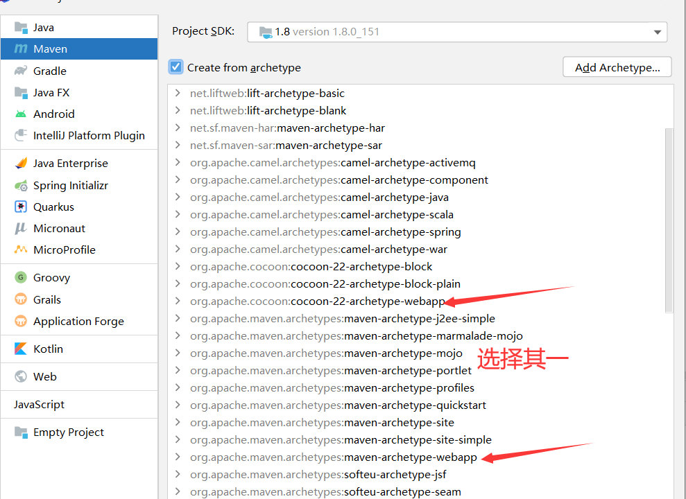
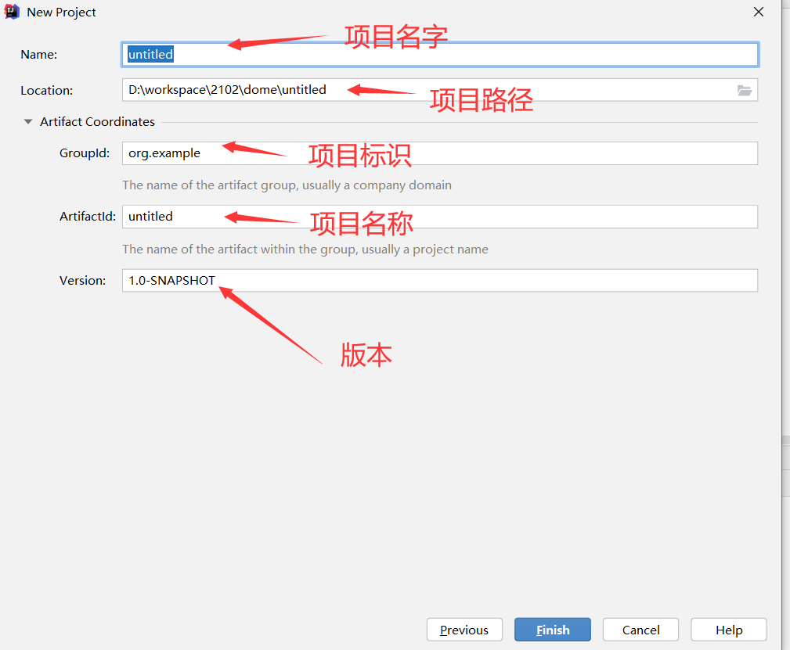
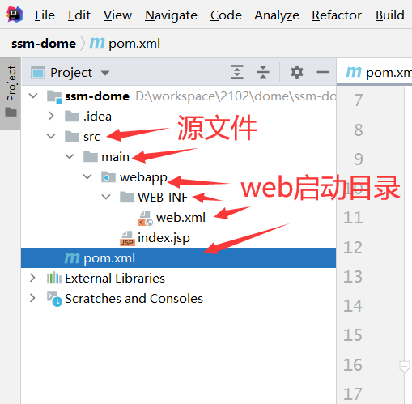
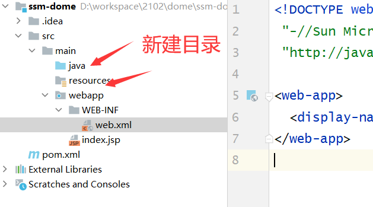

## 一、新建项目







## 二、项目目录



新增的项目没有 Java和resources目录，需要手动新建




## 三、整合mybatis和spring


### 1、导入依赖包


```plain
<dependencies>
    <dependency>
        <groupId>org.springframework</groupId>
        <artifactId>spring-aspects</artifactId>
        <version>5.1.6.RELEASE</version>
    </dependency>
    <!-- Spring常用依赖 -->
    <dependency>
        <groupId>org.springframework</groupId>
        <artifactId>spring-context</artifactId>
        <version>5.1.6.RELEASE</version>
    </dependency>

    <dependency>
        <groupId>mysql</groupId>
        <artifactId>mysql-connector-java</artifactId>
        <version>5.1.47</version>
    </dependency>

    <!-- https://mvnrepository.com/artifact/com.alibaba/druid -->
    <dependency>
        <groupId>com.alibaba</groupId>
        <artifactId>druid</artifactId>
        <version>1.1.16</version>
    </dependency>

    <!-- spring-jdbc -->
    <dependency>
        <groupId>org.springframework</groupId>
        <artifactId>spring-jdbc</artifactId>
        <version>5.1.6.RELEASE</version>
    </dependency>

    <!-- spring+mybatis集成依赖 -->
    <dependency>
        <groupId>org.mybatis</groupId>
        <artifactId>mybatis-spring</artifactId>
        <version>1.3.1</version>
    </dependency>

    <dependency>
        <groupId>org.mybatis</groupId>
        <artifactId>mybatis</artifactId>
        <version>3.4.6</version>
    </dependency>

    <dependency>
        <groupId>junit</groupId>
        <artifactId>junit</artifactId>
        <version>4.13</version>
    </dependency>
```


### 2、mysql 链接


jdbc.properties


```plain
#jdbc.properties
jdbc.driver=com.mysql.jdbc.Driver
jdbc.url=jdbc:mysql://localhost:3306/test?useUnicode=true&characterEncoding=UTF-8
jdbc.username=root
jdbc.password=root
jdbc.init=5
jdbc.minIdle=10
jdbc.maxActive=100
```


### 3、配置log4j


```plain
# Global logging configuration
log4j.rootLogger=DEBUG, stdout
# MyBatis logging configuration...
log4j.logger.org.mybatis.example.BlogMapper=TRACE
# Console output...
log4j.appender.stdout=org.apache.log4j.ConsoleAppender
log4j.appender.stdout.layout=org.apache.log4j.PatternLayout
log4j.appender.stdout.layout.ConversionPattern=%5p [%t] - %m%n
```


### 4、配置spring xml文件


applicationContext.xml


```xml
<?xml version="1.0" encoding="UTF-8"?>
<beans xmlns="http://www.springframework.org/schema/beans"
       xmlns:tx="http://www.springframework.org/schema/tx"
       xmlns:aop="http://www.springframework.org/schema/aop"
       xmlns:context="http://www.springframework.org/schema/context"
       xmlns:xsi="http://www.w3.org/2001/XMLSchema-instance"
       xsi:schemaLocation="
       http://www.springframework.org/schema/beans
       http://www.springframework.org/schema/beans/spring-beans.xsd
       http://www.springframework.org/schema/context
       http://www.springframework.org/schema/context/spring-context.xsd
       http://www.springframework.org/schema/tx
       http://www.springframework.org/schema/tx/spring-tx.xsd
       http://www.springframework.org/schema/aop
       http://www.springframework.org/schema/aop/spring-aop.xsd
       ">
 </beans>
```


引入jdbc 外部配置文件


```xml
<context:property-placeholder location="classpath:jdbc.properties" />
```


配置数据源


```xml
<bean id="dataSource" class="com.alibaba.druid.pool.DruidDataSource" init-method="init" destroy-method="close">
    <!--基本配置-->
    <property name="driverClassName" value="${jdbc.driver}"/>
    <property name="url" value="${jdbc.url}"/>
    <property name="username" value="${jdbc.username}"/>
    <property name="password" value="${jdbc.password}"/>

    <!-- 配置初始化大小、最小、最大 -->
    <property name="initialSize" value="${jdbc.init}"/>
    <property name="minIdle" value="${jdbc.minIdle}"/>
    <property name="maxActive" value="${jdbc.maxActive}"/>

    <!-- 配置获取连接等待超时的时间 -->
    <property name="maxWait" value="60000"/>

    <!-- 配置间隔多久才进行一次检测，检测需要关闭的空闲连接，单位是毫秒 -->
    <property name="timeBetweenEvictionRunsMillis" value="60000"/>

    <!-- 配置一个连接在池中最小生存的时间，单位是毫秒 -->
    <property name="minEvictableIdleTimeMillis" value="300000"/>
</bean>
```


注入sqlsessionfactory 工场


```xml
<!-- 工厂bean：生成SqlSessionFactory -->
<bean id="sqlSessionFactory" class="org.mybatis.spring.SqlSessionFactoryBean">
    <!-- 注入连接池 -->
    <property name="dataSource" ref="dataSource"></property>
    <!-- 注入dao-mapper文件信息 ,如果映射文件和dao接口 同包且同名，则此配置可省略-->
    <property name="mapperLocations">
        <list>
            <value>classpath:mapper/*.xml</value>
        </list>
    </property>
    <!-- 为 dao-mapper文件中的实体 定义缺省包路径
        如：<select id="queryAll" resultType="User"> 中 User类可以不定义包
    -->
    <property name="typeAliasesPackage" value="com.qf.entity"></property>
</bean>
```


描述 mapper或者dao 接口路径


```xml
<!-- mapperScannerConfigurer -->
<bean id="mapperScannerConfigurer9" class="org.mybatis.spring.mapper.MapperScannerConfigurer">
    <!-- dao接口所在的包  如果有多个包，可以用逗号或分号分隔
       <property name="basePackage" value="com.a.dao,com.b.dao"></property>
    -->
    <property name="basePackage" value="com.qf.dao"></property>
    <!-- 如果工厂中只有一个SqlSessionFactory的bean，此配置可省略 -->
    <property name="sqlSessionFactoryBeanName" value="sqlSessionFactory"></property>
</bean>
```


事务配置：


```xml
<bean id="tx" class="org.springframework.jdbc.datasource.DataSourceTransactionManager">
    <property name="dataSource" ref="dataSource"></property>
</bean>
```


定义事务通知：


```xml
<tx:advice id="txManager" transaction-manager="tx">
    <tx:attributes>
        <!--<tx:method name="insertUser" rollback-for="Exception" isolation="DEFAULT"
                  propagation="REQUIRED" read-only="false"/>-->
        <!-- 以User结尾的方法，切入此方法时，采用对应事务实行  连接点-->
        <tx:method name="*" rollback-for="Exception"/>
    </tx:attributes>
</tx:advice>
```


插入切点：


```xml
切面
<aop:config>
    <aop:pointcut expression="execution(* com.qf.service.*.*(..))" id="pc"/>
    <!-- 组织切面 -->
    <aop:advisor advice-ref="txManager" pointcut-ref="pc"/>
</aop:config>
```


### 5、编写dao


```java
public interface UserDao {
    List<User> findAll();

    Integer insert(User user);
}
```


编写bean


```java
public class User implements Serializable {
    private Integer id;
    private String name;
    private String password;
    private String sex;
    private Date birthday;
    private Date registTime;
```


编写mapper


```xml
<?xml version="1.0" encoding="UTF-8" ?>
<!DOCTYPE mapper PUBLIC "-//mybatis.org//DTD Mapper 3.0//EN"
        "http://mybatis.org/dtd/mybatis-3-mapper.dtd">
<mapper namespace="com.qf.dao.UserDao">
    <select id="findAll" resultType="com.qf.entity.User">
        select * from t_users
    </select>
    <insert id="insert" parameterType="com.qf.entity.User">
        INSERT INTO t_users VALUES(#{id},#{name},#{password},#{sex},#{birthday},#{registTime})
    </insert>

</mapper>
```


### 6、编写service


```java
public interface IUserService {

    List<User> findAll();
    Integer insert();
}
```


```java
public class UserServiceImpl implements IUserService {

    private UserDao userDao;

    @Override
    public List<User> findAll() {
        return userDao.findAll();
    }

    @Override
    public Integer insert() {
        User user = new User();
        user.setName("疯子");
        user.setPassword("1111");
        user.setSex("nv");
        user.setBirthday(new Date());
        user.setRegistTime(new Date());
        Integer insert = userDao.insert(user);
        int i= 1/0;
        return insert;
    }


    public void setUserDao(UserDao userDao) {
        this.userDao = userDao;
    }
}
```


## 四、整合MVC


### 1、导入依赖


```xml
<dependency>
            <groupId>org.springframework</groupId>
            <artifactId>spring-webmvc</artifactId>
            <version>5.1.6.RELEASE</version>
        </dependency>

        <!-- https://mvnrepository.com/artifact/javax.servlet/javax.servlet-api -->
        <dependency>
            <groupId>javax.servlet</groupId>
            <artifactId>javax.servlet-api</artifactId>
            <version>3.1.0</version>
            <scope>provided</scope>
        </dependency>

        <!-- https://mvnrepository.com/artifact/javax.servlet/jstl -->
        <dependency>
            <groupId>javax.servlet</groupId>
            <artifactId>jstl</artifactId>
            <version>1.2</version>
        </dependency>

        <dependency>
            <groupId>javax.servlet</groupId>
            <artifactId>jsp-api</artifactId>
            <version>2.0</version>
            <scope>provided</scope>
        </dependency>

<dependency>
      <groupId>com.alibaba</groupId>
      <artifactId>fastjson</artifactId>
      <version>1.2.54</version>
    </dependency>
```


### 2、配置web.xml


```xml
<?xml version="1.0" encoding="UTF-8"?>
<web-app xmlns="http://xmlns.jcp.org/xml/ns/javaee"
         xmlns:xsi="http://www.w3.org/2001/XMLSchema-instance"
         xsi:schemaLocation="http://xmlns.jcp.org/xml/ns/javaee http://xmlns.jcp.org/xml/ns/javaee/web-app_4_0.xsd"
         version="4.0">
</web-app>
```


配置默认的servlet控制器


```xml
<servlet>
    <servlet-name>mvc</servlet-name>
    <servlet-class>org.springframework.web.servlet.DispatcherServlet</servlet-class>
    <!-- 局部参数：声明配置文件位置 -->
    <init-param>
        <param-name>contextConfigLocation</param-name>
        <param-value>classpath:mvc.xml</param-value>
    </init-param>
    <!-- Servlet启动时刻：可选  1 代表饿汉式  默认 就是懒汉式 -->
    <load-on-startup>1</load-on-startup>
</servlet>
<servlet-mapping>
    <servlet-name>mvc</servlet-name>
    <url-pattern>/</url-pattern>
</servlet-mapping>
```


配置字符编码集


```xml
<filter>
    <filter-name>encoding</filter-name>
    <filter-class>org.springframework.web.filter.CharacterEncodingFilter</filter-class>
    <init-param>
        <param-name>encoding</param-name>
        <param-value>utf-8</param-value>
    </init-param>
</filter>
<filter-mapping>
    <filter-name>encoding</filter-name>
    <url-pattern>/*</url-pattern>
</filter-mapping>
```


配置spring beans


```xml
<beans  xmlns="http://www.springframework.org/schema/beans"
          xmlns:context="http://www.springframework.org/schema/context"
          xmlns:mvc="http://www.springframework.org/schema/mvc"
          xmlns:xsi="http://www.w3.org/2001/XMLSchema-instance"
          xsi:schemaLocation="http://www.springframework.org/schema/beans
                     http://www.springframework.org/schema/beans/spring-beans.xsd
                     http://www.springframework.org/schema/context
                     http://www.springframework.org/schema/context/spring-context.xsd
                     http://www.springframework.org/schema/mvc
                     http://www.springframework.org/schema/mvc/spring-mvc.xsd">
</beans>
```


启动注解和注解扫描包路径


```xml
<!-- 告知springmvc  哪些包中 存在 被注解的类 -->
<context:component-scan base-package="com.qf.controller"></context:component-scan>
<!-- 注册注解开发驱动  启动注解 -->
<mvc:annotation-driven></mvc:annotation-driven>
```


配置文件后缀


```xml
<bean class="org.springframework.web.servlet.view.InternalResourceViewResolver">
    <!-- 前缀 -->
    <property name="prefix" value="/"></property>
    <!-- 后缀 -->
    <property name="suffix" value=".jsp"></property>
</bean>
```


配置静态访问路径


```xml
<!--    <mvc:default-servlet-handler/>-->
<mvc:resources mapping="/cls/**" location="/html/"/>

 <mvc:annotation-driven>
        <!--解决响应中文乱码-->
        <mvc:message-converters>
            <bean class="org.springframework.http.converter.StringHttpMessageConverter">
                <constructor-arg value="UTF-8" />
            </bean>
        </mvc:message-converters>
    </mvc:annotation-driven>
```


启动 application.xml


```xml
<listener>
  <listener-class>org.springframework.web.context.ContextLoaderListener</listener-class>
</listener>
<context-param>
  <param-name>contextConfigLocation</param-name>
  <param-value>classpath:applicationContext.xml</param-value>
</context-param>
```


## 五  整合分页插件


### 1、导入依赖包


```xml
<dependency>
		<groupId>com.github.pagehelper</groupId>
		<artifactId>pagehelper</artifactId>
		<version>5.1.10</version>
</dependency>
```


### 2、添加配置文件到sqlsessionfactory


```xml
<property name="plugins">
        <array>
            <bean class="com.github.pagehelper.PageInterceptor">
                <property name="properties">
                    <value>
                        helperDialect=mysql
                        reasonable=true
                        supportMethodsArguments=true
                        params=count=countSql
                        autoRuntimeDialect=true
                    </value>
                </property>
            </bean>
        </array>
    </property>
```


## 六、整合文件上传


### 1、导入依赖包


```xml
<dependency>
    <groupId>commons-io</groupId>
    <artifactId>commons-io</artifactId>
    <version>2.4</version>
</dependency>

<dependency>
    <groupId>commons-fileupload</groupId>
    <artifactId>commons-fileupload</artifactId>
    <version>1.3.3</version>
    <exclusions>
        <exclusion>
            <groupId>javax.servlet</groupId>
            <artifactId>servlet-api</artifactId>
        </exclusion>
    </exclusions>
</dependency>
```


### 2、添加配置


```xml
<bean id="multipartResolver" 
      class="org.springframework.web.multipart.commons.CommonsMultipartResolver">
    <!-- 最大可上传的文件大小  单位：byte  超出后会抛出MaxUploadSizeExceededException异常，可以异常解析器捕获 -->
    <property name="maxUploadSize" value="1048576"></property>
</bean>
```


## 七 验证码


### 1 导入依赖


```xml
<dependency>
    <groupId>com.github.penggle</groupId>
    <artifactId>kaptcha</artifactId>
    <version>2.3.2</version>
    <exclusions>
        <exclusion>
            <groupId>javax.servlet</groupId>
            <artifactId>javax.servlet-api</artifactId>
        </exclusion>
    </exclusions>
</dependency>
```


### 2 web.xml添加配置


```xml
<servlet>
    <servlet-name>cap</servlet-name>
    <servlet-class>com.google.code.kaptcha.servlet.KaptchaServlet</servlet-class>
    <init-param>
      <param-name>kaptcha.border</param-name>
      <param-value>no</param-value>
    </init-param>
    <init-param>
      <param-name>kaptcha.textproducer.char.length</param-name>
      <param-value>4</param-value>
    </init-param>
    <init-param>
      <param-name>kaptcha.textproducer.char.string</param-name>
      <param-value>abcdefghijklmnopqrstuvwxyzABCDEFGHIJKLMNOPQRSTUVWXYZ0123456789</param-value>
    </init-param>
    <init-param>
      <param-name>kaptcha.background.clear.to</param-name>
      <param-value>211,229,237</param-value>
    </init-param>
    <init-param>
      <!-- session.setAttribute("captcha","验证码") -->
      <param-name>kaptcha.session.key</param-name>
      <param-value>captcha</param-value>
    </init-param>
  </servlet>
  <servlet-mapping>
    <servlet-name>cap</servlet-name>
    <url-pattern>/captcha</url-pattern>
  </servlet-mapping>
```


## 八 整合log4j2

### 1、导入依赖


```xml
 <!-- https://mvnrepository.com/artifact/org.apache.logging.log4j/log4j-slf4j-impl -->
        <dependency>
            <groupId>org.apache.logging.log4j</groupId>
            <artifactId>log4j-slf4j-impl</artifactId>
            <version>2.11.2</version>
        </dependency>

        <!-- https://mvnrepository.com/artifact/org.apache.logging.log4j/log4j-web -->
        <dependency>
            <groupId>org.apache.logging.log4j</groupId>
            <artifactId>log4j-web</artifactId>
            <version>2.11.2</version>
        </dependency>

        <!-- https://mvnrepository.com/artifact/org.apache.logging.log4j/log4j-jcl -->
        <dependency>
            <groupId>org.apache.logging.log4j</groupId>
            <artifactId>log4j-jcl</artifactId>
            <version>2.11.2</version>
        </dependency>
```


### 2、导入配置


```xml
<listener>
    <listener-class>org.springframework.web.util.IntrospectorCleanupListener</listener-class>
  </listener>

  <listener>
    <listener-class>org.apache.logging.log4j.web.Log4jServletContextListener</listener-class>
  </listener>
  <context-param>
    <param-name>log4jConfiguration</param-name>
    <!--默认是classpath下的log4j2.xml-->
    <param-value>classpath:log4j2.xml</param-value>
  </context-param>
```


### 3、日志配置信息

error--warn-info--dubeg

```xml
<?xml version="1.0" encoding="UTF-8"?>
<Configuration status="WARN" monitorInterval="30">
    <Properties>
        <property name="PATTERN">%d{yyyy-MM-dd HH:mm:ss.SSS} [%t-%L] %-5level
            %logger{36} - %msg%n</property>
    </Properties>
    <Appenders>
        <!--这个输出控制台的配置 -->
        <Console name="Console" target="SYSTEM_OUT">
            <!-- 控制台只输出level及以上级别的信息(onMatch),其他的直接拒绝(onMismatch) -->
            <ThresholdFilter level="trace" onMatch="ACCEPT"
                             onMismatch="DENY" />
            <PatternLayout pattern="${PATTERN}" />
        </Console>
    </Appenders>
    <!--然后定义logger，只有定义了logger并引入的appender，appender才会生效 -->
    <Loggers>
        <!-- 配置日志的根节点 -->
        <root level="debug">
            <appender-ref ref="Console" />
        </root>
    </Loggers>
</Configuration>
```