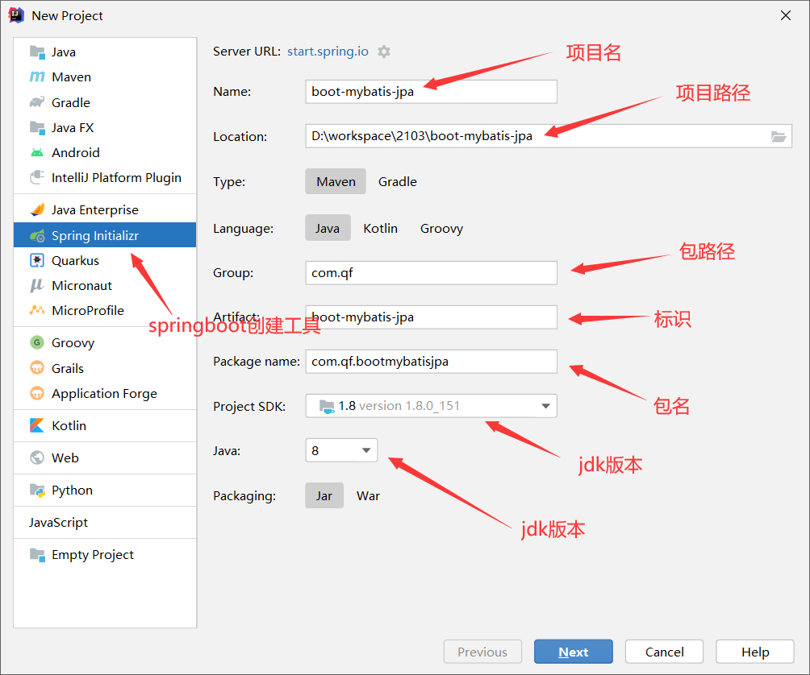
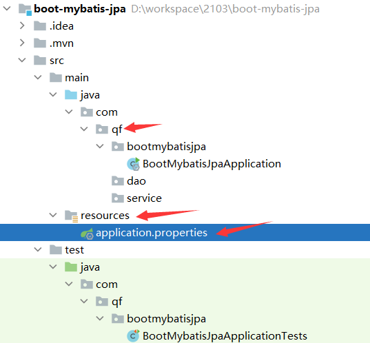

一、新建项目

1、构建项目


2、导入依赖pom.xml介绍

```xml
	<parent>
        <groupId>org.springframework.boot</groupId>
        <artifactId>spring-boot-starter-parent</artifactId>
        <version>2.5.10</version>
        <relativePath/> <!-- lookup parent from repository -->
    </parent>

				<dependency>
            <groupId>org.springframework.boot</groupId>
            <artifactId>spring-boot-starter-web</artifactId>
        </dependency>

        <dependency>
            <groupId>org.projectlombok</groupId>
            <artifactId>lombok</artifactId>
            <optional>true</optional>
        </dependency>
        <dependency>
            <groupId>org.springframework.boot</groupId>
            <artifactId>spring-boot-starter-test</artifactId>
            <scope>test</scope>
        </dependency>

				<dependency>
            <groupId>commons-lang</groupId>
            <artifactId>commons-lang</artifactId>
            <version>2.6</version>
        </dependency>
    
    			<plugin>
                <groupId>org.springframework.boot</groupId>
                <artifactId>spring-boot-maven-plugin</artifactId>
                <version>2.5.10</version>
                <configuration>
                    <excludes>
                        <exclude>
                            <groupId>org.projectlombok</groupId>
                            <artifactId>lombok</artifactId>
                        </exclude>
                    </excludes>
                </configuration>
            </plugin>
```

3、新建目录


二、mybatisplus整合

1、导入依赖

```xml
<dependency>
            <groupId>com.baomidou</groupId>
            <artifactId>mybatis-plus-boot-starter</artifactId>
            <version>3.3.2</version>
        </dependency>

<dependency>
            <groupId>mysql</groupId>
            <artifactId>mysql-connector-java</artifactId>
            <scope>runtime</scope>
        </dependency>
```

2、配置application.properties文件

```yaml
mybatis-plus:
  configuration:
    map-underscore-to-camel-case: true
    auto-mapping-behavior: full
  mapper-locations: classpath:mapper/*.xml
  
spring:
 datasource:
   driver-class-name: com.mysql.jdbc.Driver
   url: jdbc:mysql://localhost:3306/test?useUnicode=true&characterEncoding=UTF-8
   username: root
   password: root
logging:
  level:
    com.qf.firstspringboot.mapper: DEBUG
```

3、编写实体

```java
@Data
@TableName("t_users") //驼峰名
public class User implements Serializable {
    @TableId(value = "id",type = IdType.AUTO)
    private Integer id;
    private String name;
    private String password;
    private String sex;
    private Date birthday;
    @TableField("registTime")
    private Date registTime;
}
```

4、编写Mapper

```java
@Mapper
public interface IUserDao extends BaseMapper<User> {
}
```

5、编写service

```java
public interface IUserService {

    public Integer insert(User user);
    public Integer update(User user);
    public Integer delete(Integer id);
    public IPage  findBypage(Integer pageNum, Integer pageSize, User user);
    public User findById(Integer id);

}
@Service
public class UserService implements IUserService {
    @Autowired
    private IUserDao iUserDao;
    @Override
    public Integer insert(User user) {
        int insert = iUserDao.insert(user);
        return insert;
    }

    @Override
    public Integer update(User user) {
        int update = iUserDao.updateById(user);
        return update;
    }

    @Override
    public Integer delete(Integer id) {
        int i = iUserDao.deleteById(id);
        return i ;
    }

    @Override
    public IPage findBypage(Integer pageNum, Integer pageSize, User user) {
        Page page = new Page(pageNum,pageSize);

        QueryWrapper wrapper = new QueryWrapper<User>();

        wrapper.eq(StringUtils.isNotBlank(user.getName()),"name",user.getName());

        IPage iPage = iUserDao.selectPage(page, wrapper);
        return iPage;
    }

    @Override
    public User findById(Integer id) {
        User user = iUserDao.selectById(id);
        return user;
    }
```

6、分页插件

```java
@Configuration
public class MybatisPlusConfig {
    @Bean  //就相当于bean
    public PaginationInterceptor paginationInterceptor() {
        return new PaginationInterceptor();
    }
}
```

mybatis-plus 自动代码生成器

```java
<!-- mybatis-plus依赖 -->
        <dependency>
            <groupId>com.baomidou</groupId>
            <artifactId>mybatis-plus-boot-starter</artifactId>
            <version>3.3.2</version>
        </dependency>
        <!-- mysql驱动包 -->
        <dependency>
            <groupId>mysql</groupId>
            <artifactId>mysql-connector-java</artifactId>
        </dependency>
        <!-- 测试包 -->
        <dependency>
            <groupId>org.springframework.boot</groupId>
            <artifactId>spring-boot-starter-test</artifactId>
        </dependency>
        <!-- 代码生成器 -->
        <dependency>
            <groupId>com.baomidou</groupId>
            <artifactId>mybatis-plus-generator</artifactId>
            <version>3.3.2</version>
        </dependency>
        <dependency>
            <groupId>org.freemarker</groupId>
            <artifactId>freemarker</artifactId>
            <version>2.3.30</version>
        </dependency>
```


编写代码

```java
package com.qf.util;

import com.baomidou.mybatisplus.core.toolkit.StringPool;
import com.baomidou.mybatisplus.generator.AutoGenerator;
import com.baomidou.mybatisplus.generator.InjectionConfig;
import com.baomidou.mybatisplus.generator.config.*;
import com.baomidou.mybatisplus.generator.config.po.TableInfo;
import com.baomidou.mybatisplus.generator.config.rules.NamingStrategy;
import com.baomidou.mybatisplus.generator.engine.FreemarkerTemplateEngine;

import java.util.ArrayList;
import java.util.HashMap;
import java.util.List;
import java.util.Map;

public class CodeGenerator {

    // 固定
    private static final String projectPath = System.getProperty("user.dir");
    private static final String outPutDir = projectPath + "/src/main/java";
    // 自定义
    private static final String author = "hzp";
    private static final String packageName = "test";
    private static final String moduleName = "door";
    private static final String[] tableName = ("user_entity").split(",");
    private static final String tablePrefix = "sys";

    public static void main(String[] args) {
        // 代码生成器
        AutoGenerator mpg = new AutoGenerator();
        // 设置全局配置
        mpg.setGlobalConfig(getGlobalConfig());
        // 设置数据源配置
        mpg.setDataSource(getDataSourceConfig());
        // 包配置
        PackageConfig pc = getPackageConfig();
        mpg.setPackageInfo(pc);
        // 自定义配置
        mpg.setCfg(getInjectionConfig());
        // 配置模板
        TemplateConfig templateConfig = new TemplateConfig();
        templateConfig.setXml(null);
        mpg.setTemplate(templateConfig);
        // 策略配置
        mpg.setStrategy(getStrategyConfig());
        mpg.setTemplateEngine(new FreemarkerTemplateEngine());
        mpg.execute();
    }

    private static GlobalConfig getGlobalConfig() {
        // 全局配置
        GlobalConfig gc = new GlobalConfig();
        gc.setOutputDir(outPutDir);
        gc.setAuthor(author);
        gc.setOpen(false);
        gc.setEntityName("%sEntity");
        gc.setMapperName("%sDao");
        gc.setServiceName("%sService");
        // 是否覆盖文件，默认false不覆盖
        gc.setFileOverride(true);
        // XML ResultMap
        gc.setBaseResultMap(true);
        // XML columList
        gc.setBaseColumnList(true);
        // gc.setSwagger2(true); 实体属性 Swagger2 注解
        return gc;
    }

    private static DataSourceConfig getDataSourceConfig() {
        // 数据源配置
        DataSourceConfig dsc = new DataSourceConfig();
        dsc.setUrl("jdbc:mysql://localhost:3306/mybatis01?useUnicode=true&characterEncoding=UTF-8&serverTimezone=UTC&useSSL=false");
        // dsc.setSchemaName("public");
//        String driverName = "com.mysql.jdbc.Driver";
        String driverName = "com.mysql.jdbc.Driver";
        dsc.setDriverName(driverName);
        dsc.setUsername("root");
        dsc.setPassword("");
        return dsc;
    }

    private static PackageConfig getPackageConfig() {
        // 包配置
        PackageConfig pc = new PackageConfig();
        // 包名称
        pc.setParent(packageName);
        // 模块名称
        pc.setModuleName(moduleName);
        return pc;
    }

    private static InjectionConfig getInjectionConfig() {
        // 自定义配置
        InjectionConfig cfg = new InjectionConfig() {
            @Override
            public void initMap() {
            }
        };

        // 如果模板引擎是 freemarker
        String templatePath = "/templates/mapper.xml.ftl";
        List<FileOutConfig> focList = new ArrayList<>();
        focList.add(new FileOutConfig(templatePath) {
            @Override
            public String outputFile(TableInfo tableInfo) {
                return projectPath + "/src/main/resources/mapper/" + tableInfo.getEntityName().replace("Entity", "")
                        + "Mapper" + StringPool.DOT_XML;
            }
        });
        cfg.setFileOutConfigList(focList);
        return cfg;
    }

    private static StrategyConfig getStrategyConfig() {
        // 策略配置
        StrategyConfig strategy = new StrategyConfig();
        strategy.setNaming(NamingStrategy.underline_to_camel);
        strategy.setColumnNaming(NamingStrategy.underline_to_camel);
//        strategy.setSuperEntityClass("你自己的父类实体,没有就不用设置!");
        strategy.setEntityLombokModel(true);
        strategy.setRestControllerStyle(true);
        // 公共父类
//        strategy.setSuperControllerClass("你自己的父类控制器,没有就不用设置!");
        // 写于父类中的公共字段
//        strategy.setSuperEntityColumns("id");
//        strategy.setInclude(scanner("表名，多个英文逗号分割").split(","));
        strategy.setInclude(tableName);
        strategy.setControllerMappingHyphenStyle(true);
        strategy.setTablePrefix(tablePrefix + "_");
        return strategy;
    }
}
```

三、整合JPA

1、导入依赖

```xml
       <dependency>
            <groupId>org.springframework.boot</groupId>
            <artifactId>spring-boot-starter-data-jpa</artifactId>
        </dependency>

        <dependency>
            <groupId>com.alibaba</groupId>
            <artifactId>fastjson</artifactId>
            <version>1.2.75</version>
        </dependency>
```

2、配置YML文件

```yaml
jpa:
    hibernate:
      ddl-auto: update  #create-drop/create/update/none
    show-sql: true  #打印sql语句
```

3、编写实体

```java
@Data
@Entity(name = "t_user")
public class UserEntity  implements Serializable {
    @Id
    @GenericGenerator(name = "idGenerator", strategy = "uuid") //这个是hibernate的注�?生成32位UUID
    @GeneratedValue(generator = "idGenerator")
    private String id;
    @Column
    private String username;
    @Column
    private String password;
    @Column
    private String company;
    @Column
    private String  files;
    @Column
    private String companyPerson;
    @Column
    private String card;
    @Column
    private String orgCard;
    @Column
    private String email;
    @Column
    private BigDecimal money;
    @Column
    private String roleId;
    @Column
    private String status = ConstentUtil.STATUS_ON;
    @Column
    private String creater;
    @Column
    private String updater;
    @Column
    private Date createTime;
    @Column
    private Date updateTime;


}
```

4、编写dao

```java
@Repository
public interface UserJpaDao extends JpaRepository<UserEntity,String>,
        JpaSpecificationExecutor<UserEntity> {
    
    UserEntity findByUsernameAndPassword(String username,String password);
}
```

5、编写service

```java
public interface IUserService {
    UserEntity login(String username,String password) throws Exception;
    Boolean insert(UserEntity userEntity) throws Exception;
    Boolean update(UserEntity userEntity) throws Exception;
    Boolean delete(String id) throws Exception;
    UserEntity findByOne(String id) throws Exception;
    List<UserEntity> findAll(UserEntity userEntity, Integer pageNum, Integer pageSize) throws Exception;
}
@Service
public class UserServiceImpl implements IUserService {
    @Autowired
    private UserJpaDao userJpaDao;
    @Override
    public UserEntity login(String username, String password) throws Exception {
        String token = null;
        UserEntity userEntity = new UserEntity();
        userEntity.setUsername(username);
        userEntity.setPassword(password);
        if(vaild(userEntity)){
            userEntity = userJpaDao.findByUsernameAndPassword(username, password);
        }
        return userEntity;
    }

    @Override
    public Boolean insert(UserEntity userEntity) throws Exception {
        return null;
    }

    @Override
    public Boolean update(UserEntity userEntity) throws Exception {
        return null;
    }

    @Override
    public Boolean delete(String id) throws Exception {
        return null;
    }

    @Override
    public UserEntity findByOne(String id) throws Exception {
        return null;
    }

    @Override
    public List<UserEntity> findAll(UserEntity userEntity, Integer pageNum, Integer pageSize) throws Exception {
        return null;
    }

    private Boolean vaild(UserEntity userEntity) throws Exception{
        Boolean isBool =false;
        if(null == userEntity){

            throw new RuntimeException("用户信息不能为空！！");
        }

        if(StringUtils.isBlank(userEntity.getUsername())){
            throw new RuntimeException("用户名不能为空！！");
        }

        if(StringUtils.isBlank(userEntity.getPassword())){
            throw new RuntimeException("密码不能为空！！");
        }

        isBool = true;
        return isBool;
    }
}
```

四、swagger-ui整合

1、导入依赖包

```java
<dependency>
            <groupId>io.springfox</groupId>
            <artifactId>springfox-swagger2</artifactId>
            <version>2.8.0</version>
        </dependency>
        <dependency>
            <groupId>io.springfox</groupId>
            <artifactId>springfox-swagger-ui</artifactId>
            <version>2.8.0</version>
        </dependency>
        <dependency>
            <groupId>com.github.xiaoymin</groupId>
            <artifactId>swagger-bootstrap-ui</artifactId>
            <version>1.8.5</version>
        </dependency>
```

2、配置对象

```java
@Bean
public Docket createRestApi() {
    //http://ip地址:端口/项目名/swagger-ui.html#/
    ApiInfo apiInfo = new ApiInfoBuilder()
            .title("互联网医院") //网站标题
            .description("互联网医院API") //网站描述
            .version("9.0") //版本
            .contact(new Contact("qf","1000phone","1")) //联系人
            .license("tcp") //协议
            .licenseUrl("http://localhost:8014/") //协议url
            .build();
    return new Docket(DocumentationType.SWAGGER_2) //swagger版本
            .pathMapping("/")
            .select()
            //扫描那些controller
            .apis(RequestHandlerSelectors.basePackage("com.qf.controller"))
            .paths(PathSelectors.any())
            .build()
            .apiInfo(apiInfo);
}
```

五、统一异常处理

1、导入依赖包

```java
<dependency>
    <groupId>com.alibaba</groupId>
    <artifactId>fastjson</artifactId>
    <version>1.2.75</version>
</dependency>
```

2、编写异常处理类

```java
@ControllerAdvice
@ResponseBody
public class GlobalExceptions {

    @ExceptionHandler
    public String otherException(Exception e){
        return Result.fail(500,"服务器异常！",e.getMessage());
    }

}
```

3、编写异常处理对象

```java
@Data
public class ResultUtil implements Serializable {
    private Integer code;
    private String msg;
    private Object data;
}
```

4、编写异常工具类

```java
public class Result {

    public static String  success(Integer code,String msg,Object data){
        ResultUtil resultUtil = new ResultUtil();
        resultUtil.setCode(code);
        resultUtil.setMsg(msg);
        resultUtil.setData(data);
        return JSON.toJSONString(resultUtil);

    }

    public static String  fail(Integer code, String msg, String error){
        ResultUtil resultUtil = new ResultUtil();
        resultUtil.setCode(code);
        resultUtil.setMsg(msg);
        resultUtil.setData(error);
        return JSON.toJSONString(resultUtil);
    }


}
```

六、定时任务

1、添加注解

```java
@EnableScheduling
```

2、编写定时任务

```java
    @Scheduled(cron="0/5 * * * * ?")
    public void executeFileDownLoadTask() {
        System.out.println("定时任务启动");
    }
```

一、新建项目

1、构建项目




2、导入依赖pom.xml介绍

```xml
	<parent>
        <groupId>org.springframework.boot</groupId>
        <artifactId>spring-boot-starter-parent</artifactId>
        <version>2.5.10</version>
        <relativePath/> <!-- lookup parent from repository -->
    </parent>

				<dependency>
            <groupId>org.springframework.boot</groupId>
            <artifactId>spring-boot-starter-web</artifactId>
        </dependency>

        <dependency>
            <groupId>org.projectlombok</groupId>
            <artifactId>lombok</artifactId>
            <optional>true</optional>
        </dependency>
        <dependency>
            <groupId>org.springframework.boot</groupId>
            <artifactId>spring-boot-starter-test</artifactId>
            <scope>test</scope>
        </dependency>

				<dependency>
            <groupId>commons-lang</groupId>
            <artifactId>commons-lang</artifactId>
            <version>2.6</version>
        </dependency>
    
    			<plugin>
                <groupId>org.springframework.boot</groupId>
                <artifactId>spring-boot-maven-plugin</artifactId>
                <version>2.5.10</version>
                <configuration>
                    <excludes>
                        <exclude>
                            <groupId>org.projectlombok</groupId>
                            <artifactId>lombok</artifactId>
                        </exclude>
                    </excludes>
                </configuration>
            </plugin>
```

3、新建目录





二、mybatisplus整合

1、导入依赖

```xml
<dependency>
            <groupId>com.baomidou</groupId>
            <artifactId>mybatis-plus-boot-starter</artifactId>
            <version>3.3.2</version>
        </dependency>

<dependency>
            <groupId>mysql</groupId>
            <artifactId>mysql-connector-java</artifactId>
            <scope>runtime</scope>
        </dependency>
```

2、配置application.properties文件

```yaml
mybatis-plus:
  configuration:
    map-underscore-to-camel-case: true
    auto-mapping-behavior: full
  mapper-locations: classpath:mapper/*.xml
  
spring:
 datasource:
   driver-class-name: com.mysql.jdbc.Driver
   url: jdbc:mysql://localhost:3306/test?useUnicode=true&characterEncoding=UTF-8
   username: root
   password: root
logging:
  level:
    com.qf.firstspringboot.mapper: DEBUG
```

3、编写实体

```java
@Data
@TableName("t_users") //驼峰名
public class User implements Serializable {
    @TableId(value = "id",type = IdType.AUTO)
    private Integer id;
    private String name;
    private String password;
    private String sex;
    private Date birthday;
    @TableField("registTime")
    private Date registTime;
}
```

4、编写Mapper

```java
@Mapper
public interface IUserDao extends BaseMapper<User> {
}
```

5、编写service

```java
public interface IUserService {

    public Integer insert(User user);
    public Integer update(User user);
    public Integer delete(Integer id);
    public IPage  findBypage(Integer pageNum, Integer pageSize, User user);
    public User findById(Integer id);

}
@Service
public class UserService implements IUserService {
    @Autowired
    private IUserDao iUserDao;
    @Override
    public Integer insert(User user) {
        int insert = iUserDao.insert(user);
        return insert;
    }

    @Override
    public Integer update(User user) {
        int update = iUserDao.updateById(user);
        return update;
    }

    @Override
    public Integer delete(Integer id) {
        int i = iUserDao.deleteById(id);
        return i ;
    }

    @Override
    public IPage findBypage(Integer pageNum, Integer pageSize, User user) {
        Page page = new Page(pageNum,pageSize);

        QueryWrapper wrapper = new QueryWrapper<User>();

        wrapper.eq(StringUtils.isNotBlank(user.getName()),"name",user.getName());

        IPage iPage = iUserDao.selectPage(page, wrapper);
        return iPage;
    }

    @Override
    public User findById(Integer id) {
        User user = iUserDao.selectById(id);
        return user;
    }
```

6、分页插件

```java
@Configuration
public class MybatisPlusConfig {
    @Bean  //就相当于bean
    public PaginationInterceptor paginationInterceptor() {
        return new PaginationInterceptor();
    }
}
```

mybatis-plus 自动代码生成器

```java
<!-- mybatis-plus依赖 -->
        <dependency>
            <groupId>com.baomidou</groupId>
            <artifactId>mybatis-plus-boot-starter</artifactId>
            <version>3.3.2</version>
        </dependency>
        <!-- mysql驱动包 -->
        <dependency>
            <groupId>mysql</groupId>
            <artifactId>mysql-connector-java</artifactId>
        </dependency>
        <!-- 测试包 -->
        <dependency>
            <groupId>org.springframework.boot</groupId>
            <artifactId>spring-boot-starter-test</artifactId>
        </dependency>
        <!-- 代码生成器 -->
        <dependency>
            <groupId>com.baomidou</groupId>
            <artifactId>mybatis-plus-generator</artifactId>
            <version>3.3.2</version>
        </dependency>
        <dependency>
            <groupId>org.freemarker</groupId>
            <artifactId>freemarker</artifactId>
            <version>2.3.30</version>
        </dependency>
```


编写代码

```java
package com.qf.util;

import com.baomidou.mybatisplus.core.toolkit.StringPool;
import com.baomidou.mybatisplus.generator.AutoGenerator;
import com.baomidou.mybatisplus.generator.InjectionConfig;
import com.baomidou.mybatisplus.generator.config.*;
import com.baomidou.mybatisplus.generator.config.po.TableInfo;
import com.baomidou.mybatisplus.generator.config.rules.NamingStrategy;
import com.baomidou.mybatisplus.generator.engine.FreemarkerTemplateEngine;

import java.util.ArrayList;
import java.util.HashMap;
import java.util.List;
import java.util.Map;

public class CodeGenerator {

    // 固定
    private static final String projectPath = System.getProperty("user.dir");
    private static final String outPutDir = projectPath + "/src/main/java";
    // 自定义
    private static final String author = "hzp";
    private static final String packageName = "test";
    private static final String moduleName = "door";
    private static final String[] tableName = ("user_entity").split(",");
    private static final String tablePrefix = "sys";

    public static void main(String[] args) {
        // 代码生成器
        AutoGenerator mpg = new AutoGenerator();
        // 设置全局配置
        mpg.setGlobalConfig(getGlobalConfig());
        // 设置数据源配置
        mpg.setDataSource(getDataSourceConfig());
        // 包配置
        PackageConfig pc = getPackageConfig();
        mpg.setPackageInfo(pc);
        // 自定义配置
        mpg.setCfg(getInjectionConfig());
        // 配置模板
        TemplateConfig templateConfig = new TemplateConfig();
        templateConfig.setXml(null);
        mpg.setTemplate(templateConfig);
        // 策略配置
        mpg.setStrategy(getStrategyConfig());
        mpg.setTemplateEngine(new FreemarkerTemplateEngine());
        mpg.execute();
    }

    private static GlobalConfig getGlobalConfig() {
        // 全局配置
        GlobalConfig gc = new GlobalConfig();
        gc.setOutputDir(outPutDir);
        gc.setAuthor(author);
        gc.setOpen(false);
        gc.setEntityName("%sEntity");
        gc.setMapperName("%sDao");
        gc.setServiceName("%sService");
        // 是否覆盖文件，默认false不覆盖
        gc.setFileOverride(true);
        // XML ResultMap
        gc.setBaseResultMap(true);
        // XML columList
        gc.setBaseColumnList(true);
        // gc.setSwagger2(true); 实体属性 Swagger2 注解
        return gc;
    }

    private static DataSourceConfig getDataSourceConfig() {
        // 数据源配置
        DataSourceConfig dsc = new DataSourceConfig();
        dsc.setUrl("jdbc:mysql://localhost:3306/mybatis01?useUnicode=true&characterEncoding=UTF-8&serverTimezone=UTC&useSSL=false");
        // dsc.setSchemaName("public");
//        String driverName = "com.mysql.jdbc.Driver";
        String driverName = "com.mysql.jdbc.Driver";
        dsc.setDriverName(driverName);
        dsc.setUsername("root");
        dsc.setPassword("");
        return dsc;
    }

    private static PackageConfig getPackageConfig() {
        // 包配置
        PackageConfig pc = new PackageConfig();
        // 包名称
        pc.setParent(packageName);
        // 模块名称
        pc.setModuleName(moduleName);
        return pc;
    }

    private static InjectionConfig getInjectionConfig() {
        // 自定义配置
        InjectionConfig cfg = new InjectionConfig() {
            @Override
            public void initMap() {
            }
        };

        // 如果模板引擎是 freemarker
        String templatePath = "/templates/mapper.xml.ftl";
        List<FileOutConfig> focList = new ArrayList<>();
        focList.add(new FileOutConfig(templatePath) {
            @Override
            public String outputFile(TableInfo tableInfo) {
                return projectPath + "/src/main/resources/mapper/" + tableInfo.getEntityName().replace("Entity", "")
                        + "Mapper" + StringPool.DOT_XML;
            }
        });
        cfg.setFileOutConfigList(focList);
        return cfg;
    }

    private static StrategyConfig getStrategyConfig() {
        // 策略配置
        StrategyConfig strategy = new StrategyConfig();
        strategy.setNaming(NamingStrategy.underline_to_camel);
        strategy.setColumnNaming(NamingStrategy.underline_to_camel);
//        strategy.setSuperEntityClass("你自己的父类实体,没有就不用设置!");
        strategy.setEntityLombokModel(true);
        strategy.setRestControllerStyle(true);
        // 公共父类
//        strategy.setSuperControllerClass("你自己的父类控制器,没有就不用设置!");
        // 写于父类中的公共字段
//        strategy.setSuperEntityColumns("id");
//        strategy.setInclude(scanner("表名，多个英文逗号分割").split(","));
        strategy.setInclude(tableName);
        strategy.setControllerMappingHyphenStyle(true);
        strategy.setTablePrefix(tablePrefix + "_");
        return strategy;
    }
}
```

三、整合JPA

1、导入依赖

```xml
       <dependency>
            <groupId>org.springframework.boot</groupId>
            <artifactId>spring-boot-starter-data-jpa</artifactId>
        </dependency>

        <dependency>
            <groupId>com.alibaba</groupId>
            <artifactId>fastjson</artifactId>
            <version>1.2.75</version>
        </dependency>
```

2、配置YML文件

```yaml
jpa:
    hibernate:
      ddl-auto: update  #create-drop/create/update/none
    show-sql: true  #打印sql语句
```

3、编写实体

```java
@Data
@Entity(name = "t_user")
public class UserEntity  implements Serializable {
    @Id
    @GenericGenerator(name = "idGenerator", strategy = "uuid") //这个是hibernate的注�?生成32位UUID
    @GeneratedValue(generator = "idGenerator")
    private String id;
    @Column
    private String username;
    @Column
    private String password;
    @Column
    private String company;
    @Column
    private String  files;
    @Column
    private String companyPerson;
    @Column
    private String card;
    @Column
    private String orgCard;
    @Column
    private String email;
    @Column
    private BigDecimal money;
    @Column
    private String roleId;
    @Column
    private String status = ConstentUtil.STATUS_ON;
    @Column
    private String creater;
    @Column
    private String updater;
    @Column
    private Date createTime;
    @Column
    private Date updateTime;


}
```

4、编写dao

```java
@Repository
public interface UserJpaDao extends JpaRepository<UserEntity,String>,
        JpaSpecificationExecutor<UserEntity> {
    
    UserEntity findByUsernameAndPassword(String username,String password);
}
```

5、编写service

```java
public interface IUserService {
    UserEntity login(String username,String password) throws Exception;
    Boolean insert(UserEntity userEntity) throws Exception;
    Boolean update(UserEntity userEntity) throws Exception;
    Boolean delete(String id) throws Exception;
    UserEntity findByOne(String id) throws Exception;
    List<UserEntity> findAll(UserEntity userEntity, Integer pageNum, Integer pageSize) throws Exception;
}
@Service
public class UserServiceImpl implements IUserService {
    @Autowired
    private UserJpaDao userJpaDao;
    @Override
    public UserEntity login(String username, String password) throws Exception {
        String token = null;
        UserEntity userEntity = new UserEntity();
        userEntity.setUsername(username);
        userEntity.setPassword(password);
        if(vaild(userEntity)){
            userEntity = userJpaDao.findByUsernameAndPassword(username, password);
        }
        return userEntity;
    }

    @Override
    public Boolean insert(UserEntity userEntity) throws Exception {
        return null;
    }

    @Override
    public Boolean update(UserEntity userEntity) throws Exception {
        return null;
    }

    @Override
    public Boolean delete(String id) throws Exception {
        return null;
    }

    @Override
    public UserEntity findByOne(String id) throws Exception {
        return null;
    }

    @Override
    public List<UserEntity> findAll(UserEntity userEntity, Integer pageNum, Integer pageSize) throws Exception {
        return null;
    }

    private Boolean vaild(UserEntity userEntity) throws Exception{
        Boolean isBool =false;
        if(null == userEntity){

            throw new RuntimeException("用户信息不能为空！！");
        }

        if(StringUtils.isBlank(userEntity.getUsername())){
            throw new RuntimeException("用户名不能为空！！");
        }

        if(StringUtils.isBlank(userEntity.getPassword())){
            throw new RuntimeException("密码不能为空！！");
        }

        isBool = true;
        return isBool;
    }
}
```

四、swagger-ui整合

1、导入依赖包

```java
<dependency>
            <groupId>io.springfox</groupId>
            <artifactId>springfox-swagger2</artifactId>
            <version>2.8.0</version>
        </dependency>
        <dependency>
            <groupId>io.springfox</groupId>
            <artifactId>springfox-swagger-ui</artifactId>
            <version>2.8.0</version>
        </dependency>
        <dependency>
            <groupId>com.github.xiaoymin</groupId>
            <artifactId>swagger-bootstrap-ui</artifactId>
            <version>1.8.5</version>
        </dependency>
```

2、配置对象

```java
@Bean
public Docket createRestApi() {
    //http://ip地址:端口/项目名/swagger-ui.html#/
    ApiInfo apiInfo = new ApiInfoBuilder()
            .title("互联网医院") //网站标题
            .description("互联网医院API") //网站描述
            .version("9.0") //版本
            .contact(new Contact("qf","1000phone","1")) //联系人
            .license("tcp") //协议
            .licenseUrl("http://localhost:8014/") //协议url
            .build();
    return new Docket(DocumentationType.SWAGGER_2) //swagger版本
            .pathMapping("/")
            .select()
            //扫描那些controller
            .apis(RequestHandlerSelectors.basePackage("com.qf.controller"))
            .paths(PathSelectors.any())
            .build()
            .apiInfo(apiInfo);
}
```

五、统一异常处理

1、导入依赖包

```java
<dependency>
    <groupId>com.alibaba</groupId>
    <artifactId>fastjson</artifactId>
    <version>1.2.75</version>
</dependency>
```

2、编写异常处理类

```java
@ControllerAdvice
@ResponseBody
public class GlobalExceptions {

    @ExceptionHandler
    public String otherException(Exception e){
        return Result.fail(500,"服务器异常！",e.getMessage());
    }

}
```

3、编写异常处理对象

```java
@Data
public class ResultUtil implements Serializable {
    private Integer code;
    private String msg;
    private Object data;
}
```

4、编写异常工具类

```java
public class Result {

    public static String  success(Integer code,String msg,Object data){
        ResultUtil resultUtil = new ResultUtil();
        resultUtil.setCode(code);
        resultUtil.setMsg(msg);
        resultUtil.setData(data);
        return JSON.toJSONString(resultUtil);

    }

    public static String  fail(Integer code, String msg, String error){
        ResultUtil resultUtil = new ResultUtil();
        resultUtil.setCode(code);
        resultUtil.setMsg(msg);
        resultUtil.setData(error);
        return JSON.toJSONString(resultUtil);
    }


}
```

六、定时任务

1、添加注解

```java
@EnableScheduling
```

2、编写定时任务

```java
    @Scheduled(cron="0/5 * * * * ?")
    public void executeFileDownLoadTask() {
        System.out.println("定时任务启动");
    }
```

cron表达式从左到右（用空格隔开）：秒 分 小时 日期 月份 星期 年份

0 0 10,14,16 * * ?	每天上午10点，下午2点，4点每天上午10点，下午2点，4点

0 0/30 9-17 * * ?	朝九晚五工作时间内每半小时

0 0 12 ? * WED	表示每个星期三中午12点

0 0 12 * * ?	每天中午12点触发

0 15 10 ? * *	每天上午10:15触发

0 15 10 * * ?	每天上午10:15触发

0 15 10 * * ? *	每天上午10:15触发

0 15 10 * * ? 2019	2019年的每天上午10:15触发

0 * 14 * * ?	在每天下午2点到下午2:59期间的每1分钟触发

0 0/5 14 * * ?	在每天下午2点到下午2:55期间的每5分钟触发

0 0/5 14,18 * * ?	在每天下午2点到2:55期间和下午6点到6:55期间的每5分钟触发

0 0-5 14 * * ?	在每天下午2点到下午2:05期间的每1分钟触发

0 10,44 14 ? 3 WED	每年三月的星期三的下午2:10和2:44触发

0 15 10 ? * MON-FRI	周一至周五的上午10:15触发

0 15 10 15 * ?	每月15日上午10:15触发

0 15 10 L * ?	每月最后一日的上午