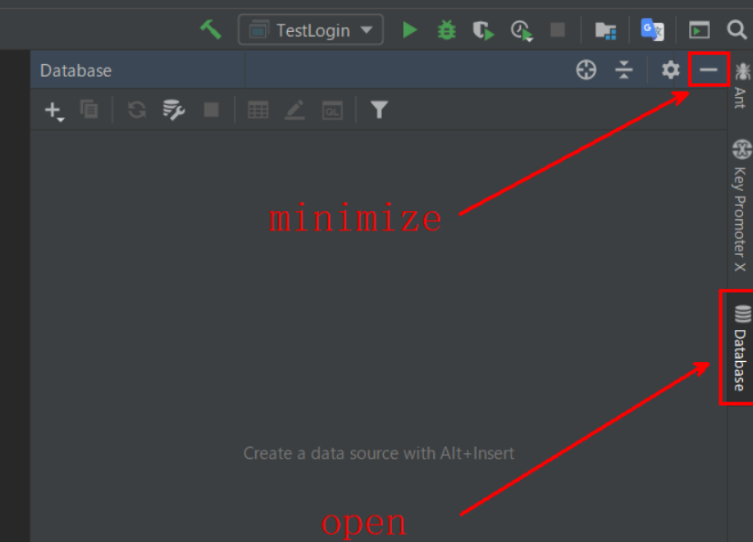
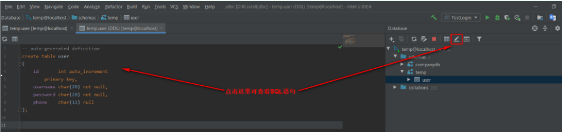
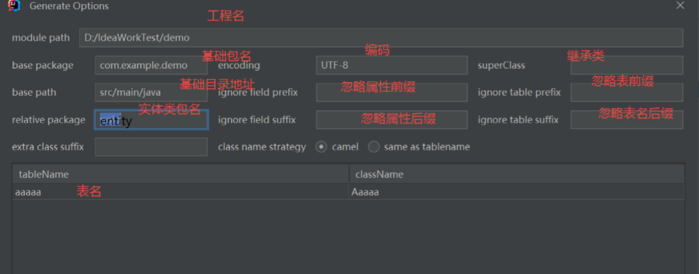

# 3、SpringBoot3-数据访问

##  [MyBatis-Plus官方](https://baomidou.com/)

## 整合SSM场景——方式一

SpringBoot 整合 Spring、SpringMVC、MyBatis 进行数据访问场景开发

### 1. 创建SSM整合项目

```xml
<!-- https://mvnrepository.com/artifact/org.mybatis.spring.boot/mybatis-spring-boot-starter -->
<dependency>
    <groupId>org.mybatis.spring.boot</groupId>
    <artifactId>mybatis-spring-boot-starter</artifactId>
    <version>3.0.1</version>
</dependency>
<dependency>
    <groupId>mysql</groupId>
    <artifactId>mysql-connector-java</artifactId>
    <scope>runtime</scope>
</dependency>
```


### 2. 配置数据源

application.properties

```properties
spring.datasource.url=jdbc:mysql://192.168.200.100:3306/demo
spring.datasource.driver-class-name=com.mysql.cj.jdbc.Driver
spring.datasource.username=root
spring.datasource.password=123456
spring.datasource.type=com.zaxxer.hikari.HikariDataSource
```

安装MyBatisX 插件，帮我们生成Mapper接口的xml文件即可

### 3. 配置MyBatis

```properties
#指定mapper映射文件位置
mybatis.mapper-locations=classpath:/mapper/*.xml
#参数项调整,打开驼峰命名规则
mybatis.configuration.map-underscore-to-camel-case=true
```

**1,2总结:**

```properties
# 1、先配置数据源信息
spring.datasource.driver-class-name=com.mysql.cj.jdbc.Driver
spring.datasource.type=com.zaxxer.hikari.HikariDataSource
spring.datasource.url=jdbc:mysql://localhost:3306/test
spring.datasource.username=root
spring.datasource.password=123456


# 2、配置整合MyBatis
mybatis.mapper-locations=classpath:/mapper/*.xml
# 打开驼峰命名规则
mybatis.configuration.map-underscore-to-camel-case=true
```

### 4. 简单使用

+ 配置文件

  ```properties
  # 1、先配置数据源信息
  spring.datasource.driver-class-name=com.mysql.cj.jdbc.Driver
  spring.datasource.type=com.zaxxer.hikari.HikariDataSource
  spring.datasource.url=jdbc:mysql://localhost:3306/test
  spring.datasource.username=root
  spring.datasource.password=123456
  
  
  # 2、配置整合MyBatis
  mybatis.mapper-locations=classpath:/mapper/*.xml
  # 打开驼峰命名规则
  mybatis.configuration.map-underscore-to-camel-case=true
  ```

+ **入口函数**

  ```java
  package com.atguigu.boot3.ssm;
  
  import com.atguigu.boot3.starter.robot.annotation.EnableRobot;
  import org.mybatis.spring.annotation.MapperScan;
  import org.springframework.boot.SpringApplication;
  import org.springframework.boot.autoconfigure.SpringBootApplication;
  
  /**
   * 1、@MapperScan【批量扫描注解】； 告诉MyBatis，扫描哪个包下面的所有接口
   * 2、使用mybatis.mapper-locations，告诉MyBatis，每个接口的xml文件都在哪里
   * 3、MyBatis自动关联绑定。
   */
  @EnableRobot
  @MapperScan(basePackages = "com.atguigu.boot3.ssm.mapper")   //添加扫描
  @SpringBootApplication
  public class Boot305SsmApplication {
  
      public static void main(String[] args) {
          SpringApplication.run(Boot305SsmApplication.class, args);
      }
  
  }
  ```

- **编写entity**

  <font  color = red>entity包：数据库表的实体对象</font>

  ```java
  package com.atguigu.boot3.ssm.entity;
  
  import lombok.Data;
  
  @Data  // 自动生成 get put ....
  @NoArgsConstructor //自动生成无参构造器
  @AllArgsConstructor //自动生成全参构造器
  public class TUser {  // 和数据库的字段对应起来
      private Long id;
      private String loginName;
      private String nickName;
      private String passwd;
  }
  ```

- **编写Mapper**

  + 方法一:  使用MapperXML

    使用`mybatisx`插件，快速生成MapperXML

    

    ```java
    package com.atguigu.boot3.ssm.mapper;
    
    import com.atguigu.boot3.ssm.bean.TUser;
    import org.apache.ibatis.annotations.Param;
    
    @Mapper
    public interface UserMapper {
    
        /**
         * 1、每个方法都在Mapper文件中有一个sql标签对应。
         * 2、所有参数都应该用@Param进行签名，以后使用指定的名字在SQL中取值
         */
        TUser getUserById(@Param("id") Long id);
    }
    ```

    ```xml
    <?xml version="1.0" encoding="UTF-8" ?>
    <!DOCTYPE mapper PUBLIC "-//mybatis.org//DTD Mapper 3.0//EN" "http://mybatis.org/dtd/mybatis-3-mapper.dtd" >
    <mapper namespace="com.atguigu.boot3.ssm.mapper.UserMapper">
        <!--    接口的全类名和namespace的值是一一对应的
                select id,login_name loginName,nick_name nickName,passwd from t_user where id=#{id}
        -->
    
        <select id="getUserById" resultType="com.atguigu.boot3.ssm.bean.TUser">
            select *
            from t_user
            where id = #{id}
        </select>
    </mapper>
    ```

  + 方法二:  使用注解

    ```java
    package com.qingge.springboot.mapper;
    import com.qingge.springboot.entity.User;
    import org.apache.ibatis.annotations.Mapper;
    import org.apache.ibatis.annotations.Select;
    import java.util.List;
    
    @Mapper
    public interface UserMapper{
        @Select("SELECT fron sys_user")  //
        List<User>findALl();
        
        int insert();
    }
    ```

- 测试代码

  ```java
  package com.atguigu.boot3.ssm.controller;
  
  import com.atguigu.boot3.ssm.bean.TUser;
  import com.atguigu.boot3.ssm.mapper.UserMapper;
  import org.springframework.beans.factory.annotation.Autowired;
  import org.springframework.web.bind.annotation.GetMapping;
  import org.springframework.web.bind.annotation.PathVariable;
  import org.springframework.web.bind.annotation.RestController;
  
  
  @RestController
  public class UserController {
  
      @Autowired
      UserMapper userMapper; //
  
  
      /**
       * 返回User的json数据
       * @param id
       * @return
       */
      @GetMapping("/user/{id}")
      public TUser getUser(@PathVariable("id") Long id){  //前端的动态值传给id
          TUser user = userMapper.getUserById(id);
          return user;
      }
  }
  ```

## 整合SSM场景——方式二:crossed_swords:

### IDEA中使用自带的数据库(重要)


> 首先打开IDEA页面
> 

> 添加MySQL数据库
>
> 

> 配置
> 

> 选择自己用的数据库
>
> 

> 查看数据库中的表结构
> 

> 查看表的SQL语句
>
> 

> 新建查询，执行SQL语句
> 

### MyBatisX 插件


设置项目基本路径、包路径、[编码格式](https://so.csdn.net/so/search?q=编码格式&spm=1001.2101.3001.7020)，实体类包名称、实体类名

配置生成mapper文件，service文件的位置


ptions选项作用大致如下：

- comment：可能和生成java doc comments有关，没有效果。
- toString/hashCode/equals：是否生成相应的方法，建议勾选(和Lombok选择一个)。
- Lombok：勾选后实体类自动添加Lombok的@Data注解，建议勾选（要先安装Lombok插件）
- Actual Column：勾选后，生成的实体类属性名和表中字段名大小写会保持一致。例如，表中有字段Name，勾选该选项后生成的属性名也为Name，未勾选则为name，建议根据实际需要勾选。
- Actual Column Annotation：是否对所有属性名都加上注解标明对应字段，例如@TableName，建议勾选。
- JSR310:Data API：是否使用新标准的时间日期API，包括 Instant、Clock、LocalDateTime、DateTimeFormatter、ZonedDateTime 以及替换 Calendar 的 Chronology 等类。建议勾选（新标准的时间日期API比老版本友好多了，强烈建议使用新版时间日期API）

### 快速生成

官网 [代码生成器（新） | MyBatis-Plus (baomidou.com)](https://baomidou.com/pages/779a6e/#快速入门)

#### ①  pom.xml

```xml

<?xml version="1.0" encoding="UTF-8"?>
<project xmlns="http://maven.apache.org/POM/4.0.0" xmlns:xsi="http://www.w3.org/2001/XMLSchema-instance"
         xsi:schemaLocation="http://maven.apache.org/POM/4.0.0 https://maven.apache.org/xsd/maven-4.0.0.xsd">
    <modelVersion>4.0.0</modelVersion>
    <parent>
        <groupId>org.springframework.boot</groupId>
        <artifactId>spring-boot-starter-parent</artifactId>
        <version>3.1.3</version>
        <relativePath/> <!-- lookup parent from repository -->
    </parent>
    <groupId>com.example</groupId>
    <artifactId>experiment01</artifactId>
    <version>0.0.1-SNAPSHOT</version>
    <name>experiment01</name>
    <description>experiment01</description>
    <properties>
        <java.version>17</java.version>
    </properties>
    <dependencies>
        <dependency>
            <groupId>org.springframework.boot</groupId>
            <artifactId>spring-boot-starter-web</artifactId>
        </dependency>
        <dependency>
            <groupId>org.mybatis.spring.boot</groupId>
            <artifactId>mybatis-spring-boot-starter</artifactId>
            <version>3.0.2</version>
        </dependency>

        <dependency>
            <groupId>com.mysql</groupId>
            <artifactId>mysql-connector-j</artifactId>
            <scope>runtime</scope>
        </dependency>
        <dependency>
            <groupId>org.projectlombok</groupId>
            <artifactId>lombok</artifactId>
            <optional>true</optional>
        </dependency>
        <dependency>
            <groupId>org.springframework.boot</groupId>
            <artifactId>spring-boot-starter-test</artifactId>
            <scope>test</scope>
        </dependency>
        <dependency>
            <groupId>org.mybatis.spring.boot</groupId>
            <artifactId>mybatis-spring-boot-starter-test</artifactId>
            <version>3.0.2</version>
            <scope>test</scope>
        </dependency>
        <!--        mybatisplus+数据库相关开始-->
        <dependency>
            <groupId>com.baomidou</groupId>
            <artifactId>mybatis-plus-core</artifactId>
            <version>3.2.0</version>
        </dependency>
        <dependency>
            <groupId>org.projectlombok</groupId>
            <artifactId>lombok</artifactId>
        </dependency>
        <dependency>
            <groupId>org.springframework.boot</groupId>
            <artifactId>spring-boot-starter-web</artifactId>
        </dependency>
        <dependency>
            <groupId>junit</groupId>
            <artifactId>junit</artifactId>
            <scope>test</scope>
        </dependency>
        <!--        mybatisplus+数据库相关结束-->
    </dependencies>

    <build>
        <plugins>
            <plugin>
                <groupId>org.springframework.boot</groupId>
                <artifactId>spring-boot-maven-plugin</artifactId>
                <configuration>
                    <excludes>
                        <exclude>
                            <groupId>org.projectlombok</groupId>
                            <artifactId>lombok</artifactId>
                        </exclude>
                    </excludes>
                </configuration>
            </plugin>
        </plugins>
    </build>

</project>
```

**其核心引入:**

```xml
    <!-- mysql -->
    <dependency>
        <groupId>com.mysql</groupId>
        <artifactId>mysql-connector-j</artifactId>
    </dependency>	    
    <!-- mybatisplus+数据库相关开始-->
        <dependency>
            <groupId>com.baomidou</groupId>
            <artifactId>mybatis-plus-core</artifactId>
            <version>3.5.3.1</version>
        </dependency>
	    <!--使用mybatisplus常用接口,可以不用写sql语句-->
        <dependency>
            <groupId>com.baomidou</groupId>
            <artifactId>mybatis-plus-boot-starter</artifactId>
            <version>3.5.3.1</version>
        </dependency>
		<!--使用mybatisplus代码生成器, 具体用法见官网-->
        <dependency>
            <groupId>com.baomidou</groupId>
            <artifactId>mybatis-plus-generator</artifactId>
            <version>3.5.3.1</version>
        </dependency>
        <!--mybatisplus+数据库相关结束-->

        <dependency>
            <groupId>org.projectlombok</groupId>
            <artifactId>lombok</artifactId>
        </dependency>
        <dependency>
            <groupId>org.springframework.boot</groupId>
            <artifactId>spring-boot-starter-web</artifactId>
        </dependency>
```

#### ②  **mapper包**

**添加@Mapper注解**

#### ③  更新配置

```properties
#在较新的MySQL驱动版本中，使用com.mysql.cj.jdbc.Driver来代替com.mysql.jdbc.Driver作为数据库驱动的类名是推
spring.datasource.driver-class-name=com.mysql.cj.jdbc.Driver
spring.datasource.type=com.zaxxer.hikari.HikariDataSource
spring.datasource.url=jdbc:mysql://localhost:3306/mybatis
spring.datasource.username=root
spring.datasource.password=741106

mybatis.mapper-locations=classpath:/mapper/*.xml

mybatis.configuration.map-underscore-to-camel-case=true

# web 端口
server.port=9000
```

不需要写返回值，只需要写方法名就能够快速生成CRUD


输入insertSelective之后立即点击“**Alt+Enter**”即可mapper文件中自动生成sql


### 基础代码

**IService的使用：**

IService的使用需要另外两个接口的配合：`baseMapper`和`ServiceImpl`

第一步：实现basemapper接口

```java
public interface AdminMapper extends BaseMapper<Admin> {
     ClassDetail getById(Serializable id);
}
```

第二步：编写service类

```java
public interface AdminService extends IService<Admin> {
    ClassDetail getById(Serializable id);
}
```

第三步：编写serviceImpl，ServiceImpl里面是各种的方法实现，好奇的可以点进源码看下，两个泛型需要注意的，第一个是继承basemapper的(AdminMapper)，第二个是实体类(Admin)。

```java
public class AdminServiceImpl extends ServiceImpl<AdminMapper,Admin> 
    						  implements AdminService {
    @Autowired
    ClassDetailMapper classDetailMapper;

    @Override
    public ClassDetail getById(Serializable id) {
        return classDetailMapper.getDetailById(id);
    }
}

public class ServiceImpl<M extends BaseMapper<T>, T> implements IService<T> {...}


//或者使用 this.getBaseMapper().方法   等价于 ClassDetailMapper classDetailMapper;
```

第四步：愉快的使用啦，可以参考[IService接口解释](https://gitee.com/baomidou/mybatis-plus/blob/3.0/mybatis-plus-extension/src/main/java/com/baomidou/mybatisplus/extension/service/IService.java)或者[Mybatis-plus官网](https://mp.baomidou.com/guide/crud-interface.html#service-crud-接口)的方法解释来调用。

```java
	@Autowired
    AdminService adminService;

	void test11(){
		// adminService中有很多方法, 因为extends ServiceImpl<AdminMapper,Admin> 
        Admin admin = adminService.getById(13);
    }
```

### 所需注解

```java
//1
@Mapper
public interface UserMapper {
}


// 2
@MapperScan(basePackages = "com.atguigu.boot3.ssm.mapper")   //添加扫描
@SpringBootApplication
public class SpringBackEndApplication {
	public static void main(String[] args) {
		SpringApplication.run(SpringBackEndApplication.class, args);
 }
```

### 时间数据

<strong  style="color:red">手动添加 @JsonFormat(pattern = "yyyy-MM-dd HH:mm:ss",timezone="GMT+8")</strong>

```java
import com.baomidou.mybatisplus.annotation.IdType;
import com.baomidou.mybatisplus.annotation.TableField;
import com.baomidou.mybatisplus.annotation.TableId;
import com.baomidou.mybatisplus.annotation.TableName;
import java.io.Serializable;
import java.time.LocalDate;
import java.time.LocalDateTime;
import java.time.LocalTime;
import lombok.Data;

/**
 * 
 * @TableName timetest
 */
@TableName(value ="timetest")
@Data
public class Timetest implements Serializable {
    /**
     * 
     */
    @TableField(value = "Date")
    private LocalDate date;

    /**
     * 
     */
    @TableField(value = "Time")
    private LocalTime time;

    /**
     * 
     */
    @TableField(value = "DateTime")
	@JsonFormat(pattern = "yyyy-MM-dd HH:mm:ss",timezone="GMT+8")  //原始数据为2023-12-27T10:38:51 格式化为2023-12-27 10:38:51
	private LocalDateTime datetime;

    @TableField(exist = false)
    private static final long serialVersionUID = 1L;
}
```

### CRUD接口方式

[MyBatis-Plus（九）Service的CRUD接口1：基本查询_listbyids_Zack_tzh的博客-CSDN博客](https://blog.csdn.net/Zack_tzh/article/details/107528997)

[【SpringBoot】MyBatis-Plus实现数据列表展示_springboot前端列表展示_刘婉晴的博客-CSDN博客](https://blog.csdn.net/liuwanqing233333/article/details/127539834)

 IService接口

```xml
  <!--使用mybatisplus常用接口,可以不用写sql语句-->
        <dependency>
            <groupId>com.baomidou</groupId>
            <artifactId>mybatis-plus-boot-starter</artifactId>
            <version>3.5.2</version>
        </dependency>
```

常用基础方法详解

```java
package com.guigu.admin;
 
import com.baomidou.mybatisplus.core.conditions.query.QueryWrapper;
import com.baomidou.mybatisplus.core.conditions.update.UpdateWrapper;
import com.guigu.admin.bin.User;
import com.guigu.admin.service.UserService;
import lombok.extern.slf4j.Slf4j;
import org.junit.jupiter.api.Test;
import org.springframework.beans.factory.annotation.Autowired;
import org.springframework.boot.test.context.SpringBootTest;
 
import java.util.*;
 
 
@Slf4j
@SpringBootTest
public class BootWebAdminApplicationTest {
    @Autowired
    UserService userService;
 
    /**
     * [插入一条数据]
     * default boolean save(T entity)
     * 返回值boolean：true/false
     * 形参：实体类对象
     */
    @Test
    void insertOneSave() {
        User user = new User();
        user.setName("张峰");
        user.setAge(12L);
        user.setId(13L);
        user.setEmail("test13@baomidou.com");
        boolean save = userService.save(user);
        log.info("插入数据结果{}", save);
    }
 
    /**
     * [批量插入数据]
     * default boolean saveBatch(Collection<T> entityList)
     * 返回值：boolean：true/false
     * 形参：List<实体类泛型>
     */
    @Test
    void inserts() {
        ArrayList<User> users = new ArrayList<>();
        users.add(new User("林燕", 15L, "test14@baomidou.com"));
        users.add(new User(15L, "林玲", 15L, "test15@baomidou.com"));
        users.add(new User(16L, "林灵", 15L, "test16@baomidou.com"));
        boolean b = userService.saveBatch(users);
        log.info("批量插入数据结果{}", b);
    }
 
    /**
     * [批量：根据主键修改值]
     * default boolean saveOrUpdateBatch(Collection<T> entityList)
     * 返回值：boolean
     * 形参：List<实体类形参>
     */
    @Test
    void updates() {
        ArrayList<User> users = new ArrayList<>();
        users.add(new User(9L, "霞飞"));
        users.add(new User(8L, "罗锐"));
        boolean b = userService.saveOrUpdateBatch(users);
    }
 
    /**
     * 根据主键删除值
     * default boolean removeById(Serializable id)
     * 返回值：boolean
     * 形参：主键值int类型
     */
    @Test
    void deleteId() {
        userService.removeById(1551916101577879553L);
    }
 
    /**
     * 根据条件删除记录[单条记录条件匹配]
     * default boolean removeByMap(Map<String, Object> columnMap)
     * 返回值：boolean
     * 形参：map
     * 字段—— ——>值
     * 字段—— ——>值
     * delete from user where id=7 and name="凌桦";
     */
    @Test
    void deleteMap() {
        Map userHashMap = new HashMap<>();
        userHashMap.put("id", 7L);
        userHashMap.put("name", "凌桦");
        boolean b = userService.removeByMap(userHashMap);
    }
 
    /**
     * 根据条件删除[删除单条数据]
     * default boolean remove(Wrapper<T> queryWrapper)
     * 返回值：boolean
     * 形参：QueryWrapper<实体类>
     * delete from user where age>20;
     */
    @Test
    void deleteRemove() {
        QueryWrapper<User> userQueryWrapper = new QueryWrapper<>();
        userQueryWrapper.gt("age", 20);
        boolean remove = userService.remove(userQueryWrapper);
    }
 
    /**
     * 批量删除[根据id批量删除]
     * default boolean removeByIds(Collection<? extends Serializable> idList)
     * 返回值：boolean
     * 形参：List
     */
    @Test
    void deleteRemoveId() {
        boolean b = userService.removeByIds(Arrays.asList(10, 11));
    }
 
    /**
     * 根据id修改实体类对象
     * default boolean updateById(T entity)
     * 返回值：boolean
     * 形参：实体类
     * <p>
     * update user set name="林海" where id=12;
     */
    @Test
    void updateId() {
        User user = new User();
        user.setId(12L);
        user.setName("林海");
        boolean b = userService.updateById(user);
    }
 
    /**
     * 根据条件修改
     *  default boolean update(T entity, Wrapper<T> updateWrapper)
     *  形参：
     *      1.实体类
     *      2.UpdateWrapper
     *  update user name="林玲" where name="罗锐";
     */
    @Test
    void updateCondition() {
        User user = new User();
        user.setName("林玲");
        UpdateWrapper updateWrapper = new UpdateWrapper();
        updateWrapper.eq("name","罗锐");
        boolean b = userService.update(user,updateWrapper);
    }
    /**
     *  批量修改
     *  default boolean updateBatchById(Collection<T> entityList)
     *  形参：ArrayList<实体类>
     *      update user name="张涛" where id=8;
     *      update user name="李杨" where id=9;
     *      update user name="王泽" where id=10;
     */
    @Test
    void updateList(){
        ArrayList<User> users = new ArrayList<>();
        users.add(new User(8L,"张涛"));
        users.add(new User(9L,"李杨"));
        users.add(new User(10L,"王泽"));
        boolean b = userService.updateBatchById(users);
    }
    /**
     * 根据主键id查询[查询单条记录]
     * default T getById
     * 返回值：实体类列表
     */
    @Test
    void selectGetByID(){
        User byId = userService.getById(17L);
        log.info("查询结果{}",byId);
    }
    /**
     * 根据id值查询多条语句
     * default List<T> listByIds(Collection<? extends Serializable> idList)
     * 返回值List<io值,...>
     *
     *  select *from user where id=8;
     *  select *from user where id=12;
     *  select *from user where id=16;
     */
    @Test
    void selectListsId(){
        ArrayList<User> users1 = new ArrayList<>();
        List<User> users = userService.listByIds(Arrays.asList(8L,12L,16L));
        log.info("查询8，12，16结果{}",users);
    }
    /**
     * [查询单条记录]
     * default List<T> listByMap(Map<String, Object> columnMap)
     * 形参 HashMap<String,Object>()
     *      select *from user where name="吴峰" and age=15;
     */
    @Test
    void selectMapId(){
        HashMap<String, Object> map = new HashMap<String,Object>();
        map.put("name","吴峰");
        map.put("age",15L);
        List<User> users = userService.listByMap(map);
        log.info("查询单条记录结果{}",users);
    }
    /**
     * 根据条件查询一天记录[根据条件查询]
     * default T getOne(Wrapper<T> queryWrapper)
     *
     * select *from user where name="张涛";
     */
    @Test
    void selectQueryWrapper(){
        QueryWrapper queryWrapper = new QueryWrapper();
        queryWrapper.eq("name","张涛");
        User one = userService.getOne(queryWrapper);
        log.info("查询结果{}",one);
        //User(id=8, name=张涛, age=19, email=test8@baomidou.com)
    }
    /**
     *  根据实体封装类查询
     *  dMap<String, Object> getMap(Wrapper<T> queryWrapper);
     */
    @Test
    void getOne(){
        QueryWrapper queryWrapper = new QueryWrapper();
        queryWrapper.eq("name","林灵");
        Map map = userService.getMap(queryWrapper);
        log.info("返回结果{}",map);
        //{name=林灵, id=16, age=15, email=test16@baomidou.com}
    }
    /**
     * 查询总记录数
     *  default int count()
     */
    @Test
    void selectSum(){
        int count = userService.count();
        log.info("查询结果{}",count);
    }
    /**
     * 根据条件查询记录总数
     * default int count(Wrapper<T> queryWrapper)
     */
    @Test
    void selectCountWra(){
        QueryWrapper queryWrapper = new QueryWrapper();
        queryWrapper.like("name","林");
        int count = userService.count(queryWrapper);
        log.info("模糊查询名字中带有林字的人数{}",count);//4
    }
    /**
     * 根据条件查询多条记录
     * default List<T> list(Wrapper<T> queryWrapper)
     *
     * 查询结果
     *   [User(id=12, name=林海, age=18, email=test12@baomidou.com),
     *   User(id=14, name=林燕, age=15, email=test14@baomidou.com),
     *   User(id=15, name=林玲, age=15, email=test15@baomidou.com),
     *   User(id=16, name=林灵, age=15, email=test16@baomidou.com)]
     */
    @Test
    void selectListWra(){
        QueryWrapper<User> wrapper = new QueryWrapper<>();
        wrapper.like("name","林");
        List<User> list = userService.list(wrapper);
        log.info("模糊查询结果：{}",list);
 
    }
    /**
     * 查询所有
     * default List<T> list()
     * 
     * 运行结果
     * [User(id=8, name=张涛, age=19, email=test8@baomidou.com), 
     * User(id=12, name=林海, age=18, email=test12@baomidou.com), 
     * User(id=13, name=张峰, age=12, email=test13@baomidou.com), 
     * User(id=14, name=林燕, age=15, email=test14@baomidou.com), 
     * User(id=15, name=林玲, age=15, email=test15@baomidou.com), 
     * User(id=16, name=林灵, age=15, email=test16@baomidou.com), 
     * User(id=17, name=吴峰, age=17, email=test17@baomidou.com)]
     */
    @Test
    void selectLists(){
        List<User> list = userService.list();
        log.info("查询所有记录{}",list);
    }
 
 
}
```

### mybatis中parameterType别名图


### 单表查询

#### 条件构造器方式


例子

```java
/**
     * 1、名字中包含雨并且年龄小于40
     *     name like '%雨%' and age<40
     */
    @Test
    public void selectByWrapper() {
        QueryWrapper<User> queryWrapper = new QueryWrapper<>();
        queryWrapper.like("name", "雨").lt("age", 40);

        List<User> userList = userMapper.selectList(queryWrapper);
        userList.forEach(System.out::println);
    }
    /**
     * 2、名字中包含雨年并且龄大于等于20且小于等于40并且email不为空
     *    name like '%雨%' and age between 20 and 40 and email is not null
     */
    @Test
    public void selectByWrapper2() {
        QueryWrapper<User> queryWrapper = new QueryWrapper<>();
        queryWrapper.like("name", "雨").between("age" ,20 ,40).isNotNull("email");

        List<User> userList = userMapper.selectList(queryWrapper);
        userList.forEach(System.out::println);
    }

    /**
     * 3、名字为王姓或者年龄大于等于25，按照年龄降序排列，年龄相同按照id升序排列
     *    name like '王%' or age>=25 order by age desc,id asc
     */
    @Test
    public void selectByWrapper3() {
        QueryWrapper<User> queryWrapper = new QueryWrapper<>();
        queryWrapper.likeRight("name", "王").or().gt("age", 25).orderByDesc("age").orderByAsc("id");

        List<User> userList = userMapper.selectList(queryWrapper);
        userList.forEach(System.out::println);
    }
```

4、创建日期为2019年2月14日并且直属上级为名字为王姓

> date_format(create_time,‘%Y-%m-%d’)=‘2019-02-14’ and manager_id in (select id from user where name like ‘王%’)

```java
apply(sql,prams)
inSql("字段",sql子查询)


QueryWrapper<User> queryWrapper = new QueryWrapper<User>();
queryWrapper.apply("date_format(create_time,'%Y-%m-%d') = {0}","2019-02-14").inSql("manager_id","select id from user where name like '王%' ");
List<User> userList = userMapper.selectList(queryWrapper);
userList.forEach(System.out::println);

// 此处写法存在sql注入问题，不建议使用
userQuery.apply("date_format(create_time,'%Y-%m-%d')='2019-02-14' or true or true").inSql("manager_id","select id from user where name like '王%'");

queryWrapper.apply("phone","888888").inSql("username","select username from user where id = 3");

date_format(日期，'格式')：将日期按照格式进行插入或者返回。例如：date_format(now(),'%Y-%m-%d')。
动态条件构造器：apply。范围条件构造器：insql。
注意：如果{0}替换为实际值，可能会造成sql注入。
```


```java
public class SelectTest {
    @Autowired
    UserMapper userMapper;

    @Test
    public void selectById() {
        User user = userMapper.selectById(1087982257332887553L);
        System.out.println(user);
    }

    @Test
    public void selectBatchIds() {
        List<Long> ids = Arrays.asList(
            1087982257332887553L,
            1094590409767661570L,
            1094592041087729666L
        );
        List<User> list = userMapper.selectBatchIds(ids);
        list.forEach(System.out::println);
    }

    @Test
    public void selectByMap() {
        Map<String, Object> map = new HashMap<>();
        //map的key指代的是mysql表中的列名，并非java实体的属性名
        map.put("name", "张雨琪");
        map.put("manager_id", 1088248166370832385L);
        List<User> list = userMapper.selectByMap(map);
        list.forEach(System.out::println);
    }

    @Test
    public void selectList_all() {
        List<User> list = userMapper.selectList(null);
        list.forEach(System.out::println);
    }

    /**
     * 名字中包含雨，并且年龄小于40
     * SELECT * FROM `user`
     * WHERE `name` LIKE '%雨%' AND `age`< 40
     */
    @Test
    public void selectList_like_lt() {
//        QueryWrapper<User> query = Wrappers.<User>query();
        QueryWrapper<User> query = new QueryWrapper<>();
        query.like("name", "雨").lt("age", 40);
        List<User> list = userMapper.selectList(query);
        list.forEach(System.out::println);
    }

    /**
     * 名字中包含雨，并且年龄大于等于20且小于等于40，并且email不为空
     * SELECT * FROM `user`
     * WHERE `name` LIKE '%雨%' AND `age` <= 40 AND `age` >= 20 AND `email` IS NOT NULL
     */
    @Test
    public void selectList_between_isNotNull() {
        QueryWrapper<User> query = new QueryWrapper<>();
        query.like("name", "雨").between("age", 20, 40).isNotNull("email");
        List<User> list = userMapper.selectList(query);
        list.forEach(System.out::println);
    }

    /**
     * 姓赵或者年龄大于等于25，按照年龄降序排列，年龄相同则按照id升序排列
     * SELECT * FROM `user`
     * WHERE `name` LIKE '赵%' OR `age` >= 25 ORDER BY `age` DESC , `id` ASC;
     */
    @Test
    public void selectList_or_orderByDesc_orderByAsc() {
        QueryWrapper<User> query = new QueryWrapper<>();
        query.likeRight("name", "赵").or().ge("age", 20)
            .orderByDesc("age").orderByAsc("id");
        List<User> list = userMapper.selectList(query);
        list.forEach(System.out::println);
    }

    /**
     * 创建日期为2019年2月14日，且直属上级姓王
     * SELECT * FROM `user`
     * WHERE DATE_FORMAT(create_time,'%Y-%m-%d')='2019-02-14'
     * AND manager_id IN (SELECT id FROM `user` WHERE `name` LIKE '王%')
     */
    @Test
    public void selectList_apply_inSql() {
        QueryWrapper<User> query = new QueryWrapper<>();
        query.apply("DATE_FORMAT(create_time,'%Y-%m-%d')={0}", "2019-02-14")
            .inSql("manager_id", "SELECT id FROM `user` WHERE `name` LIKE '王%'");
        List<User> list = userMapper.selectList(query);
        list.forEach(System.out::println);
    }

    /**
     * 姓王且（年龄小于40或邮箱不为空）
     * SELECT * FROM `user`
     * WHERE `name` LIKE '王%' AND (`age`< 40 OR `email` IS NOT NULL)
     */
    @Test
    public void selectList_and_lambda() {
        QueryWrapper<User> query = new QueryWrapper<>();
        query.likeRight("name", "王")
            .and(q -> q.lt("age", 40).or().isNotNull("email"));
        List<User> list = userMapper.selectList(query);
        list.forEach(System.out::println);
    }

    /**
     * 姓王且或者（年龄小于40且年龄大于20且邮箱不为空）
     * SELECT * FROM `user`
     * WHERE `name` LIKE '王%' OR (`age`< 40 AND `age` > 20  AND `email` IS NOT NULL)
     */
    @Test
    public void selectList_or_lambda() {
        QueryWrapper<User> query = new QueryWrapper<>();
        query.likeRight("name", "王")
            .or(q -> q.lt("age", 40).gt("age", 20).isNotNull("email"));
        List<User> list = userMapper.selectList(query);
        list.forEach(System.out::println);
    }

    /**
     * （年龄小于40或邮箱不为空）且姓王
     * SELECT * FROM `user`
     * WHERE (`age`< 40 OR `email` IS NOT NULL) AND `name` LIKE '王%'
     */
    @Test
    public void selectList_nested() {
        QueryWrapper<User> query = new QueryWrapper<>();
        query.nested(q -> q.lt("age", 40).or().isNotNull("email"))
            .likeRight("name", "王");
        List<User> list = userMapper.selectList(query);
        list.forEach(System.out::println);
    }

    /**
     * 年龄为30,31,34,35
     * SELECT * FROM `user` WHERE `age` IN (30,31,34,35);
     */
    @Test
    public void selectList_in() {
        QueryWrapper<User> query = new QueryWrapper<>();
        query.in("age", Arrays.asList(30, 31, 34, 35));
        List<User> list = userMapper.selectList(query);
        list.forEach(System.out::println);
    }

    /**
     * 返回只满足条件的一条（只调用最后一次，有sql注入的风险）
     * SELECT * FROM `user` WHERE `age` IN (30,31,34,35) LIMIT 1;
     */
    @Test
    public void selectList_last() {
        QueryWrapper<User> query = new QueryWrapper<>();
        query.in("age", Arrays.asList(30, 31, 34, 35)).last("limit 1");
        List<User> list = userMapper.selectList(query);
        list.forEach(System.out::println);
    }

    /**
     * 只查询指定字段
     * SELECT `name`,`age` FROM `user` WHERE `age` IN (30,31,34,35) LIMIT 1;
     */
    @Test
    public void selectList_select_include() {
        QueryWrapper<User> query = new QueryWrapper<>();
        query.select("name", "age").in("age", Arrays.asList(30, 31, 34, 35)).last("limit 1");
        List<User> list = userMapper.selectList(query);
        list.forEach(System.out::println);
    }

    /**
     * 排除指定字段
     */
    @Test
    public void selectList_select_exclude() {
        QueryWrapper<User> query = new QueryWrapper<>();
        query.in("age", Arrays.asList(30, 31, 34, 35)).last("limit 1")
            .select(
                User.class,
                info -> !info.getColumn().equals("create_time") && !info.getColumn().equals("manager_id")
            );
        List<User> list = userMapper.selectList(query);
        list.forEach(System.out::println);
    }

    /**
     * 条件判断
     */
    @Test
    public void selectList_condition() {
        String name = "刘";
        String email = "";
        QueryWrapper<User> query = new QueryWrapper<>();
        query.like(StringUtils.isNotEmpty(name), "name", name)
            .like(StringUtils.isNotEmpty(email), "email", email);
        List<User> list = userMapper.selectList(query);
        list.forEach(System.out::println);
    }

    /**
     * 实体类作为条件构造器
     * 默认是等值查询，可以在实体类属性中设置自定义条件
     */
    @Test
    public void selectList_entity() {
        User whereUser = new User();
        whereUser.setName("刘");//name like "刘"
        whereUser.setAge(32);//age<30
        QueryWrapper<User> query = new QueryWrapper<>(whereUser);
        query.eq("manager_id", "1088248166370832385");

        List<User> list = userMapper.selectList(query);
        list.forEach(System.out::println);
    }

    /**
     * allEq
     */
    @Test
    public void selectList_allEq() {
        QueryWrapper<User> query = new QueryWrapper<>();
        Map<String, Object> params = new HashMap<>();
        params.put("name", "刘明强");
        params.put("age", 31);
        params.put("email", null);
//        query.allEq(params,false);//第二个参数表示如果列值为null是否按IS NULL查询，false则忽略null列的查询
        query.allEq((k, v) -> !k.equals("name"), params, false);//第一个参数是过滤器
        List<User> list = userMapper.selectList(query);
        list.forEach(System.out::println);
    }

    /**
     * selectMaps的应用场景1：当表中的列特别多，但实际只需要几个列时，这时返回一个实体类有些不必要
     */
    @Test
    public void selectMaps() {
        QueryWrapper<User> query = new QueryWrapper<>();
        query.like("name", "雨").lt("age", 40).select("name", "age");
        List<Map<String, Object>> maps = userMapper.selectMaps(query);
        maps.forEach(System.out::println);
    }

    /**
     * selectMaps的应用场景2：查询统计结果
     * 按照直属上级分组，查询每组的平均年龄、最大年龄、最小年龄，并且只取年龄总和小于100的组
     * SELECT AVG(age) avg_age,MIN(age) min_age,MAX(age) max_age
     * FROM `user`
     * GROUP BY `manager_id`
     * HAVING SUM(age)<100;
     */
    @Test
    public void selectMaps2() {
        QueryWrapper<User> query = new QueryWrapper<>();
        query.select("AVG(age) avg_age", "MIN(age) min_age", "MAX(age) max_age")
            .groupBy("manager_id")
            .having("SUM(age)<{0}", 100);
        List<Map<String, Object>> maps = userMapper.selectMaps(query);
        maps.forEach(System.out::println);
    }


    /**
     * selectObjs只返回第一列，其它列被遗弃
     * 应用场景：只需返回一列的时候
     */
    @Test
    public void selectObjs() {
        QueryWrapper<User> query = new QueryWrapper<>();
        query.like("name", "雨").lt("age", 40).select("name", "age");
        List<Object> list = userMapper.selectObjs(query);
        list.forEach(System.out::println);
    }

    /**
     * 返回总记录数
     */
    @Test
    public void selectCount() {
        QueryWrapper<User> query = new QueryWrapper<>();
        query.like("name", "雨").lt("age", 40);
        Integer count = userMapper.selectCount(query);
        System.out.println("总记录数：" + count);
    }

    /**
     * selectOne：只能查询一条记录，查询到多条会报错
     */
    @Test
    public void selectOne() {
        QueryWrapper<User> query = new QueryWrapper<>();
        query.like("name", "刘红雨").lt("age", 40);
        User user = userMapper.selectOne(query);
        System.out.println(user);
    }

    /**
     * lambda条件构造器
     */
    @Test
    public void lambdaQueryWrapper1() {
//        LambdaQueryWrapper<User> lambdaQ = new QueryWrapper<User>().lambda();
//        LambdaQueryWrapper<User> lambdaQ = new LambdaQueryWrapper<>();
        LambdaQueryWrapper<User> lambdaQ = Wrappers.<User>lambdaQuery();

        lambdaQ.like(User::getName, "雨").lt(User::getAge, 40);
        List<User> list = userMapper.selectList(lambdaQ);
        list.forEach(System.out::println);
    }

    /**
     * lambda条件构造器:防误写（例如列名"name"可能被误写）
     */
    @Test
    public void lambdaQueryWrapper2() {
        LambdaQueryWrapper<User> query = new LambdaQueryWrapper<>();
        query.likeRight(User::getName, "王")
            .and(q -> q.lt(User::getAge, 40).or().isNotNull(User::getEmail));
        List<User> list = userMapper.selectList(query);
        list.forEach(System.out::println);
    }

    /**
     * 链式lambda条件构造器：更优雅的书写方式
     */
    @Test
    public void lambdaQueryChainWrapper() {
        List<User> list = new LambdaQueryChainWrapper<User>(userMapper)
            .likeRight(User::getName, "王")
            .and(
                q -> q
                    .lt(User::getAge, 40)
                    .or()
                    .isNotNull(User::getEmail)
            )
            .list();
        list.forEach(System.out::println);
    }

}
```

 比如我们想查age等于23并且school_id等于300的

> sql语句为：select * FROM student where age='23' or school_id='300'

 最直接的方法： 

> List<Student> students = studentMapper
>
> .selectList(Wrappers.lambdaQuery(Student.class)
>
> .eq(Student::getAge, "23")
>
> .or()
>
> .eq(Student::getSchoolId,300));

 也可以用下面的方法

>  用mybatis-plus则为：
>
>  ```
>  List<Student> students = studentMapper.selectList(Wrappers.lambdaQuery(Student.class)
>  .eq(Student::getAge, "23")
>  .or(s -> s.eq(Student::getSchoolId, 300)));
>  ```

**比如我们想查 age等于25或者姓张的同学**

> sql语句：select * FROM student where age='25' or `name` LIKE '张%'

用mybatis-plus最直接的方法

> ```
> List<Student> students = studentMapper
> .selectList(Wrappers.lambdaQuery(Student.class)
> .eq(Student::getAge, "25")
> .or()
> .likeRight(Student::getName, "张"));
> ```

 也可以用以下方法

> ```
> List<Student> students = studentMapper
> .selectList(Wrappers.lambdaQuery(Student.class)
> .eq(Student::getAge, "25")
> .or(s->s.likeRight(Student::getName,"张")));
> ```


##### **使用条件构造器进行查询**

1. Java的传统写法

```java
public AjaxResult selectStudentByNumber(@RequestBody Student student) {
    // 1. 定义条件构造器
    // 要使用哪个表进行查询，那么<>内就填写哪个类
    QueryWrapper<Student> qw = new QueryWrapper();
    // 2. 构造条件构造器
    // 第一个变量是书库据表中的字段，第二个变量是sql语句查询中要查找的值
    qw.eq("stu_number", student.getStuNumber());
    
    // 3. 查询
    // 在result内，就进行完了查询
    List<Student> result = studentService.list(qw);
    // 4. 返回
    return AjaxResult.success(result);
}
```

1. [lambda表达式](https://so.csdn.net/so/search?q=lambda表达式&spm=1001.2101.3001.7020)方式(推荐)

```java
public AjaxResult selectStudentByNumber(@RequestBody Student student) {
    // 1.定义条件构造器
    LambdaQueryWrapper<Student> lqw = new LambdaQueryWrapper<Student>().eq(Student::getStuNumber,stuNumber);
     // 2. 查询
    List<Student> result = studentService.list(lqw);
    return AjaxResult.success(result);
}
```

##### allEq：全部等于

```plaintext
// params : key为数据库字段名,value为字段值
allEq(Map<R, V> params)
```

> 举例：
> allEq({id:1,name:"某某",age:null})--->id = 1 and name = '某某' and age is null

代码演示：

```java
/**
 * SQL:SELECT * FROM student WHERE (stu_name = ? AND id = ?)
 */
public AjaxResult selectStudent(@RequestBody Student student) {
        QueryWrapper qw = new QueryWrapper();
        Map map = new HashMap<>();
        map.put("id","2");
        map.put("stu_name","某某");
        qw.allEq(map);
        List<User> list = studentService.list(qw);
        return AjaxResult.success(list);
}
```

##### eq：等于 =

```java
eq(R column, Object val)
```

> 举例：
> eq("name", "某某")--->name = '某某'

[MyBatis-Plus——条件构造器_mybatis-plus条件构造器-CSDN博客](https://blog.csdn.net/Yangyeon_/article/details/129452576)

#### 使用注解方式

mapper中使用注解的方式:

```java
@Select("SELECT * FROM users WHERE id = #{id}")
User getUserById(Long id);
@Insert("INSERT INTO users (name, age) VALUES (#{name}, #{age})")
void addUser(User user);
@Update("UPDATE users SET name = #{name}, age = #{age} WHERE id = #fid}")
void updateUser(User user);
@Delete("DELETE FROM users WHERE id = #{id}")
void deleteUser(Long id);
```

#### 使用xml方式

比较简单一般由插件直接生成

### 多表查询

代码见[代码experiment02](C:\Users\16658\Documents\GitHub\java_note\note\spring boot3\sql\experiment02)

MP提供了大量单表查询的方法，但是没有多表的操作，所以涉及到多表的查询时，需要我们自己实现

**单表查询插件可以自动生成映射类型**

```xml
    <resultMap id="BaseResultMap" type="com.example.experiment01.entity.TbProduct">
            <id property="id" column="id" jdbcType="INTEGER"/>
            <result property="name" column="NAME" jdbcType="VARCHAR"/>
            <result property="price" column="price" jdbcType="DOUBLE"/>
    </resultMap>
```

#### 理解一对一, 多对一和一对多

```java
//人类
public class Person implements Serializable{
private Integer id;
private String name;
private String sex;
private Integer age;

private Card card;   //人和身份证是一对一的关系
}
// 对这个数据实体操作时---->使用association
```

```java
package com.glj.pojo;
 
import java.io.Serializable;
 
//学生类
public class Student implements Serializable {
private Integer id;
private String name;
private String sex;
private Integer age;
       
private Clazz clazz;   //学生与班级是多对一的关系
}
// 对这个数据实体操作时---->使用association
```

```java
package com.glj.pojo;
 
import java.io.Serializable;
import java.util.List;
 
// 班级类
public class Clazz implements Serializable{
private Integer id;
private String code;
private String name;
      
private List<Student> students;  //班级与学生是一对多的关系
}
// 对这个数据实体操作时---->使用collection
```

#### 使用Xml方式

**多表查询:**

[association]()关联 用于一对一或多对一查询

```xml
<?xml version="1.0" encoding="UTF-8"?>
<!DOCTYPE mapper
        PUBLIC "-//mybatis.org//DTD Mapper 3.0//EN"
        "http://mybatis.org/dtd/mybatis-3-mapper.dtd">
<mapper namespace="com.example.experiment01.mapper.TbPersonMapper">

    <resultMap id="BaseResultMap" type="com.example.experiment01.entity.TbPerson">
            <id property="id" column="id" jdbcType="INTEGER"/>
            <result property="name" column="name" jdbcType="VARCHAR"/>
            <result property="age" column="age" jdbcType="INTEGER"/>
            <result property="sex" column="sex" jdbcType="VARCHAR"/>
            <result property="cardId" column="card_id" jdbcType="INTEGER"/>
    </resultMap>

    <sql id="Base_Column_List">
        id,name,age,
        sex,card_id
    </sql>

    <!-- 嵌套查询：通过执行另外一条SQL映射语句来返回预期的特殊类型 -->
    <select id="findPersonById" parameterType="Integer" resultMap="IdCardWithPersonResult">
        SELECT * from tb_person where id=#{id}
    </select>
    <resultMap type="com.example.experiment01.entity.TbPerson" id="IdCardWithPersonResult">
        <id property="id" column="id"/>
        <result property="name" column="name"/>
        <result property="age" column="age"/>
        <result property="sex" column="sex"/>
        <!-- 一对一：association使用select属性引入另外一条SQL语句 -->
        <association property="cardId" column="card_id" javaType="com.example.experiment01.entity.TbIdcard"
                     select="com.example.experiment01.mapper.IdCardMapper.findAllById"/>
    </resultMap>

    <!-- 嵌套结果：使用嵌套结果映射来处理重复的联合结果的子集 -->
    <select id="findPersonById2" parameterType="Integer"
            resultMap="IdCardWithPersonResult2">
        SELECT p.*,idcard.code
        from tb_person p,tb_idcard idcard
        where p.card_id=idcard.id
          and p.id= #{id}
    </select>
    <resultMap type="com.example.experiment01.entity.TbPerson" id="IdCardWithPersonResult2">
        <id property="id" column="id"/>
        <result property="name" column="name"/>
        <result property="age" column="age"/>
        <result property="sex" column="sex"/>
        <association property="cardId" javaType="com.example.experiment01.entity.TbIdcard">
            <id property="id" column="card_id"/>
            <result property="code" column="code"/>
        </association>
    </resultMap>


</mapper>

```

[collection](https://so.csdn.net/so/search?q=collection&spm=1001.2101.3001.7020) 意为集合 用于一对多查询

```xml
<?xml version="1.0" encoding="UTF-8"?>
<!DOCTYPE mapper
        PUBLIC "-//mybatis.org//DTD Mapper 3.0//EN"
        "http://mybatis.org/dtd/mybatis-3-mapper.dtd">
<mapper namespace="com.xxx.xxx.mapper.xxxxMapper">
    <!-- 
		id
		number
		productList
    -->
    <!-- 多对多嵌套查询：通过执行另外一条SQL映射语句来返回预期的特殊类型 -->
    <select id="函数名" parameterType="参数类型" resultMap="结果集名1">
        <!-- sql语句 -->
        select * from tb_orders WHERE id=#{id}
    </select>
    <resultMap type="com.xxx.xxx.entity.实体类" id="结果集名1">
        <!--property是实体类属性, colum是sql语句查出的字段
			colum能当做参数给property
		-->
        <id property="id" column="id"/>
        <result property="number" column="number"/>
         <!-- collection 多表关联映射  ofType表示属性集合中元素的类型--> 
        <collection property="productList" column="id" ofType="com.xxx.xxx.entity.关联的实体类"
                   <!--select调用其他mapper的函数(这里出现报错)--> 
                    select="com.itheima.mapper.ProductMapper.findProductById">
        </collection>
    </resultMap>

    <!-- 多对多嵌套结果查询：查询某订单及其关联的商品详情 -->
    <select id="函数名" parameterType="参数类型" resultMap="结果集名2">
        select o.*,p.id as pid,p.name,p.price
        from tb_orders o,tb_product p,tb_ordersitem  oi
        WHERE oi.orders_id=o.id
          and oi.product_id=p.id
          and o.id=#{id}
    </select>
    
    <!-- 自定义手动映射类型 -->
    <resultMap type="com.example.experiment01.entity.TbOrders" id="结果集名2">
        <id property="id" column="id"/>
        <result property="number" column="number"/>
        <!-- collection 多表关联映射 --> 
        <collection property="productList" ofType="com.xxx.xxx.entity.关联的实体类">
            <!--property是实体类属性, colum是sql语句查出的字段-->
            <id property="id" column="pid"/>
            <result property="name" column="name"/>
            <result property="price" column="price"/>
        </collection>
    </resultMap>
</mapper>
```

ps:  当结果就是实体类并且没有联表使用resultMap="实体类"可以不用写resultMap了

```xml
    <select id="findProductById" parameterType="Integer" 		              resultType="com.example.experiment01.entity.TbProduct"> 
        SELECT * from tb_product where id IN(
            SELECT product_id FROM tb_ordersitem  WHERE orders_id = #{id}
        )
    </select>
```

## 分页查询

**分页插件的配置（必须）**

```java
package com.example.demo.config;

@Configuration
@MapperScan("scan.your.mapper.package")
public class MybatisPlusConfig {

    /**
     * 添加分页插件
     */
    @Bean
    public MybatisPlusInterceptor mybatisPlusInterceptor() {
        MybatisPlusInterceptor interceptor = new MybatisPlusInterceptor();
        interceptor.addInnerInterceptor(new PaginationInnerInterceptor(DbType.MYSQL));//如果配置多个插件,切记分页最后添加
        //interceptor.addInnerInterceptor(new PaginationInnerInterceptor()); 如果有多数据源可以不配具体类型 否则都建议配上具体的DbType
        return interceptor;
    }
}
```

**查询**

```java
public void sortUsersInfo(String column, int ascending) {
    QueryWrapper<TUser> queryWrapper = new QueryWrapper<>();
    if (ascending == 1) {
        queryWrapper.orderByAsc(column);
    } else {
        queryWrapper.orderByDesc(column);
    }

    List<TUser> list = tUserService.list(queryWrapper);
    if (list.size() != 0) {
        for (TUser e : list)
            // 遍历
    }else{
        // error
    }
}
```

## 自动配置原理

**SSM整合总结：**

1. **导入** `mybatis-spring-boot-starter`
2. 配置**数据源**信息
3. 配置mybatis的`**mapper接口扫描**`与`**xml映射文件扫描**`
4. 编写bean，mapper，生成xml，编写sql 进行crud。**事务等操作依然和Spring中用法一样**
5. 效果：

6. 1. 所有sql写在xml中
   2. 所有`mybatis配置`写在`application.properties`下面

- `jdbc场景的自动配置`： 

- - `mybatis-spring-boot-starter`导入 `spring-boot-starter-jdbc`，jdbc是操作数据库的场景
  - `Jdbc`场景的几个自动配置

- - - org.springframework.boot.autoconfigure.jdbc.**DataSourceAutoConfiguration**

- - - - **数据源的自动配置**
      - 所有和数据源有关的配置都绑定在`DataSourceProperties`
      - 默认使用 `HikariDataSource`

- - - org.springframework.boot.autoconfigure.jdbc.**JdbcTemplateAutoConfiguration**

- - - - 给容器中放了`JdbcTemplate`操作数据库

- - - org.springframework.boot.autoconfigure.jdbc.**JndiDataSourceAutoConfiguration**
    - org.springframework.boot.autoconfigure.jdbc.**XADataSourceAutoConfiguration**

- - - - **基于XA二阶提交协议的分布式事务数据源**

- - - org.springframework.boot.autoconfigure.jdbc.**DataSourceTransactionManagerAutoConfiguration**

- - - - **支持事务**

- - **具有的底层能力：数据源、**`JdbcTemplate`、**事务**

- `MyBatisAutoConfiguration`：配置了MyBatis的整合流程

- - `mybatis-spring-boot-starter`导入 `mybatis-spring-boot-autoconfigure（mybatis的自动配置包）`，
  - 默认加载两个自动配置类：

- - - org.mybatis.spring.boot.autoconfigure.MybatisLanguageDriverAutoConfiguration
    - org.mybatis.spring.boot.autoconfigure.**MybatisAutoConfiguration**

- - - - **必须在数据源配置好之后才配置**
      - 给容器中`SqlSessionFactory`组件。创建和数据库的一次会话
      - 给容器中`SqlSessionTemplate`组件。操作数据库

- - **MyBatis的所有配置绑定在**`MybatisProperties`
  - 每个**Mapper接口**的**代理对象**是怎么创建放到容器中。详见**@MapperScan**原理：

- - - 利用`@Import(MapperScannerRegistrar.class)`批量给容器中注册组件。解析指定的包路径里面的每一个类，为每一个Mapper接口类，创建Bean定义信息，注册到容器中。

如何分析哪个场景导入以后，开启了哪些自动配置类。

找：`classpath:/META-INF/spring/org.springframework.boot.autoconfigure.AutoConfiguration.imports`文件中配置的所有值，就是要开启的自动配置类，但是每个类可能有条件注解，基于条件注解判断哪个自动配置类生效了。

##  快速定位生效的配置

```plain
#开启调试模式，详细打印开启了哪些自动配置
debug=true
# Positive（生效的自动配置）  Negative（不生效的自动配置）
```

## 扩展：整合其他数据源

###  Druid 数据源

暂不支持 `SpringBoot3`

- 导入`druid-starter`
- 写配置
- 分析自动配置了哪些东西，怎么用

Druid官网：https://github.com/alibaba/druid

# SpringBoot基于注解来动态切换数据源

具体代码见: 后端/note02/8-整合/综合/Springboot-Notebook/springboot101/数据库

## 数据库设置

### 数据库


### 表

分别在两个数据库中创建一张相同的表

```sql
DROP TABLE if EXISTS t_dynamic_datasource_data;

CREATE TABLE IF NOT EXISTS `t_dynamic_datasource_data` (
  `id` bigint(20) NOT NULL AUTO_INCREMENT,
  `source_name` varchar(25) DEFAULT NULL,
  PRIMARY KEY (`id`)
) ;
```

在mydruid中插入如下数据

```sql
insert into t_dynamic_datasource_data (source_name) value ('dynamic_datasource_master');
```

在mydruid2中插入如下数据

```sql
INSERT INTO t_dynamic_datasource_data (source_name) VALUE ('dynamic_datasource_slave');
```

## 配置文件

```yaml
mybatis:
    configuration:
        map-underscore-to-camel-case: true
    mapper-locations: classpath:/mapper/*.xml
server:
    port: 9000
spring:
    datasource:
        druid:
            master:
                driver-class-name: com.mysql.cj.jdbc.Driver
                password: 741106
                type: com.zaxxer.hikari.HikariDataSource
                url: jdbc:mysql://localhost:3306/mydruid
                username: root
            slave:
                driver-class-name: com.mysql.cj.jdbc.Driver
                password: 741106
                type: com.zaxxer.hikari.HikariDataSource
                url: jdbc:mysql://localhost:3306/mydruid2
                username: root
```

## 配置类


具体代码见:  后端/note02/8-整合/综合/Springboot-Notebook/springboot101/数据库

## 自定义注解


具体代码见:  后端/note02/8-整合/综合/Springboot-Notebook/springboot101/数据库

## entity

```kotlin
package com.dynamic.entity;

import com.baomidou.mybatisplus.annotation.TableName;
import lombok.AllArgsConstructor;
import lombok.Data;
/**
 * 实体类
 */
@TableName("t_dynamic_datasource_data")
@Data
public class DynamicDatasourceData {

    private Long id;
    private String sourceName;
}
```

## mapper

```kotlin
package com.dynamic.dao;

import com.baomidou.mybatisplus.core.mapper.BaseMapper;
import com.dynamic.entity.DynamicDatasourceData;
import org.apache.ibatis.annotations.Mapper;
/**
 * mapper
 */
@Mapper
public interface DynamicDatasourceDataMapper extends BaseMapper<DynamicDatasourceData> {
}
```

## controller

```kotlin
package com.dynamic.controller;

import com.dynamic.aspect.DS;
import com.dynamic.config.DataSourceContextHolder;
import com.dynamic.dao.DynamicDatasourceDataMapper;
import com.dynamic.entity.DynamicDatasourceData;
import org.springframework.web.bind.annotation.GetMapping;
import org.springframework.web.bind.annotation.PathVariable;
import org.springframework.web.bind.annotation.RestController;

import javax.annotation.Resource;

/**
 * 动态数据源切换
 *
 * @date 2023/11/27 11:02
 */
@RestController
public class DynamicSwitchController {

    @Resource
    private DynamicDatasourceDataMapper dynamicDatasourceDataMapper;

    // 不使用@DS注解
    @GetMapping("/switchDataSource/{datasourceName}")
    public String switchDataSource(@PathVariable("datasourceName") String datasourceName) {
        DataSourceContextHolder.setDataSource(datasourceName);
        DynamicDatasourceData dynamicDatasourceData = dynamicDatasourceDataMapper.selectOne(null);
        DataSourceContextHolder.removeDataSource();
        return dynamicDatasourceData.getSourceName();
    }

    // 使用@DS注解
    // 切换为数据源1
    @DS(value = "master")
    @GetMapping("/dbMaster")
    public String dbMaster() {
        DynamicDatasourceData dynamicDatasourceData = dynamicDatasourceDataMapper.selectOne(null);
        return dynamicDatasourceData.getSourceName();
    }

    // 切换为数据源2
    @DS(value = "slave")
    @GetMapping("/dbSlave")
    public String dbSlave() {
        DynamicDatasourceData dynamicDatasourceData = dynamicDatasourceDataMapper.selectOne(null);
        return dynamicDatasourceData.getSourceName();
    }


    /**
     * 验证一下事物控制
     */
//    @Transactional(rollbackFor = Exception.class)
    @DS(value = "slave")
    @GetMapping("/dbTestTransactional")
    public void dbTestTransactional() {

        DynamicDatasourceData datasourceData = new DynamicDatasourceData();
        datasourceData.setSourceName("test");
        dynamicDatasourceDataMapper.insert(datasourceData);

        DynamicDatasourceData datasourceData1 = new DynamicDatasourceData();
        datasourceData1.setSourceName("TestTest");
        dynamicDatasourceDataMapper.insert(datasourceData1);
    }
}
```

测试结果[localhost:9000](http://localhost:9000/)

**不使用注解**


**使用注解**


# SpringBoot 整合 JPA

## **表结构**

```sql
CREATE TABLE `meta_group` (
  `id` int(11) NOT NULL AUTO_INCREMENT,
  `group` varchar(32) NOT NULL DEFAULT '' COMMENT '分组',
  `profile` varchar(32) NOT NULL DEFAULT '' COMMENT 'profile 目前用在应用环境 取值 dev/test/pro',
  `desc` varchar(64) NOT NULL DEFAULT '' COMMENT '解释说明',
  `deleted` int(4) NOT NULL DEFAULT '0' COMMENT '0表示有效 1表示无效',
  `create_time` timestamp NOT NULL DEFAULT CURRENT_TIMESTAMP COMMENT '创建时间',
  `update_time` timestamp NOT NULL DEFAULT CURRENT_TIMESTAMP ON UPDATE CURRENT_TIMESTAMP COMMENT '修改时间',
  PRIMARY KEY (`id`),
  KEY `group_profile` (`group`,`profile`)
) ENGINE=InnoDB AUTO_INCREMENT=6 DEFAULT CHARSET=utf8mb4 COMMENT='业务配置分组表';
```

## **java写法**

```java
@Data
@Entity  //实体类注解，自动建表必须添加
@Table(name = "meta_group") //设置生成的表名,不添加默认表名为实体类名
public class MetaGroupPO { 
    @Id   //标注主键
    @GeneratedValue(strategy = GenerationType.IDENTITY) //id自增策略
    private Integer id;

    @Column(name = "`group`")
    private String group;

    @Column(name = "`profile`")
    private String profile;

    @Column(name = "`desc`")
    private String desc;

    @Column(name = "`deleted`")
    private Integer deleted;

    @Column(name = "`create_time`")  //设置生成的字段名,不添加默认字段为变量名
    private Timestamp createTime;

    @Column(name = "`update_time`")
    private Timestamp updateTime;
}
```

**详细说明**

@Column注解：

```
@Column注释定义了将成员属性映射到关系表中的哪一列和该列的结构信息，属性如下：
　　1）name：映射的列名。如：映射tbl_user表的name列，可以在name属性的上面或getName方法上面加入；
　　2）unique：是否唯一；
　　3）nullable：是否允许为空；
　　4）length：对于字符型列，length属性指定列的最大字符长度；
　　5）insertable：是否允许插入；
　　6）updatetable：是否允许更新；
　　7）columnDefinition：定义建表时创建此列的DDL；
　　8）secondaryTable：从表名。如果此列不建在主表上（默认是主表），该属性定义该列所在从表的名字
```

@Id注解：

```
@Id注释指定表的主键，它可以有多种生成方式：
　　1）TABLE：容器指定用底层的数据表确保唯一；
　　2）SEQUENCE：使用数据库德SEQUENCE列莱保证唯一（Oracle数据库通过序列来生成唯一ID）；
　　3）IDENTITY：使用数据库的IDENTITY列莱保证唯一；
　　4）AUTO：由容器挑选一个合适的方式来保证唯一；
　　5）NONE：容器不负责主键的生成，由程序来完成。
```

其中与@Id一起使用的还有另外两个注解：@GeneratedValue、@GenericGenerator，参考[@GeneratedValue与@GenericGenerator](https://blog.csdn.net/u011781521/article/details/72210980)

## JPA的Repository详解

### Spring Data JPA

Spring Data是Spring提供的操作数据的框架，Spring Data JPA是Spring Data的一个模块，通过Spring data 基于jpa标准操作数据的模块。
Spring Data的核心能力，就是基于JPA操作数据，并且可以简化操作持久层的代码。
它使用一个叫作Repository的接口类为基础，它被定义为访问底层数据模型的超级接口。而对于某种具体的数据访问操作，则在其子接口中定义。
Spring Data可以让我们只定义接口，只要遵循spring data的规范，就无需写实现类，不用写sql语句直接查询数据。

### Repository

- Repository

  提供了findBy + 属性 方法

  - CrudRepository

    继承了Repository 提供了对数据的增删改查

    - PagingAndSortRepository:

      继承了CrudRepository 提供了对数据的分页和排序，缺点是只能对所有的数据进行分页或者排序，不能做条件判断

      - JpaRepository： 继承了PagingAndSortRepository
        开发中经常使用的接口，主要继承了PagingAndSortRepository，对返回值类型做了适配

- JpaSpecificationExecutor
  提供多条件查询

#### CrudRepository

CrudRepository继承Repository，添加了一组对数据的增删改查的方法


#### PagingAndSortingRepository

PagingAndSortingRepository继承CrudRepository，添加了一组分页排序相关的方法


#### JpaRepository

JpaRepository继承PagingAndSortingRepository，添加了一组JPA规范相关的方法。对继承父接口中方法的返回值进行了适配,因为在父类接口中通常都返回迭代器，需要我们自己进行强制类型转化。而在JpaRepository中，直接返回了List。
**`开发中最常用JpaRepository`**


### JpaSpecificationExecutor

这个接口比较特殊，单独存在，没有继承以上接口。主要提供了多条件查询的支持，并且可以在查询中添加分页和排序。因为这个接口单独存在，因此需要配合以上说的接口使用。


### JpaRepository查询功能

#### Jpa方法命名规则

JpaRepository支持接口规范方法名查询。意思是如果在接口中定义的查询方法符合它的命名规则，就可以不用写实现，目前支持的关键字如下。

| Keyword           | Sample                         | JPQL snippet               |
| ----------------- | ------------------------------ | -------------------------- |
| And               | findByNameAndPwd               | where name= ? and pwd =?   |
| Or                | findByNameOrSex                | where name= ? or sex=?     |
| Is,Equals         | findById,findByIdEquals        | where id= ?                |
| Between           | findByIdBetween                | where id between ? and ?   |
| LessThan          | findByIdLessThan               | where id < ?               |
| LessThanEquals    | findByIdLessThanEquals         | where id <= ?              |
| GreaterThan       | findByIdGreaterThan            | where id > ?               |
| GreaterThanEquals | findByIdGreaterThanEquals      | where id > = ?             |
| After             | findByIdAfter                  | where id > ?               |
| Before            | findByIdBefore                 | where id < ?               |
| IsNull            | findByNameIsNull               | where name is null         |
| isNotNull,NotNull | findByNameNotNull              | where name is not null     |
| Like              | findByNameLike                 | where name like ?          |
| NotLike           | findByNameNotLike              | where name not like ?      |
| StartingWith      | findByNameStartingWith         | where name like ‘?%’       |
| EndingWith        | findByNameEndingWith           | where name like ‘%?’       |
| Containing        | findByNameContaining           | where name like ‘%?%’      |
| OrderBy           | findByIdOrderByXDesc           | where id=? order by x desc |
| Not               | findByNameNot                  | where name <> ?            |
| In                | findByIdIn(Collection<?> c)    | where id in (?)            |
| NotIn             | findByIdNotIn(Collection<?> c) | where id not in (?)        |
| True              | findByAaaTue                   | where aaa = true           |
| False             | findByAaaFalse                 | where aaa = false          |
| IgnoreCase        | findByNameIgnoreCase           | where UPPER(name)=UPPER(?) |
| top               | findTop10                      | top 10/where ROWNUM <=10   |

#### 使用方法

使用时自定义接口继承JpaRepository，传入泛型，第一个参数为要操作的实体类，第二个参数为该实体类的主键类型

```java
public interface SpuRepository extends JpaRepository<Spu, Long> {
    Spu findOneById(Long id);

    Page<Spu> findByCategoryIdOrderByCreateTimeDesc(Long cid, Pageable pageable);

    Page<Spu> findByRootCategoryIdOrderByCreateTime(Long cid, Pageable pageable);
}
```

#### 解析过程

**1.** Spring Data JPA框架在进行方法名解析时，会先把方法名多余的前缀截取掉，比如find，findBy，read，readBy，get，getBy，然后对剩下的部分进行解析。
**2.** 假设创建如下查询findByCategoryId(),框架在解析该方法时，首先剔除findBy，然后对剩下的属性进行解析，假设查询实体为Spu

```java
(1)先判断categoryId（根据POJO 规范，首字母变为小写）是否为查询实体的一个属性，如果是，则表示根据该属性进行查询；如果没有该属性，继续第二步；

(2)从右往左截取第一个大写字母开头的字符串此处为Id），然后检查剩下的字符串是否为查询实体的一个属性，如果是，则表示根据该属性进行查询；
如果没有该属性，则重复第二步，继续从右往左截取；最后假设user为查询实体的一个属性；

(3)接着处理剩下部分（CategoryId），先判断用户所对应的类型是否有categoryId属性，如果有，则表示该方法最终是根据"Spu.categoryId"的取值进行查询;
否则继续按照步骤2的规则从右往左截取。

(4)可能会存在一种特殊情况，比如Spu包含一个categoryId 的属性，也有一个 rootCategoryId属

性，此时会存在混淆。可以明确在属性之间加上"_" 以显式表达意图，比如

"findByRoot_CategoryId()" 
12345678910111213
```

**3.** 特殊参数
可以直接在方法的参数上加入分页或排序的参数，比如：

```java
Page<Spu> findByCategoryId(Long cid, Pageable pageable);

List<Spu> findByCategoryId(Long cid, Sort sort);
123
```

**4.** JPA的`@NamedQueries`

```java
(1)1：在实体类上使用@NamedQuery
@NamedQuery(name = "Spu.findByRootCategoryId",query = "select s from Spu s where s.rootCategoryId >= ?1")
(2)在自己实现的DAO的Repository接口里面定义一个同名的方法，示例如下：
public List<Spu> findByRootCategoryId(Long rootCategoryId);
(3)然后Spring会先找是否有同名的NamedQuery，如果有，那么就不会按照接口定义的方法来解析。
12345
```

**5.** 使用`@Query`
在方法上标注@Query来指定本地查询
参数nativeQuery默认为false，nativeQuery=false时，value参数写的是JPQL，JPQL是用来操作model对象的

```java
@Query(value="select s from Spu s where s.title like %?1" )
public List<Spu> findByTitle(String title);
12
```

nativeQuery=true时，value参数写的是原生sql

```java
@Query(value="select * from spu s where s.title like %?1",nativeQuery=true )
public List<Spu> findByTitle(String title);
12
```

**6.** 使用@Param命名化参数

```java
    @Query(value = "select s from Spu s where s.title in (:titles)")
    List<Spu> findByTitle(@Param("titles") List<String> titles);
```
