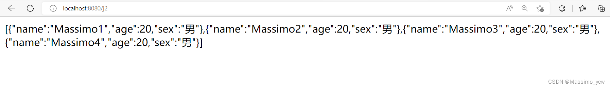
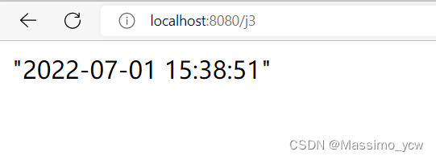
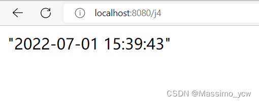

# 引言

> Jackson和FastJSON都是Java的序列化/反序列化库，用于在Java对象和JSON数据之间进行互相转换。

springboot3 为了方便, 定义了如下两个注解

+ `@ResponseBody`注解用于指示方法返回的对象会被自动转换为JSON格式的数据。

+ `@RequestBody`注解用于指示方法接受的JSON格式数据会被自动转换为对象。

# JackSon和FastJSON差异对比

 **fastjson**

fastjson 由阿里团队开发，是目前最快的Java 实现的 json 库。 fastjson 的 API 非常简洁，并且支持一定程度的定制（例如，注解@JSONField、枚举Feature等定制序列化）。被人诟病的，可能是 fastjson 的 bug 比较多。

**jackson2**

jackson 由 fasterxml 组织开发，相比 fastjson，有着更强大的功能、更高的稳定性、更好的扩展性、更丰富的定制支持。

使用 jackson 需要注意，ObjectMapper对象是线程安全的，可以重复使用。

+ Spring 默认使用的 json 解析工具就是 jackson

+ SpringBoot默认的JSON解析方案

  ```
  所有的 JSON 生成都离不开相关的 HttpMessageConverter。
  SpringMVC 自动配置了 Jackson 和 Gson 的 HttpMessageConverter，Spring Boot中又对此做了自动化配置，下面是两者对应源码的路径：
  org.springframework.boot.autoconfigure.http.JacksonHttpMessageConvertersConfiguration
  org.springframework.boot.autoconfigure.http.GsonHttpMessageConvertersConfiguration
  所以，如果用户使用 jackson 和 gson 的话，没有其他额外配置，则只需要添加依赖即可。
  简单来说直接使用
     `@ResponseBody`注解用于指示方法返回的对象会被自动转换为JSON格式的数据。
     `@RequestBody`注解用于指示方法接受的JSON格式数据会被自动转换为对象。
  ```

# Jackson

```xml
<!-- https://mvnrepository.com/artifact/com.fasterxml.jackson.core/jackson-databind -->
<dependency>
    <groupId>com.fasterxml.jackson.core</groupId>
    <artifactId>jackson-databind</artifactId>
    <version>2.13.3</version>
</dependency>
```


## SpringMVC中使用

###  集合测试

```java
@RequestMapping("/j2")
    @ResponseBody
    public String json2() throws JsonProcessingException {
        ObjectMapper mapper = new ObjectMapper();
        List<User> userList = new ArrayList<User>();

        User user1 = new User("Massimo1", 20, "男");
        User user2 = new User("Massimo2", 20, "男");
        User user3 = new User("Massimo3", 20, "男");
        User user4 = new User("Massimo4", 20, "男");

        userList.add(user1);
        userList.add(user2);
        userList.add(user3);
        userList.add(user4);

        String str = mapper.writeValueAsString(userList);
        return str;
    }
```

***效果：***


### 时间测试一

```java
 @RequestMapping("/j3")
    @ResponseBody
    public String json3() throws JsonProcessingException {
        ObjectMapper mapper = new ObjectMapper();
        Date date = new Date();
        //自定义日期的格式
        SimpleDateFormat sdf = new SimpleDateFormat("yyyy-MM-dd HH:mm:ss");
        //ObjectMapper,时间解析后的默认格式为：Timestamp，时间戳
        return mapper.writeValueAsString(sdf.format(date));
    }
```

***效果：***


### 时间测试二

```java
@RequestMapping("/j4")
    @ResponseBody
    public String json4() throws JsonProcessingException {
        ObjectMapper mapper = new ObjectMapper();
        //不使用时间戳的方式
        mapper.configure(SerializationFeature.WRITE_DATES_AS_TIMESTAMPS,false);
        //自定义日期的格式
        SimpleDateFormat sdf = new SimpleDateFormat("yyyy-MM-dd HH:mm:ss");
        mapper.setDateFormat(sdf);
        Date date = new Date();
        //ObjectMapper,时间解析后的默认格式为：Timestamp，时间戳
        return mapper.writeValueAsString(date);
    }
```

***效果：***


### 封装工具类

```java
package com.massimo.utils;

import com.fasterxml.jackson.core.JsonProcessingException;
import com.fasterxml.jackson.databind.ObjectMapper;
import com.fasterxml.jackson.databind.SerializationFeature;

import java.text.SimpleDateFormat;

public class JsonUtils {
    
    public static String getJson(Object object){
        return getJson(object,"yyyy-MM-dd HH:mm:ss");
    }
    
    public static String getJson(Object object,String dateFormat){
        ObjectMapper mapper = new ObjectMapper();
        mapper.configure(SerializationFeature.WRITE_DATES_AS_TIMESTAMPS,false);
        SimpleDateFormat sdf = new SimpleDateFormat(dateFormat);
        mapper.setDateFormat(sdf);

        try {
            return mapper.writeValueAsString(object);
        } catch (JsonProcessingException e) {
            e.printStackTrace();
        }
        return null;
    }
}
```

# fastjson2

[fastjson2 介绍及使用](https://blog.csdn.net/qq_33697094/article/details/128114939)

## 一、导入fastjson2依赖

```xml
<dependency>
    <groupId>com.alibaba.fastjson2</groupId>
    <artifactId>fastjson2</artifactId>
    <version>2.0.26</version>
</dependency>
```

```java
// 从redis查询token
Object obj = redisTemplate.opsForValue().get(token);  //  <!-- redis -->

// 反序列化 json对象反序列化成user对象
XUser user = JSON.parseObject(JSON.toJSONString(obj), XUser.class);
```

## 二、json对象与json数组的创建

### json对象创建

```java
        JSONObject info = new JSONObject();
        info.put("name", "张三");
        info.put("age", "18");
        info.put("地理", "70");
        info.put("英语", "60");
```

### json数组创建

```java
		JSONObject info1 = new JSONObject();
        info1.put("name", "张三");
        info1.put("age", "18");
        JSONObject info2 = new JSONObject();
        info2.put("name", "李四");
        info2.put("age", "19");

        //把上面创建的两个json对象加入到json数组里
        JSONArray array = new JSONArray();
        array.add(info1);
        array.add(info2);

        JSONArray array = new JSONArray();
        array.add("1班");
        array.add("2班");
        array.add("3班");
```

## 三、json对象取值与json数组遍历取值

### json对象取值

```java
        JSONArray array = new JSONArray();
        array.add("1班");
        array.add("2班");
        array.add("3班");
        JSONObject school = new JSONObject();
        school.put("schoolName", "第一中学");
        school.put("teacher", "刘梅");

        JSONObject info = new JSONObject();
        info.put("name", "张三");
        info.put("age", "18");
        info.put("gradle",array);
        info.put("schoolInfo",school);

        //从info中取值
        System.out.println(info.getString("name")); //张三
        System.out.println(info.getIntValue("age"));//18
        System.out.println(info.getJSONArray("gradle"));//["1班","2班","3班"]
        System.out.println(info.getJSONObject("schoolInfo"));//{"schoolName":"第一中学","teacher":"刘梅"}
```

### json数组遍历取值

```java
        JSONObject info1 = new JSONObject();
        info1.put("name", "张三");
        info1.put("age", "18");
        JSONObject info2 = new JSONObject();
        info2.put("name", "李四");
        info2.put("age", "19");

        JSONArray array = new JSONArray();
        array.add(info1);
        array.add(info2);
        //遍历获取json数组中对象的值
        for (int i = 0; i < array.size(); i++) {
            JSONObject json = array.getJSONObject(i);
            System.out.println(json.getString("name"));
            System.out.println(json.getString("age"));
        }
```

## 四、json对象与字符串的转换

### json对象与字符串的转换

```java
		JSONObject info = new JSONObject();
        info.put("name", "张三");
        info.put("age", "18");
        info.put("地理", "70");
        info.put("英语", "60");

        //JSON对象转字符串
        String str = JSON.toJSONString(info);
        //JSON字符串转JSON对象
        JSONObject json = JSONObject.parseObject(str);
```

### json字符串的字节数组转json对象

```java
        String str = "{\"name\":\"张三\",\"age\":\"18\",\"地理\":\"70\",\"英语\":\"60\"}";

        byte[] bytes = str.getBytes();
        JSONObject data = JSON.parseObject(bytes);
```

## 五、json数组与字符串的转换

```java
        String text = "[\"张三\",\"李四\",\"王五\"]";
        //json字符串转json数组
        JSONArray data = JSON.parseArray(text);
        //json数组转json字符串
        String str = JSONArray.toJSONString(data);
12345
```

## 六、json字符串转java对象的转换

Student类如下：

```java
@Data
public class Student {
    public String name;
    public int age;
}
```

### json字符串转java对象的转换:crossed_swords:

```java
Student student = new Student("张三", 18);

//Student对象转JSON字符串
String studentStr = JSON.toJSONString(student);
//JSON字符串转Student对象
Student data = JSON.parseObject(studentStr, Student.class);
```

### java对象转byte数组转换

```java
Student student = new Student("张三", 18);

//Student对象转字节数组
byte[] text = JSON.toJSONBytes(student);
//字节数组转Student对象
Student data = JSON.parseObject(text, Student.class);
```

## 七、json字符串与Map转换

### json字符串转Map

```java
        String str="{\n" +
                "\"gradle\":\"高一\",\n" +
                "\"number\":\"2\",\n" +
                "\"people\":[{\"name\":\"张三\",\"age\":\"15\",\"phone\":\"123456\"},\n" +
                "         {\"name\":\"李四\",\"age\":\"16\",\"phone\":\"78945\"}]\n" +
                "}";

        //json字符串转Map
        Map<String, Object> map = JSONObject.parseObject(str, new TypeReference<Map<String, Object>>() {});
        System.out.println(map.get("gradle").toString());
        System.out.println(map.get("number").toString());
        System.out.println(map.get("people").toString());
```

### Map转json字符串

(注意：如果直接使用JSON.toJSONString(map)转换，因为"测试1"的值为null，转换的结果就会是 {“测试2”:“hello”})

```java
		Map<String,String> map=new HashMap<>();
        map.put("测试1",null);
        map.put("测试2","hello");

		//{"测试2":"hello","测试1":null}
        String str = JSON.toJSONString(map, JSONWriter.Feature.WriteMapNullValue);
```

如果你使用的是老的fastjson1,可以像下面这样转换：

```java
		Map<String,String> map=new HashMap<>();
		map.put("测试1",null);
		map.put("测试2","hello");
		String str = JSON.toJSONString(map, SerializerFeature.WriteMapNullValue) ;
```

## 八、json数组转List

```java
        String str="{\n" +
                "\"gradle\":\"高一\",\n" +
                "\"number\":\"2\",\n" +
                "\"people\":[{\"name\":\"张三\",\"age\":\"15\",\"phone\":\"123456\"},\n" +
                "         {\"name\":\"李四\",\"age\":\"16\",\"phone\":\"78945\"}]\n" +
                "}";

        JSONObject strJson = JSONObject.parseObject(str);
        //获取people数组
        JSONArray people = strJson.getJSONArray("people");
        //json数组转List
        List<Map> list = people.toJavaList(Map.class);

12345678910111213
```

如果你使用的是老的fastjson1,可以像下面这样转换：

```java
        String str="{\n" +
                "\"gradle\":\"高一\",\n" +
                "\"number\":\"2\",\n" +
                "\"people\":[{\"name\":\"张三\",\"age\":\"15\",\"phone\":\"123456\"},\n" +
                "         {\"name\":\"李四\",\"age\":\"16\",\"phone\":\"78945\"}]\n" +
                "}";

        JSONObject strJson=JSONObject.parseObject(str);//字符串转json对象
        String people = String.valueOf(strJson.getJSONArray("people"));
        List<Map<String,String>> list = (List<Map<String,String>>) JSONArray.parse(people);
12345678910
```

## 九、json[字符串格式化](https://so.csdn.net/so/search?q=字符串格式化&spm=1001.2101.3001.7020)

有时候我们想把 json 字符串格式化输出，也就是该缩进的缩进该换行的换行，让它更美观的输出，可以像下面这样：

```java
        String str = "[{\"isSendPhone\":\"true\",\"id\":\"22258352\",\"phoneMessgge\":\"为避免影响您的正常使用请及时续费，若已续费请忽略此信息。\",\"readsendtime\":\"9\",\"countdown\":\"7\",\"count\":\"5\",\"serviceName\":\"流程助手\",\"startdate\":\"2022-02-09 00:00:00.0\",\"insertTime\":\"2023-02-02 07:00:38.0\",\"enddate\":\"2023-02-08 23:59:59.0\",\"emailMessage\":\"为避免影响您的正常使用请及时续费，若已续费请忽略此信息。\",\"phone\":\"\",\"companyname\":\"顾问有限责任公司\",\"serviceId\":\"21\",\"isSendeMail\":\"true\",\"email\":\"\"},{\"isSendPhone\":\"true\",\"eid\":\"7682130\",\"phoneMessgge\":\"为避免影响您的正常使用请及时续费，若已续费请忽略此信息。\",\"readsendtime\":\"9\",\"countdown\":\"15\",\"count\":\"50\",\"serviceName\":\"经理人自助服务\",\"startdate\":\"2022-02-17 00:00:00.0\",\"insertTime\":\"2023-02-02 07:00:38.0\",\"enddate\":\"2023-02-16 23:59:59.0\",\"emailMessage\":\"为避免影响您的正常使用请及时续费，若已续费请忽略此信息。\",\"phone\":\"\",\"companyname\":\"生物科技股份有限公司\",\"serviceId\":\"2\",\"isSendeMail\":\"true\",\"email\":\"\"}]";
        
        str =  str.trim();
        String formatStr = null;
        if (str.startsWith("[")) {
            JSONArray data = JSON.parseArray(str);
            formatStr = JSONArray.toJSONString(data, JSONWriter.Feature.PrettyFormat, JSONWriter.Feature.WriteMapNullValue, JSONWriter.Feature.WriteNullListAsEmpty);
        } else {
            JSONObject strJson = JSONObject.parseObject(str);
            formatStr = JSON.toJSONString(strJson, JSONWriter.Feature.PrettyFormat, JSONWriter.Feature.WriteMapNullValue, JSONWriter.Feature.WriteNullListAsEmpty);
        }
        System.out.println(formatStr);
```

输出结果：

```java
[
	{
		"isSendPhone":"true",
		"id":"22258352",
		"phoneMessgge":"为避免影响您的正常使用请及时续费，若已续费请忽略此信息。",
		"readsendtime":"9",
		"countdown":"7",
		"count":"5",
		"serviceName":"流程助手",
		"startdate":"2022-02-09 00:00:00.0",
		"insertTime":"2023-02-02 07:00:38.0",
		"enddate":"2023-02-08 23:59:59.0",
		"emailMessage":"为避免影响您的正常使用请及时续费，若已续费请忽略此信息。",
		"phone":"",
		"companyname":"XX顾问有限责任公司",
		"serviceId":"21",
		"isSendeMail":"true",
		"email":""
	},
	{
		"isSendPhone":"true",
		"eid":"7682130",
		"phoneMessgge":"为避免影响您的正常使用请及时续费，若已续费请忽略此信息。",
		"readsendtime":"9",
		"countdown":"15",
		"count":"50",
		"serviceName":"经理人自助服务",
		"startdate":"2022-02-17 00:00:00.0",
		"insertTime":"2023-02-02 07:00:38.0",
		"enddate":"2023-02-16 23:59:59.0",
		"emailMessage":"为避免影响您的正常使用请及时续费，若已续费请忽略此信息。",
		"phone":"",
		"companyname":"XX科技股份有限公司",
		"serviceId":"2",
		"isSendeMail":"true",
		"email":""
	}
]
```


```
{
    "me": {
        "avatar_url": "https://gw.alipayobjects.com/zos/rmsportal/ApEnVmpRbThmwJJukDlb.jpeg",
        "avatar": "https://gw.alipayobjects.com/zos/rmsportal/ApEnVmpRbThmwJJukDlb.jpeg",
        "language": "zh-cn",
        "is_admin": false,
        "is_uirobot": false
    },
    "notification": {},
    "settings": {
        "allowed_link_schema": [
            "dingtalk:"
        ],
        "enable_link_interception": true,
        "enable_new_user_public_ability_forbid": true,
        "user_registry_forbidden_level": "",
        "watermark_enable": "",
        "public_space_doc_search_enable": true,
        "lake_enabled_groups": "*",
        "image_proxy_root": "",
        "max_import_task_count": 1,
        "enable_search": true,
        "enable_serviceworker": true,
        "enable_lazyload_card": "codeblock",
        "editor_canary": {
            "card_lazy_init": 100,
            "retryOriginImage": 100
        },
        "enable_attachment_multipart": true,
        "enable_custom_video_player": true,
        "conference_gift_num": 0,
        "intranet_safe_tip": [
            "open"
        ],
        "publication_enable_whitelist": [],
        "foreign_phone_registry_enabled_organization_whitelist": [
            "16014876",
            "16022684",
            "16052442",
            "18041640",
            "1437",
            "1565",
            "1796",
            "2838",
            "16052442",
            "309",
            "22614",
            "1780",
            "6001397",
            "14481",
            "14040138",
            "16052442",
            "14043106",
            "14006688",
            "16033469",
            "18044074",
            "11321",
            "2008",
            "35721",
            "6001216",
            "806",
            "18041640",
            "18100055",
            "16014876",
            "16022684",
            "20013926"
        ],
        "disabled_login_modal_pop_default": true,
        "enable_open_in_mobile_app": true,
        "enable_wechat_guide_qrcode": true,
        "enable_issue": true,
        "enable_blank_page_detect": true,
        "zone_ant_auth_keepalive_enabled_domains": [],
        "enable_new_group_page_whitelist": [],
        "enable_web_ocr": {
            "enable": true,
            "enableBrowsers": [
                "chrome"
            ],
            "_users": [
                106822
            ],
            "percent": 100
        },
        "customer_staff_dingtalk_id": "",
        "enable_desktop_force_local": true,
        "side_third_app_config": {},
        "desktop_check_network_status_interval": 30,
        "review_assistant_provider_url": "",
        "debug_assistant_provider_url": "",
        "codefuse_assistant_provider_url": "",
        "user_certifications_share_whitelist": [
            "352135",
            "39191355",
            "95294",
            "13012852",
            "39187844",
            "39195365",
            "22303185",
            "39199571",
            "39200198"
        ],
        "user_certifications_share_scale": 10,
        "support_extension_download_url": true,
        "user_communication_group_qrcode": "https://mdn.alipayobjects.com/huamei_0prmtq/afts/img/A*5CiSRraBRL0AAAAAAAAAAAAADvuFAQ/original"
    },
    "env": "prod",
    "space": {
        "id": 0,
        "login": "",
        "name": "语雀",
        "short_name": null,
        "status": 0,
        "account_id": 0,
        "logo": null,
        "description": "",
        "created_at": null,
        "updated_at": null,
        "host": "https://www.yuque.com",
        "displayName": "语雀",
        "logo_url": "https://cdn.nlark.com/yuque/0/2022/png/303152/1665994257081-avatar/dcb74862-1409-4691-b9ce-8173b4f6e037.png",
        "enable_password": true,
        "enable_watermark": false,
        "_serializer": "web.space"
    },
    "isYuque": true,
    "isPublicCloud": true,
    "isEnterprise": false,
    "isUseAntLogin": false,
    "defaultSpaceHost": "https://www.yuque.com",
    "timestamp": 1700027795009,
    "traceId": "ac136c6317000277948812181129",
    "siteName": "语雀",
    "siteTip": null,
    "activityTip": null,
    "topTip": null,
    "readTip": {},
    "questionRecommend": null,
    "dashboardBannerRecommend": null,
    "imageServiceDomains": [
        "cdn.yuque.com",
        "cdn.nlark.com",
        "img.shields.io",
        "travis-ci.org",
        "api.travis-ci.org",
        "npm.packagequality.com",
        "snyk.io",
        "coveralls.io",
        "badgen.now.sh",
        "badgen.net",
        "packagephobia.now.sh",
        "duing.alibaba-inc.com",
        "npm.alibaba-inc.com",
        "web.npm.alibaba-inc.com",
        "npmjs.com",
        "npmjs.org",
        "npg.dockerlab.alipay.net",
        "private-alipayobjects.alipay.com",
        "googleusercontent.com",
        "blogspot.com",
        "cdn.hk01.com",
        "camo.githubusercontent.com",
        "gw.daily.taobaocdn.net",
        "cdn-images-1.medium.com",
        "medium.com",
        "i.stack.imgur.com",
        "imgur.com",
        "doc.ucweb.local",
        "lh6.googleusercontent.com",
        "4.bp.blogspot.com",
        "bp.blogspot.com",
        "blogspot.com",
        "1.bp.blogspot.com",
        "2.bp.blogspot.com",
        "3.bp.blogspot.com",
        "aliwork-files.oss-accelerate.aliyuncs.com",
        "oss-accelerate.aliyuncs.com",
        "work.alibaba.net",
        "work.alibaba-inc.com",
        "work-file.alibaba.net",
        "work-file.alibaba-inc.com",
        "pre-work-file.alibaba-inc.com",
        "yuque.antfin.com",
        "yuque.antfin-inc.com",
        "intranetproxy.alipay.com",
        "lark-assets-prod-aliyun.oss-accelerate.aliyuncs.com",
        "lh1.googleusercontent.com",
        "lh2.googleusercontent.com",
        "lh3.googleusercontent.com",
        "lh4.googleusercontent.com",
        "lh5.googleusercontent.com",
        "lh6.googleusercontent.com",
        "lh7.googleusercontent.com",
        "lh8.googleusercontent.com",
        "lh9.googleusercontent.com",
        "raw.githubusercontent.com",
        "github.com",
        "en.wikipedia.org",
        "rawcdn.githack.com",
        "pre-work-file.alibaba-inc.com",
        "alipay-rmsdeploy-image.cn-hangzhou.alipay.aliyun-inc.com",
        "antsys-align-files-management.cn-hangzhou.alipay.aliyun-inc.com",
        "baiyan-pre.antfin.com",
        "baiyan.antfin.com",
        "baiyan.dev.alipay.net",
        "marketing.aliyun-inc.com",
        "lark-temp.oss-cn-hangzhou.aliyuncs.com",
        "www.yuque.com",
        "yuque.com",
        "cdn.nlark.com"
    ],
    "sharePlatforms": [
        "wechat",
        "dingtalk"
    ],
    "locale": "zh-cn",
    "matchCondition": {
        "fileType": "Doc",
        "useTileRendering": true,
        "useEditorTileRendering": true,
        "useEditorTileRenderingForOT": true,
        "useEditorVirtualRenderingForOT": false,
        "useEditorDelayTileChange": true,
        "useEditorVirtualRendering": false
    },
    "empInfo": {},
    "enableSideThirdApp": false,
    "customTracertConfig": {
        "spmBPos": "doc_read"
    },
    "group": {
        "id": 26269664,
        "type": "User",
        "login": "aceld",
        "name": "刘丹冰Aceld",
        "description": "https://github.com/aceld",
        "avatar": "https://cdn.nlark.com/yuque/0/2022/png/26269664/1651594557072-avatar/c20a2fdd-3126-4dea-b477-0866022d648a.png",
        "avatar_url": "https://cdn.nlark.com/yuque/0/2022/png/26269664/1651594557072-avatar/c20a2fdd-3126-4dea-b477-0866022d648a.png",
        "owner_id": null,
        "books_count": 15,
        "public_books_count": 11,
        "topics_count": 0,
        "public_topics_count": 0,
        "members_count": 0,
        "abilities": {
            "create_book": false,
            "create_member": false,
            "destroy": false,
            "read": true,
            "read_private": false,
            "update": false,
            "manage": false,
            "restore": false,
            "read_tag": false
        },
        "settings": null,
        "public": 1,
        "extend_private": 0,
        "scene": null,
        "created_at": "2022-02-24T03:52:25.000Z",
        "updated_at": "2023-11-14T13:42:46.000Z",
        "expired_at": "2024-09-24T15:59:59.000Z",
        "deleted_at": null,
        "organization_id": 0,
        "isPaid": true,
        "member_level": 1,
        "memberLevelName": "专业会员",
        "hasMemberLevel": true,
        "isTopLevel": false,
        "grains_sum": 15340,
        "status": 1,
        "source": "index",
        "zone_id": 0,
        "isPermanentPunished": false,
        "isWiki": false,
        "isPublicPage": false,
        "organization": null,
        "owners": null,
        "_serializer": "web.group"
    },
    "book": {
        "id": 26950668,
        "type": "Book",
        "slug": "mo95lb",
        "name": "8小时转职Golang工程师",
        "toc": [
            {
                "type": "DOC",
                "title": "8小时转职Golang工程师",
                "uuid": "GZZu-Lrlbv0Ig3tk",
                "url": "dsk886",
                "prev_uuid": "",
                "sibling_uuid": "rBPgqqPG8K-9cjcw",
                "child_uuid": "",
                "parent_uuid": "",
                "doc_id": 74372830,
                "level": 0,
                "id": 74372830,
                "open_window": 1,
                "visible": 1
            },
            {
                "type": "DOC",
                "title": "一、引言",
                "uuid": "rBPgqqPG8K-9cjcw",
                "url": "zwukev",
                "prev_uuid": "GZZu-Lrlbv0Ig3tk",
                "sibling_uuid": "xp3xOn_vIq2YocE3",
                "child_uuid": "",
                "parent_uuid": "",
                "doc_id": 74374885,
                "level": 0,
                "id": 74374885,
                "open_window": 1,
                "visible": 1
            },
            {
                "type": "DOC",
                "title": "二、Golang开发环境",
                "uuid": "xp3xOn_vIq2YocE3",
                "url": "haizwm",
                "prev_uuid": "rBPgqqPG8K-9cjcw",
                "sibling_uuid": "eCDGTOv8KvDNEUP8",
                "child_uuid": "",
                "parent_uuid": "",
                "doc_id": 74377607,
                "level": 0,
                "id": 74377607,
                "open_window": 1,
                "visible": 1
            },
            {
                "type": "DOC",
                "title": "三、Golang语言特性",
                "uuid": "eCDGTOv8KvDNEUP8",
                "url": "xk0fqo",
                "prev_uuid": "xp3xOn_vIq2YocE3",
                "sibling_uuid": "SZxxnlq-DGqt6ojH",
                "child_uuid": "",
                "parent_uuid": "",
                "doc_id": 74378532,
                "level": 0,
                "id": 74378532,
                "open_window": 1,
                "visible": 1
            },
            {
                "type": "DOC",
                "title": "四、Golang语法新奇",
                "uuid": "SZxxnlq-DGqt6ojH",
                "url": "ye2kii",
                "prev_uuid": "eCDGTOv8KvDNEUP8",
                "sibling_uuid": "L8l44hSlXdJh_N9Y",
                "child_uuid": "ELFbbcnHwqayR3mB",
                "parent_uuid": "",
                "doc_id": 74379206,
                "level": 0,
                "id": 74379206,
                "open_window": 1,
                "visible": 1
            },
            {
                "type": "DOC",
                "title": "1、从一个main函数初见golang语法",
                "uuid": "ELFbbcnHwqayR3mB",
                "url": "pz6nag",
                "prev_uuid": "SZxxnlq-DGqt6ojH",
                "sibling_uuid": "FCiomMp3QXm0T4rI",
                "child_uuid": "",
                "parent_uuid": "SZxxnlq-DGqt6ojH",
                "doc_id": 74379267,
                "level": 1,
                "id": 74379267,
                "open_window": 1,
                "visible": 1
            },
            {
                "type": "DOC",
                "title": "2、变量的声明",
                "uuid": "FCiomMp3QXm0T4rI",
                "url": "mayg6h",
                "prev_uuid": "ELFbbcnHwqayR3mB",
                "sibling_uuid": "ttrS5CUQ0kILJPUH",
                "child_uuid": "",
                "parent_uuid": "SZxxnlq-DGqt6ojH",
                "doc_id": 74465041,
                "level": 1,
                "id": 74465041,
                "open_window": 1,
                "visible": 1
            },
            {
                "type": "DOC",
                "title": "3、常量",
                "uuid": "ttrS5CUQ0kILJPUH",
                "url": "acsgdr",
                "prev_uuid": "FCiomMp3QXm0T4rI",
                "sibling_uuid": "j7QRBe2kuUJUZjEI",
                "child_uuid": "",
                "parent_uuid": "SZxxnlq-DGqt6ojH",
                "doc_id": 74465186,
                "level": 1,
                "id": 74465186,
                "open_window": 1,
                "visible": 1
            },
            {
                "type": "DOC",
                "title": "4、函数",
                "uuid": "j7QRBe2kuUJUZjEI",
                "url": "kk9cvo",
                "prev_uuid": "ttrS5CUQ0kILJPUH",
                "sibling_uuid": "a9A1C01ErDjuybHU",
                "child_uuid": "",
                "parent_uuid": "SZxxnlq-DGqt6ojH",
                "doc_id": 74465350,
                "level": 1,
                "id": 74465350,
                "open_window": 1,
                "visible": 1
            },
            {
                "type": "DOC",
                "title": "5、defer",
                "uuid": "a9A1C01ErDjuybHU",
                "url": "zz7w9r",
                "prev_uuid": "j7QRBe2kuUJUZjEI",
                "sibling_uuid": "6PzhCBcD76hl3zew",
                "child_uuid": "",
                "parent_uuid": "SZxxnlq-DGqt6ojH",
                "doc_id": 74466057,
                "level": 1,
                "id": 74466057,
                "open_window": 1,
                "visible": 1
            },
            {
                "type": "DOC",
                "title": "6、slice和map",
                "uuid": "6PzhCBcD76hl3zew",
                "url": "ovmzgh",
                "prev_uuid": "a9A1C01ErDjuybHU",
                "sibling_uuid": "fOry1ZHGnKd6aTz4",
                "child_uuid": "",
                "parent_uuid": "SZxxnlq-DGqt6ojH",
                "doc_id": 74466087,
                "level": 1,
                "id": 74466087,
                "open_window": 1,
                "visible": 1
            },
            {
                "type": "DOC",
                "title": "7、面向对象特征",
                "uuid": "fOry1ZHGnKd6aTz4",
                "url": "aoxo9v",
                "prev_uuid": "6PzhCBcD76hl3zew",
                "sibling_uuid": "ZxREAqbz152Iz6_X",
                "child_uuid": "",
                "parent_uuid": "SZxxnlq-DGqt6ojH",
                "doc_id": 74466563,
                "level": 1,
                "id": 74466563,
                "open_window": 1,
                "visible": 1
            },
            {
                "type": "DOC",
                "title": "8、interface与类型断言",
                "uuid": "ZxREAqbz152Iz6_X",
                "url": "frv2c9",
                "prev_uuid": "fOry1ZHGnKd6aTz4",
                "sibling_uuid": "lGAqtBM1qMNydg8X",
                "child_uuid": "",
                "parent_uuid": "SZxxnlq-DGqt6ojH",
                "doc_id": 74466779,
                "level": 1,
                "id": 74466779,
                "open_window": 1,
                "visible": 1
            },
            {
                "type": "DOC",
                "title": "9、反射reflect",
                "uuid": "lGAqtBM1qMNydg8X",
                "url": "cwur9v",
                "prev_uuid": "ZxREAqbz152Iz6_X",
                "sibling_uuid": "9eIEgt0rAWk5qR7d",
                "child_uuid": "",
                "parent_uuid": "SZxxnlq-DGqt6ojH",
                "doc_id": 74468558,
                "level": 1,
                "id": 74468558,
                "open_window": 1,
                "visible": 1
            },
            {
                "type": "DOC",
                "title": "10、结构体标签",
                "uuid": "9eIEgt0rAWk5qR7d",
                "url": "ybul6x",
                "prev_uuid": "lGAqtBM1qMNydg8X",
                "sibling_uuid": "",
                "child_uuid": "",
                "parent_uuid": "SZxxnlq-DGqt6ojH",
                "doc_id": 74591927,
                "level": 1,
                "id": 74591927,
                "open_window": 1,
                "visible": 1
            },
            {
                "type": "DOC",
                "title": "五、Golang高阶",
                "uuid": "L8l44hSlXdJh_N9Y",
                "url": "br98sg",
                "prev_uuid": "SZxxnlq-DGqt6ojH",
                "sibling_uuid": "vaeP1oQNZ1GK87NA",
                "child_uuid": "K-6lEis-5-X7fqNx",
                "parent_uuid": "",
                "doc_id": 74592160,
                "level": 0,
                "id": 74592160,
                "open_window": 1,
                "visible": 1
            },
            {
                "type": "DOC",
                "title": "4、Go Modules",
                "uuid": "K-6lEis-5-X7fqNx",
                "url": "ovib08",
                "prev_uuid": "L8l44hSlXdJh_N9Y",
                "sibling_uuid": "11ifpgM3MHZR3J6Y",
                "child_uuid": "",
                "parent_uuid": "L8l44hSlXdJh_N9Y",
                "doc_id": 74594438,
                "level": 1,
                "id": 74594438,
                "open_window": 1,
                "visible": 1
            },
            {
                "type": "DOC",
                "title": "1、goroutine",
                "uuid": "11ifpgM3MHZR3J6Y",
                "url": "vlnvyb",
                "prev_uuid": "K-6lEis-5-X7fqNx",
                "sibling_uuid": "q7Hc4JQmjrzU0Rqm",
                "child_uuid": "",
                "parent_uuid": "L8l44hSlXdJh_N9Y",
                "doc_id": 74592256,
                "level": 1,
                "id": 74592256,
                "open_window": 1,
                "visible": 1
            },
            {
                "type": "DOC",
                "title": "2、channel",
                "uuid": "q7Hc4JQmjrzU0Rqm",
                "url": "ir4ckz",
                "prev_uuid": "11ifpgM3MHZR3J6Y",
                "sibling_uuid": "0RSxuW0JgVWGAOAi",
                "child_uuid": "",
                "parent_uuid": "L8l44hSlXdJh_N9Y",
                "doc_id": 74592638,
                "level": 1,
                "id": 74592638,
                "open_window": 1,
                "visible": 1
            },
            {
                "type": "DOC",
                "title": "3、Select",
                "uuid": "0RSxuW0JgVWGAOAi",
                "url": "irl276",
                "prev_uuid": "q7Hc4JQmjrzU0Rqm",
                "sibling_uuid": "",
                "child_uuid": "",
                "parent_uuid": "L8l44hSlXdJh_N9Y",
                "doc_id": 74593989,
                "level": 1,
                "id": 74593989,
                "open_window": 1,
                "visible": 1
            },
            {
                "type": "DOC",
                "title": "六、案例-即时通信系统",
                "uuid": "vaeP1oQNZ1GK87NA",
                "url": "ks1lr9",
                "prev_uuid": "L8l44hSlXdJh_N9Y",
                "sibling_uuid": "",
                "child_uuid": "",
                "parent_uuid": "",
                "doc_id": 74594942,
                "level": 0,
                "id": 74594942,
                "open_window": 1,
                "visible": 1
            }
        ],
        "toc_updated_at": "2022-04-22T06:05:32.000Z",
        "description": "本书偏入门级，主要是针对后端想快速低成本掌握golang开发人群学习，如您已经掌握golang请绕行。",
        "creator_id": 26269664,
        "menu_type": 0,
        "items_count": 21,
        "likes_count": 0,
        "watches_count": 49,
        "user_id": 26269664,
        "abilities": {
            "create": false,
            "update": false,
            "destroy": false,
            "create_doc": false,
            "update_toc": false,
            "read": true,
            "read_private": false,
            "export": false,
            "export_doc": false,
            "manage": false,
            "join": true,
            "share": false,
            "modify_setting": false,
            "create_collaborator": false,
            "download": false
        },
        "public": 1,
        "extend_private": 0,
        "scene": null,
        "source": null,
        "created_at": "2022-04-20T14:58:19.000Z",
        "updated_at": "2023-08-24T15:00:48.000Z",
        "pinned_at": null,
        "archived_at": null,
        "layout": "Book",
        "doc_typography": "classic_all",
        "doc_viewport": "fixed",
        "announcement": null,
        "should_manually_create_uid": false,
        "catalog_tail_type": "UPDATED_AT",
        "catalog_display_level": 1,
        "book_icon": {
            "type": "url",
            "symbol": "group-type-department"
        },
        "cover": "https://cdn.nlark.com/assets/88660/png/cover_3.png",
        "comment_count": null,
        "organization_id": 0,
        "status": 0,
        "indexed_level": 1,
        "privacy_migrated": true,
        "collaboration_count": 1,
        "content_updated_at": "2023-08-24T15:00:47.836Z",
        "content_updated_at_ms": 1692889247836,
        "copyright_watermark": "",
        "enable_announcement": true,
        "enable_auto_publish": false,
        "enable_automation": false,
        "enable_comment": true,
        "enable_document_copy": true,
        "enable_export": true,
        "enable_search_engine": false,
        "enable_toc": true,
        "enable_trash": true,
        "enable_visitor_watermark": false,
        "enable_webhook": true,
        "image_copyright_watermark": "",
        "original": 0,
        "resource_size": 0,
        "user": null,
        "contributors": null,
        "_serializer": "web.book_detail"
    },
    "doc": {
        "id": 74466779,
        "space_id": 0,
        "type": "Doc",
        "sub_type": null,
        "title": "8、interface与类型断言",
        "tag": null,
        "slug": "frv2c9",
        "user_id": 26269664,
        "book_id": 26950668,
        "cover": null,
        "description": "Golang的语言中提供了断言的功能。golang中的所有程序都实现了interface{}的接口，这意味着，所有的类型如string,int,int64甚至是自定义的struct类型都就此拥有了interface{}的接口，这种做法和java中的Object类型比较类似。那么在一个数据通过f...",
        "custom_description": null,
        "body_asl": "",
        "format": "lake",
        "origin_format": "lake",
        "status": 1,
        "read_status": 1,
        "view_status": 0,
        "public": 1,
        "draft_version": 2,
        "comments_count": 0,
        "likes_count": 26,
        "abilities": {
            "destroy": false,
            "read": true,
            "update": false,
            "create_collaborator": false,
            "manage": false,
            "share": false
        },
        "content_updated_at": "2022-04-21T08:18:56.000Z",
        "created_at": "2022-04-21T08:18:31.000Z",
        "updated_at": "2023-09-05T16:12:14.000Z",
        "published_at": "2022-04-21T08:18:56.000Z",
        "first_published_at": "2022-04-21T08:18:56.182Z",
        "pinned_at": null,
        "word_count": 546,
        "selected_at": null,
        "editor_meta": "{\"codeblock\":8}",
        "editor_meta_draft": "{\"codeblock\":8}",
        "meta": {
            "privacy_migrated": true
        },
        "region": null,
        "indexed_level": 1,
        "privacy_migrated": true,
        "share_expired_time": null,
        "_serializer": "web.doc_detail"
    },
    "isDocCollaborator": false,
    "isCollaborationPage": false,
    "forbidLoginCard": false,
    "loginCardPV": 2000,
    "docUrl": "https://www.yuque.com/aceld/mo95lb/frv2c9",
    "search": {
        "display": true,
        "scope": "aceld/mo95lb"
    },
    "prefetch": "fetchReadDocData",
    "enableMobileAppRelease": false,
    "enableUserFeed": false,
    "groupMemberInfo": {
        "usage": {
            "attachment_size": 154978817,
            "image_size": 191931283,
            "video_size": 0,
            "attachment_size_month": 0,
            "image_size_month": 0,
            "video_size_month": 0,
            "max_upload_size": 10737418240,
            "_serializer": "web.user_usage_statistics"
        },
        "totalDocAndNoteUsageMonth": 0,
        "expired_at": "2024-09-24T15:59:59.000Z",
        "countDownDays": 314,
        "isAllowRenew": false,
        "receipt": null,
        "groupOwners": [],
        "hasOrder": true
    },
    "canUseAiWriting": false,
    "canUseAiLegal": false,
    "canUseAiReading": false,
    "aiWritingStreamType": [],
    "legalAnimationTime": 50,
    "canUseAiTestCase": false,
    "canUseAiOutline": false,
    "virtualRenderingGrey": false,
    "userSettings": {},
    "interest": {
        "interests": {
            "create_public_resource": true,
            "book_statistics": true,
            "book_security": true,
            "book_webhook": true,
            "open_ocr": true
        },
        "limits": {
            "0": {
                "max_resource_total_size": null,
                "max_resource_month_size": 1073741824,
                "max_book_number": 100,
                "max_doc_note_number": 100,
                "max_group_number": 10,
                "max_book_collaborator_number": 5,
                "max_doc_collaborator_number": 5,
                "max_single_file_size": 31457280,
                "max_single_image_size": 10485760,
                "max_single_video_size": 0
            },
            "1": {
                "max_resource_total_size": null,
                "max_resource_month_size": 10737418240,
                "max_book_number": null,
                "max_doc_note_number": null,
                "max_group_number": 10,
                "max_book_collaborator_number": 50,
                "max_doc_collaborator_number": 50,
                "max_single_file_size": 524288000,
                "max_single_image_size": 20971520,
                "max_single_video_size": 524288000
            },
            "2": {
                "max_resource_total_size": null,
                "max_resource_month_size": 53687091200,
                "max_book_number": null,
                "max_doc_note_number": null,
                "max_group_number": 10,
                "max_single_file_size": 2147483648,
                "max_single_image_size": 52428800,
                "max_single_video_size": 2147483648,
                "max_book_collaborator_number": 500,
                "max_doc_collaborator_number": 500
            }
        },
        "owner": {
            "id": 26269664,
            "type": "User",
            "member_level": 1,
            "isTopLevel": false,
            "isMemberTopLevel": false,
            "isPaid": true,
            "isExpired": false
        },
        "limit": {
            "max_resource_total_size": null,
            "max_resource_month_size": 10737418240,
            "max_book_number": null,
            "max_doc_note_number": null,
            "max_group_number": 10,
            "max_book_collaborator_number": 50,
            "max_doc_collaborator_number": 50,
            "max_single_file_size": 524288000,
            "max_single_image_size": 20971520,
            "max_single_video_size": 524288000
        }
    },
    "isRunAtRaw": false,
    "paymentInfo": {
        "paymentBizInstId": "Z69"
    },
    "login": {
        "loginType": "normal",
        "enablePlatforms": [
            "dingtalk",
            "alipay",
            "wechat",
            "teambition",
            "apple"
        ],
        "isWechatMobileApp": false
    },
    "enableCoverageDeploy": false,
    "isDesktopApp": false,
    "isOnlineDesktopApp": false,
    "isIsomorphicDesktopApp": false,
    "isAssistant": false,
    "isAlipayApp": false,
    "isDingTalkApp": false,
    "isDingTalkMiniApp": false,
    "isDingTalkDesktopApp": false,
    "isYuqueMobileApp": false,
    "tracertConfig": {
        "spmAPos": "a385",
        "spmBPos": "doc_read"
    }
}
```

## 十、Annotations(注解)

 **FastJSON 2.x 中支持使用 FastJSON 里面的注解**

```java
// jackson
@JsonSerialize(using = LocalDateTimeSerializer.class)
    @JsonDeserialize(using = LocalDateTimeDeserializer.class)

// 等价于 FastJSON 2.x  (可能报错)
  	@JSONField(serializeUsing = LocalDateTimeSerializer.class,
			deserializeUsing = LocalDateTimeDeserializer.class)
```

### 1. JSONField

JSONField是作用在Field、Method、Parameter上的Annotation，可以用来指定序列化字段的顺序、名字、格式、是否忽略、配置JSONReader/JSONWriter的Features等。

### 1.1 定制序列化和反序列化时的属性名

可以通过JSONField.name来配置序列化输出的字段名和反序列化是映射的字段名。

- 配置在public field上

  ```
  public class A {
      @JSONField(name = "ID")
      public int id;
   }
  ```

- 配置在public getter/setter method上

  ```
  public class A {
      private int id;
   
      @JSONField(name = "ID")
      public int getId() {return id;}
  
      @JSONField(name = "ID")
      public void setId(int value) {this.id = id;}
  }
  ```

### 1.2 配置字段输出和反序列化的格式

针对Date类型的字段，经常需要用定制的日期格式进行序列化和反序列化，可以通过JSONField.format来配置自定义日期格式。

```
public class VO {
      // 配置date序列化和反序列使用yyyyMMdd日期格式
      @JSONField(format = "yyyyMMdd")
      public Date date;
}
```

### 1.3 序列化/反序列化时忽略字段

可以通过JSONField.serialize配置该字段是否要序列化，通过JSONField.deserialize配置该字段是否需要反序列化。

- 配置序列化时忽略特定字段

  ```
  public class VO {
      @JSONField(serialize = false)
      public Date date;
  }
  ```

- 配置反序列化忽略特定字段

  ```
  public class VO {
      @JSONField(deserialize = false)
      public Date date;
  }
  ```

### 1.4 配置字段的序列化输出的的顺序

可以通过JSONField.ordinal来配置序列化时输出的顺序。

```
public static class VO {
      @JSONField(ordinal = 1)
      public String type;

      @JSONField(ordinal = 2)
      public String templateId;
}
```

### 1.5 配置序列化Features

可以通过JSONField.serializeFeatures来指定序列化的Feature。更多配置Features参考 https://alibaba.github.io/fastjson2/features_cn 。

```
import com.alibaba.fastjson2.JSON;
import com.alibaba.fastjson2.JSONWriter.Feature;
import org.junit.jupiter.api.Test;


@Test
public void test() {
    Bean bean = new Bean();
    bean.id = 100;

    assertEquals("{\"id\":\"100\"}", JSON.toJSONString(bean));
}

public static class Bean {
    @JSONField(serializeFeatures = Feature.WriteNonStringValueAsString)
    public int id;
}
```

### 1.6 通过JSONField(value = true)配置JavaBean序列化字段和反序列化构造方式

将@JSONField(value = true)配置在其中一个字段上，序列化时，会将对象序列化时按照该字段的值输出。将@JSONField(value = true)配置在构造函数参数上，而且该构造函数只有1个参数，就会按照这个参数来构造对象

比如：

```
public static class Bean2 {
    private final int code;

    public Bean2(@JSONField(value = true) int code) {
        this.code = code;
    }

    @JSONField (value = true)
    public int getCode() {
        return code;
    }
}

@Test
public void test2() {
    Bean2 bean = new Bean2(101);
    String str = JSON.toJSONString(bean);
    assertEquals("101", str);
    Bean2 bean1 = JSON.parseObject(str, Bean2.class);
    assertEquals(bean.code, bean1.code);
}
```

### 1.6 通过JSONField(value = true)配置Enum基于其中一个字段序列化和反序列化

将@JSONField(value = true)配置在enum字段上，序列化和序列化都会基于这个字段来进行，比如：

```
public enum Type {
    X(101, "Big"),
    M(102, "Medium"),
    S(103, "Small");

    private final int code;
    private final String name;

    Type(int code, String name) {
        this.code = code;
        this.name = name;
    }

    @JSONField(value = true)
    public int getCode() {
        return code;
    }

    public String getName() {
        return name;
    }
}

public class Bean1 {
    public Type type;
}

@Test
public void test1() {
    Bean1 bean = new Bean1();
    bean.type = Type.M;
    String str = JSON.toJSONString(bean);
    assertEquals("{\"type\":102}", str);
    Bean1 bean1 = JSON.parseObject(str, Bean1.class);
    assertEquals(bean.type, bean1.type);
}
```

### 2. @JSONType

JSONType是配置在类/接口上的注解，可以配置改类的所有字段的NamingStrategy、序列化和反序列化忽略的字段、JSONReader/JSONWriter的Features等。

| JSONType注解支持方法 | 简介                                                         |
| -------------------- | ------------------------------------------------------------ |
| ignores              | 序列化时忽略某些字段                                         |
| alphabetic           | 配置序列化时保持原生类字段顺序                               |
| serializeFeatures    | 配置序列化时`JSONWriter`的`Features`                         |
| deserializeFeatures  | 配置反序列化时`JSONReader`的`Features`                       |
| orders               | 配置序列化时的字段顺序                                       |
| naming               | 配置字段名的`NamingStrategy`,详细内容请参考`PropertyNamingStrategy`枚举类 |
| serializer           | 自定义序列化行为                                             |
| deserializer         | 自定义反序列化行为                                           |
| serializeFilters     | 通过自定义列化`Filters`控制序列化行为                        |

### 2.1 配置序列化和反序列化时忽略某些字段

在下面的例子中，序列化输出只包括id1，忽略id2和id3。

```
@JSONType(ignores = {"id2", "id3"})
public static class Bean {
    public int getId() {
        return 101;
    }

    public int getId2() {
        return 102;
    }

    public int getId3() {
        return 103;
    }
}
```

### 2.2 配置序列化时保持原生类字段顺序

从2.0.13版本开始，您可以通过`@JSONType(alphabetic = false)`配置序列化时保持原生类字段顺序。

```
@Slf4j
public class JSONTypeAlphabetic {

    @JSONType(alphabetic = false)
    public static class Bean {
        public int f3;
        public int f1;
        public int f2;
        public int f0;
    }

    @Test
    public void test() {
        Bean bean = new Bean();
        bean.f0 = 101;
        bean.f1 = 102;
        bean.f2 = 103;
        bean.f3 = 104;
        log.info(JSON.toJSONString(bean));
        //{"f3":104,"f1":102,"f2":103,"f0":101}
    }
}
```

### 2.3 配置序列化时的`JSONReader`/`JSONWriter`的`Features`

您可以通过`@JSONType(serializeFeatures= ...)`或`@JSONType(deserializeFeatures = ...)`注解配置序列化和反序列时`JSONWriter`/`JSONReader`的`Features`。

更多`Features`配置请参考 [features_cn.md](https://alibaba.github.io/fastjson2/features_cn.html) 。

```
@Slf4j
public class JSONTypeFeatures {

    // 反序列化时对字符串进行trim
    // 序列化时输出为null的字段
    @JSONType(deserializeFeatures = JSONReader.Feature.TrimString, serializeFeatures = JSONWriter.Feature.WriteNulls)
    public static class OrdersBean {
        public String filed1;
        public String filed2;
    }

    @Test
    public void test() {
        OrdersBean bean = new OrdersBean();
        bean.filed1 = "fastjson2";
        
        log.info(JSON.toJSONString(bean));
        //{"filed1":"fastjson2","filed2":null}
        String json="{\"filed1\":\"   fastjson2   \",\"filed2\":\"2\"}";
        
        OrdersBean bean2 = JSON.parseObject(json, OrdersBean.class);
        log.info(bean2.filed1);
        //fastjson2
    }
}
```

### 2.4 配置序列化时字段顺序

您可以通过`@JSONType(orders = {"filed1", "filed2"})`注解指定序列化时的字段顺序。

```
@Slf4j
public class JSONTypeOrders {

    @JSONType(orders = {"filed4", "filed3", "filed2", "filed1"})
    public static class OrdersBean {
        public String filed1;
        public String filed2;
        public String filed3;
        public String filed4;
  
    }

    @Test
    public void test() {
        OrdersBean bean = new OrdersBean();
        bean.filed1 = "1";
        bean.filed2 = "2";
        bean.filed3 = "3";
        bean.filed4 = "4";
        log.info(JSON.toJSONString(bean));
        //{"filed4":"4","filed3":"3","filed2":"2","filed1":"1"}
    }
}
```

### 3. 基于mixin机制注入Annotation

当你需要定制化序列化一些LIB里面的类，你无法修改这些类的代码，你可以使用FASTJSON2的Minxin功能注入Annotation。 具体使用介绍参考这里：https://alibaba.github.io/fastjson2/mixin_cn
