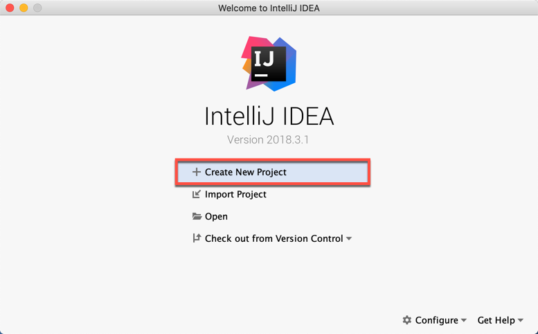
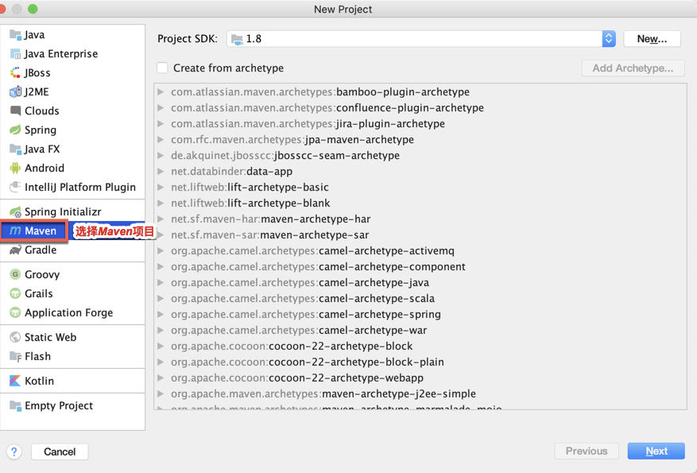
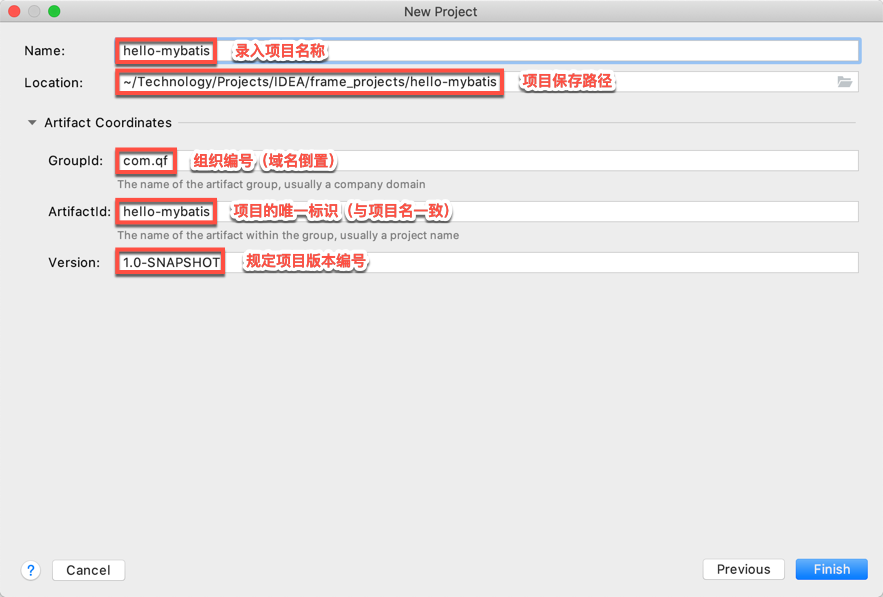
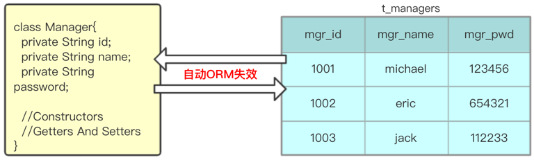
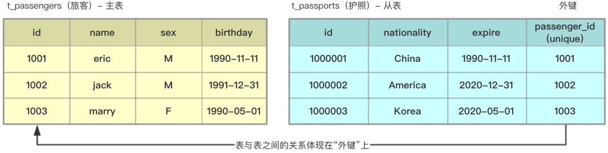
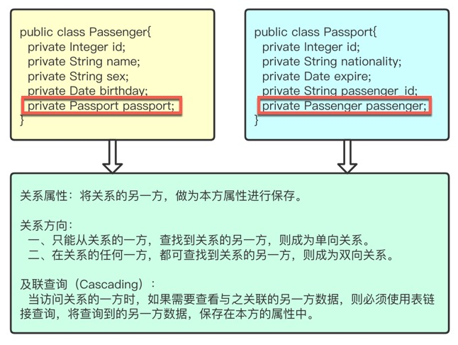
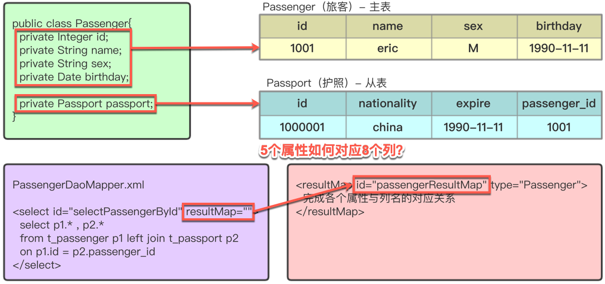
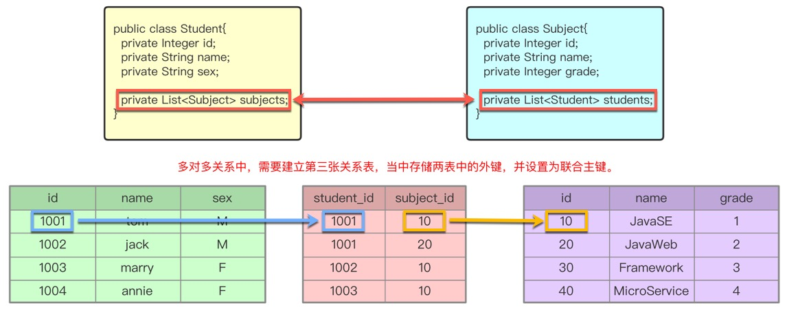
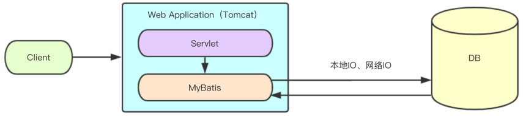
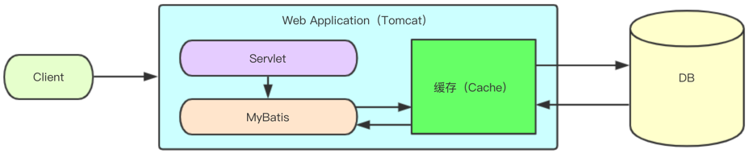

### 一、引言

------

#### 1.1 什么是框架？


软件的半成品，解决了软件开发过程当中的普适性问题，从而简化了开发步骤，提供了开发的效率。


#### 1.2 什么是ORM框架？


 

- ORM（Object Relational Mapping）对象关系映射，将程序中的一个对象与表中的一行数据一一对应。
- ORM框架提供了持久化类与表的映射关系，在运行时参照映射文件的信息，把对象持久化到数据库中`。

 


#### 1.3 使用JDBC完成ORM操作的缺点？


 

-  存在大量的冗余代码。 
-  手工创建 Connection、Statement 等。 
-  手工将结果集封装成实体对象。 
-  查询效率低，没有对数据访问进行过优化（Not Cache）。 

 


### 二、MyBatis框架

------

#### 2.1 概念


 

- MyBatis本是Apache软件基金会的一个开源项目iBatis, 2010年这个项目由apache software foundation 迁移到了Google Code，并且改名为MyBatis 。2013年11月迁移到Github。
- MyBatis是一个优秀的基于Java的持久层框架，支持自定义SQL，存储过程和高级映射。
- MyBatis对原有JDBC操作进行了封装，几乎消除了所有JDBC代码，使开发者只需关注 SQL 本身。
- MyBatis可以使用简单的XML或Annotation来配置执行SQL，并自动完成ORM操作，将执行结果返回。

 


#### 2.2 访问与下载


官方网站：http://www.mybatis.org/mybatis-3/

 

下载地址：https://github.com/mybatis/mybatis-3/releases/tag/mybatis-3.5.1


### 三、构建Maven项目

------

#### 3.1 新建项目

| 使用IDEA打开已创建的文件夹目录                               |
| ------------------------------------------------------------ |
|  |


#### 3.2 选择Maven目录

| 选择Maven项目                                                |
| ------------------------------------------------------------ |
|  |


#### 3.3 GAV坐标

| GAV坐标                                                      |
| ------------------------------------------------------------ |
|  |


### 四、MyBatis环境搭建【`重点`】

------

#### 4.1 pom.xml中引入MyBatis核心依赖


在pom.xml中引入相关依赖


```xml
<?xml version="1.0" encoding="UTF-8"?>

<project xmlns="http://maven.apache.org/POM/4.0.0" 	
         xmlns:xsi="http://www.w3.org/2001/XMLSchema-instance"
         xsi:schemaLocation=
         "http://maven.apache.org/POM/4.0.0 
          http://maven.apache.org/xsd/maven-4.0.0.xsd">
    
    <modelVersion>4.0.0</modelVersion>

    <!--项目配置-->
    <groupId>com.qf</groupId>
    <artifactId>hello-mybatis</artifactId>
    <version>1.0-SNAPSHOT</version>

    <!--依赖-->
    <dependencies>
        <!--MyBatis核心依赖-->
        <dependency>
            <groupId>org.mybatis</groupId>
            <artifactId>mybatis</artifactId>
            <version>3.4.6</version>
        </dependency>

        <!--MySql驱动依赖-->
        <dependency>
            <groupId>mysql</groupId>
            <artifactId>mysql-connector-java</artifactId>
            <version>5.1.47</version>
        </dependency>
	  </dependencies>
</project>
```


#### 4.2 创建MyBatis配置文件


创建并配置mybatis-config.xml


```xml
<?xml version="1.0" encoding="UTF-8" ?>
<!DOCTYPE configuration PUBLIC "-//mybatis.org//DTD Config 3.0//EN"
	"http://mybatis.org/dtd/mybatis-3-config.dtd">

<!--MyBatis配置-->
<configuration>
    <!--JDBC环境配置、选中默认环境-->
    <environments default="MySqlDB">
        <!--MySql数据库环境配置-->
        <environment id="MySqlDB">
            <!--事务管理-->
            <transactionManager type="JDBC"/>
            <!--连接池-->
            <dataSource type="org.apache.ibatis.datasource.pooled.PooledDataSourceFactory">
                <property name="driver" value="com.mysql.jdbc.Driver"/>
                <!-- &转义&amp; -->
                <property name="url" value="jdbc:mysql://localhost:3306/x?useUnicode=true&amp;characterEncoding=utf-8"/>
                <property name="username" value="xxx"/>
                <property name="password" value="xxx"/>
            </dataSource>
        </environment>
    </environments>

    <!--Mapper注册-->
    <mappers>
        <!--注册Mapper文件的所在位置-->
        <mapper resource="xxxMapper.xml"/>
    </mappers>
</configuration>
```


- `注意：mapper.xml默认建议存放在resources中,路径不能以/开头`


### 五、MyBatis开发步骤【`重点`】

------

#### 5.1 建表


```sql
create table t_users(
  id int primary key auto_increment,
  name varchar(50),
  password varchar(50),
  sex varchar(1),
  birthday datetime,
  registTime datetime
)default charset = utf8;
```


#### 5.2 定义实体类


定义所需CURD操作的实体类


```java
package com.qf.mybatis.part1.basic;

public class User {
    private Integer id;
    private String name;
    private String password;
    private String sex;
  	private Date birthday;
  	private Date registTime;

	//无参构造（必备构造二选一）
    public User() {}
    
    //全参构造（必备构造二选一）
    public User(Integer id, String name, String password, String sex, Date birthday, Date registTime) {
        this.id = id;
        this.name = name;
        this.password = password;
        this.sex = sex;
      	this.birthday = birthday;
      	this.registTime = registTime;
    }
    
    //Getters And Setters
}
```


#### 5.3 定义DAO接口


根据所需DAO定义接口、以及方法


```java
package com.qf.mybatis.part1.basic;

public interface UserDao {
    public User selectUserById(Integer id);
}
```


#### 5.4 编写Mapper.xml


在resources目录中创建Mapper.xml文件


```xml
<?xml version="1.0" encoding="UTF-8" ?>
<!DOCTYPE mapper PUBLIC "-//mybatis.org//DTD Mapper 3.0//EN"
	"http://mybatis.org/dtd/mybatis-3-mapper.dtd">

<!--namespace = 所需实现的接口全限定名-->
<mapper namespace="com.qf.mybatis.part1.basic.UserDao">
    <!--id = 所需重写的接口抽象方法，resultType = 查询后所需返回的对象类型-->
    <select id="selectUserById" resultType="com.qf.mybatis.part1.basic.User">
        <!--#{arg0} = 方法的第一个形参-->
      	SELECT * FROM t_users WHERE id = #{arg0}
    </select>
</mapper>
```


#### 5.5 注册Mapper


将Mapper.xml注册到mybatis-config.xml中


```xml
<!--Mapper文件注册位置-->
<mappers>
    <!--注册Mapper文件-->
    <mapper resource="UserDaoMapper.xml"/>
</mappers>
```


#### 5.6 测试一


MyBatis的API操作方式


```java
package com.qf.mybatis.part1.basic;

import org.apache.ibatis.io.Resources;
import org.apache.ibatis.session.SqlSession;
import org.apache.ibatis.session.SqlSessionFactory;
import org.apache.ibatis.session.SqlSessionFactoryBuilder;
import org.junit.Test;

import java.io.IOException;
import java.io.InputStream;

public class HelloMyBatis {

    @Test
    public void test1() throws IOException {
		//1.获得读取MyBatis配置文件的流对象
        InputStream is = Resources.getResourceAsStream("mybatis-config.xml");

        //2.构建SqlSession连接对象的工厂
        SqlSessionFactory factory = new SqlSessionFactoryBuilder().build(is);

        //3.通过工厂获得连接对象
        SqlSession sqlSession = factory.openSession();

        //4.通过连接对象获得接口实现类对象  
        UserDao userDao = sqlSession.getMapper(UserDao.class);

        //5.调用接口中的方法
        System.out.println(userDao.selectUserById(1));
    }
}
```


#### 5.7 测试二【了解】


iBatis传统操作方式


```java
package com.qf.mybatis.part1.basic;

import org.apache.ibatis.io.Resources;
import org.apache.ibatis.session.SqlSession;
import org.apache.ibatis.session.SqlSessionFactory;
import org.apache.ibatis.session.SqlSessionFactoryBuilder;
import org.junit.Test;

import java.io.IOException;
import java.io.InputStream;

public class HelloMyBatis {

    @Test
    public void test2() throws IOException {
		//1.获得读取MyBatis配置文件的流对象
        InputStream is = Resources.getResourceAsStream("mybatis-config.xml");

        //2.构建SqlSession连接对象的工厂
        SqlSessionFactory factory = new SqlSessionFactoryBuilder().build(is);

        //3.通过工厂获得连接对象
        SqlSession sqlSession = factory.openSession();

        //4.通过连接对象直接调用接口中的方法
		Object o = sqlSession.selectOne("com.qf.mybatis.part1.basic.UserDao.selectUserById", 1);
      
      	System.out.println(o);
    }
}
```


### 六、细节补充

------

#### 6.1 解决mapper.xml存放在resources以外路径中的读取问题（了解）


在pom.xml文件最后追加< build >标签，以便可以将xml文件复制到classes中，并在程序运行时正确读取。


```xml
<build>
    <resources>
        <resource>
            <directory>src/main/java</directory>
            <includes>
              	<include>*.xml</include><!-- 默认（新添加自定义则失效） -->
                <include>**/*.xml</include><!-- 新添加 */代表1级目录 **/代表多级目录 -->
            </includes>
            <filtering>true</filtering>
        </resource>
    </resources>
</build>
```


#### 6.2 properties配置文件


对于mybatis-config.xml的核心配置中，如果存在需要频繁改动的数据内容，可以提取到properties中。


```properties
#jdbc.properties
jdbc.driver=com.mysql.jdbc.Driver
jdbc.url=jdbc:mysql://localhost:3306/example?useUnicode=true&characterEncpding=utf8
jdbc.username=root
jdbc.password=123456
```


修改mybatis-config.xml。


```xml
<?xml version="1.0" encoding="UTF-8" ?>
<!DOCTYPE configuration PUBLIC "-//mybatis.org//DTD Config 3.0//EN"
        "http://mybatis.org/dtd/mybatis-3-config.dtd">

<configuration>
	<!--添加properties配置文件路径(外部配置、动态替换)-->
    <properties resource="jdbc.properties" />

    <environments default="MySqlDB">
        <environment id="MySqlDB">
            <transactionManager type="JDBC"/>
            <dataSource type="POOLED">
                <!--使用$ + 占位符-->
                <property name="driver" value="${driver}"/>
                <property name="url" value="${url}"/>
                <property name="username" value="${username}"/>
                <property name="password" value="${password}"/>
            </dataSource>
        </environment>
    </environments>

    <mappers>
        <mapper resource="UserDaoMapper.xml" />
    </mappers>
</configuration>
```


#### 6.3 类型别名


为实体类定义别名，提高书写效率。


```xml
<?xml version="1.0" encoding="UTF-8" ?>
<!DOCTYPE configuration PUBLIC "-//mybatis.org//DTD Config 3.0//EN"
        "http://mybatis.org/dtd/mybatis-3-config.dtd">

<configuration>
    <properties ... />
    
    <!--定义别名二选一-->
    <typeAliases>
        <!--定义类的别名-->
        <typeAlias type="com.qf.mybatis.part1.basic.User" alias="user" />
        
        <!--自动扫描包，将原类名作为别名-->
        <package name="com.qf.mybatis.part1.basic" />
    </typeAliases>
  
  	...
</configuration>
```


#### 6.4 创建log4j配置文件


pom.xml添加log4j依赖  log


```xml
<!-- log4j日志依赖 https://mvnrepository.com/artifact/log4j/log4j -->
<dependency>
		<groupId>log4j</groupId>
		<artifactId>log4j</artifactId>
		<version>1.2.17</version>
</dependency>
```


创建并配置log4j.properties


```properties
# Global logging configuration
log4j.rootLogger=DEBUG, stdout
# MyBatis logging configuration...
log4j.logger.org.mybatis.example.BlogMapper=TRACE
# Console output...
log4j.appender.stdout=org.apache.log4j.ConsoleAppender
log4j.appender.stdout.layout=org.apache.log4j.PatternLayout
log4j.appender.stdout.layout.ConversionPattern=%5p [%t] - %m%n
```

| 级别      | 描述                                                         |
| --------- | ------------------------------------------------------------ |
| ALL LEVEL | 打开所有日志记录开关；是最低等级的，用于打开所有日志记录。   |
| DEBUG     | 输出调试信息；指出细粒度信息事件对调试应用程序是非常有帮助的。 |
| INFO      | 输出提示信息；消息在粗粒度级别上突出强调应用程序的运行过程。 |
| WARN      | 输出警告信息；表明会出现潜在错误的情形。                     |
| ERROR     | 输出错误信息；指出虽然发生错误事件，但仍然不影响系统的继续运行。 |
| FATAL     | 输出致命错误；指出每个严重的错误事件将会导致应用程序的退出。 |
| OFF LEVEL | 关闭所有日志记录开关；是最高等级的，用于关闭所有日志记录。   |


### 七、MyBatis的CRUD操作【`重点`】

------

#### 7.1 查询


标签：< select id="" resultType="" >


##### 7.1.1 序号参数绑定


```java
public interface UserDao {
		//使用原生参数绑定
    public User selectUserByIdAndPwd(Integer id , String pwd);
}
```


```xml
<select id="selectUserByIdAndPwd" resultType="user">
    SELECT * FROM t_users
    WHERE id = #{arg0} AND password = #{arg1} <!--arg0 arg1 arg2 ...-->
</select>

<select id="selectUserByIdAndPwd" resultType="user">
	SELECT * FROM t_users
    WHERE id = #{param1} AND password = #{param2} <!--param1 param2 param3 ...-->
</select>
```


##### 7.1.2 注解参数绑定【推荐】


```java
import org.apache.ibatis.annotations.Param; //引入注解

public interface UserDao {
    //使用MyBatis提供的@Param进行参数绑定
    public User selectUserByIdAndPwd(@Param("id") Integer id , @Param("pwd") String pwd);
}
```


```xml
<select id="selectUserByIdAndPwd" resultType="user">
    SELECT * FROM t_users
    WHERE id = #{id} AND password = #{pwd} <!-- 使用注解值 @Param("pwd") -->
</select>
```


##### 7.1.3 Map参数绑定


```java
public interface UserDao {
    //添加Map进行参数绑定
		public User selectUserByIdAndPwd_map(Map values);
}
```


```java
Map values = new HashMap(); //测试类创建Map
values.put("myId",1); //自定义key，绑定参数
values.put("myPwd","123456");
User user = userDao.selectUserByIdAndPwd_map(values);
```


```xml
<select id="selectUserByIdAndPwd_map" resultType="user">
    SELECT * FROM t_users 
  	WHERE id = #{myId} AND password = #{myPwd} <!-- 通过key获得value -->
</select>
```


##### 7.1.4 对象参数绑定


```java
public interface UserDao {
    //使用对象属性进行参数绑定
    public User selectUserByUserInfo(User user);
}
```


```xml
<select id="selectUserByUserInfo" resultType="user">
    SELECT * FROM t_users
    WHERE id = #{id} AND password = #{password} <!-- #{id}取User对象的id属性值、#{password}同理 -->
</select>
```


##### 7.1.5 模糊查询


```java
public interface UserDao {
    public List<User> selectUsersByKeyword(@Param("keyword") String keyword);
}
```


```xml
<mapper namespace="com.qf.mybatis.part1.different.UserDao">
    <select id="selectUsersByKeyword" resultType="user">
        SELECT * FROM t_users 
  		WHERE name LIKE concat('%',#{keyword},'%') <!-- 拼接'%' -->
    </select>
</mapper>
```


#### 7.2 删除


标签：< delete id="" parameterType="" >


```xml
 <delete id="deleteUser" parameterType="int">
    DELETE FROM t_users
    WHERE id = #{id} <!--只有一个参数时，#{任意书写}-->
</delete>
```


#### 7.3 修改


标签：< update id="" parameterType="" >


```xml
<update id="updateUser" parameterType="user">
    UPDATE t_users SET name=#{name}, password=#{password}, sex=#{sex}, birthday=#{birthday}
    WHERE id = #{id} <!--方法参数为对象时，可直接使用#{属性名}进行获取-->
</update>
```


#### 7.4 添加


标签：< insert id="" parameterType="" >


```xml
<!--手动主键-->
<insert id="insertUser" parameterType="user">
    INSERT INTO t_users VALUES(#{id},#{name},#{password},#{sex},#{birthday},NULL);
</insert>

<!--自动主键-->
<insert id="insertUser" parameterType="user">
	<!-- 自动增长主键，以下两种方案均可 -->
    INSERT INTO t_users VALUES(#{id},#{name},#{password},#{sex},#{birthday},NULL);
	INSERT INTO t_users VALUES(NULL,#{name},#{password},#{sex},#{birthday},NULL);
</insert>
```


#### 7.5 主键回填


标签：< selectKey id="" parameterType="" order="AFTER|BEFORE">


##### 7.5.1 通过last_insert_id()查询主键


```sql
create table t_product(
  id int primary key auto_increment,
  name varchar(50)
)default charset = utf8;
```


```java
class Product{
    private Integer id;
    private String name;
    //set+get ...
}
```


```xml
<mapper namespace="com.qf.mybatis.part1.basic.ProductDao">
    <insert id="insertProduct" parameterType="product">
        <selectKey keyProperty="id" resultType="int" order="AFTER"> <!-- 插入之后 -->
            SELECT LAST_INSERT_ID() <!-- 适用于整数类型自增主键 -->
        </selectKey>

        INSERT INTO t_product(id,name) VALUES(#{id},#{name})
    </insert>
</mapper>
```


##### 7.5.2 通过uuid()查询主键


```sql
create table t_order(
  id varchar(32) primary key, # 字符型主键
  name varchar(50)
)default charset = utf8;
```


```java
class Order{
    private String id;
    private String name;
    //set+get ...
}
```


```xml
<mapper namespace="com.qf.mybatis.part1.basic.OrderDao">
    <insert id="insertOrder" parameterType="order">
        <selectKey keyProperty="id" resultType="String" order="BEFORE"><!-- 插入之前 -->
            SELECT REPLACE(UUID(),'-','') <!-- 适用于字符类型主键 -->
        </selectKey>

        INSERT INTO t_order(id,name) VALUES(#{id},#{name})
    </insert>
</mapper>
```


### 八、MyBatis工具类【`非重点`】

------

#### 8.1 封装工具类


 

-  Resource：用于获得读取配置文件的IO对象，耗费资源，建议通过IO一次性读取所有所需要的数据。 
-  SqlSessionFactory：SqlSession工厂类，内存占用多，耗费资源，建议每个应用只创建一个对象。 
-  SqlSession：相当于Connection，可控制事务，应为线程私有，不被多线程共享。 
-  将获得连接、关闭连接、提交事务、回滚事务、获得接口实现类等方法进行封装。 

 


```java
package com.qf.mybatis.part1.utils;

import org.apache.ibatis.io.Resources;
import org.apache.ibatis.session.SqlSession;
import org.apache.ibatis.session.SqlSessionFactory;
import org.apache.ibatis.session.SqlSessionFactoryBuilder;

import java.io.InputStream;

public class MyBatisUtils {

  	//获得SqlSession工厂
    private static SqlSessionFactory factory;

  	//创建ThreadLocal绑定当前线程中的SqlSession对象
    private static final ThreadLocal<SqlSession> tl = new ThreadLocal<SqlSession>();

    static {
        try {
            InputStream is = Resources.getResourceAsStream("mybatis-config.xml");
            factory = new SqlSessionFactoryBuilder().build(is);
        } catch (Exception e) {
            e.printStackTrace();
        }
    }

    //获得连接（从tl中获得当前线程SqlSession）
    private static SqlSession openSession(){
        SqlSession session = tl.get();
        if(session == null){
            session = factory.openSession();
            tl.set(session);
        }
        return session;
    }

    //释放连接（释放当前线程中的SqlSession）
    private static void closeSession(){
        SqlSession session = tl.get();
        session.close();
        tl.remove();
    }

    //提交事务（提交当前线程中的SqlSession所管理的事务）
    public static void commit(){
        SqlSession session = openSession();
        session.commit();
        closeSession();
    }

    //回滚事务（回滚当前线程中的SqlSession所管理的事务）
    public static void rollback(){
        SqlSession session = openSession();
        session.rollback();
        closeSession();
    }

    //获得接口实现类对象
    public static <T extends Object> T getMapper(Class<T> clazz){
        SqlSession session = openSession();
        return session.getMapper(clazz);
    }
}
```


#### 8.2 测试工具类


调用MyBatisUtils中的封装方法。


```java
@Test
public void testUtils() {
    try {
				UserDao userDao = MyBatisUtils.getMapper(UserDao.class);
				userDao.deleteUser(15);
				MyBatisUtils.commit();
		} catch (Exception e) {
				MyBatisUtils.rollback();
				e.printStackTrace();
		}
}
```


### 九、ORM映射【`重点`】

------

#### 9.1 MyBatis自动（反射  get和set）ORM失效


MyBatis只能自动维护库表”列名“与”属性名“相同时的一一对应关系，二者不同时，无法自动ORM。

| 自动ORM失效                                                  |
| ------------------------------------------------------------ |
|  |


#### 9.2 方案一：列的别名


在SQL中使用 as 为查询字段添加列别名，以匹配属性名。


```xml
<mapper namespace="com.qf.mybatis.part2.orm.ManagerDao">
    <select id="selectManagerByIdAndPwd" resultType="com.qf.mybatis.part2.orm.Manager">
        SELECT mgr_id AS id , mgr_name AS username , mgr_pwd AS password
        FROM t_managers
        WHERE mgr_id = #{id} AND mgr_pwd = #{pwd}
    </select>
</mapper>
```


#### 9.3 方案二：结果映射（ResultMap - 查询结果的封装规则）


通过< resultMap id="" type="" >映射，匹配列名与属性名。


```xml
<mapper namespace="com.qf.mybatis.part2.orm.ManagerDao">

    <!--定义resultMap标签-->
    <resultMap id="managerResultMap" type="com.qf.mybatis.part2.orm.Manager">
      	<!--关联主键与列名-->
        <id property="id" column="mgr_id" />
      
      	<!--关联属性与列名-->
        <result property="username" column="mgr_name" />
        <result property="password" column="mgr_pwd" />
    </resultMap>
  
     <!--使用resultMap作为ORM映射依据-->
    <select id="selectAllManagers" resultMap="managerResultMap">
        SELECT mgr_id , mgr_name , mgr_pwd
        FROM t_managers
    </select>
</mapper>
```


### 十、MyBatis处理关联关系-多表连接【`重点`】

#### 10.0 连表查询三种方式

##### 1、使用vo查询

编写vo对象

```java
package com.qf.entity.vo;

import java.io.Serializable;

public class UserVo implements Serializable {

    private Integer userId;
    private String userName;
    private String phone;
    private  String pwd;
    private String account;
    private Integer authId;
    private String authName;
    private String url;

    public Integer getUserId() {
        return userId;
    }

    public void setUserId(Integer userId) {
        this.userId = userId;
    }

    public String getUserName() {
        return userName;
    }

    public void setUserName(String userName) {
        this.userName = userName;
    }

    public String getPhone() {
        return phone;
    }

    public void setPhone(String phone) {
        this.phone = phone;
    }

    public String getPwd() {
        return pwd;
    }

    public void setPwd(String pwd) {
        this.pwd = pwd;
    }

    public String getAccount() {
        return account;
    }

    public void setAccount(String account) {
        this.account = account;
    }

    public Integer getAuthId() {
        return authId;
    }

    public void setAuthId(Integer authId) {
        this.authId = authId;
    }

    public String getAuthName() {
        return authName;
    }

    public void setAuthName(String authName) {
        this.authName = authName;
    }

    public String getUrl() {
        return url;
    }

    public void setUrl(String url) {
        this.url = url;
    }

    @Override
    public String toString() {
        return "UserVo{" +
            "userId=" + userId +
            ", userName='" + userName + '\'' +
            ", phone='" + phone + '\'' +
            ", pwd='" + pwd + '\'' +
            ", account='" + account + '\'' +
            ", authId=" + authId +
            ", authName='" + authName + '\'' +
            ", url='" + url + '\'' +
            '}';
    }
}
```


编写sql

```sql
select u.*,a.`name` as authName,a.url as url
from t_user u
LEFT JOIN t_auth a on u.roleNum=a.id where u.id=#{id}
```

map映射

```xml
<resultMap id="userAuth" type="com.qf.entity.vo.UserVo">
  <id property="userId" column="id" javaType="int"/>
  <result property="userName" column="name"/>
  <result property="phone" column="phone"/>
  <result property="pwd" column="pwd"/>
  <result property="account" column="accout"/>
  <result property="authId" column="roleNum"/>
  <result property="authName" column="authName"/>
  <result property="url" column="url"/>

</resultMap>
```


dao层接口

```java
public List<UserVo> findByUserId(Integer id);
```


##### 2、使用map集合查询


resultType="map"  指定Map集合对象

```sql
<select id="queryUserId" resultType="map">
select u.*,a.`name` as authName,a.url as url
from t_user u
LEFT JOIN t_auth a on u.roleNum=a.id where u.id=#{id}
</select>
```


dao接口

```java
public Map<String,Object> queryUserId(Integer id);
```


测试结果

```java
@Test
    public void queryUserId(){
        SqlSession sqlSession = MyBatiesUtil.getSqlSession();
        UserDao mapper = sqlSession.getMapper(UserDao.class);
        Map<String, Object> stringObjectMap = mapper.queryUserId(1);

        System.out.println(stringObjectMap);
        MyBatiesUtil.close(sqlSession);
    }
```


------

实体间的关系：关联关系（拥有 has、属于 belong）

 

-  OneToOne：一对一关系（Passenger--- Passport） 
-  OneToMany：一对多关系（Employee --- Department） 
-  ManyToMany：多对多关系（Student --- Subject） 

 

| Table建立外键关系                                            |
| ------------------------------------------------------------ |
|  |

| Entity添加关系属性                                           |
| ------------------------------------------------------------ |
|  |

| Mapper中将属性与列名对应                                     |
| ------------------------------------------------------------ |
|  |


##### 3、使用对象关系查询

#### 10.1 OneToOne


SQL参考OneToOneExample.sql


```xml
<mapper namespace="com.qf.mybatis.part2.one2one.PassengerDao">

  	<!-- 结果映射（查询结果的封装规则） -->
    <resultMap id="passengerResultMap" type="com.qf.mybatis.part2.one2one.Passenger">
        <id property="id" column="id"/>
        <result property="name" column="name" />
        <result property="sex" column="sex" />
        <result property="birthday" column="birthday" />

      	<!-- 关系表中数据的封装规则 -->	 <!-- 指定关系表的实体类型 -->
        <association property="passport" javaType="com.qf.mybatis.part2.one2one.Passport">
            <id property="id" column="passport_id" />
            <result property="nationality" column="nationality" />
            <result property="expire" column="expire" />
          	<result property="passenger_id" column="passenger_id" />
        </association>
    </resultMap>

  	<!-- 多表连接查询 -->					  	<!-- 结果映射（查询结果的封装规则）-->
    <select id="selectPassengerById" resultMap="passengerResultMap">
        <!-- 别名（避免与p1.id冲突） -->
        SELECT p1.id , p1.name , p1.sex , p1.birthday , p2.id as passport_id , p2.nationality , p2.expire 			, p2.passenger_id
        FROM t_passengers p1 LEFT JOIN t_passports p2
        ON p1.id = p2.passenger_id
        WHERE p1.id = #{id}
    </select>
</mapper>
```


- 注意：指定“一方”关系时（对象），使用< association javaType="" >


#### 10.2 OneToMany


SQL参考OneToManyExample.sql


```xml
<mapper namespace="com.qf.mybatis.part2.one2many.DepartmentDao">

  	<!-- 封装规则 -->
    <resultMap id="departmentResultMap" type="com.qf.mybatis.part2.one2many.Department">
        <id property="id" column="id" />
        <result property="name" column="name" />
        <result property="location" column="location" />
        
      	<!-- 关系表中数据的封装规则 -->		<!-- 指定关系表的实体类型 -->
        <collection property="emps" ofType="com.qf.mybatis.part2.one2many.Employee">
            <id property="id" column="emp_id" />
            <result property="name" column="emp_name" />
            <result property="salary" column="salary" />
            <result property="dept_id" column="dept_id" />
        </collection>
    </resultMap>

  	<!-- 多表连接查询 -->			      <!-- 封装规则 -->
    <select id="selectDepartmentById" resultMap="departmentResultMap" >
      	<!-- 别名（避免与d.id、d.name冲突）-->
        SELECT d.id , d.name , d.location , e.id AS emp_id , e.name emp_name , e.salary , e.dept_id
        FROM t_departments d LEFT JOIN t_employees e
        ON d.id = e.dept_id
        WHERE d.id = #{id}
    </select>

</mapper>
```


- 注意：指定“多方”关系时（集合），使用< collection ofType="" >


#### 10.3 ManyToMany


SQL参考ManyToManyExample.sql

| 建立第三张关系表                                             |
| ------------------------------------------------------------ |
|  |


```xml
<mapper namespace="com.qf.mybatis.part2.many2many.StudentDao">

  	<!-- 映射查询只封装两表中的信息，可忽略关系表内容 -->
    <resultMap id="allMap" type="com.qf.mybatis.part2.many2many.Student">
        <id property="id" column="id" />
        <result property="name" column="name" />
        <result property="sex" column="sex" />
        <collection property="subjects" ofType="com.qf.mybatis.part2.many2many.Subject">
            <id property="id" column="sid" />
            <result property="name" column="sname" />
            <result property="grade" column="grade" />
        </collection>
    </resultMap>

  	<!-- 三表连接查询 -->
    <select id="selectAllStudents" resultMap="allMap">
        SELECT s1.* , ss.* , s2.id as sid , s2.name as sname , s2.grade
        FROM t_students s1 LEFT JOIN t_stu_sub ss
        ON s1.id = ss.student_id <!-- 通过t_stu_sub表建立二者之间的关系 -->
        LEFT JOIN t_subjects s2
        ON ss.subject_id = s2.id
    </select>
</mapper>
```


- 注意：指定“多方”关系时（集合），使用< collection ofType="" >


#### 10.4 关系总结


一方，添加集合；多方，添加对象。

 

双方均可建立关系属性，建立关系属性后，对应的Mapper文件中需使用< ResultMap >完成多表映射。

 

持有对象关系属性，使用< association property="dept" javaType="department" >

 

持有集合关系属性，使用< collection property="emps" ofType="employee" >


作业：用户表和角色表，编写一对一关系 、一对多、多对一、多对对 双向

一对一： user--》role  首先查询 根据用户查角色，反向-》角色查用户

一对多： 用户查角色；角色查询用户


多对多：双向


采用mybatis 查询递归 区域表


### 十一、动态SQL【`重点`】

------

MyBatis的映射文件中支持在基础SQL上添加一些逻辑操作，并动态拼接成完整的SQL之后再执行，以达到SQL复用、简化编程的效果。


#### 11.1 < sql >


```xml
<mapper namespace="com.qf.mybatis.part2.dynamic.BookDao">
    <sql id="BOOKS_FIELD"> <!-- 定义SQL片段 -->
        SELECT id,name,author,publish,sort
    </sql>

    <select id="selectBookByCondition" resultType="com.qf.mybatis.part2.dynamic.Book">
				<include refid="BOOKS_FIELD" /> <!-- 通过ID引用SQL片段 -->
        FROM t_books
    </select>
</mapper>
```


#### 11.2 < if >


```xml
<select id="selectBookByCondition" resultType="com.qf.mybatis.part2.dynamic.Book">
	<include refid="BOOKS_FIELD" /> <!-- 通过ID引用SQL片段 -->
    FROM t_books
    <if test="name!=null">
        name=#{name}
    </if>
    <if test="author!=null">
        and author=#{author}
    </if>
</select>
```


#### 11.3 < where >


```xml
<select id="selectBookByCondition" resultType="com.qf.mybatis.part2.dynamic.Book">
    SELECT id , name , author , publish , sort
    FROM t_books
    <where> 
        <if test="id != null"> <!-- WHERE，会自动忽略前后缀（如：and | or） -->
            id = #{id}
        </if>

        <if test="name != null">
            and name = #{name}
        </if>

        <if test="author != null">
            and author = #{author}
        </if>

        <if test="publish != null">
            and publish = #{publish}
        </if>

        <if test="sort != null">
            and sort = #{sort}
        </if>
    </where>
</select>
```


#### 11.4 < set >


```xml
<update id="updateBookByCondition">
    UPDATE t_books
    <set>
        <if test="name != null"><!-- where子句中满足条件的if，会自动忽略后缀（如：,） -->
            name = #{name} ,
        </if>

        <if test="author != null">
            author = #{author} ,
        </if>

        <if test="publish != null">
            publish = #{publish} ,
        </if>

        <if test="sort != null">
            sort = #{sort} ,
        </if>
    </set>
    WHERE id = #{id}
</update>
```


#### 11.5 < trim >


< trim prefix="" suffix="" prefixOverrides="" suffixOverrides="" >代替< where > 、< set >


```xml
<select id="selectBookByCondition" resultType="com.qf.mybatis.day2.dynamic.Book">
		SELECT id,name,author,publish,sort
    FROM t_books
    <trim prefix="WHERE" prefixOverrides="AND|OR"> <!-- 增加WHERE前缀，自动忽略前缀 -->
        <if test="id != null">
            and id = #{id}
        </if>

        <if test="name != null">
            and name = #{name}
        </if>

        <if test="author != null">
            and author = #{author}
        </if>

        <if test="publish != null">
            and publish = #{publish}
        </if>

        <if test="sort != null">
            and sort = #{sort}
        </if>
		</trim>
</select>
```


```xml
<update id="updateBookByCondition">
		UPDATE t_books
		<trim prefix="SET" suffixOverrides=","> <!-- 增加SET前缀，自动忽略后缀 -->
				<if test="name != null">
						name = #{name} ,
				</if>

				<if test="author != null">
						author = #{author} ,
				</if>

				<if test="publish != null">
						publish = #{publish} ,
				</if>

				<if test="sort != null">
						sort = #{sort}
				</if>
    </trim>
		WHERE id = #{id}
</update>
```


#### 11.6 < foreach >


```xml
<delete id="deleteBookByIds">
		DELETE FROM t_books
		WHERE id IN
		<foreach collection="list" open="(" separator="," close=")"  item="id" index="i">
				#{id}
		</foreach>
</delete>
```

| 参数       | 描述     | 取值                                          |
| ---------- | -------- | --------------------------------------------- |
| collection | 容器类型 | list、array、map                              |
| open       | 起始符   | (                                             |
| close      | 结束符   | )                                             |
| separator  | 分隔符   | ,                                             |
| index      | 下标号   | 从0开始，依次递增                             |
| item       | 当前项   | 任意名称（循环中通过 #{任意名称} 表达式访问） |


### 十二、缓存（Cache）【`重点`】

------

内存中的一块存储空间，服务于某个应用程序，旨在将频繁读取的数据临时保存在内存中，便于二次快速访问。

| 无缓存：用户在访问相同数据时，需要发起多次对数据库的直接访问，导致产生大量IO、读写硬盘的操作，效率低下 |
| ------------------------------------------------------------ |
|  |

| 有缓存：首次访问时，查询数据库，将数据存储到缓存中；再次访问时，直接访问缓存，减少IO、硬盘读写次数、提高效率 |
| ------------------------------------------------------------ |
|  |


#### 12.1 一级缓存


SqlSession级别的缓存，同一个SqlSession的发起多次同构查询，会将数据保存在一级缓存中。


- 注意：无需任何配置，默认开启一级缓存。


#### 12.2 二级缓存


SqlSessionFactory级别的缓存，同一个SqlSessionFactory构建的SqlSession发起的多次同构查询，会将数据保存在二级缓存中。


- 注意：在sqlSession.commit()或者sqlSession.close()之后生效。


##### 12.2.1 开启全局缓存


< settings >是MyBatis中极为重要的调整设置，他们会改变MyBatis的运行行为，其他详细配置可参考官方文档。


```xml
<configuration>
	<properties .../>
  	
  	<!-- 注意书写位置 -->
    <settings>
        <setting name="cacheEnabled" value="true"/> <!-- mybaits-config.xml中开启全局缓存（默认开启） -->
    </settings>
  
  	<typeAliases></typeAliases>
</configuration>
```


##### 12.2.2 指定Mapper缓存


```xml
<mapper namespace="com.qf.mybatis.part2.cache.BookDao">
    <cache /> <!-- 指定缓存 -->

    <select id="selectBookByCondition" resultType="com.qf.mybatis.part2.cache.Book">
        SELECT * FROM t_books
    </select>
</mapper>
```


```java
@Test
public void testMapperCache(){

  	SqlSession sqlSession1 = MyBatisUtils.getSession();
  
  	BookDao bookDao1 = sqlSession1.getMapper(BookDao.class);

  	bookDao1.selectBookByCondition(new Book());

  	sqlSession1.close(); //必须关闭SqlSession才可缓存数据

  	//--------------------

  	SqlSession sqlSession2 = MyBatisUtils.getSession();

  	BookDao bookDao2 = sqlSession2.getMapper(BookDao.class);

  	bookDao2.selectBookByCondition(new Book());

  	sqlSession2.close(); //缓存击中
}
```


##### 12.2.3 缓存清空并重新缓存


```java
@Test
public void testMapperCache(){

  	SqlSession sqlSession1 = MyBatisUtils.getSession();
  
  	BookDao bookDao1 = sqlSession1.getMapper(BookDao.class);

  	bookDao1.selectBookByCondition(new Book());

  	sqlSession1.close(); //必须关闭SqlSession才可缓存数据

  	//--------------------
  	
		SqlSession sqlSession3 = MyBatisUtils.getSession();

		BookDao bookDao3 = sqlSession3.getMapper(BookDao.class);

		bookDao3.deleteBookById(102);

		sqlSession3.commit(); //DML成功，数据发生变化，缓存清空

		sqlSession3.close();
  
  	//--------------------

  	SqlSession sqlSession2 = MyBatisUtils.getSession();

  	BookDao bookDao2 = sqlSession2.getMapper(BookDao.class);

  	bookDao2.selectBookByCondition(new Book());

  	sqlSession2.close(); //缓存未击中，重新查询数据库、重新缓存
}
```


### 十三、Druid连接池

------

#### 13.1 概念


Druid 是阿里巴巴开源平台上的一个项目，整个项目由数据库连接池、插件框架和 SQL 解析器组成。该项目主要是为了扩展 JDBC 的一些限制，可以让程序员实现一些特殊的需求，比如向密钥服务请求凭证、统计 SQL 信息、SQL 性能收集、SQL 注入检查、SQL 翻译等，程序员可以通过定制来实现自己需要的功能。


#### 13.2 不同连接池对比


测试执行申请归还连接 1,000,000（一百万）次总耗时性能对比。


##### 13.2.1 测试环境

| 环境 | 版本                  |
| ---- | --------------------- |
| OS   | OS X 10.8.2           |
| CPU  | Intel i7 2GHz 4 Core  |
| JVM  | Java Version 1.7.0_05 |


##### 13.2.2 基准测试结果对比

| JDBC-Conn Pool   | 1 Thread | 2 threads | 5 threads  | 10 threads | 20 threads | 50 threads  |
| ---------------- | -------- | --------- | ---------- | ---------- | ---------- | ----------- |
| Druid            | 898      | 1,191     | 1,324      | 1,362      | 1,325      | 1,459       |
| tomcat-jdbc      | 1,269    | 1,378     | 2,029      | 2,103      | 1,879      | 2,025       |
| DBCP             | 2,324    | 5,055     | 5,446      | 5,471      | 5,524      | 5,415       |
| BoneCP           | 3,738    | 3,150     | 3,194      | 5,681      | 11,018     | 23,125      |
| jboss-datasource | 4,377    | 2,988     | 3,680      | 3,980      | 32,708     | 37,742      |
| C3P0             | 10,841   | 13,637    | 10,682     | 11,055     | 14,497     | 20,351      |
| Proxool          | 16,337   | 16,187    | 18,310(Ex) | 25,945     | 33,706(Ex) | 39,501 (Ex) |


##### 13.2.3 测试结论


- Druid 是性能最好的数据库连接池，tomcat-jdbc 和 druid 性能接近。
- Proxool 在激烈并发时会抛异常，不适用。
- C3P0 和 Proxool 都相当慢，影响 sql 执行效率。
- BoneCP 性能并不优越，采用 LinkedTransferQueue 并没有能够获得性能提升。
- 除了 bonecp，其他的在 JDK 7 上跑得比 JDK 6 上快。
- jboss-datasource 虽然稳定，但性能很糟糕。


#### 13.3 配置pom.xml


引入Druid依赖


```xml
<!-- https://mvnrepository.com/artifact/com.alibaba/druid -->
<dependency>
    <groupId>com.alibaba</groupId>
    <artifactId>druid</artifactId>
    <version>1.1.16</version>
</dependency>
```


#### 13.4 创建DruidDataSourceFactory


MyDruidDataSourceFactory并继承PooledDataSourceFactory，并替换数据源。


```java
package com.qf.mybatis.part2.utils;
import com.alibaba.druid.pool.DruidDataSource;
import org.apache.ibatis.datasource.pooled.PooledDataSourceFactory;
public class MyDruidDataSourceFactory extends PooledDataSourceFactory {    
    public MyDruidDataSourceFactory() {        
        this.dataSource = new DruidDataSource();//替换数据源    
    }
}
```


#### 13.5 修改mybatis-config.xml


mybatis-config.xml中连接池相关配置。


```xml
<!--连接池-->
<dataSource type="com.qf.mybatis.part2.utils.DruidDataSourceFactory"><!--数据源工厂-->
    <property name="driverClass" value="${driver}"/>
    <property name="jdbcUrl" value="${url}"/>
    <property name="username" value="${username}"/>
    <property name="password" value="${password}"/> 
  
</dataSource>
```


注意：< property name="属性名" />属性名必须与com.alibaba.druid.pool.DruidAbstractDataSource中一致。


### 十四、PageHelper

------

#### 14.1 概念


PageHelper是适用于MyBatis框架的一个分页插件，使用方式极为便捷，支持任何复杂的单表、多表分页查询操作。


#### 14.2 访问与下载


官方网站：https://pagehelper.github.io/

 

下载地址：https://github.com/pagehelper/Mybatis-PageHelper


#### 14.3 开发步骤


PageHelper中提供了多个分页操作的静态方法入口。


##### 14.3.1 引入依赖


pom.xml中引入PageHelper依赖。


```xml
<dependency>
		<groupId>com.github.pagehelper</groupId>
		<artifactId>pagehelper</artifactId>
		<version>5.1.10</version>
</dependency>
```


##### 14.3.2 配置MyBatis-config.xml


在MyBatis-config.xml中添加< plugins >。


```xml
<configuration>  	<typeAliases></typeAliases>    
  <plugins>        <!-- com.github.pagehelper为PageHelper类所在包名 -->      
    <plugin interceptor="com.github.pagehelper.PageInterceptor"></plugin>   
  </plugins>    	<environments>...</environments>
</configuration>
```


##### 14.3.3 PageHelper应用方式


使用PageHelper提供的静态方法设置分页查询条件。


```java
@Test
public void testPagehelper(){
		UserDao userDao = MyBatisUtils.getMapper(UserDao.class);
		PageHelper.startPage(1,2);//使用PageHelper设置分页条件
		List<User> users = userDao.selectAllUsers();
		for(User user : users){
				System.out.println(user);
		}
}
```


#### 14.4 PageInfo对象

PageInfo对象中包含了分页操作中的所有相关数据。

##### 14.4.1 PageInfo应用方式

使用PageInfo保存分页查询结果。

```java
@Test
public void testPageInfo(){
		UserDao userDao = MyBatisUtils.getMapper(UserDao.class);
		PageHelper.startPage(6, 2);
		List<User> users = userDao.selectAllUsers();
		PageInfo<User> pageInfo = new PageInfo<User>(users);//将分页查询的结果集保存在PageInfo对象中
		System.out.println(pageInfo);
}
```


##### 14.4.2 注意事项


 

- 只有在PageHelper.startPage()方法之后的第一个查询会有执行分页。
- 分页插件不支持带有“for update”的查询语句。
- 分页插件不支持“嵌套查询”，由于嵌套结果方式会导致结果集被折叠，所以无法保证分页结果数量正确。。

 


##### 14.4.3 分页练习


使用Servlet+JSP+MyBatis+分页插件，完成分页查询功能。


### 十五、补充【了解】boot

------

以下内容并非必备知识，了解即可。


#### 15.1 MyBatis注解操作


通过在接口中直接添加MyBatis注解，完成CRUD。


- 注意：接口注解定义完毕后，需将接口全限定名注册到mybatis-config.xml的< mappers >中。
- 经验：注解模式属于硬编码到.java文件中，失去了使用配置文件外部修改的优势，可结合需求选用。


```xml
<mappers>
		<mapper class="com.qf.mybatis.part1.annotations.UserMapper" /><!-- class="接口全限定名"-->
</mappers>
```


##### 15.1.1 查询


```java
public interface UserMapper {
    @Select("SELECT * FROM t_users WHERE id = #{id}")
    public User selectUserById(Integer id);

    @Select("SELECT * FROM t_users WHERE id = #{id} AND password = #{pwd}")
    public User selectUserByIdAndPwd_annotation(@Param("id") Integer id, @Param("pwd") String password);
}
```


##### 15.1.2 删除


```java
@Delete(value = "DELETE FROM t_users WHERE id = #{id}")
public int deleteUser(Integer id);
```


##### 15.1.3 修改


```java
@Update("UPDATE t_users SET name = #{name} , password = #{password} , salary = #{salary} , birthday = #{birthday} WHERE id = #{id}")
public int updateUser(User user);
```


##### 15.1.4 插入


```java
@Insert("INSERT INTO t_users VALUES(#{id},#{name},#{password},#{salary},#{birthday},null)")
public int insertUser(User user);

@Options(useGeneratedKeys = true , keyProperty = "id") // 自增key，主键为id
@Insert("INSERT INTO t_users VALUES(#{id},#{name},#{password},#{salary},#{birthday},null)")
public int insertUserGeneratedKeys(User user);
```


#### 15.2 $符号的应用场景


${attribute} 属于字符串拼接SQL，而非预编译占位符，会有注入攻击问题，不建议在常规SQL中使用，常用于可解决动态生降序问题。


##### 15.2.1 $符号参数绑定


```java
public List<User> selectAllUsers1(User user); // ${name} ${id} 可获取user中的属性值
public List<User> selectAllUsers2(@Param("rule") String rule); //必须使用@Param否则会作为属性解析
```


```xml
<select id="selectAllUsers1" resultType="user">
	SELECT * FROM t_users 
    WHERE name = '${name}' or id = ${id} <!-- 拼接name和id，如果是字符类型需要用单引号：'${name}' -->
</select>
<select id="selectAllUsers2" resultType="user">
	SELECT * FROM t_users 
  	ORDER BY id ${rule} <!-- 拼接 asc | desc -->
</select>
```


```java
User user = new User(....);
List<User> ulist1 = userDAO.selectAllUsers1(user); //调用时传入user对象

List<User> ulist2 = userDao.selectAllUsers2("desc"); //调用时传入asc | desc
```


##### 15.2.2 $符号注入攻击


```xml
<select id="selectUsersByKeyword" resultType="user">
	SELECT * FROM t_user
  	WHERE name = '${name}' <!-- 会存在注入攻击  比如传入参数是 【String name = "tom' or '1'='1";】-->
</select>
```

注入攻击，拼接的内容，改变了原sql语义，被攻击！

#### 15.3 MyBatis处理关联关系-嵌套查询【了解】


思路：查询部门信息时，及联查询所属的员工信息。

 

- DepartmentDao接口中定义selectDepartmentById，并实现Mapper。
- EmployeeDao接口中定义selectEmployeesByDeptId，并实现Mapper，
- 当selectDepartmentById被执行时，通过< collection >调用selectEmployeesByDeptId方法，并传入条件参数。

 


##### 15.3.1 主表查询


定义selectEmployeesByDeptId，并书写Mapper，实现根据部门ID查询员工信息


```java
public interface EmployeeDao {
    /**
     * 根据部门编号查询员工信息
     * @param did 部门编号
     * @return 该部门中的所有员工
     */
    public List<Employee> selectEmployeeByDeptId(@Param("did") String did);
}
```


```xml
<mapper namespace="com.qf.mybatis.part2.one2many.EmployeeDao">
    <!-- 根据部门编号查询所有员工 -->
    <select id="selectEmployeeById" resultType="employee" >
        SELECT id,name,salary,dept_id 
      	FROM t_employees 
      	WHERE dept_id = #{did}
    </select>
</mapper>
```


##### 15.3.2 及联调用


 

##### 定义selectDepartmentById，并书写Mapper，实现根据部门ID查询部门信息，并及联查询该部门员工信息

 


```java
public interface DepartmentDao {
    /**
     * 查询部门信息
     * @param id
     * @return
     */
    public Department selectDepartmentById(@Param("id") String id);
}
```


```xml
<mapper namespace="com.qf.mybatis.part2.one2many.DepartmentDao">
    <resultMap id="departmentResultMap" type="department">
        <id property="id" column="id" />
        <result property="name" column="name" />
        <result property="location" column="location" />
         <!-- column="传入目标方法的条件参数"  select="及联调用的查询目标"-->
        <collection property="emps" ofType="Employee" column="id" 
                    select="com.qf.mybatis.part2.one2many.EmployeeDao.selectEmployeeByDeptId" />
    </resultMap>
    <select id="selectAllDepartments" resultMap="departmentResultMap">
        SELECT id , name , location
        FROM t_departments
        WHERE id = #{id}
    </select>
</mapper>
```


##### 15.3.3 延迟加载


 

##### mybatis-config.xml中开启延迟加载

 


```xml
<settings>
		<setting name="lazyLoadingEnabled" value="true"/> <!-- 开启延迟加载（默认false） -->
</settings>
```

- 注意：开启延迟加载后，如果不使用及联数据，则不会触发及联查询操作，有利于加快查询速度、节省内存资源。