#   Docker虚拟化容器技术

+ Docker概述
+ Docker安装
+ Docker命令
+ 镜像命令
+ 容器命令
+ 操作命令
+ Docker镜像!
+ 容器数据卷！
+ DockerFile
+ Docker网络原理
+ IDEA 整合Docker
+ Docker Compose
+ Docker Swarm

CI\CD Jenkins

##  一、引言

### 1.1 环境不一致

我本地运行没问题啊：由于环境不一致，导致相同的程序，运行结果却不一致。

```
一款产品：开发--上线 两套环境！应用环境，应用配置！
开发-运维。问题:   我在我的电脑上可以运行!版本更新,导致服务不可用!对于运维来说,考验就十分大?
环境配置是十分的麻烦,每一个机器都要部署环境(集群Redis、 ES、Hadoop.....) !费时费力。
发布一个项目(jar+ (Redis MySQL jdk ES）)， 项目能不能都带上环境安装打包！
之前在服务器配置一个应用的环境 Redis MySQL jdk ES Hadoop ,配置超麻烦了，不能够跨平台。
```

### 1.2 隔离性

哪个哥们又写死循环了，怎么这么卡：在多用户的操作系统下，会因为其他用户的操作失误影响到你自己编些的程序。

### 1.3 弹性伸缩

淘宝在双11的时候，用户量暴增：需要很多很多的运维人员去增加部署的服务器，运维成本过高的问题。

##  二、Docker介绍

### 2.1 Docker的由来

| Docker的作者已经离开了维护Docker的团队                       |
| ------------------------------------------------------------ |
|  |

###  2.2 Docker的思想

+ 集装箱：会将所有需要的内容放到不同的集装箱中，谁需要这些环境就直接拿到这个集装箱就可以了。 
+ 标准化： 
  + 运输的标准化：Docker有一个码头，所有上传的集装箱都放在了这个码头上，当谁需要某一个环境，就直接指派大海疼去搬运这个集装箱就可以了。
  + 命令的标准化：Docker提供了一些列的命令，帮助我们去获取集装箱等等操作。
  + 提供了REST的API：衍生出了很多的图形化界面，Rancher。
+ 隔离性：Docker在运行集装箱内的内容时，会在Linux的内核中，单独的开辟一片空间，这片空间不会影响到其他程序。 
+ 中央仓库|注册中心：超级码头，上面放的就是集装箱 
+ 镜像：就是集装箱 
+ 容器：运行起来的镜像

### 2.3 Docker的作用

**应用更快速的交付和部署**

```
传统:一堆帮助文档,安装程序
Docker :打包镜像发布测试,一键运行
```

**更便捷的升级和扩缩容**

```
使用了Docker之后，我们部署应用就和搭积木一样！
项目打包为一个镜像,扩展服务器A!服务器B
```

**更简单的系统运维**

```
在容器化之后，我们的开发，测试环境都是高度一致的。
```

**更高效的计算资源利用**

```
Docker是内核级别的虚拟化,可以再一个物理机上可以运行很多的容器实例!服务器的性能可以被压榨到极致。
```

### 2.4 分层工作流程

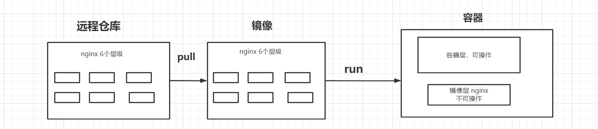

### 2.5 Docker 与虚拟机的区别

|               **传统虚拟机**               |                          **Docker**                          |
| :----------------------------------------: | :----------------------------------------------------------: |
|     依赖物理CPU和内存，是硬件级别的。      | 在操作系统上，利用操作系统的containerization（集装箱化）技术，可以在虚拟机上运行。 |
|     一般都是指操作系统镜像，比较复杂。     |  docker开源而且轻量，成为“容器”，单个容器适合部署少量应用。  |
|            使用快照来保存状态。            |   引入了类似源代码管理机制，将容器的快照历史版本一一记录。   |
| 在构建系统的时候较为复杂，需要大量的人力。 | docker可以通过Dockfile来构建整个容器，重启和构建速度很快，更重要的是Dockfile可以手动编写，这样应用程序开发人员可以通过发布Dockfile来指导系统环境和依赖，这样对于持续交付十分有利。 |

传统虚拟机与Docker的区别图：

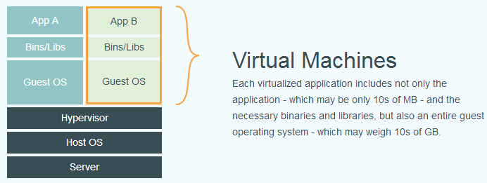

###  2.6  依赖的相关技术

#### Namespaces 命名空间

- PID（Process ID） 进程隔离
- NET（Network） 管理网络接口
- IPC（InterProcess Communication） 管理跨进程通信的访问
- MNT（Mount） 管理挂载点
- UTS（Unix Timesharing System） 隔离内核和版本标识

#### Control Groups 控制组

Control Groups 用来分配资源，此技术来源于 Google，在2007年整合进 Linux Kernel 2.6.24 。

Control Groups 有以下作用：

- 资源限制
- 优先级设定
- 资源计量
- 资源控制

##  三、Docker的安装

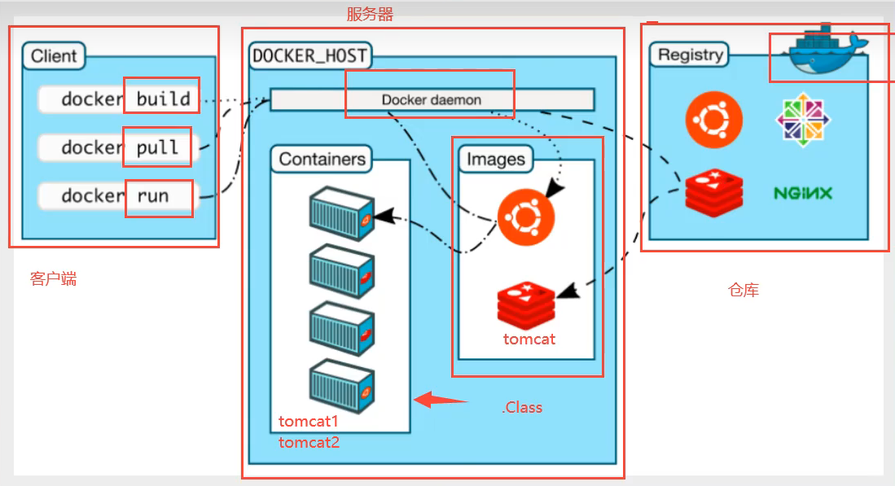

**镜像（image）:**

docker镜像就好比是一个模板,可以通过这个模板来创建容器服务, tomcat镜像===> run==> tomcat01容器(提供服务器) ,
通过这个镜像可以创建多个容器(最终服务运行或者项目运行就是在容器中的)。

**容器(container) :**

Docker利用容器技术,独立运行一个或者一个组应用，通过镜像来创建的。
启动，停止，删除，基本命令！目前就可以把这个容器理解为就是一个简易的linux系統

**仓库(repository):**

仓库就是存放镜像的地方！仓库分为公有仓库和私有仓库！
Docker Hub（默认是国外的）
阿里云…..都有容器服务器(配置镜像加速!)

### 云服务器安装Docker

**下载Docker依赖的环境**

```shell
yum -y install yum-utils device-mapper-persistent-data lvm2
```

**指定Docker镜像源**

```shell
yum-config-manager --add-repo http://mirrors.aliyun.com/docker-ce/linux/centos/docker-ce.repo
```

**安装Docker**

```shell
yum makacache fast
yum -y install docker-ce
```

### 官方的一键安装方式

```arduino
curl -fsSL https://get.docker.com | bash -s docker --mirror Aliyun
```

### 启动Docker并测试

```shell
# 启动Docker服务
systemctl start docker
# 设置开机自动启动
systemctl enable docker
# 测试
docker ps
```


**测试一下Docker**

```shell
docker run hello-world
```


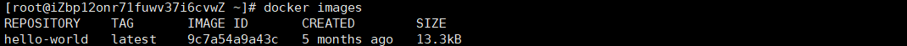

## 四、Docker的中央仓库

+ Docker官方的中央仓库：这个仓库是镜像最全的，但是下载速度较慢。 https://hub.docker.com/ 

+ 国内的镜像网站：网易蜂巢，daoCloud等，下载速度快，但是镜像相对不全。 

  + https://c.163yun.com/hub#/home 

  + http://hub.daocloud.io/   （推荐使用） 

+ 在公司内部会采用私服的方式拉取镜像，需要添加配置，如下…… 

```shell
# 需要创建/etc/docker/daemon.json，并添加如下内容
{
	"registry-mirrors": ["https://registry.docker-cn.com"],
	"insecure-registries": ["ip:port"]   
}
# 重启两个服务
systemctl daemon-reload
systemctl restart docker
```

### 直接配置阿里云镜像加速

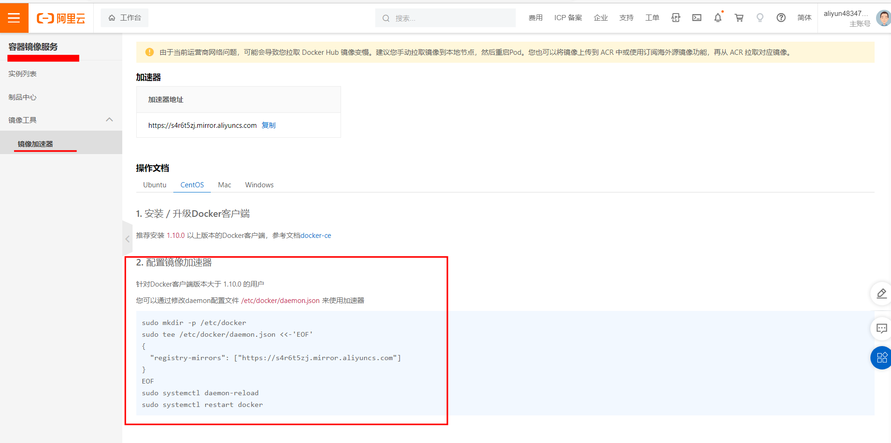

**使用**


### 阿里云私有镜像仓

地址: [https://cr.console.aliyun.com/cn-shenzhen/instances/repositories](https://cr.console.aliyun.com/cn-shenzhen/instances/repositories)

过程很简单, 首先申请开通阿里云私有镜像仓, 然后使用此账号登录即可, 比如:

```bash
$ docker login --username=xxx@qq.com registry.cn-shenzhen.aliyuncs.com
```

然后创建一个命名空间:<br />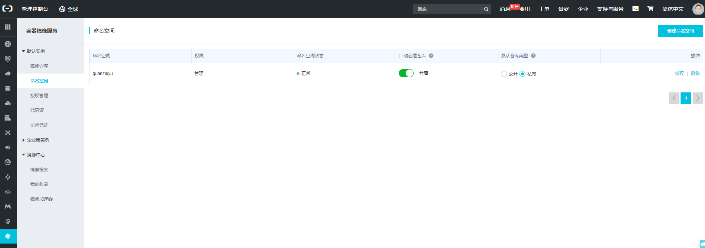

将本地的镜像重新打标签并上传即可, 比如:

```bash
docker tag [ImageId] registry.cn-shenzhen.aliyuncs.com/quanzaiyu/kubernetes-dashboard-amd64:[镜像版本号]
docker push registry.cn-shenzhen.aliyuncs.com/quanzaiyu/kubernetes-dashboard-amd64:[镜像版本号]
```

同时, 还可以使用镜像加速服务:<br />

上传到私有仓库的镜像:<br />

### Registry

#### Docker 注册服务器

下载 registry 镜像, 并创建容器

```bash
$ docker pull registry # 下载Docker注册服务器镜像
$ docker run -d \
  -p 5000:5000 \
  --name server-registry \
  -v /tmp/registry:/tmp/registry \
  registry # 运行Docker注册服务器
```

#### 将私有仓库上传到Docker注册服务器

首先，得对需要上传的镜像打标签，并指定Docker注册服务器的地址

```bash
docker tag centos:latest localhost:5000/centos:1.0
```

然后，将打了标签的镜像上传到Docker注册服务器：

```bash
$ docker push localhost:5000/centos:1.0
The push refers to a repository [localhost:5000/centos]
f972d139738d: Pushed
1.0: digest: sha256:dc29e2bcceac52af0f01300402f5e756cc8c44a310867f6b94f5f7271d4f3fec size: 529
```

注意，这里由于是在一台机子上演示的，所以意义不大，通常我们会在另一台机器上开一个Docker注册服务器。将镜像上传到另一个机器上, 这里的 localhost:5000 就是另一台机器的镜像仓库地址。

#### 拉取私有仓库镜像

```bash
$ docker pull localhost:5000/centos:1.0
Trying to pull repository localhost:5000/centos ...
1.0: Pulling from localhost:5000/centos
Digest: sha256:dc29e2bcceac52af0f01300402f5e756cc8c44a310867f6b94f5f7271d4f3fec
Status: Image is up to date for localhost:5000/centos:1.0

# 如果没有指定标签，而指定镜像又没有latest标签，则报错
$ docker pull localhost:5000/centos
Using default tag: latest
Trying to pull repository localhost:5000/centos ...
Pulling repository localhost:5000/centos
Error: image centos:latest not found
```

### Harbor

- [Harbor仓库介绍与搭建过程](https://blog.51cto.com/11093860/2117805)

##  五、常用命令 :cat:

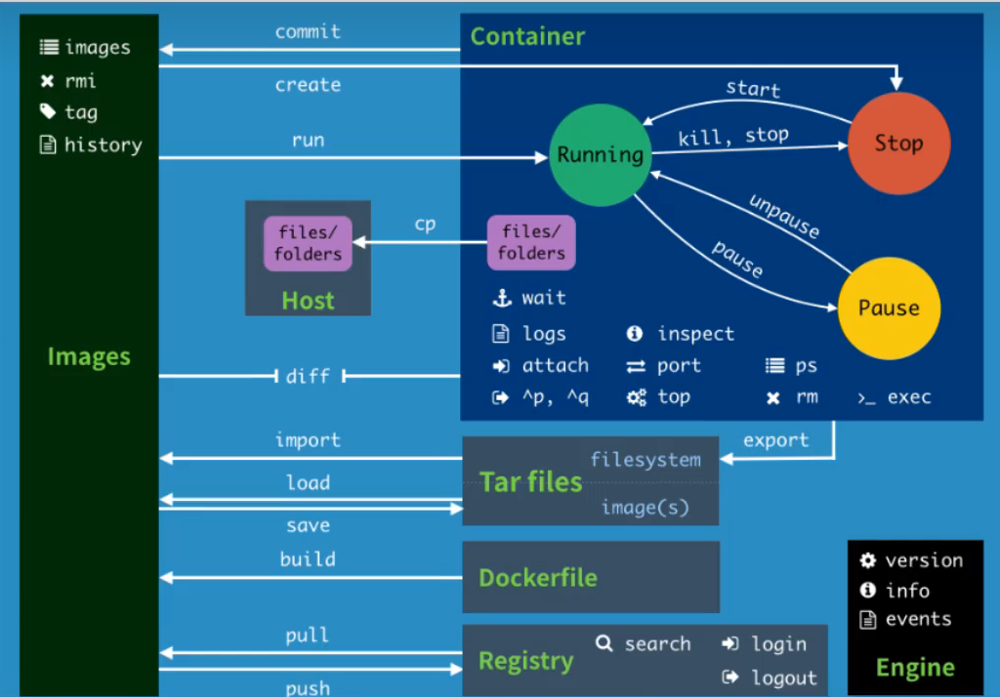

### 5.1 镜像命令

#### 5.1.1 查看本地全部镜像

```shell
sudo docker images
```

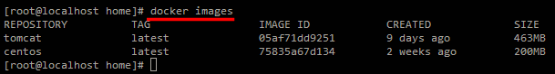

+ REPOSITORY：表示镜像的仓库源

+ TAG：镜像的标签

+ IMAGE ID：镜像ID

+ CREATED：镜像创建时间

+ SIZE：镜像大小

注意：如果镜像后面不加TAG，默认使用latest的镜像

#### 5.1.2 搜索镜像

```shell
sudo docker search 镜像名称
```

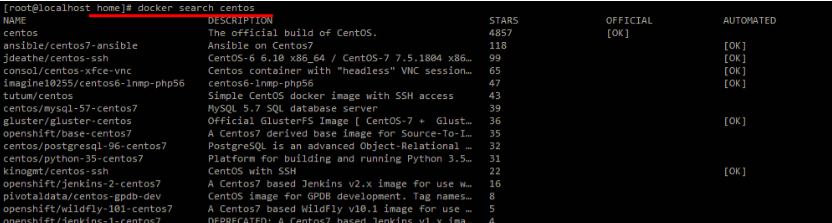

+ NAME:镜像名称
+ DESCRIPTION:镜像说明
+ STARS:点赞数量
+ OFFICIAL:是否是官方的
+ AUTOMATED：是否自动构建的

**访问 Nginx 镜像库地址**

 https://hub.docker.com/_/nginx?tab=tags可以通过 Sort by 查看其他版本的 Nginx，默认是最新版本 nginx:latest。

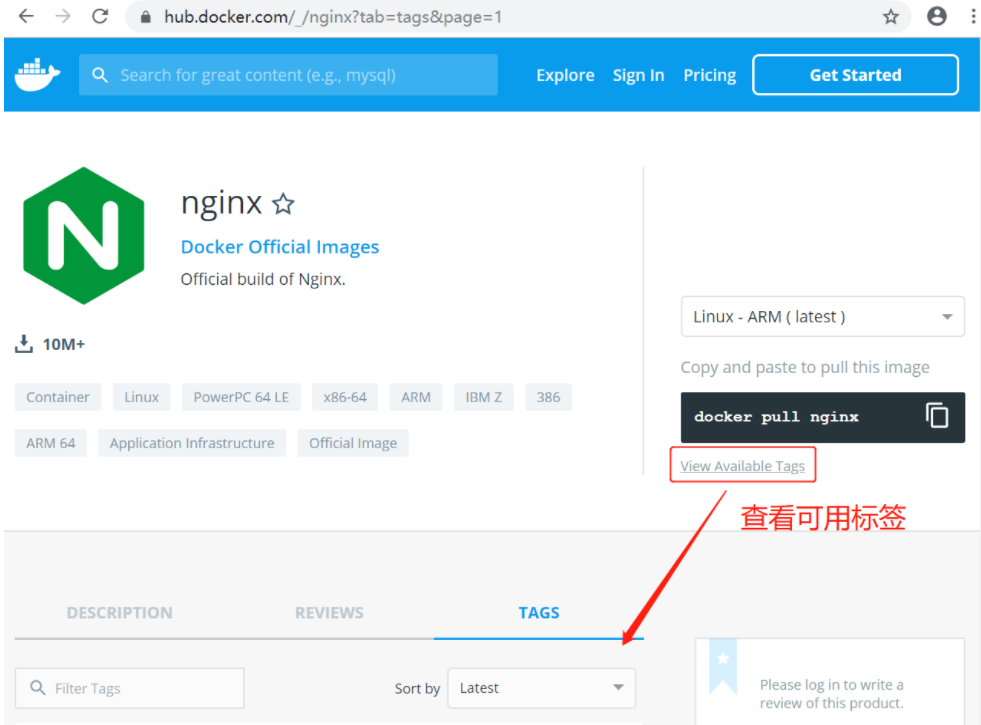

可以找到其他你想要的版本

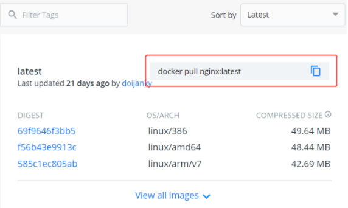

#### 5.1.3 拉取镜像

```shell
sudo docker pull 镜像名
sudo docker pull 镜像名:Tag
```

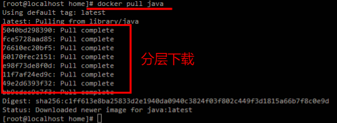

如果不指定`tag`，则下载latest，相当于`docker pull java:latest`

#### 5.1.4 删除本地镜像

```shell
docker image rmi -f 镜像名/镜像ID         # 删除1个镜像
docker image rmi -f 镜像名 镜像名         # 删除多个镜像
docker rmi $(docker images -q)           # 删除所有镜像
```

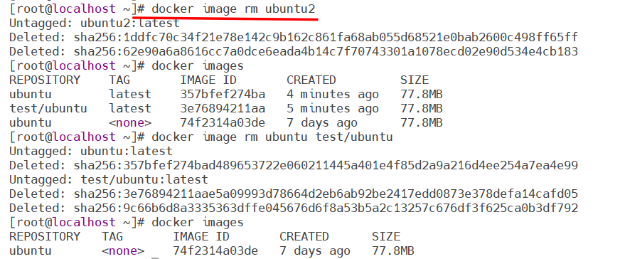

#### 5.1.5 镜像的导入导出

#####  5.1.5.1 导出(保存)压缩包镜像

将我们的镜像保存为tar 压缩文件 这样方便镜像转移和保存 ,然后可以在任何一台安装了docker的服务器上加载这个镜像

```shell
docker save 镜像名/镜像ID -o 镜像保存在哪个位置与名字
```

例子

```shell
docker save 4d6576293cb8 > e:\docker\rabbitmq.tar
```

##### 5.1.5.2 导入镜像

加载镜像保存文件, 使其恢复为一个镜像

```shell
docker load -i 镜像保存文件位置
```

例子

```shell
docker load -i rabbitmq.tar
```

##### 5.1.5.3 修改镜像名称和版本

```shell
docker tag 镜像id 新镜像名称:版本
```

-----

总结

```shell
# 将本地的镜像导出
docker save -o 导出的路径 镜像id
# 加载本地的镜像文件
docker load -i 镜像文件
# 修改镜像名称和版本
docker tag 镜像id 新镜像名称:版本
```

如果因为网络原因可以通过硬盘的方式传输镜像，虽然不规范，但是有效，但是这种方式导出的镜像名称和版本都是null，需要手动修改

#### 5.1.6 commit 更新镜像

```shell
docker commit 提交容器成为一个新的副本

#命令和git原理类似
docker commit -m="提交的描述信息" -a="作者" 容器id 目标镜像名:[TAG]
```

**实战测试**

**更新镜像之前，需要使用镜像来创建一个容器。**

```shell
:~$ docker run -t -i ubuntu:15.10 /bin/bash
root@e218edb10161:/#
```

在完成操作之后，输入 exit 命令来退出这个容器。通过命令 docker commit 来提交容器副本。

```shell
:~$ docker commit -m="has update" -a="jeflee2324" e218edb10161 jeflee2324/ubuntu:v2
```

各个参数说明：

+ -m: 提交的描述信息
+ -a: 指定镜像作者
+ e218edb10161：容器 ID
+ jeflee2324/ubuntu:v2:  指定要创建的目标镜像名

**例子**

```shell
#1、启动一个默认的tomcat
#2、发现这个默认的tomcat是没有webapps应用,镜像的原因,官方的镜像默认webapps下面是没有文件的!
#3、我自己拷贝进去了基本的文件
# 4、将我们操作过的容器通过commit提交为一个镜像
```


### 5.2 容器操作

> 有了镜像才可以创建容器

#### 重启&启动&停止&删除容器

停止

```shell
docker stop 容器名/容器ID     # 停止全部容器
docker stop $(docker ps -qa) # 删除指定容器
```

删除(需要先停止容器)

```shell
#删除一个容器
docker rm -f 容器名/容器ID
#删除多个容器 空格隔开要删除的容器名或容器ID
docker rm -f 容器名/容器ID 容器名/容器ID 容器名/容器ID
#删除全部容器
docker rm -f $(docker ps -aq)
```

重启&启动(需要先停止容器)

```shell
docker restart 容器id        # 重启停止运行的容器
docker start 容器id          # 启动指定的容器
```

+ docker restart 容器id   命令以相同的配置和状态重新启动。

+ docker start 容器id      命令用于启动已经停止的容器。

==注意: 删除&启动操作的前提是使用停止操作==

#### 运行容器

运行容器需要制定具体镜像，如果镜像不存在，会直接下载

```shell
# 简单操作
docker run 镜像的标识/镜像名称[:tag]
```

```shell
# 常用的参数
docker run -d -p 宿主机端口:容器端口 --name 容器名称 镜像的标识/镜像名称[:tag]
# -d：代表后台运行容器
# -p 宿主机端口:容器端口：为了映射当前Linux的端口和容器的端口
# --name 容器名称：指定容器的名称

docker run -d -p 8081:8080 --name tomcat b8
```

```shell
#运行的同时进入并创建数据卷
docker run -it -d --name 要取的别名 -p 宿主机端口:容器端口 -v 宿主机文件存储位置:容器内文件位置 镜像名:Tag /bin/bash 

-it 表示 与容器进行交互式启动
-d 表示可后台运行容器 （守护式运行）  
--name 给要运行的容器 起的名字  
/bin/bash  交互路径
-p 将容器的端口映射到宿主机上，通过宿主机访问内部端口
-v 将容器内的指定文件夹挂载到宿主机对应位置
```

docker run的流程:

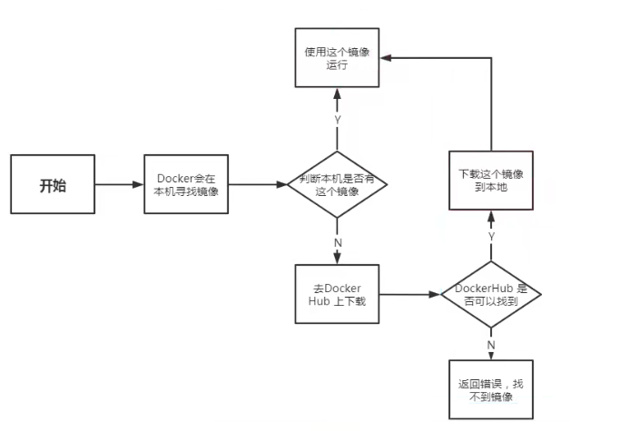

#### 查看正在运行的容器

查看全部正在运行的容器信息

```shell
docker ps [-qa]
# -a：查看全部的容器，包括没有运行
# -q：只查看容器的标识
```


#### 查看容器中进程信息 ps

```shell
docker top 容器id/容器的名称
```


#### 指定网络端口

docker port 可以查看指定 （ID 或者名字）容器的某个确定端口映射到宿主机的端口号。

```shell
docker port 容器id/容器的名称
```

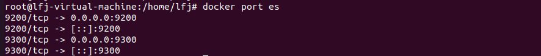

#### 查看容器日志

查看容器日志，以查看容器运行的信息。 查看完毕后，`ctrl+c`即可退出

```shell
docker logs -f -t --tail number 容器id/容器的名称

-tf              # 显示日志
-tf --tail number # 显示日志条数
```

例子

```shell
[root@kuangshen /]# docker logs -tf --tail 10 dce7b86171bf
```

#### 查看容器的元数据(信息)

可以查看数据卷之类的东西

```shell
docker inspect 容器id/容器的名称
```

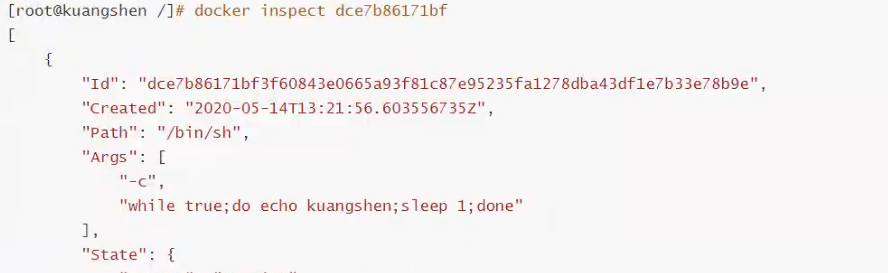

#### 查看容器使用情况

```shell
docker stats [OPTIONS] [CONTAINER...]
```

#### 进入容器内容部

#####  exec

```shell
docker exec -it 容器id/容器的名称 /bin/bash  #或者docker exec -it 容器ID sh
#退出容器：exit
```

##### attach

```shell
sudo docker attach 容器id/容器的名称
```

##### 区别

```shell
exit            # 直接停止容器,退出容器的交互式终端  //exec 如果使用exit退出，容器也不会停止。
Ctrl + p + q    # 容器不停止退出, 容器继续运行并保留端口映射配置
```

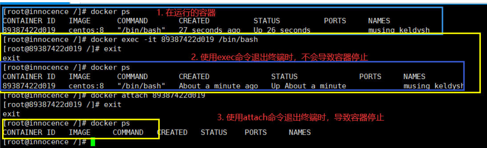

#### 主机内容和容器内容相互拷贝(没用)

> 此拷贝是一个手动过程，未来使用 -v 卷的技术，可以实现自动

将宿主机的文件复制到容器内部的指定目录

```shell
docker cp 容器id:容器内部路径 文件名称
```


#### 导入和导出容器

##### 导出容器

```shell
docker export 容器ID > 文件名
```

如：docker export 97 > ubuntu.tar.gz

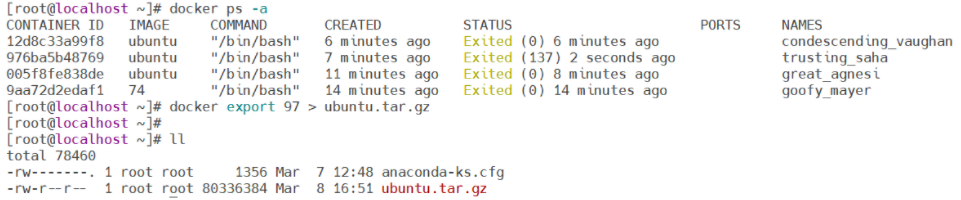

##### 导入容器

```shell
cat 文件名 | docker import - 镜像用户/镜像名:镜像版本号（镜像用户和版本号可以不写）
cat test.tar.gz | docker import - ubuntu2
```

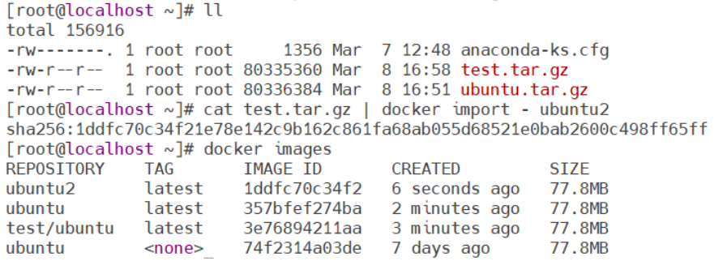

## 六、Docker应用

 [docker常用软件安装](https://blog.csdn.net/qq_43430759/article/details/126345572)

### 一 tomcat

#### 1.1 查找镜像

```bash
# 最新版的tomcat里面webapps改了名字，如果使用的话注意进入容器修改名称。这里我们使用tomcat8，不需要做修改。
docker search tomcat8-jdk8
```

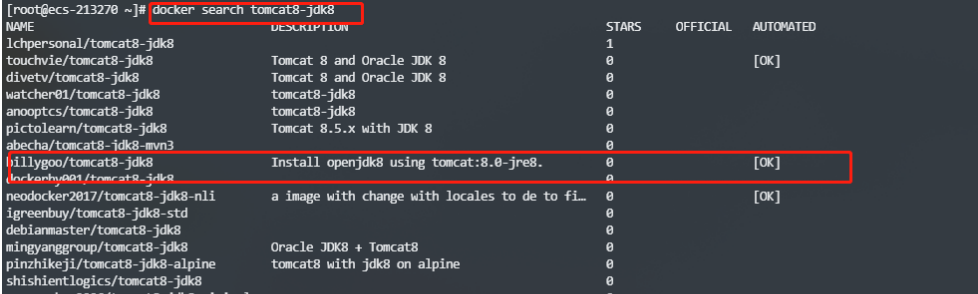

#### 1.2 拉取镜像到本地

```bash
docker pull billygoo/tomcat8-jdk8
```


#### 1.3 创建容器实例

```bash
docker run -d -p 8080:8080 --name mystery_tomcat8 billygoo/tomcat8-jdk8
```

#### 1.4 使用

```bash
# 浏览器访问
ip地址：8080
```


### 二 nginx

#### 2.1 查找镜像

```bash
docker search nginx
```

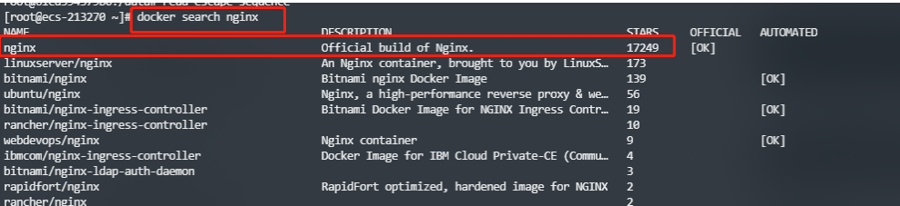

#### 2.2 拉取镜像到本地

```bash
# 这里就默认安装latest版本
docker pull nginx
```

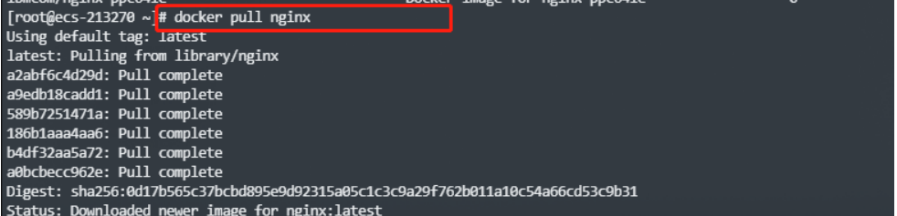

#### 2.3 创建容器实例

```bash
# 1 创建之前先准备数据卷文件夹
mkdir -p /mydata/nginx/conf
mkdir -p /mydata/nginx/log
mkdir -p /mydata/nginx/html
```

\


```shell
# 2 第一次创建nginx容器
docker run -d -p 3389:80 --name nginx nginx:latest
# 3 复制配置文件到主机上
docker cp nginx:/etc/nginx/nginx.conf /mydata/nginx/conf/nginx.conf
# 将容器conf.d文件夹下内容复制到宿主机
docker cp nginx:/etc/nginx/conf.d /mydata/nginx/conf/conf.d
# 将容器中的html文件夹复制到宿主机
docker cp nginx:/usr/share/nginx/html /mydata/nginx/
# 复制完之后删除容器，过河拆桥
docker rm -f nginx
# 4 第二次创建nginx容器
docker run -d -p 3389:80 --name mystery_nginx -v /mydata/nginx/conf/nginx.conf:/etc/nginx/nginx.conf -v /mydata/nginx/conf/conf.d:/etc/nginx/conf.d -v /mydata/nginx/log:/var/log/nginx -v /mydata/nginx/html:/usr/share/nginx/html nginx:latest
```

#### 2.4 使用

外网测试

```
浏览器直接输入ip即可（80端口可以省略）
```


内网测试

```
[root@lfj home]# curl localhost:3389
```


### 三 mysql5.7

#### 3.1 查找镜像

```bash
docker search mysql:5.7
```


#### 3.2 拉取镜像到本地

```bash
docker pull mysql:5.7
```

#### 3.3 创建容器实例

```bash
# 参数说明：-d 后台守护进程创建容器、-p 端口映射、--privileged 赋予容器内root用户真正的root权限、-v 文件挂载 -e 设置mysql参数，这里设置root密码、--name 设置创建的容器实例名称
docker run -d -p 3306:3306 --privileged=true -v /mydata/mysql/log:/var/log/mysql -v /mydata/mysql/data:/var/lib/mysql -v /mydata/mysql/conf:/etc/mysql/conf.d -e MYSQL_ROOT_PASSWORD=root  --name mystery_mysql mysql:5.7
```

#### 3.4 使用

##### 3.4.1 修改配置文件

```bash
vim /mydata/mysql/conf/my.cnf
```

```bash
# 添加如下内容
[client]
default_character_set=utf8
[mysqld]
collation_server = utf8_general_ci
character_set_server = utf8
123456
```

##### 3.4.2 查看字符集是否修改成功

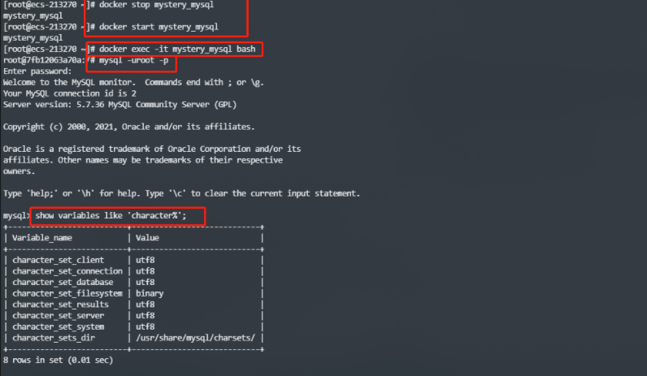

##### 3.4.3 操作数据库


远程操作，这里使用datagrip

### 四 Vue应用

首先创建一个 Vue 应用, 然后打包:

```bash
$ npm run build
```

打包后, 会生成 /dist 目录, 这是构建产物

创建 `default.conf`:

```bash
server {
    listen       80;
    server_name  localhost;

    location / {
        root   /usr/share/nginx/html;
        index  index.html index.htm;
    }

    error_page   500 502 503 504  /50x.html;
    location = /50x.html {
        root   html;
    }
}
```

创建 Dockerfile:

```dockerfile
FROM hub.c.163.com/library/nginx

MAINTAINER quanzaiyu

RUN rm /etc/nginx/conf.d/default.conf

ADD default.conf /etc/nginx/conf.d/

COPY dist/ /usr/share/nginx/html/
```

注意, 因为引用的基础容器为nginx, 因此这里不需要暴露任何端口

打包构建为 Docker 镜像:

```bash
$ docker build -t "731734107/vue-test" .
```

以上步骤, 结合 Jenkins 会更加容易, 注意, 打包vue是在docker外部完成的, 需要的只是其构建产物

运行测试:

```bash
$ docker run -p 8088:80 731734107/vue-test
```

将容器中的80端口映射到宿主机的8088端口, 在宿主机中使用 [http://localhost:8088](http://localhost:8088) 即可访问

推送到 Docker Hub

```bash
$ docker push 731734107/vue-test
```

### 五  Koa 应用

首先创建一个简单的 Koa 应用:

`app.js`

```javascript
const Koa = require('koa');
const app = new Koa();
const path = require('path');
const route = require('koa-route');
const staticFiles = require('koa-static');

const main = staticFiles(path.join(__dirname, 'public'));
console.log(path.join(__dirname, 'public'));

app.use(route.get('/public', main));
app.use(route.get('/', ctx => {
  ctx.response.body = 'Welcome'
}));
app.listen(3000);
```

创建 Dockerfile:

```bash
FROM node:lts-alpine
MAINTAINER quanzaiyu

ADD . /app/
WORKDIR /app

RUN npm config set sass_binary_site https://npm.taobao.org/mirrors/node-sass/
RUN npm config set phantomjs_cdnurl https://npm.taobao.org/mirrors/phantomjs/
RUN npm config set electron_mirror https://npm.taobao.org/mirrors/electron/
RUN npm config set chromedriver_cdnurl https://cdn.npm.taobao.org/dist/chromedriver
RUN npm install
RUN npm rebuild node-sass --force

ENV HOST 0.0.0.0
ENV PORT 3000

EXPOSE 3000

CMD ["node", "app"]
```

打包构建为 Docker 镜像:

```bash
$ docker build -t "731734107/test-koa" .
```

运行测试:

```bash
$ docker run -p 8080:3000 731734107/test-koa
```

将容器中的3000端口映射到宿主机的8080端口, 在宿主机中使用 [http://localhost:8080](http://localhost:8080) 即可访问

推送到 Docker Hub

```bash
$ docker push 731734107/test-koa
```

### 附：防火墙开放端口方法

如果是阿里云或华为云之类的ESC服务器，还需要去控制台配置安全组规则。

```bash
firewall-cmd --zone=public --add-port=15672/tcp --permanent
firewall-cmd --reload
```

### 补充:crossed_swords:


#### 1、安装Nginx

##### 1.1、下拉镜像

```shell
# 这里就默认安装latest版本
docker pull nginx
```

##### 1.2、移动配置文件

```shell
# 创建文件夹
mkdir -p /mydata/nginx/html
mkdir -p /mydata/nginx/logs
mkdir -p /mydata/nginx/conf

# nginx 配置文件拷贝
docker container cp nginx:/etc/nginx /mydata/nginx/conf/
mv /mydata/nginx/conf/nginx/* /mydata/nginx/conf/
rm -rf /mydata/nginx/conf/nginx
```

##### 1.3、停止、删除Nginx容器

```shell
# 停止 nginx 容器
docker stop nginx
# 删除 nginx 容器
docker rm nginx
```

##### 1.4、启动Nginx容器

```shell
docker run -p 80:80 --name nginx \
-v /mydata/nginx/html:/usr/share/nginx/html \
-v /mydata/nginx/logs:/var/log/nginx \
-v /mydata/nginx/conf/:/etc/nginx \
--restart always nginx
```

#### 2、安装MySQL

##### 2.1、下拉MySQL镜像

我们通过命令直接去DockerHub下拉MySQL镜像，这里我们使用的是5.7版本的MySQL（因为我目前不是超级管理员权限，需要加上sudo）：

```shell
# 下拉镜像
docker pull mysql:5.7

# 检查镜像是否下载成功
docker images
12345
```

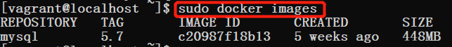

##### 2.2、启动MySQL容器

```shell
# 启动MySQL镜像
docker run -p 3306:3306 --name mysql \
-v /mydata/mysql/log:/var/log/mysql \
-v /mydata/mysql/data:/var/lib/mysql \
-v /mydata/mysql/conf:/etc/mysql \
-e MYSQL_ROOT_PASSWORD=root \
-d mysql:5.7

# 查看MySQL容器(镜像启动后就是容器)
docker ps
12345678910
```

##### 2.3、修改MySQL配置

使用mysql之前我们需要先进行配置修改，直接修改Linux的**挂载**文件即可（毕竟数据可以同步）

```shell
# 进入配置目录
cd /mydata/mysql/conf

# 编写配置文件
vi my.cnf

# 粘贴内容
[client]
default-character-set=utf8

[mysql]
default-character-set=utf8

[mysqld]
init_connect='SET collation_connection = utf8_unicode_ci'
init_connect='SET NAMES utf8'
character-set-server=utf8
collation-server=utf8_unicode_ci
skip-character-set-client-handshake
skip-name-resolve

# 修改完配置需要重启容器才能生效
docker restart mysql
1234567891011121314151617181920212223
```

#### 3、安装Redis

##### 3.1、下拉Redis镜像

```shell
# 下载Redis镜像(不指定版本就是最新版)
docker pull redis
12
```

##### 3.2、启动Redis容器

注意：我们需要现在Linux中把文件建好，在进行Redis容器**挂载**，否则会出错（MySQL不需要提前建文件）

```shell
# 创建目录和配置文件
mkdir -p /mydata/redis/conf
cd /mydata/redis/conf
touch redis.conf

# 启动镜像
docker run -p 6379:6379 --name redis -v /mydata/redis/data:/data \
-v /mydata/redis/conf/redis.conf:/etc/redis/redis.conf \
-d redis redis-server /etc/redis/redis.conf

# 查看Redis是否启动
docker ps
123456789101112
```

#### 4、安装ElasticSearch

##### 4.1、下拉ElasticSearch镜像

下载ElasticSearch镜像（我选择7.4.2版本），检索数据需要存放在该容器中：

```shell
docker pull elasticsearch:7.4.2
1
```

##### 4.2、下拉Kibana镜像

下载Kibana镜像，Kibana是ElasticSearch的可视化界面，类似于操作MySQL的Navicat：

```shell
docker pull kibana:7.4.2
1
```

##### 4.3、启动容器前配置

```shell
# 创建config文件夹（用于挂载ES的配置）
mkdir -p /mydata/elasticsearch/config
# 创建data文件夹（用于挂载ES的数据）
mkdir -p /mydata/elasticsearch/data
# 进入到config文件夹，执行该命令，添加ES配置文件
# 该文件作用：可以接收所有远程主机的访问
echo "http.host: 0.0.0.0" >/mydata/elasticsearch/config/elasticsearch.yml
# 修改文件权限，保证任何用户任何组都可读写（否则ElasticSearch容器启动就会闪退）
chmod -R 777 /mydata/elasticsearch/
123456789
```

##### 4.4、启动ElasticSearch容器

命令：

```shell
docker run --name elasticsearch -p 9200:9200 -p 9300:9300 \
-e "discovery.type=single-node" \
-e ES_JAVA_OPTS="-Xms64m -Xmx128m" \
-v /mydata/elasticsearch/config/elasticsearch.yml:/usr/share/elasticsearch/config/elasticsearch.yml \
-v /mydata/elasticsearch/data:/usr/share/elasticsearch/data \
-v /mydata/elasticsearch/plugins:/usr/share/elasticsearch/plugins \
-d elasticsearch:7.4.2 
1234567
```

解释：

> –name：为容器起个名
> -p：暴露端口（9200为ElasticSearch端口，9300为分布式集群节点之间的通信端口）
> -e “discovery.type=single-node”：ElasticSearch以单节点模式运行
> -e ES_JAVA_OPTS=“-Xms64m -Xmx128m”：初始64m，最大128m
> -v：进行挂载，不多解释
> -d：后台启动

##### 4.5、启动Kibana容器

```shell
docker run --name kibana -e ELASTICSEARCH_HOSTS=http://192.168.56.10:9200 -p 5601:5601 -d kibana:7.4.2
1
```

#### 5、安装Nacos

##### 5.1、配置数据库

这样可以持久化Nacos数据到MySQL中，即使Nacos容器出现问题，数据也不会丢失，创建数据库脚本链接：https://github.com/alibaba/nacos/blob/master/config/src/main/resources/META-INF/nacos-db.sql

如果打不开链接，可以使用以下SQL脚本内容：

```sql
/******************************************/
/*   数据库全名 = nacos_config   */
/*   表名称 = config_info   */
/******************************************/
CREATE TABLE `config_info` (
  `id` bigint(20) NOT NULL AUTO_INCREMENT COMMENT 'id',
  `data_id` varchar(255) NOT NULL COMMENT 'data_id',
  `group_id` varchar(128) DEFAULT NULL,
  `content` longtext NOT NULL COMMENT 'content',
  `md5` varchar(32) DEFAULT NULL COMMENT 'md5',
  `gmt_create` datetime NOT NULL DEFAULT '2010-05-05 00:00:00' COMMENT '创建时间',
  `gmt_modified` datetime NOT NULL DEFAULT '2010-05-05 00:00:00' COMMENT '修改时间',
  `src_user` text COMMENT 'source user',
  `src_ip` varchar(20) DEFAULT NULL COMMENT 'source ip',
  `app_name` varchar(128) DEFAULT NULL,
  `tenant_id` varchar(128) DEFAULT '' COMMENT '租户字段',
  `c_desc` varchar(256) DEFAULT NULL,
  `c_use` varchar(64) DEFAULT NULL,
  `effect` varchar(64) DEFAULT NULL,
  `type` varchar(64) DEFAULT NULL,
  `c_schema` text,
  `encrypted_data_key` text NOT NULL COMMENT '秘钥',
  PRIMARY KEY (`id`),
  UNIQUE KEY `uk_configinfo_datagrouptenant` (`data_id`,`group_id`,`tenant_id`)
) ENGINE=InnoDB DEFAULT CHARSET=utf8 COLLATE=utf8_bin COMMENT='config_info';

/******************************************/
/*   数据库全名 = nacos_config   */
/*   表名称 = config_info_aggr   */
/******************************************/
CREATE TABLE `config_info_aggr` (
  `id` bigint(20) NOT NULL AUTO_INCREMENT COMMENT 'id',
  `data_id` varchar(255) NOT NULL COMMENT 'data_id',
  `group_id` varchar(128) NOT NULL COMMENT 'group_id',
  `datum_id` varchar(255) NOT NULL COMMENT 'datum_id',
  `content` longtext NOT NULL COMMENT '内容',
  `gmt_modified` datetime NOT NULL COMMENT '修改时间',
  `app_name` varchar(128) DEFAULT NULL,
  `tenant_id` varchar(128) DEFAULT '' COMMENT '租户字段',
  PRIMARY KEY (`id`),
  UNIQUE KEY `uk_configinfoaggr_datagrouptenantdatum` (`data_id`,`group_id`,`tenant_id`,`datum_id`)
) ENGINE=InnoDB DEFAULT CHARSET=utf8 COLLATE=utf8_bin COMMENT='增加租户字段';


/******************************************/
/*   数据库全名 = nacos_config   */
/*   表名称 = config_info_beta   */
/******************************************/
CREATE TABLE `config_info_beta` (
  `id` bigint(20) NOT NULL AUTO_INCREMENT COMMENT 'id',
  `data_id` varchar(255) NOT NULL COMMENT 'data_id',
  `group_id` varchar(128) NOT NULL COMMENT 'group_id',
  `app_name` varchar(128) DEFAULT NULL COMMENT 'app_name',
  `content` longtext NOT NULL COMMENT 'content',
  `beta_ips` varchar(1024) DEFAULT NULL COMMENT 'betaIps',
  `md5` varchar(32) DEFAULT NULL COMMENT 'md5',
  `gmt_create` datetime NOT NULL DEFAULT '2010-05-05 00:00:00' COMMENT '创建时间',
  `gmt_modified` datetime NOT NULL DEFAULT '2010-05-05 00:00:00' COMMENT '修改时间',
  `src_user` text COMMENT 'source user',
  `src_ip` varchar(20) DEFAULT NULL COMMENT 'source ip',
  `tenant_id` varchar(128) DEFAULT '' COMMENT '租户字段',
  `encrypted_data_key` text NOT NULL COMMENT '秘钥',
  PRIMARY KEY (`id`),
  UNIQUE KEY `uk_configinfobeta_datagrouptenant` (`data_id`,`group_id`,`tenant_id`)
) ENGINE=InnoDB DEFAULT CHARSET=utf8 COLLATE=utf8_bin COMMENT='config_info_beta';

/******************************************/
/*   数据库全名 = nacos_config   */
/*   表名称 = config_info_tag   */
/******************************************/
CREATE TABLE `config_info_tag` (
  `id` bigint(20) NOT NULL AUTO_INCREMENT COMMENT 'id',
  `data_id` varchar(255) NOT NULL COMMENT 'data_id',
  `group_id` varchar(128) NOT NULL COMMENT 'group_id',
  `tenant_id` varchar(128) DEFAULT '' COMMENT 'tenant_id',
  `tag_id` varchar(128) NOT NULL COMMENT 'tag_id',
  `app_name` varchar(128) DEFAULT NULL COMMENT 'app_name',
  `content` longtext NOT NULL COMMENT 'content',
  `md5` varchar(32) DEFAULT NULL COMMENT 'md5',
  `gmt_create` datetime NOT NULL DEFAULT '2010-05-05 00:00:00' COMMENT '创建时间',
  `gmt_modified` datetime NOT NULL DEFAULT '2010-05-05 00:00:00' COMMENT '修改时间',
  `src_user` text COMMENT 'source user',
  `src_ip` varchar(20) DEFAULT NULL COMMENT 'source ip',
  PRIMARY KEY (`id`),
  UNIQUE KEY `uk_configinfotag_datagrouptenanttag` (`data_id`,`group_id`,`tenant_id`,`tag_id`)
) ENGINE=InnoDB DEFAULT CHARSET=utf8 COLLATE=utf8_bin COMMENT='config_info_tag';

/******************************************/
/*   数据库全名 = nacos_config   */
/*   表名称 = config_tags_relation   */
/******************************************/
CREATE TABLE `config_tags_relation` (
  `id` bigint(20) NOT NULL COMMENT 'id',
  `tag_name` varchar(128) NOT NULL COMMENT 'tag_name',
  `tag_type` varchar(64) DEFAULT NULL COMMENT 'tag_type',
  `data_id` varchar(255) NOT NULL COMMENT 'data_id',
  `group_id` varchar(128) NOT NULL COMMENT 'group_id',
  `tenant_id` varchar(128) DEFAULT '' COMMENT 'tenant_id',
  `nid` bigint(20) NOT NULL AUTO_INCREMENT,
  PRIMARY KEY (`nid`),
  UNIQUE KEY `uk_configtagrelation_configidtag` (`id`,`tag_name`,`tag_type`),
  KEY `idx_tenant_id` (`tenant_id`)
) ENGINE=InnoDB DEFAULT CHARSET=utf8 COLLATE=utf8_bin COMMENT='config_tag_relation';

/******************************************/
/*   数据库全名 = nacos_config   */
/*   表名称 = group_capacity   */
/******************************************/
CREATE TABLE `group_capacity` (
  `id` bigint(20) unsigned NOT NULL AUTO_INCREMENT COMMENT '主键ID',
  `group_id` varchar(128) NOT NULL DEFAULT '' COMMENT 'Group ID，空字符表示整个集群',
  `quota` int(10) unsigned NOT NULL DEFAULT '0' COMMENT '配额，0表示使用默认值',
  `usage` int(10) unsigned NOT NULL DEFAULT '0' COMMENT '使用量',
  `max_size` int(10) unsigned NOT NULL DEFAULT '0' COMMENT '单个配置大小上限，单位为字节，0表示使用默认值',
  `max_aggr_count` int(10) unsigned NOT NULL DEFAULT '0' COMMENT '聚合子配置最大个数，，0表示使用默认值',
  `max_aggr_size` int(10) unsigned NOT NULL DEFAULT '0' COMMENT '单个聚合数据的子配置大小上限，单位为字节，0表示使用默认值',
  `max_history_count` int(10) unsigned NOT NULL DEFAULT '0' COMMENT '最大变更历史数量',
  `gmt_create` datetime NOT NULL DEFAULT '2010-05-05 00:00:00' COMMENT '创建时间',
  `gmt_modified` datetime NOT NULL DEFAULT '2010-05-05 00:00:00' COMMENT '修改时间',
  PRIMARY KEY (`id`),
  UNIQUE KEY `uk_group_id` (`group_id`)
) ENGINE=InnoDB DEFAULT CHARSET=utf8 COLLATE=utf8_bin COMMENT='集群、各Group容量信息表';

/******************************************/
/*   数据库全名 = nacos_config   */
/*   表名称 = his_config_info   */
/******************************************/
CREATE TABLE `his_config_info` (
  `id` bigint(64) unsigned NOT NULL,
  `nid` bigint(20) unsigned NOT NULL AUTO_INCREMENT,
  `data_id` varchar(255) NOT NULL,
  `group_id` varchar(128) NOT NULL,
  `app_name` varchar(128) DEFAULT NULL COMMENT 'app_name',
  `content` longtext NOT NULL,
  `md5` varchar(32) DEFAULT NULL,
  `gmt_create` datetime NOT NULL DEFAULT '2010-05-05 00:00:00',
  `gmt_modified` datetime NOT NULL DEFAULT '2010-05-05 00:00:00',
  `src_user` text,
  `src_ip` varchar(20) DEFAULT NULL,
  `op_type` char(10) DEFAULT NULL,
  `tenant_id` varchar(128) DEFAULT '' COMMENT '租户字段',
  `encrypted_data_key` text NOT NULL COMMENT '秘钥',
  PRIMARY KEY (`nid`),
  KEY `idx_gmt_create` (`gmt_create`),
  KEY `idx_gmt_modified` (`gmt_modified`),
  KEY `idx_did` (`data_id`)
) ENGINE=InnoDB DEFAULT CHARSET=utf8 COLLATE=utf8_bin COMMENT='多租户改造';


/******************************************/
/*   数据库全名 = nacos_config   */
/*   表名称 = tenant_capacity   */
/******************************************/
CREATE TABLE `tenant_capacity` (
  `id` bigint(20) unsigned NOT NULL AUTO_INCREMENT COMMENT '主键ID',
  `tenant_id` varchar(128) NOT NULL DEFAULT '' COMMENT 'Tenant ID',
  `quota` int(10) unsigned NOT NULL DEFAULT '0' COMMENT '配额，0表示使用默认值',
  `usage` int(10) unsigned NOT NULL DEFAULT '0' COMMENT '使用量',
  `max_size` int(10) unsigned NOT NULL DEFAULT '0' COMMENT '单个配置大小上限，单位为字节，0表示使用默认值',
  `max_aggr_count` int(10) unsigned NOT NULL DEFAULT '0' COMMENT '聚合子配置最大个数',
  `max_aggr_size` int(10) unsigned NOT NULL DEFAULT '0' COMMENT '单个聚合数据的子配置大小上限，单位为字节，0表示使用默认值',
  `max_history_count` int(10) unsigned NOT NULL DEFAULT '0' COMMENT '最大变更历史数量',
  `gmt_create` datetime NOT NULL DEFAULT '2010-05-05 00:00:00' COMMENT '创建时间',
  `gmt_modified` datetime NOT NULL DEFAULT '2010-05-05 00:00:00' COMMENT '修改时间',
  PRIMARY KEY (`id`),
  UNIQUE KEY `uk_tenant_id` (`tenant_id`)
) ENGINE=InnoDB DEFAULT CHARSET=utf8 COLLATE=utf8_bin COMMENT='租户容量信息表';


CREATE TABLE `tenant_info` (
  `id` bigint(20) NOT NULL AUTO_INCREMENT COMMENT 'id',
  `kp` varchar(128) NOT NULL COMMENT 'kp',
  `tenant_id` varchar(128) default '' COMMENT 'tenant_id',
  `tenant_name` varchar(128) default '' COMMENT 'tenant_name',
  `tenant_desc` varchar(256) DEFAULT NULL COMMENT 'tenant_desc',
  `create_source` varchar(32) DEFAULT NULL COMMENT 'create_source',
  `gmt_create` bigint(20) NOT NULL COMMENT '创建时间',
  `gmt_modified` bigint(20) NOT NULL COMMENT '修改时间',
  PRIMARY KEY (`id`),
  UNIQUE KEY `uk_tenant_info_kptenantid` (`kp`,`tenant_id`),
  KEY `idx_tenant_id` (`tenant_id`)
) ENGINE=InnoDB DEFAULT CHARSET=utf8 COLLATE=utf8_bin COMMENT='tenant_info';

CREATE TABLE users (
	username varchar(50) NOT NULL PRIMARY KEY,
	password varchar(500) NOT NULL,
	enabled boolean NOT NULL
);

CREATE TABLE roles (
	username varchar(50) NOT NULL,
	role varchar(50) NOT NULL,
	constraint uk_username_role UNIQUE (username,role)
);

CREATE TABLE permissions (
    role varchar(50) NOT NULL,
    resource varchar(512) NOT NULL,
    action varchar(8) NOT NULL,
    constraint uk_role_permission UNIQUE (role,resource,action)
);

INSERT INTO users (username, password, enabled) VALUES ('nacos', '$2a$10$EuWPZHzz32dJN7jexM34MOeYirDdFAZm2kuWj7VEOJhhZkDrxfvUu', TRUE);

INSERT INTO roles (username, role) VALUES ('nacos', 'ROLE_ADMIN');
123456789101112131415161718192021222324252627282930313233343536373839404142434445464748495051525354555657585960616263646566676869707172737475767778798081828384858687888990919293949596979899100101102103104105106107108109110111112113114115116117118119120121122123124125126127128129130131132133134135136137138139140141142143144145146147148149150151152153154155156157158159160161162163164165166167168169170171172173174175176177178179180181182183184185186187188189190191192193194195196197198199200201202203204205
```

##### 5.2、启动Nacos容器

```shell
#推荐使用这种方式，可以连接自己的数据库
docker run -d -p 8848:8848 -p 9848:9848 \
--name nacos \
--env MODE=standalone \
--env SPRING_DATASOURCE_PLATFORM=mysql \
--env MYSQL_SERVICE_HOST=192.168.0.12 \
--env MYSQL_SERVICE_PORT=3306 \
--env MYSQL_SERVICE_DB_NAME=nacos \
--env MYSQL_SERVICE_USER=root \
--env MYSQL_SERVICE_PASSWORD=wisesoft \
nacos/nacos-server:latest
1234567891011
```

##### 5.3、访问Nacos地址

访问链接：http://ip:8848/nacos
默认账号：nacos
默认密码：nacos
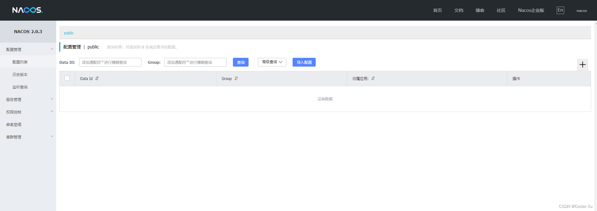

##### 5.4、注意事项

该技术文章中，安装的Nacos为`2.0.3`，那么`nacos_config`数据库中的`config_info`和`his_config_info`的 `encrypted_data_key`字段需要删除掉，否则使用Nacos过程中会报错！

参考链接：https://blog.csdn.net/qq_60361946/article/details/127760181

#### 6、安装XXL-JOB

##### 6.1、配置数据库

跟安装nacos一样，需要先准备数据库，这里不做过多解释：

https://github.com/xuxueli/xxl-job/blob/master/doc/db/tables_xxl_job.sql

```sql
CREATE database if NOT EXISTS `xxl_job` default character set utf8mb4 collate utf8mb4_unicode_ci;
use `xxl_job`;

SET NAMES utf8mb4;

CREATE TABLE `xxl_job_info` (
  `id` int(11) NOT NULL AUTO_INCREMENT,
  `job_group` int(11) NOT NULL COMMENT '执行器主键ID',
  `job_desc` varchar(255) NOT NULL,
  `add_time` datetime DEFAULT NULL,
  `update_time` datetime DEFAULT NULL,
  `author` varchar(64) DEFAULT NULL COMMENT '作者',
  `alarm_email` varchar(255) DEFAULT NULL COMMENT '报警邮件',
  `schedule_type` varchar(50) NOT NULL DEFAULT 'NONE' COMMENT '调度类型',
  `schedule_conf` varchar(128) DEFAULT NULL COMMENT '调度配置，值含义取决于调度类型',
  `misfire_strategy` varchar(50) NOT NULL DEFAULT 'DO_NOTHING' COMMENT '调度过期策略',
  `executor_route_strategy` varchar(50) DEFAULT NULL COMMENT '执行器路由策略',
  `executor_handler` varchar(255) DEFAULT NULL COMMENT '执行器任务handler',
  `executor_param` varchar(512) DEFAULT NULL COMMENT '执行器任务参数',
  `executor_block_strategy` varchar(50) DEFAULT NULL COMMENT '阻塞处理策略',
  `executor_timeout` int(11) NOT NULL DEFAULT '0' COMMENT '任务执行超时时间，单位秒',
  `executor_fail_retry_count` int(11) NOT NULL DEFAULT '0' COMMENT '失败重试次数',
  `glue_type` varchar(50) NOT NULL COMMENT 'GLUE类型',
  `glue_source` mediumtext COMMENT 'GLUE源代码',
  `glue_remark` varchar(128) DEFAULT NULL COMMENT 'GLUE备注',
  `glue_updatetime` datetime DEFAULT NULL COMMENT 'GLUE更新时间',
  `child_jobid` varchar(255) DEFAULT NULL COMMENT '子任务ID，多个逗号分隔',
  `trigger_status` tinyint(4) NOT NULL DEFAULT '0' COMMENT '调度状态：0-停止，1-运行',
  `trigger_last_time` bigint(13) NOT NULL DEFAULT '0' COMMENT '上次调度时间',
  `trigger_next_time` bigint(13) NOT NULL DEFAULT '0' COMMENT '下次调度时间',
  PRIMARY KEY (`id`)
) ENGINE=InnoDB DEFAULT CHARSET=utf8mb4;

CREATE TABLE `xxl_job_log` (
  `id` bigint(20) NOT NULL AUTO_INCREMENT,
  `job_group` int(11) NOT NULL COMMENT '执行器主键ID',
  `job_id` int(11) NOT NULL COMMENT '任务，主键ID',
  `executor_address` varchar(255) DEFAULT NULL COMMENT '执行器地址，本次执行的地址',
  `executor_handler` varchar(255) DEFAULT NULL COMMENT '执行器任务handler',
  `executor_param` varchar(512) DEFAULT NULL COMMENT '执行器任务参数',
  `executor_sharding_param` varchar(20) DEFAULT NULL COMMENT '执行器任务分片参数，格式如 1/2',
  `executor_fail_retry_count` int(11) NOT NULL DEFAULT '0' COMMENT '失败重试次数',
  `trigger_time` datetime DEFAULT NULL COMMENT '调度-时间',
  `trigger_code` int(11) NOT NULL COMMENT '调度-结果',
  `trigger_msg` text COMMENT '调度-日志',
  `handle_time` datetime DEFAULT NULL COMMENT '执行-时间',
  `handle_code` int(11) NOT NULL COMMENT '执行-状态',
  `handle_msg` text COMMENT '执行-日志',
  `alarm_status` tinyint(4) NOT NULL DEFAULT '0' COMMENT '告警状态：0-默认、1-无需告警、2-告警成功、3-告警失败',
  PRIMARY KEY (`id`),
  KEY `I_trigger_time` (`trigger_time`),
  KEY `I_handle_code` (`handle_code`)
) ENGINE=InnoDB DEFAULT CHARSET=utf8mb4;

CREATE TABLE `xxl_job_log_report` (
  `id` int(11) NOT NULL AUTO_INCREMENT,
  `trigger_day` datetime DEFAULT NULL COMMENT '调度-时间',
  `running_count` int(11) NOT NULL DEFAULT '0' COMMENT '运行中-日志数量',
  `suc_count` int(11) NOT NULL DEFAULT '0' COMMENT '执行成功-日志数量',
  `fail_count` int(11) NOT NULL DEFAULT '0' COMMENT '执行失败-日志数量',
  `update_time` datetime DEFAULT NULL,
  PRIMARY KEY (`id`),
  UNIQUE KEY `i_trigger_day` (`trigger_day`) USING BTREE
) ENGINE=InnoDB DEFAULT CHARSET=utf8mb4;

CREATE TABLE `xxl_job_logglue` (
  `id` int(11) NOT NULL AUTO_INCREMENT,
  `job_id` int(11) NOT NULL COMMENT '任务，主键ID',
  `glue_type` varchar(50) DEFAULT NULL COMMENT 'GLUE类型',
  `glue_source` mediumtext COMMENT 'GLUE源代码',
  `glue_remark` varchar(128) NOT NULL COMMENT 'GLUE备注',
  `add_time` datetime DEFAULT NULL,
  `update_time` datetime DEFAULT NULL,
  PRIMARY KEY (`id`)
) ENGINE=InnoDB DEFAULT CHARSET=utf8mb4;

CREATE TABLE `xxl_job_registry` (
  `id` int(11) NOT NULL AUTO_INCREMENT,
  `registry_group` varchar(50) NOT NULL,
  `registry_key` varchar(255) NOT NULL,
  `registry_value` varchar(255) NOT NULL,
  `update_time` datetime DEFAULT NULL,
  PRIMARY KEY (`id`),
  KEY `i_g_k_v` (`registry_group`,`registry_key`,`registry_value`)
) ENGINE=InnoDB DEFAULT CHARSET=utf8mb4;

CREATE TABLE `xxl_job_group` (
  `id` int(11) NOT NULL AUTO_INCREMENT,
  `app_name` varchar(64) NOT NULL COMMENT '执行器AppName',
  `title` varchar(12) NOT NULL COMMENT '执行器名称',
  `address_type` tinyint(4) NOT NULL DEFAULT '0' COMMENT '执行器地址类型：0=自动注册、1=手动录入',
  `address_list` text COMMENT '执行器地址列表，多地址逗号分隔',
  `update_time` datetime DEFAULT NULL,
  PRIMARY KEY (`id`)
) ENGINE=InnoDB DEFAULT CHARSET=utf8mb4;

CREATE TABLE `xxl_job_user` (
  `id` int(11) NOT NULL AUTO_INCREMENT,
  `username` varchar(50) NOT NULL COMMENT '账号',
  `password` varchar(50) NOT NULL COMMENT '密码',
  `role` tinyint(4) NOT NULL COMMENT '角色：0-普通用户、1-管理员',
  `permission` varchar(255) DEFAULT NULL COMMENT '权限：执行器ID列表，多个逗号分割',
  PRIMARY KEY (`id`),
  UNIQUE KEY `i_username` (`username`) USING BTREE
) ENGINE=InnoDB DEFAULT CHARSET=utf8mb4;

CREATE TABLE `xxl_job_lock` (
  `lock_name` varchar(50) NOT NULL COMMENT '锁名称',
  PRIMARY KEY (`lock_name`)
) ENGINE=InnoDB DEFAULT CHARSET=utf8mb4;

INSERT INTO `xxl_job_group`(`id`, `app_name`, `title`, `address_type`, `address_list`, `update_time`) VALUES (1, 'xxl-job-executor-sample', '示例执行器', 0, NULL, '2018-11-03 22:21:31' );
INSERT INTO `xxl_job_info`(`id`, `job_group`, `job_desc`, `add_time`, `update_time`, `author`, `alarm_email`, `schedule_type`, `schedule_conf`, `misfire_strategy`, `executor_route_strategy`, `executor_handler`, `executor_param`, `executor_block_strategy`, `executor_timeout`, `executor_fail_retry_count`, `glue_type`, `glue_source`, `glue_remark`, `glue_updatetime`, `child_jobid`) VALUES (1, 1, '测试任务1', '2018-11-03 22:21:31', '2018-11-03 22:21:31', 'XXL', '', 'CRON', '0 0 0 * * ? *', 'DO_NOTHING', 'FIRST', 'demoJobHandler', '', 'SERIAL_EXECUTION', 0, 0, 'BEAN', '', 'GLUE代码初始化', '2018-11-03 22:21:31', '');
INSERT INTO `xxl_job_user`(`id`, `username`, `password`, `role`, `permission`) VALUES (1, 'admin', 'e10adc3949ba59abbe56e057f20f883e', 1, NULL);
INSERT INTO `xxl_job_lock` ( `lock_name`) VALUES ( 'schedule_lock');

commit;
123456789101112131415161718192021222324252627282930313233343536373839404142434445464748495051525354555657585960616263646566676869707172737475767778798081828384858687888990919293949596979899100101102103104105106107108109110111112113114115116117
```

##### 6.2、配置docker-compose.yml文件

```yml
version: "2.2"
services:
  xxl-job-admin:
    restart: always
    image: xuxueli/xxl-job-admin:2.3.1
    container_name: xxl-job-admin
    volumes:
      - /data/xxl-job-admin/logs:/data/applogs
    ports:
      - "8800:8800"
    environment:
      PARAMS: '
      --server.port=8800
      --server.servlet.context-path=/xxl-job-admin
      --spring.datasource.url=jdbc:mysql://120.53.242.235:3306/xxl_job?useUnicode=true&characterEncoding=UTF-8&autoReconnect=true&serverTimezone=Asia/Shanghai
      --spring.datasource.username=root
      --spring.datasource.password=root      
      --xxl.job.accessToken=Lpoms_xxljob_default_token'
123456789101112131415161718
```

##### 6.3、运行docker-compose.yml文件

```shell
# 启动 docker-compose
docker-compose up -d
12
```

启动完成后访问：[http://ip:8800/xxl-job-admin/](http://120.53.242.235:8800/xxl-job-admin/)
默认账号：admin
默认密码：123456
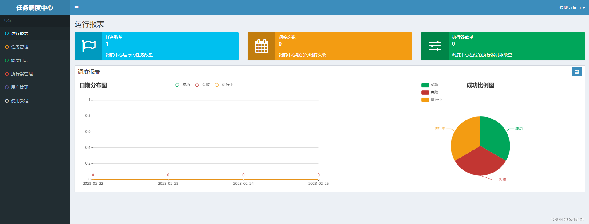

#### 7、安装Sentinel

##### 7.1、下拉Sentinel镜像

```shell
# DockerHub仓库搜索Sentinel镜像
docker search sentinel

# 下拉Sentinel镜像
docker pull bladex/sentinel-dashboard
12345
```

##### 7.2、启动Sentinel容器

```shell
docker run --name sentinel-dashboard -p 8858:8858 -d bladex/sentinel-dashboard:latest  
1
```

##### 7.3、访问Sentinel

启动完成后，访问地址：http://ip:8858
登录账号： sentinel
登录密码：sentinel
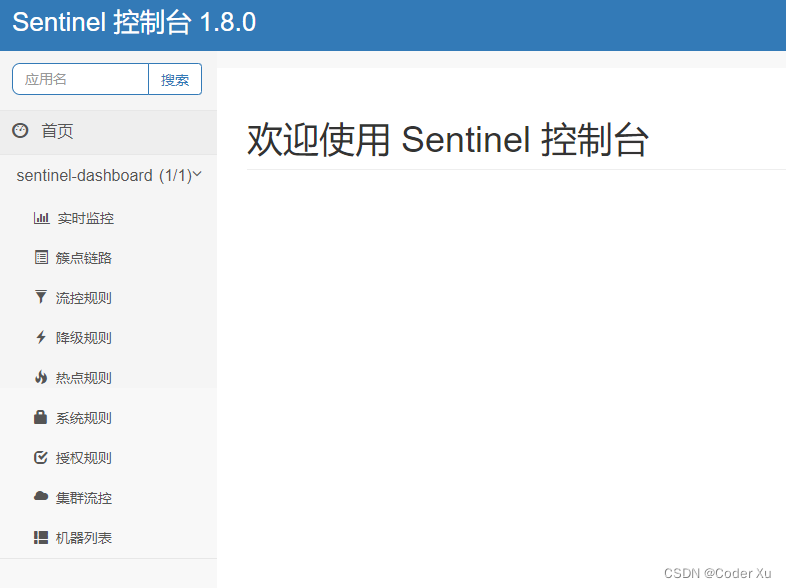

#### 8、安装Jenkins

##### 8.1、下拉Jenkins镜像

```shell
docker pull jenkins/jenkins
1
```

##### 8.2、启动Jenkins容器

```shell
# 先创建挂载目录，分配权限
mkdir -p /mydata/jenkins_home/
chmod 777 /mydata/jenkins_home/

# 启动容器
docker run -d -p 8080:8080 -p 50000:50000 -v /mydata/jenkins_home:/var/jenkins_home -v /etc/localtime:/etc/localtime --name jenkins jenkins/jenkins
123456
```

##### 8.3、配置镜像加速

```shell
# 进入挂载目录
cd /mydata/jenkins_home

# 修改配置文件，将url标签内容修改为清华大学官方镜像
# https://mirrors.tuna.tsinghua.edu.cn/jenkins/updates/update-center.json
vim hudson.model.UpdateCenter.xml
123456
```

##### 8.4、访问Jenkins

获取Jenkins登录密码：

```shell
# 查看Jenkins密码
cat /mydata/jenkins_home/secrets/initialAdminPassword
12
```

浏览器输入ip:8080，进入到Jenkins页面，输入密码登录即可：
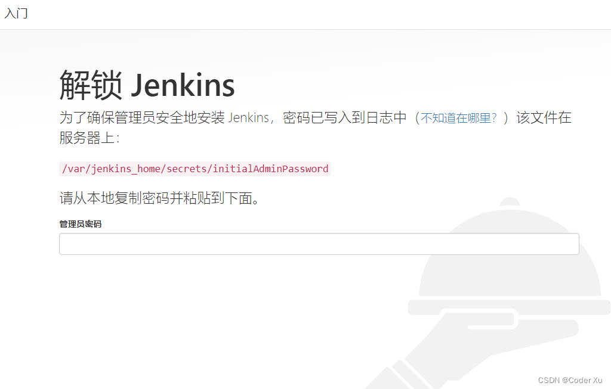

#### 9、安装Kafka

##### 9.1、启动Zookpeer容器

```shell
# 建立网络
docker network create app-tier --driver bridge

# 安装Zookpeer
docker run -d --name zookeeper-server \
    --network app-tier \
    -e ALLOW_ANONYMOUS_LOGIN=yes \
    bitnami/zookeeper:latest
12345678
```

##### 9.2、启动Kafka容器

```shell
docker run -d --name kafka-server \
    --network app-tier \
    -p 9092:9092 \
    -e ALLOW_PLAINTEXT_LISTENER=yes \
    -e KAFKA_CFG_ZOOKEEPER_CONNECT=zookeeper-server:2181 \
    -e KAFKA_CFG_ADVERTISED_LISTENERS=PLAINTEXT://192.168.0.101:9092 \
    bitnami/kafka:latest
1234567
```

#### 10、安装Minio

##### 10.1、下拉Minio镜像

```shell
docker pull minio/minio
1
```

##### 10.2、启动Minio容器

```shell
# 创建挂载目录
mkdir -p /home/minio/config
mkdir -p /home/minio/data

# 启动容器
docker run -p 9000:9000 -p 9090:9090 \
     --name minio \
     -d --restart=always \
     -e "MINIO_ACCESS_KEY=minioadmin" \
     -e "MINIO_SECRET_KEY=minioadmin" \
     -v /home/minio/data:/data \
     -v /home/minio/config:/root/.minio \
     minio/minio server \
     /data --console-address ":9090" -address ":9000"
1234567891011121314
```

##### 10.3、访问Minio

通过`ip:9090/login`即可访问Minio：


## 七、数据卷【`重点`】

> 容器的持久化和数据共享同步操作！ **只要数据卷相同可以和Docker-Compose一键部署的容器共享**

数据卷：将宿主机的一个目录映射到容器的一个目录中。可以在宿主机中操作目录中的内容，那么容器内部映射的文件，也会跟着一起改变。**容器的持久化和数据共享同步操作！**

Docker 不支持在已经运行的容器中动态追加数据卷。一旦容器创建后，数据卷的挂载路径是固定的，无法直接追加新的数据卷或更改挂载点。

#### 7.1 创建数据卷

创建数据卷之后，默认会存放在一个目录下 **/var/lib/docker/volumes/数据卷名称/_data**

```shell
如何确定是具名挂载还是匿名挂载，还是指定路径挂载！
-v 容器内路径  # 匿名挂载
-v 卷名：容器内路径 # 具名挂载
/宿主机路径::容器内路径 # 指定路径挂载
```

```shell
docker volume create 数据卷名称
```

#### 7.2 查看数据卷详情

查看数据卷的详细信息，可以查询到存放路径，创建时间等等

```shell
docker volume inspect 数据卷名称
```

#### 7.3 查看全部数据卷

查看全部数据卷信息

```shell
docker volume ls
```

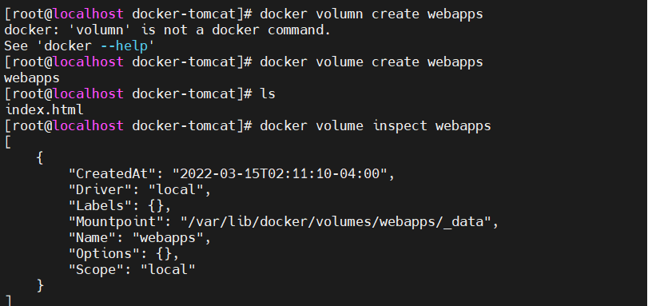

#### 7.4 删除数据卷

```shell
docker volume rm 数据卷名称
```

#### 7.5 容器映射数据卷:crossed_swords:

映射有两种方式：

- 通过数据卷名称映射，如果数据卷不存在。Docker会帮你自动创建，会将容器内部自带的文件，存储在默认的存放路径中。
- 通过路径映射数据卷，直接指定一个路径作为数据卷的存放位置。但是这个路径下是空的。

语法

```shell
docker run -d --name <容器名称> -v <宿主机目录>:<容器内目标目录> <镜像名称>
```

- `<容器名称>`：容器指定的名称。
- `-v` 或 `--volume`：用于映射数据卷的选项。
- `<宿主机目录>`：宿主机上的目录或文件的路径，它将被映射到容器内部。
- `<容器内目标目录>`：容器内部的目标路径，用于将宿主机的目录或文件映射到容器内的相应位置。
- `<镜像名称>`：要运行的 Docker 镜像的名称和标签。

例子

```shell
# 通过数据卷名称映射docker run -v 数据卷名称:容器内部的路径 镜像id
# 通过路径映射数据卷docker run -v 路径:容器内部的路径 镜像id   

docker run -d -p 8081:8080 --name tomcat -v /opt/tocmat:/usr/local/tomcat/webapps/ROOT b8
```

#### 7.6 指定访问权限

```bash
$ docker run --name server -v ~/data_volume:/data:ro -it ubuntu /bin/bash
```

在创建容器的时候，可以在数据卷映射参数后面加上访问权限，比如上面的 `ro`，是只读权限。

- `ro` read only
- `rw` read write

#### 7.7 通过Dockerfile挂载(推荐)

**编写dockerfile**

```shell
 vim dockerfile
```


**将其制作为镜像**

```shell
docker build -f dockerfile路径 -t 镜像名称[:tag] .
```

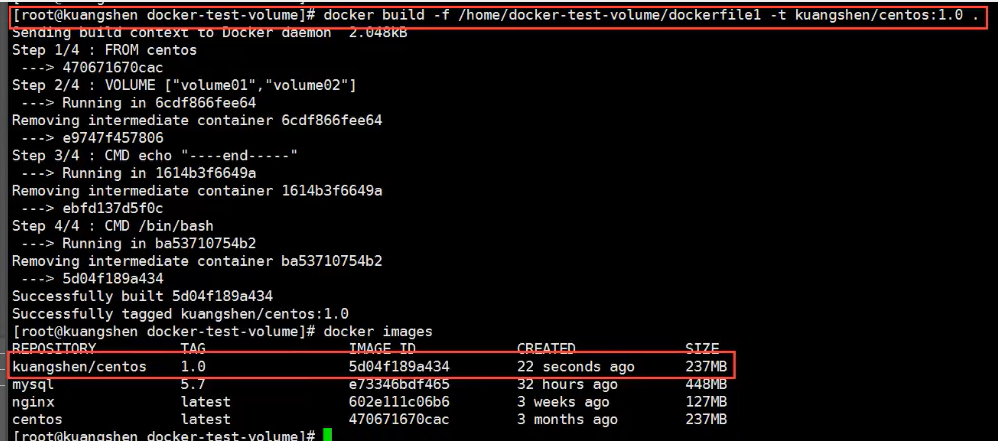

**启动容器**


#### 7.8 数据卷容器

==容器之间配置信息的传递,数据卷容器的生命周期一直持续到没有容器使用为止。但是一旦持久化到了本地，这个时候，本地的数据是不会删除的==

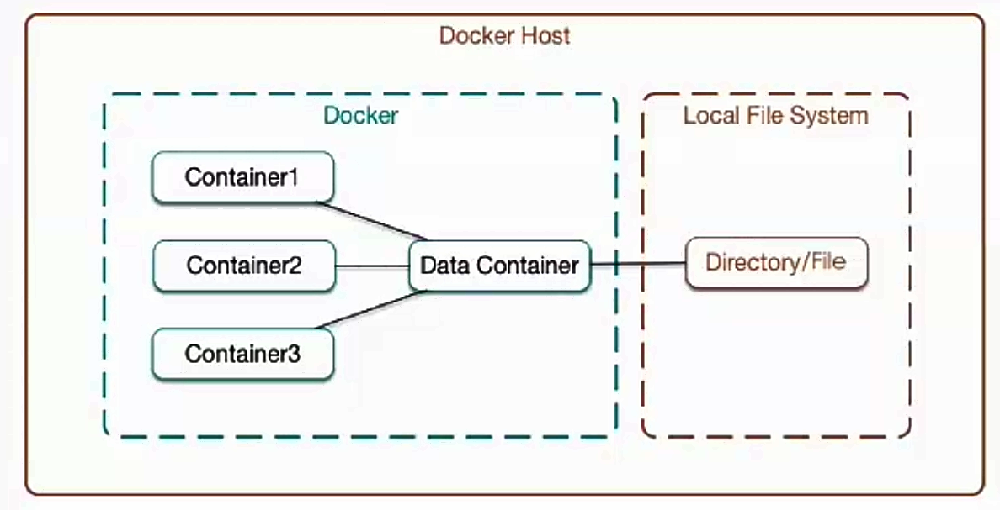

挂载数据卷容器的方法：

```bash
$ docker run --volumes-from [CONTAINER NAME]
```

+ 通过数据卷容器，可以在不暴露宿主机映射目录的情况下，使用已知容器创建的数据卷。

+ 数据卷的生命周期一直持续到没有容器使用它为止。

##### 数据卷备份还原

通过以下命令进行数据卷备份：

```bash
docker run \
  --volumes-from [CONTAINER NAME] \
  -v $(pwd):/backup \
  ubuntu \
  tar cvf /backup/backup.tar [CONTAINER DATA VOLUME]
```


示例：

```bash
$ docker run \
	--name ubuntu_backup
  --volumes-from container_from \
  -v ~/backup:/backup \
  ubuntu \
  tar cvf /backup/backup.tar /data_volume
```

对以上命令的解释：

1. 使用ubuntu镜像创建一个容器，取名为ubuntu_backup
2. 从container_from容器中所有的数据卷挂载到ubuntu_backup容器中(假设数据卷为`/data_volume`)
3. 将ubuntu_backup容器中的`/backup`目录挂载到宿主机中的`~/backup`目录
4. 使用ubuntu_backup容器中的 `tar cvf` 命令将数据卷目录 `/data_volume` 打包到 `/backup/backup.tar`，达到备份的目的
5. 在宿主机中的`~/backup`下即可看到此tar文件

同样地，使用 `tar xvf` 命令以相同的格式还原一个数据卷：

```bash
$ docker run \
  --volumes-from [CONTAINER NAME] \
  -v $(pwd):/backup \
  ubuntu \
  tar xvf /backup/backup.tar [CONTAINER DATA VOLUME]
```

参考：[Backup, restore, or migrate data volumes](https://docs.docker.com/storage/volumes/#backup-restore-or-migrate-data-volumes)

###### 数据卷容器实例1

1. 拉一个centos的容器镜像

```bash
docker pull centos
```

2. 然后运行这个镜像并创建一个数据卷挂载到/mydata

```bash
docker run -it -v /data:/mydata --name mycentos centos
```

3. 再运行一个容器，在这两个容器中使用--volumes-from来挂载mycentos容器中的数据卷

```bash
docker run -it --volumes-from mycentos --name soncentos1 centos
docker run -it --volumes-from mycentos --name soncentos2 centos
```

此时，容器soncentos1和soncentos2都挂载同一个数据卷到相同的/mydata 目录。三个容器任何一方在该目录下的写入数据，其他容器都可以看到。

###### 数据卷容器实例2

下面以jenkins为例，示例数据卷容器的创建。

1. 创建一个jenkins容器

```bash
docker run --name jenkins -p 50000:50000 -p 8080:8080 -v /datas/jenkins_home:/var/jenkins_home jenkinsci/blueocean
```

2. 创建数据卷容器

```bash
[root@97e52c9ad535 /]# docker run -it --name jenkins-data --volumes-from jenkins centos
[root@97e52c9ad535 /]# cd /var
[root@97e52c9ad535 var]# ls
adm    crash  empty  games   jenkins_home  lib    lock  mail  opt       run    tmp
cache  db     ftp    gopher  kerberos      local  log   nis   preserve  spool  yp   
[root@97e52c9ad535 var]# exit
```

3. 数据备份

```bash
docker run --volumes-from jenkins-data -v /buckup:/home centos tar cvf /home/jenkins.tar /var/jenkins_home
```

例子1

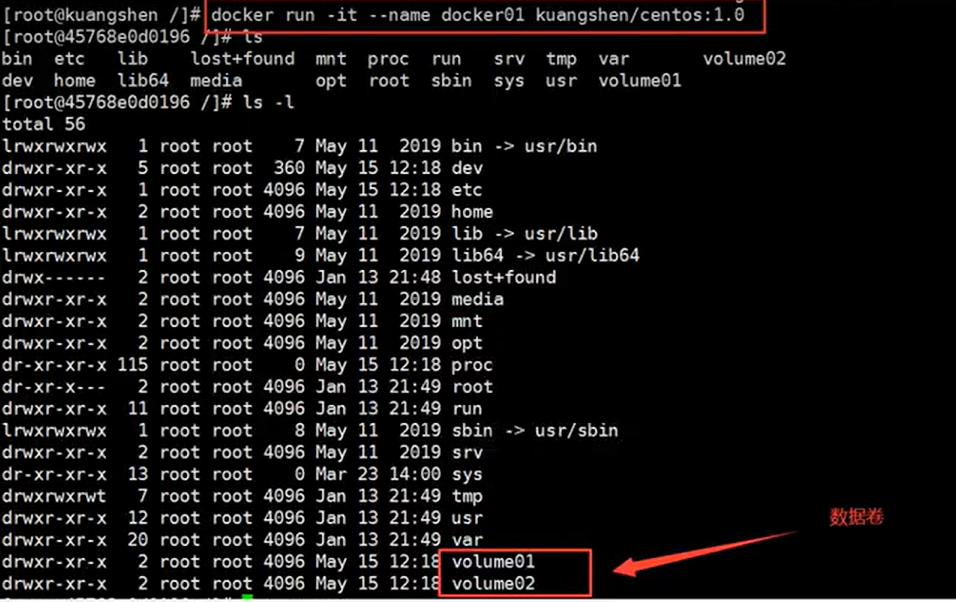

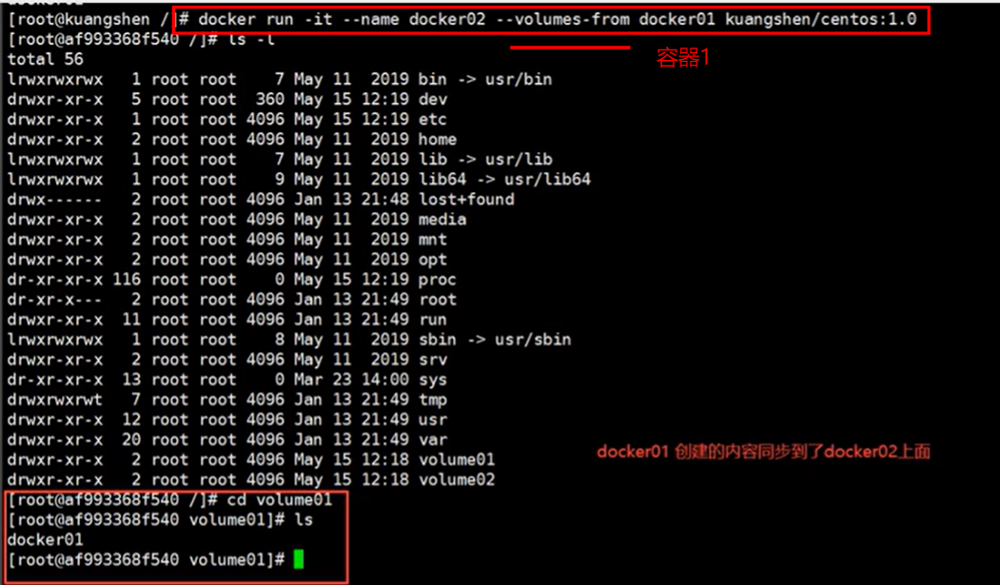

##### 数据同步


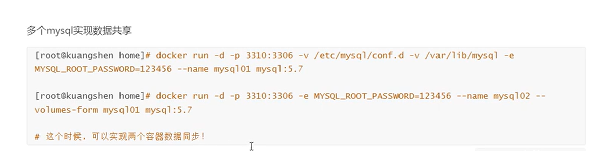

## 八  Docker 容器网络连接


### 端口暴露

在使用 `docker run` 命令时，以下是有关设置宿主机端口和容器端口的一些详细信息：

- `-p` 参数用于将宿主机端口映射到容器端口。
- 宿主机端口是您希望暴露给外部访问的端口，可以是任何未被占用的可用端口。
- 容器端口是容器中正在监听的端口。这是您的应用程序在容器内部使用的端口。

以下是 `docker run` 命令的示例，说明了如何设置宿主机和容器端口映射：

```
docker run -it -d --name my-container -p 8080:80 my-image:tag /bin/bash
```

在上面的示例中，**我们将宿主机的 8080 端口映射到容器的 80 端口。这意味着当您在宿主机上访问 `localhost:8080` 时，流量将被转发到容器的 80 端口。**

请根据您的需求和应用程序的要求替换示例中的值。确保宿主机端口未被占用，以及容器中正在运行的应用程序正在监听指定的容器端口

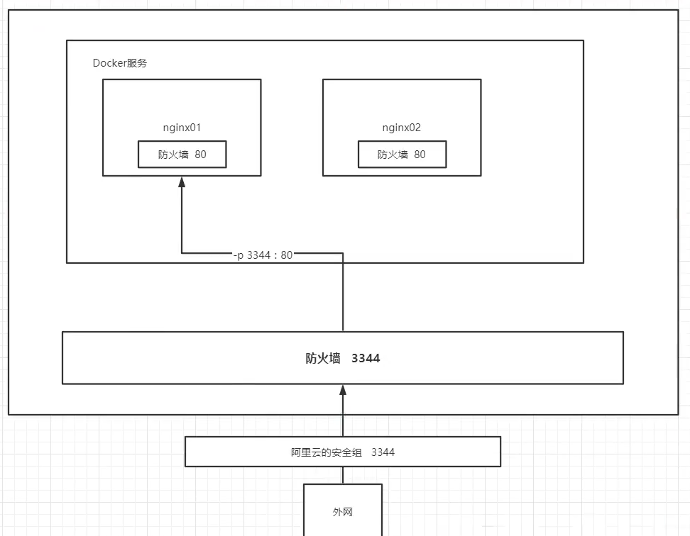

### 网络端口映射

#### 原理

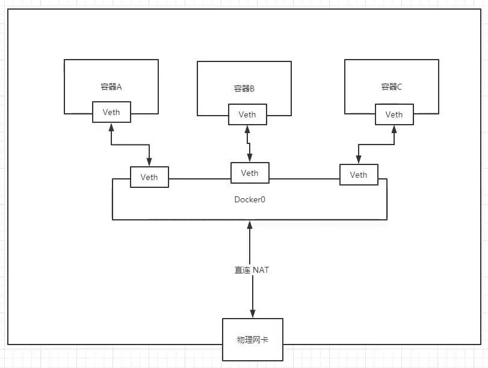

**例子**

tomcat01 和 tomcat02 是公用的一个路由器，docker0。所有的容器不指定网络的情况下，都是 docker0 路由的，docker会给我们的容器分配一个默认的可用IP

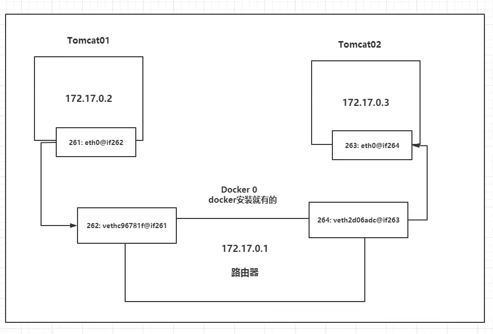

#### 设置

创建了一个 python 应用的容器

```shell
:~$ docker run -d -P training/webapp python app.py
```

两种方式的区别是:

- **-P :**是容器内部端口**随机**映射到主机的高端口。(自动)

- **-p :** 是容器内部端口绑定到**指定**的主机端口。

```shell
:~$ docker run -d -p 5000:5000 training/webapp python app.py
```


另外，可以指定容器绑定的网络地址，比如绑定 127.0.0.1。这样我们就可以通过访问 127.0.0.1:5001 来访问容器的 5000 端口。

```shell
:~$ docker run -d -p 127.0.0.1:5001:5000 training/webapp python app.py
```


上面的例子中，默认都是绑定 tcp 端口，如果要绑定 UDP 端口，可以在端口后面加上 **/udp**。

```plain
:~$ docker run -d -p 127.0.0.1:5000:5000/udp training/webapp python app.py
```


### Docker 容器网络互联

端口映射并不是唯一把 docker 连接到另一个容器的方法。如果你有多个容器之间需要互相连接，推荐使用 Docker Compose。下面是其中一种方式

####  新建网络

下面先创建一个新的 Docker 网络。

```shell
[lee@localhost docker]$ docker network create -d bridge test-net
```

并使用以下命令查询网络：

```shell
[lee@localhost docker]$ docker network ls
```

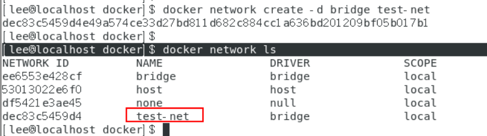

参数说明：

**-d**：参数指定 Docker 网络类型，有 bridge、overlay。

其中 overlay 网络类型用于 Swarm mode，暂时忽略它。

#### 连接容器

运行一个容器并连接到新建的 test-net 网络:

```shell
$ docker run -itd --name test1 --network test-net ubuntu /bin/bash
```

打开新的终端，再运行一个容器并加入到 test-net 网络:

```shell
$ docker run -itd --name test2 --network test-net ubuntu /bin/bash
```

然后回到第一个终端，用       docker ps         进行查询


下面通过 ping 来证明 test1 容器和 test2 容器建立了互联关系。

进入 test1 容器

```shell
docker exec -it test1 /bin/bash ping test2
```

在 test1 容器输入以下命令：


同理在 test2 容器也会成功连接到:(切换终端)

```shell
docker exec -it test2 /bin/bash
```

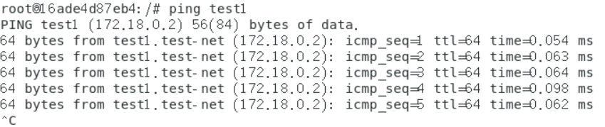

测试结果都能ping通

## 九、Dockerfile自定义镜像:crossed_swords:【`重点`】

**作用之一:  Dockerfile的作用是将后端SpringBoot的项目Jar包build成Docker镜像。**

可以从中央仓库下载一个镜像，也可以自己手动去制作一个镜像，需要通过Dockerfile去指定自定义镜像的信息

### 9.1 Docker镜像加载原理

**docker的镜像实际上由一层一层的文件系统组成,这种层级的文件系统UnionFS**

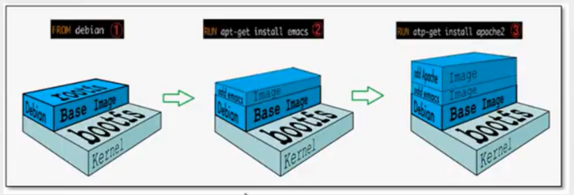

平时安装进虚拟机的CentOS都是好几个G，Docker才200M


对于一个精简的OS, rootfs可以很小,只需要包含最基本的命令,工具和程序库就可以了,因为底层直接用主机的kernel 自己只需要提供rootfs就可以了。由此可见对于不同的linux发行版, bootfs基本是一致的, rootfs会有差别,因此不同的发行版可以公用bootfs.  **虚拟机是分钟级别，容器是秒级！**

### 9.2 分层理解


所有的Docker镜像都起始于一个基础镜像层,当进行修改或增加新的内容时,就会在当前镜像层之上,创建新的镜像层。假如基于Ubuntu Linux 16.04创建一个新的镜像,这就是新镜像的第一层;如果在该镜像中添加Python包,就会在基础镜像层之上创建第二个镜像层;如果继续添加一个安全补丁,就会创建第三个镜像层。
该镜像当前已经包含3个镜像层,如下图所示

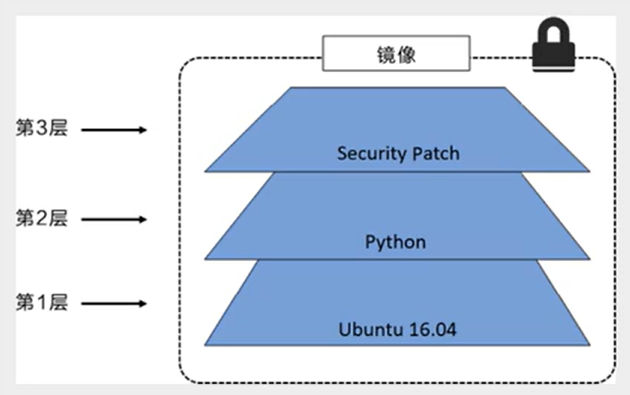

特点

+ Docker镜像都是只读的,当容器启动时,一个新的可写层被加载到镜像的顶部
  + 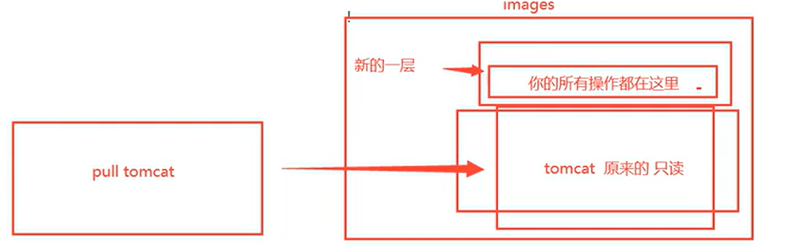

+ 这一层就是我们通常说的容器层，容器之下的都叫镜像层！
  + 

### 9.4 DockerFile

#### 9.4.1 DockerFile介绍

dockerfile 是用来构建dokcer镜像的文件！命令参数脚本！文本内容包含了一条条构建镜像所需的指令和说明。

构建步骤:

1. 编写一个 dockerfile 文件
2. docker build 构建成为一个镜像
3. docker run运行镜像
4. docker push发布镜像(DockerHub、阿里云镜像仓库!)

官方镜像都是基础包，很多功能没有，通常会自己搭建自己的镜像！

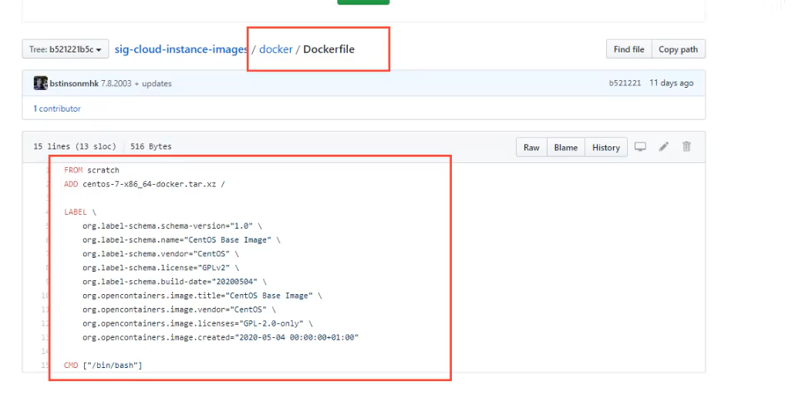

#### 9.4.2 DockerFile构建过程

**基础知识**

1、每个保留关键字（指令）都是必须是大写字母
2、执行从上到下顺序执行
3、#表示注释
4、每一个指令都会创建提交一个新的镜像层，并提交

如下图:

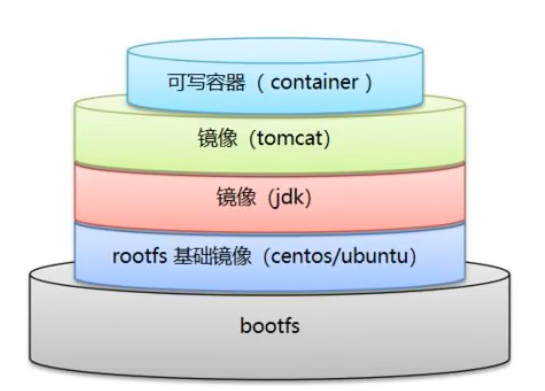

**Dockerfile(properties)**

创建自定义镜像就需要创建一个Dockerfile，如下为Dockerfile的语言

```shell
from: 指定当前自定义镜像依赖的环境 tocmat
copy: 将相对路径下的内容复制到自定义镜像中 /opt/springboot.jar
workdir: 声明镜像的默认工作目录 /opt/resource
run: 执行的命令，可以编写多个
cmd: 需要执行的命令（在workdir下执行的，cmd可以写多个，只以最后一个为准） java -jar

# 举个例子，制作SSM容器镜像，而且ssm.war要放在Dockerfile的同级目录下
from daocloud.io/library/tomcat:8.5.15-jre8
copy ssm.war /usr/local/tomcat/webapps
```

 **通过Dockerfile制作镜像**

编写完Dockerfile后需要通过命令将其制作为镜像，并且要在Dockerfile的当前目录下，之后即可在镜像中查看到指定的镜像信息，注意最后的 .

```shell
docker build -t 镜像名称[:tag] .
```

docker build 指令用来编译Dockerfile文件，默认的情况下 docker build 会在当前的上下文目录中查找Dockerfile文件进行编译

-f : 参数可以用来指定Dockerfile文件，如果文件名为Dockerfile，可以不加这一句`-f Dockerfile`

-t : 参数用来设置镜像的名字及标签

#### 9.4.3 DockerFile指令

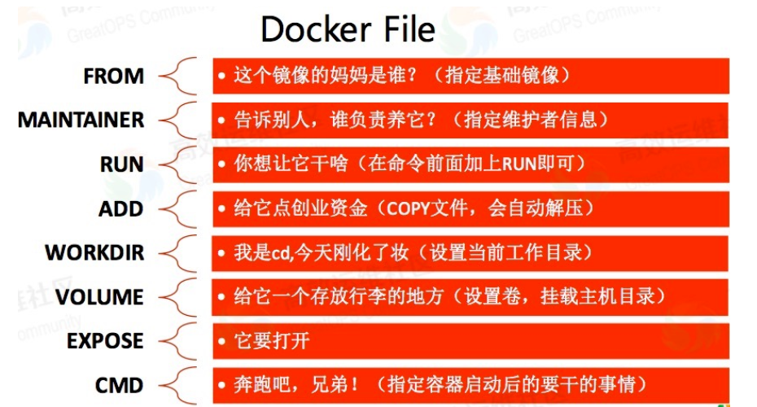

##### FROM

指定基础镜像。

```
FROM [image] # 使用 latest 版本
FROM [image:tag] # 使用指定版本
```

- 必须是已经存在的基础镜像
- 必须是第一条非注释指令

##### COPY

复制指令，从上下文目录中复制文件或者目录到容器里指定路径。

格式：

```plain
COPY [--chown=<user>:<group>] <源路径1>...  <目标路径>
COPY [--chown=<user>:<group>] ["<源路径1>",...  "<目标路径>"]
```

**[--chown=:]**：可选参数，用户改变复制到容器内文件的拥有者和属组。

**<源路径>**：源文件或者源目录，这里可以是通配符表达式，其通配符规则要满足 Go 的 filepath.Match 规则。例如：

```plain
COPY hom* /mydir/
COPY hom?.txt /mydir/
```

**<目标路径>**：容器内的指定路径，该路径不用事先建好，路径不存在的话，会自动创建。

##### ADD

ADD 指令和 COPY 的使用格式一致（同样需求下，官方推荐使用 COPY）。功能也类似，不同之处如下：

- ADD 的优点：在执行 <源文件> 为 tar 压缩文件的话，压缩格式为 gzip, bzip2 以及 xz 的情况下，会自动复制并解压到 <目标路径>。

- ADD 的缺点：在不解压的前提下，无法复制 tar 压缩文件。会令镜像构建缓存失效，从而可能会令镜像构建变得比较缓慢。具体是否使用，可以根据是否需要自动解压来决定。

##### CMD

类似于 RUN 指令，用于运行程序，但二者运行的时间点不同:

- CMD 在docker run 时运行。

- RUN 是在 docker build。

**作用**：为启动的容器指定默认要运行的程序，程序运行结束，容器也就结束。CMD 指令指定的程序可被 docker run 命令行参数中指定要运行的程序所覆盖。

**注意**：如果 Dockerfile 中如果存在多个 CMD 指令，仅最后一个生效。

格式：

```plain
CMD <shell 命令> 
CMD ["<可执行文件或命令>","<param1>","<param2>",...] 
CMD ["<param1>","<param2>",...]  # 该写法是为 ENTRYPOINT 指令指定的程序提供默认参数
```

推荐使用第二种格式，执行过程比较明确。第一种格式实际上在运行的过程中也会自动转换成第二种格式运行，并且默认可执行文件是 sh。

##### ENTRYPOINT

entrypoint类似于 CMD 指令，但其不会被 docker run 的命令行参数指定的指令所覆盖，而且这些命令行参数会被当作参数送给 ENTRYPOINT 指令指定的程序。

但是, 如果运行 docker run 时使用了 --entrypoint 选项，此选项的参数可当作要运行的程序覆盖 ENTRYPOINT 指令指定的程序。

**优点**：在执行 docker run 的时候可以指定 ENTRYPOINT 运行所需的参数。

**注意**：如果 Dockerfile 中如果存在多个 ENTRYPOINT 指令，仅最后一个生效。

格式：

```plain
ENTRYPOINT ["<executeable>","<param1>","<param2>",...]
```

可以搭配 CMD 命令使用：一般是变参才会使用 CMD ，这里的 CMD 等于是在给 ENTRYPOINT 传参，以下示例会提到。

**示例：**

假设已通过 Dockerfile 构建了 nginx:test 镜像：

```shell
FROM nginx

ENTRYPOINT ["nginx", "-c"] # 定参
CMD ["/etc/nginx/nginx.conf"] # 变参
```

1、不传参运行

```plain
$ docker run  nginx:test    # EPOSITORY：AG
```

容器内会默认运行以下命令，启动主进程。

```plain
nginx -c /etc/nginx/nginx.conf
```

2、传参运行

```plain
$ docker run  nginx:test -c /etc/nginx/new.conf
```

容器内会默认运行以下命令，启动主进程(/etc/nginx/new.conf:假设容器内已有此文件)

```plain
nginx -c /etc/nginx/new.conf
```

**示例2：**

```shell
#编写 dockerfile 文件
[root@kuangshen dockerfile]# vim dockerfile-cmd-test
FROM centos
CMD ["1s","-a"] #变参

# 想追加一个命令 -l    ls -al
[root@kuangshen dockerfile]# docker run dd8e4401d72f -l
docker: Error response from daemon: OCI runtime create failed: container_linux.go:349: starting
container process caused "exec: \"-1\": executable file not found in SPATH": unknown.
#cmd的清理下 -1 替换了CMD ["Is"，"-a"] 命令，-1 不是命令所以报错！
```

```shell
[root@kuangshen dockerfile]# cat dockerfile-cmd-entrypoint
FROM centos
ENTRYPOIT ["Is","-a"]  #定参

# 想追加一个命令 -l    ls -al
[root@kuangshen dockerfile]# docker run dd8e4401d72f -l
.dockerenv
bin
dev
etc
...
```

##### ENV

设置环境变量，定义了环境变量，那么在后续的指令中，就可以使用这个环境变量。

格式：

```plain
ENV <key> <value>
ENV <key1>=<value1> <key2>=<value2>...
```

以下示例设置 NODE_VERSION = 7.2.0 ， 在后续的指令中可以通过 $NODE_VERSION 引用：

```plain
ENV NODE_VERSION 7.2.0

RUN curl -SLO "https://nodejs.org/dist/v$NODE_VERSION/node-v$NODE_VERSION-linux-x64.tar.xz" \
  && curl -SLO "https://nodejs.org/dist/v$NODE_VERSION/SHASUMS256.txt.asc"
```

##### ARG

构建参数，与 ENV 作用一至。不过作用域不一样。ARG 设置的环境变量仅对 Dockerfile 内有效，也就是说只有 docker build 的过程中有效，构建好的镜像内不存在此环境变量。

构建命令 docker build 中可以用 --build-arg <参数名>=<值> 来覆盖。

格式：

```plain
ARG <参数名>[=<默认值>]
```

##### VOLUME

定义匿名数据卷。在启动容器时忘记挂载数据卷，会自动挂载到匿名卷。

作用：

- 避免重要的数据，因容器重启而丢失，这是非常致命的。

- 避免容器不断变大。

格式：

```plain
VOLUME ["<路径1>", "<路径2>"...]
VOLUME <路径>
```

在启动容器 docker run 的时候，我们可以通过 -v 参数修改挂载点。

##### EXPOSE

仅仅只是声明端口。

作用：

- 帮助镜像使用者理解这个镜像服务的守护端口，以方便配置映射。

- 在运行时使用随机端口映射时，也就是 docker run -P 时，会自动随机映射 EXPOSE 的端口。

格式：

```plain
EXPOSE <端口1> [<端口2>...]
```

##### WORKDIR

指定工作目录。用 WORKDIR 指定的工作目录，会在构建镜像的每一层中都存在。（WORKDIR 指定的工作目录，必须是提前创建好的）。

docker build 构建镜像过程中的，每一个 RUN 命令都是新建的一层。只有通过 WORKDIR 创建的目录才会一直存在。

格式：

```plain
WORKDIR <工作目录路径>
```

##### USER

用于指定执行后续命令的用户和用户组，这边只是切换后续命令执行的用户（用户和用户组必须提前已经存在）。

格式：

```plain
USER <用户名>[:<用户组>]
```

##### HEALTHCHECK

用于指定某个程序或者指令来监控 docker 容器服务的运行状态。

格式：

```shell
HEALTHCHECK [选项] CMD <命令>：设置检查容器健康状况的命令
HEALTHCHECK NONE：如果基础镜像有健康检查指令，使用这行可以屏蔽掉其健康检查指令

HEALTHCHECK [选项] CMD <命令> : 这边 CMD 后面跟随的命令使用，可以参考 CMD 的用法。
```

#### 9.4.4 案例

**例子1**

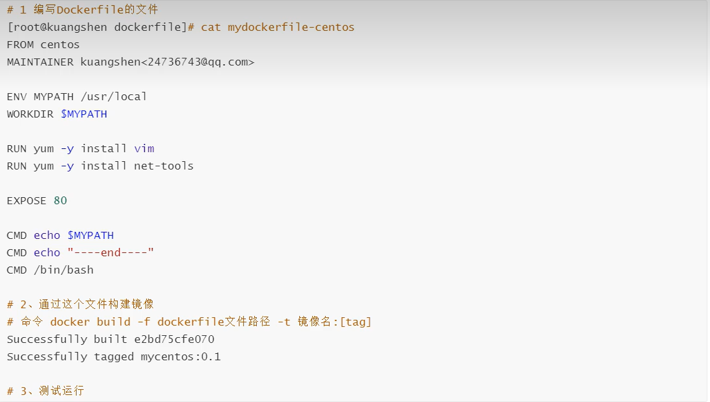

原生的centos

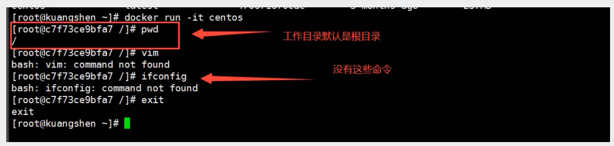

增加之后的镜像

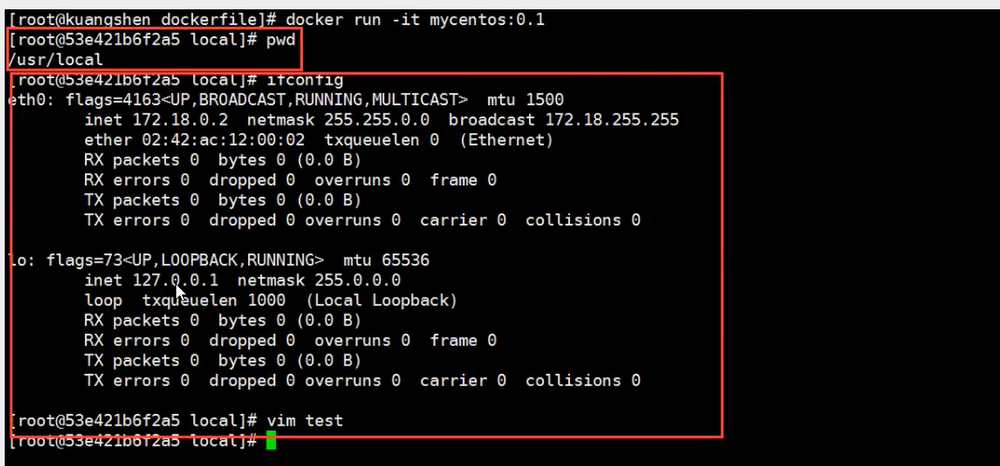

**例子2**

**1. 构建tomcat镜像, 创建一个tomcat文件夹放需要的文件**

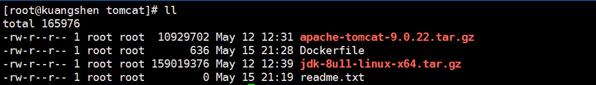

**2. 编写DockerFile**

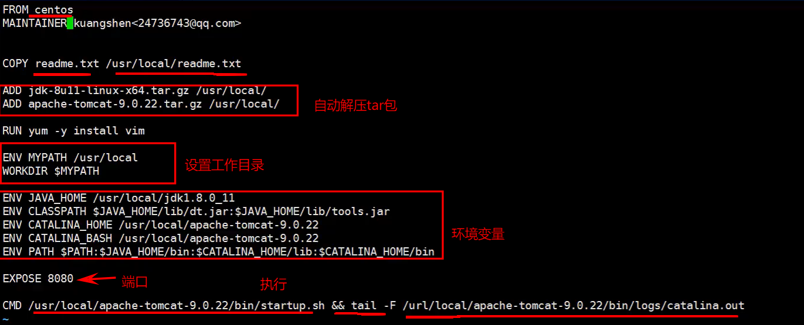

**3. 构建镜像**

-f 可以不加默认自动搜索 DockerFile文件

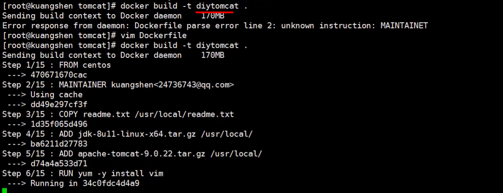

**4、 启动镜像**
**5、访问测试**
**6、发布项目(由于做了卷挂载,我们直接在本地编写项目就可以发布了!)**

启动容器,并进行卷挂载


可以在主机中挂载的目录里编写项目


效果


### 9.5 发布镜像

##### Docker Hub官网发布

> DockerHub

1、地址 https://hub.docker.com/注册的账号
2、在服务器上提交镜像

###### 登录 dockerHub

上传镜像之前，需要先登录docker：

```bash
$ docker login -u [user] -p [password]
```

######  将容器保存为镜像

```bash
$ docker commit [options] [container] [image:tag]

# 例如
$ docker commit -m "change" -a "quanzaiyu" server 731734107/test
```

以上命令, 将容器 server 以 quanzaiyu 为作者提交, 并保存为镜像 731734107/test

选项:

- `-m` `--message` 提交内容
- `-a` `--author` 作者

###### 给已有的镜像打标签

使用tag命令可以将镜像打标签：

```bash
$ docker tag [image:tag] [repo]/[image:tag]

# 例如
$ docker tag centos 731734107/test
```

###### 上传镜像

```bash
$ docker push 731734107/test
```

:::info
需要上传的镜像名需要以自己的用户名开头
:::

搜索镜像，发现已经有咯:

```bash
$ docker search 731734107
INDEX       NAME                       DESCRIPTION   STARS     OFFICIAL   AUTOMATED
docker.io   docker.io/731734107/test                 0
```

###### 查看容器文件的变动

```bash
$ docker diff [container]
```

可以看到文件的变更情况，其中：

- A 添加的文件
- C 修改的文件
- D 删除的文件

###### **退出**

退出 docker hub 可以使用以下命令：

```plain
$ docker logout
```

##### 阿里云镜像服务发布

> 阿里云镜像服务上

1、登录阿里云
2、找到容器镜像服务
3、创建命名空间

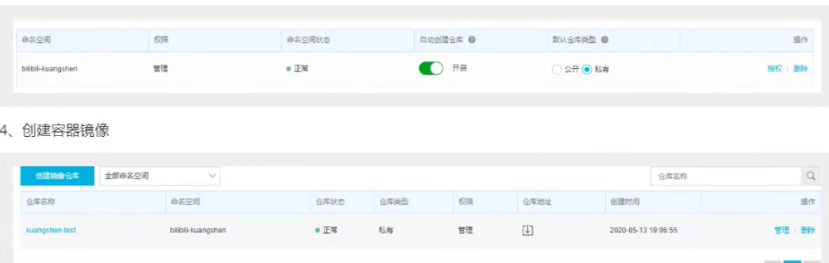

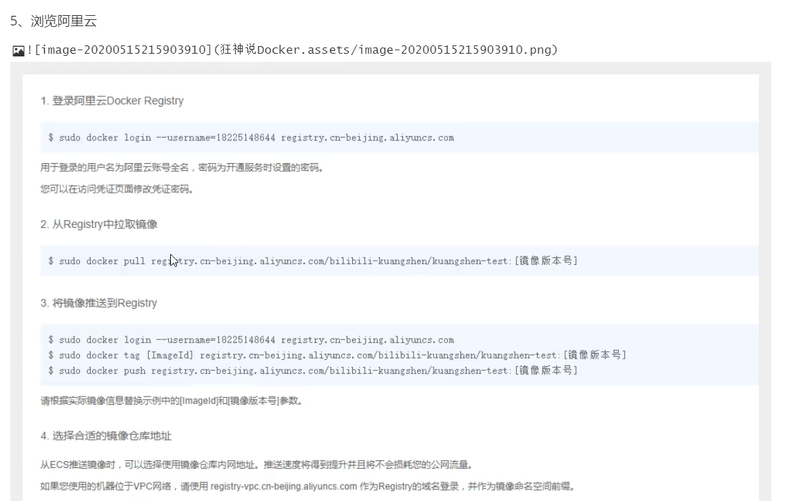


##### 例子

**登录**

登录需要输入用户名和密码，登录成功后，我们就可以从 docker hub 上拉取自己账号下的全部镜像。

```plain
$ docker login
```

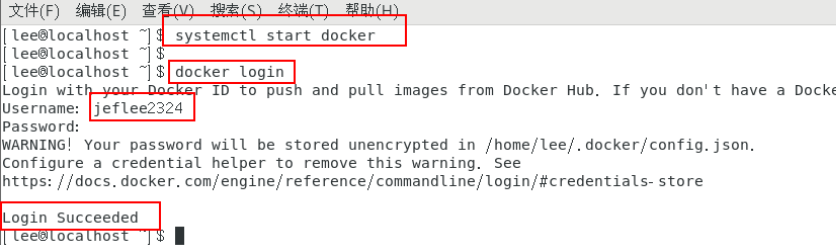

**推送镜像**

```shell
# 增加一个 tag
[root@kuangshen tomcat]# docker tag f8559daf1fc2 kuangshen/tomcat:1.0

# docker psuh上去即可
[root@kuangshen tomcat]# docker push kuangshen/tomcat:1.0
The push refers to repository [docker.io/kuangshen/tomcat]
fcc7fccb8e04: Preparing
b5577f344233: Preparing
bdcb94365850: Preparing
```

### 9.5 镜像构建:crossed_swords:

命令格式：

```bash
docker build -f Dockerfile -t imageName    # 使用Dockerfile进行镜像构建
docker build -f Dockerfile -t imageName .  # . 用于路径参数传递，标识当前路径
```

可以在 docker build 命令中使用 -f 标志指向文件系统中任何位置的 Dockerfile, 加上 -t 为构建的镜像打标签

```bash
docker build -t '731734107/test' -f /path/to/a/Dockerfile # 以指定路径的Dockerfile进行构建
```

如果 Docker 文件就在当前目录，则不需要显式指定Dockerfile的路径：

```bash
docker build -t "731734107/test" .
```

### 9.6 Spring Boot + Docker实战

**java**

```properties
# 端口号
server:
  port: 2001
```

controller

```java
@RequestMapping("/v1")
@RestController
public class HelloController {

	@Value("${server.port}")
	private int port;

	@GetMapping("")
	public String test() {
		return "invoke url /,port="+port;
	}

	@GetMapping("/test1")
	public String test1() {
		return "invoke url /test1,port="+port;
	}

	@GetMapping("/test2")
	public String test2() {
		return "invoke url /test2,port="+port;
	}
}
```

测试

```c
http://127.0.0.1:2001/v1
http://127.0.0.1:2001/v1/test1
http://127.0.0.1:2001/v1/test2
```

#### 1.编写DockerFile

```yml
# 该镜像需要依赖的基础镜像
# 使用 Amazon Corretto 17 (jdk17)作为基础镜像
FROM amazoncorretto:17
# 指定维护者的名字
MAINTAINER jindao "1665834268@qq.com"

# 将本地文件夹挂载到当前容器
# VOLUME ["/tmp"] 

# 使用东八区时间环境
RUN ln -sf /usr/share/zoneinfo/Asia/Shanghai /etc/localtime

# 将指定目录下的jar包复制到docker容器的/目录下
COPY /my-app.jar /app.jar

# CMD ["--server.port=8080"]
# 声明服务运行在8080端口
EXPOSE 2001:

# 切换WORKDIR
# WORKDIR /opt/web/

# 指定docker容器启动时运行jar包
ENTRYPOINT ["java","-jar","app.jar"]
```

#### 2.构建镜像

在构建前，请确保 **xxx.jar** 文件与**Dockerfile**在同一个目录

```shell
# 构建镜像laker-java:v1
docker build -t laker-java:v1 .
```

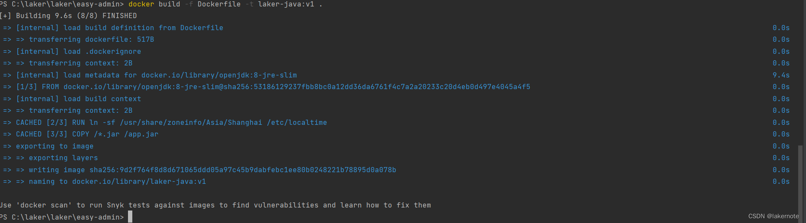

#### 3.查看编译的镜像

```bash
docker image ls 或者 docker images
```

#### 4.启动镜像测试

```bash
docker run -d -p 8080:2001 --name laker-v1 laker-java:v1
```

- -d 是后台运行
- -p 8080:8080 是端口映射 (宿主机端口:容器端口)
- –name laker-v1 给容器取 名字
- 最后跟的 laker-java:v1 是我打包好的镜像名称。

测试

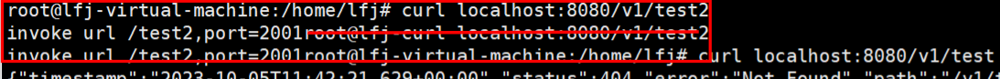


#### 5.创建私有仓库

// 没用直接用官方的方法

官方的Docker hub是一个用于管理公共镜像的好地方，我们可以在上面找到我们想要的镜像，也可以把我们自己的镜像推送上去。这个可以通过[开源软件](https://so.csdn.net/so/search?q=开源软件&spm=1001.2101.3001.7020)Registry来达成目的。

官方在**Docker hub**上提供了[registry](https://hub.docker.com/_/registry)的镜像，我们可以直接使用该registry镜像来构建一个容器，搭建我们自己的私有仓库服务。

##### 5.1查询registry镜像

```bash
docker search registry
```

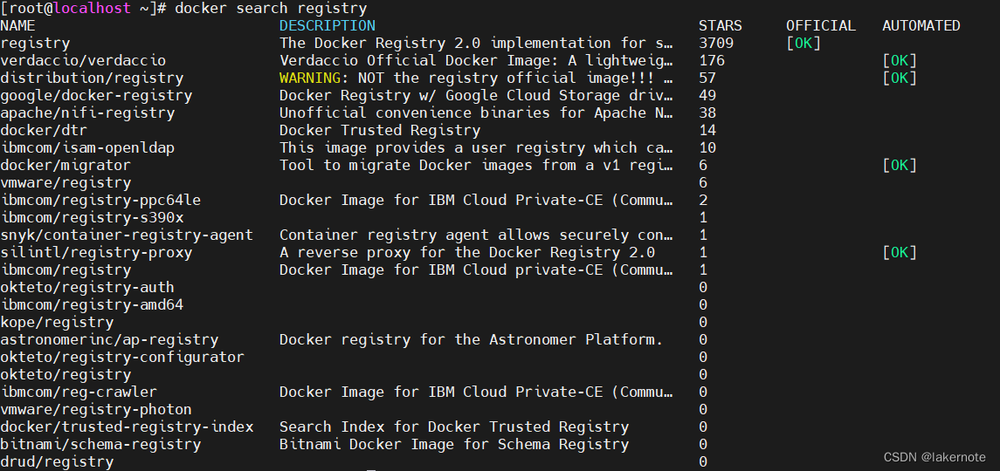

##### 5.2加载镜像

> 选用官方的第一个镜像，也是stars数最多的

```bash
docker pull registry
```

##### 5.3运行镜像容器

```bash
docker run -d \
 --name registry2 \
 --restart=always \
 -p 5000:5000 \
 -v /lfj/registry:/var/lib/registry \
 registry
```

- -d：后台运行
- –name registry2：指定容器名
- –restart=always：设置开机自动启动
- -p 5000:5000：端口映射宿主机，通过宿主机地址访问
- -v /laker/registry:/var/lib/registry：把镜像存储目录挂载到本地，方便管理和持久化，如果不加，重启后镜像都会丢失
- -v /laker/registry/srv-config.yml:/etc/docker/registry/config.yml：把配置文件挂载到本地，方便修改和保存

##### 5.4检查容器

**docker ps**

> docker ps -a 是查询所有状态的容器。


**检查仓库镜像信息**

```
curl -XGET http://127.0.0.1:5000/v2/_catalog
```


**也可以在浏览器上测试：**


#### 6.搭建Registry web

**地址**：https://hub.docker.com/r/[hyper](https://so.csdn.net/so/search?q=hyper&spm=1001.2101.3001.7020)/docker-registry-web

##### 6.1首先搜索并拉取镜像

```
docker search docker-registry-web
docker pull hyper/docker-registry-web　　　　# 这个镜像用的人较多
```

```
registry:
 url: http://10.224.77.100:5000/v2
 name: localhost:5000
 readonly: false
 auth:
   enabled: false
```


##### 6.2运行一个registry web容器

```bash
docker run -d \
	--name registry-web \
	--restart=always \
	-v /laker/registry-web/web-config.yml:/conf/config.yml:ro \
	-p 8000:8080 \
	hyper/docker-registry-web
```

##### 6.3验证

**在浏览器访问**：http://ip:8000


#### 7.推送镜像到私有仓库

创建好私有仓库之后，就可以使用 `docker tag` 来标记一个镜像，然后推送它到仓库。例如私有仓库地址为 `10.0.0.1:5000`。

```bash
# 重新标记镜像
docker tag laker-java:v1 10.0.0.1:5000/laker-java:v1
# 推送镜像
docker push 10.0.0.1:5000/laker-java:v1
```

**前提条件**

想让本网段的其他主机也能把镜像推送到私有仓库。你就得把例如 `10.0.0.1:5000` 这样的内网地址作为私有仓库地址，这时你会发现无法成功推送镜像。

这是因为 Docker 默认不允许非 `HTTPS` 方式推送镜像。我们可以通过 Docker 的配置选项来取消这个限制，或者查看下一节配置能够通过 `HTTPS` 访问的私有仓库。

请在 `/etc/docker/daemon.json` 中写入如下内容（如果文件不存在请新建该文件）

配置非https访问：

```
{
  "registry-mirror": [
    "https://hub-mirror.c.163.com",
    "https://mirror.baidubce.com"
  ],
  "insecure-registries": [
    "10.0.0.1:5000"
  ]
}
```

然后重启Docker

```bash
systemctl daemon-reload    # 守护进程重启
systemctl restart docker    # 重启docker服务
```

Windows系统在下图所示位置配置，注意要重启哦。


**推送截图示例**

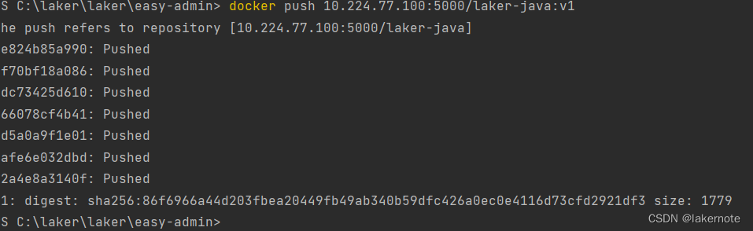

**可以在Registry Web上查看镜像。**


#### 8.服务器拉取镜像部署

```bash
docker pull 10.0.0.1:5000/laker-java:v1
```

**结果如下图**：

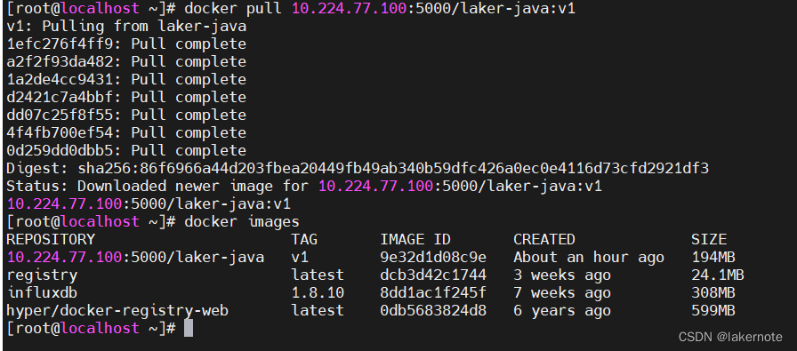

##### 8.1 资源限制

- 内存
- cpu
- 磁盘

在生产环境中，建议每个容器都添加相应的资源限制。下面给出一些执行`docker run`命令启动容器时可以传递的资源限制参数：

```css
  --cpus                          限制 CPU 配额
  -m, --memory                    限制内存配额
  --pids-limit                    限制容器的 PID 个数
```

例如我想要启动一个 1 核 2G 的容器，并且限制在容器内最多只能创建 1000 个 PID，启动命令如下：

```lua
$ docker run -it --cpus=1 -m=2048m --pids-limit=1000 busybox sh
```

推荐在生产环境中限制 CPU、内存、PID 等资源，这样即便应用程序有漏洞，也不会导致主机的资源完全耗尽，最大限度降低安全风险。

文章知识点与官方知识档案匹配，可进一步学习相关知识

## 十、Docker-Compose:crossed_swords: 【`重点`】

+ DockerCompose的作用是批量操作Docker容器，可以一键部署环境。

+ Docker Compose是一个工具，用于定义和运行多容器应用程序的工具；
+ Docker Compose通过yml文件定义多容器的docker应用；
+ Docker Compose通过一条命令根据yml文件的定义去创建或管理多容器；
+ 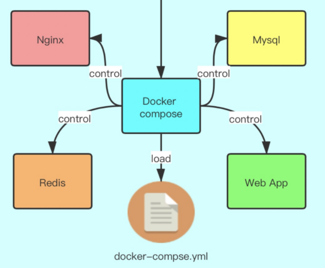

#### Docker Compose基本安装

[Docker Compose介绍和安装](https://blog.csdn.net/juanxiaseng0838/article/details/127553225)

+ 独立安装的Compose，不论是V1还是V2版本，指令都是docker-compose（中间是短横线）
+ 插件安装的Compose，在V2版本，指令是docker compose（中间是空格），最新版的docker安装时会自动以插件的形式安装docker compose
+ Docker Compose安装的最新的版本Docker Compose version v2.12.2，对于Mac和Windows安装好Docker以后，就已经安装好Docker Compose，不需要手动安装

**单独安装**

```shell
# 安装DockerCompose
sudo curl -L "https://github.com/docker/compose/releases/download/1.27.4/docker-compose-$(uname -s)-$(uname -m)" -o /usr/local/bin/docker-compose
# 或者
curl -SL "https://github.com/docker/compose/releases/download/v2.27.0/docker-compose-$(uname -s)-$(uname -m)" -o /usr/local/bin/docker-compose

# 分配权限
sudo chmod +x /usr/local/bin/docker-compose

# 查看版本
docker-compose --version

#卸载
sudo rm /usr/local/bin/docker-compose
```

**插件安装**

这里的安装方式是基于Linux的Cnetos的，可以参考[官方网站](https://docs.docker.com/compose/install/)去安装。

```shell
[root@localhost ~]# sudo yum install docker-compose-plugin
已加载插件：fastestmirror, langpacks
Loading mirror speeds from cached hostfile
 * base: mirror.lzu.edu.cn
 * extras: ftp.ksu.edu.tw
 * updates: mirror.lzu.edu.cn
正在解决依赖关系
--> 正在检查事务
---> 软件包 docker-compose-plugin.x86_64.0.2.12.2-3.el7 将被 安装
--> 解决依赖关系完成
```


#### Docker Compose基本命令

##### 一、up 

```bash
docker-compose up [options] [SERVICE...]
```

```shell
docker compose -f docker-compose.yml up -d
```

默认情况，如果服务容器已经存在，`docker-compose up` 将会尝试停止容器，然后重新创建（保持使用 `volumes-from` 挂载的卷），以保证新启动的服务匹配 `docker-compose.yml` 文件的最新内容。如果用户不希望容器被停止并重新创建，可以使用 `docker-compose up --no-recreate`。这样将只会启动处于停止状态的容器，而忽略已经运行的服务。如果用户只想重新部署某个服务，可以使用 `docker-compose up --no-deps -d <SERVICE_NAME>` 来重新创建服务并后台停止旧服务，启动新服务，并不会影响到其所依赖的服务。

**services** **可以选择只启动一个服务，默认启动所有的服务**

**参数说明：**

- **-d：**在后台运行服务容器。

- **--no-color：** 不使用颜色来区分不同的服务的控制台输出。

- **--no-deps：** 不启动服务所链接的容器。

- **--force-recreate：** 强制重新创建容器，不能与 `--no-recreate` 同时使用。

- **--no-recreate：** 如果容器已经存在了，则不重新创建，不能与 `--force-recreate` 同时使用。

- **--no-build：** 不自动构建缺失的服务镜像。

- **-t, --timeout TIMEOUT：** 停止容器时候的超时（默认为 10 秒）。

##### 二、top

```bash
docker-compose top [SERVICE...]
```

查看服务容器中的进程

**services** **可以选择只启动一个服务，默认启动所有的服务**

##### 三、stop

```bash
docker-compose stop [options] [SERVICE...]
```

停止已经处于运行状态的容器，但不删除它

**参数说明：**

- **-t, --timeout TIMEOUT：** 停止容器时候的超时（默认为 10 秒）

##### 四、start

```bash
docker-compose start [SERVICE...]
```

启动已经存在的服务容器。

##### 五、scale

```bash
docker-compose scale [options] [SERVICE=NUM...]
```

设置指定服务运行的容器个数。

```bash
docker-compose scale web=3 job=2
```

**参数说明：**

- **-t, --timeout TIMEOUT：** 停止容器时候的超时（默认为 10 秒）。

#####  六、run

```bash
docker-compose run [options] [-p PORT...] [-e KEY=VAL...] SERVICE [COMMAND] [ARGS...]
```

在指定服务上执行一个命令。

 **参数说明：**

- **-d：** 后台运行容器。

- **--name：** NAME 为容器指定一个名字。

- **--entrypoint：** CMD 覆盖默认的容器启动指令。

- **-e KEY=VAL：** 设置环境变量值，可多次使用选项来设置多个环境变量。

- **-u, --user=""：** 指定运行容器的用户名或者 uid。

- **--no-deps：** 不自动启动关联的服务容器。

- **--rm：** 运行命令后自动删除容器，`d` 模式下将忽略。

- **-p, --publish=[]：** 映射容器端口到本地主机。

- **--service-ports：** 配置服务端口并映射到本地主机。

- **-T：** 不分配伪 tty，意味着依赖 tty 的指令将无法运行。

##### 七、down

```bash
docker-compose down
```

此命令将会停止 up 命令所启动的容器，并移除网络

##### 八、images

```bash
docker-compose images
```

列出 Compose 文件中包含的镜像。

##### 九、logs

```bash
docker-compose logs [options] [SERVICE...]
```

查看容器的日志

**参数说明：**

- **-f：**跟踪日志输出

- **-t：**显示时间

- **--tail="num"：**显示最后的多少行日志

##### 十、ps

```bash
docker-compose ps [options] [SERVICE...]
```

列出项目中目前的所有容器。

**参数说明：**

- **-q：** 只打印容器的 ID 信息。

##### 十一、restart

```bash
docker-compose restart [options] [SERVICE...]
```

重启服务

##### 十二、rm

```bash
docker-compose rm [options] [SERVICE...]
```

删除容器

 **参数说明：**

- **-f, --force：** 强制直接删除，包括非停止状态的容器。一般尽量不要使用该选项。

- **-v：** 删除容器所挂载的数据卷。

##### 十三、help

Docker Compose命令基本上和Docker相差不多，主要就是对Docker Compose生命周期控制、日志格式等相关命令，可以通过docker-compose --help进行帮助。

```shell
[root@localhost ~]# docker compose --help
 
Usage:  docker compose [OPTIONS] COMMAND
 
Docker Compose
 
Options:
      --ansi string                Control when to print ANSI control characters ("never"|"always"|"auto") (default "auto")
      --compatibility              Run compose in backward compatibility mode
      --env-file string            Specify an alternate environment file.
  -f, --file stringArray           Compose configuration files
      --profile stringArray        Specify a profile to enable
      --project-directory string   Specify an alternate working directory
                                   (default: the path of the, first specified, Compose file)
  -p, --project-name string        Project name
 
Commands:
  build       Build or rebuild services
  convert     Converts the compose file to platform's canonical format
  cp          Copy files/folders between a service container and the local filesystem
  create      Creates containers for a service.
  down        Stop and remove containers, networks
  events      Receive real time events from containers.
  exec        Execute a command in a running container.
  images      List images used by the created containers
  kill        Force stop service containers.
  logs        View output from containers
  ls          List running compose projects
  pause       Pause services
  port        Print the public port for a port binding.
  ps          List containers
  pull        Pull service images
  push        Push service images
  restart     Restart service containers
  rm          Removes stopped service containers
  run         Run a one-off command on a service.
  start       Start services
  stop        Stop services
  top         Display the running processes
  unpause     Unpause services
  up          Create and start containers
  version     Show the Docker Compose version information
 
Run 'docker compose COMMAND --help' for more information on a command.
```

**使用**

```shell
docker compose -f docker-compose.yml up -d
```

##### 十四、例子

```shell
#构建建启动nignx容器
docker-compose up -d nginx
#进入nginx容器中
docker-compose exec nginx bash
#将会停止UP命令启动的容器，并删除容器
docker-compose down   
#显示所有容器
docker-compose ps 
#重新启动nginx容器
docker-compose restart nginx 
#构建镜像
docker-compose build nginx  
#不带缓存的构建
docker-compose build --no-cache nginx 
#查看nginx的日志
docker-compose logs  nginx 
#查看nginx的实时日志
docker-compose logs -f nginx
#验证（docker-compose.yml）文件配置，
#当配置正确时，不输出任何内容，当文件配置错误，输出错误信息
docker-compose config  -q
#以json的形式输出nginx的docker日志
docker-compose events --json nginx
#暂停nignx容器
docker-compose pause nginx
#恢复ningx容器
docker-compose unpause nginx
#删除容器
docker-compose rm nginx  
#停止nignx容器
docker-compose stop nginx   
#启动nignx容器
docker-compose start nginx
```

#### Docker-Compose模板文件

**image**
image是指定服务的镜像名称或镜像ID

```vbnet
services: 
    web: 
        image: hello-world 
```

**build**
利用Dockerfile自动构建镜像，然后使用镜像启动服务容器。

```cobol
build:
  context: ../
  dockerfile: path/of/Dockerfile 
```

**command**
使用command可以覆盖容器启动后默认执行的命令。

```bash
command: bundle exec thin -p 3000
```

**container_name**
指定自定义容器名称

```vbnet
container_name: app
```

**depends_on**
表示服务之间的依赖关系。

```cobol
version: "3"
services:
  web:
    build: .
    depends_on:
      - redis
  redis:
    image: redis
 
#docker compose up:按依赖顺序启动服务,redis在web之前启动。
#docker-compose stop:按依赖顺序停止服务,web在redis之前停止。
```

**pid**
将PID模式设置为主机PID模式，跟主机系统共享进程命名空间。

```vbnet
pid: "host"
```

**ports**
映射端口

```cobol
ports:
 - "8000"
 - "49022:22"
 - "127.0.0.1:8001:8001"
```

**extra_hosts**
添加主机名映射。使用与docker客户端–add-host类似

```cobol
extra_hosts:
 - "somehost:162.242.195.82"
 - "otherhost:50.31.209.229"
```

**volumes**
目录映射，可以直接使用 [主机:容器]格式，或者使用[主机:容器:ro]格式，后者对于容器来说，数据卷是只读的，可以有效保护宿主机的文件系统。

```cobol
volumes:
  # 只指定一个路径，Docker会自动在创建一个目录。
  - /var/lib/mysql
  # 主机使用绝对路径和容器目录映射
  - /opt/data:/var/lib/mysql
  # 以Compose配置文件的目录为中心的相对路径和容器目录映射
  - ./cache:/tmp/cache
  # 使用用户的相对路径（~/ 表示的目录是 /home/<用户目录>/ 或者 /root/）。
  - ~/configs:/etc/configs/:ro
```

**dns**
自定义DNS服务器。

```cobol
dns：8.8.8.8
dns：
    - 8.8.8.8    
    - 9.9.9.9
```

**dns_search**
配置DNS搜索域。

```cobol
dns_search：example.com
dns_search：
    - domain1.example.com
    - domain2.example.com
```

**entrypoint**
设置入口命令

```cobol
entrypoint: /code/entrypoint.sh
entrypoint: ["php", "-d", "memory_limit=-1", "vendor/bin/phpunit"]
entrypoint: java -jar penngo_test.jar
```

**env_file**
从文件添加环境变量

```cobol
env_file: .env
env_file:
  - ./common.env
  - ./apps/web.env
  - /opt/runtime_opts.env
```

**environment**
添加环境变量。

```cobol
environment:
  RACK_ENV: development
  SHOW: 'true'
  SESSION_SECRET:
 
environment:
  - RACK_ENV=development
  - SHOW=true
  - SESSION_SECRET
```

**external_links**
链接到docker-compose.yml外部的容器

```cobol
external_links:
  - redis_1
  - project_db_1:mysql
  - project_db_1:postgresql
```

**cap_add**
增加指定容器的内核能力（capacity）。

```cobol
cap_add:
    - ALL
```

**cap_drop**
去掉指定容器的内核能力（capacity）。

```vbnet
cap_drop:
    - NET_ADMIN
```

**cgroup_parent**
创建了一个cgroup组名称为cgroups_1:

```vbnet
cgroup_parent: cgroups_1
```

**devices**
指定设备映射关系

```vbnet
devices:
    - "/dev/ttyUSB1:/dev/ttyUSB0" 
```

**expose**
暴露端口，但不映射到宿主机，只允许能被连接的服务访问。

```cobol
expose:
    - "3000"
    - "8000" 
```

**labels**
为容器添加Docker元数据（metadata）信息。

```vbnet
labels:
- "com.example.description=Accounting webapp"
- "com.example.department=Finance"
- "com.example.label-with-empty-value"
```

**links**
链接到其它服务中的容器

```markdown
links:
    - db
    - db:database
    - redis
```

**log_driver**
指定日志驱动类型。目前支持三种日志驱动类型：

```vbnet
log_driver: "json-file"
log_driver: "syslog"
log_driver: "none" 
```

**log_opt**
日志驱动的相关参数。

**net**
设置网络模式。

```vbnet
net: "bridge"
net: "none"
net: "host"
```

```shell
mkdir prod
cd prod/
vim prometheus.yml
vim docker-compose.yml
```

```yml
version: "3"
services:
  mysql:
    image: mysql:latest
    container_name: mysql_slaver11
    restart: always
    privileged: true
    ports:
      - 3307:3306
    environment:
      MYSQL_ROOT_PASSWORD: 123456
      TZ: Asia/Shanghai
    volumes:
      - /wuming/mysql/slaver11/data:/var/lib/mysql
      - /wuming/mysql/slaver11/log:/var/log/mysql
      - /wuming/mysql/slaver11/conf/my.cnf:/etc/mysql/my.cnf
  mycat:
    image: manondidi/mycat:latest
    container_name: mycat
    restart: always
    ports:
      - 8066:8066
    volumes:
      - /wuming/mycat/conf:/usr/local/mycat/conf
      - /wuming/mycat/logs:/usr/local/mycat/logs
  redis:
    image: redis:latest
    container_name: redis_master
  
```

```shell
docker compose -f docker-compose.yml up -d
```

#### Docker Compose实战

[Docker Compose  (cnblogs.com)](https://www.cnblogs.com/wtzbk/p/15125977.html)

构建一个如下的应用，通过Nginx转发给后端的两个Java应用;

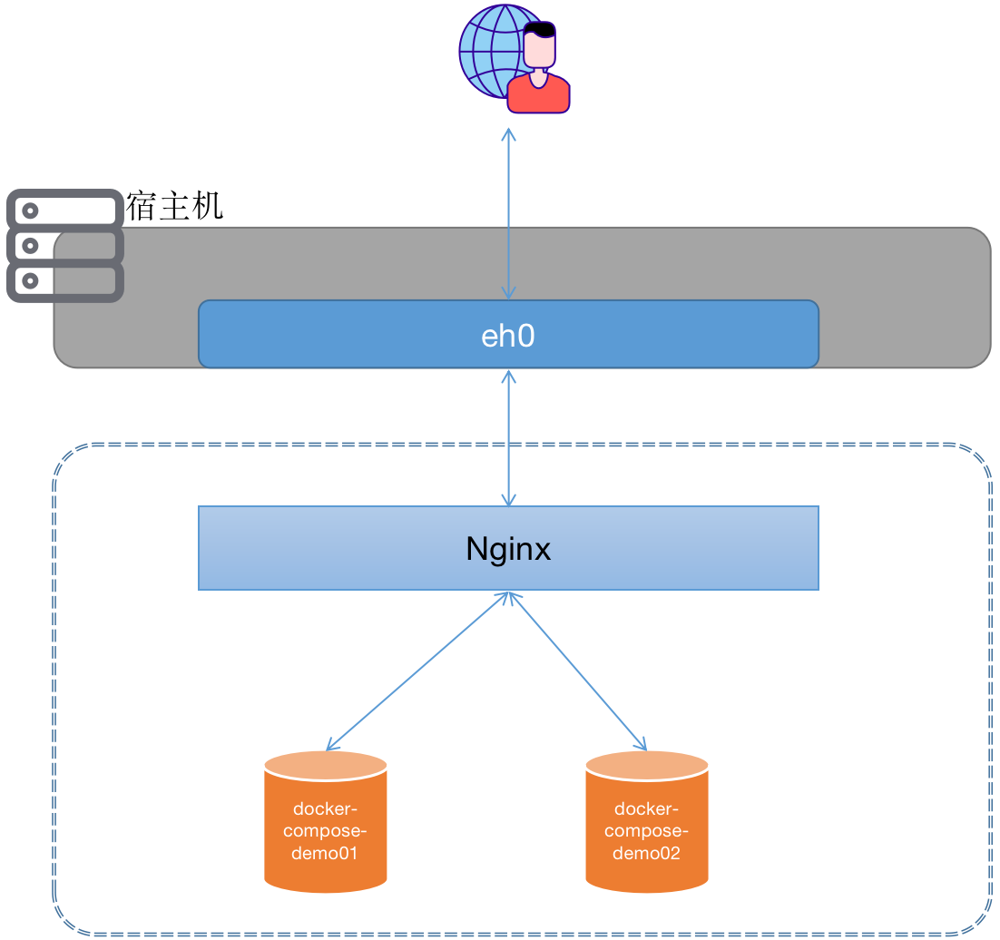

新建Spring Boot应用，增加一个HelloController，编写一个hello方法，返回请求的端口和IP；

```java
@RestController
public class HelloController {
	@GetMapping("/hello")
	public String hello() {
		return "hello";
	}
}
```


1. 打包Spring Boot应用；

```go
mvn clearn package
```

1. 上传文件到Linux服务器/usr/local/docker-compose-demo的目录；
2. 在/usr/local/docker-compose-demo的目录编辑Dockerfile；

```dockerfile
#指定基础镜像
FROM java:8
LABEL name="docker-compose-demo" version="1.0" author="wtz"
COPY ./getway-1.0-SNAPSHOT.jar ./docker-compose-demo.jar
#启动参数
CMD ["java","-jar","docker-compose-demo.jar"]
```

1. 编辑docker-compose.yml文件；

```yaml
version: '3.8'
services:
  nginx:
    restart: always
    image: daocloud.io/library/nginx:latest
    container_name: nginx
    ports:
      - 3389:80

  docker-compose-demo01:
    build:
      # 构建的地址
      context: /root/docker-compose-demo
      dockerfile: Dockerfile
    image: docker-compose-demo
    container_name: docker-compose-demo01
    # 选择端口
    ports:
      - 8081:8080/tcp
    restart: always

  docker-compose-demo02:
    build:
      # 构建的地址
      context: /root/docker-compose-demo
      dockerfile: Dockerfile
    image: docker-compose-demo
    container_name: docker-compose-demo02
    # 选择端口
    ports:
      - 8082:8080/tcp
    restart: always
```

1. 编写nginx.conf，实现负载均衡到每个应用，这里通过容器名称访问，因此不需要管每个容器的ip是多少，这个也是自定义网络的好处；

```bash
user nginx;
worker_processes  1;
events {
    worker_connections  1024;
}
http {
    include       /etc/nginx/mime.types;
    default_type  application/octet-stream;
    sendfile        on;
    keepalive_timeout  65;

server {
    listen 80;
    location / {
     proxy_pass http://docker-compose-demo;
     proxy_set_header  Host $host;
	     proxy_set_header  X-real-ip $remote_addr;
	     proxy_set_header  X-Forwarded-For $proxy_add_x_forwarded_for;
    }
}

upstream docker-compose-demo{
   server docker-compose-demo01:8080;
   server docker-compose-demo02:8080;
}
include /etc/nginx/conf.d/*.conf;


server {
    listen 80;
    location / {
     proxy_pass http://docker-compose-demo;
     proxy_set_header  Host $host;
	     proxy_set_header  X-real-ip $remote_addr;
	     proxy_set_header  X-Forwarded-For $proxy_add_x_forwarded_for;
    }
}

upstream docker-compose-demo{
   server docker-compose-demo01:8080;
   server docker-compose-demo02:8080;
}
include /etc/nginx/conf.d/*.conf;
}
```

1. 查看/usr/local/docker-compose-demo目录，有以下确保有以下四个文件；


1. 检查docker-compose.yml的语法是否正确，如果不发生报错，说明语法没有发生错误;

```lua
docker-compose config
```

1. 启动docker-compose.yml定义的服务；

```x86asm
docker-compose up
```


1. 验证服务是否正确；

```csharp
#查看宿主机ip
ip add

#访问对应的服务
curl http://172.21.122.231/hello
```

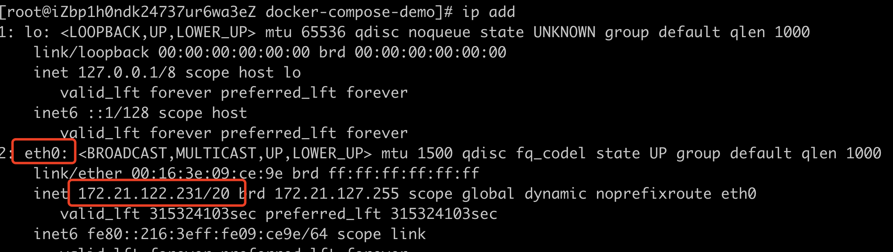

#### 实战2

当你的应用需要多个容器协同工作时，可以使用Docker Compose来简化管理。例如，一个Web应用可能需要一个Web服务器容器和一个数据库容器。

**编写`docker-compose.yml`文件**

```yaml
version: '3'

services:
  web:
    image: my-web-app
    ports:
      - "80:80"
  db:
    image: mysql
    environment:
      MYSQL_ROOT_PASSWORD: my-secret-pw
```

 使用Docker Compose

**启动所有服务：**

```text
docker-compose up -d
```

**停止所有服务：**

```text
docker-compose down
```

## 十一、Docker CI、CD

### 11.1 CI、CD引言

项目部署

- 将项目通过maven进行编译打包
- 将文件上传到指定的服务器中
- 将war包放到tomcat的目录中
- 通过Dockerfile将Tomcat和war包转成一个镜像，由DockerCompose去运行容器

项目更新后，需要将上述流程再次的从头到尾的执行一次，如果每次更新一次都执行一次上述操作，很费时，费力。我们就可以通过CI、CD帮助我们实现持续集成，持续交付和部署。

### 11.2 CI介绍

CI（continuous intergration）持续集成

持续集成：编写代码时，完成了一个功能后，立即提交代码到Git仓库中，将项目重新的构建并且测试。

- 快速发现错误。
- 防止代码偏离主分支。

####  搭建Gitlab服务器

实现CI，需要使用到Gitlab远程仓库，先通过Docker搭建Gitlab,安装Docker以及Docker-Compose

##### 1. 修改ssh的22端口

将ssh的默认22端口，修改为60022端口，因为Gitlab需要占用22端口

```shell
vi /etc/ssh/sshd_config
  PORT 22 -> 60022
systemctl restart sshd
```

##### 2. 编写docker-compose.yml

使用 [twang2218/gitlab-ce-zh: GitLab Community Edition (中文社区版) (github.com)](https://github.com/twang2218/gitlab-ce-zh)

docker-compose.yml文件去安装gitlab（下载和运行的时间比较长的）

```yml
version: '3.1'
services:
 gitlab:
  image: 'twang2218/gitlab-ce-zh:11.1.4'
  container_name: "gitlab"
  restart: always
  privileged: true
  hostname: 'gitlab'
  environment:
   TZ: 'Asia/Shanghai'
   GITLAB_OMNIBUS_CONFIG: |
    external_url 'http://192.168.199.110'
    gitlab_rails['time_zone'] = 'Asia/Shanghai'
    gitlab_rails['smtp_enable'] = true
    gitlab_rails['gitlab_shell_ssh_port'] = 22
  ports:
   - '80:80'
   - '443:443'
   - '22:22'
  volumes:
   - /opt/docker_gitlab/config:/etc/gitlab
   - /opt/docker_gitlab/data:/var/opt/gitlab
   - /opt/docker_gitlab/logs:/var/log/gitlab
```

```shell
docker compose -f docker-compose.yml up -d
```

##### 3. 搭建GitlabRunner

查看资料中的gitlab-runner文件即可安装

```
docker pull bitnami/gitlab-runner
```

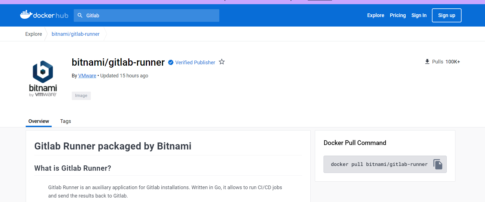

#### 整合项目测试

##### 创建项目

> 创建maven工程，添加web.xml文件，编写html页面

#####  编写.gitlab-ci.yml

> 编写[.gitlab-ci.yml](https://blog.csdn.net/yinying293/article/details/130836507)文件

```
stages:
  - test

test:
  stage: test
  script:
    - echo first test ci   # 输入的命令
```

#####  将maven工程推送到gitlab中

> 执行git命令推送到Gitlab

```sh
git push origin master
```

##### 查看效果

> 可以在gitlab中查看到gitlab-ci.yml编写的内容

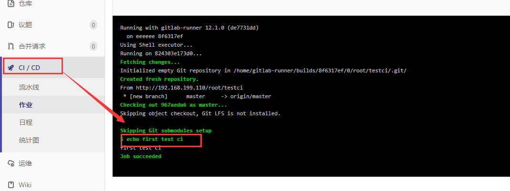

####  完善项目配置

> 添加Dockerfile以及docker-compose.yml， 并修改[.gitlab-ci.yml](https://blog.csdn.net/yinying293/article/details/130836507)文件

##### 创建Dockerfile

```
# Dockerfile
FROM daocloud.io/library/tomcat:8.5.15-jre8
COPY testci.war /usr/local/tomcat/webapps
```

##### 创建docker-compose.yml

```yml
# docker-compose.yml
version: "3.1"
services:
  testci:
    build: docker
    restart: always
    container_name: testci
    ports:
      - 8080:8080
```

##### 修改.gitlab-ci.yml

```
# ci.yml
stages:
  - test

test:
  stage: test
  script:
    - echo first test ci
    - /usr/local/maven/apache-maven-3.6.3/bin/mvn package
    - cp target/testci-1.0-SNAPSHOT.war docker/testci.war
    - docker-compose down
    - docker-compose up -d --build
    - docker rmi $(docker images -qf dangling=true)
```


| 测试效果                                                     |
| ------------------------------------------------------------ |
|  |

### 11.3 CD介绍

CD（持续交付，持续部署）

持续交付：将代码交付给专业的测试团队去测试

持续部署：可以直接将指定好tag的代码直接部署到生产环境中

| CICD图                                         |
| ---------------------------------------------- |
|  |


####  安装Jenkins

##### 编写docker-compose.yml

官网：https://www.jenkins.io/

```yaml
version: "3.1"
services:
  jenkins:
   image: jenkins/jenkins
   restart: always
   container_name: jenkins
   ports:
     - 8888:8080
     - 50000:50000
   volumes:
     - ./data:/var/jenkins_home
```

#####  运行并访问Jenkins

第一次运行时，会因为data目录没有权限，导致启动失败

```plain
chmod 777 data
```

访问http://192.168.199.109:8888

访问成功后，需要输入密码，可在日志中查看


手动指定插件安装：指定下面两个插件即可

 publish ssh.

 git param.


安装成功后，需要指定上用户名和密码，登陆成功

 

####  配置Jenkins的目标服务器

执行过程为代码提交到Gitlab，Jenkins会从Gitlab中拉取代码，并在Jenkins中打包并发布到目标服务器中。

###### 点击左侧的系统设置

| 左侧导航                                                     |
| ------------------------------------------------------------ |
|  |

###### 选中中间区域的系统设置

| 系统设置                                                     |
| ------------------------------------------------------------ |
|  |

###### 搜索Publish over SSH

| Publish over SSH                                             |
| ------------------------------------------------------------ |
|  |

###### 点击上图新增

| 新增SSH连接                                                  |
| ------------------------------------------------------------ |
| 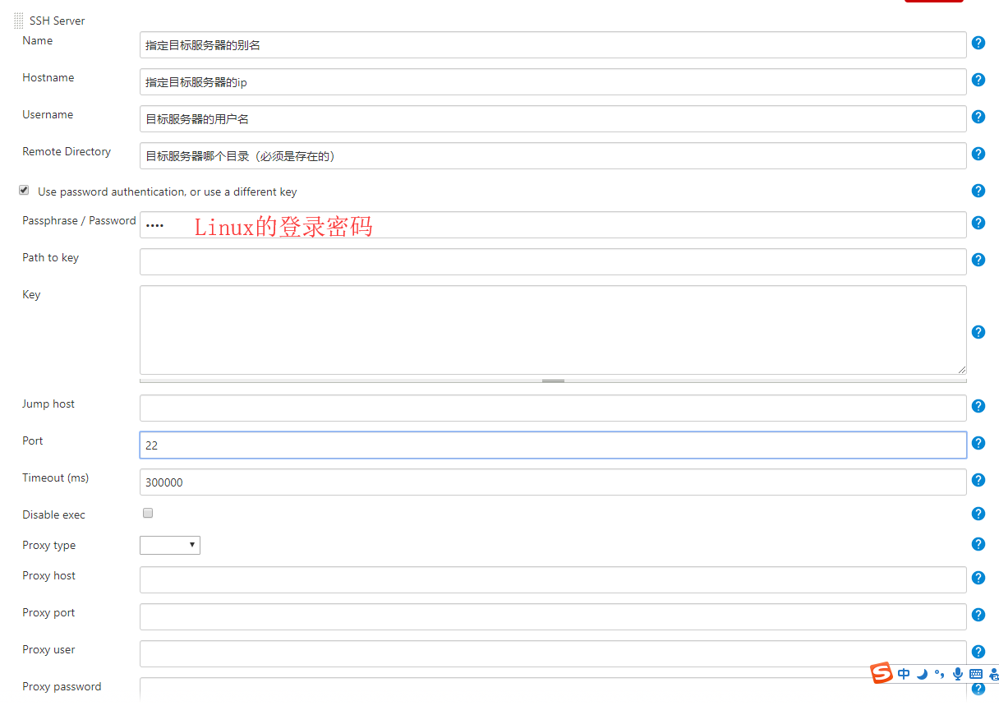 |

#### 配置GitLab免密码登录

链接Gitlab需要使用密码，我们可以通过SSH的方式，免密码登陆Gitlab拉取代码，避免每次都输入密码。

###### 登录Jenkins容器内部

```plain
docker exec -it jenkins bash
```

###### 输入生成SSH秘钥命令

```plain
ssh-keygen -t rsa -C "邮箱（随便写）"
```

######  将秘钥复制到GitLab的SSH中

| 配置密钥                                                     |
| ------------------------------------------------------------ |
| 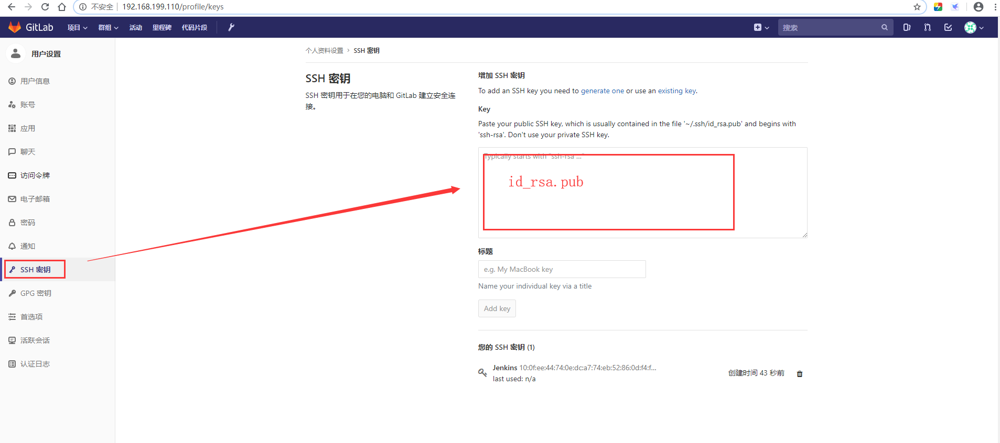 |

#####  配置JDK和Maven

我们需要再Jenkins中将代码打包，需要依赖JDK和Maven的环境

######  复制软件到data目录下

| 效果                                                         |
| ------------------------------------------------------------ |
| 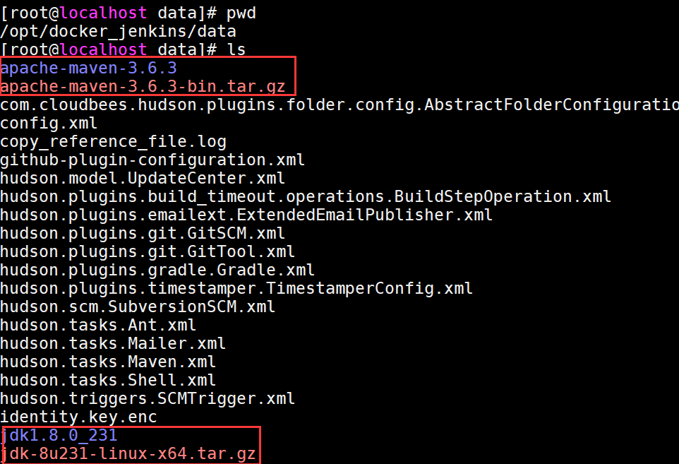 |

######  在监控界面中配置JDK和Maven

| 配置环境变量                                                 |
| ------------------------------------------------------------ |
| 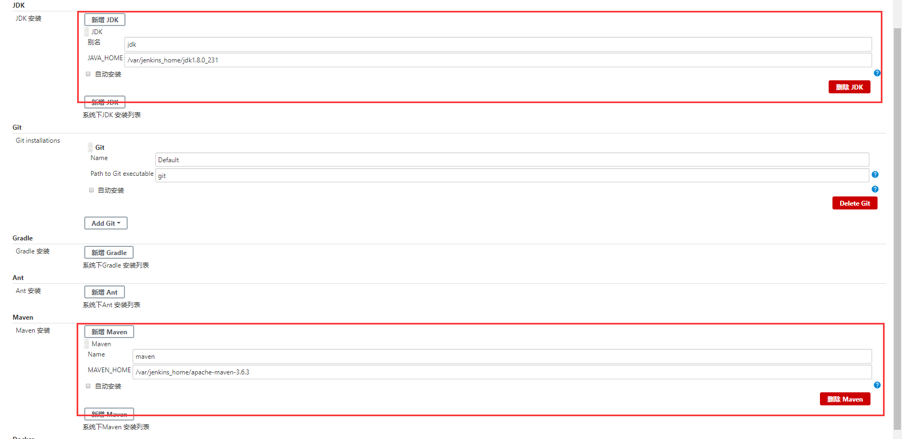 |

###### 手动拉取gitlab项目


使用SSH无密码连接时，第一次连接需要手动确定

| 手动拉取一次                                                 |
| ------------------------------------------------------------ |
| 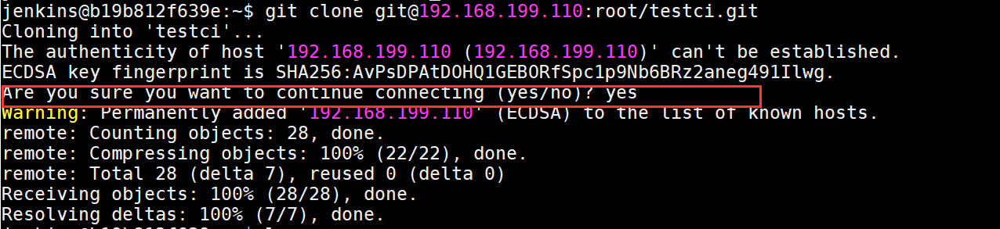 |


####  创建maven任务

实现通过Jenkins的Maven任务，自动去Gitlab拉取代码，并在本地打包，发布到目标服务器上

###### 创建maven工程，推送到GitLab中

随便创建一个即可……


###### Jenkins的监控页面中创建maven任务

| 指定GitLab地址                                               |
| ------------------------------------------------------------ |
| 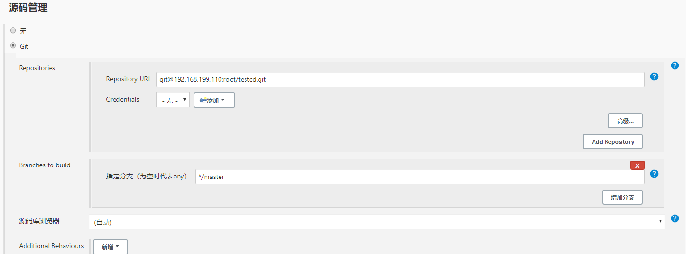 |

| 指定maven打包方式                                            |
| ------------------------------------------------------------ |
| 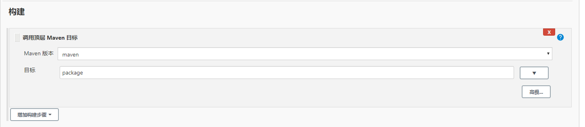 |

###### 执行maven任务

| 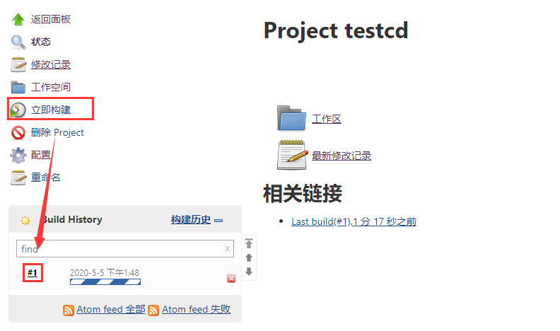 |
| ------------------------------------------------------------ |
|                                                              |

| 控制台查看日志信息                                           |
| ------------------------------------------------------------ |
|  |


#### 实现持续交付持续部署

###### 安装Persistent Parameter的插件

| 安装插件                                                     |
| ------------------------------------------------------------ |
| 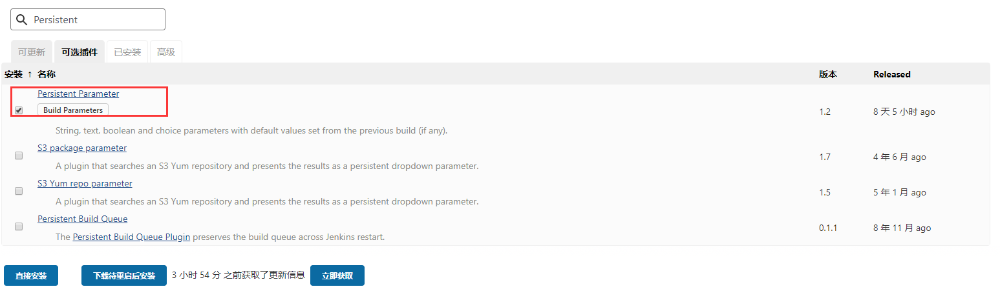 |


###### 重新指定构建项目的方式

| 根据标签构建项目                                             |
| ------------------------------------------------------------ |
|  |

| 自定义构建                                                   |
| ------------------------------------------------------------ |
| 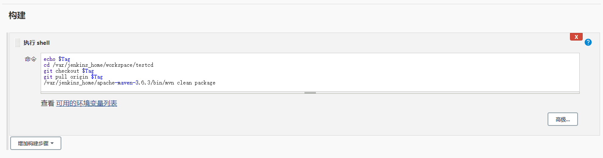 |


###### 构建项目成功后，需要将内容发布到目标服务器

| 发布服务器后执行的命令                                       |
| ------------------------------------------------------------ |
| 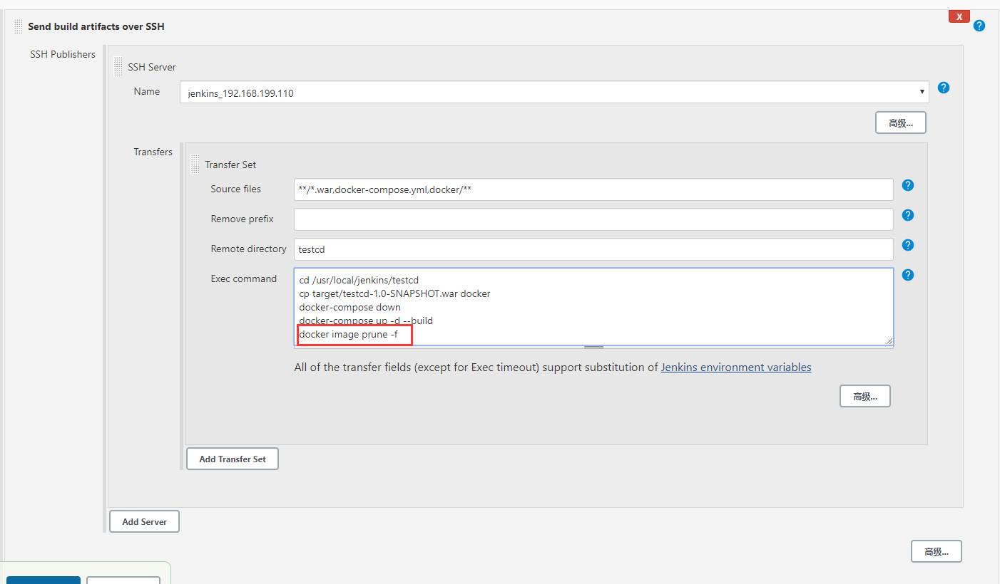 |

###### 添加程序代码

```yaml
# Dockerfile 文件
FROM daocloud.io/library/tomcat:8.5.15-jre8
COPY testcd-1.0-SNAPSHOT.war /usr/local/tomcat/webapps

# docker-compose.yml文件
version: "3.1"
services:
  testcd:
    build: docker
    restart: always
    container_name: testcd
    ports:
      - 8081:8080
```

######  测试

| 根据标签修改发布版本                                         |
| ------------------------------------------------------------ |
| 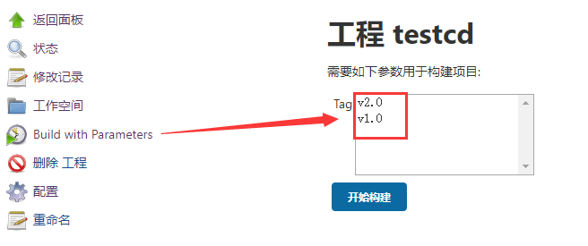 |

#  参考

 * [📃 Docker Compose的使用](%F0%9F%93%83%20Docker%20Compose%E7%9A%84%E4%BD%BF%E7%94%A8.md)
 * [📃 常见错误解决方案](%F0%9F%93%83%20%E5%B8%B8%E8%A7%81%E9%94%99%E8%AF%AF%E8%A7%A3%E5%86%B3%E6%96%B9%E6%A1%88.md)
 * [📃 深入阅读：Docker网络](%F0%9F%93%83%20%E6%B7%B1%E5%85%A5%E9%98%85%E8%AF%BB%EF%BC%9ADocker%E7%BD%91%E7%BB%9C.md)


