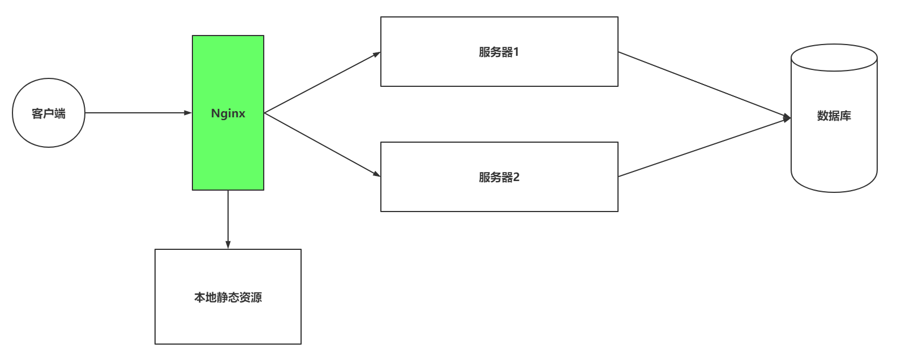
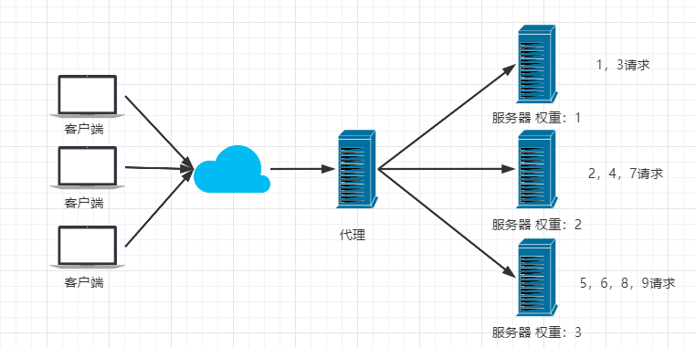
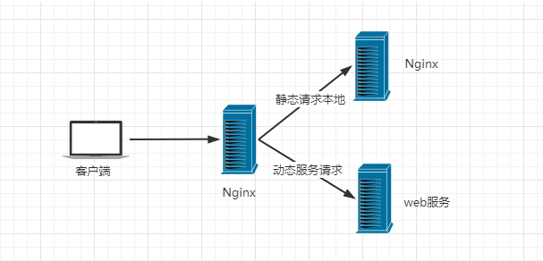
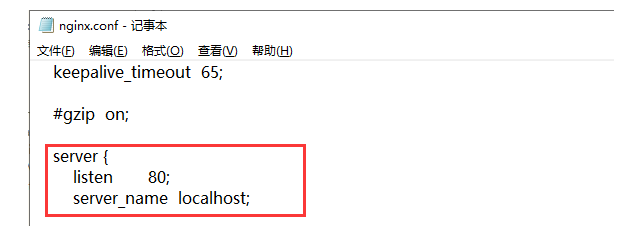
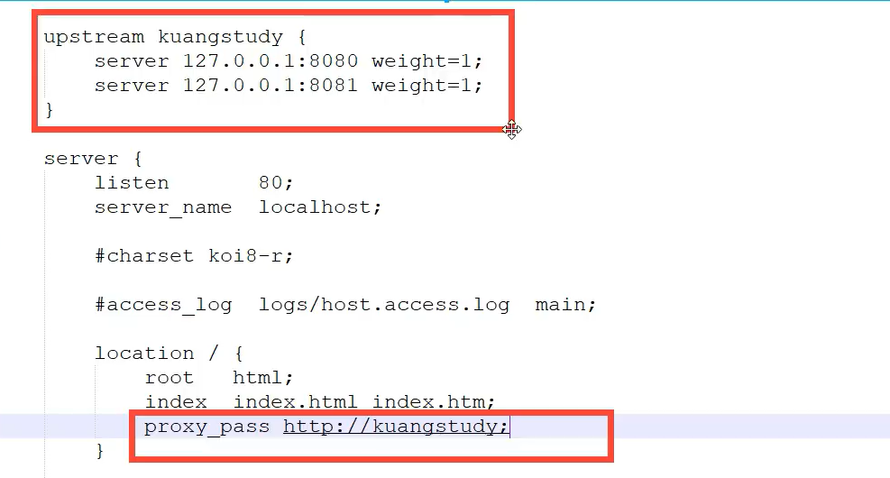
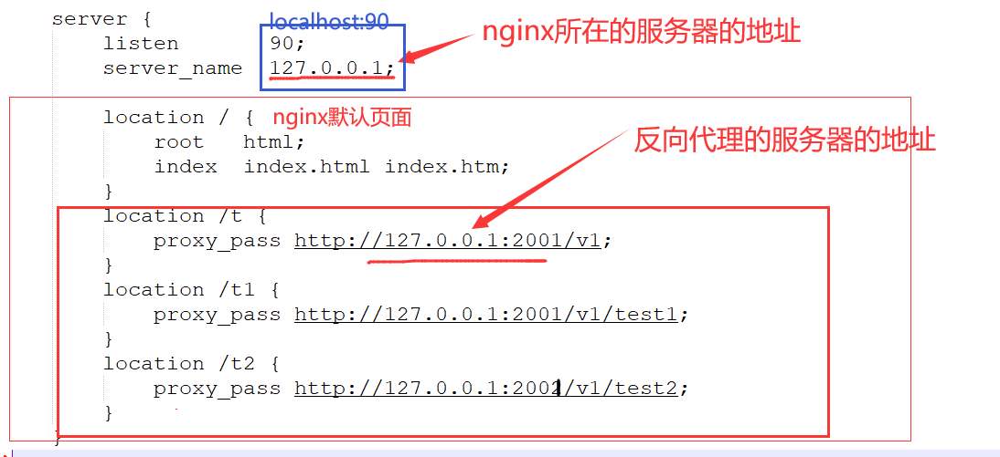
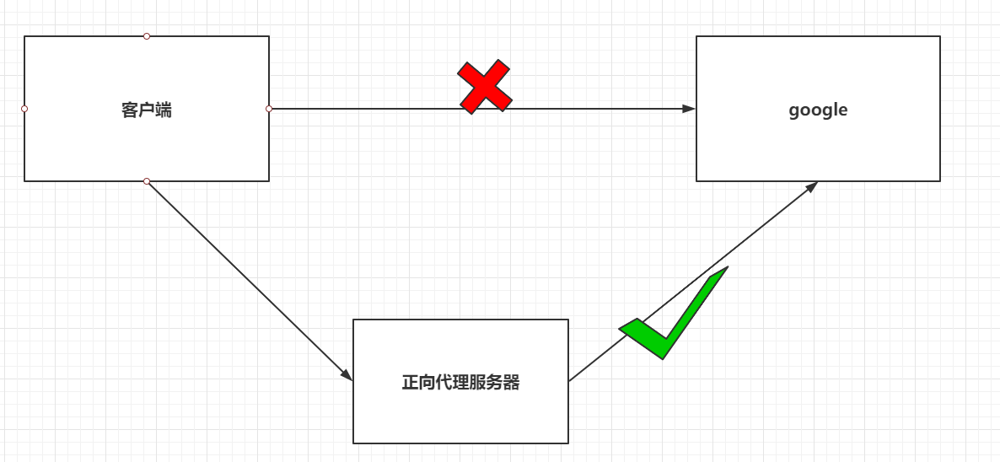

# Nginx高性能服务

## 一、引言

### 1.1 代理问题

客户端到底要将请求发送给哪台服务器。

| 发送给服务器1还是服务器2                                     |
| ------------------------------------------------------------ |
|  |

### 1.2 负载均衡问题

如果所有客户端的请求都发送给了服务器1，那么服务器2将没有任何意义

| 负载均衡问题                                                 |
| ------------------------------------------------------------ |
| 服务器1访问数据库客户端服务器2 |

### 1.3 资源优化

客户端发送的请求可能是申请动态资源的，也有申请静态资源，但是都是去Tomcat中获取的

| 静态资源访问                                                 |
| ------------------------------------------------------------ |
| 客户端数据库服务器1本地静态资源 |

### 1.4 Nginx处理

| 在搭建集群后，使用Nginx                                      |
| ------------------------------------------------------------ |
|  |

## 二、Nginx概述

Nginx是由俄罗斯人研发的，应对Rambler的网站，并且2004年发布的第一个版本。

Nginx (engine x) 是一个高性能的HTTP和反向代理web服务器，同时也提供了IMAP/POP3/SMTP服务。Nginx是由伊戈尔·赛索耶夫为俄罗斯访问量第二的Rambler.ru站点（俄文：Рамблер）开发的，第一个公开版本0.1.0发布于2004年10月4日。2011年6月1日，nginx 1.0.4发布。

其特点是占有内存少，并发能力强，事实上nginx的并发能力在同类型的网页服务器中表现较好，中国大陆使用nginx网站用户有：百度、京东、新浪、网易、腾讯、淘宝等。在全球活跃的网站中有12.18%的使用比率，大约为2220万个网站。

Nginx 是一个安装非常的简单、配置文件非常简洁（还能够支持perl语法）、Bug非常少的服务。Nginx 启动特别容易，并且几乎可以做到7*24不间断运行，即使运行数个月也不需要重新启动。你还能够不间断服务的情况下进行软件版本的升级。

Nginx代码完全用C语言从头写成。官方数据测试表明能够支持高达 50,000 个并发连接数的响应。

### 2.1 Nginx的特点

+ 稳定性极强。 7*24小时不间断运行。
+ Nginx提供了非常丰富的配置实例。
+ 占用内存小，并发能力强。

| Nginx引入前后,客户端请求处理流程的对比                       |
| ------------------------------------------------------------ |
|  |

### 2.2 Nginx作用

> Http代理，反向代理：作为web服务器最常用的功能之一，尤其是反向代理。

**正向代理:  代理客户端**

**反向代理:  代理服务端**


> Nginx提供的负载均衡策略有2种：内置策略和扩展策略。内置策略为轮询，加权轮询，Ip hash。扩展策略，就天马行空，只有你想不到的没有他做不到的。

轮询

加权轮询

iphash对客户端请求的ip进行hash操作，然后根据hash结果将同一个客户端ip的请求分发给同一台服务器进行处理，可以解决session不共享的问题。


> 动静分离，在我们的软件开发中，有些请求是需要后台处理的，有些请求是不需要经过后台处理的（如：css、html、jpg、js等等文件），这些不需要经过后台处理的文件称为静态文件。让动态网站里的动态网页根据一定规则把不变的资源和经常变的资源区分开来，动静资源做好了拆分以后，我们就可以根据静态资源的特点将其做缓存操作。提高资源响应的速度。



目前，通过使用Nginx大大提高了我们网站的响应速度，优化了用户体验，让网站的健壮性更上一层楼！软件层面一般常用Nginx来做反向代理服务器，它的性能非常好，用来做负载均衡。

## 三、Nginx的安装

### 3.1 windows下安装并使用

**1、下载nginx**

http://nginx.org/en/download.html 下载稳定版本。
以nginx/Windows-1.16.1为例，直接下载 nginx-1.16.1.zip。
下载后解压，解压后如下：


**2、启动nginx**

有很多种方法启动nginx

(1)直接双击nginx.exe，双击后一个黑色的弹窗一闪而过

(2)打开cmd命令窗口，切换到nginx解压目录下，输入命令 `nginx.exe` ，回车即可

**3、检查nginx是否启动成功**

直接在浏览器地址栏输入网址 [http://localhost:80](http://localhost/) 回车，出现以下页面说明启动成功！


**4、配置监听**

nginx的配置文件是conf目录下的nginx.conf，默认配置的nginx监听的端口为80，如果80端口被占用可以修改为未被占用的端口即可。



当我们修改了nginx的配置文件nginx.conf 时，不需要关闭nginx后重新启动nginx，只需要执行命令

```
 nginx -s reload 即可让改动生效
```

**5、关闭nginx**

如果使用cmd命令窗口启动nginx， 关闭cmd窗口是不能结束nginx进程的，可使用两种方法关闭nginx

(1)输入nginx命令 

```
nginx -s stop(快速停止nginx) 或 nginx -s quit(完整有序的停止nginx)
```

(2)使用taskkill `taskkill /f /t /im nginx.exe`

```
taskkill是用来终止进程的，/f是强制终止 ./t终止指定的进程和任何由此启动的子进程。/im示指定的进程名称 .
```

### 3.2 linux下安装

**1、安装gcc**

安装 nginx 需要先将官网下载的源码进行编译，编译依赖 gcc 环境，如果没有 gcc 环境，则需要安装：

```
yum install gcc-c++
```

**2、PCRE pcre-devel 安装**

PCRE(Perl Compatible Regular Expressions) 是一个Perl库，包括 perl 兼容的正则表达式库。nginx 的 http 模块使用 pcre 来解析正则表达式，所以需要在 linux 上安装 pcre 库，pcre-devel 是使用 pcre 开发的一个二次开发库。nginx也需要此库。命令：

```
yum install -y pcre pcre-devel
```

**3、zlib 安装**

zlib 库提供了很多种压缩和解压缩的方式， nginx 使用 zlib 对 http 包的内容进行 gzip ，所以需要在 Centos 上安装 zlib 库。

```
yum install -y zlib zlib-devel
```

**4、OpenSSL 安装**
OpenSSL 是一个强大的安全套接字层密码库，囊括主要的密码算法、常用的密钥和证书封装管理功能及 SSL 协议，并提供丰富的应用程序供测试或其它目的使用。
nginx 不仅支持 http 协议，还支持 https（即在ssl协议上传输http），所以需要在 Centos 安装 OpenSSL 库。

```
yum install -y openssl openssl-devel
```

  **一次性安装，执行如下命令**

```
yum install gcc openssl openssl-devel pcre pcre-devel zlib zlib-devel -y
```

**5、下载安装包**

手动下载.tar.gz安装包，地址：https://nginx.org/en/download.html


下载完毕上传到服务器上 /root

**6、解压**

```
tar -zxvf nginx-1.18.0.tar.gzcd nginx-1.18.0
```


**7、配置**

使用默认配置，在nginx根目录下执行

```
./configuremakemake install
```

查找安装路径： `whereis nginx`


### 3.3 使用Docker-Compose安装

编写docker-compose.yml

```yml
version: '3.1'
services:
  nginx:
    restart: always
    image: daocloud.io/library/nginx:latest
    container_name: nginx
    ports:
      - 80:80
```

```shell
docker compose -f docker-compose.yml up -d
```

##  Nginx的核心配置文件nginx.conf


### 结构说明

1、全局块：配置影响nginx全局的指令。一般有运行nginx服务器的用户组，nginx进程pid存放路径，日志存放路径，配置文件引入，允许生成worker process数等。

2、events块：配置影响nginx服务器或与用户的网络连接。有每个进程的最大连接数，选取哪种事件驱动模型处理连接请求，是否允许同时接受多个网路连接，开启多个网络连接序列化等。

3、http块：可以嵌套多个server，配置代理，缓存，日志定义等绝大多数功能和第三方模块的配置。如文件引入，mime-type定义，日志自定义，是否使用sendfile传输文件，连接超时时间，单连接请求数等。

4、server块：配置虚拟主机的相关参数，一个http中可以有多个server。

5、location块：配置请求的路由，以及各种页面的处理情况。

```
...              #全局块

events {         #events块
   ...
}

http      #http块
{
    ...   #http全局块
    server        #server块
    { 
        ...       #server全局块
        location [PATTERN]   #location块
        {
            ...
        }
        location [PATTERN] 
        {
            ...
        }
    }
    server
    {
      ...
    }
    ...     #http全局块
}
```

/etc/nginx/nginx.conf

### nginx.conf

```yaml
########### 每个指令必须有分号结束。#################
#配置用户或者组，默认为nobody nobody，以什么用户启动 nginx程序，涉及到文件的读写权限，一般应该用root。
user root;  

#允许生成的进程数，默认为1。标配一个cpu起一个进程。
worker_processes auto;  

#指定nginx进程运行文件存放地址
pid /nginx/pid/nginx.pid;   

#制定日志路径，级别。这个设置可以放入全局块，http块，server块，级别以此为：debug|info|notice|warn|error|crit|alert|emerg
#error_log log/error.log debug;  

events {
	#设置网路连接序列化，防止惊群现象发生，默认为on
    #accept_mutex on;  
     
    #设置一个进程是否同时接受多个网络连接，默认为off
    #multi_accept on; 
    
    #事件驱动模型，select|poll|kqueue|epoll|resig|/dev/poll|eventport
    #use epoll;     
    
    #最大连接数，可以根据实际情况扩大，生产可扩大到10240
    worker_connections  10240;    
}


http {
	#文件扩展名与文件类型映射表
    include       mime.types; 
      
    #默认文件类型，默认为text/plain
    default_type  application/octet-stream; 
    
    #取消服务日志
    #access_log off; 
    
    #自定义格式    
    #log_format myFormat '$remote_addr–$remote_user [$time_local] $request $status $body_bytes_sent $http_referer $http_user_agent $http_x_forwarded_for'; 
    
    #combined为日志格式的默认值
    #access_log log/access.log myFormat;  

	#允许sendfile方式传输文件，默认为off，可以在http块，server块，location块。
    sendfile on; 
    
    #每个进程每次调用传输数量不能大于设定的值，默认为0，即不设上限。
    sendfile_max_chunk 100k;  
    
    #连接超时时间，默认为75s，可以在http，server，location块。
    keepalive_timeout 75;  
    
    #接收客户端请求体超时
    client_body_timeout 20s;
    
    #客户端连接nginx超时, 建议5s内,接收客户端header超时时间,超时返回408
    client_header_timeout 10s;

	#限制请求体的大小，若超过所设定的大小，返回413错误。
    client_max_body_size 10M;


	#Nginx分配给请求数据的Buffer大小，如果请求的数据小于client_body_buffer_size直接将数据先在内存中存储。
	#大于该值小于client_max_body_size，就会将数据先存储到临时文件（用户组要有读写权限）中，client_body_temp 指定的路径中，默认该路径值是/tmp/。
    client_body_buffer_size 128k;
    
    #开启自定义错误重定向，不存在会返回404页面
    fastcgi_intercept_errors on;

	#热备  负载均衡配置
    upstream mysvr { 
      #服务器资源
      server 127.0.0.1:7878;
      server 192.168.10.121:3333 backup;  
    }

    server {
    	#单连接请求上限次数。
        keepalive_requests 120; 
        #监听端口
        listen       4545;   
        #监听地址 
        server_name  127.0.0.1;    
        #请求的url过滤，正则匹配，~为区分大小写，~*为不区分大小写。     
        location  ~*^.+$ {   
        	#根目录,设置目录
           #root path;  
           #设置默认页
           #index index.htm;  
           #请求转向mysvr 定义的服务器列表  反向代理
           proxy_pass  http://mysvr;    # 如果是4545请求代理到mysvr中 
            #拒绝的ip
           #deny 127.0.0.1; 
            #允许的ip
           #allow 172.18.5.54;           
        } 
    }
}

```

例子

```yaml
worker_processes  1;		
error_log  /var/log/nginx/error.log warn;
# 以上统称为全局块， 
# worker_processes他的数值越大，Nginx的并发能力就越强  集群
# error_log 代表Nginx的错误日志存放的位置

events {
    worker_connections  1024;
}
# events块
# worker_connections他的数值越大，Nignx并发能力越强

http {  #text/html text/plian  xml  images:jpg png gif
    include       /etc/nginx/mime.types; #媒体类型 http 头部信息 contenttype=application/json
    default_type  application/octet-stream;
    server {
        listen       80;
        server_name  localhost;
		#代理

        location / { #策略
            root   /usr/share/nginx/html; #webapps资源
            index  index.html index.htm; #设计程序入口
        }
		# location块
		# root：将接收到的请求根据/usr/share/nginx/html去查找静态资源
		# index： 默认去上述的路径中找到index.html或者index.htm
    }
	# server块
	# listen： 代表Nginx监听的端口号
	# localhost：代表Nginx接收请求的ip
}
# http块
# include代表引入一个外部的文件 -> /mime.types中放着大量的媒体类型
# include /etc/nginx/conf.d/*.conf; -> 引入了conf.d目录下的以.conf为结尾的配置文件
```

 修改docker-compose文件

为了方便修改Nginx配置，修改yml文件

```yml
version: '3.1'
services:
  nginx:
    restart: always
    image: daocloud.io/library/nginx:latest
    container_name: nginx
    ports:
      - 80:80
    volumes:
      - /opt/docker_nginx/conf.d/:/etc/nginx/conf.d
```

案例

```
upstream lb{
    server 127.0.0.1:8080 weight=3;
    server 127.0.0.1:8081 weight=1;
}
location / {
    proxy_pass http://lb;
}
```



### 案例1：页面转发，80端口指向index，前后台可用

```clike
 server {
        listen       80;
        server_name  localhost;
        location / {
            root   /home/user01/dist/;
            try_files $uri $uri/ /index.html;
            index  index.html index.htm;
        }
```

### 案例2：接口转发

[详细代码](C:\Users\16658\Documents\GitHub\java_note\note\spring boot3\Docker Compose实战\test01)

**java**

```properties
# 端口号
server:
  port: 2001
```

controller

```java
@RequestMapping("/v1")
@RestController
public class HelloController {

	@Value("${server.port}")
	private int port;

	@GetMapping("")
	public String test() {
		return "invoke url /,port="+port;
	}

	@GetMapping("/test1")
	public String test1() {
		return "invoke url /test1,port="+port;
	}

	@GetMapping("/test2")
	public String test2() {
		return "invoke url /test2,port="+port;
	}
}
```

测试

```c
http://127.0.0.1:2001/v1
http://127.0.0.1:2001/v1/test1
http://127.0.0.1:2001/v1/test2
```


**nginx**

修改nginx.conf文件

```json
worker_processes  1;

events {
    worker_connections  1024;
}


http {
    include       mime.types;
    default_type  application/octet-stream;

    sendfile        on;
    
    keepalive_timeout  65;

    server {
        listen       90;
        server_name  127.0.0.1;

		location / {
            root   html; 
            index  index.html index.htm; 
        }
        location /t {
            proxy_pass http://127.0.0.1:2001/v1;
        }
		location /t1 {
            proxy_pass http://127.0.0.1:2001/v1/test1;
        }
		location /t2 {
            proxy_pass http://127.0.0.1:2001/v1/test2;
        }
    }
}
```



测试

```c
http://127.0.0.1:90/t
http://127.0.0.1:90/t1
http://127.0.0.1:90/t2
```


### 案例3：文件路径转发。80/uploadFile指向文件路径

```clike
server {  
		location /uploadFile/{
            proxy_pass http://localhost:48081/;
        }  
}

   server {  
        listen         48081;        
        server_name  localhost;   
        charset utf-8; 
        root    /home/user01/java/file; 
        location / {
            autoindex on;             
            autoindex_exact_size off; 
            autoindex_localtime on;  
        } 
   }
```

简略配置：

```clike
location /uploadFile{
 		root    /home/user01/java/file; 
}
123
```

### 案例4:：端口转发，将本地端口指向其他地址

```clike
server {
	listen 127.0.0.1:8279;
	location / { 
		proxy_pass http://ip:8279;
	}
}
123456
```

### 案例5：负载均衡，将一个端口指向多个服务

```clike
server {
		listen 8888;
		location / { 
			#通过代理将请求发送给 upstream 命名的HTTP 服务
			proxy_pass http://myserver;
		}
	}
	
#定义一个 HTTP 服务组
upstream  myserver{
		#用server定义HTTP 地址。后面不写默认轮询。
		server 127.0.0.1:8080 max_fails=5 fail_timeout=10s weight=10;
		server 127.0.0.1:8081 backup;
		server 127.0.0.1:8082 down;
	}
123456789101112131415
upstream  myserver{
	#相同的客户端ip请求相同的服务器。
	server 127.0.0.1:8080;
	server 127.0.0.1:8081;
	ip_hash;
}
123456
```

- weight，加权轮询。
- down，表示当前的server暂时不参与负载均衡。
- backup，预留的备份机器。当其他所有的非backup机器出现故障或者忙的时候，才会请求backup机器，因此这台机器的压力最轻。
- max_fails，允许请求失败的次数，默认为1。当超过最大次数时，返回proxy_next_upstream 模块定义的错误。
- fail_timeout，在经历了max_fails次失败后，暂停服务的时间。max_fails可以和fail_timeout一起使用。


### 配置文件新增端口转发配置技巧

1、在nginx.conf中http加入一行include tcpconf/*.conf;

```clike
http {
include tcpconf/*.conf;
}
```

2、在nginx.conf目录下，新建文件夹tcpconf，其他配置文件命名.conf，文件中写入转发的配置。例如下面，然后重启生效。

```clike
server {
    listen 127.0.0.1:8279;
   location / { 
   proxy_pass http://ip:8279;
	}
}
```

## 四、Nginx的反向代理【`重点`】

### 4.1 正向代理和反向代理介绍

正向代理：

- 正向代理服务是由客户端设立的。
- 客户端了解代理服务器和目标服务器都是谁。
- 帮助咱们实现突破访问权限，提高访问的速度，对目标服务器隐藏客户端的ip地址。

| 正向代理                                                     |
| ------------------------------------------------------------ |
|  |

反向代理：

- 反向代理服务器是配置在服务端的。
- 客户端是不知道访问的到底是哪一台服务器。
- 达到负载均衡，并且可以隐藏服务器真正的ip地址。

| 反向代理                                                     |
| ------------------------------------------------------------ |
|  |

### 4.2 基于Nginx实现反向代理

准备一个目标服务器。

 启动了之前的tomcat服务器。

 编写nginx的配置文件，通过Nginx访问到tomcat服务器。

```json
server{
  listen 80;
  server_name localhost;
    # 基于反向代理访问到Tomcat服务器
  location / {
    proxy_pass http://192.168.199.109:8080/;
  }
}
```


### 4.3 关于Nginx的location路径映射

优先级关系如下： 资源管理  其二我的nginx

- location = /路径：优先级最高，精准匹配，一旦匹配， 不再去找其他匹配项。
- location ^~ /路径：优先级次之，字符串匹配，一旦匹配， 不再去找其他匹配项。
- location ~ 正则表达式：如果有多个location的正则能匹配的话，则使用正则表达式最长的那个。
- location ~* 正则表达式：和location ~ 正则表达式相同，不过当前方式不区分大小写。
- location /路径：常规方式，匹配前缀，优先级最低。

举个栗子：

```json
# 直接匹配
location = / {
  # 精准匹配，主机名后面不能带任何的字符串
}

# 常规匹配
location /xxx {
  # 匹配所有以/xxx开头的路径
}

# 正则匹配
location ~ /xxx {
  # 匹配所有以/xxx开头的路径
}

# 匹配开头路径
location ^~ /images/ {
  # 匹配所有以/images开头的路径，匹配后，不再删选其他选项
}

# 正则匹配后缀
location ~* \.(gif|jpg|png)$ {
  # 匹配以gif或者jpg或者png为结尾的路径
}

# 全部通配
location / {
  # 匹配全部路径  
}
```

## 五、Nginx负载均衡【`重点`】

Nginx为我们默认提供了三种负载均衡的策略：

-  轮询：将客户端发起的请求，平均的分配给每一台服务器。 
-  权重：会将客户端的请求，根据服务器的权重值不同，分配不同的数量。 
-  ip_hash：基于发起请求的客户端的ip地址不同，他始终会将请求发送到指定的服务器上。 

### 5.1 轮询

想实现Nginx轮询负载均衡机制只需要在配置文件中添加以下内容

```json
upstream 名字 {
  server ip:port;
  server ip:port;
  ...
}
server {
  listen 80;
  server_name localhost;
  
  location / {
    proxy_pass http://upstream的名字/;
  }
}
```

### 5.2 权重

实现权重的方式

```json
权重比例：1-9数字
upstream 名字 {
  server ip:port weight=权重比例;
  server ip:port weight=权重比例;
  ...
}
server {
  listen 80;
  server_name localhost;
  
  location / {
    proxy_pass http://upstream的名字/;
  }
}
```

#### 5.3 ip_hash

ip_hash实现

```json
upstream 名字 {
  ip_hash;
  server ip:port;
  server ip:port;
  ...
}
server {
  listen 80;
  server_name localhost;
  
  location / {
    proxy_pass http://upstream的名字/;
  }
}
```

## 六、Nginx动静分离【`重点`】

```
Nginx的并发能力公式：

​	worker_processes * worker_connections / 4 | 2 = Nginx最终的并发能力

动态资源需要/4，静态资源需要/2.
Nginx通过动静分离，来提升Nginx的并发能力，更快的给用户响应。
```

### 6.1 动态资源代理

使用proxy_pass动态代理

```json
# 配置如下
location / {
  proxy_pass 路径;
}
```

### 6.2 静态资源代理

使用root静态代理

```json
# 配置如下
location / {
  root 静态资源路径;
  index 默认访问路径下的什么资源;
  autoindex on; # 代表展示静态资源全的全部内容，以列表的形式展开。
}

server{
  listen 80;
  server_name localhost;
  location / {
    root /opt/docker_nginx/upload;  #容器内部资源路径，这个你可以数据卷映射，宿主机上上传资源文件，但是在这里必须配置容映射的路径
    index *.html *.png; #如果配置了多个资源，需要列表显示（autoindex on），需要用*配置所有资源，（切记不要制定资源全名）
    autoindex on;
  }
}


# 先修改docker，添加一个数据卷，映射到Nginx服务器的一个目录
# 添加了index.html和1.jpg静态资源
# 修改配置文件
```

## 七、Nginx配置文件 nginx.conf 和default.conf 讲解

nginx.conf文件的最后一行为include /etc/nginx/conf.d/*.conf，所以default.conf里的配置也会起作用。

两者都是nginx的配置文件，nginx.conf为主配置。可以直接就用nginx.conf

### **nginx.conf**

/etc/[nginx](https://so.csdn.net/so/search?q=nginx&spm=1001.2101.3001.7020)/nginx.conf

```yaml
#定义Nginx运行的用户和用户组
user www www;

#nginx进程数，建议设置为等于CPU总核心数。
worker_processes 8;

#全局错误日志定义类型，[ debug | info | notice | warn | error | crit ]
error_log /usr/local/nginx/logs/error.log info;

#进程pid文件
pid /usr/local/nginx/logs/nginx.pid;

#指定进程可以打开的最大描述符：数目
#工作模式与连接数上限
#这个指令是指当一个nginx进程打开的最多文件描述符数目，理论值应该是最多打开文件数（ulimit -n）与nginx进程数相除，但是nginx分配请求并不是那么均匀，所以最好与ulimit -n 的值保持一致。
#现在在linux 2.6内核下开启文件打开数为65535，worker_rlimit_nofile就相应应该填写65535。
#这是因为nginx调度时分配请求到进程并不是那么的均衡，所以假如填写10240，总并发量达到3-4万时就有进程可能超过10240了，这时会返回502错误。
worker_rlimit_nofile 65535;

events
{
    #参考事件模型，use [ kqueue | rtsig | epoll | /dev/poll | select | poll ]; epoll模型
    #是Linux 2.6以上版本内核中的高性能网络I/O模型，linux建议epoll，如果跑在FreeBSD上面，就用kqueue模型。
    #补充说明：
    #与apache相类，nginx针对不同的操作系统，有不同的事件模型
    #A）标准事件模型
    #Select、poll属于标准事件模型，如果当前系统不存在更有效的方法，nginx会选择select或poll
    #B）高效事件模型
    #Kqueue：使用于FreeBSD 4.1+, OpenBSD 2.9+, NetBSD 2.0 和 MacOS X.使用双处理器的MacOS X系统使用kqueue可能会造成内核崩溃。
    #Epoll：使用于Linux内核2.6版本及以后的系统。
    #/dev/poll：使用于Solaris 7 11/99+，HP/UX 11.22+ (eventport)，IRIX 6.5.15+ 和 Tru64 UNIX 5.1A+。
    #Eventport：使用于Solaris 10。 为了防止出现内核崩溃的问题， 有必要安装安全补丁。
    use epoll;

    #单个进程最大连接数（最大连接数=连接数*进程数）
    #根据硬件调整，和前面工作进程配合起来用，尽量大，但是别把cpu跑到100%就行。每个进程允许的最多连接数，理论上每台nginx服务器的最大连接数为。

    worker_connections 65535;

    #keepalive超时时间。
    keepalive_timeout 60;

    #客户端请求头部的缓冲区大小。这个可以根据你的系统分页大小来设置，一般一个请求头的大小不会超过1k，不过由于一般系统分页都要大于1k，所以这里设置为分页大小。
    #分页大小可以用命令getconf PAGESIZE 取得。
    #[root@web001 ~]# getconf PAGESIZE
    #4096
    #但也有client_header_buffer_size超过4k的情况，但是client_header_buffer_size该值必须设置为“系统分页大小”的整倍数。
    client_header_buffer_size 4k;

    #这个将为打开文件指定缓存，默认是没有启用的，max指定缓存数量，建议和打开文件数一致，inactive是指经过多长时间文件没被请求后删除缓存。
    open_file_cache max=65535 inactive=60s;

    #这个是指多长时间检查一次缓存的有效信息。
    #语法:open_file_cache_valid time 默认值:open_file_cache_valid 60 使用字段:http, server, location 这个指令指定了何时需要检查open_file_cache中缓存项目的有效信息.
    open_file_cache_valid 80s;

    #open_file_cache指令中的inactive参数时间内文件的最少使用次数，如果超过这个数字，文件描述符一直是在缓存中打开的，如上例，如果有一个文件在inactive时间内一次没被使用，它将被移除。
    #语法:open_file_cache_min_uses number 默认值:open_file_cache_min_uses 1 使用字段:http, server, location  这个指令指定了在open_file_cache指令无效的参数中一定的时间范围内可以使用的最小文件数,如果使用更大的值,文件描述符在cache中总是打开状态.
    open_file_cache_min_uses 1;

    #语法:open_file_cache_errors on | off 默认值:open_file_cache_errors off 使用字段:http, server, location 这个指令指定是否在搜索一个文件是记录cache错误.
    open_file_cache_errors on;

}


#设定http服务器，利用它的反向代理功能提供负载均衡支持
http
{

    #文件扩展名与文件类型映射表
    include /etc/nginx/mime.types;
    #默认文件类型
    default_type application/octet-stream;
    #默认编码
    #charset utf-8;
    
    #服务器名字的hash表大小
    #保存服务器名字的hash表是由指令server_names_hash_max_size 和server_names_hash_bucket_size所控制的。参数hash bucket size总是等于hash表的大小，并且是一路处理器缓存大小的倍数。在减少了在内存中的存取次数后，使在处理器中加速查找hash表键值成为可能。如果hash bucket size等于一路处理器缓存的大小，那么在查找键的时候，最坏的情况下在内存中查找的次数为2。第一次是确定存储单元的地址，第二次是在存储单元中查找键 值。因此，如果Nginx给出需要增大hash max size 或 hash bucket size的提示，那么首要的是增大前一个参数的大小.
    server_names_hash_bucket_size 128;

    #客户端请求头部的缓冲区大小。这个可以根据你的系统分页大小来设置，一般一个请求的头部大小不会超过1k，不过由于一般系统分页都要大于1k，所以这里设置为分页大小。分页大小可以用命令getconf PAGESIZE取得。
    client_header_buffer_size 32k;

    #客户请求头缓冲大小。nginx默认会用client_header_buffer_size这个buffer来读取header值，如果header过大，它会使用large_client_header_buffers来读取。
    large_client_header_buffers 4 64k;

    #设定通过nginx上传文件的大小
    client_max_body_size 8m;

    #开启高效文件传输模式，sendfile指令指定nginx是否调用sendfile函数来输出文件，对于普通应用设为 on，如果用来进行下载等应用磁盘IO重负载应用，可设置为off，以平衡磁盘与网络I/O处理速度，降低系统的负载。注意：如果图片显示不正常把这个改成off。
    #sendfile指令指定 nginx 是否调用sendfile 函数（zero copy 方式）来输出文件，对于普通应用，必须设为on。如果用来进行下载等应用磁盘IO重负载应用，可设置为off，以平衡磁盘与网络IO处理速度，降低系统uptime。
    sendfile on;

    #开启目录列表访问，合适下载服务器，默认关闭。
    autoindex on;

    #此选项允许或禁止使用socke的TCP_CORK的选项，此选项仅在使用sendfile的时候使用
    tcp_nopush on;

    tcp_nodelay on;
    
    #长连接超时时间，单位是秒
    keepalive_timeout 120;

    #FastCGI相关参数是为了改善网站的性能：减少资源占用，提高访问速度。下面参数看字面意思都能理解。
    fastcgi_connect_timeout 300;

    fastcgi_send_timeout 300;

    fastcgi_read_timeout 300;

    fastcgi_buffer_size 64k;

    fastcgi_buffers 4 64k;

    fastcgi_busy_buffers_size 128k;

    fastcgi_temp_file_write_size 128k;

    #gzip模块设置
    gzip on; #开启gzip压缩输出
    gzip_min_length 1k;    #最小压缩文件大小
    gzip_buffers 4 16k;    #压缩缓冲区
    gzip_http_version 1.0;    #压缩版本（默认1.1，前端如果是squid2.5请使用1.0）
    gzip_comp_level 2;    #压缩等级
    gzip_types text/plain application/x-javascript text/css application/xml;    #压缩类型，默认就已经包含textml，所以下面就不用再写了，写上去也不会有问题，但是会有一个warn。
    gzip_vary on;
    
    #开启限制IP连接数的时候需要使用
    #limit_zone crawler $binary_remote_addr 10m;
    
    #负载均衡配置
    upstream piao.jd.com {
        #upstream的负载均衡，weight是权重，可以根据机器配置定义权重。weigth参数表示权值，权值越高被分配到的几率越大。
        server 192.168.80.121:80 weight=3;
        server 192.168.80.122:80 weight=2;
        server 192.168.80.123:80 weight=3;
        #nginx的upstream目前支持4种方式的分配
        
        #1、轮询（默认）
        #每个请求按时间顺序逐一分配到不同的后端服务器，如果后端服务器down掉，能自动剔除。

        #2、weight
        #指定轮询几率，weight和访问比率成正比，用于后端服务器性能不均的情况。

        #例如：
        #upstream bakend {
        #    server 192.168.0.14 weight=10;
        #    server 192.168.0.15 weight=10;
        #}

        #2、ip_hash
        #每个请求按访问ip的hash结果分配，这样每个访客固定访问一个后端服务器，可以解决session的问题。
        #例如：
        #upstream bakend {
        #    ip_hash;
        #    server 192.168.0.14:88;
        #    server 192.168.0.15:80;
        #}

        #3、fair（第三方）
        #按后端服务器的响应时间来分配请求，响应时间短的优先分配。

        #upstream backend {
        #    server server1;
        #    server server2;
        #    fair;
        #}

        #4、url_hash（第三方）
        #按访问url的hash结果来分配请求，使每个url定向到同一个后端服务器，后端服务器为缓存时比较有效。
        #例：在upstream中加入hash语句，server语句中不能写入weight等其他的参数，hash_method是使用的hash算法

        #upstream backend {
        #    server squid1:3128;
        #    server squid2:3128;
        #    hash $request_uri;
        #    hash_method crc32;
        #}

        #tips:
        #upstream bakend{#定义负载均衡设备的Ip及设备状态}{
        #    ip_hash;
        #    server 127.0.0.1:9090 down;
        #    server 127.0.0.1:8080 weight=2;
        #    server 127.0.0.1:6060;
        #    server 127.0.0.1:7070 backup;
        #}

        #在需要使用负载均衡的server中增加 proxy_pass http://bakend/;
        #每个设备的状态设置为:
        #1.down表示单前的server暂时不参与负载
        #2.weight为weight越大，负载的权重就越大。
        #3.max_fails：允许请求失败的次数默认为1.当超过最大次数时，返回proxy_next_upstream模块定义的错误
        #4.fail_timeout:max_fails次失败后，暂停的时间。
        #5.backup： 其它所有的非backup机器down或者忙的时候，请求backup机器。所以这台机器压力会最轻。
        #nginx支持同时设置多组的负载均衡，用来给不用的server来使用。

        #client_body_in_file_only设置为On 可以讲client post过来的数据记录到文件中用来做debug

        #client_body_temp_path设置记录文件的目录 可以设置最多3层目录

        #location对URL进行匹配.可以进行重定向或者进行新的代理 负载均衡

    }
```

### **default.conf**

/etc/nginx/conf.d/default.conf

```yaml
# 第一个server放置前端项目-------------------------------------------
server {
    listen 80; #侦听80端口
    listen 443 ssl; #侦听443端口，用于SSL
    server_name lfjsite.top www.lfjsite.top;   # 修改为域名    域名添加www的前缀
    
        return 301 https://www.lfjsite.top$request_uri;   # 修改为你自己的域名
 
    # 注意证书文件位置，是从/etc/nginx/下开始算起的
    #ssl_certificate cert/1_foreverplans.cn_bundle.crt;      #修改证书公钥文件路径
    #ssl_certificate_key cert/2_foreverplans.cn.key;         #修改证书私钥文件路径

    #ssl_session_timeout  5m;     #5分钟session会话保持
    #ssl_protocols TLSv1 TLSv1.1 TLSv1.2;
    #ssl_ciphers ECDHE-RSA-AES128-GCM-SHA256:HIGH:!aNULL:!MD5:!RC4:!DHE;     #加密套件
    #ssl_prefer_server_ciphers on;

    root /usr/share/nginx/html;                              #指向前端项目
    index  index index.html index.php index.htm;

	location / {
		try_files $uri $uri/ /index.html;
		#try_files $uri $uri/ =404;
	}
    client_max_body_size 1024m;

}

# 第二个server代理8085端口------------------------------

server {
    listen 80; #侦听80端口
    listen 443 ssl; #侦听443端口，用于SSL
    server_name cat.foreverplans.cn www.cat.foreverplans.cn;   # 修改为你自己的域名    域名添加www的前缀

    # 注意证书文件位置，是从/etc/nginx/下开始算起的
    #ssl_certificate cert/cat.pem;                         #修改证书公钥文件路径
    #ssl_certificate_key  cert/cat.key;                   #修改证书私钥文件路径
    #ssl_session_timeout 5m;
    #ssl_protocols TLSv1 TLSv1.1 TLSv1.2;
    #ssl_ciphers ECDHE-RSA-AES128-GCM-SHA256:HIGH:!aNULL:!MD5:!RC4:!DHE;      #加密套件
    #ssl_prefer_server_ciphers on;

    client_max_body_size 1024m;

    location / {
        proxy_set_header HOST $host;
        proxy_set_header X-Forwarded-Proto $scheme;
        proxy_set_header X-Real-IP $remote_addr;
        proxy_set_header X-Forwarded-For $proxy_add_x_forwarded_for;

	# 这里需要写服务器内网地址，不能用127.0.0.1和localhost，端口号与后端保持一致
        proxy_pass http://101.37.165.220/:9090;      #修改内网ip与端口号
    }
}

```

# 补充

## nginx代理转发说明

### 1、nginx 默认转发header，个别字段除外

说明：

（1）proxy_hide_header

语法:	proxy_hide_header field;
默认值:	—
上下文:	http, server, location
**nginx默认不会将“Date”、“Server”、“X-Pad”，和“X-Accel-...”响应头发送给客户端。**

proxy_hide_header指令则可以设置额外的响应头，这些响应头也不会发送给客户端。相反的，如果希望允许传递某些响应头给客户端，可以使用proxy_pass_header指令。

（2）proxy_pass_header（其功能与proxy_hide_header相反，会将原来不允许转发的改为允许转发）

语法:	proxy_pass_header field;
默认值:	—
上下文:	http, server, location
允许传送被屏蔽的后端服务器响应头到客户端。

（3）proxy_set_header

语法:	proxy_set_header field value;
默认值:	
proxy_set_header Host $proxy_host;
proxy_set_header Connection close;
上下文:	http, server, location
允许重新定义或者添加发往后端服务器的请求头。value可以包含文本、变量或者它们的组合。 当且仅当当前配置级别中没有定义proxy_set_header指令时，会从上面的级别继承配置。 默认情况下，只有两个请求头会被重新定义：

proxy_set_header Host       $proxy_host;
proxy_set_header Connection close;
如果不想改变请求头“Host”的值，可以这样来设置：

proxy_set_header Host       $http_host;
但是，如果客户端请求头中没有携带这个头部，那么传递到后端服务器的请求也不含这个头部。 这种情况下，更好的方式是使用$host变量——它的值在请求包含“Host”请求头时为“Host”字段的值，在请求未携带“Host”请求头时为虚拟主机的主域名：

proxy_set_header Host       $host;
此外，服务器名可以和后端服务器的端口一起传送：

proxy_set_header Host       $host:$proxy_port;
如果某个请求头的值为空，那么这个请求头将不会传送给后端服务器：

proxy_set_header Accept-Encoding "";

### 2、nginx 默认转发body

proxy_pass_request_body（默认是打开的）

```
proxy_pass_request_body on | off;
```

### 3. 重定向案例

```yaml
http {
    server {
        listen 80;
        server_name your_domain.com;

        location ~ ^/wechat_shop/init/(.+)/callback(/.*)?$ {
            set $appid $1;
            set $path $2;

            # 确保查询字符串被正确传递
            return 301 https://ktpbpv.faas.xiaoduoai.com/wechat_shop/init/callback?appid=$appid${path}$is_args$query_string;
        }
    }
}
```

测试：

```
$ curl -Ik https://engine.xiaoduoai.com/wechat_shop/init/12345/callback?foo=bar&id=ss
```

预期的重定向URL应该是：

```
https://ktpbpv.faas.xiaoduoai.com/wechat_shop/init/callback?appid=12345&foo=bar&id=ss
```

