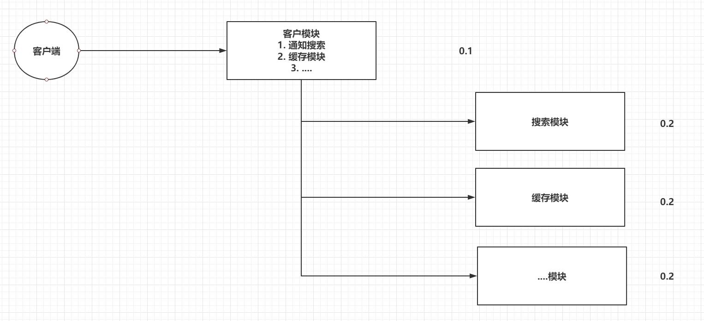
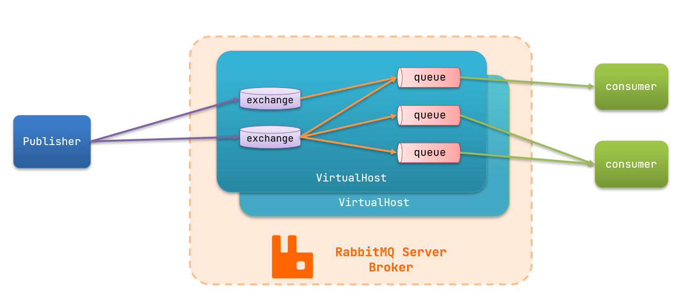
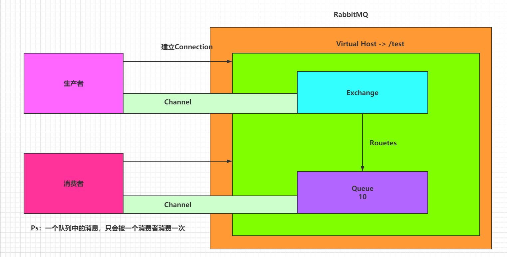
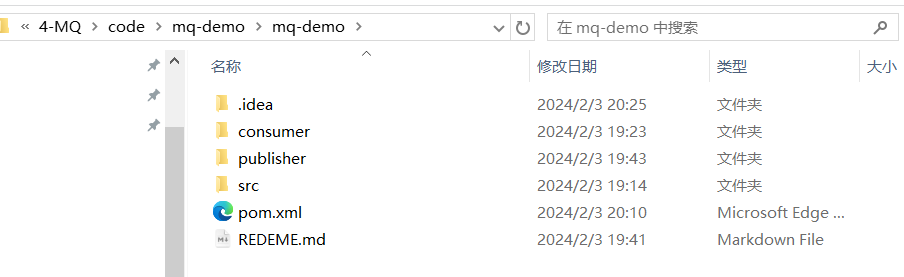

#  一、引言

模块之间的耦合度多高，导致一个模块宕机后，全部功能都不能用了，并且同步通讯的成本过高，用户体验差。




两种方式各有优劣，打电话可以立即得到响应，但是你却不能跟多个人同时通话。发送邮件可以同时与多个人收发邮件，但是往往响应会有延迟。

# 二、RabbitMQ介绍

市面上比较火爆的几款MQ：


+ 追求可用性：Kafka、 RocketMQ 、RabbitMQ
+ 追求可靠性：RabbitMQ、RocketMQ
+ 追求吞吐能力：RocketMQ、Kafka
+ 追求消息低延迟：RabbitMQ、Kafka

ActiveMQ，RocketMQ，Kafka分布式消息队列，RabbitMQ。

- 语言的支持：ActiveMQ，RocketMQ只支持Java语言，Kafka可以支持多们语言，RabbitMQ支持多种语言。
- 效率方面：ActiveMQ，RocketMQ，Kafka效率都是毫秒级别，RabbitMQ是微秒级别的。
- 消息丢失，消息重复问题： RabbitMQ针对消息的持久化，和重复问题都有比较成熟的解决方案。
- 学习成本：RabbitMQ非常简单。

RabbitMQ是由Rabbit公司去研发和维护的，最终是在Pivotal。

RabbitMQ严格的遵循AMQP协议，高级消息队列协议，帮助我们在进程之间传递异步消息。

https://www.rabbitmq.com

# 三、RabbitMQ安装

## 单机部署

创建目录，用于存放Docker Compose部署RabbitMQ的yaml文件：

```shell
mkdir -p /root/composefile/rabbitmq
```

```shell
vim /root/composefile/rabbitmq/rabbitmq.yaml
```


内容如下所示：

```yaml
version: '3'
services:
  rabbitmq:
    image: rabbitmq:management
    container_name: mq
    restart: always
    ports:
      - 5672:5672
      - 15672:15672
    environment:
      RABBITMQ_DEFAULT_VHOST: '/'
      RABBITMQ_DEFAULT_USER: admin
      RABBITMQ_DEFAULT_PASS: admin
```

执行命令

```shell
docker compose -f /root/composefile/rabbitmq/rabbitmq.yaml up -d
```

查看

```shell
root@lfj-virtual-machine:/# docker ps
CONTAINER ID   IMAGE                 COMMAND                  CREATED              STATUS                                                                                         
aaceef24ccc9   rabbitmq:management   "docker-entrypoint.s…"   About a minute ago   Up Abo672/tcp, 15671/tcp, 15691-15692/tcp, 25672/tcp, 0.0.0.0:15672->15672/tcp, :::15672->1567

root@lfj-virtual-machine:/# ifconfig
ens33: flags=4163<UP,BROADCAST,RUNNING,MULTICAST>  mtu 1500
        inet 192.168.200.134  netmask 255.255.255.0  broadcast 192.168.200.255
        inet6 fe80::2e18:9f04:8aff:3c23  prefixlen 64  scopeid 0x20<link>
        ether 00:0c:29:b8:41:f3  txqueuelen 1000  (Ethernet)
        RX packets 93519  bytes 134921788 (134.9 MB)
        RX errors 1083  dropped 1231  overruns 0  frame 0
        TX packets 52456  bytes 4125913 (4.1 MB)
        TX errors 0  dropped 0 overruns 0  carrier 0  collisions 0
        device interrupt 19  base 0x2000       
```

访问`http://192.168.200.134:15672/#/`，即可进入`RabbitMQ`的管理界面


使用`Docker Compose`部署`RabbitMQ`很方便。如果部署出现问题，可以通过查看容器的日志来发现问题。

```shell
docker logs mq
```

## 集群部署

### 集群分类

在RabbitMQ的官方文档中，讲述了两种集群的配置方式：

- 普通模式：普通模式集群不进行数据同步，每个MQ都有自己的队列、数据信息（其它元数据信息如交换机等会同步）。例如我们有2个MQ：mq1，和mq2，如果你的消息在mq1，而你连接到了mq2，那么mq2会去mq1拉取消息，然后返回给你。如果mq1宕机，消息就会丢失。
- 镜像模式：与普通模式不同，队列会在各个mq的镜像节点之间同步，因此你连接到任何一个镜像节点，均可获取到消息。而且如果一个节点宕机，并不会导致数据丢失。不过，这种方式增加了数据同步的带宽消耗。

###  设置网络

首先，我们需要让3台MQ互相知道对方的存在。

分别在3台机器中，设置 /etc/hosts文件，添加如下内容：

```
192.168.150.101 mq1
192.168.150.102 mq2
192.168.150.103 mq3
```

并在每台机器上测试，是否可以ping通对方

# 四、RabbitMQ架构【重点】

## 4.1 官方的简单架构图

- Publisher - 生产者：发布消息到RabbitMQ中的Exchange
- Consumer - 消费者：监听RabbitMQ中的Queue中的消息
- Exchange - 交换机：和生产者建立连接并接收生产者的消息
- Queue - 队列：Exchange会将消息分发到指定的Queue，Queue和消费者进行交互
- Routes - 路由：交换机以什么样的策略将消息发布到Queue



## 4.2 RabbitMQ的完整架构图



## 4.3 查看图形化界面并创建一个Virtual Host

默认账户：guest guest

创建一个全新的用户和全新的Virtual Host，并且将test用户设置上可以操作/test的权限

http://162.14.64.72:15672/


# 五、RabbitMQ的使用【重点】

## 5.1 RabbitMQ的通讯方式


## 5.2 Java连接RabbitMQ

### 5.2.2 导入依赖

```yaml
<dependencies>
    <dependency>
        <groupId>com.rabbitmq</groupId>
        <artifactId>amqp-client</artifactId>
        <version>5.6.0</version>
    </dependency>

    <dependency>
        <groupId>junit</groupId>
        <artifactId>junit</artifactId>
        <version>4.12</version>
    </dependency>
    
    
</dependencies>
```

### 5.2.3 创建工具类连接RabbitMQ

```java
public static Connection getConnection(){
    // 创建Connection工厂
    ConnectionFactory factory = new ConnectionFactory();
    // 1.1.设置连接参数，分别是：主机名、端口号、vhost、用户名、密码
    factory.setHost("192.168.199.109");
    factory.setPort(5672);
    factory.setUsername("test");
    factory.setPassword("test");
    factory.setVirtualHost("/test");

    // 创建Connection
    Connection conn = null;
    try {
        conn = factory.newConnection();
    } catch (Exception e) {
        e.printStackTrace();
    }
    // 返回
    return conn;
}
```


## 5.3 Simple-简单模型

一个生产者，一个默认的交换机，一个队列，一个消费者


创建生产者，创建一个channel，发布消息到exchange，指定路由规则。

```java
@Test
public void publish() throws Exception {
    //1. 获取Connection
    Connection connection = RabbitMQClient.getConnection();

    //2. 创建Channel
    Channel channel = connection.createChannel();

    //3. 发布消息到exchange，同时指定路由的规则
    String msg = "Hello-World！";
    // 参数1：指定exchange，使用""。
    // 参数2：指定路由的规则，使用具体的队列名称。
    // 参数3：指定传递的消息所携带的properties，使用null。
    // 参数4：指定发布的具体消息，byte[]类型
     String message = "Hello World!";
    channel.basicPublish("", QUEUE_NAME, null, message.getBytes());
    System.out.println(" [x] Sent '" + message + "'");
    // Ps：exchange是不会帮你将消息持久化到本地的，Queue才会帮你持久化消息。
    System.out.println("生产者发布消息成功！");
    //4. 释放资源
    channel.close();
    connection.close();
}
```

创建消费者，创建一个channel，创建一个队列，并且去消费当前队列

```java
@Test
public void consume() throws Exception {
    //1. 获取连接对象
    Connection connection = RabbitMQClient.getConnection();

    //2. 创建channel
    Channel channel = connection.createChannel();

    //3. 声明队列-HelloWorld
    //参数1：queue - 指定队列的名称
    //参数2：durable - 当前队列是否需要持久化（true）
    //参数3：exclusive - 是否排外（conn.close() - 当前队列会被自动删除，当前队列只能被一个消费者消费） 死信队列
    //参数4：autoDelete - 如果这个队列没有消费者在消费，队列自动删除  消息挤压
    //参数5：arguments - 指定当前队列的其他信息
    channel.queueDeclare("HelloWorld",true,false,false,null);

    //4. 开启监听Queue
    DefaultConsumer consume = new DefaultConsumer(channel){
        @Override
        public void handleDelivery(String consumerTag, Envelope envelope, AMQP.BasicProperties properties, byte[] msg) throws IOException {
            System.out.println(" [消费者1] received : " +new String(msg,"UTF-8")+ "!");
            //开启手动ACK
            channel.basicAck(envelope.getDeliveryTag(),false);
            
        }
    };

    //参数1：queue - 指定消费哪个队列
    //参数2：autoAck - 指定是否自动ACK （true，接收到消息后，会立即告诉RabbitMQ）
    //参数3：consumer - 指定消费回调
    channel.basicConsume("HelloWorld",true,consume);

    System.out.println("消费者开始监听队列！");
    // System.in.read();
    System.in.read();

    //5. 释放资源
    channel.close();
    connection.close();
}
```

## 5.4 Work-工作模型

一个生产者，一个默认的交换机，一个队列，两个消费者


只需要在消费者端，添加Qos能力以及更改为手动ack即可让消费者，根据自己的能力去消费指定的消息，而不是默认情况下由RabbitMQ平均分配了，生产者不变，正常发布消息到默认的exchange，并指定routing

消费者指定Qos和手动ack

```java
//1 指定当前消费者，一次消费多少个消息
channel.basicQos(1);
DefaultConsumer consumer = new DefaultConsumer(channel){
    @Override
    public void handleDelivery(String consumerTag, Envelope envelope, AMQP.BasicProperties properties, byte[] body) throws IOException {
        try {
            Thread.sleep(100);
        } catch (InterruptedException e) {
            e.printStackTrace();
        }
        System.out.println("消费者1号接收到消息：" + new String(body,"UTF-8"));

        //2. 手动ack
        channel.basicAck(envelope.getDeliveryTag(),false);
    }
};
//3. 指定手动ack
channel.basicConsume("Work",false,consumer);
```

补充:

工作队列，又称任务队列。主要思想就是避免执行资源密集型任务时，必须等待它执行完成。相反我们稍后完成任务，我们将任务封装为消息并将其发送到队列。 在后台运行的工作进程将获取任务并最终执行作业。当你运行许多消费者时，任务将在他们之间共享，但是**一个消息只能被一个消费者获取**。

这个概念在Web应用程序中特别有用，因为在短的HTTP请求窗口中无法处理复杂的任务

```java
public class Send {
    private final static String QUEUE_NAME = "test_work_queue";
 
    public static void main(String[] argv) throws Exception {
        // 获取到连接
        Connection connection = ConnectionUtil.getConnection();
        // 获取通道
        Channel channel = connection.createChannel();
        // 声明队列
        channel.queueDeclare(QUEUE_NAME, false, false, false, null);
        // 循环发布任务
        for (int i = 0; i < 50; i++) {
            // 消息内容
            String message = "task .. " + i;
            channel.basicPublish("", QUEUE_NAME, null, message.getBytes());
            System.out.println(" [x] Sent '" + message + "'");
 
            Thread.sleep(i * 2);
        }
        // 关闭通道和连接
        channel.close();
        connection.close();
    }
}
```

创建一个新的消费者2

```java
public static void main(String[] argv) throws Exception {
        // 获取到连接
        Connection connection = ConnectionUtil.getConnection();
        // 创建通道
        Channel channel = connection.createChannel();
        // 声明队列
        channel.queueDeclare(QUEUE_NAME, false, false, false, null);
        // 定义队列的消费者
        DefaultConsumer consumer = new DefaultConsumer(channel) {
            // 获取消息，并且处理，这个方法类似事件监听，如果有消息的时候，会被自动调用
            @Override
            public void handleDelivery(String consumerTag, Envelope envelope, 
                          BasicProperties properties,byte[] body) throws IOException {
                // body 即消息体
                String msg = new String(body);
                System.out.println(" [消费者2] received : " + msg + "!");
                try{
                    //模拟任务完成耗时
                    Thread.sleep(1000);
                }catch(Exception e){
                    
                }
                //开启手动ACK
                channel.basicAck(envelope.getDeliveryTag(),false);
            }
        };
        // 监听队列，第二个参数：是否自动进行消息确认。
        channel.basicConsume(QUEUE_NAME, false, consumer);
    }
```

## 5.5 Publish/Subscribe

一个生产者，一个交换机，两个队列，两个消费者


声明一个Fanout类型的exchange，并且将exchange和queue绑定在一起，绑定的方式就是直接绑定。

让生产者创建一个exchange并且指定类型，和一个或多个队列绑定到一起。

```java
//3. 创建exchange - 绑定某一个队列
//参数1： exchange的名称
//参数2： 指定exchange的类型  FANOUT - pubsub ,   DIRECT - Routing , TOPIC - Topics
channel.exchangeDeclare("pubsub-exchange", BuiltinExchangeType.FANOUT);
channel.queueBind("pubsub-queue1","pubsub-exchange","");
channel.queueBind("pubsub-queue2","pubsub-exchange","");
```

消费者还是正常的监听某一个队列即可。


发布订阅模式与之前案例的区别就是允许将同一消息发送给多个消费者。实现方式是加入了exchange(交换机)


常见exchange类型包括：

+ Fanout:广播
+ Direct:路由
+ Topic:话题

###  Fanout-交换机(Fanoutchange)


**在consumer服务            中, 编写配置类(后面都用注解的方式, 但是配置类推荐)**

|  |
| ------------------------------------------------------------ |

**在consumer服务中，编写两个消费者方法，分别监听fanout.queue1和fanout.queue2**

|  |
| ------------------------------------------------------------ |

**在publisher中编写测试方法，向itcast.fanout发送消息**

|  |
| ------------------------------------------------------------ |

### Direct-交换机(DirectExchange)


**在consumer服务声明Exchange、Queue**

1. 在consumer服务中，编写两个消费者方法，分别监听direct.queue1和direct.queue.2
2. 并利用@RabbitListener声明Exchange、Queue、RoutingKey

|  |
| ------------------------------------------------------------ |

**在publisher中编写测试方法，向itcast.direct发送消息**

|  |
| ------------------------------------------------------------ |

**Direct交换机与Fanout交换机差异**

+ Fanout交换机将消息路由给每一个与之绑定的队列
+ Direct交换机根据RoutingKey判断路由给哪个队列

###  Topic-交换机(TopicExchange)

TopicExchange与DirectExchange类似，区别在于routing Key必须是多个单词的列表，并且以，分割。
Queue与Exchange指定BindingKeyl时可以使用通配符：

+ #:   代指0个或多个单词
+ *:   代指一个单词


**在consumer服务中，编写两个消费者方法，分别监听topic.queue1和topic.queue2**

|  |
| ------------------------------------------------------------ |

**在publisher中编写测试方法，向itcast.topic发送消息**

|  |
| ------------------------------------------------------------ |

## 5.6 Routing

一个生产者，一个交换机，两个队列，两个消费者


生产者在创建DIRECT类型的exchange后，根据RoutingKey去绑定相应的队列，并且在发送消息时，指定消息的具体RoutingKey即可。


```java
//3. 创建exchange, routing-queue-error,routing-queue-info,
channel.exchangeDeclare("routing-exchange", BuiltinExchangeType.DIRECT);
channel.queueBind("routing-queue-error","routing-exchange","ERROR");
channel.queueBind("routing-queue-info","routing-exchange","INFO");

//4. 发布消息到exchange，同时指定路由的规则
channel.basicPublish("routing-exchange","ERROR",null,"ERROR".getBytes());
channel.basicPublish("routing-exchange","INFO",null,"INFO1".getBytes());
channel.basicPublish("routing-exchange","INFO",null,"INFO2".getBytes());
channel.basicPublish("routing-exchange","INFO",null,"INFO3".getBytes());
```

消费者没有变化

## 5.7 Topic

一个生产者，一个交换机，两个队列，两个消费者


生产者创建Topic的exchange并且绑定到队列中，这次绑定可以通过*和#关键字，对指定RoutingKey内容，编写时注意格式 xxx.xxx.xxx去编写， * -> 一个xxx，而# -> 代表多个xxx.xxx，在发送消息时，指定具体的RoutingKey到底是什么。

route：xxx.xxx.xxx

实例：yellow.zgq.qj

*.zgq.*

bule.#(zgq.qj)


```java
//2. 创建exchange并指定绑定方式
channel.exchangeDeclare("topic-exchange", BuiltinExchangeType.TOPIC);
channel.queueBind("topic-queue-1","topic-exchange","*.red.*");
channel.queueBind("topic-queue-2","topic-exchange","fast.#");
channel.queueBind("topic-queue-2","topic-exchange","*.*.rabbit");

//3. 发布消息到exchange，同时指定路由的规则
channel.basicPublish("topic-exchange","fast.red.monkey",null,"红快猴子".getBytes());
channel.basicPublish("topic-exchange","slow.black.dog",null,"黑漫狗".getBytes());
channel.basicPublish("topic-exchange","fast.white.cat",null,"快白猫".getBytes());
```

消费者只是监听队列，没变化。

# 六、 SpringAMQP:crossed_swords:

SpringAMQP是基于RabbitMQ封装的一套模板，并且还利用SpringBoot对其实现了自动装配，使用起来非常方便。

SpringAmqp的官方地址：https://spring.io/projects/spring-amqp


SpringAMQP提供了三个功能：

- 自动声明队列、交换机及其绑定关系
- 基于注解的监听器模式，异步接收消息
- 封装了RabbitTemplate工具，用于发送消息 

## 6.1.Basic Queue 简单队列模型

在父工程mq-demo中引入依赖

```xml
<!--AMQP依赖，包含RabbitMQ-->
<dependency>
    <groupId>org.springframework.boot</groupId>
    <artifactId>spring-boot-starter-amqp</artifactId>
</dependency>
```

### 6.1.1.消息发送

首先配置MQ地址，在publisher服务的application.yml中添加配置：

```yaml
spring:
  rabbitmq:
    host: 192.168.150.101 # 主机名
    port: 5672 # 端口
    virtual-host: / # 虚拟主机
    username: itcast # 用户名
    password: 123321 # 密码
```

然后在publisher服务中编写测试类SpringAmqpTest，并**利用RabbitTemplate实现消息发送**：

```java
package cn.itcast.mq.spring;

import org.junit.Test;
import org.junit.runner.RunWith;
import org.springframework.amqp.rabbit.core.RabbitTemplate;
import org.springframework.beans.factory.annotation.Autowired;
import org.springframework.boot.test.context.SpringBootTest;
import org.springframework.test.context.junit4.SpringRunner;

@RunWith(SpringRunner.class)
@SpringBootTest
public class SpringAmqpTest {

    @Autowired
    private RabbitTemplate rabbitTemplate;

    @Test
    public void testSimpleQueue() {
        // 队列名称
        String queueName = "simple.queue";
        // 消息
        String message = "hello, spring amqp!";
        // 发送消息
        rabbitTemplate.convertAndSend(queueName, message);
    }
}
```

### 6.1.2.消息接收

首先配置MQ地址，在consumer服务的application.yml中添加配置：

```yaml
spring:
  rabbitmq:
    host: 192.168.150.101 # 主机名
    port: 5672 # 端口
    virtual-host: / # 虚拟主机
    username: itcast # 用户名
    password: 123321 # 密码
```

然后在consumer服务的`cn.itcast.mq.listener`包中新建一个类SpringRabbitListener，代码如下：

```java
package cn.itcast.mq.listener;

import org.springframework.amqp.rabbit.annotation.RabbitListener;
import org.springframework.stereotype.Component;

@Component
public class SpringRabbitListener {

    @RabbitListener(queues = "simple.queue")
    public void listenSimpleQueueMessage(String msg) throws InterruptedException {
        System.out.println("spring 消费者接收到消息：【" + msg + "】");
    }
}
```

## 6.2.WorkQueue

Work queues，也被称为（Task queues），任务模型。简单来说就是**让多个消费者绑定到一个队列，共同消费队列中的消息**。


当消息处理比较耗时的时候，可能生产消息的速度会远远大于消息的消费速度。长此以往，消息就会堆积越来越多，无法及时处理。

此时就可以使用work 模型，多个消费者共同处理消息处理，速度就能大大提高了。

### 6.2.1.消息发送

这次我们循环发送，模拟大量消息堆积现象。

在publisher服务中的SpringAmqpTest类中添加一个测试方法：

```java
/**
     * workQueue
     * 向队列中不停发送消息，模拟消息堆积。
     */
@Test
public void testWorkQueue() throws InterruptedException {
    // 队列名称
    String queueName = "work.queue";
    // 消息
    String message = "hello, message_";
    for (int i = 0; i < 50; i++) {
        // 发送消息
        rabbitTemplate.convertAndSend(queueName, message + i);
        Thread.sleep(20);
    }
}
```

### 6.2.2.消息接收

要模拟多个消费者绑定同一个队列，我们在consumer服务的SpringRabbitListener中添加2个新的方法：

```java
@RabbitListener(queues = "work.queue")
public void listenWorkQueue1(String msg) throws InterruptedException {
    System.out.println("消费者1接收到消息：【" + msg + "】" + LocalTime.now());
    Thread.sleep(20);
}

@RabbitListener(queues = "work.queue")
public void listenWorkQueue2(String msg) throws InterruptedException {
    System.err.println("消费者2........接收到消息：【" + msg + "】" + LocalTime.now());
    Thread.sleep(200);
}
```

注意到这个消费者sleep了1000秒，模拟任务耗时。

### 6.2.3.测试

启动ConsumerApplication后，在执行publisher服务中刚刚编写的发送测试方法testWorkQueue。

可以看到消费者1很快完成了自己的25条消息。消费者2却在缓慢的处理自己的25条消息。

也就是说消息是平均分配给每个消费者，并没有考虑到消费者的处理能力。这样显然是有问题的。

### 6.2.4.能者多劳

在spring中有一个简单的配置，可以解决这个问题。我们修改consumer服务的application.yml文件，添加配置：

```yaml
spring:
  rabbitmq:
    listener:
      simple:
        prefetch: 1 # 每次只能获取一条消息，处理完成才能获取下一个消息
```

### 6.2.5.总结

Work模型的使用：

- 多个消费者绑定到一个队列，同一条消息只会被一个消费者处理
- 通过设置prefetch来控制消费者预取的消息数量

## 6.3.发布/订阅

发布订阅的模型如图：


可以看到，在订阅模型中，多了一个exchange角色，而且过程略有变化：

- Publisher：生产者，也就是要发送消息的程序，但是不再发送到队列中，而是发给X（交换机）
- Exchange：交换机，图中的X。一方面，接收生产者发送的消息。另一方面，知道如何处理消息，例如递交给某个特别队列、递交给所有队列、或是将消息丢弃。到底如何操作，取决于Exchange的类型。Exchange有以下3种类型：
  - Fanout：广播，将消息交给所有绑定到交换机的队列
  - Direct：定向，把消息交给符合指定routing key 的队列
  - Topic：通配符，把消息交给符合routing pattern（路由模式） 的队列
- Consumer：消费者，与以前一样，订阅队列，没有变化
- Queue：消息队列也与以前一样，接收消息、缓存消息。

**Exchange（交换机）只负责转发消息，不具备存储消息的能力**，因此如果没有任何队列与Exchange绑定，或者没有符合路由规则的队列，那么消息会丢失！

### 6.3.1.Fanout

Fanout，英文翻译是扇出，我觉得在MQ中叫广播更合适。


在广播模式下，消息发送流程是这样的：

- 1）  可以有多个队列
- 2）  每个队列都要绑定到Exchange（交换机）
- 3）  生产者发送的消息，只能发送到交换机，交换机来决定要发给哪个队列，生产者无法决定
- 4）  交换机把消息发送给绑定过的所有队列
- 5）  订阅队列的消费者都能拿到消息

#### 6.3.1.1.声明队列和交换机

步骤：

- 创建一个交换机 itcast.fanout，类型是Fanout
- 创建两个队列fanout.queue1和fanout.queue2，绑定到交换机itcast.fanout


Spring提供了一个接口Exchange，来表示所有不同类型的交换机：


在consumer中创建一个类，声明队列和交换机：

```java
package cn.itcast.mq.config;

import org.springframework.amqp.core.Binding;
import org.springframework.amqp.core.BindingBuilder;
import org.springframework.amqp.core.FanoutExchange;
import org.springframework.amqp.core.Queue;
import org.springframework.context.annotation.Bean;
import org.springframework.context.annotation.Configuration;

@Configuration
public class FanoutConfig {
    /**
     * 声明交换机
     * @return Fanout类型交换机
     */
    @Bean
    public FanoutExchange fanoutExchange(){
        return new FanoutExchange("itcast.fanout");
    }

    /**
     * 第1个队列
     */
    @Bean
    public Queue fanoutQueue1(){
        return new Queue("fanout.queue1");
    }

    /**
     * 绑定队列和交换机
     */
    @Bean
    public Binding bindingQueue1(Queue fanoutQueue1, FanoutExchange fanoutExchange){
        return BindingBuilder.bind(fanoutQueue1).to(fanoutExchange);
    }

    /**
     * 第2个队列
     */
    @Bean
    public Queue fanoutQueue2(){
        return new Queue("fanout.queue2");
    }

    /**
     * 绑定队列和交换机
     */
    @Bean
    public Binding bindingQueue2(Queue fanoutQueue2, FanoutExchange fanoutExchange){
        return BindingBuilder.bind(fanoutQueue2).to(fanoutExchange);
    }
}
```

#### 6.3.1.2.消息发送

在publisher服务的SpringAmqpTest类中添加测试方法：

```java
@Test
public void testFanoutExchange() {
    // 队列名称
    String exchangeName = "itcast.fanout";
    // 消息
    String message = "hello, everyone!";
    rabbitTemplate.convertAndSend(exchangeName, "", message);
}
```

#### 6.3.1.3.消息接收

在consumer服务的SpringRabbitListener中添加两个方法，作为消费者：

```java
@RabbitListener(queues = "fanout.queue1")
public void listenFanoutQueue1(String msg) {
    System.out.println("消费者1接收到Fanout消息：【" + msg + "】");
}

@RabbitListener(queues = "fanout.queue2")
public void listenFanoutQueue2(String msg) {
    System.out.println("消费者2接收到Fanout消息：【" + msg + "】");
}
```

#### 6.3.1.4.总结

交换机的作用是什么？

- 接收publisher发送的消息
- 将消息按照规则路由到与之绑定的队列
- 不能缓存消息，路由失败，消息丢失
- FanoutExchange的会将消息路由到每个绑定的队列

声明队列、交换机、绑定关系的Bean是什么？

- Queue
- FanoutExchange
- Binding

### 6.3.2. Direct

在Fanout模式中，一条消息，会被所有订阅的队列都消费。但是，在某些场景下，我们希望不同的消息被不同的队列消费。这时就要用到Direct类型的Exchange。


 在Direct模型下：

- 队列与交换机的绑定，不能是任意绑定了，而是要指定一个`RoutingKey`（路由key）
- 消息的发送方在 向 Exchange发送消息时，也必须指定消息的 `RoutingKey`。
- Exchange不再把消息交给每一个绑定的队列，而是根据消息的`Routing Key`进行判断，只有队列的`Routingkey`与消息的 `Routing key`完全一致，才会接收到消息

#### 6.3.2.1.基于注解声明队列和交换机

**案例需求如下**：

1. 利用@RabbitListener声明Exchange、Queue、RoutingKey

2. 在consumer服务中，编写两个消费者方法，分别监听direct.queue1和direct.queue2

3. 在publisher中编写测试方法，向itcast. direct发送消息


基于@Bean的方式声明队列和交换机比较麻烦，Spring还提供了基于注解方式来声明。

在consumer的SpringRabbitListener中添加两个消费者，同时基于注解来声明队列和交换机：

```java
@RabbitListener(bindings = @QueueBinding(
    value = @Queue(name = "direct.queue1"),
    exchange = @Exchange(name = "itcast.direct", type = ExchangeTypes.DIRECT),
    key = {"red", "blue"}
))
public void listenDirectQueue1(String msg){
    System.out.println("消费者接收到direct.queue1的消息：【" + msg + "】");
}

@RabbitListener(bindings = @QueueBinding(
    value = @Queue(name = "direct.queue2"),
    exchange = @Exchange(name = "itcast.direct", type = ExchangeTypes.DIRECT),
    key = {"red", "yellow"}
))
public void listenDirectQueue2(String msg){
    System.out.println("消费者接收到direct.queue2的消息：【" + msg + "】");
}
```

#### 6.3.2.2.消息发送

在publisher服务的SpringAmqpTest类中添加测试方法：

```java
@Test
public void testSendDirectExchange() {
    // 交换机名称
    String exchangeName = "itcast.direct";
    // 消息
    String message = "红色警报！日本乱排核废水，导致海洋生物变异，惊现哥斯拉！";
    // 发送消息
    rabbitTemplate.convertAndSend(exchangeName, "red", message);
}
```

#### 6.3.2.3.总结

**Direct交换机与Fanout交换机差异**

+ Fanout交换机将消息路由给每一个与之绑定的队列
+ Direct交换机根据RoutingKey判断路由给哪个队列

### 6.3.3.Topic

TopicExchange与DirectExchange类似，区别在于routing Key必须是多个单词的列表，并且以，分割。
Queue与Exchange指定BindingKeyl时可以使用通配符：

`Routingkey` 一般都是有一个或多个单词组成，多个单词之间以”.”分割，例如： `item.insert`

 通配符规则：

`#`：匹配一个或多个词

`*`：匹配不多不少恰好1个词

举例：

`item.#`：能够匹配`item.spu.insert` 或者 `item.spu`

`item.*`：只能匹配`item.spu`

 图示：

 

解释：

- Queue1：绑定的是`china.#` ，因此凡是以 `china.`开头的`routing key` 都会被匹配到。包括china.news和china.weather
- Queue2：绑定的是`#.news` ，因此凡是以 `.news`结尾的 `routing key` 都会被匹配。包括china.news和japan.news

#### 6.3.3.1.消息发送

案例需求：

实现思路如下：

1. 并利用@RabbitListener声明Exchange、Queue、RoutingKey

2. 在consumer服务中，编写两个消费者方法，分别监听topic.queue1和topic.queue2

3. 在publisher中编写测试方法，向itcast. topic发送消息


在publisher服务的SpringAmqpTest类中添加测试方法：

```java
/**
     * topicExchange
     */
@Test
public void testSendTopicExchange() {
    // 交换机名称
    String exchangeName = "itcast.topic";
    // 消息
    String message = "喜报！孙悟空大战哥斯拉，胜!";
    // 发送消息
    rabbitTemplate.convertAndSend(exchangeName, "china.news", message);
}
```

#### 6.3.3.2.消息接收

在consumer服务的SpringRabbitListener中添加方法：

```java
@RabbitListener(bindings = @QueueBinding(
    value = @Queue(name = "topic.queue1"),
    exchange = @Exchange(name = "itcast.topic", type = ExchangeTypes.TOPIC),
    key = "china.#"
))
public void listenTopicQueue1(String msg){
    System.out.println("消费者接收到topic.queue1的消息：【" + msg + "】");
}


@RabbitListener(bindings = @QueueBinding(
    value = @Queue(name = "topic.queue2"),
    exchange = @Exchange(name = "itcast.topic", type = ExchangeTypes.TOPIC),
    key = "#.news"
))
public void listenTopicQueue2(String msg){
    System.out.println("消费者接收到topic.queue2的消息：【" + msg + "】");
}
```

运行结果

```
消费者接收到topic.queve1的消息：【喜报！孙悟空大战哥斯拉，胜!】
消费者接收到topic.queve2的消息：【喜报！孙悟空大战哥斯拉，胜!】
```

#### 6.3.3.3.总结

**Direct交换机与Topic交换机的差异**

- Topic交换机接收的消息RoutingKey必须是多个单词，以 `**.**` 分割
- Topic交换机与队列绑定时的bindingKey可以指定通配符
- `#`：代表0个或多个词
- `*`：代表1个词

## 6.4.消息转换器

之前说过，Spring会把你发送的消息序列化为字节发送给MQ，接收消息的时候，还会把字节反序列化为Java对象。


只不过，默认情况下Spring采用的序列化方式是JDK序列化。众所周知，JDK序列化存在下列问题：

- 数据体积过大
- 有安全漏洞
- 可读性差

### 6.4.1.测试默认转换器

我们修改消息发送的代码，发送一个Map对象：

```java
@Test
public void testSendMap() throws InterruptedException {
    // 准备消息
    Map<String,Object> msg = new HashMap<>();
    msg.put("name", "Jack");
    msg.put("age", 21);
    // 发送消息
    rabbitTemplate.convertAndSend("simple.queue","", msg);
}
```

停止consumer服务

发送消息后查看控制台：


### 6.4.2.配置JSON转换器

显然，JDK序列化方式并不合适。我们希望消息体的体积更小、可读性更高，因此可以使用JSON方式来做序列化和反序列化。

在publisher和consumer两个服务中都引入依赖：

```xml
<dependency>
    <groupId>com.fasterxml.jackson.dataformat</groupId>
    <artifactId>jackson-dataformat-xml</artifactId>
    <version>2.9.10</version>
</dependency>
```

配置消息转换器。

**在启动类中添加一个Bean即可：**

```java
@Bean
public MessageConverter jsonMessageConverter(){
    return new Jackson2JsonMessageConverter();
}
```

```java
@Test
public void testSendObjectQueue() {
    Map<String, Object> msg = new HashMap<>();
    msg.put("name", "柳岩");
    msg.put("age", 21);l
    rabbitTemplate.convertAndSend( routingKey: "object.queue", msg);
}
```

## 问题

启动项目后，发现MQ报错，出现异常


网上找了一圈，发现与这个报错类似

> Caused by: com.[rabbitmq](https://so.csdn.net/so/search?q=rabbitmq&spm=1001.2101.3001.7020).client.ShutdownSignalException: channel error; protocol method: #method<channel.close>(reply-code=406, reply-text=PRECONDITION_FAILED - inequivalent arg 'auto_delete' for exchange 'ltc_business_Customer' in vhost '/': received 'false' but current is 'true', class-id=40, method-id=10)

 原因是：

Rabbitmq服务器上已经存在同样名称的队列和exchange了，但是和你在程序里设置的属性不一样而引起的错误。

解决方案一

登录Rabbitmq服务器管理界面

- 把rabbitmq上已存在的队列和exchange删掉

解决方案二

- 把已经存在的队列和exchange属性都改成一致的


# 七、RabbitMQ整合SpringBoot

## 7.1 SpringBoot整合RabbitMQ

 RabbitMQ的通讯方式使用发布订阅的方式

### 7.1.1 创建SpringBoot工程


### 7.1.2 导入依赖

```xml
<dependencies>
        <dependency>
            <groupId>org.springframework.boot</groupId>
            <artifactId>spring-boot-starter-web</artifactId>
        </dependency>
        <dependency>
            <groupId>org.springframework.boot</groupId>
            <artifactId>spring-boot-starter-test</artifactId>
        </dependency>
       <!--因为publisher和consumer服务都需要amqp依赖，因此这里把依赖直接放到父工程-->
    	<dependency>
            <groupId>org.springframework.boot</groupId>
            <artifactId>spring-boot-starter-amqp</artifactId>
        </dependency>
    </dependencies>
```

### 7.1.3 编写配置文件


配置上图信息及rabbitmq地址

```yaml
spring:
  rabbitmq:
    host: 192.168.199.109  #主机名
    port: 5672  #端口
    username: test  #用户名
    password: test  #密码
    virtual-host: /test  #虚拟主机
```


### 7.1.4 消费者声明exchange、queue 

注意: 可以用注解的方法

```java
@Configuration
public class RabbitMQConfig {
    //1. 创建exchange - topic 交换机
    @Bean
    public TopicExchange getTopicExchange(){
        //TopicExchange 交换机类型
        return new TopicExchange("boot-topic-exchange",true,false);
    }

    //2. 创建queue
    @Bean
    public Queue getQueue(){
        return new Queue("boot-queue",true,false,false,null);
    }

    //3. 绑定在一起
    @Bean
    public Binding getBinding(TopicExchange topicExchange,Queue queue){
        return BindingBuilder.bind(queue).to(topicExchange).with("*.red.*");
    }
}
```

### 7.1.5 发布消息到RabbitMQ -发送MQ消息

```java
import org.junit.jupiter.api.Test;
import org.springframework.amqp.rabbit.core.RabbitTemplate;
import org.springframework.beans.factory.annotation.Autowired;
import org.springframework.boot.test.context.SpringBootTest;

import javax.annotation.Resource;

@SpringBootTest
public class TestBootRabbitMQ {

    @Autowired
    private RabbitTemplate rabbitTemplate;

    @Test
    public void pulisher(){
        // 发送消息  参数 交换机, key
        rabbitTemplate.convertAndSend("boot-exchange","yellow.zgq.xj","周被洗脚仙人跳！！！");
    }
    
    @Test
    void contextLoads() {
        rabbitTemplate.convertAndSend("boot-topic-exchange","slow.red.dog","红色大狼狗！！");
    }

}
```

### 7.1.6 创建消费者监听消息 -接收MQ消息

```java
import cn.lfj.mq.listener

@Component
public class Consumer {

    //类中声明方法，添加@RabbitListener注解，方法参数就时消息
    @RabbitListener(queues = "boot-queue")
    public void getMessage(Object message){
        System.out.println("接收到消息：" + message);
    }

}
```

## 7.2 手动Ack

### 7.2.1 添加配置文件

```yaml
spring:
  rabbitmq:
    listener:
      simple:
        acknowledge-mode: manual
```

### 7.2.2 手动ack

```java
@RabbitListener(queues = "boot-queue")
public void getMessage(String msg, Channel channel, Message message) throws IOException {
    System.out.println("接收到消息：" + msg);
    int i = 1 / 0;
    // 手动ack
    channel.basicAck(message.getMessageProperties().getDeliveryTag(),false);
}
```

# 八、RabbitMQ的其他操作

## 8.1 消息的可靠性

RabbitMQ的事务：事务可以保证消息100%传递，可以通过事务的回滚去记录日志，后面定时再次发送当前消息。事务的操作，效率太低，加了事务操作后，比平时的操作效率至少要慢100倍。

RabbitMQ除了事务，还提    供了Confirm的确认机制，这个效率比事务高很多。

### 8.1.1 普通Confirm方式

```java
//3.1 开启confirm
channel.confirmSelect();
//3.2 发送消息
String msg = "Hello-World！";
channel.basicPublish("","HelloWorld",null,msg.getBytes());
//3.3 判断消息发送是否成功
if(channel.waitForConfirms()){
    System.out.println("消息发送成功");
}else{
    System.out.println("发送消息失败");
}
```

### 8.1.2 批量Confirm方式。

```java
//3.1 开启confirm
channel.confirmSelect();
//3.2 批量发送消息
for (int i = 0; i < 1000; i++) {
    String msg = "Hello-World！" + i;
    channel.basicPublish("","HelloWorld",null,msg.getBytes());
}
//3.3 确定批量操作是否成功
channel.waitForConfirmsOrDie();     // 当你发送的全部消息，有一个失败的时候，就直接全部失败 抛出异常IOException
```

### 8.1.3 异步Confirm方式。

```java
//3.1 开启confirm
channel.confirmSelect();
//3.2 批量发送消息
for (int i = 0; i < 1000; i++) {
    String msg = "Hello-World！" + i;
    channel.basicPublish("","HelloWorld",null,msg.getBytes());
}
//3.3 开启异步回调
channel.addConfirmListener(new ConfirmListener() {

    @Override
    public void handleAck(long deliveryTag, boolean multiple) throws IOException {
        System.out.println("消息发送成功，标识：" + deliveryTag + ",是否是批量" + multiple);
    }

    @Override
    public void handleNack(long deliveryTag, boolean multiple) throws IOException {
        System.out.println("消息发送失败，标识：" + deliveryTag + ",是否是批量" + multiple);
    }
});
```


### 8.1.4 Return机制

Confirm只能保证消息到达exchange，无法保证消息可以被exchange分发到指定queue。

而且exchange是不能持久化消息的，queue是可以持久化消息。

采用Return机制来监听消息是否从exchange送到了指定的queue中


开启Return机制，并在发送消息时，指定mandatory为true

```java
// 开启return机制
channel.addReturnListener(new ReturnListener() {
    @Override
    public void handleReturn(int replyCode, String replyText, String exchange, String routingKey, AMQP.BasicProperties properties, byte[] body) throws IOException {
        // 当消息没有送达到queue时，才会执行。
        System.out.println(new String(body,"UTF-8") + "没有送达到Queue中！！");
    }
});

// 在发送消息时，指定mandatory参数为true
channel.basicPublish("","HelloWorld",true,null,msg.getBytes());
```

## 8.2 SpringBoot实现

### 8.2.1 编写配置文件

```java
spring:
  rabbitmq:
    publisher-confirm-type: simple
    publisher-returns: true
```

### 8.2.2 开启Confirm和Return

```java
@Component
public class PublisherConfirmAndReturnConfig implements RabbitTemplate.ConfirmCallback ,RabbitTemplate.ReturnCallback {

    @Autowired
    private RabbitTemplate rabbitTemplate;

    @PostConstruct  // init-method
    public void initMethod(){
        rabbitTemplate.setConfirmCallback(this);
        rabbitTemplate.setReturnCallback(this);
    }

    @Override
    public void confirm(CorrelationData correlationData, boolean ack, String cause) {
        if(ack){
            System.out.println("消息已经送达到Exchange");
        }else{
            System.out.println("消息没有送达到Exchange");
        }
    }

    @Override
    public void returnedMessage(Message message, int replyCode, String replyText, String exchange, String routingKey) {
        System.out.println("消息没有送达到Queue");
    }
}
```

## 8.3 避免消息重复消费  

重复消费消息，会对非幂等行操作造成问题

重复消费消息的原因是，消费者没有给RabbitMQ一个ack


为了解决消息重复消费的问题，可以采用Redis，在消费者消费消息之前，现将消息的id放到Redis中，

id-0（正在执行业务）

id-1（执行业务成功）

如果ack失败，在RabbitMQ将消息交给其他的消费者时，先执行setnx，如果key已经存在，获取他的值，如果是0，当前消费者就什么都不做，如果是1，直接ack。

极端情况：第一个消费者在执行业务时，出现了死锁，在setnx的基础上，再给key设置一个生存时间。

生产者，发送消息时，指定messageId


```java
AMQP.BasicProperties properties = new AMQP.BasicProperties().builder()
    .deliveryMode(1)     //指定消息书否需要持久化 1 - 需要持久化  2 - 不需要持久化
    .messageId(UUID.randomUUID().toString())
    .build();
String msg = "Hello-World！";
channel.basicPublish("","HelloWorld",true,properties,msg.getBytes());
```


消费者，在消费消息时，根据具体业务逻辑去操作redis


```java
DefaultConsumer consume = new DefaultConsumer(channel){
    @Override
    public void handleDelivery(String consumerTag, Envelope envelope, AMQP.BasicProperties properties, byte[] body) throws IOException {
        Jedis jedis = new Jedis("192.168.199.109",6379);
        String messageId = properties.getMessageId();
        //1. setnx到Redis中，默认指定value-0
        String result = jedis.set(messageId, "0", "NX", "EX", 10);
        if(result != null && result.equalsIgnoreCase("OK")) {
            System.out.println("接收到消息：" + new String(body, "UTF-8"));
            //2. 消费成功，set messageId 1
            jedis.set(messageId,"1");
            channel.basicAck(envelope.getDeliveryTag(),false);
        }else {
            //3. 如果1中的setnx失败，获取key对应的value，如果是0，return，如果是1
            String s = jedis.get(messageId);
            if("1".equalsIgnoreCase(s)){
                channel.basicAck(envelope.getDeliveryTag(),false);
            }
        }
    }
};
```


## 8.4 SpringBoot如何实现

### 8.4.1 导入依赖

```java
<dependency>
    <groupId>org.springframework.boot</groupId>
    <artifactId>spring-boot-starter-data-redis</artifactId>
</dependency>
```

### 8.4.2 编写配置文件

```java
spring:
  redis:
    host: 192.168.199.109
    port: 6379
```

### 8.4.3 修改生产者

```java
@Test
void contextLoads() throws IOException {
    CorrelationData messageId = new CorrelationData(UUID.randomUUID().toString());
    rabbitTemplate.convertAndSend("boot-topic-exchange","slow.red.dog","红色大狼狗！！",messageId);
    System.in.read();
}
```

### 8.4.4  修改消费者

```
@Autowired
private StringRedisTemplate redisTemplate;


@RabbitListener(queues = "boot-queue")
public void getMessage(String msg, Channel channel, Message message) throws IOException {
    //0. 获取MessageId
    String messageId = message.getMessageProperties().getHeader("spring_returned_message_correlation");
    //1. 设置key到Redis
    if(redisTemplate.opsForValue().setIfAbsent(messageId,"0",10, TimeUnit.SECONDS)) {
        //2. 消费消息
        System.out.println("接收到消息：" + msg);

        //3. 设置key的value为1
        redisTemplate.opsForValue().set(messageId,"1",10,TimeUnit.SECONDS);
        //4.  手动ack
        channel.basicAck(message.getMessageProperties().getDeliveryTag(),false);
    }else {
        //5. 获取Redis中的value即可 如果是1，手动ack
        if("1".equalsIgnoreCase(redisTemplate.opsForValue().get(messageId))){
            channel.basicAck(message.getMessageProperties().getDeliveryTag(),false);
        }
    }
}
```

# 十、总结

## 综合代码

具体代码见:



### **生产者—发送消息**

```java
package cn.itcast.mq.spring;

import org.junit.jupiter.api.DisplayName;
import org.junit.jupiter.api.Test;

import org.junit.jupiter.api.extension.ExtendWith;
import org.junit.runner.RunWith;
import org.springframework.amqp.rabbit.core.RabbitTemplate;
import org.springframework.beans.factory.annotation.Autowired;
import org.springframework.boot.test.context.SpringBootTest;
import org.springframework.test.context.junit.jupiter.SpringExtension;
import org.springframework.test.context.junit4.SpringRunner;

@ExtendWith(SpringExtension.class)
@SpringBootTest
public class SpringAmqpTest {
    @Autowired
    private RabbitTemplate rabbitTemplate;

    @DisplayName("BasicQueue 简单队列模型")
    @Test
    public void testSendMessage2SimpleQueue() {
        // 队列名称
        String queueName = "simple.queue";
        // 消息
        String message = "hello, spring amqp!";
        // 发送消息
        rabbitTemplate.convertAndSend(queueName, message);
    }

    @DisplayName("WorkQueue 任务模型")
    @Test
    public void testSendMessage2WorkQueue() throws InterruptedException {
        String queueName = "work.queue";
        String message = "hello, message__";
        for (int i = 1; i <= 10; i++) {
            rabbitTemplate.convertAndSend(queueName, message + i);
            Thread.sleep(20);
        }
    }

    @DisplayName("发布/订阅模型 ---- Fanout")
    @Test
    public void testSendFanoutExchange() {
        // 交换机名称
        String exchangeName = "itcast.fanout";
        // 消息
        String message = "hello, every one!";
        // 发送消息
        rabbitTemplate.convertAndSend(exchangeName, "", message);
    }

    @DisplayName("发布/订阅模型 ---- direct")
    @Test
    public void testSendDirectExchange() {
        // 交换机名称
        String exchangeName = "itcast.direct";
        // 消息
        String message = "hello, red!";
        // 发送消息
        rabbitTemplate.convertAndSend(exchangeName, "red", message);
    }

    @DisplayName("发布/订阅模型 ---- topic")
    @Test
    public void testSendTopicExchange() {
        // 交换机名称
        String exchangeName = "itcast.topic";
        // 消息
        String message = "今天天气不错，我的心情好极了!";
        // 发送消息
        rabbitTemplate.convertAndSend(exchangeName, "china.weather", message);
    }
}

```

### 消费者—接受消息

在发布/订阅模型中:

+  交换机-fanout 是基于配置类声明 
+  交换机-topic和direct 基于注解声明队列和交换机

```java
package cn.itcast.mq.listener;

import org.springframework.amqp.core.ExchangeTypes;
import org.springframework.amqp.rabbit.annotation.Exchange;
import org.springframework.amqp.rabbit.annotation.Queue;
import org.springframework.amqp.rabbit.annotation.QueueBinding;
import org.springframework.amqp.rabbit.annotation.RabbitListener;
import org.springframework.stereotype.Component;

import java.time.LocalTime;
import java.util.Map;

@Component
public class SpringRabbitListener {

     //BasicQueue 简单队列模型
     @RabbitListener(queues = "simple.queue")
     public void listenSimpleQueue(String msg) {
         System.out.println("消费者接收到simple.queue的消息：【" + msg + "】");
     }

    //WorkQueue 任务模型
    @RabbitListener(queues = "work.queue")
    public void listenWorkQueue1(String msg) throws InterruptedException {
        System.out.println("消费者1接收到work.queue消息：【" + msg + "】" + LocalTime.now());
        Thread.sleep(20);
    }

    @RabbitListener(queues = "work.queue")
    public void listenWorkQueue2(String msg) throws InterruptedException {
        System.err.println("消费者2接收work.queue到消息：【" + msg + "】" + LocalTime.now());
        Thread.sleep(200);
    }

    //发布/订阅模型 ---- fanout
    // 基于配置类声明队列和交换机
    @RabbitListener(queues = "fanout.queue1")
    public void listenFanoutQueue1(String msg) {

         System.out.println("消费者接收到fanout.queue1的消息：【" + msg + "】");
    }
    @RabbitListener(queues = "fanout.queue2")
    public void listenFanoutQueue2(String msg) {
        System.out.println("消费者接收到fanout.queue2的消息：【" + msg + "】");
    }

    //发布/订阅模型 ---- direct
    //基于注解声明队列和交换机
    @RabbitListener(bindings = @QueueBinding(
            value = @Queue(name = "direct.queue1"),
            exchange = @Exchange(name = "itcast.direct", type = ExchangeTypes.DIRECT),
            key = {"red", "blue"}
    ))
    public void listenDirectQueue1(String msg){
        System.out.println("消费者接收到direct.queue1的消息：【" + msg + "】");
    }

    @RabbitListener(bindings = @QueueBinding(
            value = @Queue(name = "direct.queue2"),
            exchange = @Exchange(name = "itcast.direct", type = ExchangeTypes.DIRECT),
            key = {"red", "yellow"}
    ))
    public void listenDirectQueue2(String msg){
        System.out.println("消费者接收到direct.queue2的消息：【" + msg + "】");
    }

    //发布/订阅模型 ---- topic
    //基于注解声明队列和交换机
    @RabbitListener(bindings = @QueueBinding(
            value = @Queue(name = "topic.queue1"),
            exchange = @Exchange(name = "itcast.topic", type = ExchangeTypes.TOPIC),
            key = "china.#"
    ))
    public void listenTopicQueue1(String msg){
        System.out.println("消费者接收到topic.queue1的消息：【" + msg + "】");
    }

    @RabbitListener(bindings = @QueueBinding(
            value = @Queue(name = "topic.queue2"),
            exchange = @Exchange(name = "itcast.topic", type = ExchangeTypes.TOPIC),
            key = "#.news"
    ))
    public void listenTopicQueue2(String msg){
        System.out.println("消费者接收到topic.queue2的消息：【" + msg + "】");
    }

    @RabbitListener(queues = "object.queue")
    public void listenObjectQueue(Map<String,Object> msg){
        System.out.println("接收到object.queue的消息：" + msg);
    }
}

```

**Config**

 交换机-fanout 是基于配置类声明写法如下 

```java
package cn.itcast.mq.config;

import org.springframework.amqp.core.Binding;
import org.springframework.amqp.core.BindingBuilder;
import org.springframework.amqp.core.FanoutExchange;
import org.springframework.amqp.core.Queue;
import org.springframework.context.annotation.Bean;
import org.springframework.context.annotation.Configuration;

@Configuration
public class FanoutConfig {
    /**
     * 声明交换机
     * @return Fanout类型交换机
     */
    @Bean
    public FanoutExchange fanoutExchange(){
        return new FanoutExchange("itcast.fanout");
    }

    /**
     * 第1个队列
     */
    @Bean
    public Queue fanoutQueue1(){
        return new Queue("fanout.queue1");
    }

    /**
     * 绑定队列和交换机
     */
    @Bean
    public Binding fanoutBinding1(Queue fanoutQueue1, FanoutExchange fanoutExchange){
        return BindingBuilder
                .bind(fanoutQueue1)
                .to(fanoutExchange);
    }

    /**
     * 第2个队列
     */
    @Bean
    public Queue fanoutQueue2(){
        return new Queue("fanout.queue2");
    }

    /**
     * 绑定队列和交换机
     */
    @Bean
    public Binding fanoutBinding2(Queue fanoutQueue2, FanoutExchange fanoutExchange){
        return BindingBuilder
                .bind(fanoutQueue2)
                .to(fanoutExchange);
    }

    @Bean
    public Queue objectQueue(){
        return new Queue("object.queue");
    }
}

```

## 运行结果

**确保rabbitmq上已存在队列**


**消费者发起消息**


**生产者接受消息**


配置

```
spring.rabbitmq.publisher-confirms：

说明：启用生产者消息确认模式。
值：true 或 false，表示是否启用发布者消息确认。
默认值：false。
解释：如果设置为 true，则启用生产者消息确认模式，即生产者将收到关于消息是否成功发送到 RabbitMQ 的确认回调。
spring.rabbitmq.publisher-returns：

说明：启用生产者消息返回模式。
值：true 或 false，表示是否启用发布者消息返回。
默认值：false。
解释：如果设置为 true，则启用生产者消息返回模式，即当消息无法被路由到队列时，RabbitMQ 会将消息返回给生产者。
spring.rabbitmq.listener.simple.acknowledge-mode：

说明：设置消费者消息确认模式。
值：auto、manual 或 none。
默认值：auto。
解释：auto 表示自动确认模式，manual 表示手动确认模式，none 表示不确认模式。手动确认模式需要在消息处理完成后手动确认消息，以告知 RabbitMQ 消息已被处理。
spring.rabbitmq.listener.simple.retry.enabled：

说明：启用或禁用消息消费失败时的重试机制。
值：true 或 false。
默认值：false。
解释：如果设置为 true，则启用消息消费失败时的重试机制。在消息处理失败时，消息将被重新投递到队列，并根据重试配置进行重试。
spring.rabbitmq.listener.simple.concurrency：

说明：设置消费者的并发消费者数量。
默认值：1。
解释：指定消费者的并发消费者数量。在处理消息的情况下，可以使用多个线程并发处理消息。
spring.rabbitmq.listener.simple.max-concurrency：

说明：设置消费者的最大并发消费者数量。
默认值：1。
解释：指定消费者的最大并发消费者数量。当消息量较大时，可以限制并发消费者的数量，以避免过度消耗系统资源。
```

