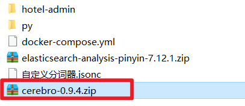
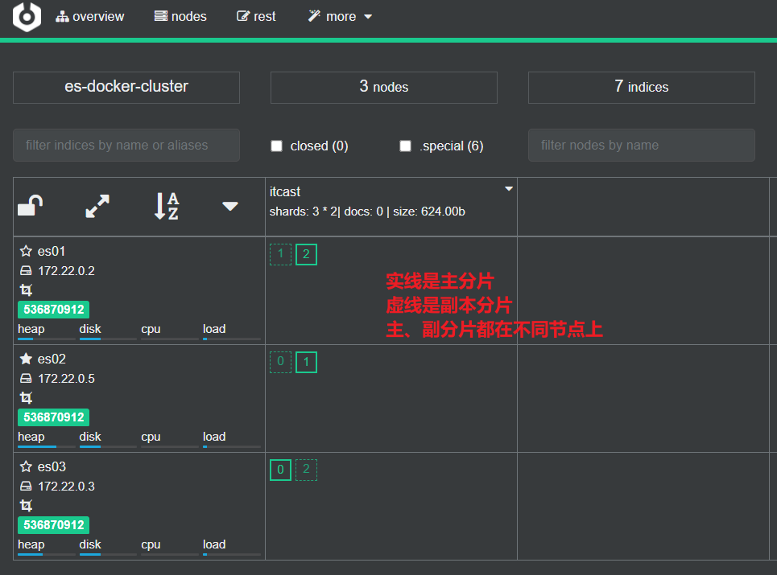

# 安装elasticsearch

所需资料链接：https://pan.baidu.com/s/1E8DACM04zsg6nsjvgyrxQg 
提取码：sdlp

# 1.部署单点es

## 1.1 创建网络

因为我们还需要部署kibana容器，因此需要让es和kibana容器互联。这里先创建一个网络：

```shell
docker network create es-net
```

## 1.2 加载镜像

这里我们采用elasticsearch的7.12.1版本的镜像，这个镜像体积非常大，接近1G。不建议大家自己pull。

课前资料提供了镜像的tar包：


大家将其上传到虚拟机中，然后运行命令加载即可：

```sh
# 导入数据
docker load -i es.tar
```

同理还有`kibana`的tar包也需要这样做。

## 1.3 创建挂载点目录

```shell
mkdir -p /usr/local/es/data /usr/local/es/config /usr/local/es/plugins
```

```shell
chmod 777  /usr/local/es/data
chmod 777  /usr/local/es/config
chmod 777  /usr/local/es/plugins
```

## 1.4 运行

运行docker命令，部署单点es：

```sh
docker run -d \
	--name es \
    -e "ES_JAVA_OPTS=-Xms512m -Xmx512m" \
    -e "discovery.type=single-node" \
	-v /usr/local/es/data:/usr/share/elasticsearch/data \
	-v /usr/local/es/plugins:/usr/share/elasticsearch/plugins \
    --privileged \
    --network es-net \
    -p 9200:9200 \
    -p 9300:9300 \
elasticsearch:7.12.1
```


命令解释：

- `-e "cluster.name=es-docker-cluster"`：设置集群名称
- `-e "http.host=0.0.0.0"`：监听的地址，可以外网访问
- `-e "ES_JAVA_OPTS=-Xms512m -Xmx512m"`：内存大小
- `-e "discovery.type=single-node"`：非集群模式
- `-v es-data:/usr/share/elasticsearch/data`：挂载逻辑卷，绑定es的数据目录
- `-v es-logs:/usr/share/elasticsearch/logs`：挂载逻辑卷，绑定es的日志目录
- `-v es-plugins:/usr/share/elasticsearch/plugins`：挂载逻辑卷，绑定es的插件目录
- `--privileged`：授予逻辑卷访问权
- `--network es-net` ：加入一个名为es-net的网络中
- `-p 9200:9200`：端口映射配置

## 1.5 测试

访问虚拟机地址+端口号，前面配置Elasticsearch 的端口号为：9200 即可看到elasticsearch的响应结果：


外部访问


# 2.部署kibana

kibana可以给我们提供一个elasticsearch的可视化界面

## 2.1.部署

运行docker命令，部署kibana

```sh
docker run -d \
--name kibana \
-e ELASTICSEARCH_HOSTS=http://es:9200 \
--network=es-net \
-p 5601:5601  \
kibana:7.12.1
```

- `--network es-net` ：加入一个名为es-net的网络中，与elasticsearch在同一个网络中
- `-e ELASTICSEARCH_HOSTS=http://es:9200"`：设置elasticsearch的地址，因为kibana已经与elasticsearch在一个网络，因此可以用容器名直接访问elasticsearch
- `-p 5601:5601`：端口映射配置

**kibana启动一般比较慢，需要多等待一会**，可以通过命令：

```sh
docker logs -f kibana
```

查看运行日志，当查看到下面的日志，说明成功：


此时，在浏览器输入地址访问：http://主机ip:5601，即可看到结果

## 2.2 测试

访问虚拟机地址+端口号，前面配置Kibana 的端口号为：5601

```
http://192.168.200.134:5601
```


## 2.3 使用DevTools工具

kibana中提供了一个DevTools界面：


这个界面中可以编写DSL来操作elasticsearch。并且对DSL语句有自动补全功能。

# 3.安装IK分词器

**注意：安装IK分词器的版本，必须和Elasticsearch的版本一致**

## 3.1.在线安装ik插件（较慢）

```shell
# 进入容器内部
docker exec -it elasticsearch /bin/bash

# 在线下载并安装
./bin/elasticsearch-plugin  install https://github.com/medcl/elasticsearch-analysis-ik/releases/download/v7.12.1/elasticsearch-analysis-ik-7.12.1.zip

#退出
exit
#重启容器
docker restart elasticsearch
```

## 3.2.离线安装ik插件（推荐）

### 1）查看数据卷目录

安装插件需要知道elasticsearch的plugins目录位置，而我们用了数据卷挂载，因此需要查看elasticsearch的数据卷目录，通过下面命令查看:

```sh
docker volume inspect es-plugins
```

显示结果：

```json
[
    {
        "CreatedAt": "2022-05-06T10:06:34+08:00",
        "Driver": "local",
        "Labels": null,
        "Mountpoint": "/var/lib/docker/volumes/es-plugins/_data",
        "Name": "es-plugins",
        "Options": null,
        "Scope": "local"
    }
]
```

说明plugins目录被挂载到了：`/var/lib/docker/volumes/es-plugins/_data `这个目录中。

### 2）解压缩分词器安装包

下面我们需要把课前资料中的ik分词器解压缩，重命名为ik


### 3）上传到es容器的插件数据卷中

也就是`/var/lib/docker/volumes/es-plugins/_data `：


###  4）重启容器

```shell
# 4、重启容器
docker restart es
```

```sh
# 查看es日志
docker logs -f es
```

### 5）测试

IK分词器包含两种模式：

* `ik_smart`：最少切分

* `ik_max_word`：最细切分

```json
GET /_analyze
{
  "analyzer": "ik_max_word",
  "text": "程序员学习java太棒了"
}
```

结果：

```json
{
  "tokens" : [
    {
      "token" : "程序员",
      "start_offset" : 0,
      "end_offset" : 3,
      "type" : "CN_WORD",
      "position" : 0
    },
    {
      "token" : "程序",
      "start_offset" : 0,
      "end_offset" : 2,
      "type" : "CN_WORD",
      "position" : 1
    },
    {
      "token" : "员",
      "start_offset" : 2,
      "end_offset" : 3,
      "type" : "CN_CHAR",
      "position" : 2
    },
    {
      "token" : "学习",
      "start_offset" : 3,
      "end_offset" : 5,
      "type" : "CN_WORD",
      "position" : 3
    },
    {
      "token" : "java",
      "start_offset" : 5,
      "end_offset" : 9,
      "type" : "ENGLISH",
      "position" : 4
    },
    {
      "token" : "太棒了",
      "start_offset" : 9,
      "end_offset" : 12,
      "type" : "CN_WORD",
      "position" : 5
    },
    {
      "token" : "太棒",
      "start_offset" : 9,
      "end_offset" : 11,
      "type" : "CN_WORD",
      "position" : 6
    },
    {
      "token" : "了",
      "start_offset" : 11,
      "end_offset" : 12,
      "type" : "CN_CHAR",
      "position" : 7
    }
  ]
}
```

## 3.3 扩展词词典

随着互联网的发展，“造词运动”也越发的频繁。出现了很多新的词语，在原有的词汇列表中并不存在。比如：“奥力给”，“传智播客” 等。

所以我们的词汇也需要不断的更新，IK分词器提供了扩展词汇的功能。

1）打开IK分词器config目录：


2）在IKAnalyzer.cfg.xml配置文件内容添加：

```xml
<?xml version="1.0" encoding="UTF-8"?>
<!DOCTYPE properties SYSTEM "http://java.sun.com/dtd/properties.dtd">
<properties>
        <comment>IK Analyzer 扩展配置</comment>
        <!--用户可以在这里配置自己的扩展字典 *** 添加扩展词典-->
        <entry key="ext_dict">ext.dic</entry>
</properties>
```

3）新建一个 ext.dic，可以参考config目录下复制一个配置文件进行修改

```properties
传智播客
奥力给
```

4）重启elasticsearch 

```sh
docker restart es
# 查看 日志
docker logs -f elasticsearch
```


日志中已经成功加载ext.dic配置文件

5）测试效果：

```json
GET /_analyze
{
  "analyzer": "ik_max_word",
  "text": "传智播客Java就业超过90%,奥力给！"
}
```

> 注意当前文件的编码必须是 UTF-8 格式，严禁使用Windows记事本编辑

## 3.4 停用词词典

在互联网项目中，在网络间传输的速度很快，所以很多语言是不允许在网络上传递的，如：关于宗教、政治等敏感词语，那么我们在搜索时也应该忽略当前词汇。

IK分词器也提供了强大的停用词功能，让我们在索引时就直接忽略当前的停用词汇表中的内容。

1）IKAnalyzer.cfg.xml配置文件内容添加：

```xml
<?xml version="1.0" encoding="UTF-8"?>
<!DOCTYPE properties SYSTEM "http://java.sun.com/dtd/properties.dtd">
<properties>
        <comment>IK Analyzer 扩展配置</comment>
        <!--用户可以在这里配置自己的扩展字典-->
        <entry key="ext_dict">ext.dic</entry>
         <!--用户可以在这里配置自己的扩展停止词字典  *** 添加停用词词典-->
        <entry key="ext_stopwords">stopword.dic</entry>
</properties>
```

3）在 stopword.dic 添加停用词

```properties
习大大
```

4）重启elasticsearch 

```sh
# 重启服务
docker restart elasticsearch
docker restart kibana

# 查看 日志
docker logs -f elasticsearch
```

日志中已经成功加载stopword.dic配置文件

5）测试效果：

```json
GET /_analyze
{
  "analyzer": "ik_max_word",
  "text": "传智播客Java就业率超过95%,习大大都点赞,奥力给！"
}
```

> 注意当前文件的编码必须是 UTF-8 格式，严禁使用Windows记事本编辑

# 4.部署es集群

部署es集群可以直接使用docker-compose来完成，不过要求你的Linux虚拟机至少有**4G**的内存空间

## 4.1.创建es集群

首先编写一个docker-compose文件，内容如下：

```sh
version: '2.2'
services:
  es01:
    image: elasticsearch:7.12.1
    container_name: es01
    environment:
      - node.name=es01
      - cluster.name=es-docker-cluster
      - discovery.seed_hosts=es02,es03
      - cluster.initial_master_nodes=es01,es02,es03
      - "ES_JAVA_OPTS=-Xms512m -Xmx512m"
    volumes:
      - data01:/usr/share/elasticsearch/data
    ports:
      - 9200:9200
    networks:
      - elastic
  es02:
    image: elasticsearch:7.12.1
    container_name: es02
    environment:
      - node.name=es02
      - cluster.name=es-docker-cluster
      - discovery.seed_hosts=es01,es03
      - cluster.initial_master_nodes=es01,es02,es03
      - "ES_JAVA_OPTS=-Xms512m -Xmx512m"
    volumes:
      - data02:/usr/share/elasticsearch/data
    ports:
      - 9201:9200
    networks:
      - elastic
  es03:
    image: elasticsearch:7.12.1
    container_name: es03
    environment:
      - node.name=es03
      - cluster.name=es-docker-cluster
      - discovery.seed_hosts=es01,es02
      - cluster.initial_master_nodes=es01,es02,es03
      - "ES_JAVA_OPTS=-Xms512m -Xmx512m"
    volumes:
      - data03:/usr/share/elasticsearch/data
    networks:
      - elastic
    ports:
      - 9202:9200
volumes:
  data01:
    driver: local
  data02:
    driver: local
  data03:
    driver: local

networks:
  elastic:
    driver: bridge
```

Run `docker-compose` to bring up the cluster:

```sh
docker-compose up
```

es运行需要修改一些linux系统权限，修改`/etc/sysctl.conf`文件

```sh
vi /etc/sysctl.conf
```

添加下面的内容：

```sh
vm.max_map_count=262144
```

然后执行命令，让配置生效：

```sh
sysctl -p
```

通过docker-compose启动集群：

```sh
docker-compose -f docker-compose.yml up -d
```

## 4.2.集群状态监控

kibana可以监控es集群，不过新版本需要依赖es的x-pack 功能，配置比较复杂。

这里推荐使用cerebro来监控es集群状态，官方网址：https://github.com/lmenezes/cerebro

资料已经提供了安装包：

链接：https://pan.baidu.com/s/1c7hRrcBmWvdmJ4Q5ameUmg 
提取码：51dn



解压即可使用，非常方便。

解压好的目录如下：


进入对应的bin目录：


双击其中的cerebro.bat文件即可启动服务。


访问http://localhost:9000 即可进入管理界面：


输入你的elasticsearch的任意节点的地址和端口，点击connect即可：


绿色的条，代表集群处于绿色（健康状态）。

## 4.3.创建索引库

### 1）利用kibana的DevTools创建索引库

在DevTools中输入指令：

```json
PUT /itcast
{
  "settings": {
    "number_of_shards": 3, // 分片数量
    "number_of_replicas": 1 // 副本数量
  },
  "mappings": {
    "properties": {
      // mapping映射定义 ...
    }
  }
}
```

### 2）利用cerebro创建索引库

利用cerebro还可以创建索引库：


填写索引库信息：


点击右下角的create按钮：


## 4.4.查看分片效果

回到首页，即可查看索引库分片效果：



# 5. 拼音分词器插件

要实现根据字母做补全，就必须对文档按照拼音分词。在GitHub上恰好有elasticsearch的拼音分词插件。地址：https://github.com/medcl/elasticsearch-analysis-pinyin


课前资料中也提供了拼音分词器的安装包：

 

安装方式与IK分词器一样，分三步：

​	①解压

​	②上传到虚拟机中，elasticsearch的plugin目录

​	③重启elasticsearch

​	④测试

详细安装步骤可以参考IK分词器的安装过程。

测试用法如下：

```json
POST /_analyze
{
  "text": "如家酒店还不错",
  "analyzer": "pinyin"
}
```

结果：

 


# :candy:

# 安装Elasticsearch 8.6.0 版本

## 1. Elasticsearch 简介

- Elasticsearch（ES） 是一个基于 Apache Lucene 开源的分布式、高扩展、近实时的搜索引擎，主要用于海量数据快速存储，实时检索，高效分析的场景。通过简单易用的 RESTful API，隐藏 Lucene 的复杂性，让全文搜索变得简单。
- ES 功能总结有三点：
  - 分布式 **存储**
  - 分布式 **搜索**
  - 分布式 **分析**
- 因为是分布式，可将海量数据分散到多台服务器上存储，检索和分析，只要是海量数据需要完成上面这三种操作的业务场景，一般都会考虑使用 ES，比如维基百科，Stack Overflow，GitHub 后台均有使用。

## 2. 基于Docker安装Elasticsearch

### 2.1 创建网络

```
docker network create es-net
```

实例：

```shell
[root@bogon howlong]# docker network create es-net
344f17ffe435894bc3ec98f3e3c1ad93cbde41a473576e645a0d24b6111e7e2e
[root@bogon howlong]#
```

### 2.2 拉取镜像

```cobol
docker pull elasticsearch:8.6.0
```

实例：

```shell
[root@bogon howlong]# docker pull elasticsearch:8.6.0
8.6.0: Pulling from library/elasticsearch
846c0b181fff: Pull complete 
f3516e94dfa9: Pull complete 
b8d95ef1999f: Pull complete 
69af40093f34: Pull complete 
52d2fb478029: Pull complete 
14619d64e022: Pull complete 
ff00ac3f5836: Pull complete 
2eed17832094: Pull complete 
5a7083c2053b: Pull complete 
Digest: sha256:12d0ff50b96a53d2a8e103ba2e0e69187babc3dcf8bdc88788d019cdebb75c0c
Status: Downloaded newer image for elasticsearch:8.6.0
docker.io/library/elasticsearch:8.6.0
[root@bogon howlong]# 
```

### 2.3 创建挂载点目录

```shell
mkdir -p /usr/local/es/data /usr/local/es/config /usr/local/es/plugins
```

```shell
chmod 777  /usr/local/es/data
chmod 777  /usr/local/es/config
chmod 777  /usr/local/es/plugins
```

### 2.4 部署单点es，创建es容器

```shell
docker run -d \
--restart=always \
--name es \
--network es-net \
-p 9200:9200 \
-p 9300:9300 \
--privileged \
-v /usr/local/es/data:/usr/share/elasticsearch/data \
-v /usr/local/es/plugins:/usr/share/elasticsearch/plugins \
-e "discovery.type=single-node" \
-e "ES_JAVA_OPTS=-Xms512m -Xmx512m" \
elasticsearch:8.6.0
```

运行结果:


### 2.5 编写elasticsearch.yml

```shell
root@lfj-virtual-machine:# docker exec -it es /bin/bash
elasticsearch@977d28738985:~$ cd config
elasticsearch@977d28738985:~/config$ echo 'xpack.security.enabled: false' >> elasticsearch.yml
elasticsearch@977d28738985:~/config$ 
```

### 2.6 重启es容器

> 指令；
>
> ```undefined
> docker restart es
> ```

### 2.7 测试Elasticsearch是否安装成功

访问虚拟机地址+端口号，前面配置Elasticsearch 的端口号为：9200

例如：

```cobol
http://192.168.200.134:9200/
```


## 3. 基于Docker安装Kibana

### 3.1 拉取镜像

```shell
docker pull kibana:8.6.0
```

实例：

```shell
[root@bogon howlong]# docker pull kibana:8.6.0
8.6.0: Pulling from library/kibana
846c0b181fff: Already exists 
d9d4723b53e8: Pull complete 
3ce175049527: Pull complete 
c5a9d626f54a: Pull complete 
ce0bd3b890fe: Pull complete 
4f4fb700ef54: Pull complete 
1cb2fe49dd32: Pull complete 
7cbec743e1ac: Pull complete 
de07a2df0c3f: Pull complete 
f138fef302e6: Pull complete 
c6afac2b2f31: Pull complete 
53c0672d0212: Pull complete 
7522efaa8c9c: Pull complete 
5e8db7e50c16: Pull complete 
Digest: sha256:71d8a59d32b181c3b3c04a4fecf2197f00eb381659510d04261c2cd5d43a0225
Status: Downloaded newer image for kibana:8.6.0
docker.io/library/kibana:8.6.0
[root@bogon howlong]# 
```

### 3.2 创建挂载点目录

```shell
mkdir -p /usr/local/kibana/config /usr/local/kibana/data
```

```shell
chmod 777 /usr/local/kibana/data
chmod 777 /usr/local/kibana/config
```

### 3.3 部署kibana，创建kibana容器

```shell
docker run -d \
--restart=always \
--name kibana \
--network es-net \
-p 5601:5601 \
-e ELASTICSEARCH_HOSTS=http://es:9200 \
kibana:8.6.0
```

### 3.4 测试Kibana是否安装成功

访问虚拟机地址+端口号，前面配置Kibana 的端口号为：5601

```
http://192.168.27.129:5601
```


## 4. 基于Docker安装IK分词器

### 4.1 进入Elasticsearch容器

```shell
docker exec -it es /bin/bash
```

### 4.2 在线安装IK分词器

**注意：安装IK分词器的版本，必须和Elasticsearch的版本一致，上文安装的是Elasticsearch 8.6.0的，所以接下来安装的IK分词器版本是8.6.0**

```shell
./bin/elasticsearch-plugin install https://github.com/medcl/elasticsearch-analysis-ik/releases/download/v8.6.0/elasticsearch-analysis-ik-8.6.0.zip
```

如果需要安装其他版本的IK分词器，需要把版本号修改即可

如：

```
./bin/elasticsearch-plugin install https://github.com/medcl/elasticsearch-analysis-ik/releases/download/v7.4.2/elasticsearch-analysis-ik-7.4.2.zip
```

# 虚拟机内存不足

```shell
docker logs -f es
```

日志如下:

{"type": "server", "timestamp": "2023-10-30T07:23:46,472Z", "level": "WARN", "component": "o.e.c.r.a.DiskThresholdMonitor", "cluster.name": "docker-cluster", "node.name": "989a610fc0c8", "message": "high disk watermark [90%] exceeded on [vg1lfD9rR1eSgKsBNBsN7A][989a610fc0c8][/usr/share/elasticsearch/data/nodes/0] free: 2gb[5.3%], shards will be relocated away from this node; currently relocating away shards totalling [0] bytes; the node is expected to continue to exceed the high disk watermark when these relocations are complete", "cluster.uuid": "9K3VuhoMRUuItnHnvUt4-A", "node.id": "vg1lfD9rR1eSgKsBNBsN7A"  } 

根据提供的日志信息，可以看到高磁盘水位标记（high disk watermark）已超过90%。这意味着磁盘空间已经接近满了，导致Elasticsearch无法继续在当前节点上存储数据。

解决该问题的方法是，清理或增加磁盘空间。以下是一些可行的解决方案：

1. 清理磁盘空间：检查磁盘上是否存在不再需要的旧数据、日志文件或临时文件，并将其删除。可以使用命令如`du`和`rm`来查找和删除不必要的文件。
2. 调整Elasticsearch的数据路径：检查Elasticsearch的配置文件中`path.data`属性的设置，并确保将数据存储在足够大的磁盘分区上。
3. 扩大磁盘空间：如果磁盘空间不足，考虑增加磁盘大小或添加额外的磁盘。
4. 在集群中重新平衡分片：当磁盘水位问题得到解决后，你可以重新平衡集群中的分片，以确保数据在各个节点上均衡分布。

解决方法:

+ [虚拟机扩容](https://blog.csdn.net/m0_74923682/article/details/129255801)
+ [解决ubuntu20.04虚拟机无法上网的问题](https://blog.csdn.net/xu624735206/article/details/108797471)
+ [ubuntu20.04 -vm-扩展硬盘后30G后不能联网](https://blog.csdn.net/weixin_43224306/article/details/124892570?utm_medium=distribute.pc_relevant.none-task-blog-2~default~baidujs_baidulandingword~default-0-124892570-blog-105430944.235^v38^pc_relevant_sort_base1&spm=1001.2101.3001.4242.1&utm_relevant_index=3)

1、亲测最简单有效的解决方式

Step 1、打开终端窗口，在终端窗口输入如下命令：

```cobol
sudo service network-manager stop
sudo rm /var/lib/NetworkManager/NetworkManager.state
sudo service network-manager start
```

2.开机自动联网

```bash
systemctl disable NetworkManager #开机禁用联网
systemctl enable NetworkManager  #开机自动联网
```

