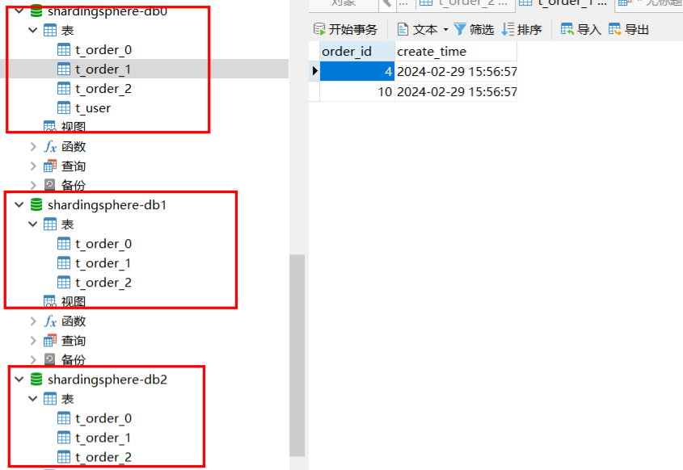
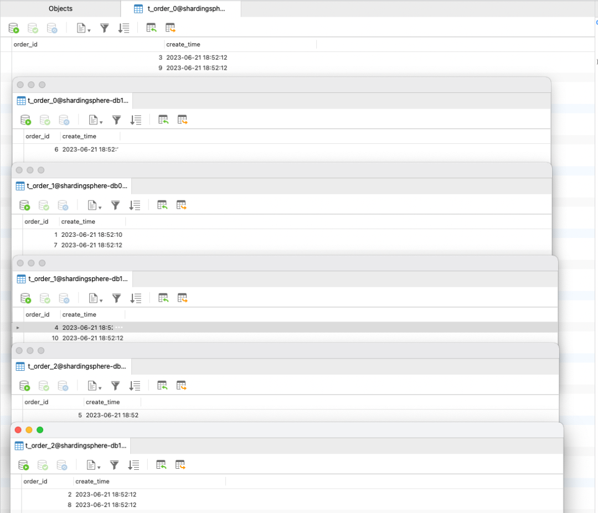
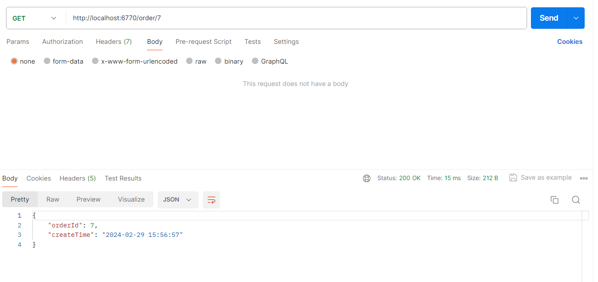
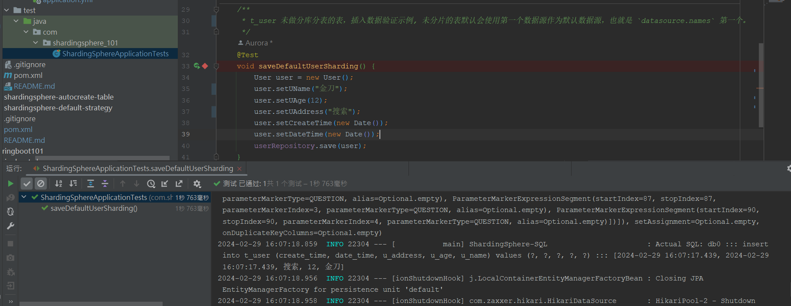
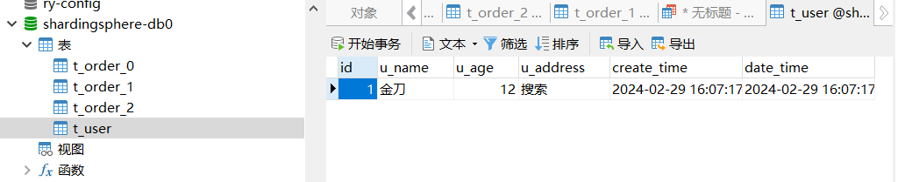

# yml 和 Java编码的方式实现了简单的分库分表

## 依赖

```xml
        <!-- MyBatis Plus -->
        <dependency>
            <groupId>com.baomidou</groupId>
            <artifactId>mybatis-plus-boot-starter</artifactId>
            <version>${mybatis.plus.version}</version>
        </dependency>

        <!-- 必须引入的包 mysql -->
        <dependency>
            <groupId>com.mysql</groupId>
            <artifactId>mysql-connector-j</artifactId>
            <version>${mysql.connector.version}</version>
        </dependency>

        <!-- 必须引入的包 ShardingSphere -->
        <dependency>
            <groupId>org.apache.shardingsphere</groupId>
            <artifactId>shardingsphere-jdbc-core-spring-boot-starter</artifactId>
            <version>${shardingsphere.version}</version>
        </dependency>
```

## application.yml

```yaml
server:
  port: 6770

spring:
  shardingsphere:
    # 数据源配置
    datasource:
      # 数据源名称，多数据源以逗号分隔 ,放在第一个的数据源为未配置分片规则表的默认数据源
      names: db2 , db1 , db0
      db0:
        # 数据库连接池类名称
        type: com.zaxxer.hikari.HikariDataSource
        # 数据库驱动类名
        driver-class-name: com.mysql.cj.jdbc.Driver
        jdbc-url: jdbc:mysql://127.0.0.1:3306/shardingsphere-db0?useUnicode=true&characterEncoding=utf-8&useSSL=false&serverTimezone=Asia/Shanghai&allowPublicKeyRetrieval=true
        username: root
        password: 741106
      db1:
        # 数据库连接池类名称
        type: com.zaxxer.hikari.HikariDataSource
        # 数据库驱动类名
        driver-class-name: com.mysql.cj.jdbc.Driver
        jdbc-url: jdbc:mysql://127.0.0.1:3306/shardingsphere-db1?useUnicode=true&characterEncoding=utf-8&useSSL=false&serverTimezone=Asia/Shanghai&allowPublicKeyRetrieval=true
        username: root
        password: 741106
      db2:
        # 数据库连接池类名称
        type: com.zaxxer.hikari.HikariDataSource
        # 数据库驱动类名
        driver-class-name: com.mysql.cj.jdbc.Driver
        jdbc-url: jdbc:mysql://127.0.0.1:3306/shardingsphere-db2?useUnicode=true&characterEncoding=utf-8&useSSL=false&serverTimezone=Asia/Shanghai&allowPublicKeyRetrieval=true
        username: root
        password: 741106

    # 规则配置
    rules:
      sharding:
        # 设置默认数据源
        default-data-source-name: db1
        # 分片算法配置
        sharding-algorithms:
          database-inline:  #自定义的分片算法名称
            # 分片算法类型
            type: INLINE
            props:
              # 分片算法的行表达式
              algorithm-expression: db$->{order_id % 2}  #根据取模结果计算出db0、db1，分表的表达式同理
          table-inline:
            # 分片算法类型
            type: INLINE
            props:
              # 分片算法的行表达式
              algorithm-expression: t_order_$->{order_id % 3}
        # 分布式序列算法配置
        key-generators:
          snowflake:
            # 分布式序列算法（雪花算法：SNOWFLAKE； UUID：UUID）（注：UUID没有props配置）
            type: SNOWFLAKE
            # 分布式序列算法属性配置
            props:
              # 工作机器唯一标识
              worker-id: 1
        tables:
          # 逻辑表名称
          t_order:
            # 行表达式标识符可以使用 ${...} 或 $->{...}，但前者与 Spring 本身的属性文件占位符冲突，因此在 Spring 环境中使用行表达式标识符建议使用 $->{...}
            actual-data-nodes: db$->{0..1}.t_order_$->{0..3}
            # 分库策略
            database-strategy:
              standard:
                # 分片列名称
                sharding-column: order_id
                # 分片算法名称
                sharding-algorithm-name: database-inline
            # 分表策略
            table-strategy:
              standard:
                # 分片列名称  表示根据表的哪个列（分片键）进行计算分片路由到哪个库、表中
                sharding-column: order_id
                # 分片算法名称 表示使用哪种分片算法对分片键进行运算处理，这里可以引用刚才自定义的分片算法名称使用
                sharding-algorithm-name: table-inline
    # 属性配置
    props:
      # 控制台输出展示修改以后的sql语句
      sql-show: true
```

## 运行结果

单元测试

```java
package com.shardingsphere_101;

import com.shardingsphere_101.entity.User;
import com.shardingsphere_101.repository.UserRepository;
import com.shardingsphere_101.service.OrderService;
import org.junit.jupiter.api.Test;
import org.springframework.boot.test.context.SpringBootTest;

import javax.annotation.Resource;
import java.util.Date;

@SpringBootTest
class ShardingSphereApplicationTests {

    @Resource
    private OrderService orderService;

    @Resource
    private UserRepository userRepository;

    /**
     * 插入 t_order 数据验证简单的分库分表示例
     */
    @Test
    void saveOrderSharding() {
        orderService.save();
        /*   orderService.save();具体代码如下:
        public Order save() {
        // 新增订单ID从1~10的测试数据
         LongStream.range(1, 11).forEach(value -> orderRepository.save(new Order(value, new Date())));
          return null;
        }
        */
    }

    /**
     * t_user 未做分库分表的表，插入数据验证示例
     */
    @Test
    void saveDefaultUserSharding() {
        User user = new User();
        user.setUName("金刀");
        user.setUAge(12);
        user.setUAddress("搜索");
        user.setCreateTime(new Date());
        user.setDateTime(new Date());
        userRepository.save(user);
    }
}

```

**插入**

单测在向数据库中插入 10 条数据时，发现数据已经相对均匀地插入到了各个分片中。





**查询**



## 默认数据源

创建一张`t_user`表，并且不对其进行任何分片规则的配置。

**未分片的表默认会使用第一个数据源作为默认数据源，也就是 `datasource.names` 第一个。**



运行结果

