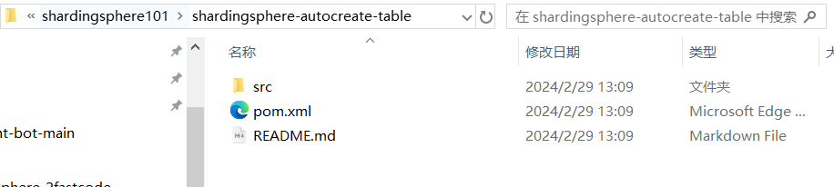
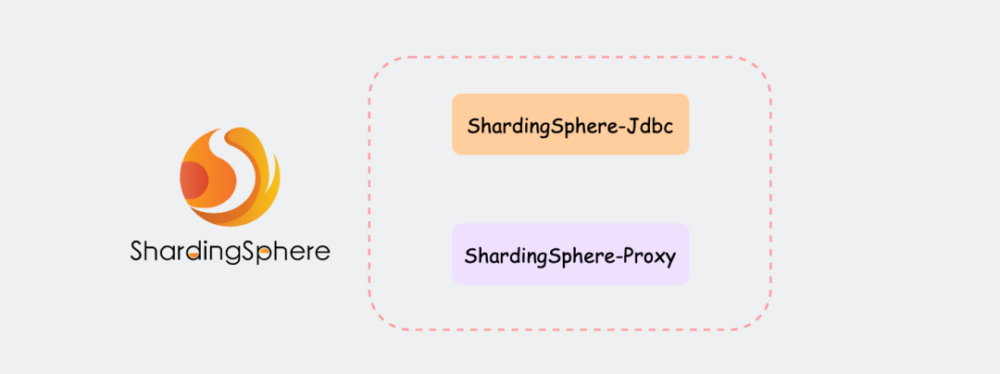
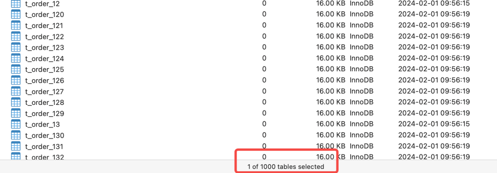
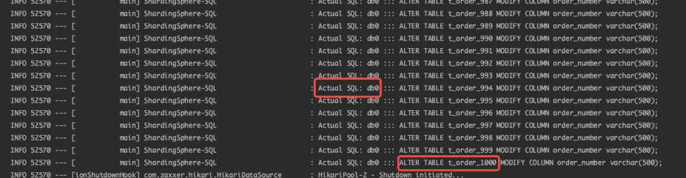
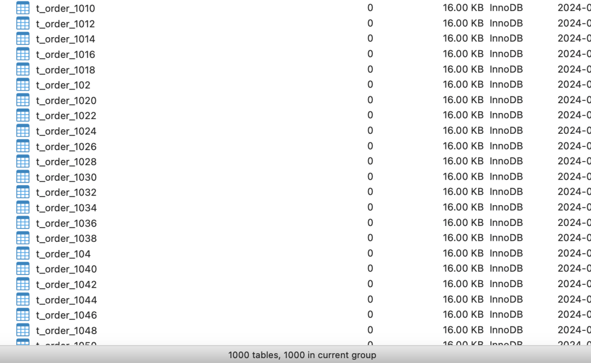

# shardingsphere 自动化的表分片功能(自动建表)

**代码见: shardingsphere-autocreate-table**


`ShardingSphere`框架成员中的`Shardingsphere-jdbc`和`Shardingsphere-proxy`都提供了自动化管理分片表的功能`auto-tables`，可以统一维护大量的分片表，避免了手动编写脚本和维护分片表的繁琐工作，极大程度减少分库分表的开发和维护成本，提升效率和可靠性。



## 思路

假设我们要对`t_order`表进行分库分表，首先我们要做的就是确定好分片方案，这里使用两个数据库实例`db0`、`db1`，每个实例中`t_order`表分成1000张分片表`t_order_1 ~ t_order_1000`，`order_id`字段作为分片键，分片算法使用取模算法`order_id % n`，分布式主键生成策略采用`snowflake`。

`t_order`逻辑表的表结构如下：

```sql
CREATE TABLE `t_order` (
 `order_id` BIGINT ( 20 ) NOT NULL COMMENT "订单表分布式主健ID",
 `order_number` VARCHAR ( 255 ) NOT NULL COMMENT "订单号",
 `customer_id` BIGINT ( 20 ) NOT NULL COMMENT "用户ID",
 `order_date` date NOT NULL COMMENT "下单时间",
 `total_amount` DECIMAL ( 10, 2 ) NOT NULL COMMENT "订单金额",
    PRIMARY KEY ( `order_id` ) USING BTREE 
);
```

## 分片规则配置

设定好分片规则，接着编写逻辑表`t_order`的分片规则的配置，分别使用`yml配置`和`Java编码`两种方式做了实现。**要注意的是两种方式不要并存，不然启动会报错**。

### yml配置方式

使用yml配置相对简单易用比较直观，适合对分库分表要求不太复杂的场景，完整配置如下：

```yaml
spring:
  shardingsphere:
    datasource:
      # 数据源名称，多数据源以逗号分隔 ,放在第一个的数据源为未配置分片规则表的默认数据源
      names: db0 , db1
      # 名称与上面 names 保持一致
      db0:
      ....

      db1:
      ....
    # 具体规则配置
    rules:
      sharding:
        # 分片算法定义
        sharding-algorithms:
          # 自定义分片算法名称
          t_order_database_algorithms:
            # 分片算法类型
            type: INLINE
            # 自定义参数
            props:
              algorithm-expression: db$->{order_id % 2}
          t_order_table_algorithms:
            type: INLINE
            props:
              algorithm-expression: t_order_$->{order_id % 1000}
          t_order_mod:
            type: MOD
            props:
              # 指定分片数量
              sharding-count: 1000
        # 分布式序列算法配置
        key-generators:
          t_order_snowflake:
            type: SNOWFLAKE
            # 分布式序列算法属性配置
            props:
              worker-id: 1
        tables:
          # 逻辑表名称
          t_order:
            # 数据节点：数据库.分片表
            actual-data-nodes: db$->{0..1}.t_order_$->{1..1000}
            # 分库策略
            database-strategy:
              standard:
                # 分片列名称
                sharding-column: order_id
                # 分片算法名称
                sharding-algorithm-name: t_order_database_algorithms
            # 分表策略
            table-strategy:
              standard:
                # 分片列名称
                sharding-column: order_id
                # 分片算法名称
                sharding-algorithm-name: t_order_table_algorithms
            # 主键生成策略
            keyGenerateStrategy:
              column: order_id
              keyGeneratorName: t_order_snowflake
    # 属性配置
    props:
      # 展示修改以后的sql语句
      sql-show: true
```

### Java编码方式

使用Java编码方式更加灵活和可扩展，可以根据业务定制分片规则，适合对分库分表有特殊需求或需要动态调整的场景。

```java
/**
 */
@Configuration
public class ShardingConfiguration {

    /**
     * 配置分片数据源
     */
    @Bean
    public DataSource getShardingDataSource() throws SQLException {
        Map<String, DataSource> dataSourceMap = new HashMap<>();
        dataSourceMap.put("db0", dataSource0());
        dataSourceMap.put("db1", dataSource1());

        // 分片rules规则配置
        ShardingRuleConfiguration shardingRuleConfig = new ShardingRuleConfiguration();

        // 分片算法
        shardingRuleConfig.setShardingAlgorithms(getShardingAlgorithms());
        // 配置 t_order 表分片规则
        ShardingTableRuleConfiguration orderTableRuleConfig = new ShardingTableRuleConfiguration("t_order", "db${0..1}.t_order_${1..1000}");
        orderTableRuleConfig.setTableShardingStrategy(new StandardShardingStrategyConfiguration("order_id", "t_order_table_algorithms"));
        orderTableRuleConfig.setDatabaseShardingStrategy(new StandardShardingStrategyConfiguration("order_id", "t_order_database_algorithms"));
        shardingRuleConfig.getTables().add(orderTableRuleConfig);

        // 是否在控制台输出解析改造后真实执行的 SQL
        Properties properties = new Properties();
        properties.setProperty("sql-show", "true");

        // 创建 ShardingSphere 数据源
        return ShardingSphereDataSourceFactory.createDataSource(dataSourceMap, Collections.singleton(shardingRuleConfig), properties);
    }

    /**
     * 配置数据源1
     */
    public DataSource dataSource0() {
        HikariDataSource dataSource = new HikariDataSource();
        dataSource.setDriverClassName("com.mysql.cj.jdbc.Driver");
        dataSource.setJdbcUrl("jdbc:mysql://127.0.0.1:3306/db0?useUnicode=true&characterEncoding=utf-8&useSSL=false&serverTimezone=Asia/Shanghai&allowPublicKeyRetrieval=true");
        dataSource.setUsername("root");
        dataSource.setPassword("123456");
        return dataSource;
    }

    /**
     * 配置数据源2
     */
    public DataSource dataSource1() {
        HikariDataSource dataSource = new HikariDataSource();
        dataSource.setDriverClassName("com.mysql.cj.jdbc.Driver");
        dataSource.setJdbcUrl("jdbc:mysql://127.0.0.1:3306/db1?useUnicode=true&characterEncoding=utf-8&useSSL=false&serverTimezone=Asia/Shanghai&allowPublicKeyRetrieval=true");
        dataSource.setUsername("root");
        dataSource.setPassword("123456");
        return dataSource;
    }

    /**
     * 配置分片算法
     */
    private Map<String, AlgorithmConfiguration> getShardingAlgorithms() {
        Map<String, AlgorithmConfiguration> shardingAlgorithms = new LinkedHashMap<>();

        // 自定义分库算法
        Properties databaseAlgorithms = new Properties();
        databaseAlgorithms.setProperty("algorithm-expression", "db$->{order_id % 2}");
        shardingAlgorithms.put("t_order_database_algorithms", new AlgorithmConfiguration("INLINE", databaseAlgorithms));

        // 自定义分表算法
        Properties tableAlgorithms = new Properties();
        tableAlgorithms.setProperty("algorithm-expression", "db$->{order_id % 1000}");
        shardingAlgorithms.put("t_order_table_algorithms", new AlgorithmConfiguration("INLINE", tableAlgorithms));

        return shardingAlgorithms;
    }
}
```

上面我们在应用中编写好了分片规则，现在就差在数据库实例中创建分片表了，手动创建和管理1000张分片表确实是一个又脏又累的活，反正我是不会干的！

## 管理分片表

其实，`ShardingSphere`内已经为我们提供了管理分片表的能力。

当一张逻辑表`t_order`被配置了分片规则，那么接下来对逻辑表的各种`DDL`操作（例如`创建表`、`修改表结构`等），命令和数据会根据分片规则，执行和存储到每个分片数据库和分片库中的相应分片表中，以此保持整个分片环境的一致性。

不过，使用`Shardingsphere-jdbc`管理分片表的过程中，是需要我们手动编写对逻辑表的`DDL`操作的代码。

我们来跑几个单元测试用例来观察实际的执行效果，直接使用`jdbcTemplate`执行创建逻辑表`t_order`的SQL。

```java
package com.shardingsphere_101;

import org.junit.jupiter.api.DisplayName;
import org.junit.jupiter.api.Test;
import org.springframework.boot.test.context.SpringBootTest;
import org.springframework.jdbc.core.JdbcTemplate;
import javax.annotation.Resource;

/**
 * 自动创建分片表
 */
@SpringBootTest
class AutoCreateTablesTests {

    @Resource
    private JdbcTemplate jdbcTemplate;

    /**
     * 执行创建逻辑表的SQL，会根据AutoTables的配置自动在对应的数据源内创建分片表
     *
     */
    @DisplayName("创建分片表")
    @Test
    public void autoCreateOrderTableTest() {

        jdbcTemplate.execute("CREATE TABLE `t_order` (\n" +
                "  `order_id` bigint(20) NOT NULL,\n" +
                "  `order_number` varchar(255) NOT NULL,\n" +
                "  `customer_id` bigint(20) NOT NULL,\n" +
                "  `order_date` date NOT NULL,\n" +
                "  `total_amount` decimal(10,2) NOT NULL,\n" +
                "  PRIMARY KEY (`order_id`) USING BTREE\n" +
                ");");
    }

    /**
     * 修改 t_order 表
     *
     */
    @DisplayName("修改分片表字段长度")
    @Test
    public void autoModifyOrderTableTest() {

        jdbcTemplate.execute("ALTER TABLE t_order MODIFY COLUMN order_number varchar(500);");
    }

    /**
     * 删除 t_order 表
     *
     */
    @DisplayName("删除分片表")
    @Test
    public void autoDeleteOrderTableTest() {

        jdbcTemplate.execute("DROP TABLE `t_order`;");
    }
}

```

根据之前配置的分片规则，将会在两个数据库实例 `db0` 和 `db1` 中，分别生成`1000`张命名为`t_order_1`到`t_order_1000`的分片表，看到两个数据库均成功创建了1000张分片表。



在次执行更新`t_order`表SQL，将字段`order_number`长度从 `varchar(255)`扩展到 `varchar(500)`，执行SQL看下效果。

```java
@Test
public void autoModifyOrderTableTest() {
    jdbcTemplate.execute("ALTER TABLE t_order MODIFY COLUMN order_number varchar(500);");
}
```

通过查看两个分片库，我们成功地将所有分片表的`order_number`字段长度更改为了`varchar(500)`，在控制台日志中，可以看到它是通过在每个分片库内依次执行了1000次命令实现的。



`Shardingsphere-jdbc`实现分库分表时，可以采用这种默认的方式来管理分片表。但要注意的是，由于涉及到不同的数据库实例，如果不使用第三方的分布式事务管理工具（例如`Seata`等），执行过程是无法保证事务一致性的。

## 自定义管理分片表

上边为逻辑表配置分片规则，应用程序内执行对逻辑表的DDL操作，就可以很轻松的管理分片表。

### 自定义

不过，默认的分片管理还是有局限性的，我们在设计分片规则时往往会根据不同的业务维度来划分，例如按天、月、按季度生成分片表并分布到不同数据源中等。这样就需要一些自定义的规则来实现。

`ShardingSphere 5.X`版本后推出了一种新的管理分片配置方式：`AutoTable`。设置了`AutoTable`的逻辑表，将交由`ShardingSphere`自动管理分片，用户只需要指定分片数量和使用的数据库实例，无需再关心表的具体分布，配置格式如下：

```
spring:
  shardingsphere:
    # 数据源配置
    datasource:
      ......
    # 具体规则配置
    rules:
      sharding:
        # 逻辑表分片规则
        tables:
          # 逻辑表名称
          t_order:
            .....
        # 自动分片表规则配置
        auto-tables:
          t_order: # 逻辑表名称
            actual-data-sources: db$->{0..1}
            sharding-strategy: # 切分策略
              standard: # 用于单分片键的标准分片场景
                sharding-column: order_id # 分片列名称
                sharding-algorithm-name: t_order_mod # 自动分片算法名称
```

`ShardingSphere-Jdbc`中配置使用`auto-tables`主要两个参数，`actual-data-sources`指定数据源分布，由于是管理分片表所以只需数据源信息即可；`sharding-strategy`指具体采用何种算法来进行分片。

> 对逻辑表的DDL操作，系统会首先检查是否配置了**AutoTable**，如果已配置，则优先采用配置的规则；若未配置，则将使用默认的逻辑表分片规则。

`AutoTable`支持`ShardingSphere`内置的全部自动分片算法，所谓自动分片算法就是根据`actualDataSources`设置的数据源信息，使用对应内置算法自行解析处理。

- MOD：取模分片算法
- HASH_MOD：哈希取模分片算法
- VOLUME_RANGE：基于分片容量的范围分片算法
- BOUNDARY_RANGE：基于分片边界的范围分片算法
- AUTO_INTERVAL：自动时间段分片算法

### AutoTable使用

举个例子，我们使用内置`MOD`取模算法作为`AutoTable`的分片算法，同样是`db0`、`db1`两个实例中各创建1000张分片表。那么当对逻辑表的DDL操作时，`ShardingSphere`会依据分片表编号`t_order_0～t_order_1999 % 数据库实例数`取模来确认DDL命令路由到哪个实例中执行。

```
spring:
  shardingsphere:
    # 数据源配置
    datasource:
      .....
    # 具体规则配置
    rules:
      sharding:
        # 自动分片表规则配置
        auto-tables:
          t_order:
            actual-data-sources: db$->{0..1}
            sharding-strategy:
              standard:
                sharding-column: order_date
                sharding-algorithm-name: t_order_mod
        # 分片算法定义
        sharding-algorithms:
          t_order_mod:
            type: MOD
            props:
              # 指定分片数量
              sharding-count: 2000
```

还是执行刚才创建表的单元测试，会发现`db0`、`db1`两个实例中已经各自创建了1000张分片表，但你会发现1000张表已经不再是按照顺序创建的了。



上边使用的是内置自动分片算法，它对于我们来说是黑盒，提供它方便我们拿来即用。不过，如果想要做到更细粒度的管理分片表，最好的办法就是自定义分片算法，**后续章节会介绍所有内置分片算法和自定义分片算法的使用**。


