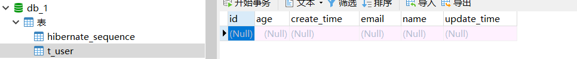

整合了 jpa 连接mysql，自动根据JAVA实体属性创建对应的表

运行效果:  自动建表 

注: 个人喜欢用mybatis框架




# SpringBoot 整合 JPA

## **表结构**

```sql
CREATE TABLE `meta_group` (
  `id` int(11) NOT NULL AUTO_INCREMENT,
  `group` varchar(32) NOT NULL DEFAULT '' COMMENT '分组',
  `profile` varchar(32) NOT NULL DEFAULT '' COMMENT 'profile 目前用在应用环境 取值 dev/test/pro',
  `desc` varchar(64) NOT NULL DEFAULT '' COMMENT '解释说明',
  `deleted` int(4) NOT NULL DEFAULT '0' COMMENT '0表示有效 1表示无效',
  `create_time` timestamp NOT NULL DEFAULT CURRENT_TIMESTAMP COMMENT '创建时间',
  `update_time` timestamp NOT NULL DEFAULT CURRENT_TIMESTAMP ON UPDATE CURRENT_TIMESTAMP COMMENT '修改时间',
  PRIMARY KEY (`id`),
  KEY `group_profile` (`group`,`profile`)
) ENGINE=InnoDB AUTO_INCREMENT=6 DEFAULT CHARSET=utf8mb4 COMMENT='业务配置分组表';
```

## **java写法**

```java
@Data
@Entity  //实体类注解，自动建表必须添加
@Table(name = "meta_group") //设置生成的表名,不添加默认表名为实体类名
public class MetaGroupPO { 
    @Id   //标注主键
    @GeneratedValue(strategy = GenerationType.IDENTITY) //id自增策略
    private Integer id;

    @Column(name = "`group`")
    private String group;

    @Column(name = "`profile`")
    private String profile;

    @Column(name = "`desc`")
    private String desc;

    @Column(name = "`deleted`")
    private Integer deleted;

    @Column(name = "`create_time`")  //设置生成的字段名,不添加默认字段为变量名
    private Timestamp createTime;

    @Column(name = "`update_time`")
    private Timestamp updateTime;
}
```

**详细说明**

@Column注解：

```
@Column注释定义了将成员属性映射到关系表中的哪一列和该列的结构信息，属性如下：
　　1）name：映射的列名。如：映射tbl_user表的name列，可以在name属性的上面或getName方法上面加入；
　　2）unique：是否唯一；
　　3）nullable：是否允许为空；
　　4）length：对于字符型列，length属性指定列的最大字符长度；
　　5）insertable：是否允许插入；
　　6）updatetable：是否允许更新；
　　7）columnDefinition：定义建表时创建此列的DDL；
　　8）secondaryTable：从表名。如果此列不建在主表上（默认是主表），该属性定义该列所在从表的名字
```

@Id注解：

```
@Id注释指定表的主键，它可以有多种生成方式：
　　1）TABLE：容器指定用底层的数据表确保唯一；
　　2）SEQUENCE：使用数据库德SEQUENCE列莱保证唯一（Oracle数据库通过序列来生成唯一ID）；
　　3）IDENTITY：使用数据库的IDENTITY列莱保证唯一；
　　4）AUTO：由容器挑选一个合适的方式来保证唯一；
　　5）NONE：容器不负责主键的生成，由程序来完成。
```

其中与@Id一起使用的还有另外两个注解：@GeneratedValue、@GenericGenerator，参考[@GeneratedValue与@GenericGenerator](https://blog.csdn.net/u011781521/article/details/72210980)

## JPA的Repository详解

### Spring Data JPA

Spring Data是Spring提供的操作数据的框架，Spring Data JPA是Spring Data的一个模块，通过Spring data 基于jpa标准操作数据的模块。
Spring Data的核心能力，就是基于JPA操作数据，并且可以简化操作持久层的代码。
它使用一个叫作Repository的接口类为基础，它被定义为访问底层数据模型的超级接口。而对于某种具体的数据访问操作，则在其子接口中定义。
Spring Data可以让我们只定义接口，只要遵循spring data的规范，就无需写实现类，不用写sql语句直接查询数据。

### Repository

- Repository

  提供了findBy + 属性 方法

    - CrudRepository

      继承了Repository 提供了对数据的增删改查

        - PagingAndSortRepository:

          继承了CrudRepository 提供了对数据的分页和排序，缺点是只能对所有的数据进行分页或者排序，不能做条件判断

            - JpaRepository： 继承了PagingAndSortRepository
              开发中经常使用的接口，主要继承了PagingAndSortRepository，对返回值类型做了适配

- JpaSpecificationExecutor
  提供多条件查询

#### CrudRepository

CrudRepository继承Repository，添加了一组对数据的增删改查的方法


#### PagingAndSortingRepository

PagingAndSortingRepository继承CrudRepository，添加了一组分页排序相关的方法


#### JpaRepository

JpaRepository继承PagingAndSortingRepository，添加了一组JPA规范相关的方法。对继承父接口中方法的返回值进行了适配,因为在父类接口中通常都返回迭代器，需要我们自己进行强制类型转化。而在JpaRepository中，直接返回了List。
**`开发中最常用JpaRepository`**


### JpaSpecificationExecutor

这个接口比较特殊，单独存在，没有继承以上接口。主要提供了多条件查询的支持，并且可以在查询中添加分页和排序。因为这个接口单独存在，因此需要配合以上说的接口使用。


### JpaRepository查询功能

#### Jpa方法命名规则

JpaRepository支持接口规范方法名查询。意思是如果在接口中定义的查询方法符合它的命名规则，就可以不用写实现，目前支持的关键字如下。

| Keyword           | Sample                         | JPQL snippet               |
| ----------------- | ------------------------------ | -------------------------- |
| And               | findByNameAndPwd               | where name= ? and pwd =?   |
| Or                | findByNameOrSex                | where name= ? or sex=?     |
| Is,Equals         | findById,findByIdEquals        | where id= ?                |
| Between           | findByIdBetween                | where id between ? and ?   |
| LessThan          | findByIdLessThan               | where id < ?               |
| LessThanEquals    | findByIdLessThanEquals         | where id <= ?              |
| GreaterThan       | findByIdGreaterThan            | where id > ?               |
| GreaterThanEquals | findByIdGreaterThanEquals      | where id > = ?             |
| After             | findByIdAfter                  | where id > ?               |
| Before            | findByIdBefore                 | where id < ?               |
| IsNull            | findByNameIsNull               | where name is null         |
| isNotNull,NotNull | findByNameNotNull              | where name is not null     |
| Like              | findByNameLike                 | where name like ?          |
| NotLike           | findByNameNotLike              | where name not like ?      |
| StartingWith      | findByNameStartingWith         | where name like ‘?%’       |
| EndingWith        | findByNameEndingWith           | where name like ‘%?’       |
| Containing        | findByNameContaining           | where name like ‘%?%’      |
| OrderBy           | findByIdOrderByXDesc           | where id=? order by x desc |
| Not               | findByNameNot                  | where name <> ?            |
| In                | findByIdIn(Collection<?> c)    | where id in (?)            |
| NotIn             | findByIdNotIn(Collection<?> c) | where id not in (?)        |
| True              | findByAaaTue                   | where aaa = true           |
| False             | findByAaaFalse                 | where aaa = false          |
| IgnoreCase        | findByNameIgnoreCase           | where UPPER(name)=UPPER(?) |
| top               | findTop10                      | top 10/where ROWNUM <=10   |

#### 使用方法

使用时自定义接口继承JpaRepository，传入泛型，第一个参数为要操作的实体类，第二个参数为该实体类的主键类型

```java
public interface SpuRepository extends JpaRepository<Spu, Long> {
    Spu findOneById(Long id);

    Page<Spu> findByCategoryIdOrderByCreateTimeDesc(Long cid, Pageable pageable);

    Page<Spu> findByRootCategoryIdOrderByCreateTime(Long cid, Pageable pageable);
}
```

#### 解析过程

**1.** Spring Data JPA框架在进行方法名解析时，会先把方法名多余的前缀截取掉，比如find，findBy，read，readBy，get，getBy，然后对剩下的部分进行解析。
**2.** 假设创建如下查询findByCategoryId(),框架在解析该方法时，首先剔除findBy，然后对剩下的属性进行解析，假设查询实体为Spu

```java
(1)先判断categoryId（根据POJO 规范，首字母变为小写）是否为查询实体的一个属性，如果是，则表示根据该属性进行查询；如果没有该属性，继续第二步；

(2)从右往左截取第一个大写字母开头的字符串此处为Id），然后检查剩下的字符串是否为查询实体的一个属性，如果是，则表示根据该属性进行查询；
如果没有该属性，则重复第二步，继续从右往左截取；最后假设user为查询实体的一个属性；

(3)接着处理剩下部分（CategoryId），先判断用户所对应的类型是否有categoryId属性，如果有，则表示该方法最终是根据"Spu.categoryId"的取值进行查询;
否则继续按照步骤2的规则从右往左截取。

(4)可能会存在一种特殊情况，比如Spu包含一个categoryId 的属性，也有一个 rootCategoryId属

性，此时会存在混淆。可以明确在属性之间加上"_" 以显式表达意图，比如

"findByRoot_CategoryId()" 
12345678910111213
```

**3.** 特殊参数
可以直接在方法的参数上加入分页或排序的参数，比如：

```java
Page<Spu> findByCategoryId(Long cid, Pageable pageable);

List<Spu> findByCategoryId(Long cid, Sort sort);
123
```

**4.** JPA的`@NamedQueries`

```java
(1)1：在实体类上使用@NamedQuery
@NamedQuery(name = "Spu.findByRootCategoryId",query = "select s from Spu s where s.rootCategoryId >= ?1")
(2)在自己实现的DAO的Repository接口里面定义一个同名的方法，示例如下：
public List<Spu> findByRootCategoryId(Long rootCategoryId);
(3)然后Spring会先找是否有同名的NamedQuery，如果有，那么就不会按照接口定义的方法来解析。
12345
```

**5.** 使用`@Query`
在方法上标注@Query来指定本地查询
参数nativeQuery默认为false，nativeQuery=false时，value参数写的是JPQL，JPQL是用来操作model对象的

```java
@Query(value="select s from Spu s where s.title like %?1" )
public List<Spu> findByTitle(String title);
12
```

nativeQuery=true时，value参数写的是原生sql

```java
@Query(value="select * from spu s where s.title like %?1",nativeQuery=true )
public List<Spu> findByTitle(String title);
12
```

**6.** 使用@Param命名化参数


## 基本使用

###  实体类

```java
package com.springboot101.po;

import lombok.AllArgsConstructor;
import lombok.Data;
import lombok.NoArgsConstructor;

import javax.persistence.*;
import java.util.Date;

@Data
@NoArgsConstructor
@AllArgsConstructor
@Entity   //实体类注解，自动建表必须添加
@Table(name = "t_user")  //设置生成的表名,不添加默认表名为实体类名
public class User {

    @Id   //标注主键
    @GeneratedValue(strategy = GenerationType.AUTO)   //id自增策略
    private Long id;

    private String name;

    private Integer age;

    private String email;

    @Column(name = "create_time")  //设置生成的字段名,不添加默认字段为变量名
    private Date createTime;

    @Column(name = "update_time")
    private Date updateTime;
}
```

### 编写xxxRepository

```java
package com.springboot101.repository;

import com.springboot101.po.User;
import org.springframework.data.jpa.repository.JpaRepository;

public interface UserRepository extends JpaRepository<User, Long> {
}
```

### service

```java
package com.springboot101.service;

import com.springboot101.po.User;
import com.springboot101.repository.UserRepository;
import org.springframework.stereotype.Component;

import javax.annotation.Resource;

@Component
public class UserService {

    @Resource
    private UserRepository userRepository;


    public void insertUser(User user){

        userRepository.save(user);
    }
}

```