# 实现

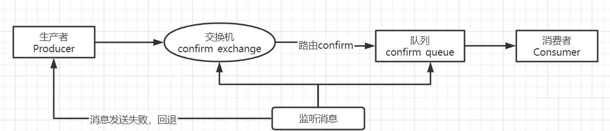

## 交换机的发布确认

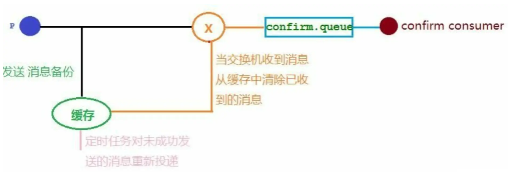

## 回退消息并重发

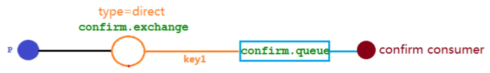


## 备份交换机

备份交换机可以理解为 RabbitMQ 中交换机的“备胎”，当给某一个交换机声明一个对应的备份交换机时，就是为它创建一个备胎，当交换机接收到一条不可路由消息时，将会把这条消息转发到备份交换机中，由备份交换机来进行转发和处理，通常备份交换机的类型为 Fanout （扇出），这样就能把所有消息都投递到与其绑定的队列中，然后我们在备份交换机下绑定一个队列，这样所有那些原交换机无法被路由的消息，就会都进 入这个队列了。当然，我们还可以建立一个报警队列，用独立的消费者来进行监测和报警并可以重发消息。

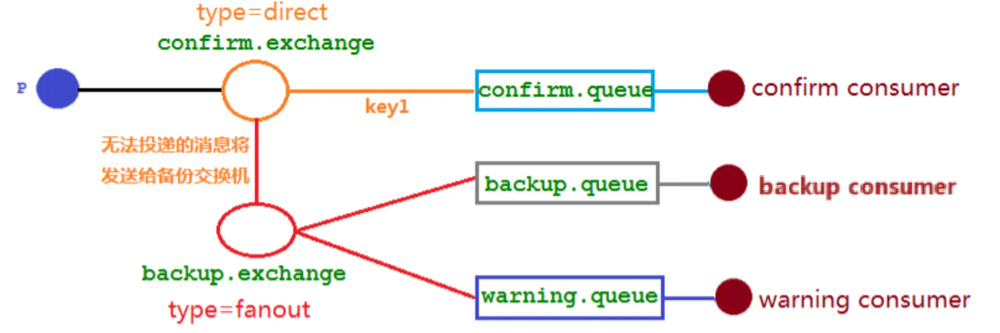

交换机都收到消息

+ key1路径的消息正常被消费者消费 
+ key12路径的消息找不到对应的队列，被转发到报警和备份队列中，此时消息回报功能不生效

# 代码

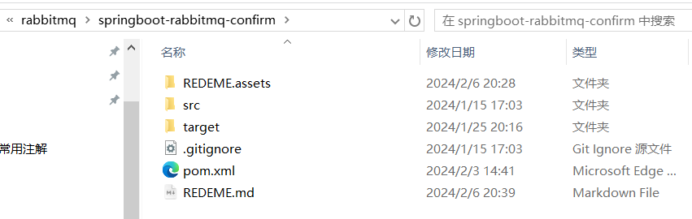

## 依赖

```xml
		<!--AMQP依赖，包含RabbitMQ-->
		<dependency>
			<groupId>org.springframework.boot</groupId>
			<artifactId>spring-boot-starter-amqp</artifactId>
		</dependency>
```

## application.yml

```yaml
spring:
    rabbitmq:
        host: 192.168.200.134
        port: 5672
        username: admin
        password: admin
        #    高级发布确认 发布消息成功后将会触发回调方法
        publisher-confirm-type: correlated
        #    消息回退 当消息未路由至队列时触发,确保消息发送失败后可以重新返回到队列中,当消息无法被路由到队列时，RabbitMQ 会将消息返回给生产者
        publisher-returns: true
        virtual-host: /  #虚拟主机
        #    auto 表示自动确认模式，manual 表示手动确认模式，none 表示不确认模式。手动确认模式需要在消息处理完成后手动确认消息，以告知 RabbitMQ 消息已被处理。
        listener:
            simple:
                acknowledge-mode : manual
```

## Callback

ConfirmCallbackService

```java
package com.springboot101.confirm.callback;

import lombok.extern.slf4j.Slf4j;
import org.springframework.amqp.core.ReturnedMessage;
import org.springframework.amqp.rabbit.connection.CorrelationData;
import org.springframework.amqp.rabbit.core.RabbitTemplate;
import org.springframework.beans.factory.annotation.Autowired;
import org.springframework.stereotype.Component;

import javax.annotation.PostConstruct;
import javax.annotation.Resource;
import java.util.Date;

/**
 * @Description: 消费者-消费消息失败的回调
 */
@Slf4j
@Component
public class ConfirmCallbackService implements RabbitTemplate.ConfirmCallback, RabbitTemplate.ReturnsCallback {

    @Resource
    private RabbitTemplate rabbitTemplate;

    @PostConstruct
    public void init(){
        //注入
        rabbitTemplate.setConfirmCallback(this::confirm);
        rabbitTemplate.setReturnsCallback(this::returnedMessage);
    }

    /*交换机确认回调
    1.交换机收到了消息 触发回调
    1.1 correlationData(我们在发消息的时候自己创建的) 消息的ID以及消息内容
    1.2 ack 交换机收到消息 true
    1.3 cause 交换机收到消息的原因 null
    ---------------------------------
    2.交换机未收到消息 触发回调
    2.1 correlationData 消息的ID以及消息内容
    2.2 ack 交换机未收到消息 false
    2.3 cause 失败原因
     */
    @Override
    public void confirm(CorrelationData correlationData, boolean ack, String cause) {
        if(ack){
            log.info("发送消息到交换机成功！correlationData={}", correlationData.getId());
        }else {
            log.error("发送消息到交换机失败！原因为：{}",cause.toString());
        }
    }

    //只有不可达目的地时才进行回退 只有失败时才触发 若消息发送至延迟队列则一定会触发回退 记得根据交换机名称排除延迟队列
    //在消息传递过程中不可达目的地时将消息返回给生产者
    @Override
    public void returnedMessage(ReturnedMessage returned) {
        log.error("消息：'{}',被交换机：{}回退，routingKey为：{},回退原因为：{}"
                ,new String(returned.getMessage().getBody())
                ,returned.getExchange()
                ,returned.getRoutingKey()
                ,returned.getReplyText());
        /*
        //10s后消息重发
        try {
            Thread.sleep(10000);
            log.info("时间:{}，生产者重新发消息",new Date());
            // 正确的路由key, 可以写死
            rabbitTemplate.convertAndSend(returned.getExchange(),returned.getRoutingKey(),new String(returned.getMessage().getBody()));
        }catch (InterruptedException e) {
            throw new RuntimeException(e);
        }
        */
    }
}
```

## MqConfirmConfig

```java
package com.springboot101.confirm.config;

import org.springframework.amqp.core.*;
import org.springframework.beans.factory.annotation.Qualifier;
import org.springframework.context.annotation.Bean;
import org.springframework.context.annotation.Configuration;

import java.util.HashMap;
import java.util.Map;

/**
 * @Author: LFJ
 * @Date: 2024-02-05 22:06
 */

@Configuration
public class MqConfirmConfig {
	    //普通交换机
		public static final String CONFIRM_EXCHANGE="confirm.exchange";
		//普通队列
		public static final String CONFIRM_QUEUE_NAME="confirm_queue";
		//RoutingKey
		public static final String CONFIRM_EXCHANGE_ROUTING_KEY="key1";

		//备份交换机
		public static final String BACKUP_EXCHANGE="backup.exchange";
		//备份队列
		public static final String BACKUP_QUEUE_NAME="backup.queue";
		//报警队列
		public static final String WARNING_QUEUE_NAME="warning.queue";

		/**
		 * 声明Direct交换机
		 * @return Direct类型交换机
		 */
		@Bean
		public DirectExchange confirmExchange(){
			//绑定确认交换机与备份交换机
			Map<String,Object> argument=new HashMap<>();
			argument.put("alternate-exchange",BACKUP_EXCHANGE);
			return ExchangeBuilder.directExchange(CONFIRM_EXCHANGE).withArguments(argument).build();
		}

		/**
		 * 声明fanout备份交换机
		 * @return fanout类型交换机
		 */
		@Bean
		public FanoutExchange backupExchange(){
			return new FanoutExchange(BACKUP_EXCHANGE);
		}

		//普通队列
		@Bean
		public Queue confirmQueue(){
			return QueueBuilder.durable(CONFIRM_QUEUE_NAME).build();
		}

		//备份队列
		@Bean
		public Queue backupQueue(){
			return QueueBuilder.durable(BACKUP_QUEUE_NAME).build();
		}

		//警告队列
		@Bean
		public Queue warningQueue(){
			return QueueBuilder.durable(WARNING_QUEUE_NAME).build();
		}

		//绑定普通交换机和普通队列
		@Bean
		public Binding EAndQBind(@Qualifier("confirmExchange") DirectExchange confirmExchange, @Qualifier("confirmQueue")Queue confirmQueue){
			return BindingBuilder.bind(confirmQueue).to(confirmExchange).with(CONFIRM_EXCHANGE_ROUTING_KEY);
		}

		//绑定备份交换机和备份队列
		@Bean
		public Binding backupQueueBindingBackupExchange(@Qualifier("backupQueue") Queue backupQueue,
														@Qualifier("backupExchange")FanoutExchange backupExchange){
			return BindingBuilder.bind(backupQueue).to(backupExchange);
		}

		//绑定备份交换机和报警队列
		@Bean
		public Binding warningQueueBindingBackupExchange(@Qualifier("warningQueue") Queue waringQueue,
														 @Qualifier("backupExchange")FanoutExchange backupExchange){
			return BindingBuilder.bind(waringQueue).to(backupExchange);
		}
}
```

## sender

**rabbitTemplate.convertAndSend封装**

```java
package com.springboot101.confirm.sender;

import com.springboot101.confirm.callback.ConfirmCallbackService;
import lombok.extern.slf4j.Slf4j;
import org.springframework.amqp.core.MessageDeliveryMode;
import org.springframework.amqp.rabbit.connection.CorrelationData;
import org.springframework.amqp.rabbit.core.RabbitTemplate;
import org.springframework.beans.factory.annotation.Autowired;
import org.springframework.stereotype.Component;

import javax.annotation.Resource;
import java.util.UUID;

/**
 * @Description: rabbitTemplate.convertAndSend封装
 */
@Slf4j
@Component
public class SendMessage {
    @Resource
    private RabbitTemplate rabbitTemplate;

    /**
     * @param exchangeName   交换机
     * @param routingKey     队列
     * @param message        消息体
    
     * @description 发送消息
     * @date 2020/6/29 16:22
     */
    public void sendMessage(String exchangeName, String routingKey, Object message) {
        /**
         * 发送消息
         */
        rabbitTemplate.convertAndSend(exchangeName, routingKey, message,
                messagePostProcessor -> {
                    messagePostProcessor.getMessageProperties().setDeliveryMode(MessageDeliveryMode.PERSISTENT);
                    return messagePostProcessor;
                },
                new CorrelationData(UUID.randomUUID().toString()));
        /*
        * 下面是每个参数的含义：
        exchangeName：要发送消息的交换机的名称。
        routingKey：要使用的路由键。
        message：要发送的消息体。它可以是任何 Java 对象，Spring AMQP 将根据消息转换器的配置将其转换为消息。
        messagePostProcessor：持久化模式意味着一旦消息被接收，它将被持久化存储，以确保即使在消息代理重启后，消息也不会丢失。
        correlationData：用于关联消息的数据。通常，可以使用 CorrelationData 对象提供一个关联标识，以便在发送确认或失败时了解消息的状态。
        * */
    }
}

```

## controller

> 生产者

### TestSuccessController

```java
package com.springboot101.confirm.controller;

import com.springboot101.confirm.config.MqConfirmConfig;
import com.springboot101.confirm.sender.SendMessage;
import lombok.extern.slf4j.Slf4j;
import org.springframework.amqp.rabbit.connection.CorrelationData;
import org.springframework.beans.factory.annotation.Autowired;
import org.springframework.stereotype.Controller;
import org.springframework.web.bind.annotation.*;

/**
 * 生产者代码
 * @Description: 生产者-发送消息测试接口-正确情况
 */
@Slf4j
@Controller
@RequestMapping
public class TestSuccessController {

    @Autowired
    private SendMessage sendMessage;

    //交换机的发布确认
    @GetMapping("/TestSuccessController1/{message}")
    public void sendConfirmMsg1(@PathVariable String message){
        //向一个存在的交换机发送消息
        sendMessage.sendMessage(MqConfirmConfig.CONFIRM_EXCHANGE, MqConfirmConfig.CONFIRM_EXCHANGE_ROUTING_KEY,  message);
    }

    //回退消息并重发
    @GetMapping("/TestSuccessController2/{message}")
    public void sendConfirmMsg2(@PathVariable String message){
        //向一个存在的队列发送消息
        sendMessage.sendMessage("jindao.direct", "confirm.direct.queue1",  message);
    }

    //备份交换机
    @GetMapping("/TestSuccessController3/{message}")
    public void sendConfirmMsg(@PathVariable String message){
        //向一个存在的队列发送消息
        sendMessage.sendMessage(MqConfirmConfig.CONFIRM_EXCHANGE, MqConfirmConfig.CONFIRM_EXCHANGE_ROUTING_KEY,  message);
    }
}
```

### TestErrorController

```java
package com.springboot101.confirm.controller;

import com.springboot101.confirm.config.MqConfirmConfig;
import com.springboot101.confirm.sender.SendMessage;
import lombok.extern.slf4j.Slf4j;
import org.springframework.beans.factory.annotation.Autowired;
import org.springframework.stereotype.Controller;
import org.springframework.web.bind.annotation.GetMapping;
import org.springframework.web.bind.annotation.PathVariable;
import org.springframework.web.bind.annotation.RequestMapping;

/**
 * 生产者代码
 * @Description: 生产者-发送消息测试接口-错误情况
 */
@Slf4j
@Controller
@RequestMapping
public class TestErrorController {

    @Autowired
    private SendMessage sendMessage;

    /*
    * 只要生产者发布消息，交换机不管是否收到消息，都会调用该类的 confirm 方法
    * */
    @GetMapping("/TestErrorController1/{message}")
    public void sendConfirmMsg1(@PathVariable String message){
        //向一个不存在的交换机发送消息
        sendMessage.sendMessage("xxxx.fanout", "confirm_test_queue", message);
    }

    /*
    * 向交换机中发送消息，指定错误的routingkey,模拟触发队列回退消息并重发消息。
    * RabbitMQ 在将消息退回后，仍然可以确认消息已经被发送到交换机，只是没有找到匹配的队列而已。
    */
    @GetMapping("/TestErrorController2/{message}")
    public void sendConfirmMsg2(@PathVariable String message){
        //向一个不存在的路由发送消息
        sendMessage.sendMessage("jindao.direct", "xxxxx",  message);
    }

    /*
    * 生产者发送两条消息 一个配置正确的路由，另一个是错误的路由。预期目标是正确路由正常接收消息，错误路由传输的信息由警告队列接收。
    * */
    @GetMapping("/TestErrorController3/{message}")
    public void sendConfirmMsg(@PathVariable String message){
        //向一个不存在的路由发送消息
        sendMessage.sendMessage(MqConfirmConfig.CONFIRM_EXCHANGE, MqConfirmConfig.CONFIRM_EXCHANGE_ROUTING_KEY+222,  message);
    }
}
```

## receiver

> 消费者

### ReceiverMessage

```java
package com.springboot101.confirm.receiver;

import com.rabbitmq.client.Channel;
import com.springboot101.confirm.config.MqConfirmConfig;
import lombok.extern.slf4j.Slf4j;
import org.springframework.amqp.core.Message;
import org.springframework.amqp.rabbit.annotation.RabbitHandler;
import org.springframework.amqp.rabbit.annotation.RabbitListener;
import org.springframework.stereotype.Component;

import java.io.IOException;

/**
 * 普通队列消费者代码
  *基于配置类声明队列和交换机
 * @description 接受消息,消息消费
 * @date 2020/6/29 16:31
 */
@Slf4j
@Component
public class ReceiverMessage {

    @RabbitListener(queues = MqConfirmConfig.CONFIRM_QUEUE_NAME)
    public void processHandler1(String msg, Channel channel, Message message) throws IOException {

        try {
            log.info("接受到的队列confirm.queue消息：{}",msg);

            //TODO 具体业务

            // 手动ack
            channel.basicAck(message.getMessageProperties().getDeliveryTag(), false); //这是用来确认消息已经被成功处理的代码。basicAck 方法通知 RabbitMQ 该消息已经被成功处理，并且可以从队列中删除。
        }  catch (Exception e) {

            if (message.getMessageProperties().getRedelivered()) {

                log.error("消息已重复处理失败,拒绝再次接收...");

                channel.basicReject(message.getMessageProperties().getDeliveryTag(), false); // 拒绝消息
            } else {

                log.error("消息即将再次返回队列处理...");

                channel.basicNack(message.getMessageProperties().getDeliveryTag(), false, true);
            }
        }
    }

}
```

### ReceiverMessage2

```java
package com.springboot101.confirm.receiver;

import com.rabbitmq.client.Channel;
import lombok.extern.slf4j.Slf4j;
import org.springframework.amqp.core.ExchangeTypes;
import org.springframework.amqp.core.Message;
import org.springframework.amqp.rabbit.annotation.*;
import org.springframework.stereotype.Component;

import java.io.IOException;

/**
 * 普通队列消费者代码
 *基于注解声明队列和交换机
 * @description 接受消息,消息消费
 * @date 2020/6/29 16:31
 */
@Slf4j
@Component
@RabbitListener(bindings = @QueueBinding(
        value = @Queue(name = "direct.queue1"),
        exchange = @Exchange(name = "jindao.direct", type = ExchangeTypes.DIRECT),
        key = {"confirm.direct.queue1", "confirm.direct.queue2"}
))
public class ReceiverMessage2 {

    @RabbitHandler
    public void processHandler1(String msg, Channel channel, Message message) throws IOException {

        try {
            log.info("接受到的队列direct.queue1消息：{}",msg);

            //TODO 具体业务

            channel.basicAck(message.getMessageProperties().getDeliveryTag(), false);

        }  catch (Exception e) {

            if (message.getMessageProperties().getRedelivered()) {

                log.error("消息已重复处理失败,拒绝再次接收...");

                channel.basicReject(message.getMessageProperties().getDeliveryTag(), false); // 拒绝消息
            } else {

                log.error("消息即将再次返回队列处理...");

                channel.basicNack(message.getMessageProperties().getDeliveryTag(), false, true);
            }
        }
    }

}
```

### BackupConsumer

```java
package com.springboot101.confirm.receiver;

import com.springboot101.confirm.config.MqConfirmConfig;
import lombok.extern.slf4j.Slf4j;
import org.springframework.amqp.core.Message;
import org.springframework.amqp.rabbit.annotation.RabbitListener;
import org.springframework.stereotype.Component;

/**
 * 报警队列消费者代码
 * @description 报警消费者
 */
@Slf4j
@Component
public class BackupConsumer {
    @RabbitListener(queues = MqConfirmConfig.BACKUP_QUEUE_NAME)
    public void receiveWarningMsg(Message message){
        String msg = new String(message.getBody());
        log.info("备份消息：{}",msg);
    }
}
```

### WarningConsumer

```JAVA
package com.springboot101.confirm.receiver;

import com.rabbitmq.client.Channel;
import com.springboot101.confirm.config.MqConfirmConfig;
import lombok.extern.slf4j.Slf4j;
import org.springframework.amqp.core.Message;
import org.springframework.amqp.rabbit.annotation.*;
import org.springframework.stereotype.Component;

import java.io.IOException;

/**
 * 报警队列消费者代码
 * @description 报警消费者
 */
@Slf4j
@Component
public class WarningConsumer {
    @RabbitListener(queues = MqConfirmConfig.WARNING_QUEUE_NAME)
    public void receiveWarningMsg(Message message){
        String msg=new String(message.getBody());
        log.warn("Warning!:发现不可路由消息：{}",msg);
    }
}
```

# 运行结果

## 成功

[localhost:8080/TestSuccessController1/成功-交换机的发布确认](http://localhost:8080/TestSuccessController1/成功-交换机的发布确认)

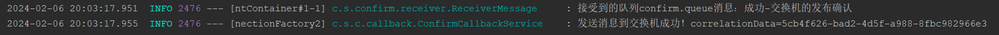

[localhost:8080/TestSuccessController2/成功-回退消息并重发](http://localhost:8080/TestSuccessController1/成功-回退消息并重发)

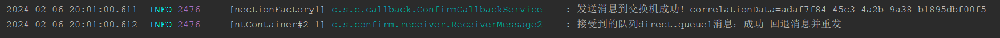

[localhost:8080/TestSuccessController3/成功-备份交换机](http://localhost:8080/TestSuccessController3/成功-备份交换机)

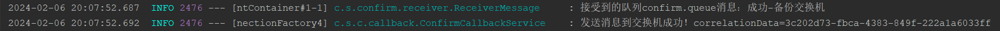

## 失败

[localhost:8080/TestErrorController1/失败-交换机的发布确认](http://localhost:8080/TestErrorController1/失败-交换机的发布确认)

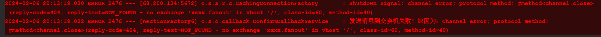

[localhost:8080/TestErrorController2/失败-回退消息并重发](http://localhost:8080/TestErrorController2/失败-回退消息并重发)

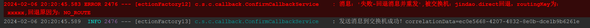

[localhost:8080/TestErrorController3/失败-备份交换机](http://localhost:8080/TestErrorController3/失败-备份交换机)

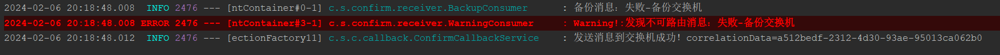