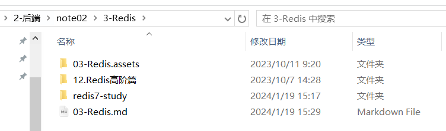
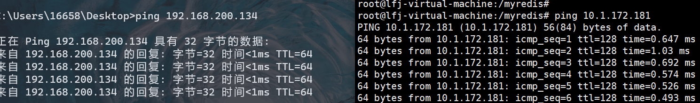
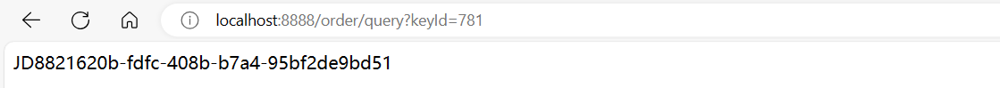
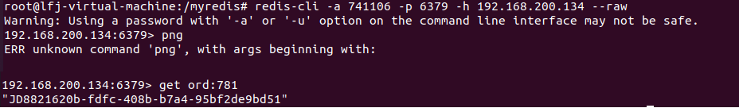
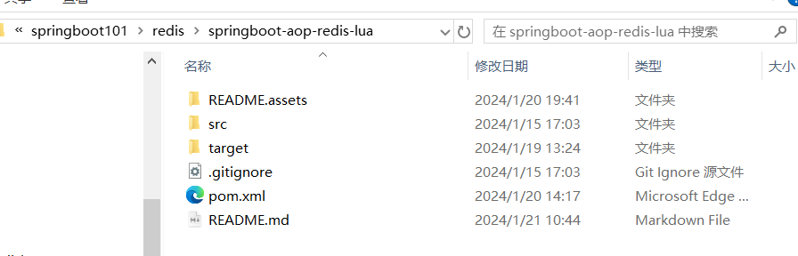
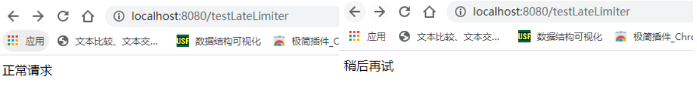
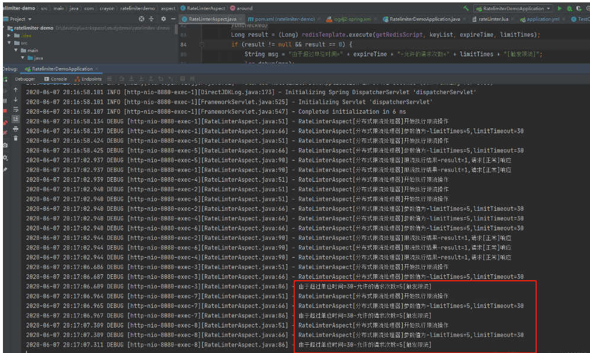

# springboot + redis整合

##  redis

具体细节参考: 



### 更改Redis配置文件

1. bind配置请注释掉

2. 保护模式设置为no

3. Linux系统的防火墙设置

4. Redis服务器的IP地址和密码是否正确

5. 忘记写访问redis的服务端口号和auth密码

6. 相互ping通

   

### 启动

```shell
root@lfj-virtual-machine:/myredis# redis-server /myredis/redis.conf 
root@lfj-virtual-machine:/myredis# redis-cli -a 741106 -p 6379 -h 192.168.200.134 --raw
```

注意: 

+ 192.168.200.134为linux的ip地址
+ 741106为 redis密码
+ 6379为redis端口号

## springboot

### 配置文件

```properties
# ===========================redis单机===========================
spring.redis.database=0
#修改为自己真实IP
spring.redis.host=192.168.200.134  //redis的ip地址
spring.redis.port=6379
spring.redis.password=741106
spring.redis.lettuce.pool.max-active=8
spring.redis.1ettuce.pool.max-wait=-1ms
spring.redis.1ettuce.pool.max-idle=8
spring.redis.lettuce.pool.min-idle=0
```

### pom

部分

```xml
 <!-- SpringBoot 与Redis整合依赖 -->
 <dependency>
     <groupId>org.springframework.boot</groupId>
     <artifactId>spring-boot-starter-data-redis</artifactId>
 </dependency>
 <dependency>
     <groupId>org.apache.commons</groupId>
     <artifactId>commons-pool2</artifactId>
 </dependency>
```

### config

两种方法都行

```java
package com.springboot101.limit.config;

import org.springframework.boot.autoconfigure.condition.ConditionalOnMissingBean;
import org.springframework.context.annotation.Bean;
import org.springframework.context.annotation.Configuration;
import org.springframework.data.redis.connection.RedisConnectionFactory;
import org.springframework.data.redis.connection.lettuce.LettuceConnectionFactory;
import org.springframework.data.redis.core.RedisTemplate;
import org.springframework.data.redis.serializer.GenericJackson2JsonRedisSerializer;
import org.springframework.data.redis.serializer.StringRedisSerializer;

/**
 * @Author: LFJ
 * @Date: 2024-01-19 13:54
 */
@Configuration
public class RedisConfig {

	/**
	 * *redis序列化的工具定置类，下面这个请一定开启配置
	 * *127.0.0.1:6379> keys *
	 * *1) “ord:102” 序列化过
	 * *2)“\xaclxedlxeelx05tixeelaord:102” 野生，没有序列化过
	 * *this.redisTemplate.opsForValue(); //提供了操作string类型的所有方法
	 * *this.redisTemplate.opsForList();// 提供了操作List类型的所有方法
	 * *this.redisTemplate.opsForset(); //提供了操作set类型的所有方法
	 * *this.redisTemplate.opsForHash(); //提供了操作hash类型的所有方认
	 * *this.redisTemplate.opsForZSet(); //提供了操作zset类型的所有方法
	 * param LettuceConnectionFactory
	 * return
	 */
	@Bean
	public RedisTemplate<String, Object> redisTemplate(LettuceConnectionFactory lettuceConnectionFactory) {
		//pom导入对应的依-->导包
		RedisTemplate<String,Object> redisTemplate = new RedisTemplate<>();
		redisTemplate.setConnectionFactory(lettuceConnectionFactory);
		// 设置key序列化方式string
		redisTemplate.setKeySerializer(new StringRedisSerializer());

		//	// 源代码private RedisSerializer<String> stringSerializer = RedisSerializer.string();
		// 设置value的序列化方式json，使用GenericJackson2JsonRedisSerializer替换默认序列化
		redisTemplate.setValueSerializer(new GenericJackson2JsonRedisSerializer());

		redisTemplate.setHashKeySerializer(new StringRedisSerializer());
		redisTemplate.setHashValueSerializer(new GenericJackson2JsonRedisSerializer());
		redisTemplate.afterPropertiesSet();
		return redisTemplate;
	}
 }
//@Configuration
//public class RedisConfig {
//
//	//GenericJackson2JsonRedisSerializer
//	@Bean
//	@ConditionalOnMissingBean(name = "redisTemplate")
//	public RedisTemplate<String, Object> redisTemplate(RedisConnectionFactory factory){
//		RedisTemplate<String, Object> template = new RedisTemplate<>();
//		template.setConnectionFactory(factory);
//
//		//String的序列化方式
//		StringRedisSerializer stringRedisSerializer = new StringRedisSerializer();
//		// 使用GenericJackson2JsonRedisSerializer 替换默认序列化(默认采用的是JDK序列化)
//		GenericJackson2JsonRedisSerializer genericJackson2JsonRedisSerializer = new GenericJackson2JsonRedisSerializer();
//
//		//key序列化方式采用String类型
//		template.setKeySerializer(stringRedisSerializer);
//		//value序列化方式采用jackson类型
//		template.setValueSerializer(genericJackson2JsonRedisSerializer);
//
//		//hash的key序列化方式也是采用String类型
//		template.setHashKeySerializer(stringRedisSerializer);
//		//hash的value也是采用jackson类型
//		template.setHashValueSerializer(genericJackson2JsonRedisSerializer);
//		template.afterPropertiesSet();
//		return template;
//	}
//}
```

### controller

```java
package com.springboot101.limit.controller;

import com.springboot101.limit.service.OrderService;
import org.springframework.beans.factory.annotation.Autowired;
import org.springframework.stereotype.Controller;
import org.springframework.web.bind.annotation.GetMapping;
import org.springframework.web.bind.annotation.PostMapping;
import org.springframework.web.bind.annotation.RestController;

/**
 * @Author: LFJ
 * @Date: 2024-01-19 14:47
 */
@RestController
public class OrderController {
	@Autowired
	private OrderService orderService;

	@GetMapping("/order/add")
	public void addOrder() {
		orderService.addOrder();
	}
	@GetMapping("/order/query")
	public String queryOrder(Integer keyId) {
		return orderService.getOrderById(keyId);
	}
}

```

### service

```java
package com.springboot101.limit.service;

import lombok.extern.slf4j.Slf4j;
import org.springframework.beans.factory.annotation.Autowired;
import org.springframework.data.redis.core.RedisTemplate;
import org.springframework.stereotype.Service;

import java.util.UUID;
import java.util.concurrent.ThreadLocalRandom;

/**
 * @Author: LFJ
 * @Date: 2024-01-19 14:47
 */
@Service
@Slf4j
public class OrderService {
	@Autowired
	private RedisTemplate redisTemplate;

	public static final String ORDER_KEY="ord:";

	public void addOrder() {
		int keyId = ThreadLocalRandom.current().nextInt(1000) + 1;
		String serialNo = UUID.randomUUID().toString();
		String key = ORDER_KEY+keyId;
		String value = "JD" + serialNo;

		redisTemplate.opsForValue().set(key, value);  // redisTemplate.opsForValue()表示String类型
		log.info("***key:{}", key);
		log.info("***value:{}", value);

	}

	public String getOrderById(Integer keyId) {
		return (String)redisTemplate.opsForValue().get(ORDER_KEY+keyId); // 取
	}
}

```

## **运行结果**

输入: `http://localhost:8888/order/add`结果如下:

```bash
2024-01-19 15:23:25.178  INFO 32336 --- [nio-8888-exec-1] c.s.limit.service.OrderService           : ***key:ord:781
2024-01-19 15:23:25.179  INFO 32336 --- [nio-8888-exec-1] c.s.limit.service.OrderService           : ***value:JD8821620b-fdfc-408b-b7a4-95bf2de9bd51
```

输入: `http://localhost:8888/order/query?keyld=781`结果如下:



**在linux中验证一下**



# springboot-aop-redis-lua(分布式限流)

springboot-aop-redis-lua  实现的分布式限流方案。除了缓存之外，有时候会拿Redis做分布式锁。

## 需求

**需求：XX接口访问量太大，需要在一定时间内不让那么多的请求进来**

实现原理：

```
用Redis作为限流组件的核心的原理,将接口名称当Key,一段时间内访问次数为value,同时设置该Key过期时间。
限制 XX接口在TT时间内访问次数
第一次访问 操作redis，key：接口名称 value：次数 expire设置过期时间 TT
第二次访问 操作redis, value + 1，如果过期则按照第一次处理
通过lua脚本 来保证原子性
```

使用Lua脚本(推荐)

1. 减少网络开销: 不使用 Lua 的代码需要向 Redis 发送多次请求, 而脚本只需一次即可, 减少网络传输;
2. 原子操作: Redis 将整个脚本作为一个原子执行, 无需担心并发, 也就无需事务;
3. 复用: 脚本会永久保存 Redis 中, 其他客户端可继续使用.

Redis添加了对Lua的支持，能够很好的满足原子性、事务性的支持，让我们免去了很多的异常逻辑处理。

## 单个模块中的接口限流

具体代码参考:



### 编写限流注解

```java
package com.springboot101.limit.aspect;

import com.springboot101.limit.enmu.LimitType;

import java.lang.annotation.*;

/**
 * @description redis限流注解
 */
@Target({ElementType.METHOD, ElementType.TYPE})
@Retention(RetentionPolicy.RUNTIME)
@Inherited
@Documented
public @interface RateLimter {

    /**
     * 名字
     */
    String name() default "";

    /**
     * key
     */
    String key() default "";

    /**
     * Key的前缀
     */
    String prefix() default "";

    /**
     * 过期时间，单位秒
     */
    int period();

    /**
     * 单位时间限制通过请求数
     */
    int count();

    /**
     * 限流的类型(用户自定义key 或者 请求ip)
     */
    LimitType limitType() default LimitType.CUSTOMER;

    /**
     * 返回值
     */
    String message() default "false";
}

```

```java
package com.springboot101.limit.aspect;

import com.google.common.collect.ImmutableList;
import com.google.common.util.concurrent.RateLimiter;
import com.springboot101.limit.enmu.LimitType;
import lombok.extern.slf4j.Slf4j;
import org.apache.commons.lang3.StringUtils;
import org.aspectj.lang.ProceedingJoinPoint;
import org.aspectj.lang.Signature;
import org.aspectj.lang.annotation.Around;
import org.aspectj.lang.annotation.Aspect;
import org.aspectj.lang.annotation.Pointcut;
import org.aspectj.lang.reflect.MethodSignature;
import org.slf4j.Logger;
import org.slf4j.LoggerFactory;
import org.springframework.beans.factory.annotation.Autowired;
import org.springframework.context.annotation.Configuration;
import org.springframework.core.io.ClassPathResource;
import org.springframework.data.redis.core.RedisTemplate;
import org.springframework.data.redis.core.script.DefaultRedisScript;
import org.springframework.data.redis.core.script.RedisScript;
import org.springframework.scripting.support.ResourceScriptSource;
import org.springframework.web.context.request.RequestContextHolder;
import org.springframework.web.context.request.ServletRequestAttributes;

import javax.annotation.PostConstruct;
import javax.annotation.Resource;
import javax.servlet.http.HttpServletRequest;
import java.lang.reflect.Method;
import java.util.ArrayList;
import java.util.Arrays;
import java.util.Collections;
import java.util.List;


/**
 * @description 限流切面实现
 * @date 2020/4/8 13:04
 */
@Aspect
@Configuration
@Slf4j
public class RateLimterAspect {

    private static final Logger logger = LoggerFactory.getLogger(RateLimterAspect.class);

    private static final String UNKNOWN = "unknown";

    @Resource
    private  RedisTemplate redisTemplate;

    private DefaultRedisScript<Long> getRedisScript;

    @PostConstruct
    public void init() {
        getRedisScript = new DefaultRedisScript<>();
        getRedisScript.setResultType(Long.class);
        getRedisScript.setScriptSource(new ResourceScriptSource(new ClassPathResource("rateLimter.lua")));
        log.info("RateLimterAspect[分布式限流处理器]脚本加载完成");
    }

    /**定义切入点----以aspect包下带有 @RateLimter注解 的方法*/
    @Pointcut("@annotation(com.springboot101.limit.aspect.RateLimter)")
    public void rateLimiter() {}

    @Around("@annotation(rateLimiter)")
    public Object around(ProceedingJoinPoint proceedingJoinPoint, RateLimter rateLimiter) throws Throwable {
        if (log.isDebugEnabled()){
            log.debug("RateLimterAspect[分布式限流处理器]开始执行限流操作");
        }

        MethodSignature signature = (MethodSignature) proceedingJoinPoint.getSignature();
        if (!(signature instanceof MethodSignature)) {
            throw new IllegalArgumentException("the Annotation @RateLimter must used on method!");
        }

        Method method = signature.getMethod();
        // @RateLimter注解携带的参数
        LimitType limitType = rateLimiter.limitType();
        String name = rateLimiter.name();
        String key;
        int limitPeriod = rateLimiter.period();
        int limitCount = rateLimiter.count();
        if (log.isDebugEnabled()){
            log.debug("RateLimterAspect[分布式限流处理器]参数值为-limitPeriod={},limitCount={}", limitPeriod, limitCount);
        }
        // 限流提示语
        String message = rateLimiter.message();
        if (StringUtils.isEmpty(message)) {
            message = "false";
        }
        /**
         * 根据限流类型获取不同的key ,如果不传我们会以方法名作为key
         */
        switch (limitType) {
            case IP:
                key = getIpAddress();
                break;
            case CUSTOMER:
                key = rateLimiter.key();
                break;
            default:
                key = StringUtils.upperCase(method.getName());
        }
   
        //执行Lua脚本
        List<String> keyList = new ArrayList<>();

        // 设置key值为注解中的值
        keyList.add(StringUtils.join(rateLimiter.prefix(), key));     // key拼接前缀

        //调用脚本并执行
        try {
            Long result = (Long) redisTemplate.execute(getRedisScript, keyList, limitPeriod, limitCount);
            if (result != null && result == 0) {
                String msg = "由于超过单位时间=" + limitPeriod + "-允许的请求次数=" + limitCount + "[触发限流]";
                log.debug(msg);
                if (!message.equals("false"))
                    return message;
                else
                    throw new RuntimeException("你已被列入黑名单");
            }
            if (log.isDebugEnabled()) {
                log.debug("RateLimterAspect[分布式限流处理器]限流执行结果-result={},请求[正常]响应", result);
            }
            return proceedingJoinPoint.proceed();
        }catch (Throwable e) {
            if (e instanceof RuntimeException) {
                throw new RuntimeException(e.getLocalizedMessage());
            }
            throw new RuntimeException("server exception");
        }


    /**
     * 获取客户端 IP 地址。
     *
     * @return 客户端 IP 地址。
     */
    public String getIpAddress() {
        HttpServletRequest request = ((ServletRequestAttributes) RequestContextHolder.getRequestAttributes()).getRequest();
        String ip = request.getHeader("x-forwarded-for");
        if (ip == null || ip.length() == 0 || UNKNOWN.equalsIgnoreCase(ip)) {
            ip = request.getHeader("Proxy-Client-IP");
        }
        if (ip == null || ip.length() == 0 || UNKNOWN.equalsIgnoreCase(ip)) {
            ip = request.getHeader("WL-Proxy-Client-IP");
        }
        if (ip == null || ip.length() == 0 || UNKNOWN.equalsIgnoreCase(ip)) {
            ip = request.getRemoteAddr();
        }
        return ip;
    }
}
```

**rateLimter.lua**

限流操作的核心，通过执行一个Lua脚本进行限流的操作

1. 首先脚本获取Java代码中传递而来的要限流的模块的key，不同的模块key值一定不能相同，否则会覆盖！
2. redis.call('incr', key1)对传入的key做incr操作，如果key首次生成，设置超时时间ARGV[1]；（初始值为1）
3. ttl是为防止某些key在未设置超时时间并长时间已经存在的情况下做的保护的判断；
4. 每次请求都会做+1操作，当限流的值val大于我们注解的阈值，则返回0表示已经超过请求限制，触发限流。否则为正常请求。

```
--获取KEY
local key1 = KEYS[1]

local val = redis.call('incr', key1)
local ttl = redis.call('ttl', key1)

--获取ARGV内的参数并打印
local expire = ARGV[1]
local times = ARGV[2]

redis.log(redis.LOG_DEBUG,tostring(times))
redis.log(redis.LOG_DEBUG,tostring(expire))

redis.log(redis.LOG_NOTICE, "incr "..key1.." "..val);
if val == 1 then
    redis.call('expire', key1, tonumber(expire))
else
    if ttl == -1 then
        redis.call('expire', key1, tonumber(expire))
    end
end

if val > tonumber(times) then
    return 0
end

return 1
```

### config

两种方法都行

```java
package com.springboot101.limit.config;

import org.springframework.boot.autoconfigure.condition.ConditionalOnMissingBean;
import org.springframework.context.annotation.Bean;
import org.springframework.context.annotation.Configuration;
import org.springframework.data.redis.connection.RedisConnectionFactory;
import org.springframework.data.redis.connection.lettuce.LettuceConnectionFactory;
import org.springframework.data.redis.core.RedisTemplate;
import org.springframework.data.redis.serializer.GenericJackson2JsonRedisSerializer;
import org.springframework.data.redis.serializer.StringRedisSerializer;

/**
 * @Author: LFJ
 * @Date: 2024-01-19 13:54
 */
@Configuration
public class RedisConfig {

    @Bean
    public CacheManager cacheManager(RedisConnectionFactory redisConnectionFactory) {
        RedisCacheConfiguration redisCacheConfiguration = RedisCacheConfiguration.defaultCacheConfig().entryTtl(ZERO);
        return RedisCacheManager.builder(RedisCacheWriter.nonLockingRedisCacheWriter(redisConnectionFactory))
                .cacheDefaults(redisCacheConfiguration).build();
    }

	/**
	 * *redis序列化的工具定置类，下面这个请一定开启配置
	 * *127.0.0.1:6379> keys *
	 * *1) “ord:102” 序列化过
	 * *2)“\xaclxedlxeelx05tixeelaord:102” 野生，没有序列化过
	 * *this.redisTemplate.opsForValue(); //提供了操作string类型的所有方法
	 * *this.redisTemplate.opsForList();// 提供了操作List类型的所有方法
	 * *this.redisTemplate.opsForset(); //提供了操作set类型的所有方法
	 * *this.redisTemplate.opsForHash(); //提供了操作hash类型的所有方认
	 * *this.redisTemplate.opsForZSet(); //提供了操作zset类型的所有方法
	 * param LettuceConnectionFactory
	 * return
	 */
	@Bean
	public RedisTemplate<String, Object> redisTemplate(LettuceConnectionFactory lettuceConnectionFactory) {
		//pom导入对应的依-->导包
		RedisTemplate<String,Object> redisTemplate = new RedisTemplate<>();
		redisTemplate.setConnectionFactory(lettuceConnectionFactory);
		// 设置key序列化方式string
		redisTemplate.setKeySerializer(new StringRedisSerializer());

		//	// 源代码private RedisSerializer<String> stringSerializer = RedisSerializer.string();
		// 设置value的序列化方式json，使用GenericJackson2JsonRedisSerializer替换默认序列化
		redisTemplate.setValueSerializer(new GenericJackson2JsonRedisSerializer());

		redisTemplate.setHashKeySerializer(new StringRedisSerializer());
		redisTemplate.setHashValueSerializer(new GenericJackson2JsonRedisSerializer());
		redisTemplate.afterPropertiesSet();
		return redisTemplate;
	}
 }
//@Configuration
//public class RedisConfig {
//
//	//GenericJackson2JsonRedisSerializer
//	@Bean
//	@ConditionalOnMissingBean(name = "redisTemplate")
//	public RedisTemplate<String, Object> redisTemplate(RedisConnectionFactory factory){
//		RedisTemplate<String, Object> template = new RedisTemplate<>();
//		template.setConnectionFactory(factory);
//
//		//String的序列化方式
//		StringRedisSerializer stringRedisSerializer = new StringRedisSerializer();
//		// 使用GenericJackson2JsonRedisSerializer 替换默认序列化(默认采用的是JDK序列化)
//		GenericJackson2JsonRedisSerializer genericJackson2JsonRedisSerializer = new GenericJackson2JsonRedisSerializer();
//
//		//key序列化方式采用String类型
//		template.setKeySerializer(stringRedisSerializer);
//		//value序列化方式采用jackson类型
//		template.setValueSerializer(genericJackson2JsonRedisSerializer);
//
//		//hash的key序列化方式也是采用String类型
//		template.setHashKeySerializer(stringRedisSerializer);
//		//hash的value也是采用jackson类型
//		template.setHashValueSerializer(genericJackson2JsonRedisSerializer);
//		template.afterPropertiesSet();
//		return template;
//	}
//}
```

### controller

```java
package com.springboot101.limit.controller;

import com.springboot101.limit.aspect.RateLimter;
import com.springboot101.limit.enmu.LimitType;
import org.springframework.web.bind.annotation.GetMapping;
import org.springframework.web.bind.annotation.RestController;

import javax.servlet.http.HttpServletRequest;
import java.util.concurrent.atomic.AtomicInteger;

/**
 * @Description:用于测试使用自定义注解进行速率限制
 */
@RestController
public class LimiterController {

    // 用于测试
    // 原子整数用于跟踪每个端点的请求计数
    private static final AtomicInteger ATOMIC_INTEGER_1 = new AtomicInteger();
    private static final AtomicInteger ATOMIC_INTEGER_2 = new AtomicInteger();
    private static final AtomicInteger ATOMIC_INTEGER_3 = new AtomicInteger();

    /**
     * @description  基于自定义键（key）进行限制
     * @return 字符串
     */
    @GetMapping("/limitTest")
    @RateLimter(key = "limitTest", period = 10, count = 3, limitType = LimitType.CUSTOMER,  message = "稍后再试")
    public String sendPayment(HttpServletRequest request) {
        return "正常请求";
    }

    /**
     * @description  基于方法名进行限制
     * @return 此端点的请求计数
     */
    @RateLimter(key = "limitTest1", period = 10, count = 3)
    @GetMapping("/limitTest1")
    public int testLimiter1() {
        return ATOMIC_INTEGER_1.incrementAndGet();
    }

    /**
     * @description 基于自定义键（key）进行限制
     * @date 2020/4/8 13:42
     */
    @RateLimter(key = "customer_limit_test", period = 10, count = 3, limitType = LimitType.CUSTOMER)
    @GetMapping("/limitTest2")
    public int testLimiter2() {
        return ATOMIC_INTEGER_2.incrementAndGet();
    }

    /**

     * @description 基于IP地址进行限制
     * @date 2020/4/8 13:42
     */
    @RateLimter(key = "ip_limit_test", period = 10, count = 3, limitType = LimitType.IP)
    @GetMapping("/limitTest3")
    public int testLimiter3() {
        return ATOMIC_INTEGER_3.incrementAndGet();
    }

}
```

### **运行结果**





## 多个模块中的接口都要限流

需要整理成一个 starter 避免写重复代码

配置类写成如下

```java

/**
 * 自动配置
 * @author Yuqiang
 */
@Configuration
@Slf4j
public class RateLimiterAutoConfiguration {

    @Bean
    public CacheManager cacheManager(RedisConnectionFactory redisConnectionFactory) {
        RedisCacheConfiguration redisCacheConfiguration = RedisCacheConfiguration.defaultCacheConfig().entryTtl(ZERO);
        return RedisCacheManager.builder(RedisCacheWriter.nonLockingRedisCacheWriter(redisConnectionFactory))
                .cacheDefaults(redisCacheConfiguration).build();
    }

    @Bean
    public RedisTemplate<String, Object> redisTemplate(RedisConnectionFactory redisConnectionFactory) {
        // 1.创建 redisTemplate 模版
        RedisTemplate<String, Object> template = new RedisTemplate<>();
        // 2.关联 redisConnectionFactory
        template.setConnectionFactory(redisConnectionFactory);
        // 3.创建 序列化类
        GenericToStringSerializer genericToStringSerializer = new GenericToStringSerializer(Object.class);
        // 6.序列化类，对象映射设置
        // 7.设置 value 的转化格式和 key 的转化格式
        template.setValueSerializer(genericToStringSerializer);
        template.setKeySerializer(new StringRedisSerializer());
        template.afterPropertiesSet();
        log.info("Springboot RedisTemplate 加载完成");
        return template;
    }


    @Bean
    public RateLimterAspect rateLimterAspect() {
        return new RateLimterAspect();
    }

}
```

参考: 

+ ratelimiter-demo-master
+ ratelimter-spring-boot-starter-master
+ [SpringBoot 基于Redis实现分布式限流](https://blog.csdn.net/qq_41933709/article/details/106605054)

# springboot-redisson-lock(分布式锁)

## pom 

```xml
        <!-- Redis-Redisson分布式锁依赖-->
        <dependency>
            <groupId>org.redisson</groupId>
            <artifactId>redisson-spring-boot-starter</artifactId>
            <version>3.11.4</version>
        </dependency>
        <!-- redis依赖-->
        <dependency>
            <groupId>org.springframework.boot</groupId>
            <artifactId>spring-boot-starter-data-redis</artifactId>
            <version>2.3.1.RELEASE</version>
        </dependency>
```

以下是其中的一些关键配置项的解释：

- `idleConnectionTimeout`: 空闲连接的超时时间（毫秒）。
- `pingTimeout`: Ping 命令的超时时间（毫秒）。
- `connectTimeout`: 连接超时时间（毫秒）。
- `timeout`: 超时时间（毫秒），通常用于等待 Redis 命令的响应。
- `retryAttempts`: 连接重试的最大尝试次数。
- `retryInterval`: 连接重试的间隔时间（毫秒）。
- `password`: 连接 Redis 服务器的密码。
- `subscriptionsPerConnection`: 每个连接的最大订阅数。
- `clientName`: Redis 客户端的名称。
- `address`: Redis 服务器的地址。
- `subscriptionConnectionMinimumIdleSize`: 订阅连接的最小空闲连接数。
- `subscriptionConnectionPoolSize`: 订阅连接的连接池大小。
- `connectionMinimumIdleSize`: 连接的最小空闲连接数。
- `connectionPoolSize`: 连接的连接池大小。
- `database`: Redis 数据库的编号

## 基本使用

### Controller

```java
package com.springboot101.redisson.controller;

@RestController
public class SomeController {

	@Autowired
	private DistributedLockServer distributedLockServer;

	@GetMapping("/doSomething")
	public String doSomething() {
		distributedLockServer.doSomethingWithLock();
		return "Do something with lock successfully!";
	}
}
```

### Service

简单模版如下

```java
package com.springboot101.redisson.service;

@Service
public class DistributedLockServer {
	@Resource(name = "com.springboot101.redisson.config.RedissonConfig")
	private RedissonClient redissonClient;

	public void doSomethingWithLock() {
		// 1.设置分布式锁
		RLock lock = redissonClient.getLock("myLock");

		try {
			// 2.尝试加锁，最多等待3秒，上锁后10秒自动解锁
			boolean locked = lock.tryLock(3, 10, TimeUnit.SECONDS);

			if (locked) {
				// 3.获取锁成功，执行需要加锁保护的业务逻辑
				// ...
			} else {
				// 获取锁失败，处理获取锁失败的逻辑
				// ...
			}
		} catch (InterruptedException e) {
			// 处理异常情况
			// ...
		} finally {
			// 4.释放自己的锁
			if(lock != null && lock.isHeldByCurrentThread()){
				lock.unlock();
			}
		}
	}
}
```


建议使用[分布式锁 (github.com)](https://github.com/z744489075/redisson-spring-boot-starter)


