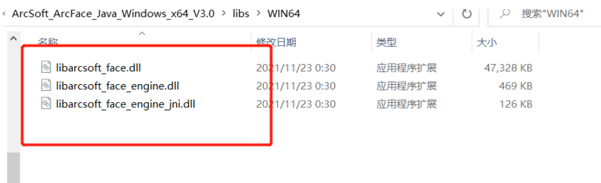

# 使用虹软人脸识别SDK(仅参考)

使用虹软平台需要先注册开发者账号：

https://ai.arcsoft.com.cn/ucenter/user/userlogin


注册完成后进行登录，然后进行创建应用：


创建完成后，需要进行实名认证，否则相关的SDK是不能使用的。

实名认证后即可下载对应平台的SDk，我们需要下载windows以及linux平台。
添加SDK（Linux或Windows平台)：


下载SDK，打开解压包，可以看到有提供相应的jar包以及示例代码：


进入到libs目录，需要将arcsoft-sdk-face-3.0.0.0.jar安装到本地仓库：

```
mvn install:install-file -DgroupId=com.arcsoft.face -DartifactId=arcsoft-sdk-face -Dversion=3.0.0.0 -Dpackaging=jar -Dfile=arcsoft-sdk-face-3.0.0.0.jar
```

安装成功后，即可通过[maven](https://so.csdn.net/so/search?q=maven&spm=1001.2101.3001.7020)坐标引用了：

```
<dependency>
    <groupId>com.arcsoft.face</groupId>
    <artifactId>arcsoft-sdk-face</artifactId>
    <version>3.0.0.0</version>
</dependency>
```

接下来就可以开始使用了：

在配置文件中：

```
#虹软相关配置(在虹软应用中找到对应的参数)
arcsoft.appid=******************
arcsoft.sdkKey=*****************
arcsoft.libPath=F:\\code\\WIN64
```

- **注意**：libPath放的是这三个dll的文件



然后通过提供的测试类把相应的配置改为自己的就可以运行了

# 运行效果


后端打印日志


老用户跳转

