Quartz 是一个优秀的开源任务调度框架，完全基于 Java 实现，作用相当于一个定时器，可以在指定的时间点或时间间隔执行任务。可以使用在如“月底总结“，”每日结算”等需要在指定时间执行任务的需求中。

特点

+ 强大的调度功能，例如支持丰富多样的调度方法，可以满足各种常规及特殊需求。
+ 灵活的应用方式，例如支持任务和调度的多种组合方式，支持调度数据的多种存储方式。
+ 分布式和集群能力，Quartz 能够使用多个单独 Quartz 程序作为节点共用一套数据库表来实现集群

# 项目结构

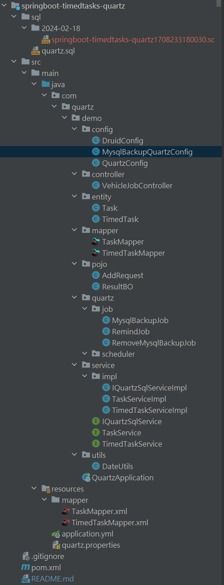

# 实现功能

+ 定时任务
+  定时数据库备份和删除备份数据库

# ==完整代码见==

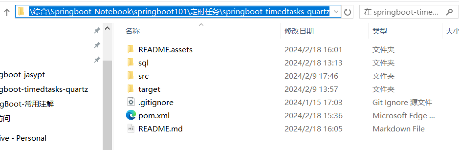

# 依赖

```xml
<?xml version="1.0" encoding="UTF-8"?>
<project xmlns="http://maven.apache.org/POM/4.0.0" xmlns:xsi="http://www.w3.org/2001/XMLSchema-instance"
         xsi:schemaLocation="http://maven.apache.org/POM/4.0.0 https://maven.apache.org/xsd/maven-4.0.0.xsd">
    <modelVersion>4.0.0</modelVersion>
    <parent>
        <groupId>com.springboot101</groupId>
        <artifactId>springboot101</artifactId>
        <version>0.0.1-SNAPSHOT</version>
    </parent>
    <artifactId>springboot-timedtasks-quartz</artifactId>
    <version>0.0.1-SNAPSHOT</version>
    <name>springboot-timedtasks-quartz</name>

    <dependencies>
        <dependency>
            <groupId>org.springframework.boot</groupId>
            <artifactId>spring-boot-starter-web</artifactId>
        </dependency>
        <dependency>
            <groupId>org.springframework.boot</groupId>
            <artifactId>spring-boot-starter-test</artifactId>
            <scope>test</scope>
        </dependency>
        <dependency>
            <groupId>org.projectlombok</groupId>
            <artifactId>lombok</artifactId>
            <optional>true</optional>
        </dependency>

        <!-- quartz 定时任务 -->
        <dependency>
            <groupId>org.springframework.boot</groupId>
            <artifactId>spring-boot-starter-quartz</artifactId>
        </dependency>
        <dependency>
            <groupId>org.quartz-scheduler</groupId>
            <artifactId>quartz-jobs</artifactId>
            <version>2.2.3</version>
        </dependency>
        <!-- quartz 定时任务相关结束 -->
        
<!--        <dependency>-->
<!--            <groupId>org.springframework.boot</groupId>-->
<!--            <artifactId>spring-boot-starter-jdbc</artifactId>-->
<!--        </dependency>-->
        <!-- mysql -->
        <dependency>
            <groupId>com.mysql</groupId>
            <artifactId>mysql-connector-j</artifactId>
        </dependency>
        <dependency>
            <groupId>com.alibaba</groupId>
            <artifactId>druid</artifactId>
            <version>1.2.20</version>
            <scope>compile</scope>
        </dependency>
        <!-- mybatisplus+数据库相关开始-->
        <dependency>
            <groupId>com.baomidou</groupId>
            <artifactId>mybatis-plus-core</artifactId>
            <version>3.5.3.1</version>
        </dependency>
        <!--使用mybatisplus常用CRUD接口方式,可以不用写sql语句-->
        <dependency>
            <groupId>com.baomidou</groupId>
            <artifactId>mybatis-plus-boot-starter</artifactId>
            <version>3.5.3.1</version>
        </dependency>
        <!--使用mybatisplus代码生成器, 具体用法见官网-->
        <dependency>
            <groupId>com.baomidou</groupId>
            <artifactId>mybatis-plus-generator</artifactId>
            <version>3.5.3.1</version>
        </dependency>
        <!--mybatisplus+数据库相关结束-->
        
        <!--工具库-->
        <dependency>
            <groupId>cn.hutool</groupId>
            <artifactId>hutool-all</artifactId>
            <version>5.4.0</version>
        </dependency>
    </dependencies>

    <build>
        <plugins>
            <plugin>
                <groupId>org.springframework.boot</groupId>
                <artifactId>spring-boot-maven-plugin</artifactId>
            </plugin>
        </plugins>
    </build>

</project>
```

# 配置文件

## properties.yml

```yaml
spring:
    datasource:
        driver-class-name: com.mysql.cj.jdbc.Driver
        type: com.zaxxer.hikari.HikariDataSource
        password: 741106
        url: jdbc:mysql://localhost:3306/quartz
        username: root

#mybatis-plus配置
mybatis-plus:
    mapper-locations: classpath*:/mapper/*.xml
    configuration:
        # sql日志
        log-impl: org.apache.ibatis.logging.stdout.StdOutImpl

#备份数据库
backup:
    # 备份文件夹路径
    folder: C:\\Users\\16658\\Documents\\GitHub\\BackFront\\2-后端\\note02\\8-整合\\综合\\Springboot-Notebook\\springboot101\\定时任务\\springboot-timedtasks-quartz
    # 备份数据库名称
    dbName: quartz
    # 数据库账号
    username: root
    # 数据库密码
    password: 741106
    # 备份数据库保存天数
    day: 7
```

## quartz.properties

```
# 设置的实例名称  集群中每一个实例都必须使用相同的名称
spring.quartz.properties.org.quartz.scheduler.instanceName=AdminClusteredScheduler

# 设置的实例ID为自动生成 每一个必须不同
spring.quartz.properties.org.quartz.scheduler.instanceId=AUTO

# 设置的实例ID生成器类为SimpleInstanceIdGenerator
spring.quartz.properties.org.quartz.scheduler.instanceIdGenerator.class=org.quartz.simpl.SimpleInstanceIdGenerator


#持久化配置,数据保存方式为持久化
#springboot版本2.6.x请使用：org.springframework.scheduling.quartz.LocalDataSourceJobStore
spring.quartz.properties.org.quartz.jobStore.class=org.quartz.impl.jdbcjobstore.JobStoreTX
# 设置使用的数据库驱动代理类
spring.quartz.properties.org.quartz.jobStore.driverDelegateClass=org.quartz.impl.jdbcjobstore.StdJDBCDelegate
# 启用集群模式
spring.quartz.properties.org.quartz.jobStore.isClustered=true
# 设置在集群中检查的间隔时间为10秒
spring.quartz.properties.org.quartz.jobStore.clusterCheckinInterval=10000
# 设置的JobStore是否使用属性
spring.quartz.properties.org.quartz.jobStore.useProperties=true


# 线程池配置
# 设置使用的线程池实现类为SimpleThreadPool
spring.quartz.properties.org.quartz.threadPool.class=org.quartz.simpl.SimpleThreadPool
# 设置的线程池中线程数量为50
spring.quartz.properties.org.quartz.threadPool.threadCount=50
# 设置的线程池中线程的优先级为5
spring.quartz.properties.org.quartz.threadPool.threadPriority=5
# 自创建父线程
spring.quartz.properties.org.quartz.threadPool.threadsInheritContextClassLoaderOfInitializingThread=true


# 数据源连接信息，quartz默认使用c3p0数据源可以被自定义数据源覆盖
spring.quartz.properties.org.quartz.dataSource.quartzDataSource.driver=com.mysql.jdbc.Driver
spring.quartz.properties.org.quartz.dataSource.quartzDataSource.URL=jdbc:mysql://127.0.0.1:3306/quartz
spring.quartz.properties.org.quartz.dataSource.quartzDataSource.user=root
spring.quartz.properties.org.quartz.dataSource.quartzDataSource.password=741106
```

# config

## DruidConfig

```java
package com.quartz.demo.config;

import com.alibaba.druid.pool.DruidDataSource;
import org.springframework.boot.context.properties.ConfigurationProperties;
import org.springframework.context.annotation.Bean;
import org.springframework.context.annotation.Configuration;

import javax.sql.DataSource;
/**
 * @Author: LFJ
 * @Date: 2024-02-09 21:36
 */
@Configuration
public class DruidConfig {
	@ConfigurationProperties(prefix = "spring.datasource")
	@Bean
	public DataSource druidDataSource() {
		return new DruidDataSource();
	}
}
```

## QuartzConfig

```java
package com.quartz.demo.config;

import org.quartz.Trigger;
import org.quartz.spi.JobFactory;
import org.quartz.spi.TriggerFiredBundle;
import org.springframework.beans.factory.annotation.Autowired;
import org.springframework.beans.factory.config.AutowireCapableBeanFactory;
import org.springframework.beans.factory.config.PropertiesFactoryBean;
import org.springframework.context.ApplicationContext;
import org.springframework.context.ApplicationContextAware;
import org.springframework.context.annotation.Bean;
import org.springframework.context.annotation.Configuration;
import org.springframework.core.io.ClassPathResource;
import org.springframework.scheduling.quartz.SchedulerFactoryBean;
import org.springframework.scheduling.quartz.SpringBeanJobFactory;

import javax.sql.DataSource;
import java.io.IOException;
import java.util.Properties;

/**
 * @PackgeName: com.quartz.demo.config
 * @ClassName: ConfigureQuartz
 * @Author: zjy
 * Date: 2020/6/13 16:18
 * project name: quartz
 * @Version:
 * @Description:
 */
@Configuration
public class QuartzConfig {
    @Bean
    public JobFactory jobFactory(ApplicationContext applicationContext) {
        AutowiringSpringBeanJobFactory jobFactory = new AutowiringSpringBeanJobFactory();
        jobFactory.setApplicationContext(applicationContext);
        return jobFactory;
    }
    /**
     * SchedulerFactoryBean这个类的真正作用提供了对org.quartz.Scheduler的创建与配置，并且会管理它的生命周期与Spring同步。
     * org.quartz.Scheduler: 调度器。所有的调度都是由它控制。
     * @param dataSource 为SchedulerFactory配置数据源
     * @param jobFactory 为SchedulerFactory配置JobFactory
     */
    @Bean
    public SchedulerFactoryBean schedulerFactoryBean(DataSource dataSource, JobFactory jobFactory) throws IOException {
        SchedulerFactoryBean factory = new SchedulerFactoryBean();
        try {
            //可选,QuartzScheduler启动时更新己存在的Job,这样就不用每次修改targetObject后删除qrtz_job_details表对应记录
            factory.setOverwriteExistingJobs(true);
            factory.setAutoStartup(true); //设置自行启动
            factory.setDataSource(dataSource);
            factory.setJobFactory(jobFactory);
            factory.setQuartzProperties(quartzProperties());

        } catch (Exception e) {
            e.printStackTrace();
        }
        return factory;
    }

    //从quartz.properties文件中读取Quartz配置属性
    @Bean
    public Properties quartzProperties() throws IOException {
        PropertiesFactoryBean propertiesFactoryBean = new PropertiesFactoryBean();
        propertiesFactoryBean.setLocation(new ClassPathResource("/quartz.properties"));
        propertiesFactoryBean.afterPropertiesSet();
        return propertiesFactoryBean.getObject();
    }

    //配置JobFactory,为quartz作业添加自动连接支持
    public final class AutowiringSpringBeanJobFactory extends SpringBeanJobFactory implements
            ApplicationContextAware {
        private transient AutowireCapableBeanFactory beanFactory;
        @Override
        public void setApplicationContext(final ApplicationContext context) {
            beanFactory = context.getAutowireCapableBeanFactory();
        }
        @Override
        protected Object createJobInstance(final TriggerFiredBundle bundle) throws Exception {
            final Object job = super.createJobInstance(bundle);
            beanFactory.autowireBean(job);
            return job;
        }
    }
}
```

## MysqlBackupQuartzConfig

作用: Mysql备份任务启动

```java
package com.quartz.demo.config;
import com.quartz.demo.service.IQuartzSqlService;
import com.quartz.demo.quartz.job.MysqlBackupJob;
import com.quartz.demo.quartz.job.RemoveMysqlBackupJob;
import org.quartz.*;
import org.springframework.beans.factory.annotation.Autowired;
import org.springframework.context.annotation.Bean;
import org.springframework.context.annotation.Configuration;
import org.springframework.scheduling.quartz.SchedulerFactoryBean;

import javax.annotation.PostConstruct;

/**
 * Mysql备份任务启动
 * @Author: LFJ
 * @Date: 2024-02-15 17:46
 */
@Configuration
public class MysqlBackupQuartzConfig {
	private static final String MYSQL_BACKUP_JOB_GROUP_NAME = "MYSQL_BACKUP_JOB";
	private static final String MYSQL_BACKUP_TRIGGER_GROUP_NAME = "MYSQL_BACKUP_TRIGGER";
	private static final String REMOVE_MYSQL_BACKUP_JOB_GROUP_NAME = "REMOVE_MYSQL_BACKUP_JOB";
	private static final String REMOVE_MYSQL_BACKUP_TRIGGER_GROUP_NAME = "REMOVE_MYSQL_BACKUP_TRIGGER";

	@Autowired
	private SchedulerFactoryBean schedulerFactoryBean;

	@Autowired
	private IQuartzSqlService iQuartzSqlService;

	/**添加备份**/
	// 创建任务
	private JobDetail mysqlBackupJobDetail() {
		JobDataMap jobDataMap = new JobDataMap();
		jobDataMap.put("quartzSqlService", iQuartzSqlService);
		return JobBuilder.newJob(MysqlBackupJob.class) //[重要] 指定任务实例为MysqlBackupJob类
				.withIdentity("mysqlBackupJobDetail", MYSQL_BACKUP_JOB_GROUP_NAME)
				.usingJobData(jobDataMap)
				.storeDurably()
				.build();
	}

	// 创建Cron触发器
	private Trigger mysqlBackupTriggerQuartz() {
		//使用固定的Cron表达式（每天凌晨1点执行）
		CronScheduleBuilder cronScheduleBuilder =
				CronScheduleBuilder.dailyAtHourAndMinute(1, 0); //[重要] 使用Cron表达式设置触发器的调度规则
		return TriggerBuilder.newTrigger()
				.withIdentity("mysqlBackupJobDetail", MYSQL_BACKUP_TRIGGER_GROUP_NAME) //给Trigger起个名字
				.withSchedule(cronScheduleBuilder)
				.build();
	}

	/**删除备份**/
	private JobDetail removeMysqlBackupJobDetail() {
		JobDataMap jobDataMap = new JobDataMap();
		jobDataMap.put("quartzSqlService", iQuartzSqlService);
		return JobBuilder.newJob(RemoveMysqlBackupJob.class)
				.withIdentity("removeMysqlBackupJobDetail", REMOVE_MYSQL_BACKUP_JOB_GROUP_NAME)
				.usingJobData(jobDataMap)
				.storeDurably()
				.build();
	}

	private Trigger removeMysqlBackupTriggerQuartz() {
		// 使用固定的Cron表达式（每天零点执行）
		CronScheduleBuilder cronScheduleBuilder =
				CronScheduleBuilder.dailyAtHourAndMinute(0,0);
		return TriggerBuilder.newTrigger()
				.withIdentity("removeMysqlBackupJobDetail", REMOVE_MYSQL_BACKUP_TRIGGER_GROUP_NAME) //给Trigger起个名字
				.withSchedule(cronScheduleBuilder)
				.build();
	}

	@PostConstruct
	public void MysqlBackupScheduleJobsOnStartup() {
		Scheduler scheduler = schedulerFactoryBean.getScheduler();
		JobDetail mysqlBackupJobDetail = mysqlBackupJobDetail();
		Trigger mysqlBackupTriggerQuartz = mysqlBackupTriggerQuartz();
		JobDetail removeMysqlBackupJobDetail = removeMysqlBackupJobDetail();
		Trigger removeMysqlBackupTriggerQuartz = removeMysqlBackupTriggerQuartz();

		try {
			// 如果任务存在了就删除掉
			if (scheduler.checkExists(mysqlBackupJobDetail.getKey())) {
				scheduler.deleteJob(mysqlBackupJobDetail.getKey());
			}

			if (scheduler.checkExists(removeMysqlBackupJobDetail.getKey())) {
				scheduler.deleteJob(removeMysqlBackupJobDetail.getKey());
			}
			// 添加任务和触发器到调度程序 * 定时数据库备份
			scheduler.scheduleJob(mysqlBackupJobDetail, mysqlBackupTriggerQuartz);
			// 添加任务和触发器到调度程序 * 定期删除过期数据库备份
			scheduler.scheduleJob(removeMysqlBackupJobDetail, removeMysqlBackupTriggerQuartz);
		} catch (SchedulerException e) {
			throw new RuntimeException(e);
		}
	}
}
```

# 任务实例

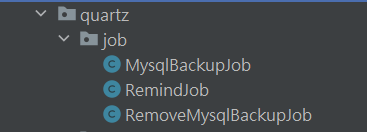

## 定时任务job

RemindJob

```java
package com.quartz.demo.quartz.job;

import lombok.extern.slf4j.Slf4j;
import org.quartz.JobDataMap;
import org.quartz.JobExecutionContext;
import org.quartz.JobExecutionException;
import org.springframework.scheduling.quartz.QuartzJobBean;

/**
 * 执行定时任务
 * @Author: LFJ
 * @Date: 2024-02-15 17:37
 */
@Slf4j
public class RemindJob extends QuartzJobBean {

    @Override
    protected void executeInternal(JobExecutionContext jobExecutionContext) throws JobExecutionException {
        // 从作业上下文中获取作业参数
        JobDataMap params = jobExecutionContext.getMergedJobDataMap();
        // 获取任务ID
        int taskId = params.getInt("taskId");
        // 获取任务名称
        String taskName = params.getString("taskName");
        // 获取执行时间
        String execution = params.getString("execution");
        // 记录日志，记录发送提醒任务的信息，包括任务名称、任务ID和执行时间
        log.info("发送:{}任务, taskId为:{}, 执行时间为:{}", taskName, taskId, execution);
        //  TODO 具体定时业务

    }
}
```

## 定时数据库备份和删除备份数据库job

MysqlBackupJob

```java
package com.quartz.demo.quartz.job;

/**
 * 执行数据库备份定时任务
 * @Author: LFJ
 * @Date: 2024-02-15 17:37
 */
import com.quartz.demo.service.IQuartzSqlService;
import lombok.extern.slf4j.Slf4j;
import org.quartz.JobExecutionContext;
import org.quartz.JobExecutionException;
import org.springframework.scheduling.quartz.QuartzJobBean;

@Slf4j
public class MysqlBackupJob extends QuartzJobBean {
	@Override
	protected void executeInternal(JobExecutionContext jobExecutionContext) throws JobExecutionException {
		//获取JobDetail中传递的参数
		IQuartzSqlService quartzService =
				(IQuartzSqlService) jobExecutionContext.getJobDetail().getJobDataMap().get("quartzSqlService");
		//具体定时业务
		quartzService.mysqlBackupTask();
	}
}

```

RemoveMysqlBackupJob

```java
package com.quartz.demo.quartz.job;

/**
 * 执行删除数据库备份定时任务
 * @Author: LFJ
 * @Date: 2024-02-15 17:38
 */
import com.quartz.demo.service.IQuartzSqlService;
import org.quartz.JobExecutionContext;
import org.quartz.JobExecutionException;
import org.springframework.scheduling.quartz.QuartzJobBean;

public class RemoveMysqlBackupJob extends QuartzJobBean {
	@Override
	protected void executeInternal(JobExecutionContext jobExecutionContext) throws JobExecutionException {
		//获取JobDetail中传递的参数
		IQuartzSqlService quartzService =
				(IQuartzSqlService) jobExecutionContext.getJobDetail().getJobDataMap().get("quartzSqlService");
		//具体定时业务
		quartzService.removeMysqlBackupTask();
	}
}
```

# 定时任务所需表

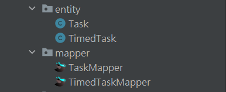

具体表结构通过quartz.sql生成

**任务表**

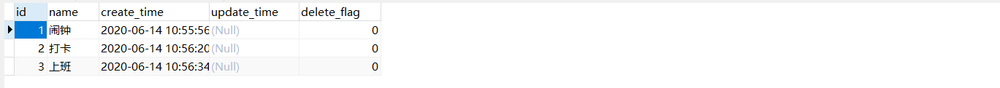

**定时任务表**

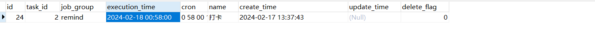

# service

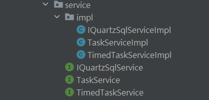

## 定时任务实现

**TimedTaskServicelmpl**

```java
package com.quartz.demo.service.impl;

import cn.hutool.core.date.DateUtil;
import com.baomidou.mybatisplus.extension.service.impl.ServiceImpl;
import com.quartz.demo.quartz.job.RemindJob;
import com.quartz.demo.entity.Task;
import com.quartz.demo.entity.TimedTask;
import com.quartz.demo.pojo.AddRequest;
import com.quartz.demo.pojo.ResultBO;
import com.quartz.demo.service.TaskService;
import com.quartz.demo.service.TimedTaskService;
import com.quartz.demo.mapper.TimedTaskMapper;
import com.quartz.demo.utils.DateUtils;
import lombok.extern.slf4j.Slf4j;
import org.quartz.*;
import org.springframework.beans.factory.annotation.Autowired;
import org.springframework.scheduling.quartz.SchedulerFactoryBean;
import org.springframework.stereotype.Service;

import java.time.LocalDateTime;
import java.util.Date;
import java.util.List;

/**
 * 定时任务实现
* @author 16658
* @description 针对表【t_timed_task】的数据库操作Service实现
* @createDate 2024-02-09 18:12:48
*/

@Slf4j
@Service
public class TimedTaskServiceImpl extends ServiceImpl<TimedTaskMapper, TimedTask>
    implements TimedTaskService{
	@Autowired
	private SchedulerFactoryBean schedulerFactoryBean;

	@Autowired
	private TaskService taskService;

	@Autowired
	private TimedTaskMapper timedTaskMapper;

	/**
	 * 添加定时任务作业
	 * @param addRequest
	 */
	@Override
	public ResultBO addQuartzJob(AddRequest addRequest) {

		ResultBO resultBO = new ResultBO();
		//根据主键id查询任务表, 任务是否存在
		Task task = taskService.getById(addRequest.getTaskId());

		if(null == task){
			resultBO.setCode(400);
			resultBO.setMsg("请核对任务id是否正确!");
			resultBO.setSucceed(false);
			return resultBO;
		}
		resultBO = addQuartz(addRequest, task);
		return resultBO;
	}

	/**
	 * 添加定时任务
	 * @param request
	 * @param task
	 */
	public ResultBO addQuartz(AddRequest request, Task task) {
		try {
			addRemindTask(request, task, request.getOneName(), request.getOneTime());
			addRemindTask(request, task, request.getTwoName(), request.getTwoTime());
			addRemindTask(request, task, request.getThirdName(), request.getThirdTime());

			return ResultBO.success("添加定时任务成功!");
		} catch (Exception e){
			e.printStackTrace();
			return ResultBO.fail("添加定时任务失败!");
		}
	}

	/**
	 * 添加提醒任务
	 */
	public void addRemindTask(AddRequest request, Task task, String type, String executionTime) {
		TimedTask timedTask = new TimedTask();
		String taskId = task.getId().toString();
		String taskName = task.getName();

		Scheduler scheduler = schedulerFactoryBean.getScheduler();

		//如果定时任务时间小于当前时间则退出
		Date date1 =DateUtil.date();
		Date date2 =DateUtil.parse(executionTime);
		if (DateUtil.compare(date1,date2) > 0) {
			log.info("当前时间:" + date1 + " > 定时任务时间:" + date2 + "不执行");
			return;
		}

		// 创建Cron触发器
		CronScheduleBuilder cronScheduleBuilder =
				CronScheduleBuilder.cronSchedule(DateUtils.timeToCron(executionTime));  //[重要] 使用Cron表达式设置触发器的调度规则
		CronTrigger trigger = TriggerBuilder.newTrigger()
				.withIdentity(type + taskId, "remind") // 标识符唯一性
				.withSchedule(cronScheduleBuilder)
				.usingJobData("taskId", taskId)
				.usingJobData("taskName", taskName)
				.usingJobData("execution", executionTime)
				.build();

		// 创建任务
		JobDetail jobDetail = JobBuilder.newJob(RemindJob.class)   //[重要] 指定任务实例为RemindTask类
				.usingJobData("taskId", taskId)
				.usingJobData("taskName", taskName)
				.usingJobData("execution", executionTime)
				.withIdentity(type + taskId, "remind") //设置 JobDetail 的唯一标识符
				.storeDurably()
				.build();

		try {
			// 如果任务存在了就删除掉
			if (scheduler.checkExists(jobDetail.getKey())) {
				scheduler.deleteJob(jobDetail.getKey());
			}

			// 设置任务信息, 保存到数据库(定时任务表中)
			timedTask.setTaskId(Integer.valueOf(taskId));
			timedTask.setCron(DateUtils.timeToCron(executionTime));
			timedTask.setName(taskName);
			timedTask.setJobGroup("remind");
			timedTask.setCreateTime(LocalDateTime.now());
			timedTask.setDeleteFlag(0);
			timedTask.setExecutionTime(DateUtils.timeToLocalDateTime(executionTime));
			timedTaskMapper.insert(timedTask);

			// 添加任务和触发器到调度程序
			scheduler.scheduleJob(jobDetail, trigger);
		} catch (SchedulerException e) {
			e.printStackTrace();
		}
	}


	/**
	 * 删除定时任务作业
	 * @param taskId
	 * @return
	 */
	@Override
	public ResultBO deleteQuartzJob(Integer taskId) throws Exception {

		ResultBO resultBO = new ResultBO();
		//根据主键id查询任务表, 任务是否存在
		Task task = taskService.getById(taskId);

		if(null == task){
			resultBO.setCode(400);
			resultBO.setMsg("请核对任务id是否正确!");
			resultBO.setSucceed(false);
			return resultBO;
		}
		resultBO = deleteQuartz(task);

		return resultBO;
	}

	/**
	 * 删除定时任务
	 * @param task
	 * @return
	 */
	private ResultBO deleteQuartz(Task task) throws Exception{

		Integer id = task.getId();
		ResultBO resultBO = new ResultBO();
		Scheduler scheduler = schedulerFactoryBean.getScheduler();
		//根据任务id查询定时任务列表
		List<TimedTask> timedTaskList = selectByTaskId(id);
		for(TimedTask timedTask : timedTaskList){
			// 尝试删除Quartz作业
			boolean isJobDeleted = scheduler.deleteJob(JobKey.jobKey(timedTask.getName(), "remind"));
			// TODO 更新数据库
		}
		resultBO.setSucceed(true);
		resultBO.setMsg("删除定时任务成功!");
		resultBO.setCode(200);
		return resultBO;
	}

	/**
	 * 根据任务id删除定时任务列表
	 * @param taskId
	 */
	private void deleteByTaskId(Integer taskId) {
		timedTaskMapper.deleteByTaskId(taskId);
	}

	/**
	 * 根据任务id查询定时任务列表
	 * @param taskId
	 * @return
	 */
	private List<TimedTask> selectByTaskId(Integer taskId) {
		List<TimedTask> timedTasks = timedTaskMapper.selectByTaskId(taskId);
		return timedTasks;
	}

}
```

## 定时数据库备份和删除过期数据库备份实现

 **IQuartzSqlServicelmpl**

```java
package com.quartz.demo.service.impl;

import cn.hutool.core.date.DateUnit;
import com.quartz.demo.service.IQuartzSqlService;
import lombok.extern.slf4j.Slf4j;
import org.springframework.beans.factory.annotation.Autowired;
import org.springframework.beans.factory.annotation.Value;
import org.springframework.stereotype.Service;

import java.io.File;
import java.io.IOException;
import java.io.Serializable;
import java.sql.Date;
import java.time.LocalDate;
import java.util.Map;
import cn.hutool.core.date.DateUtil;

/**
 * @Author: LFJ
 * @Date: 2024-02-15 17:11
 */
@Slf4j
@Service
public class IQuartzSqlServiceImpl implements IQuartzSqlService, Serializable {

	// 使用@Value注解来注入数据库连接信息
	@Value("${backup.username}")
	private String userName;

	@Value("${backup.password}")
	private String passWord;

	@Value("${backup.dbName}")
	private String dbName;

	@Value("${backup.day}")
	private int day;

	// 指定数据库备份资源路径
	@Value("${backup.folder}")
	private String backupFolderPath;

	@Override
	public void mysqlBackupTask() {

		String resourcePath = backupFolderPath;
		log.info("======执行定时器:定时备份数据库=======");
		// 构建备份文件夹路径
		String backUpPath = resourcePath + "/sql/" + java.sql.Date.valueOf(LocalDate.now());
		File backUpFile = new File(backUpPath);
		if (!backUpFile.exists()) {
			backUpFile.mkdirs();
		}
		// 构建备份数据文件路径  resourcePath/sql/当前日期（精确到日）/项目名+当前毫秒值.sql
		File dataFile = new File(backUpPath + "/springboot-timedtasks-quartz" + System.currentTimeMillis() + ".sql");
		// 拼接cmd命令
		StringBuilder sb = new StringBuilder();
		sb.append("mysqldump");
		sb.append(" -u" + userName); // 使用直接硬编码的用户名
		sb.append(" -p" + passWord); // 使用直接硬编码的密码
		sb.append(" " + dbName + " > ");
		sb.append(dataFile);
		log.info("======数据库备份cmd命令为：" + sb.toString() + "=======");
		try {
			// 执行cmd命令
			Process exec = Runtime.getRuntime().exec("cmd /c" + sb.toString());
			if (exec.waitFor() == 0) {
				log.info("======数据库备份成功，路径为：" + dataFile + "=======");
			}
		} catch (Exception e) {
			log.info("======数据库备份失败，异常为：" + e.getMessage() + "=======");
		}
	}


	@Override
	public void removeMysqlBackupTask() {
		log.info("======执行定时器:定时删除备份数据库文件=======");
		// 指定数据库备份资源路径
		String resourcePath = backupFolderPath;
		String backUpPath = resourcePath + "/sql";
		File backUpFile = new File(backUpPath);
		if (backUpFile.exists()) {
			File[] files = backUpFile.listFiles();
			for (File file : files) {
				if (file.isDirectory()) {
					Date date1 = Date.valueOf(file.getName());
					Date date2 = Date.valueOf(LocalDate.now());
					// 计算文件夹名字所表示的日期与当前日期之间的天数差
					// 保存的是7天内的备份，因此7天前的备份会被删除
					long betweenDay = DateUtil.between(date1, date2, DateUnit.DAY);
					if (betweenDay > day) {
						File[] subFiles = file.listFiles();
						for (File subFile : subFiles) {
							subFile.delete();
						}
						file.delete();
					}
				}
			}
		}
	}
}

```

# controller

作用: 测试定时任务功能

```java
package com.quartz.demo.controller;

import com.quartz.demo.entity.TimedTask;
import com.quartz.demo.mapper.TimedTaskMapper;
import com.quartz.demo.pojo.AddRequest;
import com.quartz.demo.pojo.ResultBO;
import com.quartz.demo.service.TimedTaskService;
import lombok.extern.slf4j.Slf4j;
import org.springframework.beans.factory.annotation.Autowired;
import org.springframework.validation.annotation.Validated;
import org.springframework.web.bind.annotation.*;

import java.util.List;

@Slf4j
@Validated
@RestController
@RequestMapping("/quartz")
public class VehicleJobController {

    @Autowired
    private TimedTaskService timedTaskService;
    @Autowired
    TimedTaskMapper timedTaskMapper;

    @PostMapping("/add")
    public ResultBO add(@Validated @RequestBody AddRequest addRequest) throws Exception {

        System.out.println("传过来的添加定时任务参数为:{}" + addRequest);
        ResultBO resultBO = timedTaskService.addQuartzJob(addRequest);
        return resultBO;
    }

    @GetMapping("/delete/{taskId}")
    public ResultBO delete( @PathVariable String taskId) throws Exception {

        System.out.println("传过来的删除定时任务id为:{}" + taskId);
        ResultBO resultBO = timedTaskService.deleteQuartzJob(Integer.valueOf(taskId));
        return resultBO;
    }
}
```

# 运行结果

## 定时任务

```
{
"taskId": 2,
"oneName": "one",
"oneTime": "2024-02-17 00:55",
"twoName": "two",
"twoTime": "2024-02-17 00:56",
"thirdName": "third",
"thirdTime": "2024-02-17 14:39"
}
```

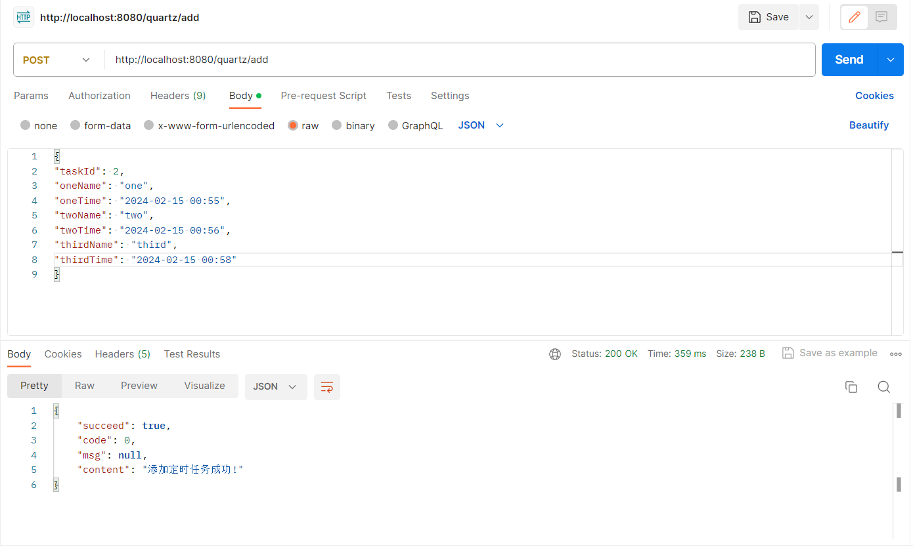

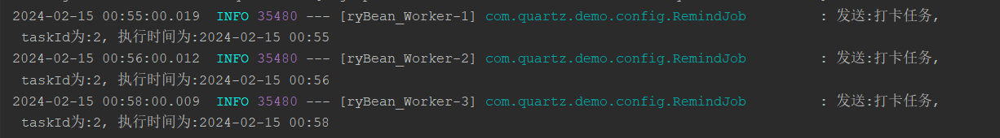

## 定时数据库备份

默认启动定时数据库备份功能

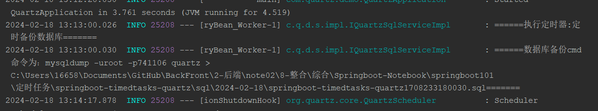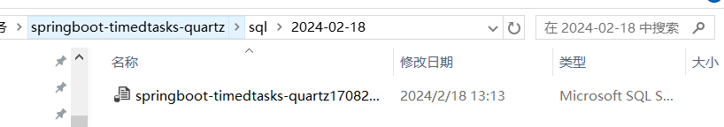

# 参考

[实现数据库定期备份和定期删除（Quartz和Schedule两种方式实现)](https://blog.csdn.net/luomaCLX/article/details/127630105)

[springboot + mybatis-plus + quaryz 数据库持久化任务调度](https://blog.csdn.net/qq_39091806/article/details/123723224)