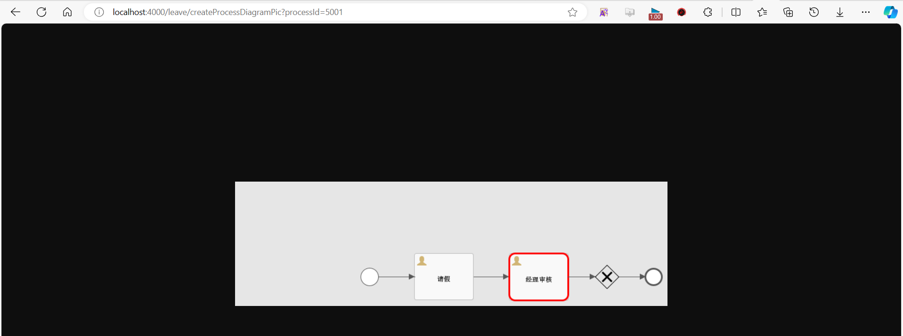

参考: [SpringBoot+flowable](https://blog.csdn.net/wkywky123/article/details/129588970?spm=1001.2101.3001.6650.1&utm_medium=distribute.pc_relevant.none-task-blog-2~default~CTRLIST~Rate-1-129588970-blog-134381852.235^v40^pc_relevant_anti_vip_base&depth_1-utm_source=distribute.pc_relevant.none-task-blog-2~default~CTRLIST~Rate-1-129588970-blog-134381852.235^v40^pc_relevant_anti_vip_base&utm_relevant_index=2)

参考: springboot-work-flowable2

作用: 简单理解生成流程图

测试

