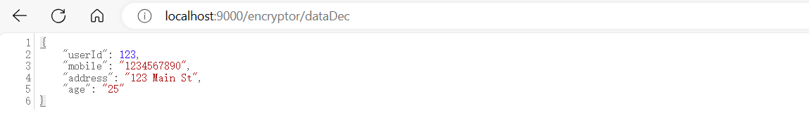

# 敏感数据的保护伞——SpringBoot集成jasypt

## 需要加密的信息

一般来说，项目配置文件里，所有涉及信息安全的配置项都应该做处理，最起码不能用明文直接写在配置文件里，例如：

- 用到的数据库、缓存的密码
- 用到的中间件、消息队列的密码
- 用到的各种第三方服务的Access_Key
- 其他第三方服务的通信信息,,,,,,,,,,,,,,[]

## 数据脱敏

生产环境用户的隐私数据，比如手机号、身份证或者一些账号配置等信息，入库时都要进行不落地脱敏，也就是在进入我们系统时就要实时的脱敏处理。

用户数据进入系统，脱敏处理后持久化到数据库，用户查询数据时还要进行反向解密。这种场景一般需要全局处理，那么用`AOP`切面来实现在适合不过了。

首先自定义两个注解`@EncryptField`、`@EncryptMethod`分别用在字段属性和方法上，实现思路很简单，只要方法上应用到`@EncryptMethod`注解，则检查入参字段是否标注`@EncryptField`注解，有则将对应字段内容加密。

### pom

```xml
<dependencies>
    <dependency>
        <groupId>org.springframework.boot</groupId>
        <artifactId>spring-boot-starter-web</artifactId>
    </dependency>
    <dependency>
        <groupId>org.springframework.boot</groupId>
        <artifactId>spring-boot-starter-test</artifactId>
    </dependency>

    <dependency>
        <groupId>org.springframework.boot</groupId>
        <artifactId>spring-boot-starter-aop</artifactId>
    </dependency>
    <!--配置文件加密-->
    <dependency>
        <groupId>com.github.ulisesbocchio</groupId>
        <artifactId>jasypt-spring-boot-starter</artifactId>
        <version>2.1.0</version>
    </dependency>
    <dependency>
        <groupId>org.aspectj</groupId>
        <artifactId>aspectjweaver</artifactId>
    </dependency>
 <!-- mybatisplus+数据库相关开始-->
    <dependency>
        <groupId>com.baomidou</groupId>
        <artifactId>mybatis-plus-core</artifactId>
        <version>3.5.3.1</version>
    </dependency>
    <!--使用mybatisplus常用CRUD接口方式,可以不用写sql语句-->
    <dependency>
        <groupId>com.baomidou</groupId>
        <artifactId>mybatis-plus-boot-starter</artifactId>
        <version>3.5.3.1</version>
    </dependency>
    <!--使用mybatisplus代码生成器, 具体用法见官网-->
    <dependency>
        <groupId>com.baomidou</groupId>
        <artifactId>mybatis-plus-generator</artifactId>
        <version>3.5.3.1</version>
    </dependency>
    <!--mybatisplus+数据库相关结束-->
    <dependency>
        <groupId>org.projectlombok</groupId>
        <artifactId>lombok</artifactId>
    </dependency>
</dependencies>

```

### yml

```yaml
server:
  port: 9000

spring:
  datasource:
    driver-class-name: com.mysql.cj.jdbc.Driver
    type: com.zaxxer.hikari.HikariDataSource
    url: jdbc:mysql://localhost:3306/jindao
    username: root
    password: CODE(yTDT90o8m/N9uwVvJybwjg==)  #使用Jasypt对数据库密码加密，并替换明文

mybatis:
  mapper-locations: classpath:/mapper/*.xml
  configuration:
    map-underscore-to-camel-case: true

jasypt:
  encryptor:
    password: 35579B7F9C8CB15E  #加解密的密钥，自定义即可，必填项
    algorithm: PBEWithMD5AndDES  #指定解密算法，加解密必须一致. # 加密算法,jasypt3.0后，默认支持的算法为 PBEWITHHMACSHA512ANDAES_256 ，该算法需要JDK1.9 以上支持或者添加JCE(Java Cryptography Extension 无限强度权限策略文件)支持
    string-output-type: base64  #设置加密内容输出的编码形式，可用的编码类型有 base64(默认值)、hexadecimal（16进制）
    poolSize: 3
    property:
      #自定义的前后缀标记，默认ENC()
      prefix: CODE(
      suffix: )
```

### 自定义注解

#### annotation

##### EncryptField

```java
package com.springboot101.annotation;

import java.lang.annotation.*;

/**
 * 用于标记需要加密的字段或参数
 */
@Documented
@Target({ElementType.FIELD,ElementType.PARAMETER})
@Retention(RetentionPolicy.RUNTIME)
public @interface EncryptField {

    String[] value() default "";
}
```

##### EncryptMethod

```java
package com.springboot101.annotation;

import java.lang.annotation.*;

import static com.springboot101.enums.EncryptConstant.ENCRYPT;

/**
 * 加密方法注解
 */

@Documented
@Target({ElementType.METHOD})
@Retention(RetentionPolicy.RUNTIME)
public @interface EncryptMethod {
    String type() default ENCRYPT;
}
```

#### aspect

##### EncryptHandler

```java
package com.springboot101.aspect;//package com.springboot101.aspect;

import com.springboot101.annotation.EncryptField;
import com.springboot101.annotation.EncryptMethod;
import com.springboot101.enums.EncryptConstant;
import lombok.extern.slf4j.Slf4j;
import org.aspectj.lang.ProceedingJoinPoint;
import org.aspectj.lang.annotation.Around;
import org.aspectj.lang.annotation.Aspect;
import org.aspectj.lang.annotation.Pointcut;
import org.jasypt.encryption.StringEncryptor;
import org.springframework.beans.factory.annotation.Autowired;
import org.springframework.stereotype.Component;
import java.lang.reflect.Field;
import java.util.Objects;
import static com.springboot101.enums.EncryptConstant.ENCRYPT;
import static com.springboot101.enums.EncryptConstant.DECRYPT;

@Slf4j
@Aspect
@Component
public class EncryptHandler {

	@Autowired
	private StringEncryptor stringEncryptor;

	@Pointcut("@annotation(com.springboot101.annotation.EncryptMethod)")
	public void pointCut() {
	}

	//在切面中实现加密和解密的功能，并确保在调用目标方法之前和之后都执行这些操作
	@Around("@annotation(pointCut)")
	public Object around(ProceedingJoinPoint joinPoint, EncryptMethod pointCut) throws Throwable {
		// 获取 @EncryptMethod 中的 type 参数值
		String type = pointCut.type();
		switch (type) {
			case ENCRYPT:
				// 执行加密操作
				return encrypt(joinPoint);
			case DECRYPT:
				// 执行解密操作
				return decrypt(joinPoint);  //环绕方法中返回值: 目标方法的执行结果
			default:
				// 如果类型不匹配，则返回 null 或其他适当的值
				return null;
		}
	}

	public Object encrypt(ProceedingJoinPoint joinPoint) throws Throwable {
		// 获取目标方法的参数
		Object[] args = joinPoint.getArgs();
		try {
			// 如果方法有参数
			if (args.length != 0) {
				for (int i = 0; i < args.length; i++) {
					Object o = args[i];
					// 如果参数是字符串类型，则对其进行加密
					if (o instanceof String) {
						args[i] = encryptValue(o);
					} else {
						// 如果参数不是字符串类型，则调用 handler 方法对其进行加密处理
						args[i] = handler(o, EncryptConstant.ENCRYPT);
					}
					//TODO 其余类型自己看实际情况加
				}
			}
		} catch (IllegalAccessException e) {
			e.printStackTrace();
		}

		// 调用目标方法，并传入修改后的参数
		// 这样方法中就能直接获取方法的参数加密后的值,
		// 不这样做方法内部方法的参数不会加密,只有返回值是加密后的
		Object result = joinPoint.proceed(args);
		return result;
	}

	public Object decrypt(ProceedingJoinPoint joinPoint) {
		Object result = null;
		try {
			// 执行被切入的方法，并获取方法返回值
			Object obj = joinPoint.proceed();
			// 检查返回值是否为空
			if (obj != null) {
				// 如果返回值是字符串类型
				if (obj instanceof String) {
					// 解密字符串类型的返回值
					result = decryptValue(obj);
				} else {
					// 如果返回值不是字符串类型，调用handler方法处理返回值
					result = handler(obj, EncryptConstant.DECRYPT);
				}
				//TODO 其余类型自己看实际情况加
			}
		} catch (Throwable e) {
			// 捕获异常并打印堆栈信息
			e.printStackTrace();
		}
		// 返回解密后的结果
		return result;
	}


	private Object handler(Object obj, String type) throws IllegalAccessException {

		if (Objects.isNull(obj)) {
			return null;
		}
		Field[] fields = obj.getClass().getDeclaredFields();
		for (Field field : fields) {
			boolean annotationPresent = field.isAnnotationPresent(EncryptField.class);
			if (annotationPresent) {
				field.setAccessible(true);
				String value;
				String realValue = (String) field.get(obj);
				if (EncryptConstant.DECRYPT.equals(type)) {
					value = stringEncryptor.decrypt(realValue);
				} else {
					value = stringEncryptor.encrypt(realValue);
				}
				field.set(obj, value);
			}
		}
		return obj;
	}

	public String encryptValue(Object realValue) {
		String value = null;
		try {
			value = stringEncryptor.encrypt(String.valueOf(realValue));
		} catch (Exception ex) {
			return value;
		}
		return value;
	}

	public String decryptValue(Object realValue) {
		String value = String.valueOf(realValue);
		try {
			value = stringEncryptor.decrypt(value);
		} catch (Exception ex) {
			return value;
		}
		return value;
	}
}

```

#### enums

##### EncryptConstant

```java
package com.springboot101.enums;

public interface EncryptConstant {

    // 加密
    String ENCRYPT = "encrypt";

    // 解密
    String DECRYPT = "decrypt";
}

```

### controller

```java
package com.springboot101.controller;

import com.springboot101.annotation.EncryptField;
import com.springboot101.annotation.EncryptMethod;
import com.springboot101.entity.Users;
import com.springboot101.service.UsersService;
import lombok.extern.slf4j.Slf4j;
import org.jasypt.encryption.StringEncryptor;
import org.springframework.beans.factory.annotation.Autowired;
import org.springframework.web.bind.annotation.*;

import static com.springboot101.enums.EncryptConstant.DECRYPT;

@Slf4j
@RestController
@RequestMapping("/encryptor")
public class Encryptor {

    @Autowired
    private StringEncryptor stringEncryptor;

    @Autowired
    UsersService usersService;

    /**
     * 预先生成的加密值，可以通过stringEncryptor内调用API生成
     * @param content
     */
    @GetMapping("/test1")
    public void encryptTest(String content) {
        String encryptStr = stringEncryptor.encrypt(content);
        String decryptStr = stringEncryptor.decrypt(encryptStr);
        System.out.println("加密后的内容：" + encryptStr);
        System.out.println("解密后的内容：" + decryptStr);
    }

    @EncryptMethod()
    @PostMapping("/dataEnc")
    @ResponseBody
    public Object testEncrypt(@RequestBody Users user, @RequestParam @EncryptField String username) {
        System.out.println("加密后的Users: " + user);
        System.out.println("加密后的username：" + username); // 打印加密后的用户名

        // 保存到数据库  Users(userId=123, mobile=iehuD1gFxRoYq7hJcw/JD+YLfYu6Rb9Z, address=n4ZdBg7VCsEtb37dC0PmzXv11/58qALK, age=25)
        usersService.save(user);

        return user;
    }

    @GetMapping("/dataDec")
    @EncryptMethod(type = DECRYPT)
    public Users testDecrypt() {
        Users user = usersService.getById(123);
        return user;
    }
}

```

### mybatis

#### entity

```java
package com.springboot101.entity;

import com.baomidou.mybatisplus.annotation.IdType;
import com.baomidou.mybatisplus.annotation.TableField;
import com.baomidou.mybatisplus.annotation.TableId;
import com.baomidou.mybatisplus.annotation.TableName;
import java.io.Serializable;

import com.springboot101.annotation.EncryptField;
import lombok.Data;

/**
 * 
 * @TableName users
 */
@TableName(value ="users")
@Data
public class Users implements Serializable {
    /**
     * 
     */
    @TableId(value = "user_id")
    private Long userId;

    /**
     * 
     */
    @EncryptField  //标记需要加密的字段或参数
    @TableField(value = "mobile")
    private String mobile;

    /**
     * 
     */
    @EncryptField  //标记需要加密的字段或参数
    @TableField(value = "address")
    private String address;

    /**
     * 
     */
    @TableField(value = "age")
    private String age;

    @TableField(exist = false)
    private static final long serialVersionUID = 1L;
}
```

其余mybatis默认生成就行

### 运行结果

#### 加密

http://localhost:9000/encryptor/dataEnc?username=123456

```
{
"userId": 123,
"mobile": "1234567890",    // 需要加密
"address": "123 Main St",  // 需要加密
"age": "25"
}
```


**保存到数据库**


#### 解密

[localhost:9000/encryptor/dataDec](http://localhost:9000/encryptor/dataDec)



## 加解密的密钥处理

将加密密码以明文形式写在配置文件中并不安全，实际开发中也不推荐这样使用。我们使用idea测试时，可以进行如下设置：

### 启动命令 并注入 秘钥配置

如果打包后部署项目，可以使用如下命令在启动项目时指定秘钥：

方式1：

```java
java -jar -Djasypt.encryptor.password=加密数据的秘钥 XXX-jasypt.jar
```

方式2：

```
java -jar -Djasypt.encryptor.加密数据的秘钥=${JASYPT_PASSWORD} xxx.jar
```

### 生成待加密的文本内容

```java
java -cp  D:\maven_lib\org\jasypt\jasypt\1.9.3\jasypt-1.9.3.jar org.jasypt.intf.cli.JasyptPBEStringEncryptionCLI input="mypassword" password=35579B7F9C8CB15E
```

+ maven包路径 D:\maven_lib\org\jasypt\jasypt\1.9.3\jasypt-1.9.3.jar 
+ input  待加密文本
+ password 秘钥文本
