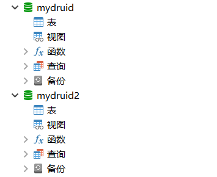
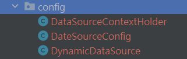
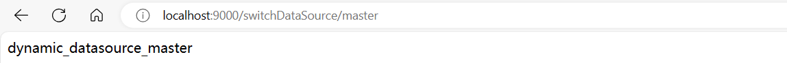
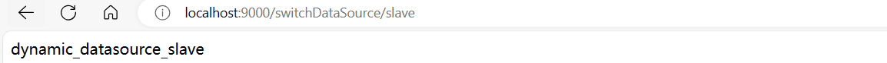
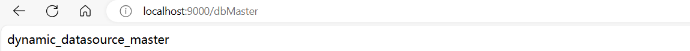
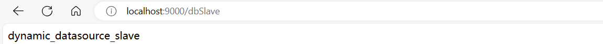

# SpringBoot 基于注解来动态切换数据源

## 数据库设置

### 数据库



### 表

分别在两个数据库中创建一张相同的表

```sql
DROP TABLE if EXISTS t_dynamic_datasource_data;

CREATE TABLE IF NOT EXISTS `t_dynamic_datasource_data` (
  `id` bigint(20) NOT NULL AUTO_INCREMENT,
  `source_name` varchar(25) DEFAULT NULL,
  PRIMARY KEY (`id`)
) ;
```

在 mydruid 中插入如下数据

```sql
insert into t_dynamic_datasource_data (source_name) value ('dynamic_datasource_master');
```

在 mydruid2 中插入如下数据

```sql
INSERT INTO t_dynamic_datasource_data (source_name) VALUE ('dynamic_datasource_slave');
```

## 配置文件

```yaml
mybatis:
  configuration:
    map-underscore-to-camel-case: true
  mapper-locations: classpath:/mapper/*.xml
server:
  port: 9000
spring:
  datasource:
    druid:
      master:
        driver-class-name: com.mysql.cj.jdbc.Driver
        password: 741106
        type: com.zaxxer.hikari.HikariDataSource
        url: jdbc:mysql://localhost:3306/mydruid
        username: root
      slave:
        driver-class-name: com.mysql.cj.jdbc.Driver
        password: 741106
        type: com.zaxxer.hikari.HikariDataSource
        url: jdbc:mysql://localhost:3306/mydruid2
        username: root
```

## 配置类



## 自定义注解


## entity

```kotlin
package com.dynamic.entity;

import com.baomidou.mybatisplus.annotation.TableName;
import lombok.AllArgsConstructor;
import lombok.Data;
/**
 * 实体类
 */
@TableName("t_dynamic_datasource_data")
@Data
public class DynamicDatasourceData {

    private Long id;
    private String sourceName;
}
```

## mapper

```kotlin
package com.dynamic.dao;

import com.baomidou.mybatisplus.core.mapper.BaseMapper;
import com.dynamic.entity.DynamicDatasourceData;
import org.apache.ibatis.annotations.Mapper;
/**
 * mapper
 */
@Mapper
public interface DynamicDatasourceDataMapper extends BaseMapper<DynamicDatasourceData> {
}
```

## controller

```kotlin
package com.dynamic.controller;

import com.dynamic.aspect.DS;
import com.dynamic.config.DataSourceContextHolder;
import com.dynamic.dao.DynamicDatasourceDataMapper;
import com.dynamic.entity.DynamicDatasourceData;
import org.springframework.web.bind.annotation.GetMapping;
import org.springframework.web.bind.annotation.PathVariable;
import org.springframework.web.bind.annotation.RestController;

import javax.annotation.Resource;

/**
 * 动态数据源切换
 *
 * @date 2023/11/27 11:02
 */
@RestController
public class DynamicSwitchController {

    @Resource
    private DynamicDatasourceDataMapper dynamicDatasourceDataMapper;

    // 不使用@DS注解
    @GetMapping("/switchDataSource/{datasourceName}")
    public String switchDataSource(@PathVariable("datasourceName") String datasourceName) {
        DataSourceContextHolder.setDataSource(datasourceName);
        DynamicDatasourceData dynamicDatasourceData = dynamicDatasourceDataMapper.selectOne(null);
        DataSourceContextHolder.removeDataSource();
        return dynamicDatasourceData.getSourceName();
    }

    // 使用@DS注解
    // 切换为数据源1
    @DS(value = "master")
    @GetMapping("/dbMaster")
    public String dbMaster() {
        DynamicDatasourceData dynamicDatasourceData = dynamicDatasourceDataMapper.selectOne(null);
        return dynamicDatasourceData.getSourceName();
    }

    // 切换为数据源2
    @DS(value = "slave")
    @GetMapping("/dbSlave")
    public String dbSlave() {
        DynamicDatasourceData dynamicDatasourceData = dynamicDatasourceDataMapper.selectOne(null);
        return dynamicDatasourceData.getSourceName();
    }


    /**
     * 验证一下事物控制
     */
//    @Transactional(rollbackFor = Exception.class)
    @DS(value = "slave")
    @GetMapping("/dbTestTransactional")
    public void dbTestTransactional() {

        DynamicDatasourceData datasourceData = new DynamicDatasourceData();
        datasourceData.setSourceName("test");
        dynamicDatasourceDataMapper.insert(datasourceData);

        DynamicDatasourceData datasourceData1 = new DynamicDatasourceData();
        datasourceData1.setSourceName("TestTest");
        dynamicDatasourceDataMapper.insert(datasourceData1);
    }
}
```

测试结果[localhost:9000](http://localhost:9000/)

**不使用注解**





**使用注解**




