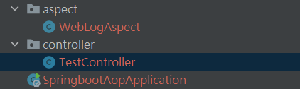
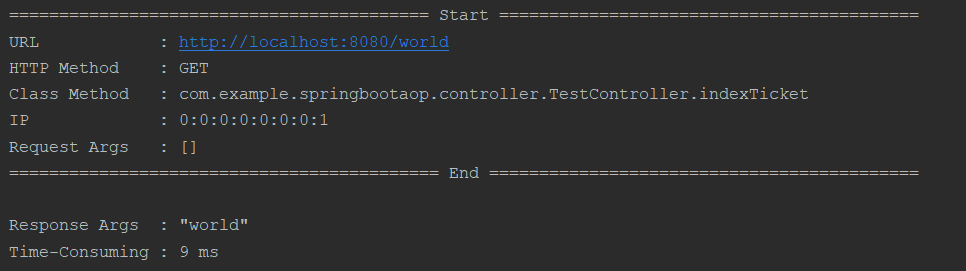
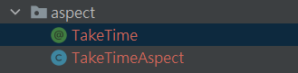
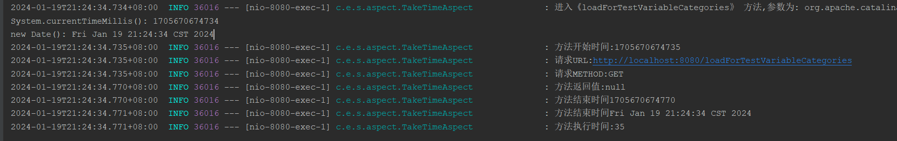

# 使用切面类(AOP)

**AOP面向切面编程可以让我们实现一些与业务逻辑无关的功能,  如日志、事务、安全等。**

## AOP日志记录方式

- 扫描包的方式。传入的参数在请求头里面(企业常用)
- 自定义注解

### 切面相关注解

@Aspect -- 作用是把当前类标识为一个切面供容器读取
@Pointcut -- (切入点):就是带有通知的连接点，在程序中主要体现为书写切入点表达式
@Before -- 标识一个前置增强方法，相当于BeforeAdvice的功能
@AfterReturning -- 后置增强，相当于AfterReturningAdvice，方法退出时执行
@AfterThrowing -- 异常抛出增强，相当于ThrowsAdvice
@After -- final增强，不管是抛出异常或者正常退出都会执行
@Around -- 环绕增强，相当于MethodInterceptor 

### **AOP五种通知工作**

前置通知：在目标方法调用之前执行，可以获得切入点信息；
后置通知：在目标方法执行后执行，目标方法有异常不执行；
异常通知：在目标方法抛出异常时执行，可以获取异常信息；
最终通知：在目标方法执行后执行，无论是否有异常都执行；
环绕通知：最强大的通知类型，在目标方法执行前后操作，可以阻止目标方法执行。

### 方法1:  扫描包的方式



#### pom依赖

```xml
<!--AOP的依赖-->
<dependency>
    <groupId>org.springframework.boot</groupId>
    <artifactId>spring-boot-starter-aop</artifactId>
</dependency>
<!--其他-->
<dependency>
    <groupId>com.alibaba</groupId>
    <artifactId>fastjson</artifactId>
    <version>1.2.79</version>
</dependency>
<dependency>
    <groupId>org.projectlombok</groupId>
    <artifactId>lombok</artifactId>
    <optional>true</optional>
</dependency>
```

#### aspect

```java
package com.example.springbootaop.aspect;

import com.google.gson.Gson;
import jakarta.servlet.http.HttpServletRequest;
import org.aspectj.lang.JoinPoint;
import org.aspectj.lang.ProceedingJoinPoint;
import org.aspectj.lang.annotation.*;
import org.aspectj.lang.reflect.MethodSignature;
import org.slf4j.Logger;
import org.slf4j.LoggerFactory;
import org.springframework.stereotype.Component;
import org.springframework.web.context.request.RequestContextHolder;
import org.springframework.web.context.request.ServletRequestAttributes;
import org.springframework.web.multipart.MultipartFile;

import java.util.HashMap;
import java.util.Map;

/**
 * @Author: LFJ
 * @Date: 2024-01-19 20:30
 */

@Aspect
@Component
public class WebLogAspect {

	private final static Logger logger = LoggerFactory.getLogger(WebLogAspect.class);

	/**定义切入点----以 controller 包下所有以*Ticket结尾的公共方法。 */
	@Pointcut("execution(public * com.example.springbootaop.controller..*.*Ticket(..))")
	public void webLog() {
	}

	/**
	 * 在切点之前植入
	 *
	 * @param joinPoint
	 * @throws Throwable
	 */
	@Before("webLog()")
	public void doBefore(JoinPoint joinPoint) throws Throwable {
		// 开始打印请求日志
		ServletRequestAttributes attributes = (ServletRequestAttributes) RequestContextHolder.getRequestAttributes();
		HttpServletRequest request = attributes.getRequest();

		// 打印请求相关参数
		logger.info("========================================== Start ==========================================");
		// 打印请求 url
		logger.info("URL            : {}", request.getRequestURL().toString());
		// 打印 Http method
		logger.info("HTTP Method    : {}", request.getMethod());
		// 打印调用 controller 的全路径以及执行方法
		logger.info("Class Method   : {}.{}", joinPoint.getSignature().getDeclaringTypeName(),
				joinPoint.getSignature().getName());
		// 打印请求的 IP
		logger.info("IP             : {}", request.getRemoteAddr());
		// 打印请求入参
		logger.info("Request Args   : {}", new Gson().toJson(joinPoint.getArgs()));
	}

	/**
	 * 在切点之后织入
	 *
	 * @throws Throwable
	 */
	@After("webLog()")
	public void doAfter() throws Throwable {
		logger.info("=========================================== End ===========================================");
		// 每个请求之间空一行
		logger.info("");
	}

	/**
	 * 环绕
	 *
	 * @param proceedingJoinPoint
	 * @return
	 * @throws Throwable
	 */
	@Around("webLog()")
	public Object doAround(ProceedingJoinPoint proceedingJoinPoint) throws Throwable {
		long startTime = System.currentTimeMillis();
		Object result = proceedingJoinPoint.proceed();
		// 打印出参
		logger.info("Response Args  : {}", new Gson().toJson(result));
		// 执行耗时
		logger.info("Time-Consuming : {} ms", System.currentTimeMillis() - startTime);
		return result;
	}


	/**
	 *
	 * @param proceedingJoinPoint 切面
	 * @return
	 * @throws Throwable
	 */
//	@Around("webLog()")
//	public Object doAround(ProceedingJoinPoint proceedingJoinPoint) throws Throwable {
//		long start = System.currentTimeMillis();
//		Object result = proceedingJoinPoint.proceed();
//		logger.info("Request Params       : {}", getRequestParams(proceedingJoinPoint));
//		logger.info("Result               : {}", result);
//		logger.info("Time Cost            : {} ms", System.currentTimeMillis() - start);
//
//		return result;
//	}

	/**
	 * 获取入参
	 *
	 * @param proceedingJoinPoint
	 *
	 * @return
	 */
	private Map<String, Object> getRequestParams(ProceedingJoinPoint proceedingJoinPoint) {
		Map<String, Object> requestParams = new HashMap<>();

		// 参数名
		String[] paramNames = ((MethodSignature) proceedingJoinPoint.getSignature()).getParameterNames();
		// 参数值
		Object[] paramValues = proceedingJoinPoint.getArgs();

		for (int i = 0; i < paramNames.length; i++) {
			Object value = paramValues[i];

			// 如果是文件对象
			if (value instanceof MultipartFile) {
				MultipartFile file = (MultipartFile) value;
				// 获取文件名
				value = file.getOriginalFilename();
			}

			requestParams.put(paramNames[i], value);
		}

		return requestParams;
	}

}

```

#### controller

```java
package com.example.springbootaop.controller;

import org.springframework.stereotype.Controller;
import org.springframework.web.bind.annotation.GetMapping;
import org.springframework.web.bind.annotation.ResponseBody;

/**
 * @Author: LFJ
 * @Date: 2024-01-19 20:33
 */
@Controller
public class TestController {
	@GetMapping("index")
	@ResponseBody
	public String index(){
		return "Hello";
	}

	// com.example.springbootaop.aspect.WebLogAspect配置了controller总以xxxTicket结尾的方法
	@GetMapping("world")
	@ResponseBody
	public String indexTicket(){
		return "world";
	}
}

```

#### **运行结果**

网页输入:  localhost:8080/world


控制台打印



### 方法2: 自定义注解方式



#### pom依赖

```xml
<!--AOP的依赖-->
<dependency>
    <groupId>org.springframework.boot</groupId>
    <artifactId>spring-boot-starter-aop</artifactId>
</dependency>
```

#### aspect

#####  自定义注解

```java
package com.example.springbootaopannotation.aspect;

/**
 * @Author: LFJ
 * @Date: 2024-01-19 21:05
 */
import java.lang.annotation.*;

/**
 * 用于统计耗时注解
 */
@Documented //用于描述其它类型的annotation应该被作为被标注的程序成员的公共API因此可以被例如javadoc此类的工具文档化.Documented是一个标记注解,没有成员.表示该注解将被包含在 Javadoc 中
@Target({ElementType.METHOD, ElementType.TYPE}) //表示该注解可以用于方法和类。
@Retention(RetentionPolicy.RUNTIME) //表示该注解在运行时保留，可以通过反射获取。
public @interface TakeTime {

	String methodName() default "";
}

// 使用  @TakeTime(methodName: xxx)
```

- `@Target({ElementType.METHOD, ElementType.TYPE})`: 表示该注解可以用于方法和类。
- `@Retention(RetentionPolicy.RUNTIME)`: 表示该注解在运行时保留，可以通过反射获取。
- `@Documented`: 表示该注解将被包含在 Javadoc 中。
- `@Inherited`: 表示该注解可以被子类继承。

##### 定义切面类

```java
package com.example.springbootaopannotation.aspect;

/**
 * @Author: LFJ
 * @Date: 2024-01-19 21:12
 */

import com.alibaba.fastjson.JSON;
import jakarta.servlet.http.HttpServletRequest;
import lombok.extern.slf4j.Slf4j;
import org.aspectj.lang.JoinPoint;
import org.aspectj.lang.annotation.AfterReturning;
import org.aspectj.lang.annotation.Aspect;
import org.aspectj.lang.annotation.Before;
import org.aspectj.lang.annotation.Pointcut;
import org.springframework.stereotype.Component;
import org.springframework.web.context.request.RequestContextHolder;
import org.springframework.web.context.request.ServletRequestAttributes;

import java.util.Date;

/**
 * 耗时统计
 */
@Slf4j
@Aspect
@Component
public class TakeTimeAspect {
	//统计请求的处理时间
	ThreadLocal<Long> startTime = new ThreadLocal<>();
	ThreadLocal<Long> endTime = new ThreadLocal<>();

	/**定义切入点----以 aspect 包下带有@TakeTime注解的方法 */
	@Pointcut("@annotation(com.example.springbootaopannotation.aspect.TakeTime)")
	public void TakeTime() {
	}

	@Before("TakeTime()")
	public void doBefore(JoinPoint joinPoint) throws Throwable {
		// 获取方法的名称
		String methodName = joinPoint.getSignature().getName();
		// 获取方法入参
		Object[] param = joinPoint.getArgs();
		StringBuilder sb = new StringBuilder();
		for (Object o : param) {
			sb.append(o + ";");
		}
		log.info("进入《{}》 方法,参数为: {}", methodName,sb.toString());

		System.out.println("System.currentTimeMillis(): "+System.currentTimeMillis());
		System.out.println("new Date(): "+new Date());
		startTime.set(System.currentTimeMillis());
		log.info("方法开始时间:" +startTime.get());
		//接收到请求，记录请求内容
		ServletRequestAttributes attributes = (ServletRequestAttributes) RequestContextHolder.getRequestAttributes();
		HttpServletRequest request = attributes.getRequest();

		//记录请求的内容
		log.info("请求URL:" + request.getRequestURL().toString());
		log.info("请求METHOD:" + request.getMethod());
	}

	@AfterReturning(returning = "ret", pointcut = "TakeTime()")
	public void doAfterReturning(Object ret) {
		//处理完请求后，返回内容
		log.info("方法返回值:" + JSON.toJSONString(ret));
		endTime.set(System.currentTimeMillis());
		log.info("方法结束时间" +endTime.get());
		log.info("方法结束时间" +new Date());
		log.info("方法执行时间:" + (endTime.get() - startTime.get()));
	}
}
```

#### controller

```java
package com.example.springbootaopannotation.controller;

import com.example.springbootaopannotation.aspect.TakeTime;
import jakarta.servlet.http.HttpServletRequest;
import jakarta.servlet.http.HttpServletResponse;
import org.springframework.stereotype.Controller;
import org.springframework.web.bind.annotation.GetMapping;
import org.springframework.web.bind.annotation.RequestMapping;
import org.springframework.web.bind.annotation.ResponseBody;

/**
 * @Author: LFJ
 * @Date: 2024-01-19 21:16
 */

@Controller
public class TestController {

	@RequestMapping("/loadForTestVariableCategories")
	@TakeTime(methodName = "loadForTestVariableCategories")
	public void loadForTestVariableCategories(HttpServletRequest req, HttpServletResponse resp) throws Exception {
		int n = 0;
		for (int i = 0; i < 100000; i++) {
			n += i;
		}
	}
}
```

#### 运行结果

网页输入:  localhost:8080/loadForTestVariableCategories


控制台打印

