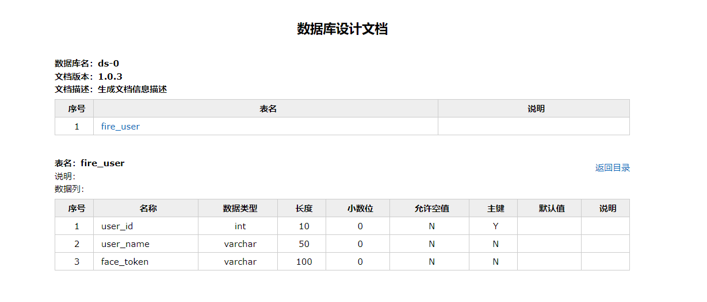

> 作用: 生成数据库文档

# 数据库

用于测试

```sql
CREATE TABLE fire_user (
    user_id INT PRIMARY KEY AUTO_INCREMENT,
    user_name VARCHAR(50) NOT NULL,
    face_token VARCHAR(100) NOT NULL
);

CREATE TABLE test_group (
    user_id INT,
);
```

# 配置

引入`screw`核心包，`HikariCP`数据库连接池，`HikariCP`号称性能最出色的数据库连接池。

```
        <!-- screw核心 -->
        <dependency>
            <groupId>cn.smallbun.screw</groupId>
            <artifactId>screw-core</artifactId>
            <version>1.0.3</version>
        </dependency>

        <!-- HikariCP -->
        <dependency>
            <groupId>com.zaxxer</groupId>
            <artifactId>HikariCP</artifactId>
            <version>3.4.5</version>
        </dependency>
```

# 配置数据源

配置数据源，设置 `useInformationSchema` 可以获取`tables`注释信息。

```yaml
spring:
  datasource:
    driver-class-name: com.mysql.cj.jdbc.Driver
    username: root
    password: 123456
    url: jdbc:mysql://127.0.0.1:3306/ds-0?useUnicode=true&characterEncoding=UTF-8&useSSL=false
    #配置数据源，设置 useInformationSchema 可以获取tables注释信息。
    xa:
      properties:
        useInformationSchema=true:
```

# screw 核心配置

`screw`有两种执行方式，第一种是`pom`文件配置，另一种是代码执行。

```java
package com.springboot101;

import cn.smallbun.screw.core.Configuration;
import cn.smallbun.screw.core.engine.EngineConfig;
import cn.smallbun.screw.core.engine.EngineFileType;
import cn.smallbun.screw.core.engine.EngineTemplateType;
import cn.smallbun.screw.core.execute.DocumentationExecute;
import cn.smallbun.screw.core.process.ProcessConfig;
import org.junit.jupiter.api.Test;
import org.springframework.beans.factory.annotation.Autowired;
import org.springframework.boot.test.context.SpringBootTest;
import org.springframework.context.ApplicationContext;

import javax.annotation.Resource;
import javax.sql.DataSource;
import java.util.ArrayList;
import java.util.Arrays;
import java.util.List;

/**
 
 * @Description:
 */
@SpringBootTest
public class ScrewApplicationTests {

    @Resource
    ApplicationContext applicationContext;

    @Test
    void contextLoads() {
        DataSource dataSourceMysql = applicationContext.getBean(DataSource.class);
        // 生成文件配置
        EngineConfig engineConfig = EngineConfig.builder()
                // 生成文件路径，自己mac本地的地址，这里需要自己更换下路径
                .fileOutputDir("C:\\Users\\16658\\Documents\\GitHub\\BackFront\\2-后端\\note02\\8-整合\\综合\\Springboot-Notebook\\springboot101\\通用功能\\springboot-database-doc\\doc")
                // 打开目录
                .openOutputDir(false)
                // 文件类型
                .fileType(EngineFileType.HTML)
                // 生成模板实现
                .produceType(EngineTemplateType.freemarker).build();
        // 生成文档配置（包含以下自定义版本号、描述等配置连接）
        Configuration config = Configuration.builder()
                .version("1.0.3")
                .description("生成文档信息描述")
                .dataSource(dataSourceMysql)
                .engineConfig(engineConfig)
                .produceConfig(getProcessConfig())
                .build();
        // 执行生成
        new DocumentationExecute(config).execute();
    }

    /**
     * 配置想要生成的表+ 配置想要忽略的表
     *
     * @return 生成表配置
     */
    public static ProcessConfig getProcessConfig() {
        // 忽略表名
        List<String> ignoreTableName = Arrays.asList("a", "test_group");
        // 忽略表前缀，如忽略a开头的数据库表
        List<String> ignorePrefix = Arrays.asList("a", "t");
        // 忽略表后缀
        List<String> ignoreSuffix = Arrays.asList("_test", "czb_");
        return ProcessConfig.builder()
                //根据名称指定表生成
                .designatedTableName(Arrays.asList("fire_user"))
                //根据表前缀生成
                .designatedTablePrefix(new ArrayList<>())
                //根据表后缀生成
                .designatedTableSuffix(new ArrayList<>())
                //忽略表名
                .ignoreTableName(ignoreTableName)
                //忽略表前缀
                .ignoreTablePrefix(ignorePrefix)
                //忽略表后缀
                .ignoreTableSuffix(ignoreSuffix).build();
    }
}

```

# 文档格式

`screw` 有 `HTML`、`DOC`、`MD` 三种格式的文档。

代码中的修改

```
.fileType(EngineFileType.HTML)
```

# 运行结果

