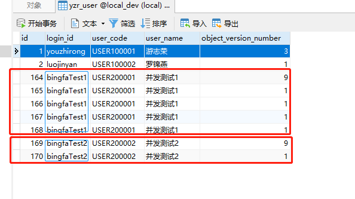
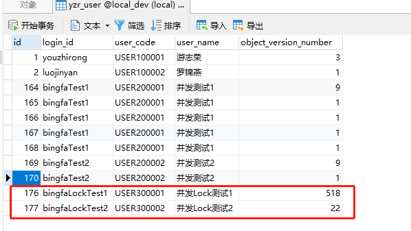

## 简介

- 解决高并发产生的场景，插入数据重复等相关性问题
- 中间涉及到redis，redisson，springboot2.x，tk-mybatis等，使用redisson框架中分布式锁相关方案接口，详情可去它官方文档查看。

## 特征&提供
- 场景举例，例如需要往系统添加/更新一个用户，先需要判断该用户在数据库中存在不存在，若不存在则添加用户，往数据库插入一条用户信息，若存在，则找到这个用户信息，将信息进行覆盖修改。往数据库这条记录更新操作。

- 以上场景只是个举例，大多数业务场景都或多或少存在这些判断插入更新的场景

- 当正常情况，无并发执行的情况。通常代码的逻辑看起来是没有任何问题的。无则插入，有则更新。

- 但是当并发的情况下，就可能不一样了。比如同个用户，同一时间请求了100次。那么第一次肯定是判断插入数据库中，但是线程2可能没等数据写入DB中，脏读了数据库原有的数据。则也认为该用户不存在，则也执行的是新增的操作。这样一来，并发情况下就可能同个用户信息被新建了多条一样的记录了。大家想想是不是~~~

- 详情插入/更新用户逻辑可以参考实现：[UserServiceImpl.java](https://github.com/youzhirong/fbsRedissonLock/blob/master/src/main/java/com/youzhirong/fbslock/service/impl/UserServiceImpl.java)

  	@Override
  	public void saveByDTO(UserDTO userDTO) {
  		Boolean isAdd = Boolean.FALSE;
  		UserDTO source = selectByCode(userDTO.getLoginId());
  		if (source == null) {
  			isAdd = Boolean.TRUE;
  			userDTO.setId(null);
  			userDTO.setObjectVersionNumber(1L);
  		}else {
  			userDTO.setId(source.getId());
  			userDTO.setObjectVersionNumber(source.getObjectVersionNumber());
  		}
  		UserDO userDO = new UserDO();
  		BeanUtils.copyProperties(userDTO, userDO);
  		if (isAdd) {
  			userMapper.insertSelective(userDO);
  		} else {
  			userMapper.updateByPrimaryKey(userDO);
  		}
  	}
  

- 需要先准备redis环境，修改redis相关配置参数（默认是本地，默认端口）
- 启动项目后，再运行测试，重现并发产生重复问题的测试类：[FbslockApplicationTests.java](https://github.com/youzhirong/fbsRedissonLock/blob/master/src/test/java/com/youzhirong/fbslock/FbslockApplicationTests.java)

- 使用了redisson的锁，线程调1000并发。测试类：[FbsRedissonlockApplicationTests.java](https://github.com/youzhirong/fbsRedissonLock/blob/master/src/test/java/com/youzhirong/fbslock/FbsRedissonlockApplicationTests.java)
- 加锁后，并无出现重复插入的相关问题了。
  

## 技术选型

- Spring Boot 2.2.6.RELEASE
- Redis
- Redisson
- tk-mybatis
- 其他
