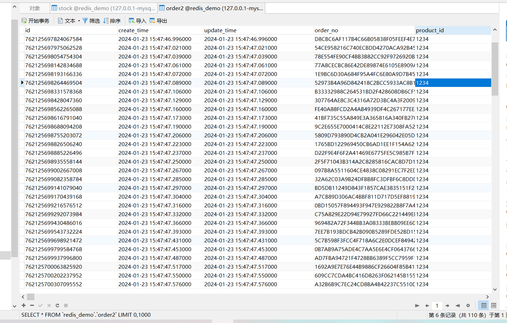

<span style="color:red">个人测试不对, 加锁达不到效果</span>



### 前言

平时的工作中，由于生产环境中的项目是需要部署在多台服务器中的，所以经常会面临解决分布式场景下数据一致性的问题，那么就需要引入分布式锁来解决这一问题。

针对分布式锁的实现，目前比较常用的就如下几种方案：

1. 基于数据库实现分布式锁 
2. 基于 Redis 实现分布式锁    【本文】
3. 基于 Zookeeper 实现分布式锁

接下来这个系列文章会跟大家一块探讨这三种方案，本篇为 Redis 实现分布式锁篇。

Redis分布式环境搭建推荐：[基于Docker的Redis集群搭建](https://www.cnblogs.com/niceyoo/p/13011626.html)

### Redis分布式锁一览

说到 Redis 锁，能搜到的，或者说常用的无非就下面这两个：

- setNX  + Lua脚本            
- Redisson + RLock可重入锁  【本文】

接下来我们一一探索这两个的实现，本文为 Redisson + RLock可重入锁 实现篇。

### 1、setNX+Lua实现方式

跳转链接：[https://www.cnblogs.com/niceyoo/p/13711149.html](https://www.cnblogs.com/niceyoo/p/13711149.html)

### 2、Redisson介绍

Redisson 是 java 的 Redis 客户端之一，是 Redis 官网推荐的 java 语言实现分布式锁的项目。

Redisson 提供了一些 api 方便操作 Redis。因为本文主要以锁为主，所以接下来我们主要关注锁相关的类，以下是 Redisson 中提供的多样化的锁：

- 可重入锁（Reentrant Lock）
- 公平锁（Fair Lock）
- 联锁（MultiLock）
- 红锁（RedLock）
- 读写锁（ReadWriteLock）
- 信号量（Semaphore） 等等

总之，管你了解不了解，反正 Redisson 就是提供了一堆锁... 也是目前大部分公司使用 Redis 分布式锁最常用的一种方式。

本文中 Redisson 分布式锁的实现是基于 RLock 接口，而 RLock 锁接口实现源码主要是 RedissonLock 这个类，而源码中加锁、释放锁等操作都是使用 Lua 脚本来完成的，并且封装的非常完善，开箱即用。

接下来主要以 Redisson 实现 RLock 可重入锁为主。

### 代码中实现过程

一起来看看在代码中 Redisson 怎么实现分布式锁的，然后再对具体的方法进行解释。

源码地址：[https://github.com/niceyoo/redis-redlock](https://github.com/niceyoo/redis-redlock)

> 篇幅限制，文中代码不全，请以上方源码链接为主。

代码大致逻辑：首先会涉及数据库 2 个表，order2（订单表）、stock（库存表），controller层会提供一个创建订单的接口，创建订单之前，先获取 RedLock 分布式锁，获取锁成功后，在一个事务下减库存，创建订单；最后通过创建大于库存的并发数模拟是否出现超卖的情况。

代码环境：``SpringBoot2.2.2.RELEASE`` + ``Spring Data JPA`` + ``Redisson``

##### 1）Maven 依赖 pom.xml

```
<?xml version="1.0" encoding="UTF-8"?>
<project xmlns="http://maven.apache.org/POM/4.0.0" xmlns:xsi="http://www.w3.org/2001/XMLSchema-instance"
         xsi:schemaLocation="http://maven.apache.org/POM/4.0.0 https://maven.apache.org/xsd/maven-4.0.0.xsd">
    <modelVersion>4.0.0</modelVersion>
    <parent>
        <groupId>org.springframework.boot</groupId>
        <artifactId>spring-boot-starter-parent</artifactId>
        <version>2.2.2.RELEASE</version>
        <relativePath/> <!-- lookup parent from repository -->
    </parent>
    <groupId>com.example</groupId>
    <artifactId>redis-redlock</artifactId>
    <version>0.0.1-SNAPSHOT</version>
    <name>redis-redlock</name>
    <description>Demo project for Spring Boot</description>

    <properties>
        <java.version>1.8</java.version>
    </properties>

    <dependencies>
        <dependency>
            <groupId>org.springframework.boot</groupId>
            <artifactId>spring-boot-starter-web</artifactId>
        </dependency>

        <!-- Redis-->
        <dependency>
            <groupId>org.springframework.boot</groupId>
            <artifactId>spring-boot-starter-data-redis</artifactId>
        </dependency>

        <!-- Lombok -->
        <dependency>
            <groupId>org.projectlombok</groupId>
            <artifactId>lombok</artifactId>
            <version>1.18.10</version>
        </dependency>

        <!-- redisson -->
        <dependency>
            <groupId>org.redisson</groupId>
            <artifactId>redisson</artifactId>
            <version>3.11.1</version>
        </dependency>

        <!-- Gson -->
        <dependency>
            <groupId>com.google.code.gson</groupId>
            <artifactId>gson</artifactId>
            <version>2.8.6</version>
        </dependency>

        <!-- JPA -->
        <dependency>
            <groupId>org.springframework.boot</groupId>
            <artifactId>spring-boot-starter-data-jpa</artifactId>
        </dependency>

        <!-- Mysql Connector -->
        <dependency>
            <groupId>mysql</groupId>
            <artifactId>mysql-connector-java</artifactId>
            <version>5.1.48</version>
        </dependency>

        <!-- 数据库连接池 -->
        <dependency>
            <groupId>com.alibaba</groupId>
            <artifactId>druid-spring-boot-starter</artifactId>
            <version>1.1.20</version>
        </dependency>

        <!-- Hutool工具包 -->
        <dependency>
            <groupId>cn.hutool</groupId>
            <artifactId>hutool-all</artifactId>
            <version>4.6.8</version>
        </dependency>

    </dependencies>

    <build>
        <plugins>
            <plugin>
                <groupId>org.springframework.boot</groupId>
                <artifactId>spring-boot-maven-plugin</artifactId>
            </plugin>
        </plugins>
    </build>
</project>
```

redisson、MySQL 等相关依赖。

##### 2）application.yml 配置文件

```
server:
  port: 6666
  servlet:
    context-path: /

spring:
  # 数据源
  datasource:
    url: jdbc:mysql://127.0.0.1:3306/redis_demo?useUnicode=true&characterEncoding=utf-8&useSSL=false
    username: root
    password: 123456
    type: com.alibaba.druid.pool.DruidDataSource
    driverClassName: com.mysql.jdbc.Driver
    logSlowSql: true
  jpa:
    # 显示sql
    show-sql: false
    # 自动生成表结构
    generate-ddl: true
    hibernate:
      ddl-auto: update
  redis:
    redis:
      cluster:
        nodes: 10.211.55.4:6379, 10.211.55.4:6380, 10.211.55.4:6381
      lettuce:
        pool:
          min-idle: 0
          max-idle: 8
          max-active: 20

# 日志
logging:
  # 输出级别
  level:
    root: info
  file:
    # 指定路径
    path: redis-logs
    # 最大保存天数
    max-history: 7
    # 每个文件最大大小
    max-size: 5MB
```

配置redis，指定数据库地址。

##### 3）Redisson配置类 RedissonConfig.java

```
/**
 * redisson配置类
 */
@Configuration
public class RedissonConfig {

    @Bean
    public RedissonClient redissonClient() {
       Config config = new Config();
       config.useClusterServers()
               .setScanInterval(2000)
               .addNodeAddress("redis://10.211.55.4:6379", "redis://redis://10.211.55.4:6380")
               .addNodeAddress("redis://redis://10.211.55.4:6381");
       RedissonClient redisson = Redisson.create(config);
       return redisson;
    }

}
```

##### 4）StockServerImpl 库存实现类，其他参考源码

```
import com.example.redisredlock.bean.Stock;
import com.example.redisredlock.dao.StockDao;
import com.example.redisredlock.server.StockService;
import lombok.extern.slf4j.Slf4j;
import org.springframework.beans.factory.annotation.Autowired;
import org.springframework.stereotype.Service;
import org.springframework.transaction.annotation.Transactional;

@Slf4j
@Service
@Transactional
public class StockServerImpl implements StockService {

    @Autowired
    private StockDao stockDao;

    @Override
    public StockDao getRepository() {
        return stockDao;
    }

    /**
     * 减库存
     *
     * @param productId
     * @return
     */
    @Override
    public boolean decrease(String productId) {
        Stock one = stockDao.getOne(productId);
        int stockNum = one.getStockNum() - 1;
        one.setStockNum(stockNum);
        stockDao.saveAndFlush(one);
        return true;
    }
}
```

库存实现类，就一个接口，完成对库存的-1操作。

##### 5）OrderServerImpl 订单实现类（核心代码）

```
package com.example.redisredlock.server.impl;

import com.example.redisredlock.bean.Order;
import com.example.redisredlock.dao.OrderDao;
import com.example.redisredlock.server.OrderServer;
import com.example.redisredlock.server.StockService;
import lombok.extern.slf4j.Slf4j;
import org.redisson.api.RLock;
import org.redisson.api.RedissonClient;
import org.springframework.stereotype.Service;
import org.springframework.transaction.annotation.Transactional;
import javax.annotation.Resource;
import java.util.Date;
import java.util.UUID;
import java.util.concurrent.TimeUnit;

@Slf4j
@Service
@Transactional
public class OrderServerImpl implements OrderServer {

    /**
     * 库存service
     */
    @Resource
    private StockService stockService;

    /**
     * 订单order dao
     */
    @Resource
    private OrderDao orderDao;

    @Override
    public OrderDao getRepository() {
        return orderDao;
    }

    @Resource
    private RedissonClient redissonClient;

    @Override
    @Transactional(rollbackFor = Exception.class)
    public boolean createOrder(String userId, String productId) {

        //  如果不加锁，必然超卖
        RLock lock = redissonClient.getLock("stock:" + productId);

        try {
            lock.lock(10, TimeUnit.SECONDS);

            int stock = stockService.get(productId).getStockNum();
            log.info("剩余库存：{}", stock);
            if (stock <= 0) {
                return false;
            }

            String orderNo = UUID.randomUUID().toString().replace("-", "").toUpperCase();

            if (stockService.decrease(productId)) {
                Order order = new Order();
                order.setUserId(userId);
                order.setProductId(productId);
                order.setOrderNo(orderNo);
                Date now = new Date();
                order.setCreateTime(now);
                order.setUpdateTime(now);
                orderDao.save(order);
                return true;
            }

        } catch (Exception ex) {
            log.error("下单失败", ex);
        } finally {
            lock.unlock();
        }

        return false;
    }
}
```

##### 6）Order 订单实体类

```
@Data
@Entity
@Table(name = "order2")
public class Order extends BaseEntity {

    private static final long serialVersionUID = 1L;

    /**
     * 订单编号
     */
    private String orderNo;

    /**
     * 下单用户id
     */
    private String userId;

    /**
     * 产品id
     */
    private String productId;

}
```

##### 7）Stock 库存实体类

```
@Data
@Entity
@Table(name = "stock")
public class Stock extends BaseEntity {

    private static final long serialVersionUID = 1L;

    /**
     * 用产品id,设置为库存id
     */

    /**
     * 库存数量
     */
    private Integer stockNum;

}
```

##### 8）OrderController 订单接口

```
package com.example.redisredlock.controller;

import com.example.redisredlock.bean.Order;
import com.example.redisredlock.server.OrderServer;
import org.springframework.web.bind.annotation.PostMapping;
import org.springframework.web.bind.annotation.RequestMapping;
import org.springframework.web.bind.annotation.RestController;
import javax.annotation.Resource;

/**
 * @author niceyoo
 */
@RestController
@RequestMapping("/order")
public class OrderController {

    @Resource
    private OrderServer orderServer;

    @PostMapping("/createOrder")
    public boolean createOrder(Order order) {
        return orderServer.createOrder(order.getUserId(), order.getProductId());
    }

}
```

### 表结构说明及接口测试部分

因为项目中使用 Spring Data JPA，所以会自动创建数据库表结构，大致为：

stock（库存表）

| id（商品id） | stock_num（库存数量） | create_time（创建时间） | update_time（更新时间） |
| ------------ | --------------------- | ----------------------- | ----------------------- |
| 1234         | 100                   | xxxx                    | xxxx                    |

order2（订单表）

| id（订单id） | order_no（订单号） | user_id（用户id） | product_id（商品id） |
| ------------ | ------------------ | ----------------- | -------------------- |
| xxxx         | xxxx               | xxxx              | 1234                 |

如下是详细表结构+数据：

```
SET NAMES utf8mb4;
SET FOREIGN_KEY_CHECKS = 0;

-- ----------------------------
-- Table structure for order2
-- ----------------------------
DROP TABLE IF EXISTS `order2`;
CREATE TABLE `order2` (
  `id` varchar(64) NOT NULL,
  `create_time` datetime(6) DEFAULT NULL,
  `update_time` datetime(6) DEFAULT NULL,
  `order_no` varchar(255) DEFAULT NULL,
  `user_id` varchar(64) DEFAULT NULL,
  `product_id` varchar(64) DEFAULT NULL,
  PRIMARY KEY (`id`)
) ENGINE=InnoDB DEFAULT CHARSET=utf8;

-- ----------------------------
-- Table structure for stock
-- ----------------------------
DROP TABLE IF EXISTS `stock`;
CREATE TABLE `stock` (
  `id` varchar(255) NOT NULL,
  `create_time` datetime(6) DEFAULT NULL,
  `update_time` datetime(6) DEFAULT NULL,
  `stock_num` int(11) DEFAULT NULL,
  PRIMARY KEY (`id`)
) ENGINE=InnoDB DEFAULT CHARSET=utf8;

-- ----------------------------
-- Records of stock
-- ----------------------------
BEGIN;
INSERT INTO `stock` VALUES ('1234', '2020-09-21 21:38:09.000000', '2020-09-22 08:32:17.883000', 0);
COMMIT;

SET FOREIGN_KEY_CHECKS = 1;
```

创建订单的过程就是消耗库存表 stock_num 的过程，如果没有分布式锁的情况下，在高并发下很容易出现商品超卖的情况，所以引入了分布式锁的概念，如下是在库存100，并发1000的情况下，测试超卖情况：

**JMeter 模拟进程截图**


**JMeter 调用接口截图**


**stock 库存表截图**


**订单表截图**


加了锁之后并没有出现超卖情况。
