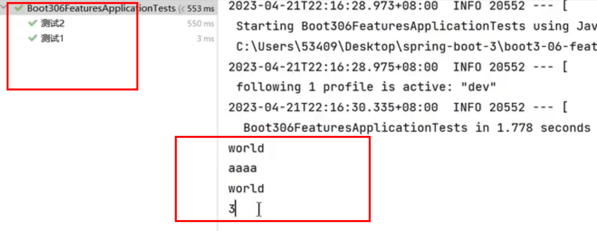

# 单元测试

springboot工程, 默认自动引入

```xml
<dependency>
    <groupId>org.springframework.boot</groupId>
    <artifactId>spring-boot-starter-test</artifactId>
    <scope>test</scope>
</dependency>
```

## 基本使用

 <font color = red>在spring测试中不要使用静态变量或者main方法！！尽量把方法定义成public方法</font>

```java
@RunWith(SpringRunner.class)
@SpringBootTest
public class TestServiceImplTest {
    @Autowired
    TestServiceImpl testServiceImpl;

    @DisplayName("测试1")
    @Test
    void contextLoads() {
        int sum = helloService.sum(1, 2);
        System.out.println(sum);
    }
    
    @DisplayName("测试2")
    @Test
    public void test01(){
    	System.out.println("aaaa");
    }

    @BeforeAll //所有测试方法运行之前先运行这个;  只打印一次
    static void initALl() {
    	Syste.out.println("hello");
    }
    
    @BeforeEach //每个测试方法运行之前先运行这个;  每个方法运行打印一次
    void init() {
    	System.out.println("world");
    }
}
```



## Assert.assertThat使用

| 方法              | 说明                                 |
| ----------------- | ------------------------------------ |
| assertEquals      | 判断两个对象或两个原始类型是否相等   |
| assertNotEquals   | 判断两个对象或两个原始类型是否不相等 |
| assertSame        | 判断两个对象引用是否指向同一个对象   |
| assertNotSame     | 判断两个对象引用是否指向不同的对象   |
| assertTrue        | 判断给定的布尔值是否为 true          |
| assertFalse       | 判断给定的布尔值是否为 false         |
| assertNull        | 判断给定的对象引用是否为 null        |
| assertNotNull     | 判断给定的对象引用是否不为 null      |
| assertArrayEquals | 数组断言                             |
| assertAll         | 组合断言                             |
| assertThrows      | 异常断言                             |
| assertTimeout     | 超时断言                             |
| fail              | 快速失败                             |

### 一般匹配符

```java
// allOf匹配符表明如果接下来的所有条件必须都成立测试才通过，相当于“与”（&&）
assertThat(testedNumber, allOf( greaterThan(8), lessThan(16)));

// anyOf匹配符表明如果接下来的所有条件只要有一个成立则测试通过，相当于“或”（||）
assertThat(testedNumber, anyOf(greaterThan(16), lessThan(8)));

// anything匹配符表明无论什么条件，永远为true
assertThat(testedNumber, anything());

// is匹配符表明如果前面待测的object等于后面给出的object，则测试通过
assertThat(testedString, is("developerWorks"));

// not匹配符和is匹配符正好相反，表明如果前面待测的object不等于后面给出的object，则测试通过
assertThat(testedString, not("developerWorks"));

// nullValue()匹配符断言被测object的值为null
assertThat(object, nullValue());

// notNullValue()匹配符断言被测object的值不为null
assertThat(object,notNullValue());

// 断言testedObject为Cheddar的实例
assertThat(testedObject, is(Cheddar.class));
```

###  字符串相关

```java
// containsString匹配符表明如果测试的字符串testedString包含子字符串"developerWorks"则测试通过
assertThat(testedString, containsString("developerWorks"));

// endsWith匹配符表明如果测试的字符串testedString以子字符串"developerWorks"结尾则测试通过
assertThat(testedString, endsWith("developerWorks")); 

// startsWith匹配符表明如果测试的字符串testedString以子字符串"developerWorks"开始则测试通过
assertThat(testedString, startsWith("developerWorks")); 

// equalTo匹配符表明如果测试的testedValue等于expectedValue则测试通过，equalTo可以测试数值之间，字
// 符串之间和对象之间是否相等，相当于Object的equals方法，与上面介绍的is方法一样
assertThat(testedValue, equalTo(expectedValue)); 

// equalToIgnoringCase匹配符表明如果测试的字符串testedString在忽略大小写的情况下等于"developerWorks"
// 则测试通过
assertThat(testedString, equalToIgnoringCase("developerWorks")); 

// equalToIgnoringWhiteSpace匹配符表明如果测试的字符串testedString在忽略头尾的任意个空格的情况下等
// 于"developerWorks"则测试通过，注意：字符串中的空格不能被忽略
assertThat( testedString, equalToIgnoringWhiteSpace( "developerWorks" ) );
```

###  数值相关

```java
// closeTo匹配符表明如果所测试的浮点型数testedDouble在20.0±0.5范围之内则测试通过
assertThat(testedDouble, closeTo(20.0, 0.5));

// reaterThan匹配符表明如果所测试的数值testedNumber大于16.0则测试通过
assertThat(testedNumber, greaterThan(16.0));

// lessThan匹配符表明如果所测试的数值testedNumber小于16.0则测试通过
assertThat(testedNumber, lessThan (16.0));

// greaterThanOrEqualTo匹配符表明如果所测试的数值testedNumber大于等于16.0则测试通过
assertThat(testedNumber, greaterThanOrEqualTo (16.0));

// lessThanOrEqualTo匹配符表明如果所测试的数值testedNumber小于等于16.0则测试通过
assertThat( testedNumber, lessThanOrEqualTo (16.0));
```

###  Collection相关

```java
// hasEntry匹配符表明如果测试的Map对象mapObject含有一个键值为"key"对应元素值为"value"的Entry项
// 则测试通过
assertThat( mapObject, hasEntry( "key", "value" ) );

// hasItem匹配符表明如果测试的迭代对象iterableObject含有元素“element”项则测试通过
assertThat(iterableObject, hasItem ("element"));

// hasKey匹配符表明如果测试的Map对象mapObject含有键值“key”则测试通过
assertThat(mapObject, hasKey ("key"));

// hasValue匹配符表明如果测试的Map对象mapObject含有元素值“value”则测试通过
assertThat(mapObject, hasValue ("key"));
```

## 使用@AutoWired遇到空指针

[Spring boot test测试中@Autowired不起作用_未名who的博客-CSDN博客](https://blog.csdn.net/qq_2300688967/article/details/80054766)

[Spring 单元测试时使用@AutoWired为空 解决方法_在test中使用autowired空指针异常_梦彧-Z的博客-CSDN博客](https://blog.csdn.net/weixin_45852395/article/details/121427862)

1，问题：如下所示：

```java
import org.junit.Test;
import org.junit.runner.RunWith;
import org.springframework.beans.factory.annotation.Autowired;
import org.springframework.boot.test.context.SpringBootTest;
import org.springframework.test.context.junit4.SpringRunner;
 
public class MoveSysUserTest {
    @Autowired
    private MoveSysUser moveSysUser;
 
    @Test
    public void testMoveSysUser() {
        boolean res = moveSysUser.moveSysUser();
        System.out.println(res);
    }
}
```

此时运行，会提示moveSysUser为空，报空指针异常

2，解决方法

方法1: 添加注解(或者继承一个添加了以上注解的类)：

```java
@RunWith(SpringRunner.class)
@SpringBootTest
```

```properties
	<!--如果只缺@RunWith这一项，只用导入junit.4.12这一个包就可以了-->
	<dependency>
      <groupId>junit</groupId>
      <artifactId>junit</artifactId>
      <version>4.12</version>
      <scope>compile</scope>
    </dependency>
```

方法2:   <font color = red>在spring测试中不要使用静态变量或者main方法！！</font>

