# 网络编程

## 1.1 概述

**计算机网络**：

计算机网络时将==地理位置不同==的具有独立功能的多台计算机及其外部设备，通过通信线路链接起来，再网络操作系统，网络管理软件及网络通信协议的管理和协调下，实现资源共享和信息传递的计算机系统。

**网络编程的目的**：

传播交流信息、数据交换、通信

**定位网络上的一台主机**

IP地址+端口，定位到这个计算机上的某个资源

网络通信协议

## 1.2 IP

- ip地址：InetAddress(java中的类)
- 唯一定位一台网络上的计算机
- 127.0.0.1：本机localhost
- ip地址分类
  - ipv4/ipv6
    - IPV4 127.0.0.1 4个字节
    - IPV6 2409:8928:458:58d0:816f:b9b0:4878:4649 8个字节
  - 公网（互联网）-私网（局域网）
    - ABCD类地址
    - 192.168.xx.xx，专门给组织内部内使用的
- 域名：ip别名

## 1.3 端口

端口表示计算机上的一个程序的进程

- 不同的进程有不同的端口号,  区分软件

- 被规定0~65535

- TCP/UDP 单个协议下端口号不能冲突

- 端口分类

  - 公有端口 0~1023
    - HTTP：80
    - HTTPS:443
    - FTP:21
    - Telent：23
  - 程序注册端口：1024-49151，分配给用户或者重新
    - Tomcat：8080
    - MySQL：3306
    - Oracle：1521
  - 动态、私有：49152~65535

  ```java
  public class Test {
      public static void main(String[] args) {
          try {
              InetAddress inetAddress1 = InetAddress.getByName("localhost");
              InetAddress localHost = InetAddress.getLocalHost();
              //Inet4Address Inet6Address继承了InetAddress
              InetAddress localHost1 = Inet4Address.getLocalHost();
              InetAddress localHost2 = Inet6Address.getLocalHost();
              
              InetSocketAddress inetSocketAddress = new InetSocketAddress("localhost",8080);
              String hostName = inetSocketAddress.getHostName();
              int port = inetSocketAddress.getPort();
              System.out.println(port);
              System.out.println(hostName);
              System.out.println(inetAddress1);
              System.out.println(localHost);
              System.out.println(localHost1);
              System.out.println(localHost2);
          } catch (UnknownHostException e) {
          }
      }
  }
  ```

  ## 1.4 通信协议

  协议：约定

  **网络通信协议**：速率，传输码率，代码结构，传输控制…

  TCP/IP协议簇

  - TCP：用户传输协议
  - UDP：用户数据报协议
  - IP：网络互连协议

  TCP/IP四层概念模型：应用层->传输层->网络层->数据链路层

  TCP: 打电话

  - 链接，稳定
  - 三次握手 四次挥手
  - 客户端、服务端
  - 传输完成，释放连接，效率低

  UDP: 发短信

  - 不连接，不稳定
  - 客户端、服务端：没有明确的界限
  - 不服按有没有准备好，都可以发给你

  ==实现TCP聊天==

  ```java
  //服务端
  package com.cskaoyan;
  import java.io.ByteArrayOutputStream;
  import java.io.IOException;
  import java.io.InputStream;
  import java.net.ServerSocket;
  import java.net.Socket;
  public class Server {
      public static void main(String[] args) {
          ServerSocket serverSocket = null;
          Socket socket = null;
          InputStream inputStream = null;
          ByteArrayOutputStream byteArrayOutputStream = null;
          try {
              //1.我得有一个地址
              serverSocket = new ServerSocket(9999);
              while(true) {
                  //2.等待客户端链接
                  socket = serverSocket.accept();
                  inputStream = socket.getInputStream();
                  byte[] bytes = new byte[1024];
                  //3.读取客户端的消息
                  byteArrayOutputStream = new ByteArrayOutputStream();
                  int len = 0;
                  while((len = inputStream.read(bytes)) != -1) {
                      byteArrayOutputStream.write(bytes, 0, len);
                  }
                  System.out.println(byteArrayOutputStream.toString());
              }
          } catch (IOException e) {
              e.printStackTrace();
          } finally {
              try {
                  byteArrayOutputStream.close();
                  inputStream.close();
                  socket.close();
                  serverSocket.close();
              } catch (IOException e) {
                  e.printStackTrace();
              }
          }
      }
  }
  //客户端
  package com.cskaoyan;
  import java.io.ByteArrayOutputStream;
  import java.io.IOException;
  import java.io.InputStream;
  import java.net.ServerSocket;
  import java.net.Socket;
  package com.cskaoyan;
  import java.io.IOException;
  import java.io.OutputStream;
  import java.net.InetAddress;
  import java.net.Socket;
  import java.util.Scanner;
  public class Client {
      public static void main(String[] args) {
          InetAddress inetAddress = null;
          Socket socket = null;
          OutputStream outputStream = null;
          //1.要知道服务器的地址，端口号
          while(true) {
              try {
                  inetAddress = InetAddress.getByName("127.0.0.1");
                  int port = 9999;
                  //2.创建一个socket链接
                  socket = new Socket(inetAddress, port);
                  //3.发送消息 IO流
                  outputStream = socket.getOutputStream();
                  Scanner sc = new Scanner(System.in);
                  outputStream.write(sc.nextLine().getBytes());
              } catch (Exception e) {
                  e.printStackTrace();
              }  finally {
                  try {
                      outputStream.close();
                      socket.close();
                  } catch (IOException e) {
                      e.printStackTrace();
                  }
              }
          }
      }
  }
  ```


### 络通信协议

通过计算机网络可以使多台计算机实现连接，位于同一个网络中的计算机在进行连接和通信时需要遵守一定的规则，这就好比在道路中行驶的汽车一定要遵守交通规则一样。在计算机网络中，这些连接和通信的规则被称为网络通信协议，它对数据的传输格式、传输速率、传输步骤等做了统一规定，通信双方必须同时遵守才能完成数据交换。

网络通信协议有很多种，目前应用最广泛的是TCP/IP协议(Transmission Control Protocal/Internet Protoal传输控制协议/英特网互联协议)，它是一个包括TCP协议和IP协议，UDP（User Datagram Protocol）协议和其它一些协议的协议组，在学习具体协议之前首先了解一下TCP/IP协议组的层次结构。

在进行数据传输时，要求发送的数据与收到的数据完全一样，这时，就需要在原有的数据上添加很多信息，以保证数据在传输过程中数据格式完全一致。TCP/IP协议的层次结构比较简单，共分为四层，如图所示。

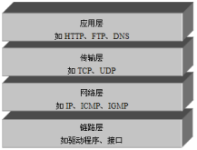

上图中，TCP/IP协议中的四层分别是应用层、传输层、网络层和链路层，每层分别负责不同的通信功能，接下来针对这四层进行详细地讲解。

- 链路层：链路层是用于定义物理传输通道，通常是对某些网络连接设备的驱动协议，例如针对光纤、网线提供的驱动。
- 网络层：网络层是整个TCP/IP协议的核心，它主要用于将传输的数据进行分组，将分组数据发送到目标计算机或者网络。
- 传输层：主要使网络程序进行通信，在进行网络通信时，可以采用TCP协议，也可以采用UDP协议。
- 应用层：主要负责应用程序的协议，例如HTTP协议、FTP协议等。

### IP地址和端口号

要想使网络中的计算机能够进行通信，必须为每台计算机指定一个标识号，通过这个标识号来指定接受数据的计算机或者发送数据的计算机。

在TCP/IP协议中，这个标识号就是IP地址，它可以唯一标识一台计算机，目前，IP地址广泛使用的版本是IPv4，它是由4个字节大小的二进制数来表示，如：00001010000000000000000000000001。由于二进制形式表示的IP地址非常不便记忆和处理，因此通常会将IP地址写成十进制的形式，每个字节用一个十进制数字(0-255)表示，数字间用符号“.”分开，如 “192.168.1.100”。

随着计算机网络规模的不断扩大，对IP地址的需求也越来越多，IPV4这种用4个字节表示的IP地址面临枯竭，因此IPv6 便应运而生了，IPv6使用16个字节表示IP地址，它所拥有的地址容量约是IPv4的8×1028倍，达到2128个（算上全零的），这样就解决了网络地址资源数量不够的问题。

通过IP地址可以连接到指定计算机，但如果想访问目标计算机中的某个应用程序，还需要指定端口号。在计算机中，不同的应用程序是通过端口号区分的。端口号是用两个字节（16位的二进制数）表示的，它的取值范围是0~65535，其中，0~1023之间的端口号用于一些知名的网络服务和应用，用户的普通应用程序需要使用1024以上的端口号，从而避免端口号被另外一个应用或服务所占用。

接下来通过一个图例来描述IP地址和端口号的作用，如下图所示。

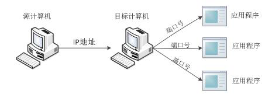

从上图中可以清楚地看到，位于网络中一台计算机可以通过IP地址去访问另一台计算机，并通过端口号访问目标计算机中的某个应用程序。

### InetAddress

了解了IP地址的作用，我们看学习下JDK中提供了一个InetAdderss类，该类用于封装一个IP地址，并提供了一系列与IP地址相关的方法，下表中列出了InetAddress类的一些常用方法。

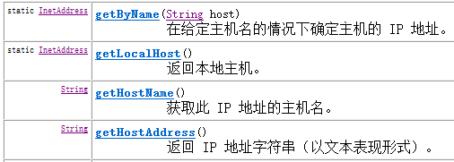

上图中，列举了InetAddress的四个常用方法。其中，前两个方法用于获得该类的实例对象，第一个方法用于获得表示指定主机的InetAddress对象，第二个方法用于获得表示本地的InetAddress对象。通过InetAddress对象便可获取指定主机名，IP地址等，接下来通过一个案例来演示InetAddress的常用方法，如下所示。

[](javascript:void(0);)

```
package net;

import java.net.InetAddress;
public class Demo1 {
    public static void main(String[] args) throws Exception {
        InetAddress local = InetAddress.getLocalHost();
        InetAddress remote = InetAddress.getByName("www.baidu.cn");
        System.out.println("本机的IP地址：" + local.getHostAddress());
        System.out.println("baidu的IP地址：" + remote.getHostAddress());
        System.out.println("baidu的主机名为：" + remote.getHostName());
    }
}

//本机的IP地址：192.168.1.67
//baidu的IP地址：220.181.111.188
//baidu的主机名为：www.baidu.cn
```

[](javascript:void(0);)

### UDP与TCP协议

在介绍TCP/IP结构时，提到传输层的两个重要的高级协议，分别是UDP和TCP，其中UDP是User Datagram Protocol的简称，称为用户数据报协议，TCP是Transmission Control Protocol的简称，称为传输控制协议。

**UDP协议**

UDP是无连接通信协议，即在数据传输时，数据的发送端和接收端不建立逻辑连接。简单来说，当一台计算机向另外一台计算机发送数据时，发送端不会确认接收端是否存在，就会发出数据，同样接收端在收到数据时，也不会向发送端反馈是否收到数据。

由于使用UDP协议消耗资源小，通信效率高，所以通常都会用于音频、视频和普通数据的传输例如视频会议都使用UDP协议，因为这种情况即使偶尔丢失一两个数据包，也不会对接收结果产生太大影响。

但是在使用UDP协议传送数据时，由于UDP的面向无连接性，不能保证数据的完整性，因此在传输重要数据时不建议使用UDP协议。UDP的交换过程如下图所示。

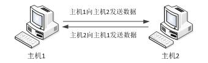

**TCP协议**

TCP协议是面向连接的通信协议，即在传输数据前先在发送端和接收端建立逻辑连接，然后再传输数据，它提供了两台计算机之间可靠无差错的数据传输。在TCP连接中必须要明确客户端与服务器端，由客户端向服务端发出连接请求，每次连接的创建都需要经过“三次握手”。第一次握手，客户端向服务器端发出连接请求，等待服务器确认，第二次握手，服务器端向客户端回送一个响应，通知客户端收到了连接请求，第三次握手，客户端再次向服务器端发送确认信息，确认连接。整个交互过程如下图所示。

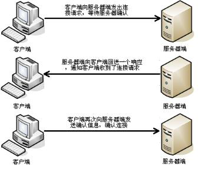

由于TCP协议的面向连接特性，它可以保证传输数据的安全性，所以是一个被广泛采用的协议，例如在下载文件时，如果数据接收不完整，将会导致文件数据丢失而不能被打开，因此，下载文件时必须采用TCP协议。

## UDP通信

### DatagramPacket

前面介绍了UDP是一种面向无连接的协议，因此，在通信时发送端和接收端不用建立连接。UDP通信的过程就像是货运公司在两个码头间发送货物一样。在码头发送和接收货物时都需要使用集装箱来装载货物，UDP通信也是一样，发送和接收的数据也需要使用“集装箱”进行打包，为此JDK中提供了一个DatagramPacket类，该类的实例对象就相当于一个集装箱，用于封装UDP通信中发送或者接收的数据。

想要创建一个DatagramPacket对象，首先需要了解一下它的构造方法。在创建发送端和接收端的DatagramPacket对象时，使用的构造方法有所不同，接收端的构造方法只需要接收一个字节数组来存放接收到的数据，而发送端的构造方法不但要接收存放了发送数据的字节数组，还需要指定发送端IP地址和端口号。

接下来根据API文档的内容，对DatagramPacket的构造方法进行逐一详细地讲解。


使用该构造方法在创建DatagramPacket对象时，指定了封装数据的字节数组和数据的大小，没有指定IP地址和端口号。很明显，这样的对象只能用于接收端，不能用于发送端。因为发送端一定要明确指出数据的目的地(ip地址和端口号)，而接收端不需要明确知道数据的来源，只需要接收到数据即可。

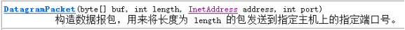

使用该构造方法在创建DatagramPacket对象时，不仅指定了封装数据的字节数组和数据的大小，还指定了数据包的目标IP地址（addr）和端口号（port）。该对象通常用于发送端，因为在发送数据时必须指定接收端的IP地址和端口号，就好像发送货物的集装箱上面必须标明接收人的地址一样。

上面我们讲解了DatagramPacket的构造方法，接下来对DatagramPacket类中的常用方法进行详细地讲解，如下表所示。

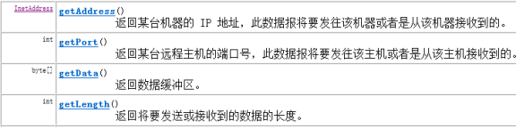

### DatagramSocket

DatagramPacket数据包的作用就如同是“集装箱”，可以将发送端或者接收端的数据封装起来。然而运输货物只有“集装箱”是不够的，还需要有码头。在程序中需要实现通信只有DatagramPacket数据包也同样不行，为此JDK中提供的一个DatagramSocket类。DatagramSocket类的作用就类似于码头，使用这个类的实例对象就可以发送和接收DatagramPacket数据包，发送数据的过程如下图所示。

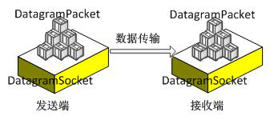

在创建发送端和接收端的DatagramSocket对象时，使用的构造方法也有所不同，下面对DatagramSocket类中常用的构造方法进行讲解。

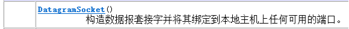

该构造方法用于创建发送端的DatagramSocket对象，在创建DatagramSocket对象时，并没有指定端口号，此时，系统会分配一个没有被其它网络程序所使用的端口号。

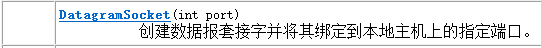

该构造方法既可用于创建接收端的DatagramSocket对象，又可以创建发送端的DatagramSocket对象，在创建接收端的DatagramSocket对象时，必须要指定一个端口号，这样就可以监听指定的端口。

上面我们讲解了DatagramSocket的构造方法，接下来对DatagramSocket类中的常用方法进行详细地讲解。

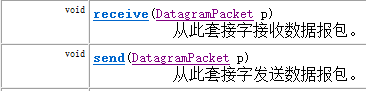

### UDP网络程序

讲解了DatagramPacket和DatagramSocket的作用，接下来通过一个案例来学习一下它们在程序中的具体用法。

下图为UDP发送端与接收端交互图解

 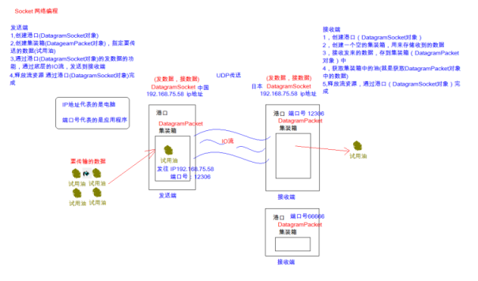

要实现UDP通信需要创建一个发送端程序和一个接收端程序，很明显，在通信时只有接收端程序先运行，才能避免因发送端发送的数据无法接收，而造成数据丢失。因此，首先需要来完成接收端程序的编写。

UDP完成数据的发送：

[](javascript:void(0);)

```
package net;

/*
* 发送端
* 1,创建DatagramSocket对象
* 2，创建DatagramPacket对象，并封装数据
* 3，发送数据
* 4，释放流资源
*/

import java.io.IOException;
import java.net.DatagramPacket;
import java.net.DatagramSocket;
import java.net.InetAddress;

public class UDPSend {
    public static void main(String[] args) throws IOException {
//1,创建DatagramSocket对象
        DatagramSocket sendSocket = new DatagramSocket();
//2，创建DatagramPacket对象，并封装数据
//public DatagramPacket(byte[] buf, int length, InetAddress address, int port)
//构造数据报包，用来将长度为 length 的包发送到指定主机上的指定端口号。
        byte[] buffer = "hello,UDP".getBytes();
        DatagramPacket dp = new DatagramPacket(buffer, buffer.length, InetAddress.getByName("192.168.1.67"), 12306);
//3，发送数据
//public void send(DatagramPacket p) 从此套接字发送数据报包
        sendSocket.send(dp);
//4，释放流资源
        sendSocket.close();
    }
}
```

[](javascript:void(0);)

UDP完成数据的接收：

[](javascript:void(0);)

```
package net;
/*
* UDP接收端
*
* 1,创建DatagramSocket对象
* 2,创建DatagramPacket对象
* 3,接收数据存储到DatagramPacket对象中
* 4,获取DatagramPacket对象的内容
* 5,释放流资源
*/

import java.io.IOException;
import java.net.DatagramPacket;
import java.net.DatagramSocket;
import java.net.InetAddress;

public class UDPReceive {
    public static void main(String[] args) throws IOException {
//1,创建DatagramSocket对象,并指定端口号
        DatagramSocket receiveSocket = new DatagramSocket(12306);
//2,创建DatagramPacket对象, 创建一个空的仓库
        byte[] buffer = new byte[1024];
        DatagramPacket dp = new DatagramPacket(buffer, 1024);
//3,接收数据存储到DatagramPacket对象中
        receiveSocket.receive(dp);
//4,获取DatagramPacket对象的内容
//谁发来的数据 getAddress()
        InetAddress ipAddress = dp.getAddress();
        String ip = ipAddress.getHostAddress();//获取到了IP地址
//发来了什么数据 getData()
        byte[] data = dp.getData();
//发来了多少数据 getLenth()
        int length = dp.getLength();
//显示收到的数据
        String dataStr = new String(data,0,length);
        System.out.println("IP地址："+ip+ "数据是"+ dataStr);
//5,释放流资源
        receiveSocket.close();
    }
}
```

[](javascript:void(0);)

## TCP通信

TCP通信同UDP通信一样，都能实现两台计算机之间的通信，通信的两端都需要创建socket对象。

区别在于，UDP中只有发送端和接收端，不区分客户端与服务器端，计算机之间可以任意地发送数据。而TCP通信是严格区分客户端与服务器端的，在通信时，必须先由客户端去连接服务器端才能实现通信，服务器端不可以主动连接客户端，并且服务器端程序需要事先启动，等待客户端的连接。

在JDK中提供了两个类用于实现TCP程序，一个是ServerSocket类，用于表示服务器端，一个是Socket类，用于表示客户端。

通信时，首先创建代表服务器端的ServerSocket对象，该对象相当于开启一个服务，并等待客户端的连接，然后创建代表客户端的Socket对象向服务器端发出连接请求，服务器端响应请求，两者建立连接开始通信。

### ServerSocket

通过前面的学习知道，在开发TCP程序时，首先需要创建服务器端程序。JDK的java.net包中提供了一个ServerSocket类，该类的实例对象可以实现一个服务器段的程序。通过查阅API文档可知，ServerSocket类提供了多种构造方法，接下来就对ServerSocket的构造方法进行逐一地讲解。

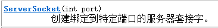

使用该构造方法在创建ServerSocket对象时，就可以将其绑定到一个指定的端口号上（参数port就是端口号）。

接下来学习一下ServerSocket的常用方法，如表所示。

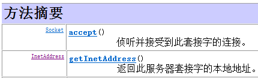

ServerSocket对象负责监听某台计算机的某个端口号，在创建ServerSocket对象后，需要继续调用该对象的accept()方法，接收来自客户端的请求。当执行了accept()方法之后，服务器端程序会发生阻塞，直到客户端发出连接请求，accept()方法才会返回一个Scoket对象用于和客户端实现通信，程序才能继续向下执行。

### Socket

讲解了ServerSocket对象可以实现服务端程序，但只实现服务器端程序还不能完成通信，此时还需要一个客户端程序与之交互，为此JDK提供了一个Socket类，用于实现TCP客户端程序。

通过查阅API文档可知Socket类同样提供了多种构造方法，接下来就对Socket的常用构造方法进行详细讲解。


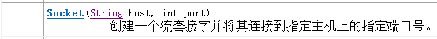

使用该构造方法在创建Socket对象时，会根据参数去连接在指定地址和端口上运行的服务器程序，其中参数host接收的是一个字符串类型的IP地址。

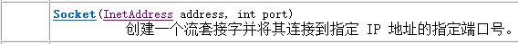

该方法在使用上与第二个构造方法类似，参数address用于接收一个InetAddress类型的对象，该对象用于封装一个IP地址。

在以上Socket的构造方法中，最常用的是第一个构造方法。

接下来学习一下Socket的常用方法，如表所示。

| 方法声明                       | 功能描述                                                     |
| ------------------------------ | ------------------------------------------------------------ |
| int getPort()                  | 该方法返回一个int类型对象，该对象是Socket对象与服务器端连接的端口号 |
| InetAddress getLocalAddress()  | 该方法用于获取Socket对象绑定的本地IP地址，并将IP地址封装成InetAddress类型的对象返回 |
| void close()                   | 该方法用于关闭Socket连接，结束本次通信。在关闭socket之前，应将与socket相关的所有的输入/输出流全部关闭，这是因为一个良好的程序应该在执行完毕时释放所有的资源 |
| InputStream getInputStream()   | 该方法返回一个InputStream类型的输入流对象，如果该对象是由服务器端的Socket返回，就用于读取客户端发送的数据，反之，用于读取服务器端发送的数据 |
| OutputStream getOutputStream() | 该方法返回一个OutputStream类型的输出流对象，如果该对象是由服务器端的Socket返回，就用于向客户端发送数据，反之，用于向服务器端发送数据 |

在Socket类的常用方法中，getInputStream()和getOutStream()方法分别用于获取输入流和输出流。当客户端和服务端建立连接后，数据是以IO流的形式进行交互的，从而实现通信。

接下来通过一张图来描述服务器端和客户端的数据传输，如下图所示。

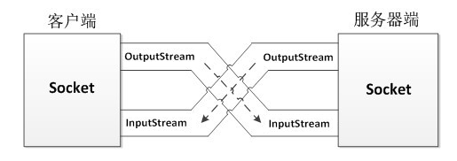

### 简单的TCP网络程序

了解了ServerSocket、Socket类的基本用法，为了让大家更好地掌握这两个类的使用，接下来通过一个TCP通信的案例来进一步学习。如下图所示。

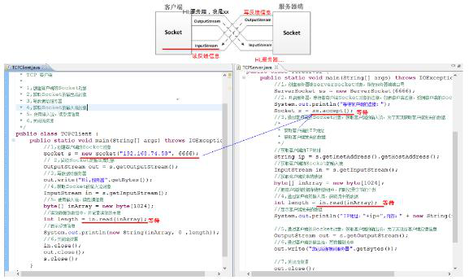

要实现TCP通信需要创建一个服务器端程序和一个客户端程序，为了保证数据传输的安全性，首先需要实现服务器端程序。

[](javascript:void(0);)

```
package net;

/*
* TCP 服务器端
*
* 1,创建服务器ServerSocket对象（指定服务器端口号）
* 2，开启服务器了，等待客户端的连接，当客户端连接后，可以获取到连接服务器的客户端Socket对象
* 3,给客户端反馈信息
* 4,关闭流资源
*/

import java.io.IOException;
import java.io.OutputStream;
import java.net.ServerSocket;
import java.net.Socket;

public class TCPServer {
    public static void main(String[] args) throws IOException {
//1,创建服务器ServerSocket对象（指定服务器端口号）
        ServerSocket ss = new ServerSocket(8888);
//2，开启服务器了，等待客户端的连接，当客户端连接后，可以获取到连接服务器的客户端Socket对象
        Socket s = ss.accept();
//3,给客户端反馈信息
/*
* a,获取客户端的输出流
* b,在服务端端，通过客户端的输出流写数据给客户端
*/
//a,获取客户端的输出流
        OutputStream out = s.getOutputStream();
//b,在服务端端，通过客户端的输出流写数据给客户端
        out.write("你已经连接上了服务器".getBytes());
//4,关闭流资源
        out.close();
        s.close();
//ss.close(); 服务器流 通常都是不关闭的
    }
}
```

[](javascript:void(0);)

完成了服务器端程序的编写，接下来编写客户端程序。

[](javascript:void(0);)

```
package net;

/*
* TCP 客户端
*
* 1，创建客户端Socket对象,（指定要连接的服务器地址与端口号）
* 2,获取服务器端的反馈回来的信息
* 3,关闭流资源
*/

import java.io.IOException;
import java.io.InputStream;
import java.net.Socket;

public class TCPClient {
    public static void main(String[] args) throws IOException {
//1，创建客户端Socket对象,（指定要连接的服务器地址与端口号）
        Socket s = new Socket("192.168.1.67", 8888);
//2,获取服务器端的反馈回来的信息
        InputStream in = s.getInputStream();
//获取获取流中的数据
        byte[] buffer = new byte[1024];
//把流中的数据存储到数组中，并记录读取字节的个数
        int length = in.read(buffer);
//显示数据
        System.out.println( new String(buffer, 0 , length) );
//3,关闭流资源
        in.close();
        s.close();
    }
}
```

[](javascript:void(0);)

### 文件上传案例

目前大多数服务器都会提供文件上传的功能，由于文件上传需要数据的安全性和完整性，很明显需要使用TCP协议来实现。接下来通过一个案例来实现图片上传的功能。如下图所示。

 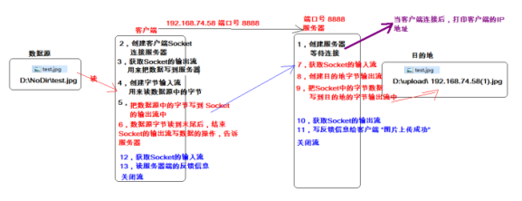

首先编写服务器端程序，用来接收图片。

[](javascript:void(0);)

```
package net;

import java.io.*;
import java.net.InetAddress;
import java.net.ServerSocket;
import java.net.Socket;

/*
* 文件上传 服务器端
*
*/
public class TCPUploadServer {
    public static void main(String[] args) throws IOException {
//1,创建服务器，等待客户端连接
        ServerSocket serverSocket = new ServerSocket(8888);
        Socket clientSocket = serverSocket.accept();
//显示哪个客户端Socket连接上了服务器
        InetAddress ipObject = clientSocket.getInetAddress();//得到IP地址对象
        String ip = ipObject.getHostAddress(); //得到IP地址字符串
        System.out.println("小样，抓到你了，连接我！！" + "IP:" + ip);
//7,获取Socket的输入流
        InputStream in = clientSocket.getInputStream();
//8,创建目的地的字节输出流 D:\\upload\\192.168.74.58(1).jpg
        BufferedOutputStream fileOut = new BufferedOutputStream(new FileOutputStream("download1.png"));
//9,把Socket输入流中的数据，写入目的地的字节输出流中
        byte[] buffer = new byte[1024];
        int len = -1;
        while ((len = in.read(buffer)) != -1) {
//写入目的地的字节输出流中
            fileOut.write(buffer, 0, len);
        }

//-----------------反馈信息---------------------
//10,获取Socket的输出流, 作用：写反馈信息给客户端
        OutputStream out = clientSocket.getOutputStream();
//11,写反馈信息给客户端
        out.write("图片上传成功".getBytes());
        out.close();
        fileOut.close();
        in.close();
        clientSocket.close();
//serverSocket.close();
    }
}
```

[](javascript:void(0);)

编写客户端，完成上传图片

[](javascript:void(0);)

```
package net;
import java.io.*;
import java.net.Socket;
/*
* 文件上传 客户端
*
* public void shutdownOutput() 禁用此Socket的输出流,间接的相当于告知了服务器数据写入完毕
*/
public class TCPUploadClient {
    public static void main(String[] args) throws IOException {
//2,创建客户端Socket，连接服务器
        Socket socket = new Socket("192.168.1.67", 8888);
//3,获取Socket流中的输出流，功能：用来把数据写到服务器
        OutputStream out = socket.getOutputStream();
//4,创建字节输入流，功能：用来读取数据源(图片)的字节
        BufferedInputStream fileIn = new BufferedInputStream(new FileInputStream("dowload.png"));
//5,把图片数据写到Socket的输出流中(把数据传给服务器)
        byte[] buffer = new byte[1024];
        int len = -1;
        while ((len = fileIn.read(buffer)) != -1){
//把数据写到Socket的输出流中
            out.write(buffer, 0, len);
        }
//6,客户端发送数据完毕，结束Socket输出流的写入操作，告知服务器端
        socket.shutdownOutput();
//-----------------反馈信息---------------------
//12,获取Socket的输入流 作用： 读反馈信息
        InputStream in = socket.getInputStream();
//13,读反馈信息
        byte[] info = new byte[1024];
//把反馈信息存储到info数组中，并记录字节个数
        int length = in.read(info);
//显示反馈结果
        System.out.println( new String(info, 0, length) );
//关闭流
        in.close();
        fileIn.close();
        out.close();
        socket.close();
    }
}
```

[](javascript:void(0);)

### 文件上传案例多线程版本

实现服务器端可以同时接收多个客户端上传的文件。

我们要修改服务器端代码

[](javascript:void(0);)

```
package net;

import java.io.*;
import java.net.InetAddress;
import java.net.ServerSocket;
import java.net.Socket;

/*
* 文件上传多线程版本, 服务器端
*/

public class TCPUploadServer {
    public static void main(String[] args) throws IOException {
//1,创建服务器，等待客户端连接
        ServerSocket serverSocket = new ServerSocket(8888);
//实现多个客户端连接服务器的操作
        while (true) {
            final Socket clientSocket = serverSocket.accept();
//启动线程，完成与当前客户端的数据交互过程
            new Thread() {
                public void run() {
                    try {
//显示哪个客户端Socket连接上了服务器
                        InetAddress ipObject = clientSocket.getInetAddress();//得到IP地址对象
                        String ip = ipObject.getHostAddress(); //得到IP地址字符串
                        System.out.println("小样，抓到你了，连接我！！" + "IP:" + ip);
//7,获取Socket的输入流
                        InputStream in = clientSocket.getInputStream();
//8,创建目的地的字节输出流 D:\\upload\\192.168.74.58(1).jpg
                        BufferedOutputStream fileOut = new BufferedOutputStream(new FileOutputStream(System.currentTimeMillis() + ".png"));
//9,把Socket输入流中的数据，写入目的地的字节输出流中
                        byte[] buffer = new byte[1024];
                        int len = -1;
                        while ((len = in.read(buffer)) != -1) {
//写入目的地的字节输出流中
                            fileOut.write(buffer, 0, len);
                        }

//-----------------反馈信息---------------------
//10,获取Socket的输出流, 作用：写反馈信息给客户端
                        OutputStream out = clientSocket.getOutputStream();
//11,写反馈信息给客户端
                        out.write("图片上传成功".getBytes());
                        out.close();
                        fileOut.close();
                        in.close();
                        clientSocket.close();
                    } catch (IOException e) {
                        e.printStackTrace();
                    }
                }
                ;
            }.start();
        }
//serverSocket.close();
    }
}
```

[](javascript:void(0);)

### 知识点总结

- IP地址：用来唯一表示我们自己的电脑的，是一个网络标示
- 端口号： 用来区别当前电脑中的应用程序的
- UDP: 传送速度快，但是容易丢数据，如视频聊天，语音聊天
- TCP: 传送稳定，不会丢失数据，如文件的上传、下载

UDP程序交互的流程

发送端

- 1,创建DatagramSocket对象
- 2，创建DatagramPacket对象，并封装数据
- 3，发送数据
- 4，释放流资源

接收端

- 1,创建DatagramSocket对象
- 2,创建DatagramPacket对象
- 3,接收数据存储到DatagramPacket对象中
- 4,获取DatagramPacket对象的内容
- 5,释放流资源

TCP程序交互的流程

客户端

- 1,创建客户端的Socket对象
- 2,获取Socket的输出流对象
- 3,写数据给服务器
- 4,获取Socket的输入流对象
- 5，使用输入流，读反馈信息
- 6,关闭流资源

服务器端

- 1，创建服务器端ServerSocket对象，指定服务器端端口号
- 2，开启服务器，等待着客户端Socket对象的连接，如有客户端连接，返回客户端的Socket对象
- 3,通过客户端的Socket对象，获取客户端的输入流，为了实现获取客户端发来的数据
- 4,通过客户端的输入流，获取流中的数据
- 5,通过客户端的Socket对象，获取客户端的输出流，为了实现给客户端反馈信息
- 6,通过客户端的输出流，写数据到流中
- 7,关闭流资源