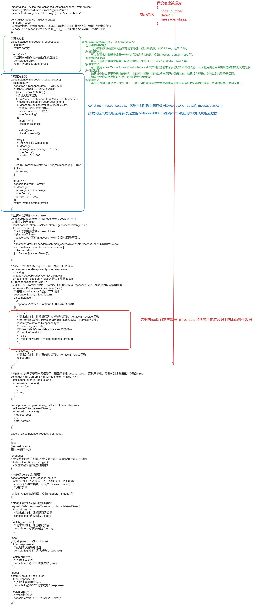

# 总结

+ async  —> 直接定义promise

+ await —>   等待方法(一般也是promise)执行完 返回结果 这时候只用接收 就好了

+ .then —>  也是等待方法执行完 只是 await 返回的直接是成功数据(错误数据用catch捕获)  .then返回的是个方法 方法里面带有 数据

# async函数返回resolve和reject

在 `async` 函数中，不需要显式地调用 `resolve` 或 `reject`，因为 `async` 函数会自动处理它们。

**返回 “解决” 和 “拒绝” 的值的方法：**

1. **解决 (resolve)**:

   - 在 `async` 函数中直接返回一个值，这会自动将该值包装为一个解决的 `Promise`。

   ```javascript
   async function resolveExample() {
       return "Resolved value";  // 这等价于 Promise.resolve("Resolved value")
   }
   ```

2. **拒绝 (reject)**:

   - 在 `async` 函数中抛出一个错误，这会自动将该错误包装为一个拒绝的 `Promise`。

   ```javascript
   async function rejectExample() {
       throw new Error("Rejected value");  
       //一、 等价于 Promise.reject(new Error("Rejected value")) 
       //二、 try...catch中catch (error) { throw error;)
   }
   ```

**使用这些函数：**

```js
resolveExample()
    .then(value => {
        console.log(value);  // 输出: "Resolved value"
    });

rejectExample()
    .catch(error => {
        console.log(error.message);  // 输出: "Rejected value"
    });
```

# 使用`try...catch...finally`

> await抛出异常或者返回状态变为“rejected”后，await下面的代码不会继续执行了

1. **分开处理错误：** 如果你想针对不同的 `await` 语句执行不同的错误处理逻辑，可以将每个 `await` 语句放在单独的 `try...catch` 块中。

```js
try {
  const result1 = await asyncFunction1();    // 
  // 处理 result1
} catch (error) {
  // 处理 asyncFunction1 的错误
}


try {
  const result2 = await asyncFunction2();
  // 如果还行继续抛
  return //等价  return Promise.resolve(); 

  // 处理 result2
} catch (error) {
  // 处理 asyncFunction2 的错误
    
  //如果还行继续抛  
  throw error; // 等价return Promise.reject(error) 
  
}
```

1. **统一处理错误：** 如果你想统一处理所有 `await` 语句可能抛出的错误，可以在整个 `try` 块中执行统一的错误处理逻辑。

```js
try {
  const result1 = await asyncFunction1();
  const result2 = await asyncFunction2();
  // 继续处理其他结果
} catch (error) {
  // 统一处理所有错误
}
```

**例子**

```js
const confirm = async (e) => {
    const eTarget = e.currentTarget;
    try {
      await basicFormRef.value.submitForm();
      showDisabled(eTarget);
      if (title.value === '新增') {
        await createCallback(formData);
      } else if (title.value === '修改') {
        await updateCallback(formData);
      }
      ElMessage.success(`${message[title.value]}`);
      close();
      emit('searchData');
    } catch (error) {
      console.error(error);
    } finally {
      hiddenDisabled(eTarget);
    }
    console.log('我仍然可以执行');
};

```

# 应用: 封装 axios.ts



```ts
import axios, { AxiosRequestConfig, AxiosResponse } from "axios";
import { getAccessToken } from "/@/utils/auth";
import { ElMessageBox, ElMessage } from "element-plus";

const axiosInstance = axios.create({
  timeout: 10000,
  // axios中请求配置有baseURL选项,表示请求URL公共部分,每个请求将会带该部分
  // baseURL: import.meta.env.VITE_API_URL,//配置了跨域这里不用写会冲突
});

// 请求拦截
axiosInstance.interceptors.request.use(
  (config) => {
    return config;
  },
  (error) => {
    // 当请求失败时做一些处理 抛出错误
    console.log(error);
    return Promise.reject(error);
  }
);

// 响应拦截器
axiosInstance.interceptors.response.use(
  (response) => {
    const res = response.data;   // 响应数据
    // 确保前端得到的res都是成功响应
    if (res.code !== 200000) {
      // 凭证无效或过期
      if (res.code === 400007 || res.code === 4000010) {
        // useStore.dispatch('user/resetToken')
        ElMessageBox.confirm("登录信息已过期", {
          confirmButtonText: "确定",
          cancelButtonText: "取消",
          type: "warning",
        })
          .then(() => {
            location.reload();
          })
          .catch(() => {
            location.reload();
          });
      } else {
        // 其他, 返回失败message
        ElMessage({
          message: res.message || "Error",
          type: "error",
          duration: 5 * 1000,
        });
      }
      return Promise.reject(new Error(res.message || "Error"));
    } else {
      return res;
    }
  },
  (error) => {
    console.log("err" + error);
    ElMessage({
      message: error.message,
      type: "error",
      duration: 5 * 1000,
    });
    return Promise.reject(error);
  }
);

// 给请求头添加 access_token
const setHeaderToken = (isNeedToken: boolean) => {
  // 请求头携带token
  const accessToken = isNeedToken ? getAccessToken() : null;
  if (isNeedToken) {
    // api 请求需要携带 access_token
    if (!accessToken) {
      console.log("不存在 access_token 则跳转回登录页");
    }
    // instance.defaults.headers.common['accessToken'] 中的accessToken叫啥由后端决定
    axiosInstance.defaults.headers.common[
      "Authorization"
    ] = `Bearer ${accessToken}`;
  }
};

// 定义一个泛型函数 request，用于发送 HTTP 请求
const request = <ResponseType = unknown>(
  url: string,
  options?: AxiosRequestConfig<unknown>,
  isNeedToken: boolean = false // 默认不需要 token
): Promise<ResponseType> => {
  // 返回一个 Promise 对象，Promise 的泛型参数是 ResponseType，即期望的响应数据类型
  return new Promise((resolve, reject) => {
    // 使用 axiosInstance 发送 HTTP 请求
    setHeaderToken(isNeedToken);
    axiosInstance({
      url,
      ...options, // 将传入的 options 合并到请求配置中
    })
      .then(
        res => {
        // 请求成功时，将解析后的响应数据传递给 Promise 的 resolve 函数
        //这里的res得到响应数据  而res.data得到的是响应数据中的data属性数据
        resolve(res.data as ResponseType);
        //console.log(res.data);
        // if (res.data && res.data.code === 200000) {
        //   resolve(res.data);
        // } else {
        //   reject(new Error('Invalid response format'));
        // }

      })
      .catch((err) => {
        // 请求失败时，将错误信息传递给 Promise 的 reject 函数
        reject(err);
      });
  });
};

// 有些 api 并不需要用户授权使用，则无需携带 access_token；默认不携带，需要传则设置第三个参数为 true
const get = (url, params = {}, isNeedToken = false) => {
  setHeaderToken(isNeedToken);
  return axiosInstance({
    method: "get",
    url,
    params,
  });
};

const post = (url, params = {}, isNeedToken = false) => {
  setHeaderToken(isNeedToken);
  return axiosInstance({
    method: "post",
    url,
    data: params,
  });
};

export { axiosInstance, request, get, post };

/*
注: 上述封装抛出的是响应数据中的data属性

使用
①axiosInstance
和axios使用一致

②request
// 定义数据响应的类型, 不定义则自动匹配,就没有自动补全提示
interface DataResponseType {
  // 在这里定义响应数据的结构
}

// 可选的 Axios 请求配置
const options: AxiosRequestConfig = {
  method: "GET", // 请求方法，例如 GET、POST 等
  params: { // 请求参数，可以是 params、data 等
    // 具体参数
  },
  // 其他 Axios 请求配置，例如 headers、timeout 等
};

// 发送请求并指定响应数据的类型
request<DataResponseType>(url, options, isNeedToken)
  .then((data) => {
    // 请求成功时，处理返回的数据
    console.log("响应数据:", data);
  })
  .catch((error) => {
    // 请求失败时，处理错误信息
    console.error("请求失败:", error);
  });

③get
get(url, params, isNeedToken)
  .then(response => {
    // 处理请求成功的响应
    console.log('GET 请求成功:', response);
  })
  .catch(error => {
    // 处理请求失败
    console.error('GET 请求失败:', error);
  });

④post
post(url, data, isNeedToken)
  .then(response => {
    // 处理请求成功的响应
    console.log('POST 请求成功:', response);
  })
  .catch(error => {
    // 处理请求失败
    console.error('POST 请求失败:', error);
  });
*/

```

# **封装  axios 超时重试，异常重试**

安装 [axios](https://so.csdn.net/so/search?q=axios&spm=1001.2101.3001.7020)-retry

- 网络异常请求重试处理
- 断网 弱网
- validateStatus 与 retryCondition 包含关系

### 安装 axios-retry

```coffeescript
 
const whiteRetry = new Set(['ECONNABORTED', undefined]);
 
axiosRetry(instance, {
    retries: 2, // 重复请求次数
    shouldResetTimeout: true, //  重置超时时间
    retryDelay: (retryCount) => {
        return retryCount * 10000; // 重复请求延迟，每次请求之间间隔10s
    },
    retryCondition: (err) => {
        // true为打开自动发送请求，false为关闭自动发送请求
        const {code, message} = err;
        return whiteRetry.has(<string>code) || message.includes('timeout'); // code 200 -500  范围之外的才走重试流程
    },
});
复制代码
```

### validateStatus 与 retryCondition 包含关系

> #### ❗❗❗ code `200 - 500` `范围之外的才走重试流程`

```cobol
const instance = axios.create({
    baseURL,
    timeout: 5 * 1000,
    headers: {
        'Content-Type': 'application/json;charset=utf-8',
    },
    validateStatus(status) {
        return status >= 200 && status < 500;   // code 200 - 500  范围之外的才走重试流程
    },
});
```

# 全

```ts
import axios, { AxiosRequestConfig, AxiosResponse } from "axios";
import { getAccessToken } from "/@/utils/auth";
import { ElMessageBox, ElMessage } from "element-plus";
import axiosRetry from "axios-retry";
import { useUserStore } from "/@/store/index";

const axiosInstance = axios.create({
  timeout: 10000,
  // axios中请求配置有baseURL选项,表示请求URL公共部分,每个请求将会带该部分
  // baseURL: import.meta.env.VITE_API_URL,//配置了跨域这里不用写会冲突
  validateStatus(status) {
    // console.error(status);
    // 状态码
    return status >= 200 && status < 500; // code 200 - 500  范围之外的才走重试流程
  },
});

const whiteRetry = new Set(["ECONNABORTED", undefined]);

// 配置axios-retry插
axiosRetry(axiosInstance, {
  retries: 3, // 最多重试3次
  shouldResetTimeout: true, //  重置超时时间
  retryDelay: (retryCount) => {
    return retryCount * 10000; // 重复请求延迟，每次请求之间间隔10s
  },
  retryCondition: (err) => {
    console.error(err);
    // true为打开自动发送请求，false为关闭自动发送请求
    // 自定义重试条件，只重试网络错误
    // return !err.response || err.response.status === 500;
    //这里的code是状态码, code 200 - 500  范围之外的才走重试流程
    const { code, message } = err;
    return whiteRetry.has(<string>code) || message.includes("timeout");
  },
});

// 请求拦截
axiosInstance.interceptors.request.use(
  (config) => {
    return config;
  },
  (error) => {
    // 当请求失败时做一些处理 抛出错误
    console.log(error);
    return Promise.reject(error);
  }
);

// 响应拦截器
axiosInstance.interceptors.response.use(
  (response) => {
    const res = response.data; // 响应数据

    // 确保前端得到的res都是成功响应
    if (res.code !== 200000) {
      // 凭证无效或过期
      if (res.code === 400007 || res.code === 4000010) {
        useUserStore().resetToken();
        ElMessageBox.confirm("登录信息已过期", {
          confirmButtonText: "确定",
          cancelButtonText: "取消",
          type: "warning",
        })
          .then(() => {
            location.reload();
          })
          .catch(() => {
            location.reload();
          });
      } else {
        // 其他, 返回失败message
        ElMessage({
          message: res.message || "Error",
          type: "error",
          duration: 5 * 1000,
        });
      }
      return Promise.reject(new Error(res.message || "Error"));
    } else {
      return res;
    }
  },
  (error) => {
    console.log("err" + error);
    ElMessage({
      message: error.message,
      type: "error",
      duration: 5 * 1000,
    });
    return Promise.reject(error);
  }
);

// 给请求头添加 access_token
const setHeaderToken = (isNeedToken: boolean) => {
  // 请求头携带token
  const accessToken = isNeedToken ? getAccessToken() : null;
  if (isNeedToken) {
    // api 请求需要携带 access_token
    if (!accessToken) {
      console.log("不存在 access_token 则跳转回登录页");
    }
    // instance.defaults.headers.common['accessToken'] 中的accessToken叫啥由后端决定
    axiosInstance.defaults.headers.common[
      "Authorization"
    ] = `Bearer ${accessToken}`;
  }
};

// 定义一个泛型函数 request，用于发送 HTTP 请求
const request = <ResponseType = unknown>(
  url: string,
  options?: AxiosRequestConfig<unknown>,
  isNeedToken: boolean = false // 默认不需要 token
): Promise<ResponseType> => {
  // 返回一个 Promise 对象，Promise 的泛型参数是 ResponseType，即期望的响应数据类型
  return new Promise((resolve, reject) => {
    // 使用 axiosInstance 发送 HTTP 请求
    setHeaderToken(isNeedToken);
    axiosInstance({
      url,
      ...options, // 将传入的 options 合并到请求配置中
    })
      .then((res) => {
        // 请求成功时，将解析后的响应数据传递给 Promise 的 resolve 函数
        //这里的res得到响应数据  而res.data得到的是响应数据中的data属性数据
        resolve(res.data as ResponseType);
        //console.log(res.data);
      })
      .catch((err) => {
        // 请求失败时，将错误信息传递给 Promise 的 reject 函数
        reject(err);
      });
  });
};

// 有些 api 并不需要用户授权使用，则无需携带 access_token；默认不携带，需要传则设置第三个参数为 true
const get = (url, params = {}, isNeedToken = false) => {
  return new Promise((resolve, reject) => {
    setHeaderToken(isNeedToken);
    axiosInstance({
      url,
      method: "get",
      params,
    })
      .then((res) => {
        resolve(res.data as ResponseType);
      })
      .catch((err) => {
        reject(err);
      });
  });
};

const post = (url, data = {}, isNeedToken = false) => {
  setHeaderToken(isNeedToken);
  return new Promise((resolve, reject) => {
    setHeaderToken(isNeedToken);
    axiosInstance({
      url,
      method: "post",
      data: data,
    })
      .then((res) => {
        resolve(res.data as ResponseType);
      })
      .catch((err) => {
        reject(err);
      });
  });
};

export { axiosInstance, request, get, post };

/*
注: 封装抛出的是响应数据中的data属性, 并且封装后,确保前端拿到的数据一定是成功响应数据
    不定义响应数据类型则自动匹配,就没有自动补全提示,不安全

使用
①axiosInstance
和axios使用一致

②request
// 定义数据响应的类型, 不定义则自动匹配,就没有自动补全提示
interface DataResponseType {
  // 在这里定义响应数据的结构
}

// 可选的 Axios 请求配置
const options: AxiosRequestConfig = {
  method: "GET", // 请求方法，例如 GET、POST 等
  params: { // 请求参数，可以是 params、data 等
    // 具体参数
  },
  // 其他 Axios 请求配置，例如 headers、timeout 等
};

// 发送请求并指定响应数据的类型
request<DataResponseType>(url, options, isNeedToken)
  .then((data) => {
    // 请求成功时，处理返回的数据
    console.log("响应数据:", data);
  })
  .catch((error) => {
    // 请求失败时，处理错误信息
    console.error("请求失败:", error);
  });

③get
get(url, params, isNeedToken)
  .then(response => {
    // 处理请求成功的响应
    console.log('GET 请求成功:', response);
  })
  .catch(error => {
    // 处理请求失败
    console.error('GET 请求失败:', error);
  });

④post
post(url, data, isNeedToken)
  .then(response => {
    // 处理请求成功的响应
    console.log('POST 请求成功:', response);
  })
  .catch(error => {
    // 处理请求失败
    console.error('POST 请求失败:', error);
  });
*/

```

# 补充

**使用回调函数**

```javascript
cos.getObjectUrl(
  {
    Bucket: 'examplebucket-1250000000', // 填入您自己的存储桶，必须字段
    Region: 'COS_REGION', // 存储桶所在地域，例如 ap-beijing，必须字段
    Key: '头像.jpg', // 存储在桶里的对象键（例如1.jpg，a/b/test.txt），支持中文，必须字段
    Sign: true, // 获取带签名的对象 URL
  },
  function (err, data) {
    if (err) return console.log(err);
    // url为对象访问 url
    var url = data.Url;
    // 复制 downloadUrl 的值到浏览器打开会自动触发下载
    var downloadUrl =
      url +
      (url.indexOf('?') > -1 ? '&' : '?') +
      'response-content-disposition=attachment;filename=图片.jpg'; // 补充强制下载的参数并重命名下载后的文件
  }
); 
```

**可以直接改成使用.then或者async**

```javascript
// 使用 .then() 和 .catch() 处理结果
getObjectUrl({...}).then(url => {
  console.log('Object URL:', url);
}).catch(error => {
  console.error('Error:', error.message);
});

// 或者使用 async/await
async function fetchObjectUrl() {
  try {
    const url = await getObjectUrl({...});
    console.log('Object URL:', url);
  } catch (error) {
    console.error('Error:', error.message);
  }
}
```

#  文件/url的上传/下载

```ts
import { Buffer } from 'buffer';
import { isEmpty, isNotEmpty } from '@/wechat/utils/isEmpty';
import { uploadFileStreamToCOS, urlByuploadFileToCOS } from '@/utils/oss'
import path from 'path';

const axios = require('axios');
const fs = require('fs');
const FormData = require('form-data');

export default async function (ctx: FunctionContext) {
  try {
    const access_token = "lLFPw87EIffBoqfKh1Xk2sC3nZkEVSJDA7BbZstNzzhvSvTbZWDIlZIkS9nvGueNCfs10ZpzoLRimscNPtP5xsXBwBGGWda3-z-dXf0I0yzYoiVvF_8MMJYwaE5xQrlxqQWYZRZNiHMnRIO9DYuWawNRgyqDxmAjyYb0pRY2lR7j8bG7g4CVcD7pLVj9QB73vq_yjHp1UXkCJ8pZozXFEw"
    const fileUrl = await getMediaUrlFromMediaId(access_token, "1ellechOCQ6O55gdXa7eeAqp-mcy63epUG_M_Tw_USXa4XdZ7A_I1sewiROx2HIve1daZFz5Cc5wMSj0cHpUIQQ");
    console.info(fileUrl);
  } catch (e) {
    console.info(e)
    return null;
  }
}

/**
 * 通过文件url, 上传临时素材, 返回media_id
 * @param {string} accessToken 获取访问令牌
 * @param {string} imageUrl 图片 URL
 * @param {string} filesType 媒体文件类型，分别有图片（image）、语音（voice）、视频（video），普通文件（file）
 *上传的媒体文件限制 图片（image）：10MB，支持JPG,PNG格式 语音（voice） ：2MB，播放长度不超过60s，仅支持AMR格式 视频（video） ：10MB，支持MP4格式 普通文件（file）：20MB
 * 超出需要使用异步上传临时素材接口
 */
export async function getMediaIdFromMediaUrl(accessToken, imageUrl, filesType) {
  try {
    const url = `https://qyapi.weixin.qq.com/cgi-bin/media/upload?access_token=${accessToken}&type=${filesType}`;
    // 获取远程文件的内容
    const response = await axios({
      url: imageUrl,
      method: 'get',
      responseType: 'arraybuffer'
    });

    const buffer = Buffer.from(response.data, 'binary');

    // 创建 FormData 对象
    const formData = new FormData();
    formData.append('media', buffer, {
      filename: 'image.png',
      contentType: 'image/png'
    });

    // 上传临时素材API
    const { data } = await axios({
      url: url,
      method: 'post',
      data: formData,
      headers: { ...formData.getHeaders() }
    });
    // console.log(data);
    return data.media_id;

  } catch (error) {
    console.error('Error getting media:', error);
    throw error;
  }
}

/**
 * 通过文件media_id, 获得临时素材, 返回url
 * @param {string} accessToken 获取访问令牌
 * @param {string} media_id 文件id
 */
export async function getMediaUrlFromMediaId(accessToken, mediaId) {
  try {
    // 拼接请求 URL
    const url = `https://qyapi.weixin.qq.com/cgi-bin/media/get?access_token=${accessToken}&media_id=${mediaId}`;

    // 获取远程文件的内容
    const response = await axios({
      url: url,
      method: 'get',
      responseType: 'arraybuffer'
    });

    const buffer = Buffer.from(response.data, 'binary');
    // console.log("文件数据: ", buffer)

    // 下载
    // 提取文件名
    const contentDisposition = response.headers['content-disposition'];
    if (isEmpty(contentDisposition)) {
      return
    }
    const fileNameMatch = contentDisposition.match(/filename="(.+?)"/);
    const fileName = fileNameMatch ? fileNameMatch[1] : 'unknown.jpg';

    // console.log("文件名称: ", fileName)

    // 下载并保存到oss
    const res = await urlByuploadFileToCOS(buffer, fileName)
    return res;
  } catch (error) {
    console.error('Error getting url:', error);
    throw error;
  }
}

```

