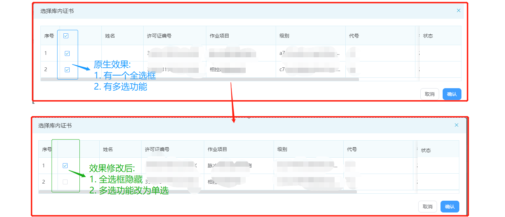

## 需求说明

>需求场景: 要求表格选框显示，但是一次只能操作一个多选框，所以需要把全选框隐藏处理,具体效果变更如下
>
> 

## 1、 隐藏表头中的全选框

### Ⅰ - 添加以下css样式

>```css
><style lang="css" >
>.el-table__header-wrapper  .el-checkbox{
>	display:none
>}
></style>
>```

### Ⅱ - Vue组件需要加 `/deep/`

>* 一般来说不用加 `/deep/`,就有效果
>* 但是当你将 style设置为scoped的时候,里面的样式是无法影响到子组件的
>* 如果想让某些样式穿透到子组件,能够对子组件都生效,就需要加 `/deep/ (深度选择器)` 
>
>```scss
><style lang="scss" scoped>
>/deep/ .el-table__header-wrapper .el-checkbox {
>  display: none;
>}
></style>
>```

### Ⅲ - 当前效果

>多选框已经删除,但是选项仍可多选
>
> 

## 2、多选变单选思路

### Ⅰ - 在table组件中添加以下代码

>* `ref="multipleTable"`:此代码方便后续直接操作table选中项显示
>* `@selection-change="handleSelectionChange"`:此代码将绑定后续过滤当前选中项的函数,使其变为单选
>* `@current-change="currentChange"`: 此代码是绑定 勾选当前项 触发的事件,可以做一些自己想要的操作
>
>```vue
><template>
>  <el-table
>    ref="multipleTable"
>    @current-change="currentChange"
>    @selection-change="handleSelectionChange"
>  ></el-table>
></template>
>```

### Ⅱ - 在data中定义一个状态

>这个状态将放置我们当前选中项,后续操作中我们需要将此状态渲染到界面选项上
>
>```vue
><script>
>export default {  
>  data () {
>    return {
>      currSelect: {} // 当前选中项-->默认就是一个对象
>    }
>  },
>}
></script>
>```

### Ⅲ - 定义过滤当前选中项的函数,使其变为单选

>* 原理时每次选中状态发生变化时,将传入项过滤出最新一次选中属性,赋予之前定义的 `currSelect`
>* 这样我们的 `currSelect` 存放的就是我们当前最新选中项
>
>```vue
><script>
>export default {  
>  methods: {
>    // 将多选变成单选 -->每次选中状态变化时,将选中项过滤成最新项赋予 [currSelect]
>    handleSelectionChange (emit) {
>      // 当emit大于2时一般是全选,这时我们清空即可-->如果用第一步去掉了全选框,这个情况可以忽略
>      if (emit.length > 2)  this.currSelect = undefined
>       // 当==2时一般是切换选择的时候,这时候我们保留最新选择的那个
>       else if (emit.length === 2)  this.currSelect = emit?.pop()
>       // 当==1时一般是直接选择的情况
>       else if (emit.length === 1)  this.currSelect = emit?.[0]
>    }
>  }
>}
></script>
>```

### Ⅳ - 监听状态变化

>1. 当我们 `currSelect` 发生变化时,表示我们进行了选择操作,这时对其进行监听
>2. 然后做以下两件事:
>   - 清空原有所有选中项
>   - 将当前选中项 渲染到界面上
>
>```vue
><script>
>export default {  
>   watch: {
>    // 监听当前项 -->需要监听到变化后手动清空之前的选中项
>    currSelect () {
>      // 清空原有所有选中项
>      this.$refs.multipleTable.clearSelection()
>      // 将当前选中项 渲染到界面上
>      if (this.currSelect) this.$refs.multipleTable.toggleRowSelection(this.currSelect)
>    }
>  },
>}
></script>
>```
>
>`注意`:不能偷懒将监听环节的代码直接放到`handleSelectionChange`函数中,否则会因为触发重绘,然后又触发此函数,如此重复无限循环就卡死了

## 3、完整代码示例

>以下只保留相关代码
>
>```vue
><template>
>  <el-table
>    ref="multipleTable"
>    @current-change="currentChange"
>    @selection-change="handleSelectionChange"
>  ></el-table>
></template>
>
><script>
>export default {
>  data () {
>    return {
>      currSelect: {} // 当前选中项-->默认就是一个对象
>    }
>  },
>  watch: {
>    // 监听当前项 -->需要监听到变化后手动清空之前的选中项
>    currSelect () {
>      // 清空原有所有选中项
>      this.$refs.multipleTable.clearSelection()
>      // 将当前选中项 渲染到界面上
>      if (this.currSelect) this.$refs.multipleTable.toggleRowSelection(this.currSelect)
>    }
>  },
>  methods: {
>    // 将多选变成单选 -->每次选中状态变化时,将选中项过滤成最新项赋予 [currSelect]
>    handleSelectionChange (emit) {
>      // 当emit大于2时一般是全选,这时我们清空即可-->如果用第一步去掉了全选框,这个情况可以忽略
>      if (emit.length > 2) {
>        this.currSelect = undefined
>      } else if (emit.length === 2) { // 当==2时一般是切换选择的时候,这时候我们保留最新选择的那个
>        this.currSelect = emit?.pop()
>      } else if (emit.length === 1) { // 当==1时一般是直接选择的情况
>        this.currSelect = emit?.[0]
>      }
>    }
>  }
>}
></script>
>
><style lang="scss" scoped>
>/deep/ .el-table__header-wrapper .el-checkbox {
>  display: none;
>}
></style>
>
>```
>
>
