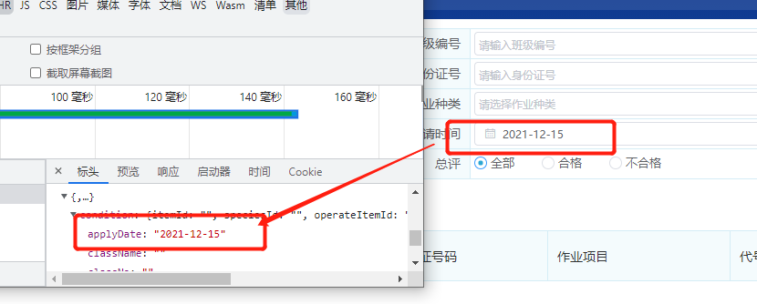
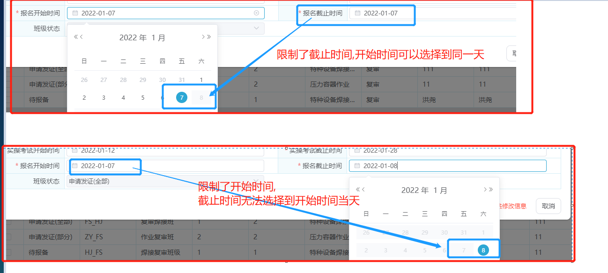

# 1、关于日期控件日期少一天的问题

在我进行前后端联调时,**发现传给服务端的参数比输入选择的日期少一天**,但代码逻辑并没有什么错误

随后经过排查发现是 `el-date-picker日期控件`的问题

## Ⅰ- 问题说明

1. 代码示例

```vue
<el-form-item label="申请时间" prop="applyDate"
   <el-date-picker
     class="eve-common-date-picker"
     :size="$size"
     v-model="form.applyDate"
     type="date"
     :style="{width:'100% '}"
     placeholder="请选择申请时间"
   </el-date-picker
</el-form-item
```

2. 传参截图


## Ⅱ- 原因剖析

**element-ui中时间控件的默认时间为国际标准时间，所以与北京时间差8个小时**

## Ⅲ- 解决方案

在标签中加上**value-format="yyyy-MM-dd"** 即可,将其转换格式

1. 解决代码

   ```vue
   <el-form-item label="申请时间" prop="applyDate"
      <el-date-picker
        class="eve-common-date-picker"
        :size="$size"
        v-model="form.applyDate"
        type="date"
        :style="{width:'100% '}"
        placeholder="请选择申请时间"
        value-format="yyyy-MM-dd"      //--------多加这一行代码-----//
      </el-date-picker
   </el-form-item
   ```

   

2. 成功解决

 

# 2、关于时间区间选择 查询边界错误的问题

## Ⅰ - 问题说明

当我们使用时间选择框选择时间区间时,处于边界的数据往往会得不到 比如 : 

* 选择 1~11号的数据,实际上默认转换成 `1号0时0分~11号0时0分`
* 这样我们是查不到11号0时到23:59分的数据的

## Ⅱ - 解决方案

设置两个属性即可

`value-format="yyyy-MM-dd HH:mm:ss"
:default-time="['00:00:00', '23:59:59']"`

```vue
<el-date-picker
  v-model="form.applyDate"
  value-format="yyyy-MM-dd HH:mm:ss"
  :default-time="['00:00:00', '23:59:59']"
  :style="{width:'100% '}"
  type="daterange"
  range-separator="~"
  start-placeholder="开始日期"
  end-placeholder="结束日期"
</el-date-picker
```

# 3、日期格式转化后限制时间范围picker-options失效的问题

## Ⅰ- 问题说明

1. 因为element-ui如不指定 `value-format` 就会出现日期数据少一天的问题,所以需要加上这个属性

2. 但是当我们加上格式转换后,原来的`picker-options`就失去了限制时间范围的效果,这是为什么?

    实际上是因为格式转换后,我们的时间格式转换成了 **字符串** 格式,所以我们要在`picker-options`对比时间的时候将其转换回来日期格式即可

## Ⅱ - 解决方案

此处只展示部分代码帮助理解

```vue
<template
<el-date-picker
   value-format="yyyy-MM-dd"
   v-model="form.applyEndDate"
   type="date"
   :picker-options="pickerOptions.theoryExamEndTime"
   placeholder="选择日期"
 </el-date-picker
</template
<script
export default {
  data () {
    return {
   		theoryExamEndTime: {
        	disabledDate: (time) = {
          		  return new Date(this.form.theoryExamStartTime)
                  ? new Date(this.form.theoryExamStartTime)  new Date(time) 
                 : null }  }   
    }}}
</script
```

效果图

# 4、日期选择器设置默认时间 23:59:59 

## Ⅰ - 问题说明

1. 一般来说,设置默认时间区间可以用`:default-time="['00:00:00', '23:59:59']"` 进行设置,但这个属性要求你的类型`  type="daterange"`

2. 这时我突然有个需求:因为有些用户显示屏较小,导致`type="daterange"`的选择器部分显示内容被隐藏,所以要我拆分成两个字段

    

3. 所以这时,原本的`type="daterange"`就要改成`type="date"`,就导致`:default-time="['00:00:00', '23:59:59']"`失效甚至报错

## Ⅱ - 解决方案一

这个方案是我最初自己想出来的,因为对于Element-ui的不熟悉,就想在最终使用数据的时候将默认时间添加上去

```vue
  <el-form-item label="考试结束时间" prop="examEndDate"
   <el-date-picker
     v-model="form.examEndDate"
     value-format="yyyy-MM-dd"
     :style="{width:'100% '}"
     type="date"
     placeholder="选择日期"
   </el-date-picker
 </el-form-item
<script
//使用数据时
export default {
  methods: {
    use() {
        //从form中获取该时间
      let { examEndDate } = this.form
      // 结束时间手动加上 23:59:59  防止查询边界错误
      examEndDate = examEndDate ? examEndDate += ' 23:59:59' : undefined
      //填入请求参数中
     const condition = { ...this.form, examEndDate }
    }
  }
}
</script
```

这样实现是可行的,但是也有缺点,就是如果当你时间选择框特别多时,代码就会变得冗余

## Ⅱ - 解决方案二

后来觉得Element-ui应该会有相应的处理,不应该这种常见的需求会没有解决方案,果然,在文档中发现了这个

 

所以,实际上我们只要在时间控件中这样写,就不用自己亲自做数据处理了 `value-format="yyyy-MM-dd [23:59:59]"`

```vue
  <el-form-item label="考试结束时间" prop="examEndDate"
   <el-date-picker
     v-model="form.examEndDate"
     value-format="yyyy-MM-dd [23:59:59]"
     :style="{width:'100% '}"
     type="date"
     placeholder="选择日期"
   </el-date-picker
 </el-form-item
```

# 5、两个关联时间框无法选择同一天

## Ⅰ- 问题提出

需求要求,开始时间与结束时间需要可以选择同一天,但突然发现一个BUG,两个时间选择框,当限制开始时间后,结束时间无法选择与开始时间同一天(限制结束时间后却可以选择同一天的开始时间)



###### 代码展示

```vue
<template
<el-date-picker
value-format="yyyy-MM-dd"
v-model="form.applyEndDate"
type="date"
:picker-options="pickerOptions.theoryExamEndTime"
placeholder="选择日期"
</el-date-picker
</template
<script
export default {
data () {
return {
		theoryExamEndTime: {
   	disabledDate: (time) = {
     		  return new Date(this.form.theoryExamStartTime)
         //此处明明是 = 为何还不能选择同一天??
             ? new Date(this.form.theoryExamStartTime) = new Date(time) 
            : null }  }   
}}}
</script
```

## Ⅱ - 问题分析

Element-ui的时间偏差了8小时,所以导致这个判断结束时间错误,所以一个是当天的8小时,一个是当天的0时,就导致了,开始时间可以选择到截止时间的当当天,而反过来却不行

一般来说 我们加个 `value-format="yyyy-MM-dd"` 就可以消除这个问题,就能转换成年月日 然后再转成时间 就是默认0时0分
我这边这个是要进行范围限制 它默认传入的时间却没有受到我们  value-format 的影响 他就是默认偏差8小时,需要我们将这个传入的time在进行格式转换

###### 所以解决方案理论上会有两种

1. 可以是将默认传入的时间都用 value-format转换成 `yyyy-MM-dd [00:00:00]` 格式(也可以先转成年月日再转换成时间格式,取决于自己),这样就能把超出的8小时去除
2. 直接操作日期加减一天

## Ⅲ - 代码示例

这里直接操作日期加减一天,问就是代码简单

```vue
<template
<el-date-picker
value-format="yyyy-MM-dd"
v-model="form.applyEndDate"
type="date"
:picker-options="pickerOptions.theoryExamEndTime"
placeholder="选择日期"
</el-date-picker
</template
<script
export default {
data () {
return {
		theoryExamEndTime: {
   	disabledDate: (time) = {
          // elementui时间默认多了8小时,需要消除这8小时的影响
            const tempDate = new Date(time)
            const newDate = tempDate.setDate(tempDate.getDate() + 1)
            return new Date(this.form.applyStartDate) ? new Date(this.form.applyStartDate) = new Date(newDate) : null
    } }   
}}}
</script
```

## Ⅳ - 解决


