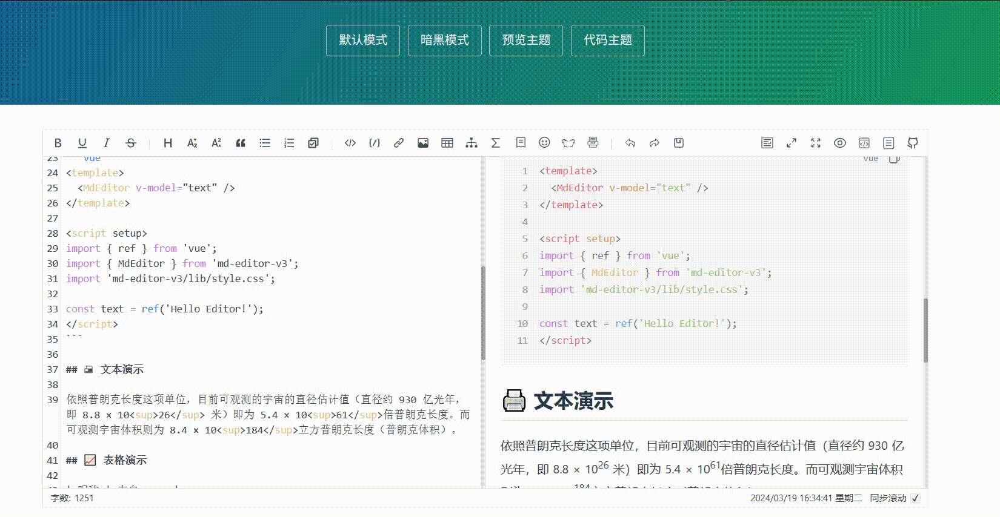
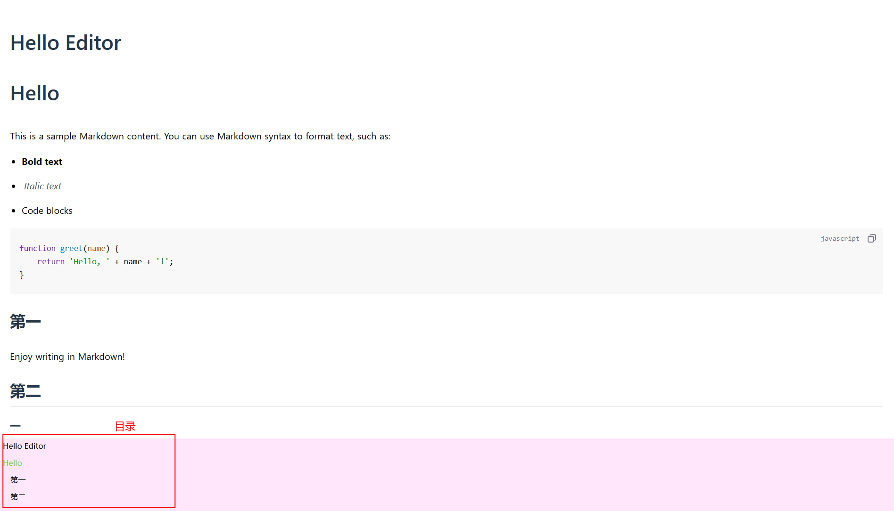
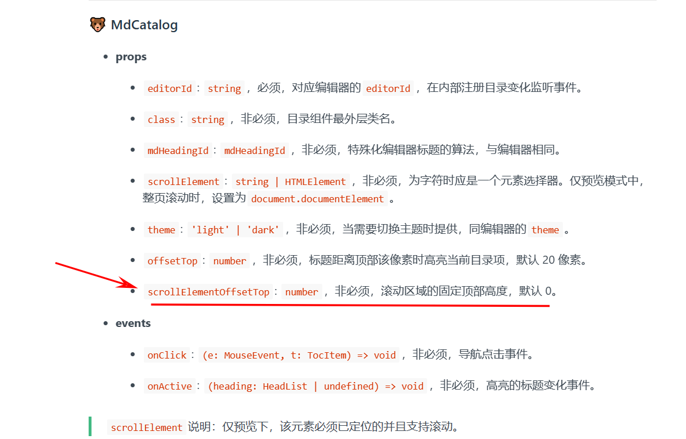
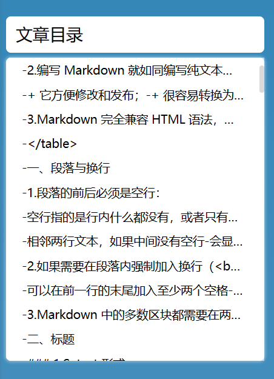
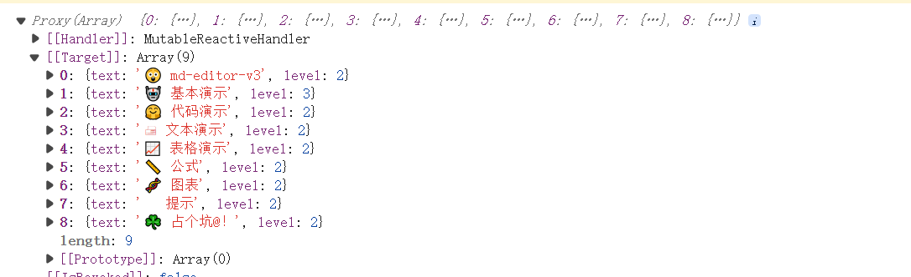

# 官网

# [MdEditorV3 Documentation (imzbf.github.io)](https://imzbf.github.io/md-editor-v3/zh-CN/index)

# 主题切换

主题分为了编辑器主题（`theme`，称为全局主题）、预览内容主题（`previewTheme`）和块级代码主题（`codeTheme`），他们都支持响应式更新，而非只能预设。



## 🍧 编辑器主题(写文章)

支持默认和暗夜模式两种

```vue
<template>
  <MdEditor v-model="state.text" :theme="state.theme" />
</template>

<script setup>
import { reactive } from 'vue';
import { MdEditor } from 'md-editor-v3';
import 'md-editor-v3/lib/style.css';

const state = reactive({
  text: '',
  theme: 'dark'
});
</script>
```

## 🍡 预览主题(看文章)

内置了`default`、`github`、`vuepress`、`mk-cute`、`smart-blue`、`cyanosis`6 种主题，在一些直接预览文档内容时使用。并且支持在线切换（修改`previewTheme`即可）和自行扩展。

- 使用

  ```vue
  <template>
    <MdEditor v-model="state.text" :previewTheme="state.theme" />
  </template>
  
  <script setup>
  import { reactive } from 'vue';
  import { MdEditor } from 'md-editor-v3';
  import 'md-editor-v3/lib/style.css';
  
  const state = reactive({
    text: '',
    theme: 'cyanosis'
  });
  </script>
  ```

- 自定义

  1. 先以`xxx-theme`为类名，定义你的主题`css`，xxx 是主题名称，具体的内容参考[markdown-theme](https://github.com/imzbf/markdown-theme)

  *xxx.css*

  ```css
  .xxx-theme code {
    color: red;
  }
  ```

  1. 全局引入

  ```js
  import 'xxx.css';
  ```

  1. 设置`previewTheme`为 xxx

  ```vue
  <template>
    <MdEditor previewTheme="xxx" />
  </template>
  ```

## 🎄 代码主题

内置了`atom`、`a11y`、`github`、`gradient`、`kimbie`、`paraiso`、`qtcreator`、`stackoverflow`代码主题，均来至[highlight.js](https://highlightjs.org/)

- 使用

  ```vue
  <template>
    <MdEditor v-model="state.text" :codeTheme="state.theme" />
  </template>
  
  <script setup>
  import { reactive } from 'vue';
  import { MdEditor } from 'md-editor-v3';
  import 'md-editor-v3/lib/style.css';
  
  const state = reactive({
    text: '',
    theme: 'atom'
  });
  </script>
  ```

- 自定义

  1. 找到你喜欢的代码主题，最好支持暗夜模式

  ```js
  import { config } from 'md-editor-v3';
  
  config({
    editorExtensions: {
      highlight: {
        css: {
          xxxxx: {
            light: 'https://unpkg.com/highlight.js@11.2.0/styles/xxxxx-light.css',
            dark: 'https://unpkg.com/highlight.js@11.2.0/styles/xxxxx-dark.css'
          },
          yyyyy: {
            light: 'https://unpkg.com/highlight.js@11.2.0/styles/xxxxx-light.css',
            dark: 'https://unpkg.com/highlight.js@11.2.0/styles/xxxxx-dark.css'
          }
        }
      }
    }
  });
  ```

  你可以通过将`css`的`key`设置为内置名称来覆盖内置的链接。

  1. 设置`codeTheme`

  ```vue
  <template>
    <MdEditor codeTheme="xxxxx" />
  </template>
  ```

## 总结

写文章

```vue
<template>
  <MdEditor v-model="text" previewTheme="vuepress" codeTheme="a11y"/>
</template>

<script setup>
import { ref } from 'vue';
import { MdEditor } from 'md-editor-v3';
import 'md-editor-v3/lib/style.css';

const text = ref('Hello Editor!');
</script>
```

看文章

```vue
<template>
	<!--文章内容-->
  <MdPreview :editorId="id" :modelValue="text" previewTheme="vuepress" codeTheme="a11y"/>
	<!--文章目录-->
  <MdCatalog :editorId="id" :scrollElement="scrollElement" />
</template>

<script setup>
import { ref } from 'vue';
import { MdPreview, MdCatalog } from 'md-editor-v3';
// preview.css相比style.css少了编辑器那部分样式
import 'md-editor-v3/lib/preview.css';

const id = 'preview-only';
const text = ref(`
# Hello Editor
# Hello 
This is a sample Markdown content. You can use Markdown syntax to format text, such as:

- **Bold text**
- *Italic text*
- Code blocks

\`\`\`javascript
function greet(name) {
    return 'Hello, ' + name + '!';
}
\`\`\`
## 第一
Enjoy writing in Markdown!
## 第二
### 一
`);
    
//md-catalog目录的监听设置    
const scrollElement = document.documentElement;
</script>
```

**效果**




# 关于点击目录定位的问题

已在2.6.0的目录组件中新增了`scrollElementOffsetTop`属性



在点击到指定的二级标题位置时，它目录的高亮显示还是在上一个二级标题

+ 通过目录组件的`offsetTop`来调节一下


```vue

<el-affix offset="100">
    <div class="catalog">
        <div class="titleTop">文章目录</div>
        <!--文章目录-->
        <MdCatalog
                   offsetTop="200"
                   scrollElementOffsetTop="100"
                   editorId="preview-only"
                   class="browserCatalog"
                   :scrollElement="scrollElement"
                   />
    </div>
</el-affix>


// 目录
.catalog {
  margin-top: 50px;
  margin-left: 1rem;
  margin-right: 2rem;


  .titleTop {
    width: 100%;
    background-color: rgb(255, 255, 255);
    margin-bottom: 0.5rem;
    box-sizing: border-box;
    font-size: 1.7rem;
    // font-weight: 600;
    padding: 1rem;
    border-radius: 0.5rem;
  }

  .browserCatalog {
    max-height: 400px; /* 设置最大高度 */
    overflow-y: auto; /* 当内容溢出时显示滚动条 */
    width: 100%;
    background-color: rgb(255, 255, 255);
    border-radius: 0.5rem;
    box-shadow: 0 0 0.3rem 0.1rem rgba(255, 255, 255, 0.4);
    box-sizing: border-box;
    padding: 2rem 1rem;
    font-size: 1.2rem;
  }
}
```



# onGetCatalog 动态获取`markdown`目录

```vue
 <!-- 文章内容 -->
        <MdPreview
          editorId="preview-only"
          :modelValue="article.htmlContent"
          previewTheme="vuepress"
          codeTheme="a11y"
          @onGetCatalog="getCatalog"
        />
        
        
  const getCatalog = (list) => {
    console.log(list);

}      
        
```



