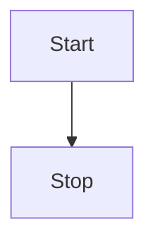
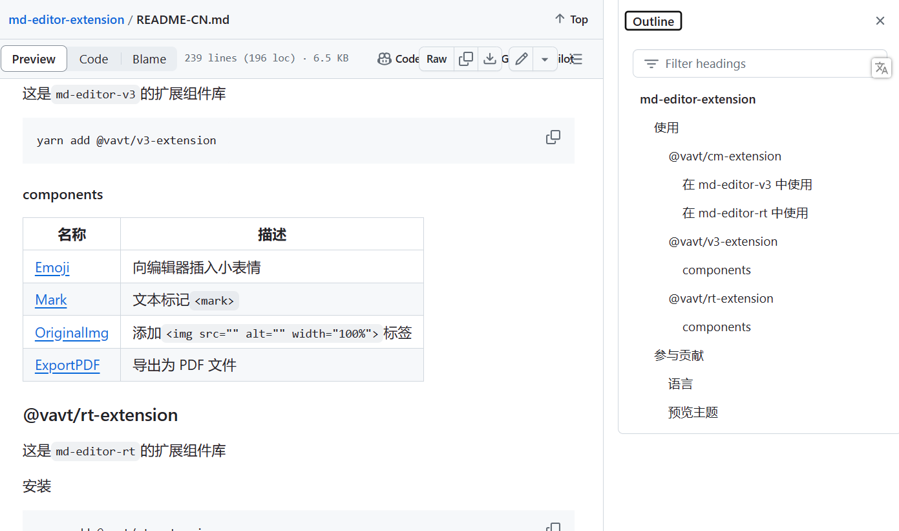
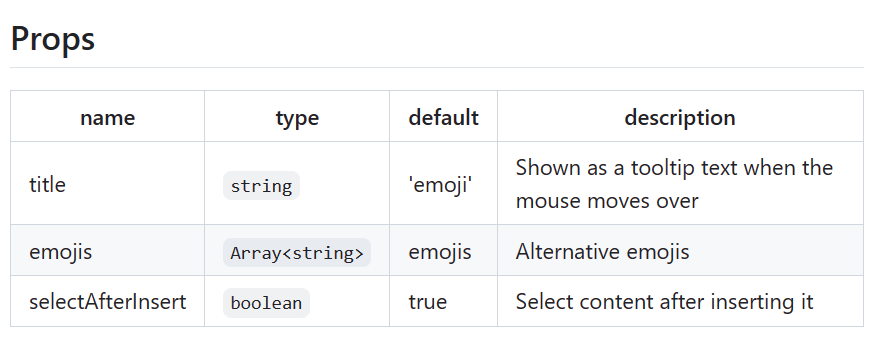
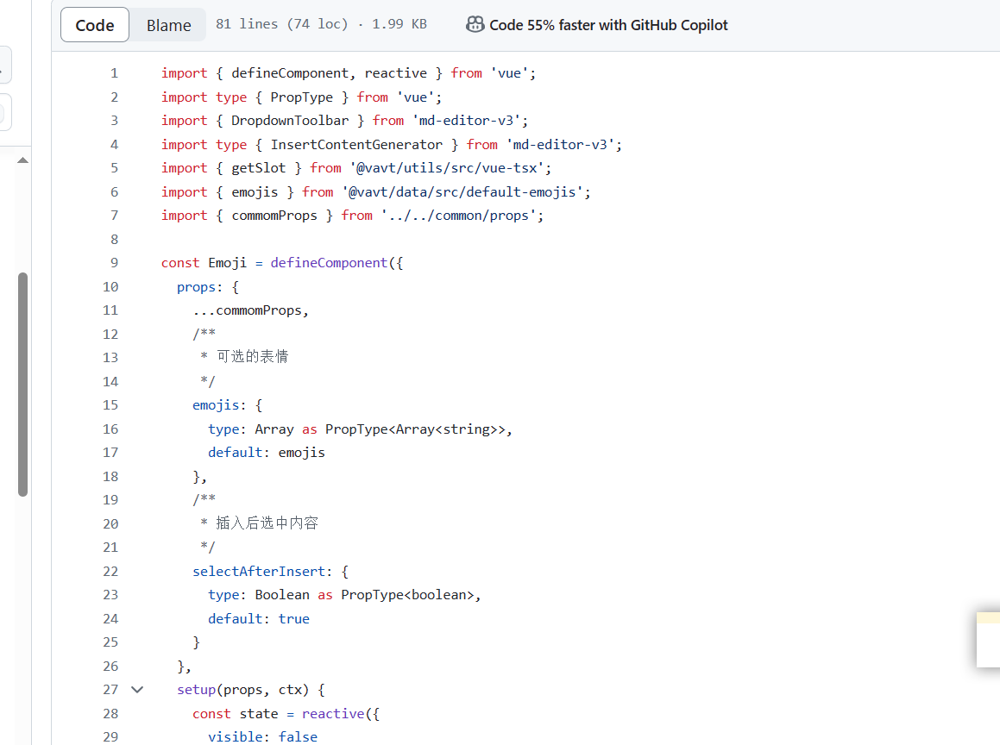
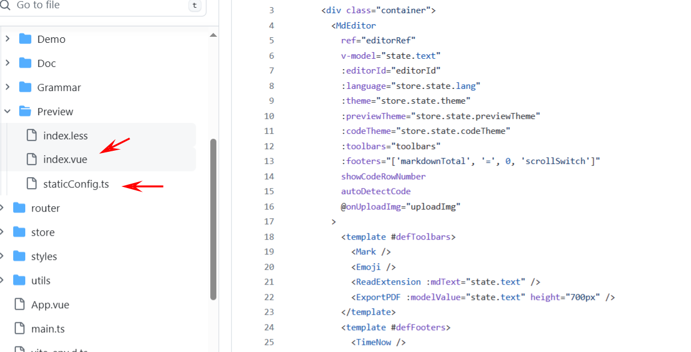
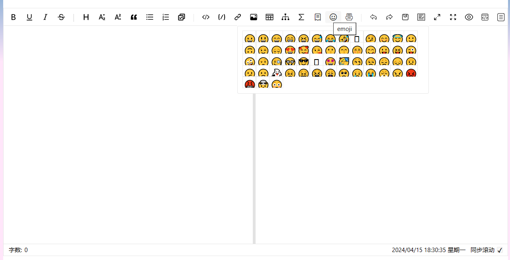
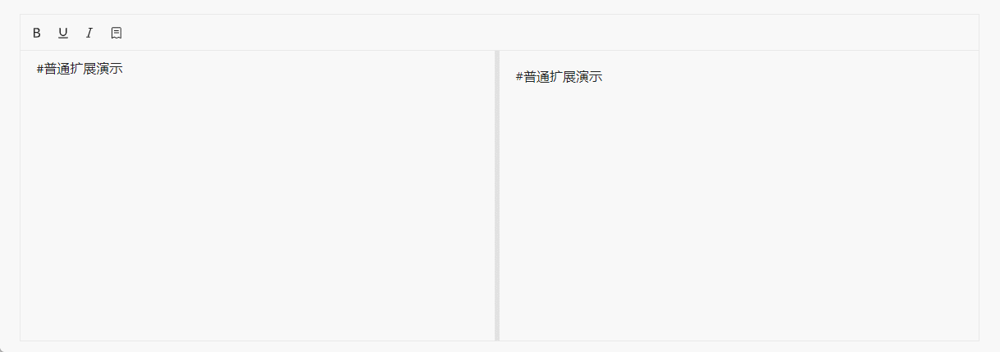
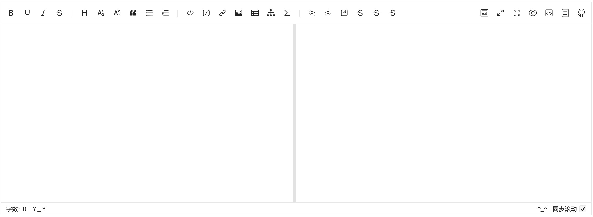
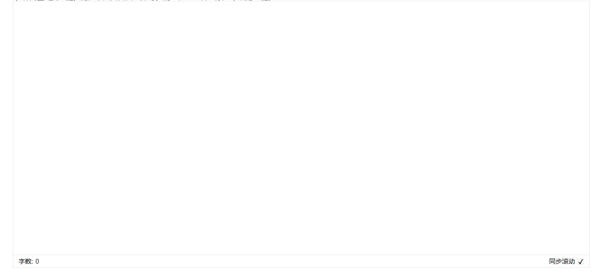
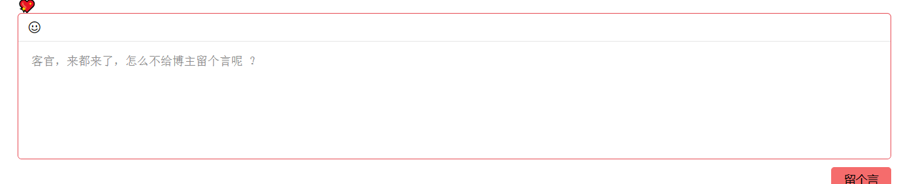

# 官网

# [MdEditorV3 Documentation (imzbf.github.io)](https://imzbf.github.io/md-editor-v3/zh-CN/index)

# 主题切换

主题分为了编辑器主题（`theme`，称为全局主题）、预览内容主题（`previewTheme`）和块级代码主题（`codeTheme`），他们都支持响应式更新，而非只能预设。


````
## 😲 md-editor-v3

Markdown Editor for Vue3, developed in jsx and typescript, support different themes、beautify content by prettier.

### 🤖 Base

**bold**, <u>underline</u>, _italic_, ~~line-through~~, superscript<sup>26</sup>, subscript<sub>1</sub>, `inline code`, [link](https://github.com/imzbf)

> quote: I Have a Dream

1. So even though we face the difficulties of today and tomorrow, I still have a dream.
2. It is a dream deeply rooted in the American dream.
3. I have a dream that one day this nation will rise up.

- [ ] Friday
- [ ] Saturday
- [x] Sunday


## 🤗 Code

```vue
<template>
  <MdEditor v-model="text" />
</template>

<script setup>
import { ref } from 'vue';
import { MdEditor } from 'md-editor-v3';
import 'md-editor-v3/lib/style.css';

const text = ref('Hello Editor!');
</script>
```

## 🖨 Text

The Old Man and the Sea served to reinvigorate Hemingway's literary reputation and prompted a reexamination of his entire body of work.

## 📈 Table

| nickname | from             |
| -------- | ---------------- |
| zhijian  | ChongQing, China |

## 📏 Formula

Inline: $x+y^{2x}$

$$
\sqrt[3]{x}
$$

## 🧬 Diagram



## 🪄 Alert

!!! note Supported Types

note、abstract、info、tip、success、question、warning、failure、danger、bug、example、quote、hint、caution、error、attention

!!!

## ☘️ em...

````


## 🍧 编辑器主题(写文章)

支持默认和暗夜模式两种

```vue
<template>
  <MdEditor v-model="state.text" :theme="state.theme" />
</template>

<script setup>
import { reactive } from 'vue';
import { MdEditor } from 'md-editor-v3';
import 'md-editor-v3/lib/style.css';

const state = reactive({
  text: '',
  theme: 'dark'
});
</script>
```

## 🍡 预览主题(看文章)

内置了`default`、`github`、`vuepress`、`mk-cute`、`smart-blue`、`cyanosis`6 种主题，在一些直接预览文档内容时使用。并且支持在线切换（修改`previewTheme`即可）和自行扩展。

- 使用

  ```vue
  <template>
    <MdEditor v-model="state.text" :previewTheme="state.theme" />
  </template>
  
  <script setup>
  import { reactive } from 'vue';
  import { MdEditor } from 'md-editor-v3';
  import 'md-editor-v3/lib/style.css';
  
  const state = reactive({
    text: '',
    theme: 'cyanosis'
  });
  </script>
  ```

- 自定义

  1. 先以`xxx-theme`为类名，定义你的主题`css`，xxx 是主题名称，具体的内容参考[markdown-theme](https://github.com/imzbf/markdown-theme)

  *xxx.css*

  ```css
  .xxx-theme code {
    color: red;
  }
  ```

  1. 全局引入

  ```js
  import 'xxx.css';
  ```

  1. 设置`previewTheme`为 xxx

  ```vue
  <template>
    <MdEditor previewTheme="xxx" />
  </template>
  ```

## 🎄 代码主题

内置了`atom`、`a11y`、`github`、`gradient`、`kimbie`、`paraiso`、`qtcreator`、`stackoverflow`代码主题，均来至[highlight.js](https://highlightjs.org/)

- 使用

  ```vue
  <template>
    <MdEditor v-model="state.text" :codeTheme="state.theme" />
  </template>
  
  <script setup>
  import { reactive } from 'vue';
  import { MdEditor } from 'md-editor-v3';
  import 'md-editor-v3/lib/style.css';
  
  const state = reactive({
    text: '',
    theme: 'atom'
  });
  </script>
  ```

- 自定义

  1. 找到你喜欢的代码主题，最好支持暗夜模式

  ```js
  import { config } from 'md-editor-v3';
  
  config({
    editorExtensions: {
      highlight: {
        css: {
          xxxxx: {
            light: 'https://unpkg.com/highlight.js@11.2.0/styles/xxxxx-light.css',
            dark: 'https://unpkg.com/highlight.js@11.2.0/styles/xxxxx-dark.css'
          },
          yyyyy: {
            light: 'https://unpkg.com/highlight.js@11.2.0/styles/xxxxx-light.css',
            dark: 'https://unpkg.com/highlight.js@11.2.0/styles/xxxxx-dark.css'
          }
        }
      }
    }
  });
  ```

  你可以通过将`css`的`key`设置为内置名称来覆盖内置的链接。

  1. 设置`codeTheme`

  ```vue
  <template>
    <MdEditor codeTheme="xxxxx" />
  </template>
  ```

## 总结

写文章

```vue
<template>
  <MdEditor v-model="text" previewTheme="vuepress" codeTheme="a11y"/>
</template>

<script setup>
import { ref } from 'vue';
import { MdEditor } from 'md-editor-v3';
import 'md-editor-v3/lib/style.css';

const text = ref('Hello Editor!');
</script>
```

看文章

```vue
<template>
	<!--文章内容-->
  <MdPreview :editorId="id" :modelValue="text" previewTheme="vuepress" codeTheme="a11y"/>
	<!--文章目录-->
  <MdCatalog :editorId="id" :scrollElement="scrollElement" />
</template>

<script setup>
import { ref } from 'vue';
import { MdPreview, MdCatalog } from 'md-editor-v3';
// preview.css相比style.css少了编辑器那部分样式
import 'md-editor-v3/lib/preview.css';

const id = 'preview-only';
const text = ref(`
# Hello Editor
# Hello 
This is a sample Markdown content. You can use Markdown syntax to format text, such as:

- **Bold text**
- *Italic text*
- Code blocks

\`\`\`javascript
function greet(name) {
    return 'Hello, ' + name + '!';
}
\`\`\`
## 第一
Enjoy writing in Markdown!
## 第二
### 一
`);
    
//md-catalog目录的监听设置    
const scrollElement = document.documentElement;
</script>
```

**效果**


# 关于点击目录定位的问题

已在2.6.0的目录组件中新增了`scrollElementOffsetTop`属性


在点击到指定的二级标题位置时，它目录的高亮显示还是在上一个二级标题

+ 通过目录组件的`offsetTop`来调节一下


```vue

<el-affix offset="100">
    <div class="catalog">
        <div class="titleTop">文章目录</div>
        <!--文章目录-->
        <MdCatalog
                   offsetTop="200"
                   scrollElementOffsetTop="100"
                   editorId="preview-only"
                   class="browserCatalog"
                   :scrollElement="scrollElement"
                   />
    </div>
</el-affix>


// 目录
.catalog {
  margin-top: 50px;
  margin-left: 1rem;
  margin-right: 2rem;


  .titleTop {
    width: 100%;
    background-color: rgb(255, 255, 255);
    margin-bottom: 0.5rem;
    box-sizing: border-box;
    font-size: 1.7rem;
    // font-weight: 600;
    padding: 1rem;
    border-radius: 0.5rem;
  }

  .browserCatalog {
    max-height: 400px; /* 设置最大高度 */
    overflow-y: auto; /* 当内容溢出时显示滚动条 */
    width: 100%;
    background-color: rgb(255, 255, 255);
    border-radius: 0.5rem;
    box-shadow: 0 0 0.3rem 0.1rem rgba(255, 255, 255, 0.4);
    box-sizing: border-box;
    padding: 2rem 1rem;
    font-size: 1.2rem;
  }
}
```


# onGetCatalog 动态获取`markdown`目录

```vue
 <!-- 文章内容 -->
        <MdPreview
          editorId="preview-only"
          :modelValue="article.htmlContent"
          previewTheme="vuepress"
          codeTheme="a11y"
          @onGetCatalog="getCatalog"
        />
        
        
  const getCatalog = (list) => {
    console.log(list);

}      
        
```


# 编辑器的扩展组件(表情等)

注意:  得用数字在toolbars占位

```js
import { Emoji } from "@vavt/v3-extension";
import '@vavt/v3-extension/lib/asset/style.css';
```

使用

[md-editor-extension/README-CN.md at develop · imzbf/md-editor-extension (github.com)](https://github.com/imzbf/md-editor-extension/blob/develop/README-CN.md)



```
npm install @vavt/v3-extension
```



emojis自定义表情 :emojis="['🤡','💀']"

selectAfterlnsert=false表示可以连续点击表情

源码:



例子

[md-editor-v3/src/pages/Preview/index.vue at docs · imzbf/md-editor-v3 (github.com)](https://github.com/imzbf/md-editor-v3/blob/docs/src/pages/Preview/index.vue)



效果




```vue
<template>
  <div class="project-preview">
    <div class="container">
      <MdEditor
        ref="editorRef"
         :editorId="editorId"
        :toolbars="toolbars"
        :footers="['markdownTotal', '=', 0, 'scrollSwitch']"
        showCodeRowNumber
        autoDetectCode
        @onUploadImg="uploadImg"
      >
        <template #defToolbars>
          <Mark />
          <Emoji />
          <ExportPDF :modelValue="text" height="700px" />
        </template>
        <template #defFooters>
          <TimeNow />
        </template>
      </MdEditor>
      <br />
      <span class="tips-text">
        {{ tips
        }}<a
          href="https://github.com/imzbf/md-editor-v3/tree/docs/src/components"
          target="_blank"
          >components</a
        >
      </span>
    </div>
  </div>
</template>

<script setup lang="ts">
import { computed, reactive, watch, ref, onMounted } from 'vue';
import { MdEditor } from 'md-editor-v3';
import { Emoji, Mark, ExportPDF } from '@vavt/v3-extension';
import '@vavt/v3-extension/lib/asset/style.css';
import type { ExposeParam } from 'md-editor-v3';
import { toolbars } from './staticConfig';
import TimeNow from '/@/components/TimeNow/index.vue';


const editorId = 'editor-preview';

const editorRef = ref<ExposeParam>();

const test= ref("")

onMounted(() => {
  console.log(editorRef.value?.on('catalog', console.log));
});
</script>

<script lang="ts">
export default {
  name: 'PreviewPage'
};
</script>
```


# 自定义

##  toolbars

选择性展示工具栏，可选内容见下方。

你可以随意排序工具栏，通过`'-'`分割两个工具，通过`'='`实现左右放置！

从 v1.10.0 开始，你可以自定义工具栏，将`defToolbars`中自定义工具项的下标穿插在`toolbars`实现展示（这并不规范）

```js
[
  'bold',
  'underline',
  'italic',
  '-',
  'title',
  'strikeThrough',
  'sub',
  'sup',
  'quote',
  'unorderedList',
  'orderedList',
  'task',
  '-',
  'codeRow',
  'code',
  'link',
  'image',
  'table',
  'mermaid',
  'katex',
  '-',
  'revoke',
  'next',
  'save',
  '=',
  'pageFullscreen',
  'fullscreen',
  'preview',
  'previewOnly',
  'htmlPreview',
  'catalog',
  'github'
];
```


## defToolbars

```vue
<template>
  <MdEditor :toolbars="toolbars">
    <template #defToolbars>
      <NormalToolbar title="mark" @onClick="handler">
        <template #trigger>
          <svg class="md-editor-icon" aria-hidden="true">
            <use xlink:href="#icon-mark"></use>
          </svg>
        </template>
      </NormalToolbar>
    </template>
  </MdEditor>
</template>

<script setup>
import { MdEditor, NormalToolbar } from 'md-editor-v3';
import 'md-editor-v3/lib/style.css';

const toolbars = ['bold', '-', 0, '=', 'github'];

const handler = () => {
  console.log('NormalToolbar clicked!');
};
</script>
```



## defFooters

自定义扩展页脚

```vue
<template>
  <MdEditor :footers="footers">
    <template #defFooters>
      <span>￥_￥</span>
      <span>^_^</span>
    </template>
  </MdEditor>
</template>

<script setup>
import { MdEditor } from 'md-editor-v3';
import 'md-editor-v3/lib/style.css';

// 将插槽中的组件下标放到对应的位置即可显示
const footers = ['markdownTotal', 0, '=', 1, 'scrollSwitch'];
</script>
```




# 变成对话框

```vue
<MdEditor :toolbars="toolbars" :preview="false"> </MdEditor>

import { MdEditor, NormalToolbar } from "md-editor-v3";
import "md-editor-v3/lib/style.css";

const toolbars = [];
```




# 样式



```vue
  <div class="edit-container">
          <MdEditor
            class="editor"
            v-model="content"
            previewTheme="vuepress"
            codeTheme="a11y"
            placeholder="客官，来都来了，怎么不给博主留个言呢 ？"
            :toolbars="[0]"
            :preview="false"
            :footers="[]"
          >
            <template #defToolbars>
              <Emoji />
            </template>
          </MdEditor>
        </div>
        
              .edit-container {
        margin: 0 auto;
        padding: 0 50px;

        @media screen and (max-width: 960px) {
          padding: 0;
        }

        .editor {
          height: 180px;
          border: 1px solid #e74851;
          border-radius: 5px;
          min-height: 120px;
        }
      }
```

# MdEditor 绑定事件

### onSave

- **类型**：`(v: string, h: Promise<string>) => void`

  保存事件，快捷键与保存按钮均会触发。

- v: 原始文本内容  

- h: 编辑器将 `content` 渲染为 HTML 后的结果

```vue
<template>
  <MdEditor @onSave="onSave" />
</template>

<script setup>
import { MdEditor } fr om 'md-editor-v3';
import 'md-editor-v3/lib/style.css';

const onSave = (v, h) => {
  console.log(v);

  h.then((html) => {
    console.log(html);
  });
};
</script>
```

# 设置链接在新窗口打开

TargetBlankExtension.js

```js
const TargetBlankExtension = (md) => {
    const defaultRender =
      md.renderer.rules.link_open ||
      function (tokens, idx, options, env, self) {
        return self.renderToken(tokens, idx, options);
      };
  
    md.renderer.rules.link_open = function (tokens, idx, options, env, self) {
      const aIndex = tokens[idx].attrIndex('target');
  
      if (aIndex < 0) {
        tokens[idx].attrPush(['target', '_blank']);
      } else {
        tokens[idx].attrs[aIndex][1] = '_blank';
      }
  
      // pass token to default renderer.
      return defaultRender(tokens, idx, options, env, self);
    };
  };
  
  export default TargetBlankExtension;
```

使用

```ts
import TargetBlankExtension from "./TargetBlankExtension";
config({
  markdownItConfig(md) {
    md.use(TargetBlankExtension);
  },
});
```

# v-html 渲染的图片太宽解决解决

```vue
<div
     v-loading="loading"
     class="content markdown-body"
     v-html="articleHtmlContent"
     />

const opened = () => {
  loading.value = true;
  articleDetail(props.id).then((res) => {
    loading.value = false;

    let htmlContent = res.htmlContent;

    articleHtmlContent.value = htmlContent.replace(
      /<video/g,
      "<video style='width:100%;height:auto;'"
    );

    articleHtmlContent.value = htmlContent.replace(
      /<img/g,
      "<img style='width:100%;height:auto;'"
    );
  });
};

```

