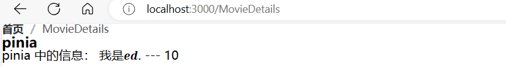
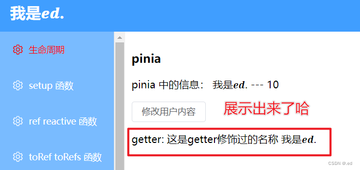
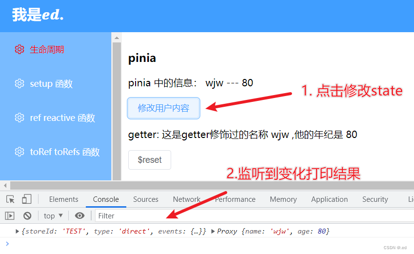
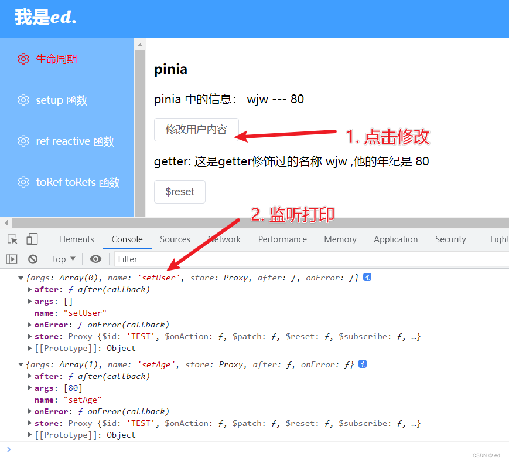
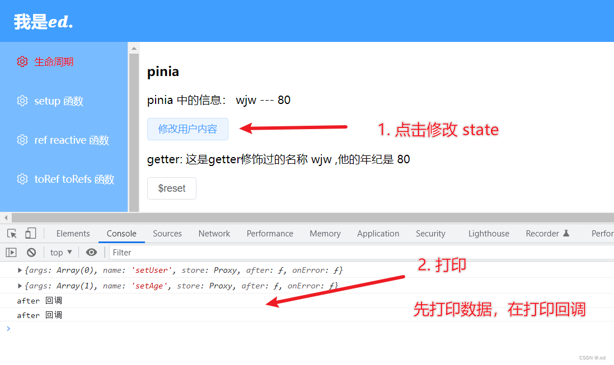

## [官网](https://pinia.vuejs.org/api/modules/pinia.html#Type-Aliases)

## Pinia介绍

Pinia(大菠萝)是一个专门为Vue.js设计的状态管理库，它提供了一种简单和直观的方式来管理应用程序的状态。在使用Pinia时，可以轻松地创建定义状态的存储，然后将其与Vue组件绑定，使它们能够使用该状态。

和Vuex相比，Pinia 更加简单易用，体积更小，同时具有更好的 TypeScript 支持和插件系统。

在Vue.js的官网中，我们可以看到Pinia目前已经取代Vuex,成为Vue生态系统的一部分。

## 安装和配置Pinia [必须]

```
npm install pinia
# 或者
yarn add pinia
```

在安装完Pinia包之后，需要在main.ts文件中导入createPinia函数并将Pinia插件与Vue应用程序绑定，如下所示：

```typescript
import { createApp } from 'vue';
import { createPinia } from 'pinia';
import App from './App.vue';

const app = createApp(App);

const pinia = createPinia();  //
app.use(pinia);

app.mount('#app');
```

## Pinia的核心

### Store

Store是 Pinia 中管理状态的核心概念。它相当于一个 Vue 组件中的状态，但是 Store是一个独立的模块。

Store 是用 defineStore() 定义的，它的第一个参数要求是一个独一无二的名字，这个名字 ，也被用作 id ，是必须传入的， Pinia 将用它来连接 store 和 devtools。为了养成习惯性的用法，将返回的函数命名为 use… 是一个符合组合式函数风格的约定。

defineStore() 的第二个参数可接受两类值：Setup 函数或 Option 对象。

定义Store的示例代码：

```tsx
import { defineStore } from 'pinia'

// defineStore()的返回值命名，最好使用 store 的名字，同时以 `use` 开头且以 `Store` 结尾。(比如 `useUserStore`，`useCartStore`，`useProductStore`)
// 第一个参数是你的应用中 Store 的唯一 ID
// 第二个参数可接受两类值：Setup 函数或 Option 对象
export const useAlertsStore = defineStore('alerts', {
  // 其他配置...
})
```

### State

State 是 store 中存储数据的地方。通过定义 State，可以在 store 的任何位置访问和修改数据。

在 Pinia 中，state 被定义为一个返回初始状态的函数。这使得 Pinia 可以同时支持服务端和客户端。

定义State的示例代码如下：

```tsx
import { defineStore } from 'pinia'

const useStore = defineStore('storeId', {
  // 为了完整类型推理，推荐使用箭头函数
  state: () => {
    // 定义属性
    return {
      // 所有这些属性都将自动推断出它们的类型
      count: 0,
      name: 'Eduardo',
      isAdmin: true,
      items: [],
      hasChanged: true,
    }
  },
})
```

### Getter

Getter 用来获取从 state 派生的数据，类似于 Vue 组件中的 computed 计算属性。可以通过 defineStore() 中的 getters 属性来定义它们。推荐使用箭头函数，并且它将接收 state 作为第一个参数：

```tsx
export const useStore = defineStore('main', {
  state: () => ({
    count: 0,
  }),
  getters: {
    //类似于 Vue 组件中的 computed 计算属性
    doubleCount: (state) => state.count * 2,
  },
})
```

### Action

Action 相当于组件中的 方法。它们可以通过 defineStore() 中的 actions 属性来定义；Action 是一种将异步操作封装在 store中的方式，它是一个可以被调用的函数，也可以接收参数并修改 store 中的状态。 Action应该始终是同步的，并返回一个 Promise 对象，以便在处理异步操作时能够很好地处理结果。

Pinia 中的 Action 由 defineStore 创建，可以通过在 actions 中定义它们来使用它们。

例如，下面是一个 store 中的 Action 定义：

```tsx
import { defineStore } from 'pinia'

export const myStore = defineStore('myStore',{ 
  state: () => ({
    message: 'Hello',
  }),
  actions: {
    // 定义方法  
    async fetchMessage() {
      const response = await fetch('http://127.0.0.1:5173/message')
      const data = await response.json()
      this.message = data.message
    },
  },
})
```

在上面的示例中，我们为 myStore 定义了一个 Action ， fetchMessage() ，它会从后台 API 中获取数据，并更新 store 中的状态。然后，我们可以从组件或其他 Action 中调用该 Action ：

```tsx
import { useStore } from 'pinia'

export default {
  setup() {
    const store = useStore('myStore')

    function handleClick() {
      store.fetchMessage()
    }

    return {
      handleClick,
    }
  },
}
```

在上面的代码中，我们在组件中使用 useStore 钩子来获取 store 实例，然后将其传递给 fetchMessage() 方法。该方法将从应用程序的后台获取数据，并更新存储器中的状态。最后，公开了一个 handleClick() 方法，以便组件可以调用它并触发 Action 。

## Pinia的Option Store方式定义 Store

示例代码如下：

```tsx
export const useCounterStore = defineStore('counter', {
  state: () => ({ count: 0 }),
  getters: {
    double: (state) => state.count * 2,
  },
  actions: {
    increment() {
      this.count++
    },
  },
})
```

可以认为 state 是 store 的数据 (data)，getters 是 store 的计算属性 (computed)，而 actions 则是方法 (methods)。

## Pinia的Setup Store方式定义 Store

示例代码如下：

```tsx
export const useCounterStore = defineStore('counter', () => {
  const count = ref(0)
  function increment() {
    count.value++
  }

  return { count, increment }
})
```

在 Setup Store 中：

- ​      ref() 就是 state 属性
- computed() 就是 getters
- function() 就是 actions

## 基本使用:crossed_swords:

**安装**

```bash
npm install pinia
# 或者
yarn add pinia
```

**mian.ts**

```ts
import { createApp } from "vue";
import App from "./App.vue";

// 引入重置与全局样式
import "./assets/style/reset.css";
import "./assets/style/common.css";

//vue3引入 Pinia (必须)                                                ////
import { createPinia } from 'pinia';
const state = createPinia()

//导入router配置文件
import route from "/@/route/router";

// 引入element-icon集合
import * as ElementPlusIconsVue from "@element-plus/icons-vue";

// 自定义loading组件
import Loading from "./plugins/Loading/index";

// 自定义回到顶部组件
import BackTop from "./plugins/BackTop/index";

const app = createApp(App);


// 打印环境变量
// console.log(process.env.NODE_ENV);

for (const [key, component] of Object.entries(ElementPlusIconsVue)) {
  app.component(key, component);
}

//全局注册
app.use(route).use(state).use(Loading).use(BackTop).mount("#app");       ////

export default app; // 这里导出app的目的，是为了在后面演示js文件中使用插件
```

**src/store/index.ts** 

```tsx
import { defineStore } from "pinia";
import { Names } from "./store_name";

export const useInfoStore = defineStore(Names.TEST, {
  state: () => {
    return {
      //定义数据  
      name: '我是𝒆𝒅.',
      age: 10,
    }
  },

  getters: {
	//定义计算属性
  },
  actions: {
	// 定义方法
  }

})
```

**src/store/store_name.ts** 

```tsx
// store_name.ts 的文件写一个枚举数据导出

export const enum Names {
    TEST = "TEST"
  }
```

**src/pages/MovieDetails.vue** 

```vue
<template>
  <h3>pinia</h3>
  <!-- 在页面中直接使用就可以了 -->
  <p>pinia 中的信息： {{userInfo.name}} --- {{userInfo.age}}</p>
</template>
<script setup>
  // 首先需要引入创建的store
  import { useInfoStore } from '/@/store';
    
  // 调用
  const userInfo = useInfoStore()

</script>
<style scoped>
</style>
```

**效果**



## 修改 Pinia 的值

### 方式一：直接修改

 在 vuex 里面是坚决不允许这样子直接操作 state 数据的，但是小菠萝是可以允许

```vue
<template>
  <h3>pinia</h3>
  <!-- 在页面中直接使用就可以了 -->
  <p>pinia 中的信息： {{userInfo.name}} --- {{userInfo.age}}</p>
  <el-button @click="changeAge">年龄+1</el-button>
</template>
<script setup>
  // 首先需要引入一下我们刚刚创建的store
  import { useInfoStore } from '../store';
  // 因为是个方法，所以我们得调用一下
  const userInfo = useInfoStore()

  const changeAge = () => {
    userInfo.age++
  }

</script>
<style scoped>

</style>
```


### 方式二：$patch 函数修改 [推荐]

#### 方法1

```javascript
<template>
  <h3>pinia</h3>
  <!-- 在页面中直接使用就可以了 -->
  <p>pinia 中的信息： {{userInfo.name}} --- {{userInfo.age}}</p>
  <el-button @click="change">修改name和age</el-button>
</template>
<script setup>
  // 首先需要引入一下我们刚刚创建的store
  import { useInfoStore } from '../store';
  
  // 因为是个方法，所以我们得调用一下
  const userInfo = useInfoStore()
  
  // 方式二: 通过 patch 函数批量修改 name 和 age
  const change = () => {
    userInfo.$patch({
      age: 11,
      name: '𝒆𝒅.'
    })
  }

</script>
<style scoped>
</style>
```


#### 方法2[推荐]

```javascript
<template>
  <h3>pinia</h3>
  <!-- 在页面中直接使用就可以了 -->
  <p>pinia 中的信息： {{userInfo.name}} --- {{userInfo.age}}</p>
  <el-button @click="change">修改name和age</el-button>
</template>
<script setup>
  // 首先需要引入一下我们刚刚创建的store
  import { useInfoStore } from '../store';
  // 因为是个方法，所以我们得调用一下
  const userInfo = useInfoStore()

  // 方式三
  const change = () => {
    userInfo.$patch((state) => {  // 这里传入的state就是pinia的state及main.ts中的
      state.age = 11  
      state.name = '𝒆𝒅.'
    })
  }

</script>
<style scoped>

</style>
```


### 方式三：$state 方式

```javascript
<template>
  <h3>pinia</h3>
  <!-- 在页面中直接使用就可以了 -->
  <p>pinia 中的信息： {{userInfo.name}} --- {{userInfo.age}}</p>
  <el-button @click="change">修改name和age</el-button>
</template>
<script setup>
  // 首先需要引入一下我们刚刚创建的store
  import { useInfoStore } from '../store';
  // 因为是个方法，所以我们得调用一下
  const userInfo = useInfoStore()

  // 方式四：state
  const change = () => {
    userInfo.$state = {
      name: '𝒆𝒅.',
      age: 11
    }
  }

</script>
<style scoped>

</style>
```


### 方式五： action 方式(推荐)

这个方式我们需要借助 actions 来实现，所以说我们需要去 store 文件夹下的 index.ts 文件中写一个 action。

```javascript
import { defineStore } from "pinia";
import { Names } from "./store_name";

export const useInfoStore = defineStore(Names.TEST, {
  state: () => {
    return {
      name: '我是𝒆𝒅.',
      age: 10,
    }
  },

  getters: {

  },

  actions: {
    setAge(num: number) {  // 注意，这里就不要写箭头函数了，不然 this 指向会出问题。
      this.age = num
    }
  }

})
```

使用

```javascript
<template>
  <h3>pinia</h3>
  <!-- 在页面中直接使用就可以了 -->
  <p>pinia 中的信息： {{userInfo.name}} --- {{userInfo.age}}</p>
  <el-button @click="change">修改 age</el-button>
</template>
<script setup>
  // 首先需要引入一下我们刚刚创建的store
  import { useInfoStore } from '../store';
  // 因为是个方法，所以我们得调用一下
  const userInfo = useInfoStore()
  
  // 方式五
  const change = () => {
      userInfo.setAge(11)
  }

</script>
<style scoped>

</style>
```


## pinia 解构

解构后的数据，是不具备响应式的，修改了 state 的值，页面不会跟着变化

```javascript
<template>
  <h3>pinia</h3>
  <!-- 在页面中直接使用就可以了 -->
  <p>解构前</p>
  <p>pinia 中的信息： {{userInfo.name}} --- {{userInfo.age}}</p>
  <p>解构后</p>
  <p>pinia 中的信息： {{name}} --- {{age}}</p>

  <el-button @click="change">Age +1</el-button>
</template>
<script setup>
  // 首先需要引入一下我们刚刚创建的store
  import { useInfoStore } from '../store';
  // 因为是个方法，所以我们得调用一下
  const userInfo = useInfoStore()
  const { name, age } = userInfo  //解构操作

  let change = () => {
    userInfo.age++
  }

</script>
<style scoped>

</style>
```

保存刷新，点击按钮查看效果。


通过测试我们可以看到，结构前的是可以实时渲染的，但是解构后的话是不可以的， 因为解构后的不是响应式数据。

**解决方法**

就是 storeToRefs，使用 storeToRefs 需要导入

```javascript
 import { storeToRefs } from 'pinia'
```

然后把我们解构的对象包裹一下就可以了，这个方法和 toRefs 是类型的

```javascript
const { name, age } = storeToRefs(userInfo)
```

然后我们修改案例的代码，再看一下效果。

```javascript
<template>
  <h3>pinia</h3>
  <!-- 在页面中直接使用就可以了 -->
  <p>解构前</p>
  <p>pinia 中的信息： {{userInfo.name}} --- {{userInfo.age}}</p>
  <p>解构后</p>
  <p>pinia 中的信息： {{name}} --- {{age}}</p>

  <el-button @click="change">Age +1</el-button>
</template>
<script setup>
  // 首先需要引入一下我们刚刚创建的store
  import { useInfoStore } from '../store';
  // 导入storeToRefs
  import { storeToRefs } from 'pinia'
  // 因为是个方法，所以我们得调用一下
  const userInfo = useInfoStore()
  // 包裹一下结构对象
  const { name, age } = storeToRefs(userInfo)  //解构后的数据也变成响应式的

  let change = () => {
    userInfo.age++
    /*或者
      age.value++
    */
  }

</script>
<style scoped>

</style>
```


## actions方法

### actions 异步

store/index.ts 文件代码：

```javascript
import { defineStore } from "pinia";
import { Names } from "./store_name";

// 首先我们模拟一个异步函数，比如说登录。
type User = {
  name: String,
  age: Number
}

const Login = (): Promise<User> => {
  return new Promise((resolve) => {
    setTimeout(() => {
      resolve({
        name: 'wjw',
        age: 22
      })
    }, 2000)
  })
}

// 定义 defineStore
export const useInfoStore = defineStore(Names.TEST, {
  state: () => {
    return {
      name: '我是𝒆𝒅.',
      age: 10,
    }
  },

  getters: {

  },

  actions: {
    // 异步  
    async setUser() {
      const result = await Login()
      this.name = result.name
      this.age = result.age
    }
  }
  
})
```

使用的页面修改一下:

```javascript
<template>
  <h3>pinia</h3>
  <!-- 在页面中直接使用就可以了 -->
  <p>pinia 中的信息： {{userInfo.name}} --- {{userInfo.age}}</p>

  <el-button @click="change">修改用户内容</el-button>
</template>
<script setup>
  // 首先需要引入一下我们刚刚创建的store
  import { useInfoStore } from '../store';
  // 因为是个方法，所以我们得调用一下
  const userInfo = useInfoStore()

  let change = () => {
    userInfo.setUser()
  }

</script>
<style scoped>

</style>
```

保存刷新，点击按钮，等两秒钟假装请求，然后看数据变不变。


### actions 同步、异步连用

这个 actions 里面的方法函数是可以相互调用的， actions 里面有好几个方法，这几个方法是可以调过来调过去的

上面的代码一改造，本来异步模拟获取的 age 数据是 22 ，然后我们调用一个 action 把 age 改成 80，这个是可以的哈。

```ts
import { defineStore } from "pinia";
import { Names } from "./store_name";

// 首先我们模拟一个异步函数，比如说登录。
type User = {
  name: String,
  age: Number
}

const Login = (): Promise<User> => {
  return new Promise((resolve) => {
    setTimeout(() => {
      resolve({
        name: 'wjw',
        age: 22
      })
    }, 2000)
  })
}

// 定义 defineStore
export const useInfoStore = defineStore(Names.TEST, {
  state: () => {
    return {
      name: '我是𝒆𝒅.',
      age: 10,
    }
  },

  getters: {

  },

  actions: {
    // 异步  
    async setUser() {
      const result = await Login()
      this.name = result.name
      this.age = result.age
      this.setAge(80)   // 调用actions中的setAge
    },
    // 同步
    setAge(num: number) {  // 注意，这里就不要写箭头函数了，不然 this 指向会出问题。
      this.age = num
    },

  }

})
```

我们保存代码，刷新点击按钮等两秒钟然后看一下效果:


## getter 方法

getters 类似于 vue 里面的计算属性，可以对已有的数据进行修饰。有两种写法。

### 普通函数方式写法

```javascript
  getters: {
    newName() {
      return `这是getter修饰过的名称  ${this.name}`
    }
  },
```

在之前 name 的基础上拼接上了一个字符串，但是这样 ts 可能不会正确的进行数据类型转换，所以说我们可以加一个类型定义。

```javascript
  getters: {
    newName():string {
      return `这是getter修饰过的名称  ${this.name}`
    }
  },
```

然后这个 getter 就可以直接在模板上使用，直接改一下之前的让他在页面上展示出来。

```javascript
<template>
  <h3>pinia</h3>
  <!-- 在页面中直接使用就可以了  -->
  <p>pinia 中的信息： {{userInfo.name}} --- {{userInfo.age}}</p>

  <el-button @click="change">修改用户内容</el-button>

  <p>getter: {{userInfo.newName}}</p>
</template>
<script setup>
  // 首先需要引入一下我们刚刚创建的store
  import { useInfoStore } from '../store';
  // 因为是个方法，所以我们得调用一下
  const userInfo = useInfoStore()

  let change = () => {
    userInfo.setUser()
  }

</script>
<style scoped>

</style>
```



现在默认的数据是上面截图的样子，然后我们点一下按钮，修改一下 name，然后看一下效果。


我们可以看见，点击修改 name 之后呢，getter 也会实时的去渲染出来。

### 可以相互调用

```javascript
  getters: {
    newName():string {
      return `这是getter修饰过的名称  ${this.name} ,他的年纪是 ${this.getAge}`
    },

    getAge():number {
      return this.age
    }
  },
```

保存，刷新一下看效果。


## API 的使用

### $reset ：重置到初始值

这个 $reset 可以将 state 的数据初始到初始值，比如我们有一个数据，点击按钮改变了，然后我们可以通过这个 API ，将数据恢复到初始状态值。

```javascript
<template>
  <h3>pinia</h3>
  <!-- 在页面中直接使用就可以了 -->
  <p>pinia 中的信息： {{userInfo.name}} --- {{userInfo.age}}</p>

  <el-button @click="change">修改用户内容</el-button>

  <p>getter: {{userInfo.newName}}</p>

  <el-button @click="reset">$reset</el-button>
</template>
<script setup>
  // 首先需要引入一下我们刚刚创建的store
  import { useInfoStore } from '../store';
  // 因为是个方法，所以我们得调用一下
  const userInfo = useInfoStore()

  let change = () => {
    userInfo.setUser()
  }

  // 重置
  let reset = () => {
    userInfo.$reset()
  }

</script>
<style scoped>

</style>
```

我们先修改用户信息，然后在重置。


### $subscribe：监听 state 数据变化

$subscribe 使用来监听的，监听 state 数据的变化，只要 state 里面的数据发生了变化，就会自动走这个函数。

```javascript
<template>
  <h3>pinia</h3>
  <!-- 在页面中直接使用就可以了 -->
  <p>pinia 中的信息： {{userInfo.name}} --- {{userInfo.age}}</p>

  <el-button @click="change">修改用户内容</el-button>

  <p>getter: {{userInfo.newName}}</p>

  <el-button @click="reset">$reset</el-button>
</template>
<script setup>
  // 首先需要引入一下我们刚刚创建的store
  import { useInfoStore } from '../store';
  // 因为是个方法，所以我们得调用一下
  const userInfo = useInfoStore()

  let change = () => {
    userInfo.setUser()
  }

  // 重置
  let reset = () => {
    userInfo.$reset()
  }

  // 监听 state 的变化，返回一个工厂函数
  userInfo.$subscribe((args, state) => {
    console.log(args, state)
  })

</script>
<style scoped>

</style>
```

监听函数写一下，然后保存刷新。



### $onAction：一调用 actions 就触发

这个看名字就很好理解了吧，就是 action 一调用就会被触发。

它里面只有一个参数 args。写一下关键代码吧。

```javascript
  userInfo.$onAction((args) => {
    console.log(args)
  })
```


我们在点击的时候，之前案例是相互调用了两个 action，所以打印了两个。

其中打印出来的有一个 after ，这是回调，我们可以看一下，监听到了之后再走的回调，我们测试一下。

```javascript
  // $onAction
  userInfo.$onAction((args) => {
    args.after(() => {
      console.log('after 回调')
    })
    console.log(args)
  })
```

我们先打印了回调，在打印数据，保存看结果。


看到结果，反而是先输出了数据，在走的回调，理解了吧？我们看到打印的数据还有一个 args，这个args 是 actions 传进来的参数。

**补充**

补充一点哈，`$onAction` 刚才的案例我们只传了一个参数，就是一个工厂函数，其实他还有第二个参数—— `true`，传 true 的意义是啥呢？就是当这个组件销毁了，这个 $onAction 还可以继续保活。

```javascript
  // $onAction
  userInfo.$onAction((args) => {
    args.after(() => {
      console.log('after 回调')
    })
    console.log(args)
  }, true)
```

不止 `$onAction` 可以传第二个参数，`$subscribe` 也有第二个参数，只不过 $subscribe 的参数是一个对象，对象里面设置的是 detached 为 true ，效果和 $onAction 是一样的，当然还有其它的参数，和 watch 是类似的。

```javascript
  userInfo.$subscribe((args, state) => {
    console.log(args, state)
  }, {
    detached: true,
    deep: true,
    flush: 'post'
  })
```


