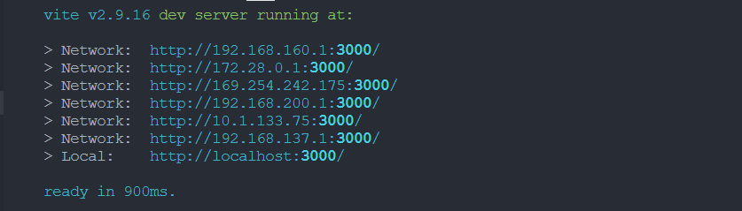
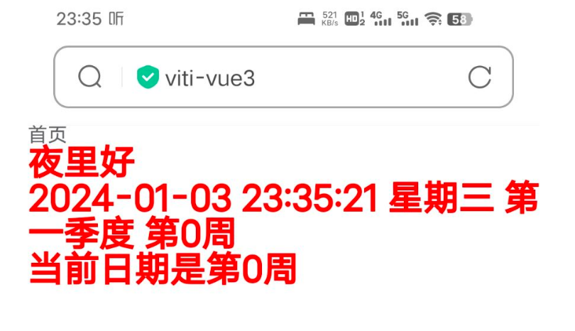
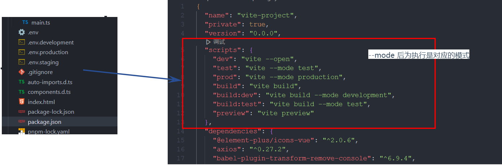
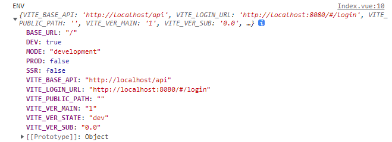
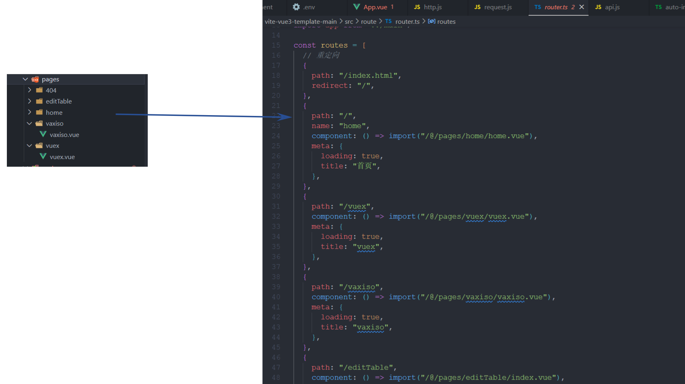
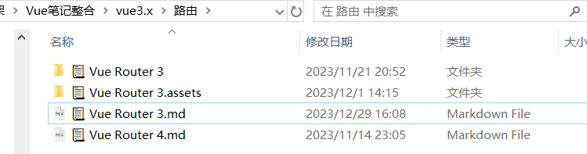
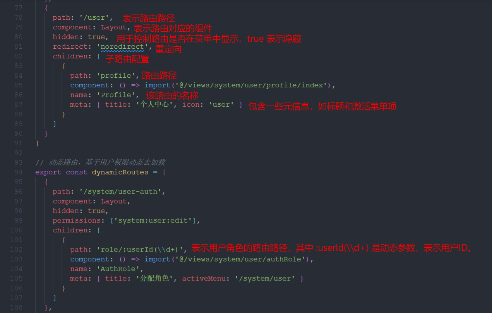
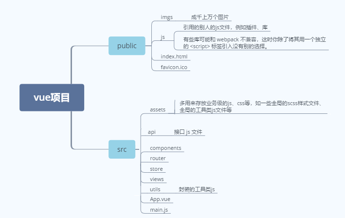
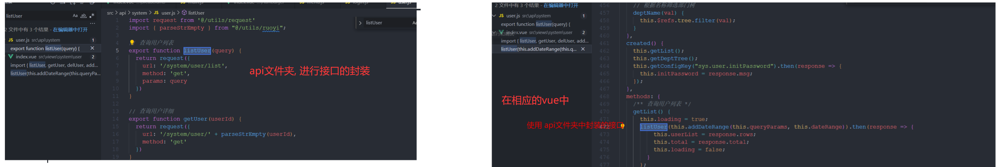
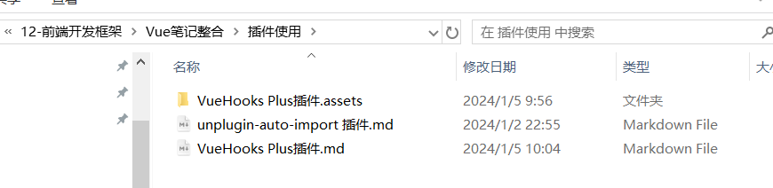

# 总览

```js
vite-vue3-template-main
├─ .env
├─ .env.development
├─ .env.production
├─ .env.staging
├─ .gitignore
├─ index.html
├─ package-lock.json
├─ package.json
├─ public
│  ├─ favicon.ico
│  └─ image
│     └─ home
│        └─ 404.jpeg
├─ README.md
├─ src
│  ├─ api
│  │  └─ api.js
│  ├─ App.vue
│  ├─ assets
│  │  └─ style
│  │     ├─ common.css
│  │     └─ reset.css
│  ├─ auto-imports.d.ts // 插件自动生成 
│  ├─ components
│  │  └─ Breadcrumb
│  │     └─ index.vue
│  ├─ components.d.ts   // 插件自动生成
│  ├─ env.d.ts
│  ├─ main.ts
│  ├─ pages
│  │  ├─ edit-table
│  │  │  └─ index.vue
│  │  ├─ error
│  │  │  └─ 404.vue
│  │  ├─ home
│  │  │  └─ home.vue
│  │  ├─ vaxiso
│  │  │  └─ vaxiso.vue
│  │  └─ vuex
│  │     └─ vuex.vue
│  ├─ plugins
│  │  ├─ BackTop
│  │  │  ├─ index.ts
│  │  │  └─ MyBackTop.vue
│  │  └─ Loading
│  │     ├─ index.ts
│  │     └─ loading.vue
│  ├─ route
│  │  ├─ no-fond.ts
│  │  └─ router.ts
│  ├─ store
│  │  ├─ getters.ts
│  │  ├─ index.ts
│  │  └─ modules
│  │     ├─ count.ts
│  │     ├─ dict.ts
│  │     └─ user.ts
│  └─ utils
│     ├─ format
│     │  └─ format-time.ts
│     └─ network
│        ├─ base-url.js
│        ├─ http.js
│        └─ request.js
├─ tsconfig.json
├─ tsconfig.node.json
└─ vite.config.ts

```


```js
vite-vue3-template-main
└─ vite-vue3-template-main
   ├─ .env
   ├─ .env.development
   ├─ .env.production
   ├─ .env.staging
   ├─ auto-imports.d.ts // 插件自动生成
   ├─ components.d.ts   // 插件自动生成
   ├─ index.html
   ├─ package-lock.json
   ├─ package.json
   ├─ pnpm-lock.yaml
   ├─ public
   │  ├─ favicon.ico
   │  └─ image
   │     └─ home
   │        └─ 404.jpeg
   ├─ README.md
   ├─ src
   │  ├─ App.vue
   │  ├─ auto-import.d.ts
   │  ├─ components
   │  │  ├─ breadcrumb.vue
   │  │  ├─ MyBackTop
   │  │  │  ├─ index.ts
   │  │  │  └─ MyBackTop.vue
   │  │  └─ MyLoading
   │  │     ├─ index.ts
   │  │     └─ loading.vue
   │  ├─ components.d.ts
   │  ├─ env.d.ts
   │  ├─ main.ts
   │  ├─ network
   │  │  ├─ api.js
   │  │  ├─ baseURL.js
   │  │  ├─ http.js
   │  │  └─ request.js
   │  ├─ pages
   │  │  ├─ 404
   │  │  │  └─ NoFondPage.vue
   │  │  ├─ editTable
   │  │  │  └─ index.vue
   │  │  ├─ home
   │  │  │  └─ home.vue
   │  │  ├─ vaxiso
   │  │  │  └─ vaxiso.vue
   │  │  └─ vuex
   │  │     └─ vuex.vue
   │  ├─ route
   │  │  ├─ NoFond.ts
   │  │  └─ router.ts
   │  ├─ store
   │  │  ├─ index.ts
   │  │  └─ MyModule
   │  │     └─ user.ts
   │  ├─ style
   │  │  ├─ common.css
   │  │  └─ reset.css
   │  └─ utils
   │     └─ formatTime.ts
   ├─ tsconfig.json
   ├─ tsconfig.node.json
   └─ vite.config.ts
```

# vite.config.ts

```
   └─ vite.config.ts
```

具体内容如下:

```ts
import { defineConfig } from 'vite';
import AutoImport from 'unplugin-auto-import/vite';
import Components from 'unplugin-vue-components/vite';
import vue from '@vitejs/plugin-vue';
import { ElementPlusResolver } from 'unplugin-vue-components/resolvers';
import * as path from 'path';

export default defineConfig({
  base: './',
  // 配置插件
  plugins: [
    vue(), //vue
    // 引入unplugin-auto-import
    AutoImport({
      //引入vue 自动注册api插件
      imports: ['vue', 'vue-router', 'vuex'], // 配置需要自动导入的库
      dts: 'src/auto-import.d.ts' // 自动引入生成api的地址
    }),
    // 引入Element-plus
    AutoImport({
      //plus按需引入
      resolvers: [ElementPlusResolver()]
    }),
    Components({
      //plus按需引入
      resolvers: [ElementPlusResolver()],
      dts: 'src/components.d.ts' //自动引入生成的组件的地址
    })
    // TODO
  ],
  build: {
    minify: 'terser',
    terserOptions: {
      compress: {
        //生产环境时移除console
        drop_console: true,
        drop_debugger: true
      }
    }
  },

  resolve: {
    //配置根路径别名： import('/@/pages/login/login.vue')
    alias: {
      '/@': path.resolve(__dirname, 'src')
    }
  },
  
  // 跨域
  server: {
    //使用IP能访问
    host: '0.0.0.0',
    // 热更新
    hmr: true,
    //自定义代理规则
    proxy: {
      // 选项写法
      '/api': {
        // target: "https://admin.ccc.com",  //代理服务器路径
        // changeOrigin: true,
        // rewrite: (path) => path.replace(/^\/api/, ""),
      }
    }
  }
/*
      proxy: {
      '/api1': {// 匹配所有以 '/api1'开头的请求路径
        target: 'http://localhost:5000',// 代理目标的基础路径  //代理服务器路径
        changeOrigin: true,
        pathRewrite: {'^/api1': ''}   // 前缀,必须写
      },
      '/api2': {// 匹配所有以 '/api2'开头的请求路径
        target: 'http://localhost:5001',// 代理目标的基础路径
        changeOrigin: true,
        pathRewrite: {'^/api2': ''}   //这样配置后，当你的应用发起以 /api2 开头的请求时，代理将把请求转发到 代理目标的基础路径
      }
    }
  //changeOrigin设置为true时，服务器收到的请求头中的host为：localhost:5000
  //changeOrigin设置为false时，服务器收到的请求头中的host为：localhost:8080
  //changeOrigin默认值为true
*/
});

```

# main.ts

```
  │  ├─ main.ts
```

具体内容如下:

```ts
import { createApp } from "vue";
import App from "./App.vue";

// 引入重置与全局样式
import "./style/reset.css";
import "./style/common.css";

//导入router配置文件
import route from "/@/route/router";

//导入vuex的store配置文件
import store from "/@/store";

// 引入element-icon集合
import * as ElementPlusIconsVue from "@element-plus/icons-vue";

// 自定义loading组件
import Loading from "./components/MyLoading/index.ts";

// 自定义回到顶部组件
import BackTop from "./components/MyBackTop/index.ts";

const app = createApp(App);

// 打印环境变量
// console.log(process.env.NODE_ENV);
// 使用ElementPlusIconsVue插件图标
for (const [key, component] of Object.entries(ElementPlusIconsVue)) {
  app.component(key, component);
}

//全局注册
app.use(route).use(store).use(Loading).use(BackTop).mount("#app");

export default app; // 这里导出app的目的，是为了在后面演示js文件中使用插件
```

# 基本启动



这些地址对应于你的机器可能具有的不同网络接口和IP地址。例如，`192.168.x.x`地址通常与本地网络IP相关联。

如果你只想从本地机器访问应用，你可以安全地使用 `http://localhost:3000/`。如果你想从同一网络上的另一台设备访问它，你可以使用Vite提供的任何其他IP地址。效果:



# 模式和环境变量

```
   ├─ .env
   ├─ .env.development
   ├─ .env.production
   ├─ .env.staging
```

## `.env` 文件

Vite 使用 [dotenv](https://github.com/motdotla/dotenv) 从你的 [环境目录](https://cn.vitejs.dev/config/shared-options.html#envdir) 中的下列文件加载额外的环境变量：

```
.env                # 所有情况下都会加载
.env.local          # 所有情况下都会加载，但会被 git 忽略
.env.[mode]         # 只在指定模式下加载
.env.[mode].local   # 只在指定模式下加载，但会被 git 忽略
```

加载的环境变量也会通过 `import.meta.env` 以字符串形式暴露给客户端源码。

```
console.log(import.meta.env.VITE_SOME_KEY) // 123
console.log(import.meta.env.DB_PASSWORD) // undefined
```

## 配置

### 一、设置模式

在package.json 中设置模式



```json
  "scripts": {
    "dev": "vite --open",
    "test": "vite --mode test",
    "prod": "vite --mode production",
    "build": "vite build",
    "build:dev": "vite build --mode development",
    "build:test": "vite build --mode test",
    "preview": "vite preview"
  },
```

--mode 后为执行是对应的模式
在你的`package.json`文件中，你定义了一些用于启动、测试和构建项目的脚本。下面是这些脚本的区别：

1. **dev:**
   - 命令：`vite --open`
   - 描述：用于在开发模式下启动 Vite 服务，并且通过 `--open` 选项在浏览器中打开默认的开发服务器地址。在开发模式下，通常会有一些额外的调试和热重载功能。
2. **test:**
   - 命令：`vite --mode test`
   - 描述：用于在测试模式下启动 Vite 服务。通过使用 `--mode test` 选项，你可能会配置特定于测试环境的设置。这取决于你在项目中如何使用环境模式。
3. **prod:**
   - 命令：`vite --mode production`
   - 描述：用于在生产模式下启动 Vite 服务。通过使用 `--mode production` 选项，你可以配置生产环境中的一些特定设置。例如，在生产模式下可能会进行代码优化和压缩。
4. **build:**
   - 命令：`vite build`
   - 描述：执行 Vite 的构建命令，生成用于生产环境的最终构建。这将生成优化、压缩的代码，并准备应用程序以进行部署。
5. **build:dev:**
   - 命令：`vite build --mode development`
   - 描述：执行 Vite 的构建命令，使用 `--mode development` 选项将构建模式设置为开发模式。这可能会导致构建结果包含一些用于开发的额外信息和不进行优化的代码。
6. **build:test:**
   - 命令：`vite build --mode test`
   - 描述：执行 Vite 的构建命令，使用 `--mode test` 选项将构建模式设置为测试模式。与测试模式相关的一些特定配置可能会在这个构建中生效。
7. **preview:**
   - 命令：`vite preview`
   - 描述：用于预览生产构建的结果。这个命令可能会在本地启动一个服务器，让你可以查看最终构建的效果，类似于在生产环境中部署应用。

### 二、新建对应模式的环境文件以及环境变量

```
文件命名:  .env.[模式名]
```

例如: 

.env.development   在development模式下会自动读取该文件

```env
# just a flag  // 标志
ENV = 'development'

# base api
VITE_BASE_API='http://localhost/api'

VITE_LOGIN_URL= 'http://localhost:8080/#/login'

VITE_PUBLIC_PATH = ''

# version
VITE_VER_MAIN = '1'
VITE_VER_SUB  = '0.0'
VITE_VER_STATE = 'dev'
```

注意: 环境变量需要以 VITE_ 开头 (只有以 `VITE_` 为前缀的变量才会暴露给经过 vite 处理的代码)

### 三、在代码中使用对应的环境变量

```
语法:  import.meta.env.VITE_XXXX
```

Index.vue

```js
<script>
export default {
  name:"Index",
  setup(){
    const ENV = import.meta.env
    console.log('ENV',ENV);//获取环境变量
  }
}
</script>
```



参考: [vue3-vite 设置环境变量和模式 ](https://www.cnblogs.com/cokolxvd/p/15608549.html)

# 路由

```
│  ├─ pages
│  │  ├─ edit-table
│  │  │  └─ index.vue
│  │  ├─ error
│  │  │  └─ 404.vue
│  │  ├─ home
│  │  │  └─ home.vue
│  │  ├─ vaxiso
│  │  │  └─ vaxiso.vue
│  │  └─ vuex
│  │     └─ vuex.vue
```



## route

vue-router 主要用于创建单页应用，再结合 vue.js 的时候显得得心应手。

所谓单页面应用，只有一个页面，所以不需要跳转！除非是要做同构应用。vue所谓的路由，可以理解为一个标识，告诉vue当url是什么的时候去渲染什么路由页面。如果真的想跳转页面，直接用a标签。

具体使用见: 





```js
/**
 * Note: 路由配置项
 *
 * hidden: true                     // 当设置 true 的时候该路由不会再侧边栏出现 如401，login等页面，或者如一些编辑页面/edit/1
 * alwaysShow: true                 // 当你一个路由下面的 children 声明的路由大于1个时，自动会变成嵌套的模式--如组件页面
 *                                  // 只有一个时，会将那个子路由当做根路由显示在侧边栏--如引导页面
 *                                  // 若你想不管路由下面的 children 声明的个数都显示你的根路由
 *                                  // 你可以设置 alwaysShow: true，这样它就会忽略之前定义的规则，一直显示根路由
 * redirect: noRedirect             // 当设置 noRedirect 的时候该路由在面包屑导航中不可被点击
 * name:'router-name'               // 设定路由的名字，一定要填写不然使用<keep-alive>时会出现各种问题
 * query: '{"id": 1, "name": "ry"}' // 访问路由的默认传递参数
 * roles: ['admin', 'common']       // 访问路由的角色权限
 * permissions: ['a:a:a', 'b:b:b']  // 访问路由的菜单权限
 * meta : {
    noCache: true                   // 如果设置为true，则不会被 <keep-alive> 缓存(默认 false)
    title: 'title'                  // 设置该路由在侧边栏和面包屑中展示的名字
    icon: 'svg-name'                // 设置该路由的图标，对应路径src/assets/icons/svg
    breadcrumb: false               // 如果设置为false，则不会在breadcrumb面包屑中显示
    activeMenu: '/system/user'      // 当路由设置了该属性，则会高亮相对应的侧边栏。
  }
 */
```

## Vuex的store

Vuex 的主要目的是为了更有效地管理 Vue.js 应用程序中的共享状态。通过集中式的状态管理，你可以更容易地追踪状态的变化、管理应用的复杂状态逻辑，并使组件之间的通信更加明确和可维护。

```
State (状态): 在这个 store 中，有一个名为 count 的状态，初始值为 "6667777"。这个状态可以在应用程序的各个组件中共享和访问。
Getter (获取器): Vuex 允许你定义 getters 来获取 store 中的状态。在这里，有一个名为 getCount 的 getter，用于获取 count 的当前值。
Mutation (突变): Mutations 是用于修改状态的同步函数。在这里，有一个名为 increment 的 mutation，用于将 count 值增加 1。
Action (动作): Actions 类似于 mutations，但是可以包含异步操作。在你的示例中，actions 部分是空的，这意味着目前没有定义任何 action。
Module (模块): Vuex 允许你将 store 分割成模块，每个模块可以有自己的 state、getters、mutations 和 actions。在这里，你引入了一个名为 "user" 的模块。
```

动态路由

**menu**

```sql
CREATE TABLE `menu` (
  `id` int(11) NOT NULL,
  `menuCode` varchar(8) DEFAULT NULL COMMENT '菜单编码',
  `menuName` varchar(16) DEFAULT NULL COMMENT '菜单名字',
  `menuLevel` varchar(2) DEFAULT NULL COMMENT '菜单级别',
  `menuParentCode` varchar(8) DEFAULT NULL COMMENT '菜单的父code',
  `menuClick` varchar(16) DEFAULT NULL COMMENT '点击触发的函数',
  `menuRight` varchar(8) DEFAULT NULL COMMENT '权限 0超级管理员，1表示管理员，2表示普通用户，可以用逗号组合使用',
  `menuComponent` varchar(200) DEFAULT NULL,
  `menuIcon` varchar(100) DEFAULT NULL,
  PRIMARY KEY (`id`)
) ENGINE=InnoDB DEFAULT CHARSET=utf8;

```

**Login.vue  登录**

```js
    //......
	methods:{

            confirm(){
                this.confirm_disabled=true;
                this.$refs.loginForm.validate((valid) => {
                    if (valid) { //valid成功为true，失败为false
                        //去后台验证用户名密码
                        this.$axios.post(this.$httpUrl+'/user/login',this.loginForm).then(res=>res.data).then(res=>{
                            console.log(res)
                            if(res.code==200){
                                // 存储
                                sessionStorage.setItem("CurUser",JSON.stringify(res.data.user))

                                console.log(res.data.menu)
                                // 状态管理模式 保存到store中
                                this.$store.commit("setMenu",res.data.menu)
                                // 跳转到主页
                                this.$router.replace('/Index');
                            }else{
                                this.confirm_disabled=false;
                                alert('校验失败，用户名或密码错误！');
                                return false;
                            }
                        });
                    } else {
                        this.confirm_disabled=false;
                        console.log('校验失败');
                        return false;
                    }
                });
            }
        }
	//......
```

**Aside.vue 侧边栏**

```js
	//...... 
	computed:{
            "menu":{
                get(){
                    //状态管理模式 在store中拿到数据
                    return this.$store.state.menu
                }
            }
        },
   //......
```

**store/index.js**

```js
import vue from 'vue'
import Vuex from 'vuex'
import router,{resetRouter} from "../router";   //引入router/index.js中暴露的router
vue.use(Vuex)

// 增加路由
function addNewRoute(menuList) {
    console.log(menuList)
    let routes = router.options.routes
    console.log(routes)
    routes.forEach(routeItem=>{
        if(routeItem.path=="/Index"){
            // 在index路由下添加动态路由
            menuList.forEach(menu=>{
                let childRoute =  {
                    path:'/'+menu.menuclick,
                    name:menu.menuname,
                    meta:{
                        title:menu.menuname
                    },
                    component:()=>import('../components/'+menu.menucomponent)
                }

                routeItem.children.push(childRoute)
            })
        }
    })

    resetRouter()
    router.addRoutes(routes)
}

export default new Vuex.Store({
    state: {
        menu: []
    },
    mutations: {
        setMenu(state,menuList) {
            state.menu = menuList
            // 添加路由
            addNewRoute(menuList)
        }
    },
    getters: {
        getMenu(state) {
            return state.menu
        }
    }
})
```

**router/index.js**

```js
//......
const router = new VueRouter({
    mode:'history',
    routes
})

// resetRouter 作用清空源路由
export function resetRouter() {
    router.matcher = new VueRouter({
        mode:'history',
        routes: []
    }).matcher
}

const VueRouterPush = VueRouter.prototype.push
VueRouter.prototype.push = function push (to) {
    return VueRouterPush.call(this, to).catch(err => err)
}

export  default router;
```

# Vuex-store


# 组件

```
│  ├─ components
│  │  └─ Breadcrumb
│  │     └─ index.vue
```

**理解：组件实现的效果在页面中嵌入别的部分的页面，通常是 Header.vue，Content.vue, Bottom.vue等公共的**

# 样式

```
│  ├─ assets
│  │  └─ style
│  │     ├─ common.css
│  │     └─ reset.css
```

# public

```
   ├─ public
   │  ├─ favicon.ico
   │  └─ image
   │     └─ home
   │        └─ 404.jpeg
```



# 插件

```
│  ├─ plugins
│  │  ├─ BackTop
│  │  │  ├─ index.ts
│  │  │  └─ MyBackTop.vue
│  │  └─ Loading
│  │     ├─ index.ts
│  │     └─ loading.vue
```

# 工具包

```
│  └─ utils
│     ├─ format
│     │  └─ format-time.ts
│     └─ network
│        ├─ base-url.js
│        ├─ http.js
│        └─ request.js
```

## network

```js
   │  ├─ network
   │  │  ├─ api.js
   │  │  ├─ baseURL.js
   │  │  ├─ http.js
   │  │  └─ request.js
```

baseURL.js   —>  http.js  —>  request.js  –>  api.js

*实际使用的API的基础URL*

 *封装axios*

*封装 get/post/...*

# api

```
├─ src
│  ├─ api
│  │  └─ api.js
```

##  常见请求使用的方案

- 二次封装 `axios`、文件夹统一管理API请求，返回一个 `Promise`，在组件中使用链式调用
- 二次封装 `axios`、文件夹统一管理API请求，返回一个 `Promise`，在组件中使用 `async/await` 使用
- 二次封装axios、全局注入axios,组件内直接调用中这个实例去传参数调用
- 直接使用 axios 请求（重复繁杂的代码，不利于维护，这里只做举例，不推荐 ❌）

## 手动封装的方式



src/api/system/user.js

```js
// 查询用户列表
export function listUser(query) {
  return request({
    url: '/system/user/list',
    method: 'get',
    params: query
  })
}
```

src/page/system/user.vue

```vue
<template>
    <button @click="getList">点击发起请求</button>
</template>
  
<script setup lang='ts'>
 	 import { listUser} from "@/api/system/user";
    
     const getList = () =>{
      	this.loading = true;
        // 调用src/api/system/user.js中定义的接口
        listUser(this.addDateRange(this.queryParams, this.dateRange)).then(response => {
            this.userList = response.rows;
            this.total = response.total;
            this.loading = false;
        });
     }
</script>
  
<style>
</style>
```

## **直接使用 VueHooks Plus 推荐**

[✨ 特性 | VueHook Plus (gitee.io)](https://inhiblab-core.gitee.io/docs/hooks/guide/)

详情笔记见:  


