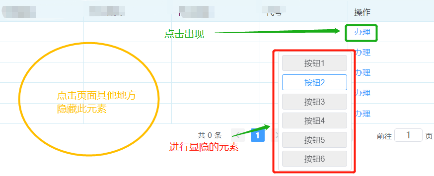

# #说明

实际上不仅是vue,只要是能用js写的都能用这个思路(react、原生),这里是按照vue给出示例

假定有一个需求: 

* 当你点击某个按钮时出现一个 **自定义元素** 它可以是一个弹窗、图片或者其他
* 当我点击除了这个 **自定义元素** 的其他区域时,关闭它



下面将一步一步地实现上图中效果

# 一、实现点击时,元素出现在鼠标位置

1. 首先定义并写好 悬浮窗元素以及样式,重点需要将其设置为 `position: fixed;`
2. 编写一个函数,点击时触发: 获取当前鼠标的 X、Y轴位置,并将其存到 data中
3. 将此data绑定到悬浮元素的 `style`中

```vue
<template
  <el-button :size="$size" plain @click="showDtl"点击出现弹窗</el-button
    <div
      class="sort-buttons"
      v-show="sortShow"
      :style="{'left':sortPlace.left,'top':sortPlace.top}"
    
        <!-- 这里面就随意了,随便怎么写 --
      <div
        <el-button :size="$size" plain @click="addNewExpert"按钮1</el-button
      </div
      <div
        <el-button :size="$size" plain @click="addNewExpert"按钮2</el-button
      </div
      <div
        <el-button :size="$size" plain @click="addNewExpert"按钮3</el-button
      </div
      </div
    </div
</template
<script
 export default {
   data () {
    return {
       // 绑定弹窗出现的位置
      sortPlace: {
        left: '0px', top: '0px'
      }, 
      //确定是否显隐
      sortShow: true,
    }},
   methods:{
    // 绑定显示弹窗
    showDtl (event) {
      const e = event || window.event
      //此处是否减去完全看个人,我是为了更美观,放到左侧去
      this.sortPlace = { left: (e.clientX - 120) + 'px', top: e.clientY + 'px' }
      this.sortShow = true
    },
   }
 }
</script
<style scoped lang="scss"
.sort-buttons {
  display: flex;
  flex-flow: column;
  align-items: center;
  justify-content: center;
  width: 118px;
  border: 1px gainsboro solid;
  padding: 5px;
  border-radius: 3px;
  position: fixed;
  background-color: #ffffff;
  z-index: 999;
  opacity:1;

 /*为何多一层div? elementui自带两个button中有间隔,为了消除这个 */
  div {
    padding: 0;
    button {
      width: 105px;
      background-color: #eeeeee;
      display: flex;
      justify-content: center;
    }
    /*每个按钮添加下边距*/
    margin-bottom: 5px;
    /*最后一个按钮取消下边距*/
    &:last-child {
      margin-bottom: 0px;
    }
  }
}
</style
```

###### 至此,点击出现弹窗,且弹窗位置出现在点击时的位置,`但怎么关闭呢?`

# 二、实现点击其他位置,隐藏自定义div

1. 首先在 **整个模块组件(点击隐藏生效范围)** 中添加一个 `hidePanel事件` : 只要在这个整体模块下的点击事件都能监听到,并进行处理
2. 给不需要点击隐藏的部分加上一个`类`或者`id`: 当点击带有这种`class`或`id`的元素时,不会隐藏自定义元素
3.  定义 `hidePanel事件`: 
   - 首先获取绑定了`class `的所有元素
   - 随后每次点击时判断是否点击了这些元素,如果不是,则将自定义元素隐藏即可

###### 这里只给出区别代码,最后会完整给出代码

```vue
<template
<!-- 假设这个div就是需要点击隐藏的最外层模块,给他绑定事件 --
<div @click="hidePanel"
  <el-button :size="$size" plain @click="showDtl"点击出现弹窗</el-button
    <!-- 注意,这里class名新增了一个 `show-sort-btn` --
	<div
      class="sort-buttons  show-sort-btn"
      v-show="sortShow"
      :style="{'left':sortPlace.left,'top':sortPlace.top}"
    
      </div
 </div
</template
<script
    export default {
        methods:{
      		hidePanel (event) {
                //这里可以自定义,如果是唯一的id,则不用遍历
     			 let btn = document.querySelectorAll('.show-sort-btn')
   	  			 let flag = false
    			  // 将nodeList转换为真正的数组
    			  btn = [...btn]
     			 // 遍历转换后的数组,判断点击的是否是出现
     			 btn.map(item = {
     			   if (item.contains(event.target)) flag = true
    			  })
   		  	 // 如果点击的不是赋予此类名的元素,则隐藏
   		  	 if (!flag) this.sortShow = false
   		 	},
        }
    }
</script
```

###### 至此,功能已经实现

# 三、完整代码

```vue
<template
<!-- 假设这个div就是需要点击隐藏的最外层模块,给他绑定事件 --
<div @click="hidePanel"
  <el-button :size="$size" plain @click="showDtl"点击出现弹窗</el-button
        <!-- 注意,这里class名新增了一个 `show-sort-btn` --
    <div
      class="sort-buttons   show-sort-btn"
      v-show="sortShow"
      :style="{'left':sortPlace.left,'top':sortPlace.top}"
    
        <!-- 这里面就随意了,随便怎么写 --
      <div
        <el-button :size="$size" plain @click="addNewExpert"按钮1</el-button
      </div
      <div
        <el-button :size="$size" plain @click="addNewExpert"按钮2</el-button
      </div
      <div
        <el-button :size="$size" plain @click="addNewExpert"按钮3</el-button
      </div
      </div
    </div
</div
</template
<script
 export default {
   data () {
    return {
       // 绑定弹窗出现的位置
      sortPlace: {
        left: '0px', top: '0px'
      }, 
      //确定是否显隐
      sortShow: true,
    }},
   methods:{
    // 绑定显示弹窗
    showDtl (event) {
      const e = event || window.event
      //此处是否减去完全看个人,我是为了更美观,放到左侧去
      this.sortPlace = { left: (e.clientX - 120) + 'px', top: e.clientY + 'px' }
      this.sortShow = true
    },
       //隐藏方法
     hidePanel (event) {
        //这里可以自定义,如果是唯一的id,则不用遍历
     	let btn = document.querySelectorAll('.show-sort-btn')
   	  	let flag = false
    	//此处用赋值解构的用意: 将nodeList转换为真正的数组
    	btn = [...btn]
     	 // 遍历转换后的数组,判断点击的是否是出现
     	 btn.map(item = {
     		if (item.contains(event.target)) flag = true
    	 })
   		 // 如果点击的不是赋予此类名的元素,则隐藏
   		  if (!flag) this.sortShow = false
   		},       
   }
 }
</script
<style scoped lang="scss"
.sort-buttons {
  display: flex;
  flex-flow: column;
  align-items: center;
  justify-content: center;
  width: 118px;
  border: 1px gainsboro solid;
  padding: 5px;
  border-radius: 3px;
  position: fixed;
  background-color: #ffffff;
  z-index: 999;
  opacity:1;

 /*为何多一层div? elementui自带两个button中有间隔,为了消除这个 */
  div {
    padding: 0;
    button {
      width: 105px;
      background-color: #eeeeee;
      display: flex;
      justify-content: center;
    }
    /*每个按钮添加下边距*/
    margin-bottom: 5px;
    /*最后一个按钮取消下边距*/
    &:last-child {
      margin-bottom: 0px;
    }
  }
}
</style
```


