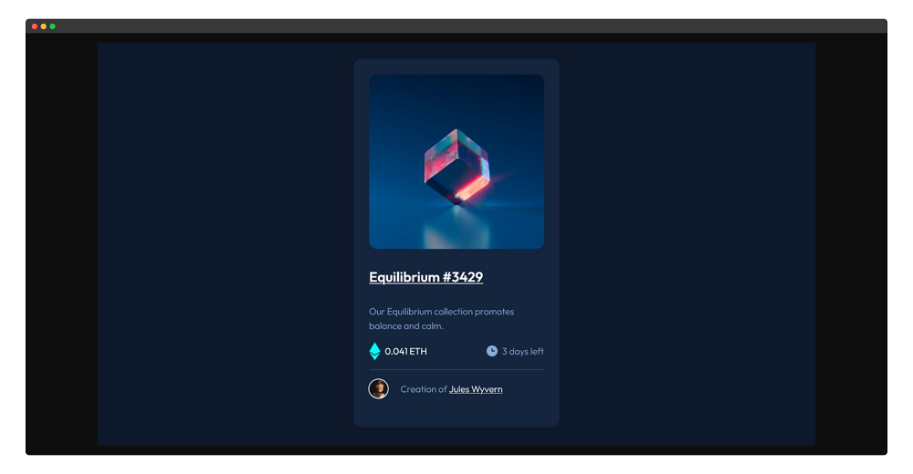

[Vue 组件库大对比 Element, iView, HeyUI, Ant Design Vue](https://zhuanlan.zhihu.com/p/78243584)

# CSS 动画库

Animate.css官网 


传送门：https://animate.style/

## 使用

### 1.引入库

用npm安装

```c
npm install animate.css --save
```

```javascript
//main.js
import 'animate.css';
```

### 2. 使用方法

在 transition 标签中给对应动作的类名加上动画库中的类就行啦。

`leave-active-class 消失时候的效果动画`

`enter-active-class 显示时候的效果动画`

`其次需要注意的是，在添加动画前需要在动画名前加入animate.css的前缀animate__animated`

代码如下（示例）：

```html
<!-- 两个按钮 login register -->
            <div>
                <transition leave-active-class = 'animate__animated animate__fadeOutLeft' mode="out-in">
                    <button @click="goToLogin()" v-if="goOut">Login</button>
                </transition>

                <transition leave-active-class = 'animate__animated animate__fadeOutRight' mode="out-in">
                    <button @click="goToRegister()" v-if="goOut">Register</button>
                </transition>
            </div>
```

值得注意的是：需要将要使用动画的标签或组件加入到 transition标签当中、其次加入的标签需要有显示或者不显示的触发，比如v-if条件满足就显示...

或者

```html
  <div
    enter-active-class="animate__animated animate__bounce"
    leave-active-class="animate__animated animate__bounce"
  >
    将要添加动画效果的dom元素
  </div>
```

## 搭配 wow.js:滚动时显示动画

### 安装

```typescript
npm install wow.js

npm i animate.css
```

### 引入

在main.ts文件中引入

```typescript
// 引入动画库
import "animate.css"
```

#### 全局引入

在main.ts 或者App.vue中[初始化](https://so.csdn.net/so/search?q=初始化&spm=1001.2101.3001.7020)

```typescript
import WOW from 'wow.js';

  let wow = new WOW({
  boxClass: 'wow', // animated element css class (default is wow)
  animateClass: 'animated', // animation css class (default is animated)
  offset: 0, // distance to the element when triggering the animation (default is 0)
  mobile: true, // trigger animations on mobile devices (default is true)
  live: true, // act on asynchronously loaded content (default is true)
  callback: function (box: any) {
    // the callback is fired every time an animation is started
    // the argument that is passed in is the DOM node being animated
  },
  scrollContainer: null, // optional scroll container selector, otherwise use window
  });
wow.init();

```

#### 局部引入

##### 在需要的组件中引用wow.js

```typescript
import WOW from 'wow.js';
```

# Universe | 漂亮开源免费的 UI 组件库

[](https://img.bossdesign.cn/2022/09/2022091315100989.png)

 

[Universe](https://www.bossdesign.cn/tag/universe/) 一个开源免费的 UI 组件库，由 HTML&CSS 组成，为前端开发人员提供了全面有趣的 UI 元素，只需要复制粘贴代码到 Web 或者应用里面，帮你轻松节省创作 UI 组件的时间和精力，无需花费一分钱，就能使用漂亮细腻的 UI 组件，这里的 UI 组件包含了按钮、复选框、开关、卡片、加载、输入等六种组件类型，让写代码就像拼积木一样简单，如果你是开发人员可不要错过这么不错的资源哦。

[](https://img.bossdesign.cn/2022/09/2022091315101065.png)

[Explore 3000+ Free UI Elements: CSS & Tailwind (uiverse.io)](https://uiverse.io/)

# Box Shadow | 前端开发 CSS 阴影效果生成器

[Box Shadow](https://www.bossdesign.cn/tag/box-shadow/) 前端开发人员必备的 CSS 阴影效果生成工具，又称[盒子阴影](https://www.bossdesign.cn/tag/盒子阴影/)，通过创建阴影效果让你的网页元素更加立体、真实，以及提升视觉注意力，Box Shadow 这个在线制作阴影效果的工具实在太实用了，只需简单调节阴影偏移坐标、模糊程度、偏移程度、阴影颜色就可以创建非常舒服的阴影效果，同时可以制作多个阴影效果，让你的网页元素，比如按钮，更加真实，增加点击欲望。

[](https://img.bossdesign.cn/2021/11/2021110116135322.jpg)

如果你觉得自己制作的阴影效果不喜欢，也可以直接使用 Box Shadow 提供的模板哦，喜欢那种类型的 CSS 阴影效果，直接单击复制代码到剪切板，随时用到你的网页设计或者应用界面里面，非常的给力，马上收藏咯。

[](https://img.bossdesign.cn/2021/11/2021110116135388.jpg)

## Box Shadow官网

> 传送门：https://box-shadow.art/

# Code House | 开发人员必备代码屋

我们知道现在很多的在线设计工具，都是经过后端开发人员用心的搭建起来，我们才能轻松使用，制作图标、海报、CSS 颜色搭配等等，下面就让 Boss 分享一个属于开发人员的工具箱吧。

[](https://img.bossdesign.cn/2021/07/2021070414411489.jpg)

 

[Code House](https://www.bossdesign.cn/tag/code-house/) 一个为开发人员整理收集的代码工具箱，收藏来自 230 多个精心策划免费开源代码工具，如果你是开发人员一定会非常惊喜，比如 CSS 参考、HTTP 状态码表、MongoDB 备忘录等等太多了，都是 Boss 不太认识的开发人员工具，帮助开发人员提供效率，减少踩坑，二次开发，如果你是开发人员，你一定会收藏哦。

[](https://img.bossdesign.cn/2021/07/2021070414411239.jpg)

 

## Code House官网

> 传送门：https://codehouse.vercel.app/

 

# 14款前端开发人员不容错过的设计工具

## Affinity Designer

一款专业的图形设计软件，如果您一直使用 Adobe 的产品，比如 PS 和 AI，不妨尝试新版的 [Affinity Designer](https://affinity.serif.com/en-gb/designer/) 可能会给您带来不一样的设计体验哦。结合 Sketch 和 Figma 让您最快速的处理照片和图形，这是一款让您看到正在突破技术创新的软件。

[](https://affinity.serif.com/en-gb/designer/)

 

## Affinity Photo

[Affinity Photo](https://affinity.serif.com/en-gb/photo/) 在处理照片方面比 PS 软件还强大的软件，可能就是这款，适应当今时代的高效专业的修图软件，提供一套有用的修饰工具和专业功能，可以完全替代 PS 的专业图片处理神器。

[](https://affinity.serif.com/en-gb/photo/)

 

## TinyPng

[TinyPng](https://www.bossdesign.cn/tinypng/) 不用多说，Boss 一直在使用的在线图片压缩神器，能够对 JPG 和 PNG 格式的图片减少至少一半的体积，而不会造成图片质量损失，堪称无损图片压缩在线神器。

[](https://tinypng.com/)

 

## Khroma

一款非常使用的色彩工具，[Khroma](http://khroma.co/) 可以帮助眼睛在接近颜色之前热身，并找到一个起点，然后可以完善。比较之前和之后的设计作品，然后选择一种更干净、更生动、更有趣的颜色。

[](http://khroma.co/)

## Atom

[Atom](https://atom.io/) 是一款开源很好的代码编辑器，GitHub 专为程序员开发的跨平台代码编辑器，具有简洁、直观的图形化用户界面，支持多平台的网页编程语言，开发人员不能忽视的文本编辑器。

[](https://atom.io/)

 

## CodeKit

[CodeKit](https://codekitapp.com/) 是一款被誉为前端开发“神器”的 Web [前端开发工具](https://www.bossdesign.cn/tag/前端开发工具/)，功能非常强大，支持最流行的框架技术，如支持 Less, Sass, Stylus, CoffeeScript, Typescript, Jade, Haml, Slim, Markdown & Javascript 等语言的编译，具有浏览器自动刷新、各种前端开发框架自动安装 (Bootstrap, jQuery）等等功能。

[](https://codekitapp.com/)

## MAMP

[MAMP](https://www.mamp.info/en/mac/) 一个允许您运行本地服务器环境的工具，这意味着可以运行 PHP 和 MySQL，而无需通过 FTPing 到服务器来测试更改。

[](https://www.mamp.info/en/mac/)

 

## Dash

[Dash](https://kapeli.com/dash) 是一个用于构建基于 Web 的应用程序的 Python 库，无需 JavaScript 。 Dash 同时也是用于创建分析 Web 应用程序的用户界面库。

[](https://kapeli.com/dash)

 

## LambdaTest

[LambdaTest](https://www.lambdatest.com/) 是一个在线平台，它允许你在 2000 多个浏览器和操作系统上实时执行自动化和实时交互的跨浏览器测试。

[](https://www.lambdatest.com/)

 

## Sass

世界上最成熟、稳定、强大的专业级 CSS 扩展语言。通过 [Sass](https://sass-lang.com/)(Scss) 来改变前端工程师，提高效率，降低成本。

[](https://sass-lang.com/)

 

## Craft CMS

如果说选一个更优秀的解决方案来替代 WordPress+Woocommerce, 那一定是 [Craft CMS](https://craftcms.com/) + Craft Commerce。它是一个既优雅又强大的 PHP 商业开源系统，是大多数五百强公司首选内容管理系统加品牌自营电商解决方案。

[](https://craftcms.com/)

 

## Vue.js

一套构建用户界面的渐进式框架。[Vue.js](https://vuejs.org/) 提供了一种帮助我们快速构建并开发前端项目的新的思维模式。

[](https://vuejs.org/)

 

## Ulysses

[Ulysses](https://ulysses.app/) 一款拥有强大的文档管理功能的写作工具，让你专注于写作，让你大脑所思所想都能够通过这个软件完美的书写下来，喜欢的朋友们可千万不要错过哦。

[](https://ulysses.app/)

 

## Screenshot Plus

一款可以轻易地截取屏幕画面的工具，当您需要将十几个网站截图的时候，花费大量的时间截取和保存，然后编辑，而 [Screenshot Plus](https://apps.apple.com/us/app/screenshot-plus/id653900948) 实现轻松一键屏幕拍照，保存到电脑指定的文件夹即可完成。

[


# Navnav | 交互性 Web 导航实例库

[Navnav](https://www.bossdesign.cn/tag/navnav/) 一个收集 Web 和 App 交互性菜单模板站，专为网页设计和开发人员、产品经理而收集的导航菜单实例，比如 3D 动效按钮、登录界面、网页导航、图表、手风琴、旋转木马等等效果的实例，非常丰富，几乎满足了网页设计所有的版块和功能，这种响应式的菜单案例非常实用，效果也非常舒服，既能满足网页设计也能应用到移动端，如果你正在寻找这方面的响应导航案例，这个网站完全满足你的需求哦。

[](https://img.bossdesign.cn/2021/08/2021083114095063.jpg)

 

## Navnav官网

> 传送门：https://navnav.co/


# cssbuttons | 前端开发人员必备 CSS 按钮组件

直接使用按钮案例到网页中。

[](https://img.bossdesign.cn/2021/12/2021120213154187.jpg)

 

[cssbuttons](https://www.bossdesign.cn/tag/cssbuttons/) 完美 CSS 组件案例库，包含按钮、复选框、开关三种 CSS 组件类型，每一款按钮都接近完美展示，自然流畅如丝滑溜般，可以说是当今 H5 页面最棒的 CSS 组件案例，并且所有的组件都是开源免费使用，可以直接复制 HTML 和 CSS 代码应用到你的 Web 项目或者应用程序里，这么棒的开放资源，作为前端开发人员的你可不要错过哦。

[](https://img.bossdesign.cn/2021/12/2021120213154088.jpg)

 

## cssbuttons官网

> 传送门：https://cssbuttons.io/

# Animista | 前端开发人员制作动画效果的神器

想要分辨出一个效果生硬的动画和恰到好处的动画之间的区别是很容易的。但是我们在手动调整动画的关键帧或过渡是相当耗时的。那么 [Animista](https://www.bossdesign.cn/tag/animista/) 提供了一个动画生成和转场效果库，你可以开箱即用。有很多预设常见的 [CSS 动画](https://www.bossdesign.cn/tag/css-动画/)效果，比如文本放大，按钮动作和背景效果等等。一旦你生成了一个动画效果，你就可以复制粘贴该动画的 CSS 片段，以及由 Autoprefixer 生成的代码，应用到你的网页项目或者应用里面，让您的用户体验变得更加如鱼得水。

[](https://img.bossdesign.cn/2022/01/2022012714411273.png)

 

CSS Wand 提供了悬停和加载动画，但你也可以使用 Ladda 动画（内置加载指示器的按钮）和 Eric Spinners （与 Vue.js 集成）。也许你还想用 Boop！为悬停过渡添加一个异想天开的效果。PS：记住用伪元素进行缩放，建议减少复杂的动画运动，让用户体验更加舒适。

[](https://img.bossdesign.cn/2022/01/2022012714411184.png)


## Animista官网

> 传送门：https://animista.net/


[](https://img.bossdesign.cn/2022/06/2022062616373868.png)

 

[CSS Layout](https://www.bossdesign.cn/tag/css-layout/) 一个国外现代 CSS 布局项目，涵盖了现代互联网最流行的 UI 模式，全部的 CSS 布局案例都是纯 CSS 代码编写，不依赖任何外部库和 JS 脚本，通过最精简的 CSS 代码实现最好效果的 Web 页面，只需要单击任意一个 CSS 布局案例，就可以获取到 CSS 代码片段，完全可以复制粘贴到你的网页设计项目，多练习多熟记，让 CSS 学习变得轻而易举~

[](https://img.bossdesign.cn/2022/06/2022062616373981.png)

 

## CSS Layout官网

> 传送门：https://csslayout.io/


# Freefrontend | 前端开发者必备 Codepen 前端案例

前端开发需要掌握多种语言和工具，例如 HTML、CSS、JavaScript、框架、库、编辑器等，懂得挺多，但是有时候很苦逼，需要学习新的技术和工具，同时写出来的代码还要适应不同的浏览器和设备，解决各种各样的问题和 bug，还有甲方爸爸的各种新需求，怎么办？作为一个前端开发者，需要保持学习的动力，不断寻找一些能够激发灵感和提高的技能的资源。今天 Boss 分享一个让你大开眼界的优秀前端资源站。

[](https://img.bossdesign.cn/2023/04/2023040315565197.png)

 

[Freefrontend](https://www.bossdesign.cn/tag/freefrontend/) 收集整理了前端设计师必备的 Codepen 前端案例，包含各种各样的 HTML 和 CSS 代码示例，比如 CSS 卡片、表单、分隔符、按钮、个人资料卡片等等，除此之外还有更多的前端示例可以在 Freefrontend 上找到，目的是帮助前端开发者找到灵感和学习新前端技术，让前端开发学习不用的风格，同时提供丰富的案例模板，快速应用到设计项目里面，有需要的小伙伴赶紧来学习吧。

[](https://img.bossdesign.cn/2023/04/2023040315562041.png)

 

## Freefrontend网址

> 传送门：https://freefrontend.com/