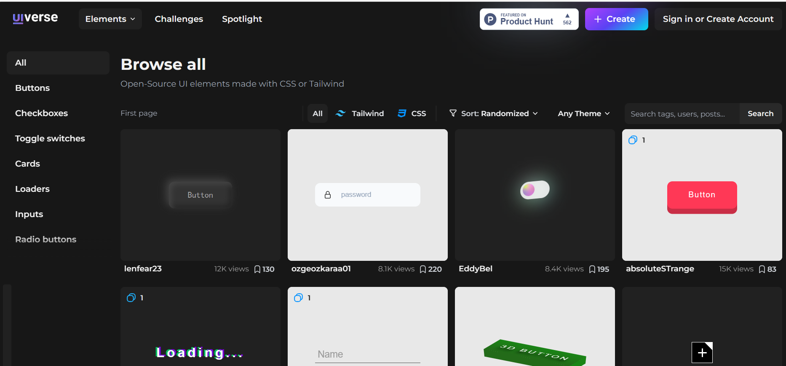
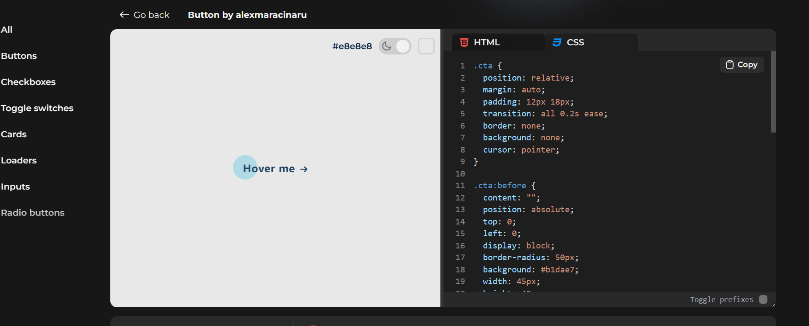
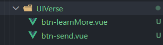
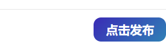

官网:[Explore 3000+ Free UI Elements: CSS & Tailwind (uiverse.io)](https://uiverse.io/)







### 使用

**src\components\UIVerse\btn-send.vue**



封装成插槽

```vue
<template>
  <button>
    <slot></slot>
  </button>
</template>

<script setup lang="ts">
</script>

<style scoped lang="less">
button {
  background: linear-gradient(-45deg, #3f00b5, #9f69fe, #27c8b7, #3f00b5);
  background-size: 800% 400%;
  padding: 1em 1em;
  border: none;
  border-radius: 10px;
  font-size: 16px;
  font-weight: 700;
  color: white;
  transition: all 0.5s ease-in-out;
  animation: gradient 10s infinite cubic-bezier(0.62, 0.28, 0.23, 0.99) both;
  display: flex;
  align-items: center;
  height: 32px; /* 设置按钮高度为 50 像素 */
}

button:hover {
  animation: gradient 3s infinite;
  transform: scale(1.05);
}

button:active {
  animation: gradient 3s infinite;
  transform: scale(0.8);
}

@keyframes gradient {
  0% {
    background-position: 0% 50%;
  }

  50% {
    background-position: 100% 50%;
  }

  100% {
    background-position: 0% 50%;
  }
}
</style>
```

使用

```vue
<BtnSend class="btnSend" @click="commentSubmit">
    <template #default>
		点击发布
    </template>
</BtnSend>
```

