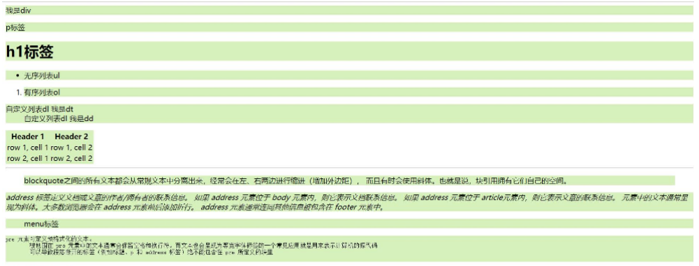
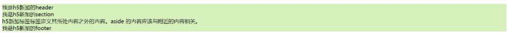
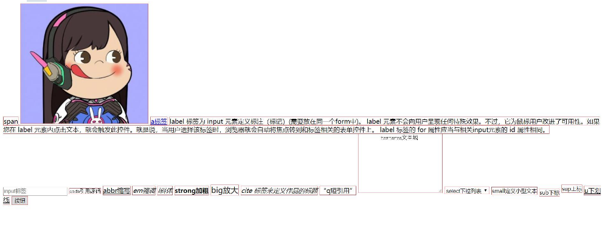

# 一、HTML 简介

 **文件的命名规则**

+ 名称全部用小写英文字母、数字、下划线的组合，其中不得包含汉字、空格和特殊字符（@#￥%…！&）
+ 必须以英文字母开头
+ 网站的首页必须命名为index.html，不能使用shouye.html

**Emmet插件**

+ 自动生成HTML代码片段

**注释**

+ 注释为代码的阅读者提供帮助

+ 注释的写法：例如：注释<!-- 注释 -->（快捷键：ctrl+/）

前端框架:  JQuery，Vue，React等

# 二、HTML 文档结构

```html
<!DOCTYPE html><!-- 声明文档类型是html（也就是告诉编辑器，接下来的语法标，准按照HTML的规则来解析） -->
<html lang="en"><!-- html开始 -->
<!-- html language='english'  html是使用英文编译的 -->

<head><!-- 头部开始 -->
    <meta charset="UTF-8">
    <!-- 
        * 编码格式为万国码 utf-8 解决乱码
        * 中文是 GBK / GB2312 
    -->
    <title>网站标题</title>
</head><!-- 头部结束 -->

<body><!-- 主体开始 -->
    <!-- 这里面写所有的标签 你的文字、图片都必须放在这里面 -->
</body><!-- 主体结束 -->

</html><!-- html结束 -->
```

# 三、元素(标签、标记)

**<> 中的第一个单词叫标记，也叫标签，也叫元素**

+ 元素(标签)一般都是成对出现的

+ 闭合元素(标签)里面先写一个斜杠“/”，代表这个标签的内容到此结束

+ 元素分类

  - 封闭类型标签	<body></body>	

  - 非封闭类型标签(空标签, 单标签) 	<meta/>


+ 单标签两种写法：  

  ```html
  <meta charset="UTF-8">
  <meta charset="UTF-8"/>
  ```

**元素 =  起始标记  （begin tag）+  元素内容  +  元素属性  +  结束标记（end tag）**

+ 语法:  `<标签 元素属性> 元素内容 </标签>`

+ 元素属性 = 属性名  +  属性值
  + 局部属性：某些元素特有的属性
  + 全局属性：所有元素通用
  + 可以有多个属性，排名不分先后，空格隔开
  
+ 元素内容:  文本数据

+ ```html
  <a href="http://www.baidu.com" title="百度一下，你就知道">百度</a>
  ```

 **元素嵌套原则**

<strong style="color:red">块级元素包行内元素，反之不行。块级元素p标签不能包任何块级元素</strong>

```html
<!-- 既是标题有又是超链接 -->
<h2>
  <a href="https://www.baidu.com/">标题</a> 
</h2>
```

# 四、**常用标签-块状元素**

<strong style="color:red">块级元素特点：独占一行，能设置宽高</strong>

## 布局标签 `<div>`

HTML+CSS在很久之前也被称为div+CSS，所以可见div在HTML中的重要性

特点：

+  独占一行，用作容器，给页面划分板块,

<iframe height="300" style="width: 100%;" scrolling="no" title="Untitled" src="https://codepen.io/Auroraol/embed/abXKYVE?default-tab=html%2Cresult&editable=true" frameborder="no" loading="lazy" allowtransparency="true" allowfullscreen="true">
  See the Pen <a href="https://codepen.io/Auroraol/pen/abXKYVE">
  Untitled</a> by Aurora  (<a href="https://codepen.io/Auroraol">@Auroraol</a>)
  on <a href="https://codepen.io">CodePen</a>.
</iframe>


## 标题标签 `<h*>`

全称：`header 1` ~ `header 6`

作用:  

- h1 是页面中最大的标题，只能出现一次，用作网页的标题
- h2-h6没有次数限制，h2 一般代表页面中大板块标题，h3代表大板块中的小板块标题，h4 比 h3权重还要小

特点：

- 独占一行
- 默认加粗
- 一级标题最大, 六级标题最小, 依次变小

<iframe height="300" style="width: 100%;" scrolling="no" title="Untitled" src="https://codepen.io/Auroraol/embed/KKJeoXM?default-tab=html%2Cresult&editable=true" frameborder="no" loading="lazy" allowtransparency="true" allowfullscreen="true">
  See the Pen <a href="https://codepen.io/Auroraol/pen/KKJeoXM">
  Untitled</a> by Aurora  (<a href="https://codepen.io/Auroraol">@Auroraol</a>)
  on <a href="https://codepen.io">CodePen</a>.
</iframe>


## 段落标签 `<p>`

全称：`paragraph`

作用:  一般包裹一段描述性的文本，比如文章段落，商品描述等

特点：

- 独占一行
- 具有段落间距

<iframe height="300" style="width: 100%;" scrolling="no" title="Untitled" src="https://codepen.io/Auroraol/embed/jOdKzYq?default-tab=html%2Cresult" frameborder="no" loading="lazy" allowtransparency="true" allowfullscreen="true">
  See the Pen <a href="https://codepen.io/Auroraol/pen/jOdKzYq">
  Untitled</a> by Aurora  (<a href="https://codepen.io/Auroraol">@Auroraol</a>)
  on <a href="https://codepen.io">CodePen</a>.
</iframe>


## 列表

列表分为：有序列表、无序列表、自定义列表

### 无序列表 ` <ul>`

全称：`unordered list`

type属性值

- type="circle" 空心圆
- type="disc" 默认值,实心圆
- type="square" 实心矩形
- none去除样式 (注意：这个对于低版本IE无效，以后`css`可以解决)

<iframe height="300" style="width: 100%;" scrolling="no" title="Untitled" src="https://codepen.io/Auroraol/embed/VwgdXyV?default-tab=html%2Cresult" frameborder="no" loading="lazy" allowtransparency="true" allowfullscreen="true">
  See the Pen <a href="https://codepen.io/Auroraol/pen/VwgdXyV">
  Untitled</a> by Aurora  (<a href="https://codepen.io/Auroraol">@Auroraol</a>)
  on <a href="https://codepen.io">CodePen</a>.
</iframe>


### 有序列表 `<ol>`

全称：`ordered list`

type属性值

- type="1" 默认值，数字
- type="a" 小写字母
- type="A" 大写字母
- type="i"  小写罗马数字
- type="I"  大写罗马数字

属性`start`

- 你想从第几个开始，属性值就写几，注意是写**数字**

<iframe height="300" style="width: 100%;" scrolling="no" title="Untitled" src="https://codepen.io/Auroraol/embed/BaMVrYa?default-tab=html%2Cresult" frameborder="no" loading="lazy" allowtransparency="true" allowfullscreen="true">
  See the Pen <a href="https://codepen.io/Auroraol/pen/BaMVrYa">
  Untitled</a> by Aurora  (<a href="https://codepen.io/Auroraol">@Auroraol</a>)
  on <a href="https://codepen.io">CodePen</a>.
</iframe>


### 自定义列表 `<dl><dt><dd>`

全称：`<dl>``definition list`

1. `<dt>``definition term`自定义列表组
2. `<dd>``definition description`自定义列表描述

<iframe height="300" style="width: 100%;" scrolling="no" title="Untitled" src="https://codepen.io/Auroraol/embed/ExrREQo?default-tab=html%2Cresult" frameborder="no" loading="lazy" allowtransparency="true" allowfullscreen="true">
  See the Pen <a href="https://codepen.io/Auroraol/pen/ExrREQo">
  Untitled</a> by Aurora  (<a href="https://codepen.io/Auroraol">@Auroraol</a>)
  on <a href="https://codepen.io">CodePen</a>.
</iframe>

## 单标签/空标记

### 水平线 `<hr/>`

### 强制换行 `<br />`

<iframe height="300" style="width: 100%;" scrolling="no" title="Untitled" src="https://codepen.io/Auroraol/embed/PoVaRQM?default-tab=html%2Cresult" frameborder="no" loading="lazy" allowtransparency="true" allowfullscreen="true">
  See the Pen <a href="https://codepen.io/Auroraol/pen/PoVaRQM">
  Untitled</a> by Aurora  (<a href="https://codepen.io/Auroraol">@Auroraol</a>)
  on <a href="https://codepen.io">CodePen</a>.
</iframe>

# 五、**常用标签-行内元素**

行内元素特点：<strong style="color:red"> 1. 在一行显示(逐行排列)，个别标签能设置宽高（常见img/input/textarea/select标签可以设置尺寸）2. 行内元素之间不论敲多少回车或者空格，只会被浏览器解析成一个空格</strong>

## 文本节点 `<span>`

作用:  用于一大段文本中某一部分字体样式的设置

好处：

+ span 包裹的文本前后不换行	
+ span 标签本身不带有任何样式

<iframe height="300" style="width: 100%;" scrolling="no" title="Untitled" src="https://codepen.io/Auroraol/embed/preview/mdvKxxg?default-tab=html%2Cresult" frameborder="no" loading="lazy" allowtransparency="true" allowfullscreen="true">
  See the Pen <a href="https://codepen.io/Auroraol/pen/mdvKxxg">
  Untitled</a> by Aurora  (<a href="https://codepen.io/Auroraol">@Auroraol</a>)
  on <a href="https://codepen.io">CodePen</a>.
</iframe>


## 超链接  `<a href="" target=""></a>`

作用: 页面之间的跳转

属性:

   - href 属性：引入页面的路径
   - target 属性：页面打开的方式
     - target="_self" 当前页面打开，默认值	
     - target="_blank" 新的标签页打开

```html
<a href="https://www.jd.com">淘宝，淘你喜欢</a>
```


### 锚链接 #、空链接 javascript:;

- 当不知道要写什么链接地址时，可以使用锚链接或者空链接

```html
<a href="#">锚链接</a>
<a href="javascript:;">空链接</a>
```

### 超链接跳转 target="_blank"

1. 浏览器默认情况下是当前页面打开；
2. 超链接是可以另起一页打开页面的；

- 注意！空链接/锚链接不可以另起一页打开页面；

```html
<a href="https://www.jd.com" target="_self">淘宝，淘你喜欢</a><!-- 默认值 -->
<a href="https://www.jd.com" target="_blank">淘宝，淘你喜欢</a><!-- 另起一页打开 -->
```

## 插入图片 <[img](https://segmentfault.com/a/1190000038989810) src="" alt="">

```

```

属性

- src 属性：引图片路径
- alt 属性：图片无法正常显示时显示的提示文本
- title 属性：鼠标滑过显示的提示信息

图片格式

- .gif 动图,支持透明
- .jpg 有损压缩,不支持透明
- .png 无损压缩,支持透明

## 加粗 `<strong>`

```html
<b>前端</b>开发
<strong>学习</strong>   <!-->有强调的意思，推荐使用-->
```

## 倾斜 `<em>`

```html
<i>倾斜 一般用于矢量图</i>
<em>倾斜 具有强调含义</em>  <!-->有强调的意思，推荐使用-->
<var>倾斜 在js有其他含义 为避免冲突 不建议使用</var>
```

## 删除线 `<del>`

```html
<s>原价998</s>
<del>原价889</del> <!-- 推荐使用-->
```

## 下划线` <ins>`

```html
<u>前端深入学习</u>
<ins>前端深入学习</ins>       <!-- 推荐使用-->
```

## 上标 `<sup>`

```html
2<SUP>3</SUP>
```

## 下标 `<sub>`

```html
H<sub>2</sub>0
```

## 转义符

<iframe height="300" style="width: 100%;" scrolling="no" title="Untitled" src="https://codepen.io/Auroraol/embed/preview/QWYxmmN?default-tab=html%2Cresult" frameborder="no" loading="lazy" allowtransparency="true" allowfullscreen="true">
  See the Pen <a href="https://codepen.io/Auroraol/pen/QWYxmmN">
  Untitled</a> by Aurora  (<a href="https://codepen.io/Auroraol">@Auroraol</a>)
  on <a href="https://codepen.io">CodePen</a>.
</iframe>


在 HTML 中不能使用小于号（<）和大于号（>），这是因为浏览器会误认为它们是标签。

| 显示结果 | 描述              | 实体名称          | 实体编号 |
| -------- | ----------------- | ----------------- | -------- |
|          | 空格              | &nbsp;            | &#160;   |
| <        | 小于号            | &lt;              | &#60;    |
| >        | 大于号            | &gt;              | &#62;    |
| &        | 和号              | &amp;             | &#38;    |
| "        | 引号              | &quot;            | &#34;    |
| '        | 撇号              | &apos; (IE不支持) | &#39;    |
| ￠       | 分（cent）        | &cent;            | &#162;   |
| £        | 镑（pound）       | &pound;           | &#163;   |
| ¥        | 元（yen）         | &yen;             | &#165;   |
| €        | 欧元（euro）      | &euro;            | &#8364;  |
| §        | 小节              | &sect;            | &#167;   |
| ©        | 版权（copyright） | &copy;            | &#169;   |
| ®        | 注册商标          | &reg;             | &#174;   |
| ™        | 商标              | &trade;           | &#8482;  |
| ×        | 乘号              | &times;           | &#215;   |
| ÷        | 除号              | &divide;          | &#247;   |

- 更完整的可以参考 [https://www.w3school.com.cn/charsets/ref_html_8859.asp](https://www.w3school.com.cn/charsets/ref_html_8859.asp)

## 废弃标签  `<font>`

- 不建议使用
- `<font color="颜色值">文字内容</font>`

# 六、行内与块元素区别

## （一）块级元素

**div、p、h1-h6、form、ul、ol、dl、dt、dd、li、table、tr、td、th、hr、blockquote、address、table、menu、pre**



**HTML5：header、section、article、footer等等**



## （二）行内元素

**span、img、a、label、code、input、abbr、em、b、big、cite、i、q、textarea、select、small、sub、sup，strong、u**  **button（display：inline-block）**




通过图片可以得知：

1.行内元素不能独占一行，与其他行内元素排成一行

2.行内元素不能设置width、height、margin、padding

3.行内元素默认宽度为其内容的宽度

4.行内元素只能包括文字或行内元素、行内块元素，不能包括块级元素

5.display：inline-block：行内块元素与行内元素属性基本相同即不能独占一行，但是可以设置width及height

## （三）区别

1）从显示效果看

- 块级元素会独占一行，其宽度自动填满其父元素宽度
- 行内元素不会独占一行，相邻的行内元素会排列在一行，直至一行排不开，才会换行，其宽度随元素的内容而变化

2）块级元素可以设置width，height属性，行内元素设置无效

- 块级元素设置了宽度、仍然是独占一行

3）块级元素可以设置margin 和 padding. 

行内元素的水平方向的padding-left,padding-right,margin-left,margin-right 都产生边距效果，

但是竖直方向的padding-top,padding-bottom,margin-top,margin-bottom都不会产生边距效果。

（**水平方向有效，竖直方向无效**）

display:block -- 显示为块级元素（块级元素默认样式）

display:inline -- 显示为行内元素（行内元素默认样式）

<iframe height="300" style="width: 100%;" scrolling="no" title="Untitled" src="https://codepen.io/Auroraol/embed/preview/RwvJMyO?default-tab=html%2Cresult" frameborder="no" loading="lazy" allowtransparency="true" allowfullscreen="true">
  See the Pen <a href="https://codepen.io/Auroraol/pen/RwvJMyO">
  Untitled</a> by Aurora  (<a href="https://codepen.io/Auroraol">@Auroraol</a>)
  on <a href="https://codepen.io">CodePen</a>.
</iframe>

## （四）总结

[块级元素]

1. 独占一行

2. 可以设置宽高

3. 可以包裹任何元素

4. 注意：
   + 标题标签之间不可以互相嵌套
   + 段落标签<P>不可以包裹其他块状元素

[行内元素]

1. 在一行显示

2. 不可以设置宽高

3. 大小由内容撑开

4. 只可以包裹行内元素，不可以包裹块状元素

# 七、表格 `<table>`

## table添加的属性

- `border="1"` 表格边框
- `width="600"` 表格总宽600px
- `height="300"` 表格总高300px
- `cellspacing="0"` 单元格外边距归零
- `cellpadding=""` 单元格内边距

```html
<table border="1" width="600" height="300" cellspacing="0" cellpadding="10">
  <tr>
    <td>1.1</td>
    <td>1.2</td>
    <td>1.3</td>
  </tr>
  <tr>
    <td>2.1</td>
    <td>2.2</td>
    <td>2.3</td>
  </tr>
</table>
```

## tr 添加的属性

全称:  table row cell 

- 整行内容水平对齐方式
  - align="left左对齐 / right右对齐 / center水平居中"
- 整行内容垂直对齐方式
  - valign="top上 / bottom下 / middle垂直居中"
- 一行的高度
  - height=""

## td 添加的属性

全称:  table data cell 

- `width=""` 某一列的宽度
- `height=""` 某一行的高度
- 单元格内容的水平对齐方式
  - align="left左对齐 / right右对齐 / center水平居中"
- 单元格内容的垂直对齐方式
  - valign="top上 / bottom下 / middle垂直居中"

## 单元格合并

- 合并列、向右合并单元格
  -  colspan="所要合并的单元格的列数"
- 合并行、向下合并单元格
  - rowspan="所要合并单元格的行数”

<iframe height="300" style="width: 100%;" scrolling="no" title="Untitled" src="https://codepen.io/Auroraol/embed/preview/poGKLKR?default-tab=html%2Cresult" frameborder="no" loading="lazy" allowtransparency="true" allowfullscreen="true">
  See the Pen <a href="https://codepen.io/Auroraol/pen/poGKLKR">
  Untitled</a> by Aurora  (<a href="https://codepen.io/Auroraol">@Auroraol</a>)
  on <a href="https://codepen.io">CodePen</a>.
</iframe>


## 表格行分组

- 表格标题 caption
- 表头 thead - tr -th 居中并加粗
- 表主体 tbody - tr -td
- 表尾 tfoot - tr -td

<iframe height="300" style="width: 100%;" scrolling="no" title="Untitled" src="https://codepen.io/Auroraol/embed/preview/XWOYEYz?default-tab=html%2Cresult" frameborder="no" loading="lazy" allowtransparency="true" allowfullscreen="true">
  See the Pen <a href="https://codepen.io/Auroraol/pen/XWOYEYz">
  Untitled</a> by Aurora  (<a href="https://codepen.io/Auroraol">@Auroraol</a>)
  on <a href="https://codepen.io">CodePen</a>.
</iframe>

# 八、表单 `<form>`

作用: 用于搜集用户信息

## 表单域

```
<form action="" method="" name=""> </form>
```

作用：用来收集用户信息

- 里面填写姓名、性别、年龄... 的信息
- 当你提交时，我`form`直接打包，把整体信息传到数据库

属性

- action="" 提交的服务器地址
- method="数据提交过去的方式" 
  - post 稳、慢、可携带数据量没有限制
  - get 快、不安全、存在数据泄露的风险（因为快，所以可携带数据有限制，不能超过4kb）
- name="" 起个名字

## Form中get & post获取数据

```
<form name="表单名称" method="post/get" action=""></form>
```

`get` 请求通常是从服务器上获取数据

`post` 请求通常表示向服务器提交数据

`get` 请求发送的数据都写在地址栏上，用户可见

`post` 请求发送的数据，用户不可见

`get` 请求不能提交大量的数据

## 表单元素

###  文本框

```html
<input type="text" name="username" value="请输入您的姓名">
```

+ name="" 起个名字

   - value="" 提示内容

### 密码框

```html
`<input type="password" name="pwd">`
```

   - name="" 起个名字

### 单选框

注意！单选按钮有一个属性`**name**`**必须写**，**并且同一组的**`**name**`**值相同**。

属性

- 默认选中 `checked="checked"`
- 禁止使用 `disabled="disabled"`
- 注意！`XHTML`必须这么写，在`HTML5`中自由一些，可简写为`checked`、`disabled`。

<iframe height="300" style="width: 100%;" scrolling="no" title="Untitled" src="https://codepen.io/Auroraol/embed/preview/vYbrRrP?default-tab=html%2Cresult" frameborder="no" loading="lazy" allowtransparency="true" allowfullscreen="true">
  See the Pen <a href="https://codepen.io/Auroraol/pen/vYbrRrP">
  Untitled</a> by Aurora  (<a href="https://codepen.io/Auroraol">@Auroraol</a>)
  on <a href="https://codepen.io">CodePen</a>.
</iframe>


### 复选框

注意！属性`name`必须写，并且同一组的`name`值相同。

属性

- 默认选中 `checked="checked"`
- 禁止使用 `disabled="disabled"`
- 注意！`XHTML`必须这么写，在`HTML5`中自由一些，可简写为`checked`、`disabled`。

<iframe height="300" style="width: 100%;" scrolling="no" title="Untitled" src="https://codepen.io/Auroraol/embed/preview/PoVaRBY?default-tab=html%2Cresult" frameborder="no" loading="lazy" allowtransparency="true" allowfullscreen="true">
  See the Pen <a href="https://codepen.io/Auroraol/pen/PoVaRBY">
  Untitled</a> by Aurora  (<a href="https://codepen.io/Auroraol">@Auroraol</a>)
  on <a href="https://codepen.io">CodePen</a>.
</iframe>


### 提交按钮

   - value=" 显示在按钮上的文本内容"
   - 会跳转到`action`所指的路径中，并提交了`form`里面所有数据

<iframe height="300" style="width: 100%;" scrolling="no" title="Untitled" src="https://codepen.io/Auroraol/embed/preview/rNPKdrG?default-tab=html%2Cresult" frameborder="no" loading="lazy" allowtransparency="true" allowfullscreen="true">
  See the Pen <a href="https://codepen.io/Auroraol/pen/rNPKdrG">
  Untitled</a> by Aurora  (<a href="https://codepen.io/Auroraol">@Auroraol</a>)
  on <a href="https://codepen.io">CodePen</a>.
</iframe>

### 重置按钮

   - value="显示在按钮上的文本内容"
   - 注意：重置按钮一定要写在`form`里面，重置的是`form`里面的内容。

```
<input type="reset" value="清除">
```

### 普通按钮

```html
<input type="button" value="更换昵称">
```

   - value="显示在按钮上的文本内容"

### 其他

8. 文件上传

```html
<input type="file">
```

9. 图像形式的提交按钮

```html
<input type="image" src="./img14.jpg">
```

   - 同时会提交点击位置的坐标

10. 隐藏域

```html
<input type="hidden" name="pp" value="11">
```

11. 下拉菜单

   - 不同的value值
   - size 显示的条数
   - selected 默认被选中

```html
<select name="cities" size="5">
  <option value="bj">北京</option>
  <option value="sh" selected>上海</option>
  <option value="gz">广州</option>
  <option value="sz">深圳</option>
</select>
```

12. 多行文本域

```html
<textarea name="" cols="40" rows="4"></textarea>
```

   - cols="40" 一行所能容纳的字符数
   - rows="4" 设置行数
   - 默认是可以通过拖拽改变元素尺寸的，CSS3提供的属性resize:none;可以禁止

13. label 关联文本

   - 方法一：label 包裹住控件与文本,但是要删除 label 的 for 属性

```html
<label>
  <input type="radio" name="" value=""> 男
</label>
```

   - 方法二：label 的 for 属性关联控件的 id 属性

```html
<div>
  <input type="radio" name="" value="" id="box">
</div>
<div>
  <label for="box">男</label> 
</div>
```

14. 表单字段集

   - 语法：<fieldset></fieldset>
   - 说明：相当于一个方框，在字段集中可以包含文本和其他元素。该元素用于对表单中的元素进行分组并在文档中区别标出文本。fieldset元素可以嵌套，在其内部可以在设置多个fieldset对象。disabled定义空间禁制可用；
- 字段级标题：
  - 语法：<legend></legend>
  - 说明：legend元素可以在fieldset对象绘制的方框内插入一个标题。legend元素必须是fieldset内的唯一个元素。

```html
<fieldset>
	<legend>标题</legend>
</fieldset>
```

## 综合代码

例子1

<iframe height="300" style="width: 100%;" scrolling="no" title="Untitled" src="https://codepen.io/Auroraol/embed/preview/mdvKxjY?default-tab=html%2Cresult" frameborder="no" loading="lazy" allowtransparency="true" allowfullscreen="true">
  See the Pen <a href="https://codepen.io/Auroraol/pen/mdvKxjY">
  Untitled</a> by Aurora  (<a href="https://codepen.io/Auroraol">@Auroraol</a>)
  on <a href="https://codepen.io">CodePen</a>.
</iframe>


例子2

<iframe height="300" style="width: 100%;" scrolling="no" title="Untitled" src="https://codepen.io/Auroraol/embed/preview/bGzKvxV?default-tab=html%2Cresult" frameborder="no" loading="lazy" allowtransparency="true" allowfullscreen="true">
  See the Pen <a href="https://codepen.io/Auroraol/pen/bGzKvxV">
  Untitled</a> by Aurora  (<a href="https://codepen.io/Auroraol">@Auroraol</a>)
  on <a href="https://codepen.io">CodePen</a>.
</iframe>

# 九、路径

1. **绝对路径**：完整的路径
   - C://images/file/girl.png
   - https://
2. **相对路径**
   - ./ 当前目录
   - ../ 返回上一级
3. **根目录**
   - /
   - 例如：`<a href="/11.html">根目录跳转</a>` 看地址栏中显示效果
     <a name="Mhuzg"></a>
