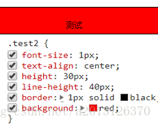
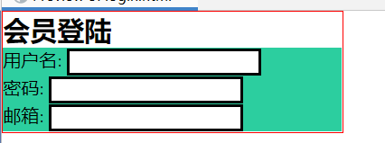
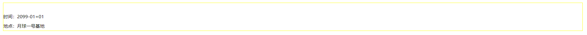
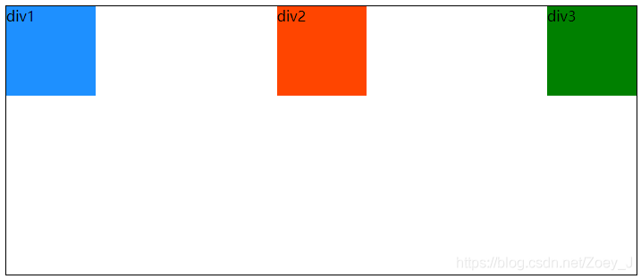
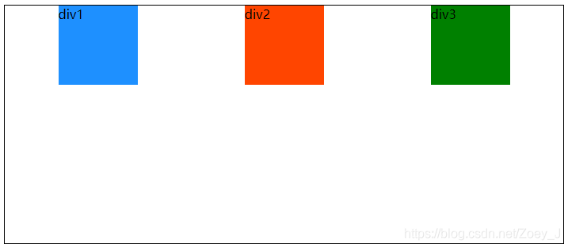
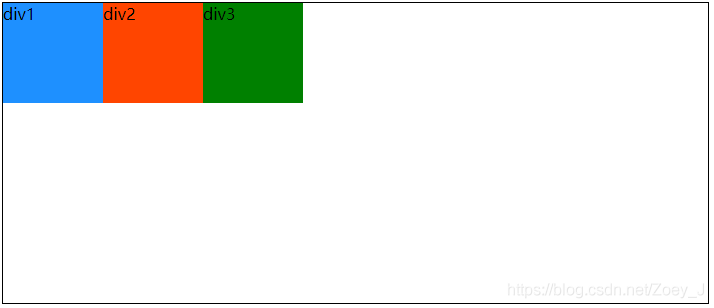

# 1、导入方式

```html
<!DOCTYPE html>
<html lang="en">
<head>
    <meta charset="UTF-8">
    <title>Title</title>

    <!--方式1:  内部样式-->
    <style>
        h1{
            color: green;
        }
    </style>

    <!--方式2:  外部样式-->
    <link rel="stylesheet" href="css/style.css" />
</head>
<body>

<!--优先级：就近原则-->
<!--行内样式：在标签元素中，编写一个style属性，编写样式即可-->
<h1 style="color: red">这是标签</h1>
</body>
</html>
```

扩展：导入式   @import是CSS2.1特有的！

```html
<!--导入式-->
<style>
        @import url("css/style.css");
</style>
```

# 2、基本选择器

## 2.1、基本选择器

### 元素选择器

+ 标签选择器：选择一类标签 标签名{}

+ 用法：
  1. 用在a标签：去掉下划线和颜色
  2. 用在li标签：去掉列表标识符
  3. 用在img标签：去掉基线对齐

```css
li { /* 代表选中了页面中所有的li */
    color: cyan;
    color: tomato;
}
```

### 类选择器

+ 类选择器class：选择所有class一致的标签，跨标签，格式：.类名{}

```css
/* .你起的class名字{} */
.colorYellow { /* 代表选中了class名字为colorYellow的元素 */
    color: yellow;
}
```

### id选择器

+ id选择器：全局唯一，格式：#id名{}

```css
/* #你起得id名字{} */
#colorPurple { /* 代表选中了id名字为colorPurple的元素 */
    color: purple;
}
```

优先级：id > class > 标签

### 通配符选择器

- `*{ }`代表页面中所有的标签
- `*{ } `一般只用于去除页面缝隙及清除页面所有元素的内外边距

```css
* {
  margin:0;
  padding:0;
}
/*
	margin代表外边距
	padding代表内边距
	css中值为0，可以不带单位
*/
```

### 群组选择器

- 多个元素应用一套样式,用逗号进行分隔 `.box, #wrap, .content {}`

## 2.2、层次选择器:crossed_swords:

```html
<body>
  <p class="active">p1</p>
  <p>p2</p>
  <p>p3</p>
  <p>p4</p>
  <ul>
    <li><p>li-p1</p></li>
    <li><p>li-p2</p></li>
    <li><p>li-p3</p></li>
    <li><p>li-p4</p></li>
  </ul>
</body>
```

1. 后代选择器,  在某个元素的后面的所有

<iframe height="300" style="width: 100%;" scrolling="no" title="Untitled" src="https://codepen.io/Auroraol/embed/XWOOqXr?default-tab=html%2Cresult" frameborder="no" loading="lazy" allowtransparency="true" allowfullscreen="true">
  See the Pen <a href="https://codepen.io/Auroraol/pen/XWOOqXr">
  Untitled</a> by Aurora  (<a href="https://codepen.io/Auroraol">@Auroraol</a>)
  on <a href="https://codepen.io">CodePen</a>.
</iframe>

2. 子一代元素选择器

<iframe height="300" style="width: 100%;" scrolling="no" title="Untitled" src="https://codepen.io/Auroraol/embed/KKJJRwr?default-tab=html%2Cresult" frameborder="no" loading="lazy" allowtransparency="true" allowfullscreen="true">
  See the Pen <a href="https://codepen.io/Auroraol/pen/KKJJRwr">
  Untitled</a> by Aurora  (<a href="https://codepen.io/Auroraol">@Auroraol</a>)
  on <a href="https://codepen.io">CodePen</a>.
</iframe>

3. 相邻的兄弟选择器 同辈(和类选择器连用)

<iframe height="300" style="width: 100%;" scrolling="no" title="Untitled" src="https://codepen.io/Auroraol/embed/KKJJRPG?default-tab=html%2Cresult" frameborder="no" loading="lazy" allowtransparency="true" allowfullscreen="true">
  See the Pen <a href="https://codepen.io/Auroraol/pen/KKJJRPG">
  Untitled</a> by Aurora  (<a href="https://codepen.io/Auroraol">@Auroraol</a>)
  on <a href="https://codepen.io">CodePen</a>.
</iframe>

4. 通用选择器(和类选择器连用)

<iframe height="300" style="width: 100%;" scrolling="no" title="Untitled" src="https://codepen.io/Auroraol/embed/qBggoeO?default-tab=html%2Cresult" frameborder="no" loading="lazy" allowtransparency="true" allowfullscreen="true">
  See the Pen <a href="https://codepen.io/Auroraol/pen/qBggoeO">
  Untitled</a> by Aurora  (<a href="https://codepen.io/Auroraol">@Auroraol</a>)
  on <a href="https://codepen.io">CodePen</a>.
</iframe>

补充:

less写法

```less
#food{
    width: 10px;
    height: 10px;
    position: absolute;
    
    &>div{
          /* 这里是 div 元素的样式 */
    }
} 
```

 CSS写法

```css
#food {
  width: 10px;
  height: 10px;
  position: absolute;
}
#food > div {
  /* 这里是 div 元素的样式 */
}
```

## 2.3、伪类选择器

伪类

```html
<style>
        /*ul的第一个子元素*/
        ul li:first-child{
            background: aqua;
        }

        /*ul的最后一个子元素*/
        ul li:last-child{
            background: blue;
        }
    
        /*选中p1：定位到父元素，选择当前的第一个元素
            选择当前p元素 的父级元素，选中父级元素的第一个，并且是当前元素才生效！
        */
        p:nth-child(1){
            background: orange;
        }


        /*选中父元素下的，第2个p元素*/
        p:nth-of-type(2){
            background: red;
        }
</style>
```

## 2.4、属性选择器（常用）

#### 1，E[attr]

（1）用于选取带有指定属性的元素。

```js
/**选择了.demo下所有带有id属性的a元素 **/

.demo a[id] {

}
```


（2）也可以使用多属性进行选择元素。

```js
/**选择了.demo下同时拥有href和title属性的a元素 **/

.demo a[href][title] {

}
```

#### 2，E[attribute=value]

用于选取所有带有指定属性和值的元素。当前也可以多个属性一起使用：

```js
/**选择了.demo下id="first"的a元素 **/

.demo a[id="first"] {

}

/**选择了.demo下id="first"，且拥有title属性的a元素 **/

.demo a[id="first"][title] {

}
```

注意：E[attribute=value] 这种属性选择器，属性和属性值必须完全匹配，特别是对于属性值是词列表的形式时。

```js
/** 匹配不到元素 **/

a[class="links"] {

}

/** 这个才能匹配到 **/

a[class="links item"] {

}

<a href="" class="links item">hangge.com</a>
```

#### 3，E[attribute~=value]

用于选取属性值中包含指定词汇的元素。同上面的完全匹配不同，这个只要属性值中有 value 就相匹配。

```js
/** 可以匹配到元素 **/

a[class~="links"] {

}

<a href="" class="links item">hangge.com</a>
```

#### 4，E[attribute^=value]

匹配属性值以指定 value 值开头的每个元素。

```js
/** href属性值以"mailto:"开头的所有a元素 **/

a[href^="mailto:"] {

}
```

#### 5，E[attribute$=value]

匹配属性值以指定 value 值结尾的每个元素。

```js
/** href属性值以"png"结尾的所有a元素 **/

a[href$="png"] {

}
```

#### 6，E[attribute*=value]

匹配属性值中包含指定 value 值的每个元素。

```js
/** title属性值中只要包含有"site"的所有a元素 **/

a[title*="site"] {

}
```

#### 7，E[attribute|=value]

这个选择器会选择 attr 属性值等于 value 或以 value- 开头的所有元素。

```js
/** 下面3个img都会被匹配到 **/

img[src|="figure"] {

}


```

例子

```html
<!DOCTYPE html>
<html lang="en">
<head>
    <meta charset="UTF-8">
    <title>Title</title>
    <style>
         .demo a{
            display: block;
            height: 50px;
            width: 50px;
            float:left;
            border-radius: 10px;
            background: blue;
            text-align: center;
            color: beige;
            text-decoration: none;
            margin-right: 5px;
            font: bold 20px/50px Arial;
        }
         /*属性名，属性名=属性值（正则）
         =表示绝对等于
         *=表示包含
         ^=表示以...开头
         $=表示以...结尾
         */
        /* 存在id属性的元素  a[]{}*/
        /* a[id]{
             background: red;
         }*/

         /*id=first的元素*/
       /* a[id=first]{
            background: aqua;
        }*/

        /*class中有links元素*/
       /* a[class="links item2 first2"]{
            background: orange;
        }*/
        /*a[class*="links"]{
            background: black ;
        }*/
        /*选中href中以http开头的元素*/
        a[href^="http"]{
            background: orange;
        }
    </style>

</head>
<body>
<p class="demo">
    <a href="http://www.baidu.com" class="links item first" id="first">1</a>
    <a href="/adad/faf" class="links item2 first2" >2</a>
    <a href="qwe123" class="links item3 first3" >3</a>
    <a href="eweqe" class="links item4 first4" >4</a>
    <a href="rrrrr" class="links item5 first5" >5</a>
    <a href="ttt" class="links item6 first6" >6</a>
    <a href="yyy" class="links item7 first7" >7</a>
</p>
</body>
</html>
```


## 2.5、综合代码

```html
<head>
    <meta charset="UTF-8">
    <title>css选择器的权重</title>
    <!-- 内部样式表的创建 -->
    <style type="text/css">
        /* 1.元素选择器 权重 1 */
        li {
            /* 代表选中了页面中所有的li */
            color: cyan;
            color: tomato;
        }

        /* 2.class类选择器 权重 10 */
        /* .你起的class名字{} */
        .colorYellow {
            /* 代表选中了class名字为colorYellow的元素 */
            color: yellow;
        }

        /* 3.id选择器 具有唯一性 权重 100 */
        /* #你起得id名字{} */
        #colorPurple {
            /* 代表选中了id名字为colorPurple的元素 */
            color: purple;
        }

        /* 4.包含选择器 也叫后代选择器（区分于子选择器） */
        /* ul li{代表选中了ul里面所有li} */
        ul li {
            /* 权重 ul的权重+li的权重 1+1=2 */
            color: seagreen;
        }

        ul #colorPurple {
            /* 权重 ul的权重+#colorPurple的权重 1+100=101 */
            color: skyblue;
        }

        /* 5.通配符选择器 *{} 一般只用于去除页面缝隙 权重小于等于 1 [0,1) */
        * {
            padding: 0;
            margin: 0;
        }

        /* 6.群组选择器 权重 各自看各自的 互不干扰 */
        /* aa bb cc{学习css} */
        p,
        div,
        #car {
            /* 权重1,1,100 */
            color: springgreen;
        }

        /* 7.伪类选择器 权重 10 */
        li:hover {
            /* 1+10=11 */
            color: tomato;
        }

        #colorPurple:hover {
            color: violet;
        }

        /* 8.!important 权重1000 不可以使用 */
        li {
            color: seagreen !important;
        }
    </style>
</head>

<body>
    <ul>
        <li>CSS选择器权重学习</li>
        <li class="colorYellow" id="colorPurple">CSS选择器权重学习</li>
        <li>CSS选择器权重学习</li>
        <li>CSS选择器权重学习</li>
        <li>CSS选择器权重学习</li>
        <li>CSS选择器权重学习</li>
        <li>CSS选择器权重学习</li>
        <li>CSS选择器权重学习</li>
        <li>CSS选择器权重学习</li>
        <li>CSS选择器权重学习</li>
        <p>aa</p>
        <div>bb</div>
        <p id="car">cc</p>
    </ul>
</body>
```


# 3、 css核心属性:crossed_swords:

美化网页元素

1. 有效的传递页面信息
2. 美化网页，页面漂亮才能吸引客户
3. 凸显页面的主题
4. 提高用户的体验

## 3.1、字体样式

### 文字大小 font-size

1. 单位`px`,`pt`
   + px
     + `font-size: 16px;`   浏览器默认文字大小为`16px`
     + 文字大小低于`12px`之后，是不显示的
   + pt
     + `font-size: 9pt;`
     + ``9pt = 12px`

2. 数值只能为**偶数**（不可以设置为奇数）

<iframe height="300" style="width: 100%;" scrolling="no" title="Untitled" src="https://codepen.io/Auroraol/embed/preview/OJdEZMN?default-tab=html%2Cresult" frameborder="no" loading="lazy" allowtransparency="true" allowfullscreen="true">
  See the Pen <a href="https://codepen.io/Auroraol/pen/OJdEZMN">
  Untitled</a> by Aurora  (<a href="https://codepen.io/Auroraol">@Auroraol</a>)
  on <a href="https://codepen.io">CodePen</a>.
</iframe>

### 文字颜色 color:rgb

1. `color: pink;`
2. 十六进制颜色
   + 值 0 1 2 3 4 5 6 7 8 9 A B C D E F
   + #12 3d fa
   + `color:#aabbcc;`= `#abc`

```css
color: #05d2b3;
color: #ff0000;
color: #f00;
color: #66bb00;
color: #6b0;
color: #abc;
```

3. `rgb(颜色值,颜色值,颜色值)`

-   颜色值的取值`0~255`

```css
color: rgb(000, 000, 000);
color: rgb(255,255,255);
```

4. 透明度rgba

   rgba 透明，IE8以下不支持，但是好用
   opacity: value; 透明，value取值0~1，高版本支持
   filter: alpha(opacity="value");兼容，value取值0~100，低版本支持（IE浏览器）
   opacity 需要做兼容来支持各个版本
   opacity 具有继承性，子元素会继承父元素的透明，一起变浅，因此建议使用rgba

<iframe height="300" style="width: 100%;" scrolling="no" title="Untitled" src="https://codepen.io/Auroraol/embed/preview/xxMzjXe?default-tab=html%2Cresult" frameborder="no" loading="lazy" allowtransparency="true" allowfullscreen="true">
  See the Pen <a href="https://codepen.io/Auroraol/pen/xxMzjXe">
  Untitled</a> by Aurora  (<a href="https://codepen.io/Auroraol">@Auroraol</a>)
  on <a href="https://codepen.io">CodePen</a>.
</iframe>

### 文字字体 font-family

```css
font-family: "楷体";
font-family: 'Times New Roman';
font-family: '甲骨文','草书','楷体','宋体';
/* 后三个文字字体为备选，以便不显示甲骨文时候使用 */
```

### 字体加粗 font-weight


#### 文字加粗 font-weight: bold/bolder;

```css
font-weight: bold;
font-weight: bolder;
font-weight: 600; 
/* 600-900为加粗 */
```

#### 加粗文字变常规文字 font-weight: normal;

```css
font-weight: 500;
font-weight: 400;
font-weight: normal;
```

#### 常规文字变细 font-weight: lighter;

```css
font-weight: 300;
font-weight: 200;
font-weight: 100;
font-weight: lighter;
```

### 文字倾斜 font-style


```css
font-style: oblique;
font-style: italic;
```

### 综合案例

例子

```java
<!DOCTYPE html>
<html lang="en">
<head>
    <meta charset="UTF-8">
    <title>Title</title>
    <style>
        body{
            font-family:楷体;
            color：red;
        }
        h1{
            font-size：50px;
        }
        .p1{
            font-weight：blod;
        }
    </style>
</head>
<body>
学习语言
<span id="title1">JAVA</span>
</body>
</html>
```


例子

```html
<!DOCTYPE html>
<html lang="en">
<head>
    <meta charset="UTF-8">
    <title>字体样式</title>
    
<!--    font->family : 字体
        font->size : 字体大小
       	font->weight : 字体粗细
       	color : 字体颜色
-->
    <style>
        body{
            font-family: 楷体;
            color: #2cce9f;
        }
        h1{
            font-size: 50px;
        }
        .p1{
            font-weight: bold;
        }
    </style>
</head>
<body>

<h1>故事介绍</h1>
<p class="p1">
    这个世界名为元泱境界，脉（本质为振动）是构成万物的基础。每隔333年，会有一个神秘而强大的异常生物重生，它就是魁拔！魁拔的每一次出现，都会给元泱境界带来巨大的灾难！即便是天界的神族，也在劫难逃。在天地两界各种力量的全力打击下，魁拔一次次被消灭，但又总是按333年的周期重新出现。魁拔纪元1664年，天神经过精确测算后，在魁拔苏醒前一刻对其进行毁灭性打击。但谁都没有想到，由于一个差错导致新一代魁拔成功地逃脱了致命一击。很快，天界魁拔司和地界神圣联盟均探测到了魁拔依然生还的迹象。因此，找到魁拔，彻底消灭魁拔，再一次成了各地热血勇士的终极目标。
</p>
<p>
    在偏远的兽国窝窝乡，蛮大人和蛮吉每天为取得象征成功和光荣的妖侠纹耀而刻苦修炼，却把他们生活的村庄搅得鸡犬不宁。村民们绞尽脑汁把他们赶走。一天，消灭魁拔的征兵令突然传到窝窝乡，村长趁机怂恿蛮大人和蛮吉从军参战。然而，在这个一切都凭纹耀说话的世界，仅凭蛮大人现有的一块冒牌纹耀，不要说参军，就连住店的资格都没有。受尽歧视的蛮吉和蛮大人决定，混上那艘即将启程去消灭魁拔的巨型战舰，直接挑战魁拔，用热血换取至高的荣誉。 [1]
</p>

</body>
</html>
```


**总结**


## 3.2、文本样式  

### 文本对齐方式  text-align:xxx

（1）height = line-height时   **//    相当于文字居中**

（2）height>line-height时    // **偏上**


（3）height<line-height时   // **偏下**


### 首行缩进  text-indent:xxx

1. `xxx`是一个表示大小的单位
   + 该值可以为**负值**
   + 默认情况下`1em= 16px`

2. `1em`表示一个文字的字体大小
3. `xxx`和该元素的字体大小相关

<iframe height="300" style="width: 100%;" scrolling="no" title="Untitled" src="https://codepen.io/Auroraol/embed/preview/QWYxrQa?default-tab=html%2Cresult" frameborder="no" loading="lazy" allowtransparency="true" allowfullscreen="true">
  See the Pen <a href="https://codepen.io/Auroraol/pen/QWYxrQa">
  Untitled</a> by Aurora  (<a href="https://codepen.io/Auroraol">@Auroraol</a>)
  on <a href="https://codepen.io">CodePen</a>.
</iframe>
### 行高  line-height:xxx


### 下划线text-decoration:xxx

```css
text-decoration:underline/*下划线*/
text-decoration:line-through/*中划线*/
text-decoration:overline/*上划线*/
text-decoration:none/*超链接去下划线*/
```

图片、文字水平对齐

```css
img,span{vetical-align:middle}
```

例子

```html
<!DOCTYPE html>
<html lang="en">
<head>
  <meta charset="UTF-8">
  <title>文本样式</title>
  <!--   颜色:
            单词
            RGB 0-F
            RGBA A: 0-1

        text-align : 排版, 居中
        text-indent : 2em; 段落首行缩进

        行高:
           和块的高度一致, 就可以上下居中   height  == line-height
  -->
  <style>
     h1{
       color: rgba(0, 255, 255, 0.9);
       text-align: center;
     }
     .p1{
       text-indent: 2em;
     }
     .p2{
       background: #2cce9f;
       height: 300px;
       line-height: 300px;
     }

  </style>
</head>
<body>

<h1>故事介绍</h1>
<p class="p1">
  这个世界名为元泱境界，脉（本质为振动）是构成万物的基础。每隔333年，会有一个神秘而强大的异常生物重生，它就是魁拔！魁拔的每一次出现，都会给元泱境界带来巨大的灾难！即便是天界的神族，也在劫难逃。在天地两界各种力量的全力打击下，魁拔一次次被消灭，但又总是按333年的周期重新出现。魁拔纪元1664年，天神经过精确测算后，在魁拔苏醒前一刻对其进行毁灭性打击。但谁都没有想到，由于一个差错导致新一代魁拔成功地逃脱了致命一击。很快，天界魁拔司和地界神圣联盟均探测到了魁拔依然生还的迹象。因此，找到魁拔，彻底消灭魁拔，再一次成了各地热血勇士的终极目标。
</p>
<p class="p2">
  在偏远的兽国窝窝乡，蛮大人和蛮吉每天为取得象征成功和光荣的妖侠纹耀而刻苦修炼，却把他们生活的村庄搅得鸡犬不宁。村民们绞尽脑汁把他们赶走。一天，消灭魁拔的征兵令突然传到窝窝乡，村长趁机怂恿蛮大人和蛮吉从军参战。然而，在这个一切都凭纹耀说话的世界，仅凭蛮大人现有的一块冒牌纹耀，不要说参军，就连住店的资格都没有。受尽歧视的蛮吉和蛮大人决定，混上那艘即将启程去消灭魁拔的巨型战舰，直接挑战魁拔，用热血换取至高的荣誉。 [1]
</p>

<p class="l1">123</p>
<p class="l2">123</p>
<p class="l3">123</p>
</body>
</html>
```


## 3.3、颜色

```css
color: rgba(0, 255, 255, 0.9);
```

**背景颜色:**

```css
background-color:aqua;
```

## 3.4、鼠标样式

**cursor** : 网页浏览时用户鼠标指针的样式或图形形状。

属性值：

```css
default：默认光标（通常是一个箭头）
auto：默认，浏览器设置的光标
crosshair：光标为十字线
pointer：光标为一只手
move：光标为某对象可移动
text：光标指示文本
wait：光标指示程序正在忙（通常是一只表或者一个沙漏）
```

## 3.4、阴影和超链接伪类

```css
<style>
	a{/*超链接有默认的颜色*/
		text-decoration:none;
		color:#000000;
	}
	a:hover{/*鼠标悬浮的状态*/
		color:orange;
	}
	a:active{/*鼠标按住未释放的状态*/
		color:green
	}
	a:visited{/*点击之后的状态*/
		color:red
	}
</style>
```

阴影：

```css
/*	第一个参数：表示水平偏移
	第二个参数：表示垂直偏移
	第三个参数：表示模糊半径
	第四个参数：表示颜色
*/
text-shadow:5px 5px 5px 颜色
```

例子

```html
<!DOCTYPE html>
<html lang="en">
<head>
    <meta charset="UTF-8">
    <title>Title</title>
    <style>
        /*默认的颜色*/
        a{
            text-decoration: none;
            color: #c1972c;
        }
        /*鼠标悬浮颜色*/
        a:hover{
            color: red;
        }
        /*鼠标按住未释放的状态*/
        /*a:active{*/
        /*    color: #2cce9f;*/
        /*}*/
        /*a:visited{*/
        /*    color: blue;*/
        /*}*/

        #price{
            /*阴影  阴影颜色 水平偏移 垂直偏移 阴影半径 */
            text-shadow: blue 10px 10px 1px;
        }
    </style>
</head>
    
<body>
<a href="#">
    
</a>
<p>
    <a href="">时间简史</a>
</p>
<p>
    <a href="">作者: 规矩</a>
</p>
<p id="price">
    $99
</p>

</body>
</html>
```


## 3.6、列表的属性

### 去除样式 list-style: none;

```css
list-style: none;
```

### 更改小圆圈的样式 list-style-type

```css
list-style-type: disc;				/* 实心圆 */
list-style-type: circle;			/* 空心圆 */
list-style-type: square;			/* 正方实体 */
list-style-type: none;				/* 去除样式 */
list-style-type: decimal;			/* 阿拉伯数字 */
list-style-type: georgian;		/* 格鲁吉亚语言 */
list-style-type: lower-roman;	/* 小罗马 */
list-style-type: lower-greek;	/* 希腊 */
list-style-type: lower-latin;	/* 英文 */
```

### 更改列表小圆圈的位置 list-style-position

- 默认值在`li`外侧

```css
list-style-position: outside; /* 默认值 */
list-style-position: inside;  /* 在li内侧 */
```

### 自定义图片为列表样式 list-style-image: url

```css
list-style-image: url(../images/1.jpg);
```

### 综合案例

例子1

```html
<!DOCTYPE html>
<html lang="en">

<head>
    <meta charset="UTF-8">
    <meta http-equiv="X-UA-Compatible" content="IE=edge">
    <meta name="viewport" content="width=device-width, initial-scale=1.0">
    <title>Document</title>
    <style type="text/css">
        ul {
            background-color: skyblue;
            /* 1.注意！要背住的 是一个简写 是啥呢 去除列表样式 */
            /* list-style: none; */
            /* 2.更改小圆圈的样式 */
            list-style-type: disc;/* 实心圆 */
            list-style-type: circle;/* 空心圆 */
            list-style-type: square;/* 正方实体 */
            list-style-type: none;/* 去除样式 */
            list-style-type: decimal;/* 阿拉伯数字 */
            list-style-type: georgian;/* 格鲁吉亚语言 */
            list-style-type: lower-roman;/* 小罗马 */
            list-style-type: lower-greek;/* 希腊 */
            list-style-type: lower-latin;/* 英文 */
            /* 3.更改列表小圆圈的位置 默认值在li外侧 */
            list-style-position: outside;/* 默认值 */
            list-style-position: inside;/* 在li内侧 */
            /* 4.自定义图片为列表样式 */
            list-style-image: url(../images/1.jpg);
        }

        li {
            background-color: slateblue;
        }
    </style>
</head>

<body>
    <ul>
        <li>阿拉丁神灯许愿：年年有余</li>
        <li>阿拉丁神灯许愿：年年有余</li>
        <li>阿拉丁神灯许愿：年年有余</li>
        <li>阿拉丁神灯许愿：年年有余</li>
    </ul>
</body>

</html>
```

<iframe height="300" style="width: 100%;" scrolling="no" title="Untitled" src="https://codepen.io/Auroraol/embed/preview/poGKVKK?default-tab=html%2Cresult" frameborder="no" loading="lazy" allowtransparency="true" allowfullscreen="true">
  See the Pen <a href="https://codepen.io/Auroraol/pen/poGKVKK">
  Untitled</a> by Aurora  (<a href="https://codepen.io/Auroraol">@Auroraol</a>)
  on <a href="https://codepen.io">CodePen</a>.
</iframe>

例子2

```css
/*list-style{
	none:去掉原点
	circle：空心圆
	decimal：数字
	square：正方形
}*/
ul li{
	height:30px;
	list-style:none;
	text-indent:1em;
}
a{
	text-decoration:none;
	font-size:14px;
	color:#000;
}
a:hover{
	color:orange;
	text-decoration:underline
}
/*放在div中，作为导航栏*/
<div id="nav"></div>
#nav{
	width:300px;
}
```

```html
<!DOCTYPE html>
<html>
<head lang="en">
  <meta charset="UTF-8">
  <title>列表样式</title>
  <link href="../css/style.css" rel="stylesheet" type="text/css"/>
</head>
    
<body>
<h2 class="title">全部商品分类</h2>
<ul>
  <li><a href="#">图书</a>&nbsp;&nbsp;<a href="#">音像</a>&nbsp;&nbsp;<a href="#">数字商品</a></li>
  <li><a href="#">家用电器</a>&nbsp;&nbsp;<a href="#">手机</a>&nbsp;&nbsp;<a href="#">数码</a></li>
  <li><a href="#">电脑</a>&nbsp;&nbsp;<a href="#">办公</a></li>
  <li><a href="#">家居</a>&nbsp;&nbsp;<a href="#">家装</a>&nbsp;&nbsp;<a href="#">厨具</a></li>
  <li><a href="#">服饰鞋帽</a>&nbsp;&nbsp;<a href="#">个护化妆</a></li>
  <li><a href="#">礼品箱包</a>&nbsp;&nbsp;<a href="#">钟表</a>&nbsp;&nbsp;<a href="#">珠宝</a></li>
  <li><a href="#">食品饮料</a>&nbsp;&nbsp;<a href="#">保健食品</a></li>
  <li><a href="#">彩票</a>&nbsp;&nbsp;<a href="#">旅行</a>&nbsp;&nbsp;<a href="#">充值</a>&nbsp;&nbsp;<a href="#">票务</a></li>
</ul>
</body>
</html>
```

```css
.title{
    font-size: 18px;
    font-weight: bold;
    text-indent: 1em;
    line-height: 30px;
    background: red;
}

ul li{
    height: 30px;
    list-style: none;
}

ul {
    background: antiquewhite;
}
a{
    text-decoration: none;
    font-size: 14px;
    font-weight: bold;
    color: #000;
}

a:hover{
    color: orange;
    text-decoration: underline;
}
```


## 3.7、背景

### 背景图大小 background-size

1. `background-size: 水平大小 垂直大小;`

- 可以写数值，也可以写百分比
- `background-size: 100px 200px;`
- `background-size: 100% 100%;`（如果不是等比例的图片，会拉伸变形）

2. `background-size: cover;` 覆盖

- 等比例拉伸到宽高**最大值** 
- 弊端：图片显示可能不完全


3. `background-size: contain;`

- 等比例拉伸到宽高**最小值 **
- 弊端：可能会遗漏背景色

### 背景图原点 background-origin

1. 什么是背景图原点 ? 

- 就是背景图以哪一块为起始点，开始向四周平铺
- 默认 `padding` 区域

2. `background-origin: padding-box;` 默认值

- 背景图以 `padding` 区域为原点开始向四周平铺


3. `background-origin: content-box;` 

- 背景图以 `contnet` 区域为原点开始向四周平铺


4. `background-origin: border-box;`

- 背景图以 `border` 区域为原点开始向四周平铺

​                                                   

### 背景图裁切 background-clip: *-box;

1. `background-clip: border-box;` 默认值，背景图在边框区域裁切
2. `background-clip: padding-box;` 背景图在`padding`区域裁切

- 也就是说背景展现到`padding` 区域，`border`区域不展示背景图

3. `background-clip: content-box;` 背景图在内容`content`区域裁切  

- 也就是说背景展现到`content`区域，`padding``border`区域没有背景

### 多背景图的引入 background: url(图片路径), url(.图片路径);

1. 使用逗号隔开  
2. **不能**同时设置**背景颜色 **
3. 如果你想要设置背景颜色，那么在设置完多背景图之后，设置`background-color`即可
4. 示例

```css
background: url(图片路径) no-repeat left top, url(图片路径) no-repeat right bottom;
/* 如果在后续代码中想要设置背景颜色 */
background-color: green;
```

### 完整代码

#### 例子1

```html
<!DOCTYPE html>
<html lang="en">

<head>
    <meta charset="UTF-8">
    <meta http-equiv="X-UA-Compatible" content="IE=edge">
    <meta name="viewport" content="width=device-width, initial-scale=1.0">
    <title>CSS3背景相关属性</title>
    <style>
        div {
            width: 1900px;
            height: 1700px;
            border: 100px solid rgba(0, 0, 0, 0.5);
            padding: 200px 100px;
            margin: 0 auto;
            background: #f90 url(./g.jpg);
            /* 1、背景图大小 */
            background-size: 100px 200px;
            background-size: 100% 100%; 
            background-size: cover; 
            background-size: contain;
            /* 2、背景图原点 */
            background-origin: padding-box;
            background-origin:content-box;
            background-origin: border-box;
            /* 3、背景图裁切   默认值是显示到边框 */
            background-clip: border-box;
            background-clip: padding-box;
            background-clip: content-box; 
            /* 4、多背景图引入 */
            background: url(./1.jpg) no-repeat left top, url(./2.jpg) no-repeat right bottom;
            background-color: cyan;
        }
    </style>
</head>

<body>
    <div>我是content区域的填充文字</div>
</body>

</html>
```


#### 例子2

1. 背景颜色：background
2. 背景图片

```css
background-image:url("");/*默认是全部平铺的*/
background-repeat:repeat-x/*水平平铺*/
background-repeat:repeat-y/*垂直平铺*/
background-repeat:no-repeat/*不平铺*/
background-size: 100%; /*全显示*/
```

例子

```html
<!DOCTYPE html>
<html lang="en">
<head>
    <meta charset="UTF-8">
    <title>Title</title>
    <style>
        div {
            width: 1000px;
            height: 700px;
            /*边框*/
            border: 1px solid red;
            /*默认全部平铺*/
            background-image: url("../html/resources/image/a.png");
        }

        .div1{
            /*不平铺*/
            background-repeat: no-repeat;
        }
        .div2{
            /*垂直平铺*/
            background-repeat: repeat-y;
        }
    </style>
</head>
<body>

<div class="div1"></div>
<div class="div2"></div>
<div class="div3"></div>

</body>
</html>
```


## 3.8、渐变

网址：https://www.grablent.com


```html
<!DOCTYPE html>
<html lang="en">
<head>
    <meta charset="UTF-8">
    <title>Title</title>
  <style>
      body{
          background-color: #0093E9;
          background-image: linear-gradient(191deg, #0093E9 0%, #80D0C7 100%);
      }
  </style>
</head>
<body>

</body>
</html>
```

## 3.9、 图片相关的属性

# 图片内嵌到 HTML 中

方法1

```html

```

方法2

```html
<!DOCTYPE html>
<html lang="en">
<head>
  <meta charset="UTF-8">
  <meta http-equiv="X-UA-Compatible" content="IE=edge">
  <meta name="viewport" content="width=device-width, initial-scale=1.0">
  <title>svg demo</title>
</head>
<body>
  <div>
    <!-- 内嵌到 HTML 中 -->
    <svg width="100%" height="100%" version="1.1">
      <circle cx="50" cy="50" r="50" fill="hotpink"></circle>
    </svg>
  </div>
</body>
</html>
```

###  vertical-align

1. **图片默认自带3px间隙**，[如何解决图片3px问题](https://blog.csdn.net/qq_37855074/article/details/88826617)？

- img添加：`vertical-align: top;`
- img添加：`display: block;`
- **float**：浮动的意义就是为了解决缝隙

2. 注意！`vertical-align`这个属性只能给图片设置

- 给其他元素设置则无效

```css
vertical-align: baseline;	/* 默认值 图片基线（图片底部往下3px）和其他元素对齐 */
vertical-align: bottom;		/* 图片底部和其他元素对齐 */
vertical-align: middle;		/* 图片中心和其他元素对齐 */
vertical-align: top;			/* 图片上边和其他元素对齐（一般用来解决图片3px问题） */
```

<iframe height="300" style="width: 100%;" scrolling="no" title="Untitled" src="https://codepen.io/Auroraol/embed/preview/eYxKrMP?default-tab=html%2Cresult" frameborder="no" loading="lazy" allowtransparency="true" allowfullscreen="true">
  See the Pen <a href="https://codepen.io/Auroraol/pen/eYxKrMP">
  Untitled</a> by Aurora  (<a href="https://codepen.io/Auroraol">@Auroraol</a>)
  on <a href="https://codepen.io">CodePen</a>.
</iframe>
## 3.10、 边框属性

- 四个方向边框的设置
  - border:粗细 线型 颜色;
  - 线型:solid直线 / dashed虚线 / dotted点状线 / double双线;
- 单方向边框的设置
  - 上边框  `border-top:`粗细 线型 颜色;
  - 下边框 `border-bottom`
  - 左边框 `border-left`
  - 右边框 `border-right`
- 面试题：利用边框制作一个三角形
  - transparent 代表透明
  - width: 0px;代码不能删除
- 块级元素如果不设置宽度,默认的宽度和父元素保持一致

```css
<!DOCTYPE html>
<html lang="en">
<head>
    <meta charset="UTF-8">
    <meta http-equiv="X-UA-Compatible" content="IE=edge">
    <meta name="viewport" content="width=device-width, initial-scale=1.0">
    <title>Document</title>
    <style>
        .box {
            width: 0;
            border-top: 10px solid transparent;
            border-right: 10px solid transparent;
            border-bottom: 10px solid pink;
            border-left: 10px solid transparent;
        }
    </style>
</head>
<body>
    <div class="box"></div>
</body>
</html>
```

## 3.11、CSS 属性的继承性

- 不可继承的：display、margin、border、padding、background、height、min-height、max- height、、min-width、max-width、overflow、position、left、right、top、 bottom、z-index、float、clear、table-layout、vertical-align
- 所有元素可继承：visibility和cursor。
- 内联元素可继承：letter-spacing、word-spacing、line-height、color、font、 font-family、font-size、font-style、font-variant、font-weight、text- decoration、text-transform。
- 块状元素可继承：text-indent和text-align
- 列表元素可继承：list-style、list-style-type、list-style-position、list-style-image。
- 表格元素可继承：border-collapse。

1.  ***一般来说：font-,line-,text-,color,opacity有继承性
2.  注意：a标签继承不了color
3.  拓展知识：
    1. border: inherit; border的值继承与父元素的border值

## 3.10 扩展

### 字词间距

#### 字间距 letter-spacing

- 用于**中文**

```css
div {
    letter-spacing: 20px;
}
```

#### 词间距 word-spacing

- 用于**英文**（**空格隔开**，它是来识别空格的）

```css
p {
    word-spacing: 30px;
}
```

#### 代码汇总

```html
<!DOCTYPE html>
<html lang="en">

<head>
    <meta charset="UTF-8">
    <title>Document</title>
    <style type="text/css">
        div {
            /* 字间距 用于中文 */
            letter-spacing: 20px;
        }

        p {
            /* 词间距 用于英文（空格隔开 它是来识别空格的） */
            word-spacing: 30px;
        }
    </style>
</head>

<body>
    <div>万事顺意，平安喜乐，nice</div>
    <p>sss sss ssssss sssss ssss ssssssss sssss</p>
</body>

</html>
```

### 单行文本省略号效果

```
.para {
  /* 设置宽度 */
  width:300px;
	/* 文本不换行 */
  white-space: nowrap;
  /* 溢出隐藏 */
  overflow: hidden;
  /* 添加省略号 */
  text-overflow: ellipsis;
}
```

### 多行文本省略号效果

```
.box {
  width: 600px;
  border: 1px solid red;
  display: -webkit-box;
  overflow: hidden;  
  -webkit-line-clamp: 2;
  -webkit-box-orient: vertical;
}
```


# 4、盒子模型

## 4.1 盒子模型


1. margin：外边距
2. padding：内边距
3. border：边框

## 4.2、边框

body总有一个默认的外边距 margin:0

常见操作：初始化

```css
margin:0;
padding:0;
text-decoration:none;
```

---------

border：粗细 样式 颜色

1. 边框的粗细
2. 边框的样式
3. 边框的颜色

```html
<!DOCTYPE html>
<html lang="en">
<head>
    <meta charset="UTF-8">
    <title>登录</title>

    <style>
        body{
            /*body总有一个默认的外边距  margin: 0; 下面是规范*/
            margin: 0;
            padding: 0;
            text-decoration: none;
        }

        #box{
            width: 300px;
            /*粗细 样式 颜色*/
            border: 1px solid red;
        }

        form{
            background: #2cce9f;
        }
        div>input{
            border: 3px solid black;
        }
        h2{
            margin-top: 0px;
            margin-bottom: 0px;
        }
    </style>

</head>
<body>

<div id="box">
  <h2>会员登陆</h2>
  <form action="#">
        <div>
            <span>用户名:</span>
            <input type="text" name="" >
        </div>
        <div>
            <span>密码:</span>
            <input type="text" name="" id="">
        </div>
        <div>
            <span>邮箱:</span>
            <input type="text" name="" id="">
        </div>
    </form>
</div>

</body>
</html>
```



## 4.3、外边距----妙用：居中

margin-left/right/top/bottom–>表示四边，可分别设置，也可以同时设置如下

```css
margin:0 0 0 0/*分别表示上、右、下、左；从上开始顺时针*/
/*例1：居中*/
margin:0 auto /*auto表示左右自动*/
/*例2：*/
margin:4px/*表示上、右、下、左都为4px*/
/*例3*/
margin:10px 20px 30px/*表示上为10px，左右为20px，下为30px*/
```

盒子的计算方式：
margin+border+padding+内容的大小

例子

浏览器的居中

```css
#box{
    width: 300px;
    /*粗细 样式 颜色*/
    border: 1px solid red;
    margin: 0 auto;
}
```

相对于盒子的居中

```css
h1{
    margin-top:0px;
    margin-bottom:5px;
    padding-bottom:0px;
    padding-left:20px;
}
```

-----------

```html
<!DOCTYPE html>
<html lang="en">
<head>
    <meta charset="UTF-8">
    <title>登录</title>

    <style>
        body{
            /*body总有一个默认的外边距  margin: 0; 下面是规范*/
            padding: 0;
            text-decoration: none;
            margin: 0;
        }
		/*浏览器的居中*/
        #box{
            width: 300px;
           /*粗细 样式 颜色*/
            border: 1px solid red;
            margin: 0 auto;
        }

        form{
            background: #2cce9f;
        }
        div>input{
            border: 3px solid black;
        }
        /*相对于盒子的居中*/
        h2{
            margin-top: 0px;
            margin-bottom: 0px;
        }
    </style>

</head>
<body>

<div id="box">
  <h2>会员登陆</h2>
  <form action="#">
        <div>
            <span>用户名:</span>
            <input type="text" name="" >
        </div>
        <div>
            <span>密码:</span>
            <input type="text" name="" id="">
        </div>
        <div>
            <span>邮箱:</span>
            <input type="text" name="" id="">
        </div>
    </form>
</div>

</body>
</html>
```


## 4.4、圆角边框----border-radius

border-radius有四个参数（顺时针），左上开始

圆圈：圆角=半径

```html
<!DOCTYPE html>
<html lang="en">
<head>
    <meta charset="UTF-8">
    <title>圆角边框</title>
  <style>
    /*左上 右上 右下 左下   顺时针
        圆圈
    */
    div{
        width: 50px;
        height: 50px;
        margin: 30px;
        border: 10px solid red;
        border-radius: 50px 0px 0px 0px;
    }

    img{
        border-radius: 25px;
    }

  </style>
</head>
<body>

<div>

</div>


</body>
</html>
```


## 4.5、盒子阴影

```
  div{
        width: 50px;
        height: 50px;
        margin: 30px;
        border: 10px solid red;
        border-radius: 50px 0px 0px 0px;
        /*盒子阴影*/
        box-shadow: 10px 10px 1px yellow;
    }
```


# 6、定位

属性position:

1. static 默认值，静态定位
2. relative 相对定位
3. absolute 绝对定位
4. fixed 固定定位
5. sticky 粘性定位

## 6.1、相对定位-relative

相对于原来的位置，进行指定的偏移，相对定位的话，它仍然在标准文档流中，原来的位置会被保留

属性 position:relative;

参考物：元素自己本身

是否脱离文档流：不脱离

偏移距离:(向着中心点方向移动为正值)

- ```
  top:100px 元素自身顶部向下移动
  bottom:100px 元素自身底部向上移动
  left:100px 元素自身左侧向右移动
  right:100px 元素自身右侧向左移动
  ```

+ 

应用场景：

- 元素位置微调，初始位置空间还在
- 配合绝对定位使用
- 经典案例：鼠标移入元素向上进行移动

例子

```html
<!DOCTYPE html>
<html lang="en">
<head>
    <meta charset="UTF-8">
    <title>方块定位</title>

    <style>
        #box{
            width: 300px;
            height: 300px;
            border: 1px solid red;
            padding: 10px;
        }

        a{
            width: 100px;
            height: 100px;
            text-decoration: none;
            background-color: orange;
            line-height: 100px;
            text-align: center;
            color: #5cc718;
            display: block;
        }

        a:hover{
            background-color: #d42020;
        }

        .a2,.a4{
            position: relative;
            left: 200px;
            top: -100px;
        }

        .a5{
            position: relative;
            left: 100px;
            top: -300px;
        }


    </style>

</head>
<body>

<div id="box">
    <a class="a1" href="#">链接1</a>
    <a class="a2" href="#">链接2</a>
    <a class="a3" href="#">链接3</a>
    <a class="a4" href="#">链接4</a>
    <a class="a5" href="#">链接5</a>
</div>


</body>
</html>
```


## 6.2、绝对定位-absolute

属性position:absolute;

**参考物：父层具有position:relative属性的元素**, 一层层向上查找，如果没有找到最终参考浏览器空白文档区域定位

+ 没有父级元素定位的前提下，相对于浏览器定位
+ 假设父级元素存在定位，我们通常会相对于父级元素进行偏移
+ 在父级元素范围内移动
+ 相对一父级或浏览器的位置，进行指定的偏移，绝对定位的话，它不在标准文档流中，原来的位置不会被保留

是否脱离文档流：脱离

偏移距离:(向着中心点方向移动为正值)

- ```
  top 参考物的顶部距离该元素的顶部
  bottom 参考物的底部距离该元素的底部
  left 参考物的左侧距离该元素的左侧
  right 参考物的右侧距离元素的右侧
  ```

+ 

应用场景：元素叠加效果，关闭按钮、二级菜单、轮播指示器

```html
<!DOCTYPE html>
<html lang="en">
<head>
    <meta charset="UTF-8">
    <title>Title</title>
    <style>
        div{
            margin: 10px;
            padding: 5px;
            font-size: 12px;
            line-height: 25px;
        }
        #father{
            border: 1px solid #666;
            padding: 0;
           /*相对定位*/
            position: relative;
        }
        #first{
            background-color: #a13d30;
            border: 1px dashed #b27530;

        }
        #second{
            background-color: green;
            border: 1px dashed #0ece4f;
            /*绝对定位*/
            position: absolute;
            right:30px;
            top:30px
        }
        #third{
            background-color: red;
            border: 1px dashed #ff1b87;
        }
    </style>
</head>
<body>
<div id = "father">
    <div id="first">第一个盒子</div>
    <div id="second">第二个盒子</div>
    <div id="third">第三个盒子</div>
</div>
</body>
</html>
```

运行结果:

```
right:30px;
top:30px
```


```
left:30px;
top:30px
```


## 6.3、固定定位-fixed

属性position:fixed;

参考物：浏览器空白文档区域

是否脱离文档流：脱离

偏移距离:(向着中心点方向移动为正值)

+ ```
  top 文档区域的顶部距离元素的顶部
  bottom 文档区域的底部距离元素的底部
  left 文档区域的左侧距离元素的左侧
  right 文档区域的右侧距离元素的右侧
  ```

应用场景：

+ 固定在浏览器某一位置，不随滚动条滚动

+ **可以做固钉**

```html
<!DOCTYPE html>
<html lang="en">
<head>
    <meta charset="UTF-8">
    <title>Title</title>
    <style>
        body{
            height: 1000px;
        }
         div:nth-of-type(1){
             /*绝对定位：没有相对的父级元素，所以相对于浏览器*/
             width: 100px;
             height: 100px;
             background:red;
             position: absolute;
             right: 0;
             bottom: 0;
         }
        div:nth-of-type(2){
            width: 50px;
            height: 50px;
            background: yellow;
            /*固定定位-fixed*/
            position: fixed;
            right: 0;
            bottom: 0;
        }
    </style>
</head>
<body>

<div>div1</div>
<div>div2</div>
</body>
</html>
```


## 6.4、 粘性定位-sticky

属性position:sticky;

参考物：浏览器空白文档区域顶部

是否脱离文档流：不脱离

偏移距离

- top 文档区域的顶部距离元素的顶部

应用场景：吸顶效果

## 6.5、z-index


图层~
z-index：默认是0，最高无限~999

```html
<!DOCTYPE html>
<html lang="en">
<head>
    <meta charset="UTF-8">
    <title>Title</title>
    <link rel="stylesheet" href="css/style.css">
    <style>  
        #content{
            width: 380;
            padding: 0px;
            margin: 0px;
            overflow: hidden;
            font-size: 12px;
            line-height: 25px;
            border: 1px solid yellow;
        }
        ul,li{
            padding: 0px;
            margin: 0px;
            list-style: none;
        }
        /*父级元素相对定位*/
        #content ul{
            position: relative;
        }
        .tipText,.tipBg{
            position: absolute;
            width: 380px;
            height: 25px;
            top:216px
        }
        .tipText{
            color: white;
            z-index: 999;
        }
        .tipBg{
            background: orange;
            opacity: 0.5;/*背景透明度*/
            filter: alpha(opacity=50);
        }
    </style>
</head>
<body>
<div id="content">
    <ul>
        <li></li>
        <li class="tipText">学习微服务，找狂神</li>
        <li class="tipBg"></li>
        <li>时间：2099-01=01</li>
        <li>地点：月球一号基地</li>
    </ul>
</div>
</body>
</html>

```



# 透明度 rgba、opacity

1. `rgba` 透明，IE8以下不支持，但是好用

2. `opacity: value;` 透明，value取值0~1，高版本支持

   `filter: alpha(opacity="value");`兼容，value取值0~100，低版本支持（IE浏览器）

- `opacity` 需要做兼容来支持各个版本
- `opacity` 具有继承性，子元素会继承父元素的透明，一起变浅，因此建议使用`rgba`

```html
<!DOCTYPE html>
<html lang="en">
<head>
    <meta charset="UTF-8">
    <meta http-equiv="X-UA-Compatible" content="IE=edge">
    <meta name="viewport" content="width=device-width, initial-scale=1.0">
    <title>下午第四节 溜号了 一会听听课</title>
    <style>
        div{
            width: 200px;
            height: 200px;
            /* rgba透明  IE8以下不支持 但是好用 */
            background: rgba(0, 0, 0, 0.5);
            color: #f90;
        }
        p{
            width: 300px;
            height: 399px;
            /* opacity透明  需要做兼容 来支持各个版本 */
            opacity: 0.5; /* 取值0~1 高版本支持 */
            filter: alpha(opacity="50"); /* 兼容 取值0~100 低版本支持 */
            background: #000;
            color: #f90;

        }
    </style>
</head>
<body>
    <div>火狐微软谷歌浏览器</div>
    <p>ie很多正式场合还需要他，不可以丢弃</p>
</body>
</html>
```

> 1. 文档流
>
> 指盒子按照`html`标签编写的顺序依次从上到下，从左到右排列。块元素占一行，行内元素在一行之内从左到右排列，先写的先排列，后写的排在后面，每个盒子都占据自己的位置。
>
> 2. 关于定位
>
> 我们可以使用`css`的`position`属性来设置元素的定位类型，`postion`的设置项如下：
>
> - `relative` 生成**相对**定位元素，元素所占据的**文档流**的位置**保留**，元素本身相对**自身原位置进行偏移**。
> - `absolute` 生成**绝对**定位元素，元素**脱离文档流**，不占据文档流的位置，可以理解为漂浮在文档流的上方，相对于上一个设置了**定位的父级元素**来进行定位，如果找不到，则相对于`**body**`**元素**进行定位。
> - `fixed` 生成**固定**定位元素，元素**脱离文档流**，不占据文档流的位置，可以理解为漂浮在文档流的上方，相对于**浏览器窗**口进行定位。
> - `static` 默认值，没有定位，元素出现在正常的文档流中，相当于取消定位属性或者不设置定位属性。
> - `inherit` 从父元素继承 position 属性的值。
>
> 3. 定位元素的偏移
>
> 定位的元素还需要用`left`、`right`、`top`或者`bottom`来设置相对于参照元素的偏移值。

# 宽高自适应

具体见[宽高自适应](./宽高自适应.md)

# 过渡


# 2D转换


# 3D转换


# 动画


# 模型

## **盒模型**

### 标准盒子模型


### 内容区 content

宽高设置的是内容区

```css
div {
    width: 200px;
    height: 200px
}
```

1. 说白了就是你设置的宽高，如上面的案例，代表内容区就是200*200的
2. 如果说你没有设置宽高，那就是内容撑开的高度，宽度需要看你是什么元素类型
   + 假设是<p>标签，那么高度是<p>里面内容撑开的高度，宽度独占一行(块状元素)
   + 假设是<span>标签，那么宽高都是内容撑开的(行内元素)

### 内边距 padding

也称: 内填充或者补白区

```css
padding-left: 50px;   /* 左内填充 */
padding-right: 100px; /* 右内填充 */
padding-top: 30px;		/* 上内填充 */
padding-bottom: 50px; /* 下内填充 */
```

 **padding 使用的注意事项**

1. 块状元素，可以设置上下左右的`padding`
2. 行内元素，默认情况下只能设置左右`padding`,  行内元素不可以设置宽高、上下padding, 上下border
3. 作用:
   + <strong style ="color:red">一般用于内容和边框之间的距离</strong>
4. 会撑大盒子, 不影响定位
5. 属性

- 上下左右相同`padding:值;`
- 上下相同，左右相同`padding:上下值 左右值;`
- 上下不同，左右相同`padding:上值 左右值 下值;`
- 上下左右想要分开时，顺时针方向`padding:上 右 下 左;

<iframe height="300" style="width: 100%;" scrolling="no" title="Untitled" src="https://codepen.io/Auroraol/embed/MWLXgBw?default-tab=html%2Cresult&editable=true" frameborder="no" loading="lazy" allowtransparency="true" allowfullscreen="true">
  See the Pen <a href="https://codepen.io/Auroraol/pen/MWLXgBw">
  Untitled</a> by Aurora  (<a href="https://codepen.io/Auroraol">@Auroraol</a>)
  on <a href="https://codepen.io">CodePen</a>.
</iframe>
### 边框 border

1. 块状元素，可以设置上下左右`border`边框
2. 行内元素，只能设置左右`border`边框
3. 会撑大盒子,  干扰绝对定位,  **搞不明白就使用outline** [border占用空间，outline不占用空间，不会影响元素的尺寸和位置。]
4. 默认去除边框 `border: 0;`
5. 块状元素水平居中 `margin: 0 auto;`

- [margin:0 auto 失效的原因

<iframe height="300" style="width: 100%;" scrolling="no" title="Untitled" src="https://codepen.io/Auroraol/embed/YzBBbza?default-tab=html%2Cresult" frameborder="no" loading="lazy" allowtransparency="true" allowfullscreen="true">
  See the Pen <a href="https://codepen.io/Auroraol/pen/YzBBbza">
  Untitled</a> by Aurora  (<a href="https://codepen.io/Auroraol">@Auroraol</a>)
  on <a href="https://codepen.io">CodePen</a>.
</iframe>

补充:

如果有一个需求，给一个元素增加一条边框，想必大家会习惯且娴熟的使用**[border](https://link.zhihu.com/?target=http%3A//www.w3school.com.cn/cssref/pr_border.asp)**来实现。

其实**[outline](https://link.zhihu.com/?target=http%3A//www.w3school.com.cn/cssref/pr_outline.asp)**也能达到同样的效果，并且在有些场景下会更适用，比如下面的demo

**使用border后，div宽度增加，导致超出父元素**


**使用outline后，div元素宽度不会改变**


### 外边距 margin

1. 块状元素，可以设置上下左右边框
2. 行内元素，只能设置左右边框 
3. 作用:
   + <strong style="color:red">用于一个标签和另一个标签之间的距离</strong>
   + <strong style="color:red">用于元素整体和其他地方之间的距离,  没有父级定位, 则相对浏览器定位</strong>
4. 不会撑大盒子, 影响定位
5. `margin` 可以设置负值
6. 注意！
   + `text-align: center;` 让这个块里面的内容，在这个块里，水平居中
   + `margin: 0 auto;` 是将整个块水平居中

<iframe height="300" style="width: 100%;" scrolling="no" title="Untitled" src="https://codepen.io/Auroraol/embed/jOddoEN?default-tab=html%2Cresult" frameborder="no" loading="lazy" allowtransparency="true" allowfullscreen="true">
  See the Pen <a href="https://codepen.io/Auroraol/pen/jOddoEN">
  Untitled</a> by Aurora  (<a href="https://codepen.io/Auroraol">@Auroraol</a>)
  on <a href="https://codepen.io">CodePen</a>.
</iframe>

### 元素尺寸的计算

- 元素的占地总宽：左外边距+左边框+左内边距+内容宽+右内边距+右边框+右外边距


- 元素的占地高度：上外边距+上边框+上内边距+内容高+下内边距+下边框+下外边距


### 综合代码

#### 公司介绍练习

```html
<head>
    <meta charset="UTF-8">
    <title>Document</title>
    <style>
        * {
            margin: 0;
            padding: 0;
        }

        .box {
            width: 192px; /* width: 240px-padding多出来的48px */
            height: 240px;
            background: #f1f1f1;
            /* 给父元素设置内容填充 这样子就会把文字往里挤 */
            padding-left: 25px;
            padding-right: 23px;
            overflow: hidden;
        }

        h2 {
            color: #40444f;
            font-size: 18px;
            font-weight: normal; /* 取消加粗 */
            padding-top: 36px; /* 距离上方的间距 */
            margin-bottom: 33px; /* 距离下方的距离 */
        }

        .font12 {
            font-size: 12px;
            color: #4e4e4e;
            line-height: 25px;/* 设置行高 */
        }

        .p3 {
            font-size: 12px; /* 浏览器解析文字最小是12px，选取文字只能是偶数，不可以是奇数 */
            color: #909090;
            line-height: 24px; /* 设置行高 */
            margin-top: 15px; /* 距离上方的间距 */
        }
    </style>
</head>

<body>
    <div class="box">
        <h2>公司介绍</h2>
        <p class="font12">公司成立于1984年</p>
        <p class="font12">经过近30年的发展</p>
        <p class="p3">已成为电器制造、房地产开发和金融投资三业并举的综合性跨国...</p>
    </div>
</body>
```


#### 辅助计算

1. 标题距离边境36
2. 第一标题和第一行行高57  标题18

- 间隙39/2=19

3. 第一行和第二行 行高25px 第一行 字12（13）px

- 间隙 25-12=13 13/2=6（0.5不要）

4. 第二行和第三行 行高38px   第三行 12

- 间隙26/2=13

5. 第三行到第四行 行高24px   第三行12

- 间隙12/2=6

#### 马身练习

- 圆角`border-radius:` 可以写**数值**4`px` 也可以写**百分比**`;`

```html
<head>
    <meta charset="UTF-8">
    <title>Document</title>
    <!-- 内部样式表的创建 -->
    <style>
        * {
            margin: 0;
            padding: 0;
        }

        .box {
            width: 180px;
            /* 242-62 */
            height: 240px;
            background: #fbfbfb url(../day3/images/2.png) no-repeat right bottom;
            /* 设置内填充 会将里面的内容 往里挤一挤 */
            padding-left: 25px;
            padding-right: 37px;
            overflow: hidden;
            /* 因为h2设置margin-top 会带着父元素box一起下移，设置这行代码来解决该问题 */
        }

        h2 {
            font-size: 18px;
            color: #222;
            font-weight: normal;
            /* 取消加粗 */
            /* 距离上方间距 */
            margin-top: 36px;
            /* 距离下方间距 */
            margin-bottom: 21px;
        }

        p {
            font-size: 12px;
            color: #5a5a5a;
            line-height: 24px;
        }

        .more {
            width: 66px;
            height: 19px;
            background: rgb(173, 173, 173);
            color: #fcfcfc;
            /* 英文字体 */
            font-family: Arial, Helvetica, sans-serif;
            font-size: 12px;
            /* 文字在色块里水平居中 */
            text-align: center;
            /* 单行文本垂直居中 设置 行高=高度值 */
            line-height: 19px;
            /* 距离上方22 */
            margin-top: 22px;
            /* 圆角 border-radius: 可以写数值4px 也可以写百分比; */
            border-radius: 5px;
        }
    </style>
</head>

<body>
    <div class="box">
        <h2>人才招聘</h2>
        <p>培养一流的人才，铸造一流的工程，实现员工与企业的共同发展</p>
        <div class="more">more---></div>
    </div>
</body>
```


## 怪异盒模型

- 标准盒模型 `box-sizing:content-box`
  - 元素的宽度(不包含外边距) = width内容区域 + 左右内边距 + 左右边框
- 怪异盒模型 `box-sizing:border-box`
  - 元素的宽度(不包含外边距) = width
  - 怪异盒模型的width把内容、内边距和边框都包含在内
- 移动端 *{box-sizing:border-box}
- 用途：正常盒子模型主要用于pc端。怪异盒子模型主要用于手机端

怪异盒模型 `box-sizing:border-box` 使用如下:

>

**正常盒子和怪异盒子的记忆方法**

border=皮 padding=肉 content=骨骼

- 正常盒子：肉增加，皮有弹性，会撑大，总体增大
- 怪异盒子：皮紧绷，定死，肉增加，会往里压缩骨骼

- 怪异盒子解决的一个问题：

  > 正常盒子下，当增加[内边距](https://so.csdn.net/so/search?q=内边距&spm=1001.2101.3001.7020)时，如果想保证盒子和之前一样大，需要手动重新计算 width ，怪异盒子模型则省略该步

- 为什么会采用怪异盒子模型

  > 因为父盒子无边框时子元素增加 margin 会造成[外边距](https://so.csdn.net/so/search?q=外边距&spm=1001.2101.3001.7020)穿透，此时需要给父盒子添加 padding ，添加 padding 会增大父盒子，需要手动重新计算父盒子 width ，因此利用怪异盒子模型省略重新计算 width 这一步

<iframe height="300" style="width: 100%;" scrolling="no" title="Untitled" src="https://codepen.io/Auroraol/embed/preview/KKJeoGa?default-tab=html%2Cresult" frameborder="no" loading="lazy" allowtransparency="true" allowfullscreen="true">
  See the Pen <a href="https://codepen.io/Auroraol/pen/KKJeoGa">
  Untitled</a> by Aurora  (<a href="https://codepen.io/Auroraol">@Auroraol</a>)
  on <a href="https://codepen.io">CodePen</a>.
</iframe>

# 布局

## 标准文档流

标准流: <strong style ="color:red"> 元素从左往右，从上至下排列</strong>

如图：标准流，下面是4个div盒子，div独占一行，所以从上至下排列


## 浮动布局

浮动最初始是为了做图文环绕效果

   - 浮动的目的：让元素横向排列，也可以做多行排列效果
   - 语法：float:none/left/right;
   - 浮动停止的条件：碰到父元素边缘、碰到浮动元素
   - 元素浮动后会脱离文档流，不占空间，所以会出现元素补位置和父元素高度塌陷的情况
- 浮动原理


解释:

+ 框1向右浮动:   float能脱离文档流，框2脱离标准流(给该元素float：right;)，浮动到水面层。但框1、框3仍然在标准流当中，所以框1、框3会自动向上移动，接替之前框2的位置，重新组成一个流。
+ 框1向左浮动:  框2脱离标准流(给该元素float：left;)。但框1、框3仍然在标准流当中，所以框1、框3会自动向上移动，接替之前框2的位置，重新组成一个流。  第框2浮动到水面覆盖住了框3一部分。此时框1、框3 是一层且在底层，框3是一层且在表层。

### display（重要）

> 这也是一种实现行内元素排列的方式，但是我们很多情况用float

1. block：块元素
2. inline：行内元素
3. inline-block：是块元素，但是可以内联，在一行
4. none：消失

```html
<!DOCTYPE html>
<html lang="en">
<head>
    <meta charset="UTF-8">
    <title>Title</title>
    <!--block 块元素
        inline 行内元素
        inline-block 是块元素，但是可以内联 ，在一行
    -->
    <style>
        div{
            width: 100px;
            height: 100px;
            border: 1px solid red;
            display: inline-block;
        }
        span{
            width: 100px;
            height: 100px;
            border: 1px solid red;
            display: inline-block;  /*设置成块元素*/
        }
    </style>
</head>
<body>
<div>div块元素</div>
<span>span行内元素</span>
</body>
</html>
```


例子

```html
<!DOCTYPE html>
<html lang="en">
<head>
    <meta charset="UTF-8">
    <title>QQ会员</title>
    <link rel="stylesheet" href="css/style.css" />
    <style>
        *{
            padding:0;
            margin: 0;
        }
        a{
            text-decoration: none;
        }
        .nav-header{
            height: 90px;
            width: 100%;
            background: rgba(0,0,0,.6);
        }
        .head-contain{
            width: 1180px;
            height: 90px;
            margin: 0 auto;
            text-align: center;
        }
        .top-logo,.top-nav,.top-nav li,.top-right{
            height: 90px;
            display: inline-block;
            vertical-align: top;
        }
        .top-nav{
            margin: 0 48px;
        }
        .top-nav li{
            line-height: 90px;
            width: 90px;
        }
        .top-nav li a{
            display: block;
            text-align: center;
            font-size: 16px;
            color: #fff;
        }
        .top-nav li a:hover{
            color: blue;
        }

        .top-right a{
            display: inline-block;
            font-size: 16px;
            text-align: center;
            margin-top: 25px;
            border-radius: 35px;
        }
        .top-right a:first-of-type{
            width: 93px;
            height: 38px;
            line-height: 38px;
            color: #fad65c;
            border: 1px #fad65c solid;
        }
        .top-right a:first-of-type:hover{
            color: #986b0d;
            background: #fad65c;
        }
        .top-right a:last-of-type{
            width: 140px;
            height: 40px;
            font-weight: 700;
            line-height: 40px;
            background: #fad65c;
            color: #986b0d;
        }
        .top-right a:last-of-type:hover{
            background: #fddc6c;
        }
    </style>
</head>
<body>
<div class="wrap">
    <!--头部-->
    <header class="nav-header">
        <div class="head-contain">
            <a href="" class="top-logo"></a>
            <nav class="top-nav">
                <ul>
                    <li><a href="">功能特权</a> </li>
                    <li><a href="">游戏特权</a> </li>
                    <li><a href="">生活特权</a> </li>
                    <li><a href="">会员特权</a> </li>
                    <li><a href="">成长体系</a> </li>
                    <li><a href="">年费专区</a> </li>
                    <li><a href="">超级会员</a> </li>
                </ul>
            </nav>
            <div class="top-right">
                <a href="">登录</a>
                <a href="">开通超级会员</a>
            </div>
        </div>
    </header>
</div>
</body>
</html>
```


### float:left/right   左右浮动


### clear:left/right/both  不允许有浮动

- clear:left/right/both;

- ```
  right：右侧不允许有浮动元素
  left： 左侧不允许有浮动元素
  both： 两侧不允许有浮动元素
  none：
  ```

- 元素一旦浮动，独占一行(和父元素等宽)的特性就消失了,宽度如果不设置就会和内容适配

<iframe height="300" style="width: 100%;" scrolling="no" title="Untitled" src="https://codepen.io/Auroraol/embed/preview/QWYxmJK?default-tab=html%2Cresult" frameborder="no" loading="lazy" allowtransparency="true" allowfullscreen="true">
  See the Pen <a href="https://codepen.io/Auroraol/pen/QWYxmJK">
  Untitled</a> by Aurora  (<a href="https://codepen.io/Auroraol">@Auroraol</a>)
  on <a href="https://codepen.io">CodePen</a>.
</iframe>

- 补充
  - 最大宽度max-width
  - 最小宽度min-width
  - 最大高度max-height
  - 最小高度min-height

### overflow及父级边框塌陷问题

clear：

```
right：右侧不允许有浮动元素
left： 左侧不允许有浮动元素
both： 两侧不允许有浮动元素
none：
```

解决塌陷问题方案：

方案一：增加父级元素的高度；

方案二：增加一个空的div标签，清除浮动

```html
<div class = "clear"></div>
<style>
	.clear{
		clear:both;
		margin:0;
		padding:0;
}
</style>
```

例子


效果

方案三：在父级元素中增加一个overflow：hidden

```css
overflow:hidden/*隐藏*/
overflow：scoll/*滚动*/
```

**方案四：父类添加一个伪类:after**

```css
#father:after{
	content:'';
	display:block;
	clear:both;
}
```

例子


小结：

1. 浮动元素增加空div----》简单、代码尽量避免空div
2. 设置父元素的高度-----》简单，元素假设没有了固定的高度，就会超出
3. overflow----》简单，下拉的一些场景避免使用
4. 父类添加一个伪类:after（推荐）----》写法稍微复杂，但是没有副作用，**推荐使用**

### 浮动特性->行内元素设置浮动后可设宽高

<iframe height="300" style="width: 100%;" scrolling="no" title="Untitled" src="https://codepen.io/Auroraol/embed/preview/abXKYXK?default-tab=html%2Cresult" frameborder="no" loading="lazy" allowtransparency="true" allowfullscreen="true">
  See the Pen <a href="https://codepen.io/Auroraol/pen/abXKYXK">
  Untitled</a> by Aurora  (<a href="https://codepen.io/Auroraol">@Auroraol</a>)
  on <a href="https://codepen.io">CodePen</a>.
</iframe>

### 浮动特性->跟随前一个浮动元素

浮动元素的**位置**，是跟随**前一个**兄弟**浮动元素**来走的

<iframe height="300" style="width: 100%;" scrolling="no" title="Untitled" src="https://codepen.io/Auroraol/embed/preview/rNPKdQY?default-tab=html%2Cresult" frameborder="no" loading="lazy" allowtransparency="true" allowfullscreen="true">
  See the Pen <a href="https://codepen.io/Auroraol/pen/rNPKdQY">
  Untitled</a> by Aurora  (<a href="https://codepen.io/Auroraol">@Auroraol</a>)
  on <a href="https://codepen.io">CodePen</a>.
</iframe>

### display与float对比

1. display：方向不可以控制
2. float：浮动起来的话会脱离标准文档流，所以要解决父级边框塌陷的问题。

## Flex布局(弹性布局)

> 弹性盒子: 作用类似于浮动布局


例子

<iframe height="300" style="width: 100%;" scrolling="no" title="Untitled" src="https://codepen.io/Auroraol/embed/MWLXgBw?default-tab=html%2Cresult&editable=true" frameborder="no" loading="lazy" allowtransparency="true" allowfullscreen="true">
  See the Pen <a href="https://codepen.io/Auroraol/pen/MWLXgBw">
  Untitled</a> by Aurora  (<a href="https://codepen.io/Auroraol">@Auroraol</a>)
  on <a href="https://codepen.io">CodePen</a>.
</iframe>

### 父元素添加的属性

- 1.display:flex/inline-flex;
  - flex将对象作为弹性伸缩盒显示
  - inline-flex将对象作为内联块弹性伸缩盒显示
- 2.flex-direction (主轴排列方向)
  - row 默认，横向一行排列
  - row-reverse 反转横向排列
  - column 纵向排列
  - column-reverse 反转纵向排列
- 3.justify-content(主轴对齐方式)
  - flex-start 默认，顶端对齐
  - flex-end 末端对齐
  - center 居中对齐
  - space-between 两端对齐，中间自动分配
  - space-around 中间距离为两端二倍
  - space-evenly 等距离分配
    - 默认元素在主轴上容不下不会换行，会被压缩
- 4.align-items(侧轴对齐方式)
  - flex-start 侧轴起始边界
  - flex-end 侧轴结束边界
  - center 居中放置
  - baseline 基线对齐
  - stretch 默认值，项目被拉伸以适应容器，前提是子元素没有在侧轴方向上设置尺寸
- 5.flex-wrap设置换行
  - nowrap 容器为单行，该情况下子项可能会溢出容器
  - wrap 容器为多行，子项内部会发生断行
  - wrap-reverse 反转排列
- 6.align-content(行与行之间对齐方式)
  - flex-start 顶部对齐没有行间距
  - flex-end 底对齐没有行间距
  - center 居中没有行间距
  - space-between 两端对齐，中间自动分配
  - space-around 中间距离为两端二倍
  - space-evenly 等距离分配
  - stretch 默认值，项目被拉伸以适应容器

#### display: flex

**以及flex-direction，justify-content，align-items**

+ 若给一个 **div 设置 display：[flex](https://so.csdn.net/so/search?q=flex&spm=1001.2101.3001.7020)；**这个div就可以成为flex容器，在flex容器中用flex-direction，justify-content，align-items等属性对子div进行布局是十分方便的。

####  flex-direction

n. 方向，方位

###### .flex-direction: row; (默认)

div是块级元素，默认一个div独占一行，可以**通过在父级div**（必须是flex容器）中设置flex-direction: row;  让其子div在一行并排显示

```css
<style>
  #box-container {
    height: 500px;
    display: flex;
    flex-direction: row;         // 通过在父级div
  } 
  #box-1 {
    background-color: dodgerblue;
    width: 100px;
    height: 100px;
  }
  #box-2 {
    background-color: orangered;
    width: 100px;
    height: 100px;
  }
</style>
<div id="box-container">
  <div id="box-1">div1</div>
  <div id="box-2">div2</div>
</div>
```


​    **flex-direction: row-reverse;：**

```css
#box-container {
    height: 500px;
    display: flex;
    flex-direction: row-reverse;
    border: 1px solid black;
}
```


--------------


###### .flex-direction: column;

```css
#box-container {
    height: 500px;
    display: flex;
    flex-direction: column;
}
```


  **flex-direction: column-reverse;**

```css
#box-container {
   height: 500px;
   display: flex;
   flex-direction: column-reverse;
   border: 1px solid black;
}
```


####  justify-content

v.  使（文本）对齐  

**justify-content的可选值包括：**

- flex-start：从 flex 容器的前端开始排列项目。对行来说是把项目都靠左放，对于列是把项目都靠顶部放。
- flex-end：从 flex 容器的后端开始排列项目。对行来说是把项目都靠右放，对于列是把项目都靠底部放。
- center：可以让 flex 子元素排列在 flex 容器中间。
- space-between：项目间保留一定间距地在主轴排列。第一个和最后一个项目会被挤到容器边沿。例如，在行中第一个项目会紧贴着容器左侧，最后一个项目会紧贴着容器右侧，然后其他项目均匀排布。
- space-around：与space-between相似，但头尾两个项目不会紧贴容器边缘，空间会均匀分布在所有项目两边

###### · justify-content: center;

justify-content: center;   **可让子元素居中显示**。

**相 对应的盒子大小而言**

```css
#box-container {
   height: 300px;
   display: flex;
   flex-direction: row;   //默认一行
   justify-content: center;    //居中
   border: 1px solid black;
}

<div id="box-container">
  <div id="box-1">div1</div>
  <div id="box-2">div2</div>
</div>
```


若justify-content: center;   flex-direction: column;  则为**上下居中**：

```css
#box-container {
   height: 300px;
    display: flex;
    flex-direction: column;  // 一列
    justify-content: center;   //居中
    border: 1px solid black;
}
1234567
```


---------------


###### · justify-content: flex-start; （默认）

 对行来说是把项目都靠左放，对于列是把项目都靠顶部放

默认值

```css
#box-container {
    height: 300px;
    display: flex;
    flex-direction: row;
    justify-content: flex-start;   //
    border: 1px solid black;
}
1234567
```


-------------

###### · justify-content: flex-end;   尾部

**从父元素尾部开始排列**

```css
#box-container {
    height: 300px;
    display: flex;
    flex-direction: row;
    justify-content: flex-end;
    border: 1px solid black;
}
```


flex-direction: column;时的效果类似只不过从横向排列改为纵向排列。

###### · justify-content: space-between;

子元素**均匀排列**，**紧贴父元素头尾两端。**

```css
#box-container {
    height: 300px;
    display: flex;
    flex-direction: row;
    justify-content: space-between;   // 
    border: 1px solid black;
}
```

加入一个颜色为green的div3（其余属性和div1，div2完全一样），效果更明显：


###### · justify-content: space-around;

子元素**完全均匀排列**，**不紧贴父元素头尾两端。**

```css
#box-container {
    height: 300px;
    display: flex;
    flex-direction: row;
    justify-content: space-around;
    border: 1px solid black;
}
```



####  align-items

align-items的可选值包括：

- flex-start：从 flex 容器的前端开始排列项目。对行来说是把项目都靠顶部放，对于列是把项目都靠左放。

- flex-end：从 flex 容器的后端开始排列项目。对行来说是把项目都靠底部放，对于列是把项目都靠右放。

- center：把项目的位置调整到中间。对于行，垂直居中（项目上下方空间相等）。对于列，水平居中（项目左右方空间相等）。

- stretch：拉伸项目，填满 flex 容器。例如，排成行的项目从容器顶部拉伸到底部.

- baseline：基线对齐地排列。基线是字体相关的概念，可以认为字体坐落在基线上。


###### · align-items: flex-start;（默认）

align n. 对齐

前端开始排列项目。对行来说是把项目都靠顶部放，对于列是把项目都靠左放。


```css
#box-container {
    height: 300px;
    display: flex;
    flex-direction: row;
    align-items: flex-start;     // 对齐
    border: 1px solid black;
}
```


---------------

###### · align-items: flex-end;   底部

容器的后端开始排列项目。**对行来说是把项目都靠底部放**，对于列是把项目都靠右放。

```css
#box-container {
    height: 300px;
    display: flex;
    flex-direction: row;
    align-items: flex-end;    //
    border: 1px solid black;
}
```


-----

###### · align-items: center;

**把项目的位置调整到中间。**

```css
#box-container {
    height: 300px;
    display: flex;
    flex-direction: row;
    align-items: center;         //中间
    border: 1px solid black;
}
```


<iframe height="300" style="width: 100%;" scrolling="no" title="Untitled" src="https://codepen.io/Auroraol/embed/preview/yLZZKOp?default-tab=html%2Cresult&editable=true" frameborder="no" loading="lazy" allowtransparency="true" allowfullscreen="true">
  See the Pen <a href="https://codepen.io/Auroraol/pen/yLZZKOp">
  Untitled</a> by Aurora  (<a href="https://codepen.io/Auroraol">@Auroraol</a>)
  on <a href="https://codepen.io">CodePen</a>.
</iframe>

---

###### · align-items: stretch;

v. 拉长

拉伸项目，填满 flex 容器。例如，排成行的项目**从容器顶部拉伸到底部.**

```css
#box-container {
    height: 300px;
    display: flex;
    flex-direction: row;
    align-items: stretch;             //
    border: 1px solid black;
}
#box-1 {
    background-color: dodgerblue;
    /*width: 100px;*/
    /*height: 100px;*/
}
#box-2 {
    background-color: orangered;
    /*width: 100px;*/
    /*height: 100px;*/
}
#box-3 {
    background-color: green;
    width: 100px;
    height: 100px;
}
```

取消div1和div2的宽高设置，在没有设置大小的情况下，align-items: stretch;时子元素铺满父元素：


-------------

###### · align-items: baseline;

基线对齐地排列。基线是字体相关的概念，可以认为字体坐落在基线上。

```css
#box-container {
    height: 300px;
    display: flex;
    flex-direction: row;
    align-items: baseline;     //
    border: 1px solid black;
}
1234567
```



用以上属性可以很容易的对子级div进行布局，例如让子级div上下左右居中：

```css
<style>
    #box-container {
        height: 300px;
        display: flex;
        flex-direction: row;
        justify-content: center;
        align-items: center;
        border: 1px solid black;
    }
    #box-1 {
        background-color: dodgerblue;
        width: 100px;
        height: 100px;
    }
</style>

<div id="box-container">
	<div id="box-1">div1</div>
</div>
```


虽然这个很好实现布局，但还是要根据实际情况运用。

#### flex-wrap 设置子元素是否换行

默认情况下，项目都排在一条线（又称‘轴线’）上，flex-wrap属性定义，flex布局中默认是不换行的, 可以设置当子元素超出父元素时，进行换行


<iframe height="300" style="width: 100%;" scrolling="no" title="Untitled" src="https://codepen.io/Auroraol/embed/BaMMxPq?default-tab=html%2Cresult" frameborder="no" loading="lazy" allowtransparency="true" allowfullscreen="true">
  See the Pen <a href="https://codepen.io/Auroraol/pen/BaMMxPq">
  Untitled</a> by Aurora  (<a href="https://codepen.io/Auroraol">@Auroraol</a>)
  on <a href="https://codepen.io">CodePen</a>.
</iframe>

补充:

**align-items设置测轴上的子元素排列方式（单行）⭐**

该属性是控制子项在测轴（默认是y轴）上的排序方式在子项为单项的时候使用


 那么问题来了align-item只能设置单行如果多行如何设置 如下图应该如何实现呐


 如果想实现flex提供了以下属性

 **align-content设置测轴上子元素的排列方式（多行）⭐**

设置子项在测轴上的排列方式并且只能用于子项出现换行的情况（多行），在单行下没有效果


 我们来总结align-content和align-items区别

- align-items 适用于单行情况下，只有上对齐，下对齐，居中和拉伸
- align-content 适用于换行（多行）的情况下（单行情况下无效），可以设置上对齐，下对齐，居中，拉伸以及平均分配剩余空间等属性
- 总结就是单行找align-item，多行找align-content


#### 总结

justify对应主轴方向排，align对应次轴方向排


##### justify-content 和 align-content

分配**主轴/次轴**方向元素之间的空间，以center为例，直接上图理解。


------

##### justify-items 和 align-items


在弹性布局中，这四个属性设置为center产生的效果如下：

**单行：justify-content 主轴居中，align-items 次轴居中**

**多行：justify-content 主轴居中， align-content 次轴整体居中, align-items 各行内居中**

**justify对应主轴，align对应次轴。content对应的是整体，items对应的是每个元素所在的那个周边区域**

###  子元素添加的属性

- 1.align-self 灵活容器内被选中项目的对齐方式
      - 可重写灵活容器的align-items属性
  
   - auto 默认值，元素继承了它的父容器的align-items属性
   - stretch 元素被拉伸以适应容器
   - center 元素位于容器的中心
   - flex-start 元素位于容器的顶部
   - flex-end 元素位于容器的底部
- 2.order 排序优先级
  - 数字越大越往后排，默认为0，支持负数
- 3.flex-grow 项目的放大比例
  - flex-grow:1;
  - 同flex:1;--放大比例
- 4.flex-shrink 项目的缩小比例
  - flex-shrink:0;元素不缩小
- 5.flex-basis 项目的长度
- 6.flex为345的简写形式
  - 默认值flex:0 1 auto;

具体见[弹性盒、多列布局、媒体查询](.\布局\弹性盒、多列布局、媒体查询.md)

##  Grid布局(网格布局)

也称: Grid布局

flex是一维布局,grid是二维布局，横纵两个方向总是同时存在的

### 父元素添加的属性

- display:gird;
- grid-template-columns 对网格进行纵划分,单位可以是px,%,自适应auto,fr(网格剩余空间比例单位)
- grid-template-rows 对网格进行横划分,单位可以是px,%,自适应auto,fr

```html
<!DOCTYPE html>
<html>
	<head>
		<meta charset="utf-8" />
		<title></title>
		<style type="text/css">
			.box{
				width: 600px;
				height: 600px;
				border:1px dashed #000 ;
				display: grid;
				/*grid-template-rows:100px 150px 100px 200px 20px 30px;
				grid-template-columns:100px auto ;*/
				/*grid-template-rows:1fr 2fr 3fr 4fr;
				grid-template-columns:1fr 2fr 3fr ;*/
				grid-template-rows:repeat(4,1fr);
				grid-template-columns:repeat(3,1fr);
			}
		</style>
	</head>
	<body>
		<div class="box">
			<div>1</div>
			<div>2</div>
			<div>3</div>
			<div>4</div>
			<div>5</div>
			<div>6</div>
			<div>7</div>
			<div>8</div>
			<div>9</div>
			<div>10</div>
			<div>11</div>
			<div>12</div>
		</div>
	</body>
</html>

```

- grid-template-areas：grid子项只要使用 grid-area 属性指定其隶属于哪个区
  - grid-template以上三个的简写形式

```html
<!DOCTYPE html>
<html>
	<head>
		<meta charset="utf-8" />
		<title></title>
		<style type="text/css">
			.box{
				width: 600px;
				height: 600px;
				border:1px dashed #000 ;
				display: grid;
				/*grid-template-rows:repeat(3,1fr);
				grid-template-columns:repeat(3,1fr);
				grid-template-areas:
				"a1 a1 a1"
				"a2 a2 a3"
				"a2 a2 a3";*/
				grid-template:
				"a1 a1 a1" 1fr
				"a2 a2 a3" 1fr
				"a2 a2 a3" 1fr
				/1fr 1fr 1fr;
			}
			.box>div{
				border:1px solid red ;
			}
			.box>div:nth-child(1){
				grid-area:a1;
			}
			.box>div:nth-child(2){
				grid-area:a2;
			}
			.box>div:nth-child(3){
				grid-area:a3;
			}
		</style>
	</head>
	<body>
		<div class="box">
			<div>1</div>
			<div>2</div>
			<div>3</div>
		</div>
	</body>
</html>

```

- grid-column-gap 定义网格间隙
- grid-row-gap 定义网格间隙
  - grid-gap以上两个简写，先写行间距，再写列间距
- justify-items网格元素内容水平呈现方式：拉伸stretch/左中右对齐start/end/center
- align-items网格元素内容垂直呈现方式：拉伸stretch/上中下对齐start/end/center
  - place-items以上两个简写，第一个垂直，第二个水平

```html
<!DOCTYPE html>
<html>
	<head>
		<meta charset="utf-8" />
		<title></title>
		<style type="text/css">
			.box{
				width: 600px;
				height: 600px;
				border:1px dashed #000 ;
				display: grid;
				grid-template-rows:repeat(3,1fr);
				grid-template-columns:repeat(3,1fr);
				justify-items:center;
				align-items:center;
			}
			.box>div{
				border:1px solid red ;
			}
		</style>
	</head>
	<body>
		<div class="box">
			<div>1</div>
			<div>2</div>
			<div>3</div>
			<div>4</div>
			<div>5</div>
			<div>6</div>
			<div>7</div>
			<div>8</div>
			<div>9</div>
		</div>
	</body>
</html>

```

- 容器需要调大下使用：
- justify-content网格元素水平分布方式stretch/start/end/center/space-between/space-around/space-evenly
- align-content网格元素垂直分布方式
  - place-content以上简写

```html
<!DOCTYPE html>
<html>
	<head>
		<meta charset="utf-8" />
		<title></title>
		<style type="text/css">
			.box{
				width: 600px;
				height: 600px;
				border:1px dashed #000 ;
				display: grid;
				grid-template-rows:repeat(3,100px);
				grid-template-columns:repeat(3,100px);
				justify-content:space-evenly;
			}
			.box>div{
				border:1px solid red ;
			}
		</style>
	</head>
	<body>
		<div class="box">
			<div>1</div>
			<div>2</div>
			<div>3</div>
			<div>4</div>
			<div>5</div>
			<div>6</div>
			<div>7</div>
			<div>8</div>
			<div>9</div>
		</div>
	</body>
</html>

```

<a name="thOaB"></a>

### 子元素添加的属性

- 1.grid-column-start水平方向上占据的起始位置
- 2.grid-column-end水平方向上占据的结束位置(span属性)向后添加的个数
- 3.grid-row-start垂直方向上占据的起始位置
- 4.grid-row-end垂直方向上占据的结束位置(span属性)
  - grid-column：1和2的缩写
  - grid-row：3和4的缩写
    - 例grid-column:2 / 4;

```html
<!DOCTYPE html>
<html>
	<head>
		<meta charset="utf-8" />
		<title></title>
		<style type="text/css">
			.box{
				width: 600px;
				height: 600px;
				border:1px dashed #000;
				display: grid;
				grid-template-rows:repeat(3,1fr);
				grid-template-columns:repeat(3,1fr);
			}
			.box>div{
				border:1px solid red ;
				grid-column-start:2;
				grid-row-start:2;
				grid-column-end:4;
				/*grid-row-end:4;*/
				grid-row-end:span 2;
			}
		</style>
	</head>
	<body>
		<div class="box">
			<div>1</div>
		</div>
	</body>
</html>

```

- 5.grid-area当前网格所占用的区域
  - grid-area：3横向起始/2纵向起始/4横向结束/4纵向结束

```html
<!DOCTYPE html>
<html>
	<head>
		<meta charset="utf-8" />
		<title></title>
		<style type="text/css">
			.box{
				width: 600px;
				height: 600px;
				border:1px dashed #000 ;
				display: grid;
				grid-template-rows:repeat(3,1fr);
				grid-template-columns:repeat(3,1fr);
			}
			.box>div{
				border:1px solid red ;
				grid-area:3/2/4/4;
			}
		</style>
	</head>
	<body>
		<div class="box">
			<div>1</div>
		</div>
	</body>
</html>

```

- 6.justify-self单个网格元素的水平对齐方式start/end/center
- 7.align-self单个网格元素的垂直对齐方式
  - place-self：6和7的缩写，先写垂直，再写水平

```html
<!DOCTYPE html>
<html>
	<head>
		<meta charset="utf-8" />
		<title></title>
		<style type="text/css">
			.box{
				width: 600px;
				height: 600px;
				border:1px dashed #000 ;
				display: grid;
				grid-template-rows:repeat(3,1fr);
				grid-template-columns:repeat(3,1fr);
			}
			.box>div{
				background-color: red;
				border:1px solid #000 ;
			}
			.box>div:nth-child(2){
				justify-self:start;
				align-self:end;
			}
		</style>
	</head>
	<body>
		<div class="box">
			<div>1</div>
			<div>2</div>
			<div>3</div>
			<div>4</div>
			<div>5</div>
			<div>6</div>
			<div>7</div>
			<div>8</div>
			<div>9</div>
		</div>
	</body>
</html>
```

具体见[网格布局](.布局\网格布局.md)

## 响应式布局

### 媒体查询 @media

一个网页,需要在不同设备上都能正常显示, 可以利用媒体查询的方式, 检测不同设备, 设置不同的CSS代码实现。

#### 媒体类型

- all (所有的设备) 
- print (打印设备) 
- screen(电脑屏幕,平板电脑),智能手机

#### 语法

```css
/*320px - 无限大*/
@media only screen and (min-width:320px ) {
  .box {
    width: 100px;
    height: 100px;
  }
}
/*0 - 640px*/
@media only screen and (max-width:640px ) {
  .box {
    width: 200px;
    height: 200px;
  }
}
/*400px - 600px 之间*/
@media only screen and (min-width: 400px) and (max-width: 600px) {
  .box {
    width: 300px;
    height: 300px;
  }
}
/*竖屏*/
@media screen and (orientation:portrait) {}
/*横屏*/
@media screen and (orientation:landscape) {}
```

#### 媒体查询引入不同css文件

- 案例：屏幕大于640px时，一行显示两个div。小于640px时，一行显示一个div

```html
<link rel="stylesheet" href="01.css" media="screen and (min-width:320px)">
<link rel="stylesheet" href="01.css" media="screen and (min-width:640px)">
```

 

#### 媒体查询改变html字体大小

- 按照一定的比例设置更多设备的HTML字体大小
  - 1.假设设计稿是750px
  - 2.假设这个时候html字体大小为100px
  - 3.那么在320px设备的时候  字体大小为 100/750*320
  - 4.只要根据这个比例在不同设备设置rem基准值(html字体大小)即可

```css
@media (min-width: 320px) {
  html {
    font-size: 42.66666667px;
  }
}
@media (min-width: 360px) {
  html {
    font-size: 48px;
  }
}
@media (min-width: 375px) {
  html {
    font-size: 50px;
  }
}
@media (min-width: 384px) {
  html {
    font-size: 51.2px;
  }
}
@media (min-width: 400px) {
  html {
    font-size: 53.33333333px;
  }
}
@media (min-width: 411px) {
  html {
    font-size: 54.8px;
  }
}
@media (min-width: 414px) {
  html {
    font-size: 55.2px;
  }
}
@media (min-width: 468px) {
  html {
    font-size: 62.4px;
  }
}
@media (min-width: 480px) {
  html {
    font-size: 64px;
  }
}
@media (min-width: 540px) {
  html {
    font-size: 72px;
  }
}
@media (min-width: 600px) {
  html {
    font-size: 80px;
  }
}
@media (min-width: 640px) {
  html {
    font-size: 85.33333333px;
  }
}
@media (min-width: 720px) {
  html {
    font-size: 96px;
  }
}
@media (min-width: 750px) {
  html {
    font-size: 100px;
  }
}
```

#### 综合案例

参考下面的网站[觉唯设计_用户体验设计分享平台](https://www.jiawin.com/)

```html
<!DOCTYPE html>
<html lang="en">

<head>
    <meta charset="UTF-8">
    <meta http-equiv="X-UA-Compatible" content="IE=edge">
    <meta name="viewport" content="width=device-width, initial-scale=1.0">
    <title>Document</title>
    <style>
        div {
            width: 100%;
            height: 200px;
        }

        /* 媒体查询 @media    注意！and前后有空格 */
        @media screen and (min-width:1200px) {
            div {
                background: orangered;
            }
        }

        /* ----------------700~1200---- */
        @media screen and (max-width:1200px) and (min-width:700px) {
            div {
                background: blueviolet;
            }
        }

        /* ----------------700以下---- */
        @media screen and (max-width:700px) {
            div {
                background: orange;
            }
        }
    </style>
</head>

<body>
    <div></div>
</body>

</html>
```


### 响应式

##### 综合案例

参考下面的网站[Bootstrap中文网](https://www.bootcss.com/)

```html
<!-- 练习：960以上  700~960一个  700以下一个 -->
<!DOCTYPE html>
<html lang="en">

<head>
    <meta charset="UTF-8">
    <meta http-equiv="X-UA-Compatible" content="IE=edge">
    <meta name="viewport" content="width=device-width, initial-scale=1.0">
    <title>Document</title>
    <style>
        /* -------这里写的 就是全局状态下 也就是大于1000  ------- */
        * {
            margin: 0;
            padding: 0;
        }

        nav {
            display: flex;/* 设置弹性盒  让头部左右两个块  横向展示 */
            justify-content: space-between;/* 项目(头部左右)两端顶格/环绕对齐 */
            width: 100%;/* 设置占一行宽度 */
            height: 60px;/* 设置高度 */
            padding: 0 10%;/* 设置内容距离左右有个间距 */
            box-sizing: border-box;/* 因为设置padding会长胖 还希望是100% 就设置了怪异盒模型 */
            background: #444;/* 设置背景色 */
            line-height: 60px;/* 设置行高=高度值 文字垂直居中 */
            /* 文字大小和颜色可以继承  直接设置给nav */
            font-size: 12px;
            color: #ccc;
        }

        .left {
            display: flex;/* 设置弹性盒子  目的是让左边的7个section横向展示 */
            /* background: #f90; */
        }

        section {
            padding: 0 10px;/* 让每个文字左右有间距 */
        }

        .left section:first-of-type {
            font-size: 18px;/* 左边第一个文字字体大 */
        }

        aside {
            display: flex;/* 右侧设置弹性盒子 */
            align-items: center;/* 让项目水平居中 其实就是为了让图片垂直居中 */
            /* background: skyblue; */
        }

        img {
            display: none;/* 图片默认不显示 */
        }

        /* 开始媒体查询  页面宽度到1000的时候  左侧第一个和右侧第一个消失 */
        @media screen and (max-width:1000px) and (min-width:700px) {

            /* 这个时候怎么了  左边第一个和右边第一个没啦 */
            section:first-of-type {
                display: none;
            }
        }

        /* -------700以下的时候  左边只剩下第一个section   右边呢  出现一张图片  剩下其他的都没啦*/
        @media screen and (max-width:700px) {
            section {
                display: none;/* 所有的section都消失 */
            }

            .left section:first-of-type {
                display: block;/* 左边第一个section是出现的  我们再设置一下 让人家出现 */
            }

            img {
                display: block;/* 右边的图片显示 */ 
            }
        }
    </style>https://www.bootcss.com/
</head>

<body>
    <nav>
        <!-- 头部左侧 -->
        <div class="left">
            <section>Bootstrap中文网</section>
            <section>Bootstrap3中文文档</section>
            <section>Bootstrap4中文文档</section>
            <section>Sass 教程</section>
            <section>Less 教程</section>
            <section>jQuery API</section>
            <section>网站实例</section>
        </div>
        <!-- 头部右侧 -->
        <aside>
            <!-- 用div标签也可以 -->
            <section>关于</section>
            
        </aside>
    </nav>
</body>

</html>
```


##### 响应式布局特点

设计特点：

- 面对不同分辨率设备灵活性强
- 能够快捷解决多设备显示适应问题

缺点

- 兼容各种设备工作量大，效率低下
- 代码累赘，会出现隐藏无用的元素，加载时间加长
- 其实这是一种折中性质的设计解决方案，多方面因素影响而达不到最佳效果
- 一定程度上改变了网站原有的布局结构，会出现用户混淆的情况

## 总结

Grid布局和flex布局区别:

+ Flex`布局是`一维布局`，`Grid`布局是`二维布局

+ flex是一维布局，只能处理一个维度上的布局，一行或者是一列。

+ Grid布局是二维布局 ，将容器划分成了“行”和“列”，产生了一个个的网格，可以将网格元素放在行和列相关的位置上，从而达到了布局的目的。

综上：

+ float优缺点，兼容性最高，最琐碎。

+ flex优缺点，兼容性较高，简化了流程。适合新手上手。

+ grid优缺点，兼容性有待提高，最简化，不过知识点较杂。

# **移动端  & **移动Web开发

## **移动端外围结构布局**

## **VW + REM 布局**

具体见[移动端](.\移动端)

# 补充

## localStorage的使用

> localStorage.getItem(key):获取指定key本地存储的值
> localStorage.setItem(key,value)：将value存储到key字段

### 比如：

### 在A页面中先存储：

```
var imgs = obj_mainform.archivesId  //声明个变量存储下数据
localStorage.setItem('key',imgs);  //将变量imgs存储到name字段
```

### 在B页面中使用：

```
var naid = localStorage.getItem("key"); //获取指定key本地存储的值
```

> 以上就是localStorage.setItem()和localStorage.getItem()的使用方式

#  元素居中

## 一、元素分类

在CSS中，元素大致可以分为以下几种：

## 1.块级元素（Block-level Elements）：

这些元素以块的形式显示在页面上，每个块级元素会独占一行（除非通过其他CSS属性进行修改）。 块级元素可以设置宽度、高度、内边距和外边距。 一些常见的块级元素包括`<div>, <p>, <h1>-<h6>, <ul>, <li>, <section>, <footer>`等。

## 2.行内元素（Inline Elements）：

**行内**元素也称为**内联**元素，这些元素以行内的形式显示在页面上，它们不会独占一行，而是在同一行上与其他元素并排显示。 行内元素的宽度和高度默认由其内容决定，无法设置宽度和高度。 一些常见的行内元素包括`<span>, <a>, <strong>, <em>, , <input>`等。

## 3.行内块元素（Inline-block Elements）：

这些元素以行内块的形式显示在页面上，具有行内元素的特性，但可以设置宽度、高度、内边距和外边距。 行内块元素会在同一行上显示，但它们之间会保留空白间隔。 一些常见的行内块元素包括` <button>, <label>, <select>, <textarea>, ` 等。

## 二、使用 text-align: center 居中

使用 text-align: center; 可以在CSS中实现内联元素的水平居中。这个技术利用了CSS的 text-align 属性，通过对元素的文本对齐方式进行调整来实现居中效果。**注：只展示主要代码。**

```html
<div class="container">
  <span>检测居中效果</span><br>
  <br>
  <input type="text" value="检测居中效果">
</div>

.container {
   text-align: center;
} 
```

在上述示例中，将容器的 text-align 属性设置为 center，使容器内的文本水平居中显示。由于内联元素的默认宽度与内容宽度一致，所以通过调整文本的对齐方式，元素就可以在容器中水平居中。

需要注意的是，这种方法**适用于内联元素，而不适用于块级元素**。对于块级元素，可以将其包裹在一个容器中，并对容器应用 text-align: center; 实现块级元素的水平居中。

这是一种简单而常用的方法，特别适用于文本、按钮、图标等内联元素的水平居中。然而，它**只能实现水平居中**，对于垂直居中需要采用其他的布局方法。若元素是单行文本, 则可设置 **line-height 等于父元素高度**来实现垂直居中。

## 三、使用 margin: 0 auto 居中

要将块级元素水平居中，可以使用 margin 属性将左右边距设置为 auto。

```css
css复制代码.container {
   width: 300px; /* 设置容器的宽度 */
   margin: 0 auto; /* 水平居中 */
}
```

在上述示例中，将容器的宽度设置为一个固定值，然后使用 margin: 0 auto; 将左右外边距设置为 "auto"，实现元素的水平居中。由于左右外边距都设置为 "auto"，浏览器会自动将剩余的空间均匀分配给两侧的外边距，从而使元素居中显示，这种方法适用于具有固定宽度的块级元素。

## 四、使用 Flex居中元素

Flex 弹性布局，通过将容器的 display 属性设置为 flex，并使用 justify-content 和 align-items 属性分别进行水平和垂直居中设置，元素将在容器中居中显示。

```css
.container {
   display: flex;
   justify-content: center; /* 水平居中 */
   align-items: center;     /* 垂直居中 */
} 
```

Flexbox 还提供了其他属性，如 flex-direction、flex-wrap、align-content 等，可以根据具体需求进行进一步的布局调整。使用 Flexbox 可以轻松实现各种居中效果，并且具有很好的浏览器兼容性。

## 五、使用 Grid 居中元素

网格布局 Grid 是另一种强大的布局模型，也可以用于实现元素的居中布局。通过将容器的 display 属性设置为 grid，并使用 place-items 属性设置为 center，元素将在容器中居中显示。

```css
css复制代码.container {
  display: grid;
  place-items: center; /* 水平和垂直居中 */
}
```

在上面的代码示例中，`place-items: center`是水平和垂直居中，如果只想水平居中可以用`justify-items: center`。如果只想垂直居中可以用 `align-items: center`。

## 六、使用定位和负边距居中

首先将容器的左边距设置为50%（相对于父容器），然后使用`transform: translateX(-50%)`;将元素向左平移50%的宽度，从而实现了水平居中。

```css
css复制代码.container {
   position: absolute;
   left: 50%;
   transform: translateX(-50%);
} 
```

下面是水平和垂直居中的示例。

```css
css复制代码.container {
   position: absolute;
   top: 50%;
   left: 50%;
   transform: translate(-50%, -50%);
} 
```

将要居中的元素的定位属性设置为 absolute。通过将元素的 top 和 left 属性都设置为 50%，元素的左上角将位于容器的中心。最后，通过 transform 属性和 translate 函数将元素向上和向左平移自身宽度和高度的一半，从而实现垂直居中的效果。

使用绝对定位和负边距可以适用于不同类型的元素，包括块级元素和内联元素。这是一种简洁而有效的方法，可以快速实现水平居中布局。

## 七、使用 calc() 函数居中

calc() 函数通过执行简单的数学运算，并返回计算结果作为CSS属性值。使用 calc() 函数可以根据具体的需求进行灵活的计算和布局，实现元素在水平或垂直方向的居中。

对于水平居中，可以使用 calc() 函数结合百分比和像素值来计算元素的左右外边距。通过将50%（容器的一半宽度）减去150像素（元素宽度的一半）来计算得到。

```css
css复制代码.container {
   width: 300px;
   margin-left: calc(50% - 150px);
   margin-right: calc(50% - 150px);
   /* background-color: blue; */
} 
```

对于垂直居中，可以使用 calc() 函数结合百分比、像素值和视口单位（如vh）来计算元素的上下外边距。通过将50vh（视口高度的一半）减去200像素（元素高度的一半）来计算得到的。

```css
css复制代码.container {
   height: 400px;
   margin-top: calc(50vh - 200px);
   margin-bottom: calc(50vh - 200px);
} 
```

请注意，calc() 函数的兼容性良好，但在使用时需要确保计算表达式正确并考虑浏览器的兼容性。

## 八、使用 table 居中

使用表格布局（Table Layout）可以实现元素的居中布局。虽然表格布局在现代响应式布局中不常用，但在某些特定情况下仍然可以作为一种解决方案。

要使用表格布局居中元素，需要创建一个包含一个单元格的表格，并将元素放置在该单元格中。

```css
css复制代码.container {
   display: table;
   width: 100%;
}
.content {
   display: table-cell;
   text-align: center;
}
html复制代码<div class="container">
   <div class="content">
     <div>检测居中效果</div>
     <p>检测居中效果</p>
     <input type="text" value="检测居中效果">
   </div>
</div>
```

在上述示例中，容器的宽度被设置为100%以使其填充父容器的宽度。父容器设置为 display: table，子容器设置为 display: table-cell，并使用 text-align: center 将元素水平居中。

```html
html复制代码<div class="box">
    <div class="son"></div>
</div>

<style>
  .box{
     width: 200px;
     height: 200px;
     background-color: aqua;
     display: table-cell;
     vertical-align: middle;
     text-align: center;
   }
  .son{
     width: 50px;
     height: 50px;
     background-color: blueviolet;
     display: inline-block;
   }
</style>
```

需要注意的是，使用表格布局可能会影响文档的语义性，因此仅在适用的情况下使用。在现代的CSS布局中，使用 Flexbox 或 Grid 布局更为推荐，因为它们提供更灵活和语义化的布局选项。

