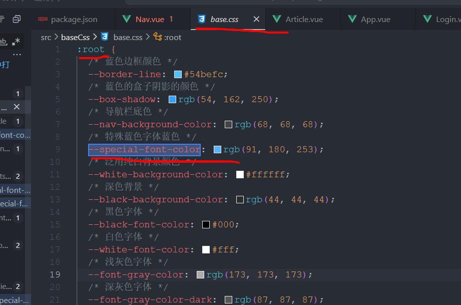
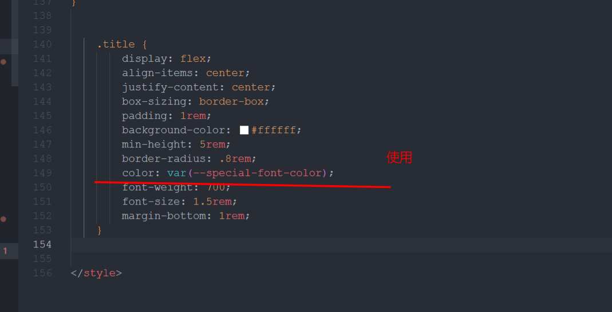

使用



# Less

> Less 是一门 CSS 预处理语言，它扩展了 CSS 的动态特性。提高编写CSS的效率，最终编译为CSS代码

## 一、引言

### 1.维护CSS的弊端

CSS 是一门非程序式语言，没有变量、函数、SCOPE（作用域）等概念。

- CSS 需要书写大量看似没有逻辑的代码，CSS 冗余度是比较高的
- 不方便维护及扩展，不利于复用
- CSS 没有很好的计算能力
- 非前端开发工程师来讲，往往会因为缺少 CSS 编写经验而很难写出组织良好且易于维护的 CSS 代码项目

### 2.Less介绍

Less（Leaner Style Sheets 的缩写）是一门 CSS 扩展语言，也称为 CSS 预处理器。

做为 CSS 的一种形式的扩展，它并没有减少 CSS 的功能，而是在现有的 CSS 语法上，为 CSS 加入程序式语言的特性。

它在 CSS 的语法基础上，引入了变量，Mixin（混入），运算以及函数等功能，大大简化了 CSS 的编写，并且降低了 CSS 的维护成本，就像它的名称所说的那样，Less 可以让我们用更少的代码做更多的事情。

Less 中文网址：[Less 快速入门 | Less.js 中文文档 - Less 中文网 (bootcss.com)](https://less.bootcss.com/)

常见的 CSS 预处理器：Sass、Less、Stylus

### 3.Less安装

注意: 如果使用VSCode无需安装Less

**用node运行Less**

1. 安装 node.js，可选择版本（8.0），网址：http://nodejs.cn/download/
2. 检查是否安装成功，使用 cmd 命令输入 `node -v` 查看版本即可
3. 基于 node.js 在线安装 Less，使用 cmd 命令输入 `npm install -g less` 即可
4. 检查是否安装成功，使用 cmd 命令 `lessc -v` 查看版本即可

**vscode使用Less**

下载【VSCode Less 插件】

+ vscode 的 Easy LESS 插件 这个插件可以自动将`less`文件转义成`css`文件 **关于配置**


### 使用less

这行代码是嵌入到html文件中去编译Less代码，也可以通过其他软件预编译，就不再需要该代码

```
<script src="https://cdn.jsdelivr.net/npm/less@4" ></script>
```

在代码最后引入上面的代码，必须在引入CSS之后再引入这句话

### 预编译

`vs code`的插件`EASY LESS`可以自动生成与less文件对应的css文件

新建`.less`文件，以Less风格写CSS代码，使用`vs code`可以自动编译成`.css`文件,方便了管理和扩展，最后只要引入对应的`.css`文件就行了

Less之间可以导入，想要在一个less文件中使用另一个less文件中的变量啥的，需要导入

```
@import "路径.less"
```

### 总结

1. less是CSS的预编译器，可以扩展CSS语言（当然也兼容CSS），可以定义变量、混合、函数等等，让CSS代码更易维护和扩展
2. less与传统写法相比： " .less "
3. less需要编译成css才能使用
   + 使用编译工具，比如 [Koala](https://link.juejin.cn/?target=http%3A%2F%2Fkoala-app.com%2F) 挺好用的（当然也有很多[在线编译工具](https://link.juejin.cn/?target=https%3A%2F%2Fwww.w3cschool.cn%2Ftools%2Findex%3Fname%3DLESS)）
   + 在项目中使用（比如Vue，需要安装less-loader）
   + 客户端调试（存在跨域问题，不推荐这种方式）

4. 使用
   + 使用link标签引用less.min.js（[官网下载](https://link.juejin.cn/?target=www.lesscss.cn)），注意rel="stylesheet/less"
   + 这种方式不生成css文件，直接在浏览器查看


## 二、🌿注释

------

以`//`开头的注释，预编译之后 ，在CSS文件中没有这个注释

以`/**/`包裹的注释会被编译到CSS文件中

```less
/* 
 * 一个块注释, 这种注释会编译到CSS文件
 * style comment! 
*/

// 这种注释不会编译到CSS文件
div {
  color: red;
}
```

## 三、🌿变量

------

使用`@`来声明一个变量，变量都是块级作用域，被大括号分隔

### 变量命名规范

- 必须有 `@` 为前缀
- 不能包含特殊字符
- 不能以数字开头
- 大小写敏感
- 推荐xxx-yyy形式

```
@color: pink;
```

### 变量使用

定义：@name: value; （@black: #000;）

使用场合分3种：

- 常规使用：@name
- 作为选择器或属性名：@{name}
- 作为URL："@{name}"

#### 常规使用

```less
@width: 10px;
@height: @width + 10px;

#header {
  width: @width;
  height: @height;
}
```

编译之后的CSS:

```css
#header {
  width: 10px;
  height: 20px;
}
```

#### 变量用于选择器名、属性名、URL、`@import`语句

```less
// 变量定义
@property: color;

// 使用
.widget {
  @{property}: #0ee;
  background-@{property}: #999;
}
```

```less
// 变量定义
@images: '../img';

// 使用
body {
  color: #444;
  background: url('@{images}/white-sand.png');
}
```

```less
// 变量定义
@themes: '../../src/themes';

// 使用
@import '@{themes}/tidal-wave.less';
```

### 变量的延迟加载

因为less的变量是块级作用域，在这个块中使用这个变量时，会等待该块代码全部执行完毕之后再赋值，也就是如果后面有使用的变量，则会使用后面的变量值

+ 变量是延迟加载的，可以不预先声明

+ 当一个变量被声明多次，会取最后一次的值，并从**当前作用域**往外寻找变量。

#### 变量的作用域

less:

```javascript
@var: 0;
.class {
    @var: 1;
    .brass {
        @var: 2;
        three: @var;
        @var: 3;
    }
    one: @var;
}
```

CSS:

```css
.class {
    one: 1;
}
.class .brass {
    three: 3;  //使用最后定义的 @var: 3
}
```

#### 变量是延迟加载的，可以不预先声明

```less
div {
  color: @black
}

@black: #000000;

//编译结果
div {
  color: #000000;
}
```

## 四、🌿Less的嵌套规则

> less的嵌套规则类似HTML的结构，使得CSS代码清晰。

### 基本使用

Less 提供了使用嵌套(nesting)代替层叠或与层叠结合使用的能力

【css选择器的嵌套】

```css
#header .logo {
    width: 300px;
}

```

【less 嵌套写法】

```less
#header {
    .logo {
        width: 300px;
    }
}
```

### 父元素选择符 &

& 符号可以表示对父选择器的引用, 常用于给现有选择器添加伪类。

```less
.bgcolor {
  background: #fff; 
  a {
    color: #888888;      
    &:hover {
      color: #ff6600;
    }
  }
}

.xkd{   
    &one{      
        font-size: 12px;   
    }     
    &:hover{       
        color: #fff;   
    }
}
```

编译后

```css
.bgcolor {
  background: #fff;
}
.bgcolor a {
  color: #888888;
}
.bgcolor a:hover {
  color: #ff6600;
}

.xkd one { 
    font-size: 12px;
}
.xkd:hover { 
    color: #fff;
}
```

### 改变选择器的顺序

- 将&放到当前选择器之后，会将当前选择器移到最前面
- 只需记住 “& 代表当前选择器的所有父选择器”

```less
ul {
  li {
    .color &{
      background: #fff;
    }
  }
}

//编译结果
.color ul li {
  background: #fff;
}
```

### 组合使用

- 将生成所有可能的选择器列表

```less
.div1, .div2 {
  color: red;
  & & {
    border-top: 1px solid blue;
  }
} 

//编译结果
.div1, .div2 {
  color: red;
}
.div1 .div2,
.div2 .div1,
.div1 .div1,
.div2 .div2 {
  border-top: 1px solid blue;
}
```

### 总结

**选择器嵌套**：

- 后代选择器,  在某个元素的后面的所有

  ```less
  /*所有后代选择器*/
  .parent {
    color: red;
  
    .child {
      font-size: 14px;
    }
  }
  ```

+ 子一代元素选择器

  ```less
  /*子一代选择器*/
  .parent>child{
    background:orange;
  }
  ```

+ 相邻的一个兄弟选择器

  ```less
   /*相邻兄弟选择器：当前选中元素的向下的最近的一个兄弟元素*/
  .parent+child{
    background: red
  }
  ```

+ 相邻的所以兄弟选择器

  ```less
  /*通用兄弟选择器，当前选中元素的向下的所有兄弟元素*/
  .parent~child{
    background:red;
  }
  ```

**属性嵌套**：

- Less 中的属性嵌套使用了与普通 CSS 不同的语法，以 `&` 符号表示父选择器。

  ```less
  .parent {
    &:hover {
      color: blue;
    }
  }
  ```

**伪类和伪元素嵌套**：

- 可以在 Less 中嵌套 CSS 的伪类和伪元素，使样式规则更易读且层次清晰。

  ```less
  lessCopy Code// Less 中的伪类和伪元素嵌套示例
  a {
    &:hover {
      text-decoration: underline;
    }
  
    &::after {
      content: " →";
    }
  }
  ```

**混合器嵌套**：

- Less 中的混合器（Mixin）允许将一组样式属性集合定义为一个混合器，并在需要时进行调用。

- 混合器可以嵌套在选择器内部，以便于在特定的选择器范围内重用样式。

  ```less
  lessCopy Code// Less 中的混合器嵌套示例
  .mixin() {
    font-weight: bold;
    color: blue;
  }
  
  .parent {
    .mixin();
  }
  ```

## 五、🌿混合

#### 普通混合

当某个代码片段经常使用，比如一个特定的样式，就可以使用混合，将该代码片段定义在一个混合中，

> 定义混合:`.变量名{代码片段}`。如果不加括号，就会编译到css文件中，如果`.变量名(){}`就不会编译到css中
>
> 使用混合:`.变量名`，有括号时，加括号`.变量名()`

定义一个juzhong混合，然后给`#inner和#inner1`使用,在css文件中相当于把混合直接复制到指定位置


```less
.juzhong(){
    width: 200px;
    height: 200px;
    position: absolute;
    left: 0;
    top: 0;
    bottom: 0;
    right: 0;
    margin: auto;
    background-color: blue;
}

#app{
    position: relative;
    width: 300px;
    height: 300px;
    margin: 0 auto;
    margin-top: 50px;
    background-color: aqua;
    #inner{
        .juzhong;
    }
    #inner1{
        .juzhong;
    }
}
```

#### 带参混合

定义混合时，可以在括号中传输参数，在使用时，也需要带参数使用

参数在代码块中直接当变量使用


```less
.juzhong(@width,@height,@color){....}

box{
    .juzhong(100px,100px,red);
}
```

#### 带默认值的参数混合

定义混合时，括号中的形参可以使用默认值，这样即是不传参也不会报错`@变量:默认值`


```less
.juzhong(@width:100px,@height:100px,@color:red);

box{
    .juzhong();
}
```

#### 命名参数

在使用混合时，可以指定该参数传给哪个形参.`.juzhong(@变量:值)`


```less
.juzhong(@w:100px,@h:100px,@c:red)

box{
    .juzhong(@c:pink);
}
```

#### 匹配模式混合

在调用一个混合时，会自动调用同一个名字的混合，并且第一个参数是`@_`的混合。

不管调用哪个混合，都会调用同名且参数第一个是`@_`的混合

L,R是匹配标识，在调用时，直接`.mixin(L/R,..)`就可以调用指定的混合


```less
.mixin(@_){}

.mixin(L,@h,@c){}

.mixin(R,@h,@bo){}
```

#### arguments混合

和js里的`arguments`一样，保存的是实参列表，传输的实参不传给形参也可以使用，是一个伪数组


```less
.border(@1,@2,@3){
    border:@arguments
}

#box{
    .border(1px,solid,red);
}
```

css:


```css
box{
    border:1px solid red
}
```

## 混合(Mixins)


混合(Mixin)是一种将一组属性从一个规则集包含(或混入)到另一个规则集的方式，可理解为复制粘贴。

### 7.1 普通混合


1. 定义了一个bordered类
2. 如果希望在其它规则集中使用这些属性，只需像下面这样输入所需属性的类（class）名称即可

```
.bordered {
  border-top: dotted 1px black;
  border-bottom: solid 2px black;
}

#menu a {
  color: #111;
  .bordered();
}

.post a {
  color: red;
  .bordered();
}
```


```
.bordered {
  border-top: dotted 1px black;
  border-bottom: solid 2px black;
}
#menu a {
  color: #111;
  border-top: dotted 1px black;
  border-bottom: solid 2px black;
}
.post a {
  color: red;
  border-top: dotted 1px black;
  border-bottom: solid 2px black;
}
```


```
// 使用类选择器时可以在选择器后边添加一个括号，这时我们实际上就创建了一个mixins
// 这种是不会被识别进css
.myMixin() {
  width: 400px;
  height: 400px;
}

.p4 {
  .myMixin; //.myMixin();都可以
}
```


### 7.2 带参数的混合(Parametric Mixins)


1. 混合带参数，参数需要按顺序传递

```
.border(@width, @style, @color) {
  border: @width @style @color;
}
div {
  .border(1px, solid, #ccc);
}
```


```
div {
  border: 1px solid #ccc;
}
```


1. 混合带参数并有默认值

需注意的是，就算有默认值，也要按顺序传递

```
.border(@width, @style, @color: #ccc) {
  border: @width @style @color;
}
div {
  .border(1px, solid);
}

// 会出错
.border(@width: 1px, @style, @color) {
  border: @width @style @color;
}
div {
  .border(solid, #ccc);
}
```


### 7.3 命名参数


可以在向混合传参是指定参数名称，从而不需要按顺序传入

```
.border(@width, @style, @color: #ccc) {
  border: @width @style @color;
}
div {
  .border(@style: solid, @color: red, @width: 100px);
}
```


### 7.4 @arguments 变量


`@arguments` 变量包含了传入的所有参数

```
.box-shadow(@x: 0, @y: 0, @blur: 1px, @color: #000) {
  -webkit-box-shadow: @arguments;
  -moz-box-shadow: @arguments;
  box-shadow: @arguments;
}
.big-block {
  .box-shadow(2px, 5px);
}
```


```
.big-block {
  -webkit-box-shadow: 2px 5px 1px #000;
  -moz-box-shadow: 2px 5px 1px #000;
  box-shadow: 2px 5px 1px #000;
}
```


### 7.5 匹配模式(Pattern-matching)


在多个相同的混合中(参数个数必须相同)，匹配特定的混合。

```
.mixin(dark, @color) {
  color: darken(@color, 10%);
}
.mixin(light, @color) {
  color: lighten(@color, 10%);
}
// @_ 表示匹配所有
.mixin(@_, @color) {
  display: block;
}

@switch: light;

.class {
  .mixin(@switch, #888);
}
```


```
.class {
  color: #a2a2a2;
  display: block;
}
```

## 六、🌿运算

> 任何数值、颜色值和变量都可以进行运算

### 数值类运算

规则:

+ 如果两个值之间只有一个值有单位，则运算结果就取该单位

- less会自动推算数值的单位，不必每个值都加上单位
- 运算符中间左右必须有个空格隔开 `1px + 5`
- 任何数字、颜色或者变量都可以参与运算。 Less 提供了加（+）、减（-）、乘（*）、除（/）算术运算。

less运算时，只要有一个值带单位就可以计算

```less
.wp {
  width: (450px - 50)*2;
}

//编译输出
.wp {
  width: 900px;
}
```

结果以操作数最左侧的单位类型为准

```less
@conversion-1: 5cm + 10mm; // 6cm
@conversion-2: 2 - 3cm - 5mm; // -1.5cm
@conversion-3: 3.1 * 2cm; // 6.2cm
@conversion-4: 4px / 2; // 4px / 2

// conversion is impossible
@incompatible-units: 1cm - 1px; // 0.97354167cm

// example with variables
@base: 5%;
@filler: @base * 2; // 10%
@other: @base + @filler; // 15%

@color: #224488 / 2; // #112244
background-color: #112244 + #111; // #223355
```

### 颜色值运算

规则:

- 先将颜色值转换为rgb模式，运算完后再转换为16进制的颜色值并返回
- 取值为0-255，所以计算时不能超过这个区间，超过默认使用0或255
- 不能使用颜色名直接运算

```less
.content {
  color: #000000 + 8;
}

//rgb(0,0,0) + 8
//rgb(8,8,8)
//十六进制：#080808

//编译输出
.content {
  color: #080808; 
}
```

## 继承(Extend)


Extend Syntax

- 继承可让多个选择器应用同一组属性，最终编译为并集选择器
- 其性能比混合高，但灵活性比混合低

```
nav ul {
  &:extend(.inline);
  background: blue;
}
.inline {
  color: red;
}
```


```
nav ul {
  background: blue;
}
.inline,
nav ul {
  color: red;
}
```


## 避免编译


通过加引号可以避免 Less 编译，直接把内容输出到 CSS 中

```
.banner .inline .header {
  width: '100px + 100px';
  height: 100px + 100px;
}
```


```
.banner .inline .header {
  width: '100px + 100px';
  height: 200px;
}
```


## 函数

Less 内置了多种函数用于转换颜色、处理字符串、算术运算等。这些函数在Less 函数手册中有详细介绍。

函数的用法非常简单。下面这个例子将介绍如何利用 percentage 函数将 0.5 转换为 50%，将颜色饱和度增加 5%，以及颜色亮度降低 25% 并且色相值增加 8 等用法：

```less
@base: #f04615;
@width: 0.5;

.class {
  width: percentage(@width); // returns `50%`
  color: saturate(@base, 5%);
  background-color: spin(lighten(@base, 25%), 8);
}
```


## 导入

> 使用@import

```less
@import url("syntax.less");   //url可以不加但是可能会有问题
@import "library";            // library.less
@import "typo.css";
```

### 引入less文件

```less
//main.less
@wp: 960px;
.color {
  color: #fff;
}

//当前less文件
@import "main.less"; //可以不加后缀
.content {
  width: @wp;
}

//编译输出
.color {
  color: #fff
}
.content {
  width: 960px;
}
```

### 引入css文件

- 注意：不能混合css的规则到项目中，编译后原样输出“@import xxx.css”
- 并且引入时不能省略后缀名

```less
//main.css
.color {
  color: #ff6600;
}

@import "main.css" ;
.content {
  width: @wp;
  height: @wp;
}

//编译输出
@import "main.css";  //原样输出,但有效，css有这条语句
.content {
  width: 960px;
  height: 960px;
}
```

### 带参数的引入

- once：默认，只引入一次
- reference：使用less文件但不输出，注意对比上面的例子（ 不使用会输出没有加括号的混合）

```less
@wp: 960px;
.color {
  color: #fff;
}

//当前less文件
@import (reference) "main";
.content {
  width: @wp;
}

//编译输出
.content {
  width: 960px;
}
```

- inline：在输出中包含less文件但是不能操作

```less
@wp: 960px;
.color {
  color: #fff;
}

//当前less文件
@import (inline) "main"; 
.content {
  width: @wp;
}

//编译输出
@wp: 960px;    //报错，@wp未知
.color {
  color: #fff;
}
```

- less：将文件作为less文件对象，无论什么文件扩展名

```less
复制代码//main.css文件
.color {
  color: #ff6600;
}

//当前less
@import (less) "main.css";
  .content {
.color;
}

//编译输出
.color {
  color: #ff6600;
}
.content {
  color: #ff6600;
}
```

- css：将文件作为css文件对象，无论什么文件扩展名

```less
//当前less文件
@import (css) "main.less";
.content {
  color: red;
}

//编译输出
@import "main.less";
.content {
  color: red;
}
```

- multiple：允许引入多次相同文件名的文件

```less
//当前less
@import (multiple) "main.less";
@import (multiple) "main.less";
@import (multiple) "main.less";
.content {
  width: @wp;
}

//编译输出
.color {
  color: #fff;
}
.color {
  color: #fff;
}
.color {
  color: #fff;
}
.content {
  width: 960px;
}
```

## 导出

**手动给每个less文件指定导出**

导出必须写到第一行

```
// out: 路径/文件名
// out: ./mycss/pink.css
```

设置导出： 当面目录下，创建一个 mycss 文件夹， 生成 一个 pink.css （做了改名）

------

```
// out: ./mycss/
```

设置导出： 当面目录下，创建一个 mycss 文件夹， 生成 一个 跟less一样的文件名（原名）

**less 禁止导出**

```
// out: false
```


# 媒体查询规则

```less
   @media screen and (max-width: 922px) {
      padding-left: 15px;
      width: 100vw;
    }
```

它表示在屏幕宽度小于或等于 922 像素时应用下面的样式。媒体查询允许您根据设备的特性（如屏幕尺寸、分辨率等）来应用不同的样式。

在这个媒体查询规则中，有两个样式属性被定义：

1. `padding-left: 15px;`：当屏幕宽度小于或等于 922 像素时，设置左内边距为 15 像素。这样可以在较小的屏幕上提供更多的空间。
2. `width: 100vw;`：当屏幕宽度小于或等于 922 像素时，设置元素宽度为视口宽度的 100%。这将使元素的宽度与屏幕宽度相同，以适应较小的屏幕。

通过这段代码，您可以在屏幕宽度小于或等于 922 像素时，对元素进行特定的样式调整，以提供更好的移动设备体验或响应式设计。
