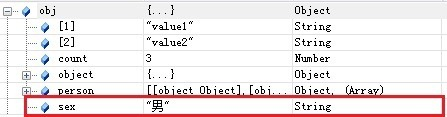
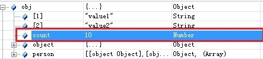

# javaScript 引入方式

**html中**:

1. 内部标签

   + 放在 <head> 标签内：整个页面加载完成之前就进行读取。

   如果将 <script> 标签放在 <head> 标签内，那么它会在页面加载时立即执行。这可能会导致页面加载速度变慢，因为在执行 JavaScript 代码之前，浏览器必须先下载并解析完整个脚本文件。

   ```html
   <head>
     <script>
       // JavaScript 代码
     </script>
   </head>
   ```

   + 放在 <body> 结尾前：页面加载完成之后进行读取的。

   将 <script> 标签放在 <body> 结尾前，可以让页面的 HTML 结构先加载完毕，然后再加载和执行 JavaScript 代码。这样可以加快页面的加载速度，因为在执行 JavaScript 代码之前，页面的大部分内容已经加载完毕。

   ```html
   <body>
     <!-- 
       //页面内容
     -->
       
     <script>
       // JavaScript 代码
     </script>
   </body>
   ```

2. 外部引入(一般都把该js写成模块)

   ```html
   <script src="abc.js"></script>
   ```

   ```html
   //------------  模块调用--------------------------------------------
   <script type="text/javascript" src="myModule.js"</script>
   <script type="text/javascript">
     var module = myModule()
     module.doSomething()
     module.doOtherthing()
   </script>
   ```

**js中:**  

1. 使用es6模块化规范,  比如:

   ```js
   // myModule.js  
   export default function hello() {  
     return "Hello, world!";  
   }  
   
   // main.js  
   import hello from './myModule.js';  
   console.log(hello()); // 输出 "Hello, world!"  
   ```

2. 使用CommonJS 规范

# 运算符

js中 `if (!token.value)` 来检查计算属性 `token` 是否为空`null`、`undefined`、空字符串等假值，则条件表达式 `!token.value` 会评估为 `true`，进而执行相应的代码块。

比较运算符：

- = 如果1=’1’,则为false
- == 等于 类型不一样，值一样，也会判断为true
- === 绝对等于，类型一样，值一样，判断为true
- !==  不等于
- **这是js的缺陷，尽量不使用==比较**

浮点数问题：

```JS
`console.log((1/3)===(1-2/3))`
结果为false，尽管数值是都等于1/3
尽量避免使用小数计算，因为精度问题
```

# 数据类型

JS的数据类型:  通过typeof来检测，得到的数据类型有 `String`、`number`、`boolean`、`null`、`undefined`、`Object` (Object是一切数据的基础)

typeof操作符

```js
console.log(typeof qqqq);//undefined，这个变量没有定义,但是不会报错；qqqq此时是变量；
console.log(typeof (222));//number，是一个数字； typeof是操作符而不是方法，所以后面可以加()也可以不加；
console.log(typeof "222");//string，是一个字符串
console.log(typeof false);//boolean，是一个布尔值
console.log(typeof {});//object 是一个对象
console.log(typeof null);//objecy 是一个对象，在javascript里，null是一个空指针；
console.log(typeof function(){});//function，是一个方法，也是属于object类型的；js里万物皆对象
```

## 分类

### 基本(值)类型

> 1. String: 任意字符串
> 2. Number: 任意的数字
> 3. boolean: true/false
> 4. undefined: undefined
> 5. null: null -->使用`typeof`时返回`object`
> 6. [symbol](https://gitee.com/link?target=https%3A%2F%2Fdeveloper.mozilla.org%2Fzh-CN%2Fdocs%2FGlossary%2FSymbol) ([ECMAScript](https://gitee.com/link?target=https%3A%2F%2Fdeveloper.mozilla.org%2Fzh-CN%2Fdocs%2FGlossary%2FECMAScript) 2016新增)。 -->Symbol 是 [基本数据类型](https://gitee.com/link?target=https%3A%2F%2Fdeveloper.mozilla.org%2Fzh-CN%2Fdocs%2FGlossary%2FPrimitive) 的一种，[`Symbol`](https://gitee.com/link?target=https%3A%2F%2Fdeveloper.mozilla.org%2Fzh-CN%2Fdocs%2FWeb%2FJavaScript%2FReference%2FGlobal_Objects%2FSymbol) 对象是 Symbol原始值的[封装 (en-US)](https://gitee.com/link?target=https%3A%2F%2Fdeveloper.mozilla.org%2Fen-US%2Fdocs%2FGlossary%2FWrapper) 。
> 7. [bigint](https://gitee.com/link?target=https%3A%2F%2Fdeveloper.mozilla.org%2Fzh-CN%2Fdocs%2FGlossary%2FBigInt)， -->**BigInt** 是一种数字类型的数据，它可以表示任意精度格式的整数。

### 对象(引用)类型

> 1. Object: 任意对象
> 2. Function: 一种特别的`对象`(可以执行) --内部包含可运行的代码
> 3. Array: 一种特别的`对象`(`key`为数值下标属性, 内部数据是有序的)

### 判断方法

#### ①` typeof`

**`typeof`** 操作符返回一个`字符串`，表示未经计算的操作数的类型。

- 可以判断: undefined/ 数值 / 字符串 / 布尔值 / function

- 不能判断: null与object object与array

- `注意`: 运行`console.log(typeof undefined)`时,得到的的也是一个`字符串,同时为小写!!`--> `'undefined'`

- 代码示例

- ```js
    // typeof返回数据类型的字符串表达
    var a
    
    //注意:typeof返回的是字符串
    console.log(a, typeof a, typeof a==='undefined',a===undefined )  // undefined 'undefined' true true
    console.log(undefined === 'undefined') //false
    a = 4
    console.log(typeof a==='number') //true
    a = 'hongjilin'
    console.log(typeof a==='string') //true
    console.log(typeof a==='String') //false  -->注意,返回的类型为小写
    a = true
    console.log(typeof a==='boolean') //true
    a = null
    console.log(typeof a, a===null) // 'object'  true
   let b={}
    console.log(typeof b,typeof null, '-------') // 'object' 'object'  -->所以Typeof不能判断null与object
  ```

#### ②`instanceof`(判断实例方法)

`专门判断对象`的具体类型

- **`instanceof`** **运算符**用于检测构造函数的 `prototype` 属性是否出现在某个实例对象的原型链上。

- 代码示例:

- ```js
      b2: [1, 'abc', console.log],
   //可以简化成 b3:()=>()=> 'hongjilin'  -->高阶函数相关知识
      b3: function () {
        return  () =>{  return   'hongjilin'}
      }
    }
   /**使用instanceof进行对象判断*/
    console.log(b1 instanceof Object, b1 instanceof Array) // true  false
    console.log(b1.b2 instanceof Array, b1.b2 instanceof Object) // true true
    console.log(b1.b3 instanceof Function, b1.b3 instanceof Object) // true true
  
    /**使用typeof进行对象中某属性的判断*/
   console.log(typeof b1.b2, typeof null) // 'object' 'object'  
    console.log(typeof b1.b3==='function') // true
    console.log(typeof b1.b2[2]==='function') //true
  
    /**调用对象与数组中某函数示例*/
    b1.b2[2]('调用console.log打印hongjilin')    //调用console.log打印hongjilin
    console.log(b1.b3()()) // hongjilin
  ```

#### ③`===`

具体可以看 MDN的[JavaScript中的相等性判断](https://gitee.com/link?target=https%3A%2F%2Fdeveloper.mozilla.org%2Fzh-CN%2Fdocs%2FWeb%2FJavaScript%2FEquality_comparisons_and_sameness)

可以判断: undefined, null

简而言之，在比较两件事情时，`双等号将执行类型转换`;` 三等号将进行相同的比较，而不进行类型转换` (如果类型不同, 只是总会返回 false )

## string

### 字符串的特性

- 由0个或多个16位unicode字符组成； 

- 引号:  单引号和双引号都可以(但是单引号和双引号不能交叉使用, 放在引号内的任何东西都是属于字符串，即使里面没有东西或者空格，都属于合法的字符串 ）

  ```js
  var str1="2";
  var str2='2';
  var str3="";
  var str4=" ";
  var str5="function(){}";
  //上面都是合法的string类型
  console.log(typeof str1);
  console.log(typeof str2);
  console.log(typeof str3);
  console.log(typeof str4);
  console.log(typeof str5);	
  ```

- 使用.length属性可以访问字符串的长度;

length计算包括空格

```js
//字符串长度
var strTest1="zhuanbang";//共9个
var strTest2="朱邦邦的JavaScript学习笔记";//共18
console.log(strTest1.length);//9
console.log(strTest2.length);//18
//这只是个简单的判断，如果想用JavaScript判断或者获取所占的字节，就不能这么判断了，因为中文和英文字符所占的字节长度不同，所以要想获得中文字符的真正长度，就需要对输入的字符进行判断或过滤(可以unicode区间进行判断)，如果符合中文字符，则使用不同的标准。	
```

- 无法精确返回双字节字符长度(上面已经做说明)
- 转义序列表示一个字符
- 字符串一旦被创建，其值是不能改变的，若要改变必须销毁原有字符串，然后用另一个包含新值的字符串填充改变量；

转义序列；

- \n 换行，常用的,这个需要记住；
- \ \ 斜杠\是常用转义使用的
  - \’单引号 常用
  - \”双引号 常用

- \t 制表符
- \b 空格
- \r 回车符
- \f 分页符
- \xnn 十六进制，n代表0-F
- \unnnn 以十六进制代码表示一个unicode字符

### 字符串拼接

#### 一、使用连接符 +

```js
let shy = '帅哥'
let a =  '我是' + shy
console.log(a)  // 我是帅哥
```

#### 二、数组api join拼接

```js
let arr = ['hello','java','script']
let str = arr.join("")
console.log(str) // hellojavascript
// join('--') 这个是可以换的 换--就是用--拼接
```

#### 三、末班字符串 俩 ` 拼接

```js
let a = 'java'
let b = `hello ${a}script`
console.log(b) // hellojavascript
```

#### 四、使用 js的 concat() 方法连接字符串

concat() 方法用于连接两个或多个数组或者字符串。该方法不会改变现有的数组，仅会返回被连接的新数组。

```js
let a = ['java']
let b = ['script']

let str = a.concat(b)
console.log(str)  //  ["java", "script"]
12345
let a = 'a'
let b= 'b'
console.log(a.concat(b)) // ab 
```

- Eval()

  计算字符串表达式的值并以数值形式返回；

  ```js
  var evalVal="1+2+5+8+10";
  console.log(typeof evalVal);//string
  var evalComputed=eval(evalVal);
  console.log(evalComputed,typeof evalComputed);//26 "number"
  ```

##  number

包含：正数、负数、零、小数、以及特殊的NaN, 不区分小数和整数

```js
123 //整数123
123.1 //浮点数123.1
1.123e3 //科学计数法
-99  //负数
NaN  //not a number
Infinity //表示无限大
```

数值范围（仅作了解）

- 最小值 Number.MIN_VALUE
- 最大值 Number.MAX_VALUE：
- 超出范围
  - 正无穷
    - Infinity
    - Number.POSITIVE_INFINTY
  - 负无穷
    - -Infinity
    - Number.NEGATIVE_INFINITY
  - 缺陷
    - 无法参与下一次计算
  - 检测方法，用isFinite
    - 超出范围 false
    - 合法范围true

NaN

- 非数值,不是一个数值，但是NaN属于数值类型；


- 特点

  - 任何涉及NaN的操作都将返回NaN
  - NaN与人和数值都不相等包括其自身console.log(NaN==NaN)  //err

- 检测 isNaN

  - 是数值，返回false

  - 不是数值，返回true

    //isNaN
    var age=25;
    var ageError=25-"男";
    console.log(isNaN(age));//false       age这个值不是一个数，对吗？      -> 不对  ->false
    console.log(isNaN(ageError));//true   ageError这个值不是一个数，对吗？ -> 对    ->true

## boolean

<font color = red>0、NaN、””、null、undefined、false本身；只有这六个是false类型的；其它都是true；</font>

- true为真，flase为假（false是布尔值，而Flase只是标识符）；通常用在if/else的判断语句中（如果需要的话，通常还会配合逻辑与&&，逻辑或||来完成）

- true不一定=1；flase不一定=0；

- 使用boolean()进行转换；任何数据类型的值调用Boolean()函数，都会返回一个Boolean值；也可以用(!/!!来转换)

  - true

    - Boolean的true本身
    - 任何非空字符串
    - 任何非零数值
    - 对象

  - flase

    - false本身

    - 空字符串

    - 0和NaN

          console.log(0===(-0));//true

    - null和undefined

## null 和 undefined

+ null 空
+ undefined 未定义

#### 一、相同点

1、都是原始类型的值，且保存在栈中变量本地
2、进行条件判断时，两者都是false：

```js
console.log(undefined == null);//true  
```

#### 二、不同点

1、null是js的关键字，表示空值；undefined不是js的关键字，它是一个全局变量
2、null是Object的一个特殊值，如果一个Object为null，表示这个对象不是有效对象，null是一个不存在的对象的占位符；undefined是Globel的一个属性
3、类型不一样：

```js
 typeof(null) // object
 typeof(undefined) //undefined
 console.log(typeof(null) === 'object')//true
 console.log(typeof(undefied) === 'undefined')//true
```

4、转换的值不一样：

```js
console.log(Number(undefined));//NaN
console.log(Number(11+ undefined));//NaN

console.log(Number(null));//0
console.log(Number(11+ null));//11
```

#### 三、null何时使用

当需要释放一个对象的时候可以将该对象赋值为null，进而来释放对象

```js
var a = {
  a:1,
  b:2
};

//释放对象
a = null;
```

#### 四、null、undefined 产生

1、产生null方式一：当访问一个不存的DOM节点时

```bash
console.log(document.getElementById(“#aaaaaaa”));//null
```

2、产生null方式二:Object的[原型链](https://so.csdn.net/so/search?q=原型链&spm=1001.2101.3001.7020)终点：

```bash
console.log(Object.prototype.__proto__)；//null
```

1、产生undefined方式一：声明了变量但未赋值：

```bash
var a;
console.log(a);//undefined
```

2、产生undefined方式二：对象的属性没有赋值的情况下：

```bash
var obj = {a:1}; 
console.log(obj.age)//undefined
```

3、产生undefined方式三：函数调用的时候，函数的参数没有提供的情况下：

```bash
function add(num){ 
 console.log(num)
}; 
add();//undefined
```

4、产生undefined方式四：当函数没有返回值的情况下：

```bash
var a = function(){};
console.log(a())//undefined
```

## 数组

###  一、创建数组

==java的数值必须是相同类型的对象，js中不一样，数组课存放不同类型==

注意: 此数组和java,c++的不一样

####  1.使用数组字面量表示法

```js
var arr4 = [];   //创建一个空数组
var arr5 = [20];   // 创建一个包含1项数据为20的数组
var arr6 = ["lily","lucy","Tom"];   // 创建一个包含3个字符串的数组
```

#### 2.使用 Array 构造函数

```js
var arr1 = new Array();   //创建一个空数组
```

```js
var arr3 = new Array("lily","lucy","Tom");   // 创建一个包含3个字符串的数组
var array4 = new Array('23'); // ["23"]
```

#### 3.Array.of 方法创建数组

ES6 为数组新增创建方法的目的之一，是帮助开发者在使用 Array 构造器时避开 js 语言的一个怪异点。

**Array.of()方法总会创建一个包含所有传入参数的数组，而不管参数的数量与类型。**

```js
let arr = Array.of(1, 2);
console.log(arr.length);//2

let arr1 = Array.of(3);
console.log(arr1.length);//1
console.log(arr1[0]);//3

let arr2 = Array.of('2');
console.log(arr2.length);//1
console.log(arr2[0]);//'2'
```

####  4.Array.from 方法创建数组(es6 新增)

在 js 中将**非数组对象转换为真正的数组**是非常麻烦的。在 ES6 中，将可迭代对象或者类数组对象作为第一个参数传入，Array.from()就能返回一个数组。

```js
function arga(...args) {  //...args剩余参数数组,由传递给函数的实际参数提供
    let arg = Array.from(args);
    console.log(arg);
}

arga('arr1', 26, 'from'); // ['arr1',26,'from']
```

### 二、数组方法

1、长度

```js
arr.length
```

2、indexOf()，通过元素获得下标索引

```js
arr.indexOf(2) //找到元素为2的下标
```

3、slice(),截取数组的一部分，返回一个新数组，类似于String中的substring

4、push()、pop() 在尾部操作元素

```js
push(): 压入元素到尾部  
pop(): 弹出尾部的一个元素
```

5、unshift()、shift() 在头部操作

```js
unshift: 压入元素到头部    shift： 弹出头部的一个元素
```

6、sort() 排序

7、reverse() 元素反转

8、concat() 拼接元素

```js
arr = ['a','b','c']
arr.concat([1,2,3]) //拼接新数组 
打印arr.concat([1,2,4])为['a','b','c',1,2,3] 
但是打印原数组arr则跟之前一样：['a','b','c']
```

注意：concat并没有修改数组，只是会返回新数组

9、join 连接符 打印拼接数组，使用特定的字符串连接

```js
 arr = ['a','b','c']    arr.join("-")    ->"a-b-c"
```

10、javascript中所有的键都是字符串，值是任意对象

补充

+ arr.length:  长度

- `join()`：用指定的分隔符将数组每一项拼接为字符串
- `push()` ：向数组的末尾添加新元素
- `pop()`：删除数组的最后一项
- `shift()`：删除数组的第一项
- `unshift()`：向数组首位添加新元素
- `slice()`：按照条件查找出其中的部分元素
- `splice()`：对数组进行增删改
- `fill()`: 方法能使用特定值填充数组中的一个或多个元素
- `filter()`:“过滤”功能
- `concat()`：用于连接两个或多个数组
- `indexOf()`：检测当前值在数组中第一次出现的位置索引
- `lastIndexOf()`：检测当前值在数组中最后一次出现的位置索引
- `every()`：判断数组中每一项都是否满足条件
- `some()`：判断数组中是否存在满足条件的项
- `includes()`：判断一个数组是否包含一个指定的值
- `sort()`：对数组的元素进行排序
- `reverse()`：对数组进行倒序
- `forEach()`：ES5 及以下循环遍历数组每一项
- `map()`：ES6 循环遍历数组每一项
- `copyWithin()`:用于从数组的指定位置拷贝元素到数组的另一个指定位置中
- `find()`:返回匹配的值
- `findIndex()`:返回匹配位置的索引
- `toLocaleString()、toString()`:将数组转换为字符串
- `flat()、flatMap()`：扁平化数组
- `entries() 、keys() 、values()`:遍历数组

~~~js
#### **1.join()**

`join()`方法用于把数组中的所有元素转换一个字符串。

元素是通过指定的分隔符进行分隔的。默认使用逗号作为分隔符

```js
var arr = [1,2,3];
console.log(arr.join());   // 1,2,3
console.log(arr.join("-"));   // 1-2-3
console.log(arr);   // [1, 2, 3]（原数组不变）
```

通过**join()方法可以实现重复字符串**，只需传入字符串以及重复的次数，就能返回重复后的字符串，函数如下：

```js
function repeatString(str, n) {
//一个长度为n+1的空数组用string去拼接成字符串,就成了n个string的重复
 return new Array(n + 1).join(str);
}
console.log(repeatString("abc", 3));   // abcabcabc
console.log(repeatString("Hi", 5));   // HiHiHiHiHi
```

#### **2.push()和 pop()**

`push()` 方法**从数组末尾向数组添加元素**，可以添加一个或多个元素。

`pop()` 方法用于**删除数组的最后一个元素**并返回删除的元素。

```js
var arr = ["Lily","lucy","Tom"];
var count = arr.push("Jack","Sean");
console.log(count);  // 5
console.log(arr);   // ["Lily", "lucy", "Tom", "Jack", "Sean"]
var item = arr.pop();
console.log(item);   // Sean
console.log(arr);   // ["Lily", "lucy", "Tom", "Jack"]
```

#### **3.shift() 和 unshift()**

`shift()` 方法用于**把数组的第一个元素从其中删除**，并返回第一个元素的值。

`unshift()` 方法可**向数组的开头添加一个或更多元素**，并返回新的长度。

```js
var arr = ["Lily","lucy","Tom"];
var count = arr.unshift("Jack","Sean");
console.log(count);   // 5
console.log(arr);   //["Jack", "Sean", "Lily", "lucy", "Tom"]
var item = arr.shift();
console.log(item);   // Jack
console.log(arr);   // ["Sean", "Lily", "lucy", "Tom"]
```

#### **4.sort()**

sort() 方法用于对数组的元素进行排序。

排序顺序可以是字母或数字，并按升序或降序。

默认排序顺序为按字母升序。

```js
var arr1 = ["a", "d", "c", "b"];
console.log(arr1.sort());   // ["a", "b", "c", "d"]
arr2 = [13, 24, 51, 3];
console.log(arr2.sort());   // [13, 24, 3, 51]
console.log(arr2);   // [13, 24, 3, 51](元数组被改变)
```

为了解决上述问题，sort()方法可以接收一个比较函数作为参数，以便我们指定哪个值位于哪个值的前面。

比较函数接收两个参数，如果第一个参数应该位于第二个之前则返回一个负数，如果两个参数相等则返回 0，如果第一个参数应该位于第二个之后则返回一个正数。以下就是一个简单的比较函数：

```js
function compare(value1, value2) {
    if (value1 < value2) {
     return -1;
    } else if (value1 > value2) {
     return 1;
    } else {
     return 0;
    }
}
arr2 = [13, 24, 51, 3];
console.log(arr2.sort(compare));   // [3, 13, 24, 51]
```

如果需要通过比较函数产生降序排序的结果，只要交换比较函数返回的值即可：

```js
function compare(value1, value2) {
    if (value1 < value2) {
     return 1;
    } else if (value1 > value2) {
     return -1;
    } else {
     return 0;
    }
}
arr2 = [13, 24, 51, 3];
console.log(arr2.sort(compare));   // [51, 24, 13, 3]
```

#### **5.reverse()**

reverse() 方法用于颠倒数组中元素的顺序。

```js
var arr = [13, 24, 51, 3];
console.log(arr.reverse());   //[3, 51, 24, 13]
console.log(arr);   //[3, 51, 24, 13](原数组改变)
```

#### **6.concat()**

concat() 方法用于连接两个或多个数组。

该方法不会改变现有的数组，而仅仅会返回被连接数组的一个副本。

```js
var arr = [1,3,5,7];
var arrCopy = arr.concat(9,[11,13]);
console.log(arrCopy);   //[1, 3, 5, 7, 9, 11, 13]
console.log(arr);   // [1, 3, 5, 7](原数组未被修改)
```

从上面测试结果可以发现：传入的不是数组，则直接把参数添加到数组后面，如果传入的是数组，则将数组中的各个项添加到数组中。但是如果传入的是一个二维数组呢？

```js
var arrCopy2 = arr.concat([9,[11,13]]);
console.log(arrCopy2);   //[1, 3, 5, 7, 9, Array[2]]
console.log(arrCopy2[5]);   //[11, 13]
```

#### **7.slice()**

slice()：返回从原数组中指定开始下标到结束下标之间的项组成的新数组。

slice()方法可以接受一或两个参数，即要返回项的起始和结束位置。

在**只有一个参数**的情况下， slice()方法返回从该参数指定位置开始到当前数组末尾的所有项。

如果**有两个参数**，该方法返回起始和结束位置之间的项，但不包括结束位置的项。

**当出现负数时，将负数加上数组长度的值（6）来替换该位置的数**

```js
var arr = [1,3,5,7,9,11];
var arrCopy = arr.slice(1);
var arrCopy2 = arr.slice(1,4);
var arrCopy3 = arr.slice(1,-2);//相当于arr.slice(1,4)
var arrCopy4 = arr.slice(-4,-1);//相当于arr.slice(2,5)
console.log(arr);   //[1, 3, 5, 7, 9, 11](原数组没变)
console.log(arrCopy);   //[3, 5, 7, 9, 11]
console.log(arrCopy2);   //[3, 5, 7]
console.log(arrCopy3);   //[3, 5, 7]
console.log(arrCopy4);   //[5, 7, 9]
```

#### **8.splice()**

`splice()`：很强大的数组方法，它有很多种用法，可以**实现删除、插入和替换**。

\######## 1.删除元素,并返回删除的元素

可以删除任意数量的项，只需指定 2 个参数：要删除的第一项的位置和要删除的项数。例如， splice(0,2)会删除数组中的前两项。

```js
var arr = [1,3,5,7,9,11];
var arrRemoved = arr.splice(0,2);
console.log(arr);   //[5, 7, 9, 11]
console.log(arrRemoved);   //[1, 3]
```

\######## 2.向指定索引处添加元素

可以向指定位置插入任意数量的项，只需提供 3 个参数：起始位置、 0（要删除的项数）和要插入的项。例如，splice(2,0,4,6)会从当前数组的位置 2 开始插入 4 和 6。

```js
var array1 = [22, 3, 31, 12];
array1.splice(1, 0, 12, 35);  //[]

console.log(array1); // [22, 12, 35, 3, 31, 12]
```

\######## 3.替换指定索引位置的元素

可以向指定位置插入任意数量的项，且同时删除任意数量的项，只需指定 3 个参数：起始位置、要删除的项数和要插入的任意数量的项。插入的项数不必与删除的项数相等。例如，splice (2,1,4,6)会删除当前数组位置 2 的项，然后再从位置 2 开始插入 4 和 6。

```js
const array1 = [22, 3, 31, 12];
array1.splice(1, 1, 8);   //[3]

console.log(array1);  // [22, 8, 31, 12]
```

### **9.indexOf()和 lastIndexOf()**

**接收两个参数**：要查找的项和（可选的）表示查找起点位置的索引。

`indexOf()`：从数组的开头（位置 0）开始向后查找。

`lastIndexOf`：从数组的末尾开始向前查找。

这两个方法都返回要查找的项在数组中的位置，或者在**没找到的情况下返回-1**。在比较第一个参数与数组中的每一项时，会**使用全等操作符**。

```js
var arr = [1,3,5,7,7,5,3,1];
console.log(arr.indexOf(5));   //2
console.log(arr.lastIndexOf(5));   //5
console.log(arr.indexOf(5,2));   //2
console.log(arr.lastIndexOf(5,4));   //2
console.log(arr.indexOf("5"));   //-1
```

### **10.forEach()**

forEach()：对数组进行遍历循环，对数组中的每一项运行给定函数。这个方法没有返回值。参数都是 function 类型，默认有传，。

**参数分别为**：遍历的数组内容；第对应的数组索引，数组本身

```js
var arr = [11, 22, 33, 44, 55];
arr.forEach(function(x, index, a){
 console.log(x + '|' + index + '|' + (a === arr));
});

输出为：

 11|0|true
 22|1|true
 33|2|true
 44|3|true
 55|4|true
```

### **11.map()**

`map()` 方法返回一个新数组，数组中的元素为原始数组元素调用函数处理后的值。

`map()` 方法按照原始数组元素顺序依次处理元素。

该方法不会改变原数组

```js
var arr = [1, 2, 3, 4, 5];
var arr2 = arr.map(function(item){
 return item*item;
});
console.log(arr2);  //[1, 4, 9, 16, 25]
```

### **12.filter()**

filter()：“过滤”功能，数组中的每一项运行给定函数，返回满足过滤条件组成的数组。

```js
var arr = [1, 2, 3, 4, 5, 6, 7, 8, 9, 10];
var arr2 = arr.filter(function(x, index) {
 return index % 3 === 0 || x >= 8;
});
console.log(arr2);  //[1, 4, 7, 8, 9, 10]
```

### **13.fill() es6 新增**

fill()方法能使用特定值填充数组中的一个或多个元素。当只是用一个参数时，该方法会用该参数的值填充整个数组。

```js
let arr = [1, 2, 3, 'cc', 5];
arr.fill(1);
console.log(arr);//[1,1,1,1,1];
```

如果不想改变数组中的所有元素，而只是想改变其中一部分，那么可以使用可选的起始位置参数与结束位置参数（不包括结束位置的那个元素）

**3 个参数：** 填充数值，起始位置参数，结束位置参数（不包括结束位置的那个元素）

```js
let arr = [1, 2, 3, 'arr', 5];

arr.fill(1, 2);
console.log(arr);//[1,2,1,1,1]

arr.fill(0, 1, 3);
console.log(arr);//[1,0,0,1,1];
```

### **14.every()**

every()：判断数组中每一项都是否满足条件，只有所有项都满足条件，才会返回 true。

```js
var arr = [1, 2, 3, 4, 5];
var arr2 = arr.every(function(x) {
 return x < 10;
});
console.log(arr2);  //true
var arr3 = arr.every(function(x) {
 return x < 3;
});
console.log(arr3);  // false
```

### **15.some()**

some()：判断数组中是否存在满足条件的项，只要有一项满足条件，就会返回 true。

```js
var arr = [1, 2, 3, 4, 5];
var arr2 = arr.some(function(x) {
 return x < 3;
});
console.log(arr2);  //true
var arr3 = arr.some(function(x) {
 return x < 1;
});
console.log(arr3);  // false
```

### **16.includes() es7 新增**

includes() 方法用来判断一个数组是否包含一个指定的值，如果是返回 true，否则 false。

**参数有两个**，其中第一个是（必填）需要查找的元素值，第二个是（可选）开始查找元素的位置

```js
const array1 = [22, 3, 31, 12, 'arr'];
const includes = array1.includes(31);
console.log(includes); // true

const includes1 = array1.includes(31, 3); // 从索引3开始查找31是否存在
console.log(includes1); // false
```

需要注意的是：includes**使用===运算符**来进行值比较，仅有一个例外：**NaN 被认为与自身相等**。

```js
let values = [1, NaN, 2];
console.log(values.indexOf(NaN));//-1
console.log(values.includes(NaN));//true
```

### **17.reduce()和 reduceRight()**

这两个方法都会实现迭代数组的所有项(即累加器)，然后构建一个最终返回的值。

`reduce()`方法从数组的第一项开始，逐个遍历到最后。

`reduceRight()`则从数组的最后一项开始，向前遍历到第一项。

**4 个参数**：前一个值、当前值、项的索引和数组对象

```js
var values = [1,2,3,4,5];
var sum = values.reduceRight(function(prev, cur, index, array){
return prev + cur;
},10);   //数组一开始加了一个初始值10,可以不设默认0
console.log(sum);  //25
```

### **18.toLocaleString() 和 toString()**

将数组转换为字符串

```js
const array1 = [22, 3, 31, 12];
const str = array1.toLocaleString();
const str1 = array1.toString();

console.log(str); // 22,3,31,12
console.log(str1); // 22,3,31,12
```

### **19. find()和 findIndex()**

find()与 findIndex()方法均接受两个参数：一个回调函数，一个可选值用于指定回调函数内部的 this。

该回调函数可接受三个参数：数组的某个元素，该元素对应的索引位置，以及该数组本身。

该回调函数应当在给定的元素满足你定义的条件时返回 true，而 find()和 findIndex()方法均会在回调函数**第一次返回 true 时停止查找**。

**二者的区别是**：find()方法返回匹配的值，而 findIndex()返回匹配位置的索引。

```js
let arr = [1, 2, 3, 'arr', 5, 1, 9];

console.log(arr.find((value, keys, arr) => {
    return value > 2;
})); // 3 返回匹配的值

console.log(arr.findIndex((value, keys, arr) => {
    return value > 2;
})); // 2 返回匹配位置的索引
```

### **20.copyWithin() [es6 新增]**

copyWithin() 方法用于从数组的指定位置拷贝元素到数组的另一个指定位置中。

该方法会改变现有数组

```js
//将数组的前两个元素复制到数组的最后两个位置
let arr = [1, 2, 3, 'arr', 5];

arr.copyWithin(3, 0);
console.log(arr);//[1,2,3,1,2]
```

默认情况下，copyWithin()方法总是会一直复制到数组末尾，不过你还可以提供一个可选参数来限制到底有多少元素会被覆盖。这第三个参数指定了复制停止的位置（不包含该位置本身）。

```js
let arr = [1, 2, 3, 'arr', 5, 9, 17];

//从索引3的位置开始粘贴
//从索引0的位置开始复制
//遇到索引3时停止复制
arr.copyWithin(3, 0, 3);
console.log(arr);//[1,2,3,1,2,3,17]
```

### **21.flat() 和 flatMap() es6 新增**

flat() 方法会按照一个可指定的深度递归遍历数组，并将所有元素与遍历到的子数组中的元素合并为一个新数组返回。

**该方法返回一个新数组，对原数据没有影响。**

**参数：** 指定要提取嵌套数组的结构深度，默认值为 1。

```js
const arr1 = [0, 1, 2, [3, 4]];

console.log(arr1.flat());
// expected output: [0, 1, 2, 3, 4]

const arr2 = [0, 1, 2, [[[3, 4]]]];

console.log(arr2.flat(2));
// expected output: [0, 1, 2, [3, 4]]

//使用 Infinity，可展开任意深度的嵌套数组
var arr4 = [1, 2, [3, 4, [5, 6, [7, 8, [9, 10]]]]];
arr4.flat(Infinity);
// [1, 2, 3, 4, 5, 6, 7, 8, 9, 10]

// 扁平化数组空项,如果原数组有空位，flat()方法会跳过空位
var arr4 = [1, 2, , 4, 5];
arr4.flat();
// [1, 2, 4, 5]
```

`flatMap()`方法对原数组的每个成员执行一个函数，相当于执行Array.prototype.map(),然后**对返回值组成的数组执行flat()方法**。

该方法返回一个新数组，不改变原数组。

```js
// 相当于 [[2, 4], [3, 6], [4, 8]].flat()
[2, 3, 4].flatMap((x) => [x, x * 2])
// [2, 4, 3, 6, 4, 8]
```

### **22. entries(),keys() 和 values() 【ES6】**

entries()，keys()和values() —— 用于遍历数组。它们都返回一个遍历器对象，可以用for...of循环进行遍历

区别是**keys()是对键名的遍历**、**values()是对键值的遍历**，**entries()是对键值对的遍历**

```js
for (let index of ['a', 'b'].keys()) {  
console.log(index);  
}  
// 0  
// 1  
for (let elem of ['a', 'b'].values()) {  
console.log(elem);  
}  
// 'a'  
// 'b'  
for (let [index, elem] of ['a', 'b'].entries()) {  
console.log(index, elem);  
}  
// 0 "a"  
// 1 "b" 
```

如果不使用for...of循环，可以手动调用遍历器对象的**next方法**，进行遍历。

let letter = ['a', 'b', 'c'];  
let entries = letter.entries();  
console.log(entries.next().value); // [0, 'a']  
console.log(entries.next().value); // [1, 'b']  
console.log(entries.next().value); // [2, 'c'] 
~~~


## object

### 创建对象

#### 1. {}

```javascript
var person = {
  name: "张三",
  age: 20,
  sayHello: function() {
    console.log("你好，我是" + this.name);
  }
};
```

#### 2. new

```javascript
function Person(name, age) {
  this.name = name;
  this.age = age;
  this.sayHello = function() {
    console.log("你好，我是" + this.name);
  }
}

var person = new Person("张三", 20);
```

#### 3. Object.create() 方法

使用 `Object.create()` 方法创建一个新对象，可以指定该对象的原型对象和属性

```javascript
var person = Object.create(null);
person.name = "张三";
person.age = 20;
person.sayHello = function() {
  console.log("你好，我是" + this.name);
};
```

#### 4. 工厂函数

使用函数返回一个新的对象，可以根据传入的参数动态创建对象。

```javascript
function createPerson(name, age) {
  var person = {};
  person.name = name;
  person.age = age;
  person.sayHello = function() {
    console.log("你好，我是" + this.name);
  };
  return person;
}

var person = createPerson("张三", 20);
```

### 属性

**使用一个不存在的对象属性,不会报错! undefined**

```js
person.haha
undefined
```

**动态的删减属性,通过delete删除对象的属性**

```js
delete person.name
true
```

**动态的添加,直接给新的属性添加值即可**

```js
person.haha = "haha"
"haha"
```

**js对象获取属性有两种方法：**

1. **通过.的方式**
2. **通过[]方式**

```js
// 通过.方式获取属性值，key是静态的
var aa = {name: "zhang", age: 18};
console.log(aa.name);
 
// 通过[]获取属性值, key是动态的，可以是字符串，或者数字的形式
var bb = {"apple": 3, "pear": 2}
var cc = {1: "number1", 2: "number2"}
console.log(bb["apple"]);
console.log(cc[1]);  // 注意这里的写法跟数组容易混淆，cc仍是对象，不是数组
 
// 获取对象所有key的方法
console.log(Object.keys(bb));  // 输出[ 'apple', 'pear' ]
```

### 方法

#### 定义方法

```js
var kuangshen = {
    name:'zhang'，
    bitrh:11,
    // 方法
    age: fuinction () {
        // 今年 - 出生的年
        var now = new Date().getFullYear();
        return now - this.bitrh;
    }
}

//属性
kuangshen.name
//方法
kuangshen.age()
```

#### apply方法
apply方法是可以控制this指向的，该方法有两个参数，第一个是getArg要使用的是那个对象，第二个是数组

```js
function getAge(){
    var now = new Date().getFullYear();
    return now - this.brith;
}
getAge.apply(person,[]); //this指向了person，参数为空
```

## Symbol 类型

Symbol 是JavaScript的原始数据类型，Symbol实例是唯一且不可改变的.可以作为对象属性的标识符使用;

在没有ES6的时候，属性名是很容易被覆盖的；

	比如，你使用了一个他人提供的对象，但又想为这个对象添加新的方法（mixin模式），新方法的名字就有可能与现有方法产生冲突。

**为了从根本上防止属性名的冲突，就是ES6引入Symbol的原因。**

在其他编程语言中 symbol也被称为原子(atoms).

在JavaScript中, Symbol 是 基本数据类型 的一种，Symbol 对象是 Symbol原始值的封装 ,Symbol 类型是 ECMAScript 6 (es6) 中新添加的特性，在ECMAScript 5中没有对应的类型。

Symbol值通过Symbol函数生成。这就是说，对象的属性名现在可以有两种类型;

一是原来就有的字符串，
二是新增的Symbol类型。凡是属性名属于Symbol类型，就都是独一无二的，可以保证不会与其他属性名产生冲突。

    let aloneVal = Symbol();//注意不要用new来生成new；
    console.log(typeof aloneVal);//symbol

注意不要用new来生成new；即时在ES5中，除了使用自己定义构造函数外，也不推荐加new；因为历史遗留原因，ES6中new创建string也支持，但不推荐这么用；

Symbol函数前不能使用new命令，是因为生成的Symbol是一个原始类型的值，不是对象。也就是说，由于Symbol值不是对象，所以不能添加属性。基本上，它是一种类似于字符串的数据类型。

Symbol里面的参数，是描述使用的；仅仅是为了控制输出时候方便识别，没有别的用了；

    const s1 = Symbol('foo');
    const s2 = Symbol('bar');
    console.log(s1,s2);//Symbol(foo) Symbol(bar)

如果不加参数，它们在控制台的输出都是Symbol()，不利于区分。有了参数以后，就等于为它们加上了描述，输出的时候就能够分清，到底是哪一个值。

**注意，Symbol函数的参数只是表示对当前 Symbol 值的描述，因此相同参数的Symbol函数的返回值是不相等的。**

    //和NaN一样，连自己都不等于自己：因为里面的参数只是一个描述;
    console.log(Symbol("foo") == Symbol("foo"));//false
    console.log(Symbol("") == Symbol(""));//false
    console.log(Symbol() == Symbol());//false   连自己都不等于自己：
    const foo = Symbol();
    const bar = Symbol();
    const symbolVal = Symbol("11");
    console.log(typeof foo , typeof bar);//symbol symbol
    console.log(typeof foo === "symbol");//true
    console.log(typeof bar === "symbol");//true
    console.log(bar === bar);//true 当然如果用变量储存，俩个变量是相等的，但这并不说明2个相同Symbol值是相同的
    console.log(bar === foo);//false
    console.log(symbolVal);//Symbol(11)

**Symbol值不能与其他类型的值进行运算，会报错。**

Symbol值不能与其他类型的值进行运算，会报错;但是可以显式转为字符串/布尔值;但是不能转为数值;

    //Symbol不可以进行运算，但是可以转换为字符串和布尔值，但是不能转为数值；
    const sym=Symbol("flag");
    //console.log(sym+"hello baby");// Cannot convert a Symbol value to a string
    console.log(String(sym)+"hello one");//Symbol(flag)hello one
    console.log(sym.toString()+"hello two");//Symbol(flag)hello two
    console.log(Boolean(sym),typeof Boolean(sym));//true "boolean"
    console.log(Number(sym));//Cannot convert a Symbol value to a number

## 基本数据类型的转换

### 一、转换成字符串类型

| 方式           | 说明                         | 案例                                     |
| :------------- | :--------------------------- | :--------------------------------------- |
| toString()     | 转成字符串                   | var num =1; alert ( num.toString());     |
| String()       | 强制转换 转成字符串          | var num =1; alert ( String ( num ));     |
| 加号拼接字符串 | 和字符串拼接的结果都是字符串 | var num =1; alert ( num +＂我是字符串"); |

####  1. 变量.toString()  推荐

```javascript
var num = 10;
var str = num.toString();

console.log(str);         //10
console.log(typeof str);  //string
```

####  2. String(变量)

```javascript
console.log(String(num));  // 10
```

####  3.+拼接

```javascript
console.log(num + '');  //10
```

### 二、转换成数字类型

| 方式                   | 说明                           | 案例                |
| :--------------------- | :----------------------------- | :------------------ |
| parselnt(string)函数   | 将 string 类型转成整数数值型   | parselnt (‘15’)     |
| parseFloat(string)函数 | 将 string 类型转成浮点数数值型 | parseFloat (‘3.14’) |
| Number()强制转换函数   | 将 string 类型转换为数值型     | Number (‘12’)       |
| js 隐式转换(- * /)     | 利用算术运算隐式转换为数值型   | ‘12’ - 0            |

####  1. parseXxx(变量)  推荐

parseXXX(String s);其中XXX表示基本类型，参数为可以转成基本类型的字符串，如果字符串无法转成基本类型，将会发生数字转换的问题 

```javascript
var age = prompt('请输入您的年龄');    

console.log(parseInt(age));
console.log(parseInt('3.14')); // 3 取整
console.log(parseInt('3.94')); // 3 取整
console.log(parseInt('120px')); // 120 会去到这个px单位
console.log(parseInt('rem120px')); // NaN
console.log(parseFloat('3.14')); // 3.14
console.log(parseFloat('120px')); // 120 会去掉这个px单位
console.log(parseFloat('rem120px')); // NaN
```

####  2. Number(变量)

```javascript
var str = '123';
console.log(Number(str));
console.log(Number('12'));
```

####   3.- 拼接

```javascript
console.log('12' - 0); // 12
console.log('123' - '120');
console.log('123' * 1);
```

# 流程控制

## if

```js
var age = 3;
if (age < 3){
	alert("hhhh");
}else if(age > 5){
	alert("hhh~~");
}else{
	alert("~~");
}
```

## while循环

```js
while(age<100){
    age = age +1;
    console.log(age)
}

do{
    age = age +1;
    console.log(age)
}while(age<100)
```

## for循环

```js
for(let i=0; i<100; i++){
	console.log(i)
}
```

## forEach 循环函数

```js
var age = [12,3,12,3,12,3,12,31,23,123];

//forEach 循环函数
age.forEach(function (value) {
console.log(value)
})

//for(var index in object){}
for (var index in arr){
    if (age.hasownProperty(num)) {
        console.log("存在")
        console.log(age[num])
    }
}
```

# 集合

## map和set

Map:

```js
//学生的成绩，学生的名字
// var names = ["tom","jack","haha"];
// var scores = [100,90,80];

var map = new Map([['tom',100],['jack',90], ['haha',80]]);
var name = map.get('tom'); //通过key获得value
map.set('admin'，123456); //新增或修改
map.delete("tom"); //删除
```

Set:无序不重复的集合

```js
set.add(2); //添加
set.delete(1); //删除
console. log(set.has (3));//是否包含某个元素
```

## 遍历与迭代器遍历

遍历数组

```js
//通过forof遍历，forin遍历时用下标
var arr = [3,4,5]
for(var x of arr){
    console.log(x)
}
```

 遍历map

```js
var map = new Map([["tom",100], ["jack",90], ["haha",80]]);
for (let x of map){
	console. log(x)
}
```

​    遍历set

```js
var set = new Set([5,6,7]);
for (let x of set) {
	console. log(×)
}
```

# 函数

## 两种声明方式

### 1、命名函数

```js
// 声明定义方式
function fn() {
    ...
}
// 调用 放到函数的前面，也可以放在函数体下面
fn();
```

### 2、匿名函数

```js
// 这是函数表达式写法，匿名函数后面跟分号结束
var fn = function(){
    ...
}
// 调用的方式，函数调用必须写到函数体下面
fn();
```

例子

```js
// 声明函数
function getSum(){
  var sumNum = 0;
  for (var i = 1; i <= 100; i++) {
    sumNum += i;
  }
  alert(sumNum);
}

// 调用函数
getSum();
```

## 变量的作用域

### 全局作用域(使用let)

```js
//唯一全局变量
var KuangApp = {};
// 定义全局变量
KuangApp.name = 'kuangshen';
KuangApp.add = function (a,b) {
    return a + b;
}
```

①显示声明（使用var + 变量名）

②隐式声明（变量名=变量值）

③使用window全局声明

第一种声明方式：使用var关键字+变量名在函数外部声明就是全局变量,例如：

```javascript
var bianliang = "全局变量";
```

第二种声明方式：没有使用var关键字声明，直接给变量名赋值，不管是在函数内部还是外部都是全局变量,例如：

```javascript
<script>
    text = "全局变量";

    function bl() {
      text1 = "我也是全局变量";
      var text2 = "我是局部变量";
      console.log(text2); //局部变量只能在函数中使用
    }

    bl() //结果：我是局部变量

    console.log(text); //结果：全局变量
    console.log(text1); //结果：我也是全局变量
    //console.log(text2); //局部变量，在函数外使用会报错
</script>
```

第三种声明方式：使用window全局对象来声明，全局对象的属性对应也是全局变量,例如：

```javascript
window.test3 = 'window全局对象声明全局变量';

console.log(test3);//结果：window全局对象声明全局变量
```

### 局部作用域(使用let)

```js
function aaa() {
    for (let i = 0; i < 100; i++) {
        console.log(i)
    }
    console.log(i+1); 
}
```

### **局部变量的声明**

```
简要概括：中括号内{ }，局部变量用Var
```

```js
<script>
// 局部变量的声明
function add(){
    var men = 6;//局部变量
}
 </script>
```

例子

```js
<script>
    function bl() {
      text1 = "我也是全局变量";//没有使用var 为全局变量
      var text2 = "我是局部变量";
      console.log(text2); //局部变量只能在函数中使用
    }
</script>
```

**①相同变量名问题**

就近原则

```js
//同名问题
var num =7;//全局变量
function aa(){
    var num = 9;//局部变量
    console.log(num)//结果为：9 
}
aa();//调用函数才能控制台输出结果
console.log(num);//结果为：7
```


### **零散变量的问题**

②：变量零散问题

所以Javascript允许在函数的任意地方声明变量，无论在哪里声明，效果都等同于在函数顶部进行声明

```js
<script>
    var str = "我是全局变量";
    ! function b() {
      console.log(str); //结果：undefined
      var str = "我是局部变量";
      console.log(str); //结果：我是局部变量
    }()
</script>
```

上面的代码相当于：

```js
<script>
    var str = "我是全局变量";
    ! function b() {
      var str; //系统自动赋值为 str = undefined
      console.log(str); //结果：undefined
      var str = "我是局部变量";
      console.log(str); //结果：我是局部变量
    }()
</script>
```

例子

```js
<script>
	var a = 9;//全局变量
	function aa(){
	console.log(a);//思考点：结果为undefined 为啥？
	var a = 8;//局部变量
	console.log(a);//结果为8 局部变量
	}
	console.log(a);//结果为9 全局变量
</script>

```

**解读**：
第一个console.log(a)输出语句值为undefined,是因为变量在使用之前系统默认在函数体内声明了变量a，但是没有给定值，所以结果为undefined。

```js
<script>
   var a = 9;//全局变量
   function aa(){
    var  a;//注意看这里，系统默认声明
   console.log(a);//思考点：结果为undefined 为啥？
   var a = 8;//局部变量
   console.log(a);//结果为8 局部变量
   }
   console.log(a);//结果为9 全局变量
</script>
```

### **变量释放问题**

③变量释放问题

请看下面的代码：

```javascript
<script>
    var a = "hello"; //全局变量
    window.b = "word"; //全局变量
    delete a;
    delete b;
    console.log(typeof a); //结果：string
    console.log(typeof b); //结果：undefined
    ! function b() {
      var c = 1; //局部变量
      d = 2; //全局变量
      delete c;
      delete d;
      console.log(typeof c); //结果：number
      console.log(typeof d); //结果：undefined
    }()
</script>
```

**结论：**

- 使用 **var** 创建的变量不能使用 **delete** 释放内存。
- 不使用 **var** 创建的变量可以使用 **delete** 释放内存。

### 变量提升

ES6

```js
const myName = '哈默
console.log('myName', myName)  //哈默

//
console.log('myName', myName)  //报错
const myName = '哈默  
```

ES5

```js
var myName = '哈默;
console.log('myName', myName)  //哈默


//
console.log('myName', myName)  //undefined
var myName = '哈默'

//会进行变量提升, 所以上述代码等价于如下:
var myName = undefined
console.log('myName', myName)  //undefined
myName = '哈默
```

总结

**js变量提升机制中,var声明会被提升到函数头部,但是赋值不会提升**


**function声明的函数不遵循的是变量提升规则**


**函数表达式遵循的是变量提升规则**


### 常量const

在ES6之前，定义常量使用全部大写字母命名的变量就是常量

```js
var PI = '3.14' ;
console.' 1og(PI);
PI = '213'; //可以改变这个值
console.1og(PI);
```

在ES6之后，用const定义常量

```js
const PI = '3.14'; // 只读变量
console. log(PI);
PI = '123'; // TypeError: Assignment to constant variable.
console.1og(PI);
```

## 函数的参数

参数始终按值传递

- a)	基本类型-传值；
- b)	引用类型-地址；

javascript可以传任何个参数，也可以不传参数. 需要判断参数进来是否存在的问题

```js
var abs = function(x){
    //手动抛出异常来判断
    if (typeof x !== 'number') {
        throw 'not a number';
    }
    if (x >= 0) {
        return x;
    }else{
        return -x;
    }
}
```

### arguments对象

==argument对象其实就是传入的所有参数的数组==

特性：

1. arguments对象和Function是分不开的
2. 因为arguments这个对象不能显式创建
3. arguments对象只有函数开始时才可用

```js
function test() {
        var s = "";
        for (var i = 0; i < arguments.length; i++) {
            alert(arguments[i]);
            s += arguments[i] + ",";
        }
        return s;
}
test("name", "age");
//结果为name,age
```

### rest参数

例如：函数定义了两个参数，但是传入了第三个参数，要怎么取出第三个参数呢？

```js
function test(a,b){
    console.log('a->'+a);
    console.log('b->'+b);
    //以前的方法取第三个元素：
    if (arguments.length>2) {
        for(var i = 2; i<arguments.length;i++){
            console.log(arguments[i])
        }
    }
}

//现在的方法(rest参数)：在函数中定义rest参数
function test1(a,b,...rest){
    console.log('a->'+a);
    console.log('b->'+b);
    console.log(rest);
}
```

### this关键字的指向

- this，指向当前操作对象；
- callee，指向参数集合所属函数
- prototype，指向函数附带的原型对象；
- constructor，指向创建该对象的构造函数；

# 随机数

<font color = red> Math.floor(min + Math.random() * (max - min + 1) )生成随机整数</font>

```
Math.random() 返回值是一个大于等于0，且小于1的随机数
Math.random()*N 返回值是一个大于等于0，且小于N的随机数
```

# Date类

基本使用

```js
var now = new Date(); //sat Jan 04 2020 10:47:06 GMT+0800 (中国标准时间)
now. getFu11YearO); //年
now. getMonth(); //月0~11 代表月
now. getDate(); //日
now. getDay(); //星期几
now. getHours(); //时
now. getMinutes(); //分
now. getseconds(); //秒
now. getTimeO); //时间戳全世界统一1970 1.1 0:00:00 毫秒数
console. log(new Date(1578106175991)) //时间戳转为时间
```

转换

```js
now = new Date (1578106175991)
sat Jan 04 2020 10:49:35 GMT+0800 (中国标准时间)
now. toLocalestring //注意，调用是一个方式，不是一一个属性!
f toLocalestring() { [native code] }
now. toLocalestring()
"2020/1/4上午10:49:35"
now. toGMTString()
'Sat, 04 Jan 2020 02:49:35 GMT"
```

# json

## JSON的两种结构

**JSON有两种表示结构，对象和数组。**

格式:

- 对象都用{}
- 数组都用[]
- 所有的键值对都是用key:value

```js
var user = {
    name :
    "qinjiang",
    age: 3,
    sex: '男'
    }
//对象转化为json字符串(json字符串每个键都用""或'包围)
var jsonuser = JSON.stringify(user); 
//输出为{"name" : "qinjiang"，"age":3,"sex" :"男"}
//json字符串转化为对象参数为json 字符串
var obj = JSON.parse(' {"name":"qinjiang" , "age" :3,"sex":"男"}');
//输出为{name:"qingjiang",age:3,sex:"男"}
```

json和js对象的区别：

```js
var obj = {a: 'he11o' ,b: 'he11ob'};
var json = '{"a": "he11o" , "b":"he1lob"}'
```

1. 对象结构以  **”{”**  大括号开始，以  **”}”**  大括号结束。中间部分由0或多个以  **”，”**  分隔的”key(关键字)/value(值)”对构成，关键字和值之间以”：”分隔，语法结构如代码。

```
{
    key1:value1,
    key2:value2,
    ...
}
```

其中关键字是字符串，而值可以是字符串，数值，true,false,null,对象或数组


2. 数组结构以 ”[” 开始，”]” 结束。中间由0或多个以  ”，” 分隔的值列表组成，语法结构如代码。

[](javascript:void(0);)

```
[
    {
        key1:value1,
        key2:value2 
    },
    {
         key3:value3,
         key4:value4   
    }
]
```

[](javascript:void(0);)


### 认识JSON字符串

之前我一直有个困惑，分不清普通字符串，json字符串和json对象的区别。经过一番研究终于给弄明白了。比如在js中。

字符串：这个很好解释，指使用“”双引号或’’单引号包括的字符。例如：var comStr = 'this is string';
json字符串：指的是符合json格式要求的js字符串。例如：var jsonStr = "{StudentID:'100',Name:'tmac',Hometown:'usa'}";
json对象：指符合json格式要求的js对象。例如：var jsonObj = { StudentID: "100", Name: "tmac", Hometown: "usa" };


## 在JS中如何使用JSON

JSON是JS的一个子集，所以可以在JS中轻松地读，写JSON。读和写JSON都有两种方法，分别是利用”.”操作符和“[key]”的方式。
我们首先定义一个JSON对象，代码如下。

[](javascript:void(0);)

```
var obj = {
            1: "value1",
            "2": "value2",
            count: 3,
            person: [ //数组结构JSON对象，可以嵌套使用
                        {
                            id: 1,
                            name: "张三"
                        },
                        {
                            id: 2,
                            name: "李四"
                        }
                   ],
            object: { //对象结构JSON对象
                id: 1,
                msg: "对象里的对象"    
            }
        };
```

[](javascript:void(0);)

1，从JSON中读数据

[](javascript:void(0);)

```
function ReadJSON() {
            alert(obj.1); //会报语法错误，可以用alert(obj["1"]);说明数字最好不要做关键字
            alert(obj.2); //同上

            alert(obj.person[0].name); //或者alert(obj.person[0]["name"])
            alert(obj.object.msg); //或者alert(obj.object["msg"])
        }
```

[](javascript:void(0);)

2，向JSON中写数据

比如要往JSON中增加一条数据，代码如下：

```
function Add() { 
            //往JSON对象中增加了一条记录
            obj.sex= "男" //或者obj["sex"]="男"
        }
```

增加数据后的JSON对象如图：

[](https://images0.cnblogs.com/blog/311549/201306/08225647-1f3c6b7829074c529ee3365315ccc6b0.jpg)

3，修改JSON中的数据

我们现在要修改JSON中count的值，代码如下：

```
function Update() {
            obj.count = 10; //或obj["count"]=10
        }
```

修改后的JSON如图。

[](https://images0.cnblogs.com/blog/311549/201306/08225654-7373ca8222ad4b999701ce3f988d5d68.jpg)

4，删除JSON中的数据

我们现在实现从JSON中删除count这条数据，代码如下：

```
function Delete() {
            delete obj.count;
        }
```

删除后的JSON如图

[](https://images0.cnblogs.com/blog/311549/201306/08225700-1fc21b4018054d0b8d23477a035eb15f.jpg)

可以看到count已经从JSON对象中被删除了。

5，遍历JSON对象

可以使用for…in…循环来遍历JSON对象中的数据，比如我们要遍历输出obj对象的值，代码如下：

```
function Traversal() {
            for (var c in obj) {
                console.log(c + ":", obj[c]);
            }
        }
```

程序输出结果为：

[](https://images0.cnblogs.com/blog/311549/201306/08225705-188a9dd782ca4f42934fcba606e2b162.jpg)


### 在.NET中如何使用JSON

说到在.net中使用JSON，就不得不提到JSON.NET，它是一个非常著名的在.net中处理JSON的工具，我们最常用的是下面两个功能。

**1，通过序列化将.net对象转换为JSON字符串**

在web开发过程中，我们经常需要将从数据库中查询到的数据(一般为一个集合，列表或数组等)转换为JSON格式字符串传回客户端，这就需要进行序列化，这里用到的是JsonConvert对象的SerializeObject方法。其语法格式为：JsonConvert.SerializeObject(object)，代码中的”object”就是要序列化的.net对象，序列化后返回的是json字符串。

比如，现在我们有一个TStudent的学生表，表中的字段和已有数据如图所示

[](https://images0.cnblogs.com/blog/311549/201306/10165638-39a0521daa1a49b5b94ee8b764699ce4.jpg)[](https://images0.cnblogs.com/blog/311549/201306/10165646-be2e8e7ef4454ba0a12befa763b90b16.jpg)

从表中我们可以看到一共有五条数据，现在我们要从数据库中取出这些数据，然后利用JSON.NET的JsonConvert对象序列化它们为json字符串，并显示在页面上。C#代码如下

[](javascript:void(0);)

```
protected void Page_Load(object sender, EventArgs e)
        {
            using (L2SDBDataContext db = new L2SDBDataContext())
            {
                List<Student> studentList = new List<Student>();
                var query = from s in db.TStudents
                            select new { 
                                StudentID=s.StudentID,
                                Name=s.Name,
                                Hometown=s.Hometown,
                                Gender=s.Gender,
                                Brithday=s.Birthday,
                                ClassID=s.ClassID,
                                Weight=s.Weight,
                                Height=s.Height,
                                Desc=s.Desc
                            };
                foreach (var item in query)
                {
                    Student student = new Student { StudentID=item.StudentID,Name=item.Name,Hometown=item.Hometown,Gender=item.Gender,Brithday=item.Brithday,ClassID=item.ClassID,Weight=item.Weight,Height=item.Height,Desc=item.Desc};
                    studentList.Add(student);
                }
                lbMsg.InnerText = JsonConvert.SerializeObject(studentList);
            }
        }
```

[](javascript:void(0);)

输出结果

[](https://images0.cnblogs.com/blog/311549/201306/10165700-09eab47cea0d4d61a62e93d63937a40c.jpg)

从图中我们可以看到，数据库中的5条记录全部取出来并转化为json字符串了。

 

**2，使用LINQ to JSON定制JSON数据**

使用JsonConvert对象的SerializeObject只是简单地将一个list或集合转换为json字符串。但是，有的时候我们的前端框架比如ExtJs对服务端返回的数据格式是有一定要求的，比如下面的数据格式，这时就需要用到JSON.NET的LINQ to JSON，LINQ to JSON的作用就是根据需要的格式来定制json数据。

比如经常用在分页的json格式如代码：

[](javascript:void(0);)

```
{ 
    "total": 5, //记录总数
    "rows":[
        //json格式的数据列表
    ]
}
```

[](javascript:void(0);)

使用LINQ to JSON前，需要引用Newtonsoft.Json的dll和using Newtonsoft.Json.Linq的命名空间。LINQ to JSON主要使用到JObject, JArray, JProperty和JValue这四个对象，JObject用来生成一个JSON对象，简单来说就是生成”{}”，JArray用来生成一个JSON数组，也就是”[]”，JProperty用来生成一个JSON数据，格式为key/value的值，而JValue则直接生成一个JSON值。下面我们就用LINQ to JSON返回上面分页格式的数据。代码如下：

[](javascript:void(0);)

```
protected void Page_Load(object sender, EventArgs e)
        {
            using (L2SDBDataContext db = new L2SDBDataContext())
            {
                //从数据库中取出数据并放到列表list中
                List<Student> studentList = new List<Student>();
                var query = from s in db.TStudents
                            select new
                            {
                                StudentID = s.StudentID,
                                Name = s.Name,
                                Hometown = s.Hometown,
                                Gender = s.Gender,
                                Brithday = s.Birthday,
                                ClassID = s.ClassID,
                                Weight = s.Weight,
                                Height = s.Height,
                                Desc = s.Desc
                            };
                foreach (var item in query)
                {
                    Student student = new Student { StudentID = item.StudentID, Name = item.Name, Hometown = item.Hometown, Gender = item.Gender, Brithday = item.Brithday, ClassID = item.ClassID, Weight = item.Weight, Height = item.Height, Desc = item.Desc };
                    studentList.Add(student);
                }

                //基于创建的list使用LINQ to JSON创建期望格式的JSON数据
                lbMsg.InnerText = new JObject(
                        new JProperty("total",studentList.Count),
                        new JProperty("rows",
                                new JArray(
                                        //使用LINQ to JSON可直接在select语句中生成JSON数据对象，无须其它转换过程
                                        from p in studentList
                                        select new JObject(
                                                new JProperty("studentID",p.StudentID),
                                                new JProperty("name",p.Name),
                                                new JProperty("homeTown",p.Hometown)
                                            )
                                    )
                            )
                    ).ToString();
            }
        }
```

[](javascript:void(0);)

输出结果为：

[](https://images0.cnblogs.com/blog/311549/201306/10165716-effccc4be3054f5ab8ad12692ad7e613.jpg)

 

**3，处理客户端提交的JSON数据**

客户端提交过来的数据一般都是json字符串，有了更好地进行操作（面向对象的方式），所以我们一般都会想办法将json字符串转换为json对象。例如客户端提交了以下数组格式json字符串。

```
[
    {StudentID:"100",Name:"aaa",Hometown:"china"},
    {StudentID:"101",Name:"bbb",Hometown:"us"},
    {StudentID:"102",Name:"ccc",Hometown:"england"}
]
```

在服务端就可以使用JObject或JArray的Parse方法轻松地将json字符串转换为json对象，然后通过对象的方式提取数据。下面是服务端代码。

[](javascript:void(0);)

```
protected void Page_Load(object sender, EventArgs e)
        {
            string inputJsonString = @"
                [
                    {StudentID:'100',Name:'aaa',Hometown:'china'},
                    {StudentID:'101',Name:'bbb',Hometown:'us'},
                    {StudentID:'102',Name:'ccc',Hometown:'england'}
                ]";
            JArray jsonObj = JArray.Parse(inputJsonString);
            string message = @"<table border='1'>
                    <tr><td width='80'>StudentID</td><td width='100'>Name</td><td width='100'>Hometown</td></tr>";
            string tpl = "<tr><td>{0}</td><td>{1}</td><td>{2}</td></tr>";
            foreach (JObject jObject in jsonObj)
            {
                message += String.Format(tpl, jObject["StudentID"], jObject["Name"],jObject["Hometown"]);
            }
            message += "</table>";
            lbMsg.InnerHtml = message;
        }
```

[](javascript:void(0);)

输出结果：

[](https://images0.cnblogs.com/blog/311549/201306/10165723-b51ce912fc4a436195a738d0dad0d324.jpg)

**当然，服务端除了使用LINQ to JSON来转换json字符串外，也可以使用JsonConvert的DeserializeObject方法。**如下面代码实现上面同样的功能。

```
List<Student> studentList = JsonConvert.DeserializeObject<List<Student>>(inputJsonString);//注意这里必须为List<Student>类型,因为客户端提交的是一个数组json
            foreach (Student student in studentList)
            {
                message += String.Format(tpl, student.StudentID, student.Name,student.Hometown);
            }
```

### 总结

在客户端，读写json对象可以使用”.”操作符或”["key”]”，json字符串转换为json对象使用eval()函数。
在服务端，由.net对象转换json字符串优先使用JsonConvert对象的SerializeObject方法，定制输出json字符串使用LINQ to JSON。由json字符串转换为.net对象优先使用JsonConvert对象的DeserializeObject方法，然后也可以使用LINQ to JSON。

# 箭头函数:crossed_swords:

> 简化普通函数写法

## 1. 箭头函数引入

es6 新增了使用胖箭头（=>）语法定义函数表达式的能力，很大程度上，箭头函数实例化的函数对象与正式的函数表达式创建的函数对象行为是相同的。

+ 任何可以使用函数表达式的地方，都可以使用箭头函数

+ ```
  语法:  (参数) => { 函数体 }
  ```

```javascript
// 普通函数
let sum = function(a, b) {
	return a + b;
}

// 箭头函数
let sum1 = (a, b) => {
	return a + b;
}
```

## 2. 箭头函数的用法

### 1. 省略包含参数的小括号

如果只有一个参数，那也可以不用括号。只有没有参数，或者多个参数的情况下，才需要使用括号：

```javascript
// 有效
let sum = (x) => {
	return x;
};
// 有效
let sum1 = x => {
	return x;
};
// 没有参数需要括号
let sum2 = () => {
	return 1;
};
// 有多个参数需要括号
let sum3 = (a, b) => {
	return a + b;
};
```

### 2. 省略包含函数体的大括号

箭头函数也可以不用大括号，但这样会改变函数的行为。使用大括号就说明包含“函数体”，可以在一个函数中包含多条语句，跟常规的函数一样。

- 省略大括号箭头后面就只能有一行代码；
- 省略大括号会隐式返回这行代码的值；
- 省略大括号不能写return。

```javascript
// 有效
let sum = (a, b) => {
	return a + b;
};
// 有效
let sum1 = (a, b) => a + b; // 相当于 return a + b;
// 无效的写法
let sum2 = (a, b) => return a + b;
```

### 3. 嵌入函数

箭头函数简洁的语法非常适合嵌入函数的场景：

```javascript
let arr = [1, 2, 3, 4, 5];
arr.map(val => val * 2); // [2, 4, 6, 8, 10]
```

## 3. 箭头函数不能使用arguments

如果函数是使用箭头语法定义的，那么传给函数的参数将不能使用 arguments 关键字访问：

```javascript
// 普通函数
let sum = function() {
	return arguments.length;
}
sum(1, 2, 3); // 3

// 箭头函数
let sum1 = () => {
	return arguments.length;
}

sum1(1, 2); // Uncaught ReferenceError: arguments is not defined
```

虽然箭头函数中没有 arguments 对象，但可以在包装函数中把它提供给箭头函数：

```javascript
function foo() {
	let bar = () => {
		console.log(arguments.length);
	}
	bar(); 
}
foo(5, 5, 5);  // 3
```

## 4. 箭头函数中this 指向

```javascript
let num = 11;
const obj1 = {
	num: 22,
	fn1: function() {
		let num = 33;
		const obj2 = {
			num: 44,
			fn2: () => {
				console.log(this.num);
			}
		}
		obj2.fn2();
	}
}
obj1.fn1(); // 22
```

fn2中得到的结果为：22

原因箭头函数没有this，箭头函数的this是继承父执行上下文里面的this ，这里箭头函数的执行上下文是函数fn1()，所以它就继承了fn1()的this，obj1调用的fn1，所以fn1的this指向obj1， 所以obj1.num 为 22。
注意：简单对象（非函数）是没有执行上下文的！

如果fn1也是个箭头函数呢？

```javascript
let num = 11; // 
const obj1 = {
	num: 22,
	fn1: () => {
		let num = 33;
		const obj2 = {
			num: 44,
			fn2: () => {
				console.log(this.num);
			}
		}
		obj2.fn2();
	}
}
obj1.fn1(); //undefined 因为fn1也是一个箭头函数，所以它就只能继续向上找也就是window了
```

将let改成var后：

```javascript
var num = 11; // 
const obj1 = {
	num: 22,
	fn1: () => {
		let num = 33;
		const obj2 = {
			num: 44,
			fn2: () => {
				console.log(this.num);
			}
		}
		obj2.fn2();
	}
} 
obj1.fn1();   //此时结果为window.num => 11
```

原因:  

+ var和let声明变量的一个区别：使用 let 在全局作用域中声明的变量不会成为 window 对象的属性，var 声明的变量则会(不过，let 声明仍然是在全局作用域中发生的，相应变量会在页面的生命周期内存续，所以使用window访问会为undefined)：

```javascript
var a = 1;
window.a; // 1

let b = 1;
window.b; // undefined
```

# 面向对象编程

## 原型对象
当创建一个新函数时，系统会根据一组特定的规则为函数创建一个prototype属性，该属性会指向一个名为原型对象的对象，在默认情况下，该对象会自动生成一个构造函数（constructor），该构造函数是一个指向函数的指针。而在原型对象中，除了有这个构造函数，我们还可以添加其他的属性和方法。

> 通俗来讲就是，当我们新建一个函数A时，函数A内部会有一个属性，该属性指向一个对象（名字叫原型对象），而这个对象里面默认有一个构造函数，这个构造函数指向我们最初新建的函数A。然后，我们还可以在原型对象中添加属性和方法

```js
//①默认情况下，构造函数是空的
function Person（）{//构造函数首字母大写
}
//②添加属性和方法
Person.prototype.name="dp";
Person.prototype.doSomething=function(）{
    alert(this.name);
};
//③定义好构造函数和其他属性方法之后，就可以创建实例了
var person1=new Person();
var person2=new Person();
```

## 面向对象class继承

class关键字是在ES6引入的

1、添加方法

```js
//给student添加一个方法 
//1、先定义一个类、属性、方法
class student{
    constructor(name){
        this.name = name;
    }
    hello(){
        alert('hello');
    }
}
//使用方法
var person = new student('小明');
person.hello();
```

2、继承

```js
class student{
    constructor(name){
        this.name = name;
    }
    hello(){
        alert('hello');
    }
}
class xiaoStudent extends student{
    constructor(name,grade){
        super(name);
        this.grade = grade;
    }
    mygrade(){
        alert('我是一个小学生')
    }
}
//使用
var xiaoStudent = new xiaoStudent("xiaohong",1);
```

本质：查看对象原型

 原型链


# 导出模块

`export default` 和 `export` 都是 JavaScript 中用于导出模块的关键字，但它们之间有一些重要的区别。

1. `export default`（默认导出）：

   - `export default` 语句允许你导出一个模块中的默认值。每个模块只能有一个默认导出。
   - 当你导入一个带有默认导出的模块时，你可以选择为它起任何名字，而不需要使用花括号 `{}` 来包裹。
   - 默认导出是非常灵活的，因为你可以为它赋予任何名字。

   例如：

   ```javascript
   // 导出模块中的默认值
   export default function add(a, b) {
     return a + b;
   }
   
   // 导入默认导出
   import myFunction from './module';
   
   // 使用默认导出
   const result = myFunction(1, 2);
   ```

2. `export`（按具导出）：

   - `export` 关键字用于导出模块中的具名导出，你可以导出一个或多个变量、函数或对象，使用花括号 `{}` 来指定要导入的内容。
   - 具名导出必须使用与其在模块中定义时相同的名称来导入。

   例如：

   ```javascript
   // 导出具名变量和函数
   export const name = "John";
   export function sayHello() {
     console.log("Hello, " + name);
   }
   
   // 导入具名导出
   import { name, sayHello } from './module';
   
   // 使用具名导出
   console.log(name);
   sayHello();
   ```

**总结：**

- `export default` 用于导出默认值，模块只能有一个默认导出，并且在导入时可以为其起任何名字
- `export` 用于导出具名导出，可以导出多个变量、函数或对象，必须使用与其在模块中定义时相同的名称来导入

# BOM对象

## 基础BOM对象

**window**

window代表浏览器窗口

```js
window.alert(1)
undefined
window.innerHeight
258 
window.innerwidth
919
window.outerHeight
994
window.outerwidth
919
//大家可以调整浏览器窗口试试
```

**Navigator**

Navigator，封装了浏览器的信息

```js
navigator . appName
"Netscape"
navigator . appVersion
"5.0 (windows NT 10.0; WOw64) Applewebkit/537.36 (KHTML， like Gecko)
Chrome/63.0.3239.132 Safari/537.36"
navigator . userAgent
"Mozi11a/5.0 (Windows NT 10. 0; WOw64) ApplewebKit/537.36 (KHTML， like :
Gecko) Chrome/63.0. 3239.132 Safari/537.36"
navigator. platform
"Win32"
```

大对数我们不会使用navigator对象，因为会被认为修改
不建议使用这些属性来判断和编写代码

**screen**

代表屏幕尺寸

```js
screen.width
1920
screen.Height
1080
```

**lacation**

代表当前页面的URL信息

location属性：

- 主机：host
- 当前指向的位置：href
- 协议:protocol
- 重新加载的方法：f reload() //location.reload()刷新网页
  (设置新的地址:location.assign(‘想要跳转的地址’))

**document**

document代表当前的页面，HTML DOM文档树

```js
//获取具体的文档树节点：
<d1 id="app">
    <dt> Java</dt>
    <dd> JavaSE</dd>
    <dd> JavaEE</dd>
</d1>
<script>
    var d] = document. getElementById(' app ');
</script>
//获取cookie
document.cookie
//劫持cookie原理：把一段能劫持cookie的js代码放在网站上 一点开就能把你的cookie拿了
<script src='劫持cookie'></script>
<!-- 获取你的cookie上传到他的服务器 -->
//服务器端可以设置cookie为httpOnly
```

**history**

history代表浏览器的历史记录

```js
history.back() //后退
history.forward() //前进
```

## 操作DOM对象(了解, 之后都用jQuery)

浏览器网页就是一个Dom树形结构(与div包围的标签差不多)

- 更新dom节点
- 遍历dom节点
- 删除dom节点
- 添加dom节点

要操作一个dom节点，就必须先获得这个dom节点

### 获得dom节点

```js
<div>
    <h1>标题一</h1>
    <p id='p1'>p1</p>
    <p class='p2'>p2</p>
</div>
<script>
//对应css选择器
var h1 = document.getElementByTagName('h1'); //这里就是获取到了这个dom节点
var p1 = document.getElementByID('p1');
var p2 = document.getElementByclassName('p1');
var father = document.getElementByID('father');
var childrens = father.children;// 获取父节点下的所有子节点
var childrens = father.children[index]; //获取其中一个节点
//father.firstchild 获取父节点的第一个子节点
//father.lostchild 获取父节点的最后一个子节点
</script>
```

### 更新节点

```js
<div id="id1">
</div>
<script>
    var id1 = document.getElementByID('id1')
</script>
id1.innerText = '123' //innerText方法修改文本内容  
id1.innerHTML = '<strong>123</strong>' //innerHTML解析HTML超文本的 可以修改id的样式
id1.style.color = 'red' //style.什么：style方法修改css样式。即可以在js里操作修改样式
id1.style.padding = '2em' //属性使用字符串包裹
```

### 插入节点

#### 1.操作已有的节点

我们获得了某个dom节点，假设这个dom节点是空的，我们通过innerHTML就可以增加一个元素了，但是这个dom节点以及存在元素了，就不能这么干了，因为会产生覆盖，这个时候就使用追加节点的方法：

```js
<p id="js">JavaScript</p>
<div id="list">
    <p id="se">JavaSE</p>
    <p id="ee">JavaEE</p>
    <p id="me">JavaME</p>
</div>
<script>
    var js = document.getElementByID('js'); //获取想要加入的节点
    var list = document.getElementByID('list'); //获取想要加入的父节点
    list.appendchild(js); //在list节点下追加子节点 
</script>
```

效果：


####  2. 创建新标签并实现插入

```js
<script>
    //第一个方法：通过js创建一个新节点
    var new = document.creatElement('p'); //创建一个p标签
    new.id = 'new';
    new.innerText = 'hello'; //在这个标签上输入文本
    list.appendchild(new); //在父节点下加进去
                     
    //用第二种方法创建一个有自己属性的标签节点
    var myScript = document.creatElement('script');//创建一个script标签节点
    myScript.setAttribute('type','text/javascript'); /*setAttribute方法加入属性和属性值。第一个参数为属性名，第二个参数为属性值。生成效果为<script type='text/javascript'></sript>*/
    //可以创建一个style标签
    var myStyle= document.createElement('style'); //创建了一个 空style标签
    myStyle.setAttribute('type', 'text/css');
    myStyle.innerHTML = 'body{background-color: chartreuse;}'; //设置标签内容
    document.getElementsByTagName( 'head' )[0]. appendChild(myStyle) //在父节点追加这个style标签
</script>
```

#### 3. 在节点之后插入

```js
var ee = document. getElementById('ee');
var js = document . getElementById('js');
var list = document . getElementById( 'list');
//要包含的节点. insertBefore(newNode, targetNode)
list. insertBefore(js,ee); //在list节点中（list是父节点），在ee节点前加入目标节点js
```

## 操作表单（验证） 

> 表单 form

- 文本框 <input type=text>
- 下拉框 <select></select>
- 单选框 <input type=radio>
- 多选框 <input type=checkbox>
- 隐藏框 <input type=hidden>
- 密码框 passwd

###  获取表单信息

```html
<body>
<form action='#' method="post">
    //文本框
    <p>
    <span>用户名：</span>
    <input type="text" id="username">
    </p>
    //单选框
    <p>
    <span>性别</span>
    <input type="radio" name="sex" value="man" id="boy">男
    <input type="radio" name="sex" value="women" id="girl">女
    </p>
</form>
</body>
<script>
    var input_text = document.getElementById('username';)
    //得到文本框的值
    input_text.value
    //修改文本框的值
    input_text.value='123'
    var boy_radio = document.getElementById('boy';)
    var girl_radio = document.getElementById('girl')
    //对于单选框、多选课等固定的value，boy_radio.value只能去到当前的值  
    boy_radio.checked; //看返回的结果，是否为true，如果为true则被选中
    boy_radio.checked=true; //赋值
</script>
```

### 提交表单，MD5加密

文本框的密码在控制台上加密，即后台的密码是如何加密的？

```html
<head>
    <!-- 首先要导入MD5这个工具包 -->
    <script src="https://cdn . bootcss . com/blueimp-md5/2.10.0/js/md5.min.js"></script>
</head>
<body>
    <!-- action属性是提交完表单后调整的网页 -->
    <form action="#" method="post">
    <p>
        <span>用户名: </span> <input type="text" id="username" name="username">
    </p>
    <P>
        <span>密码: </span> <input type="password" id="password" name="password">
    </p>
<!--绑定事件onclick被点击。按钮提交事件aaa()--> .
    <button type="submit" onclick="aaa()">提交</button>
</form>
</body>
<script>
    function aaa() {
        var uname = document.getElementById( 'username ' );
        var pwd = document.getElementById('password' );
        console.1og(uname.value);
        //MD5算法把pwd变成乱码，用这个方法会在前端把密码加长 用户体验感不好
        pwd.value = md5(pwd.value);
        console.1og(pwd.value);
    }
</script>
```

表单提交，md5加密优化版：

```html
<!-- 使用form提交事件aaa()
    onsubmit=绑定一个检测的函数，返回true或false
    将这个结果返回给表单，使用onsubmit接收
    onsubmit="return aaa()"
 -->
 <form action="https ://www. baidu. com/" method="post" onsubmit="return aaa()">
    <P>
        <span>用户名: </span> <input type="text" id="username" name="username">
    </p>
    <p>
        <span>密码: </span> <input type="password" id=" input - password" >
    </p>
    <input type= "hidden" id="md5-password" name=" password" >
    </form>
<script>
    function aaa() {
        alert(1);
        var uname = document.getElementById( 'username' );
        var pwd = document.getElementById(" input-password" );
        //通过隐藏去提交
        var md5pwd = document.getElementById('md5-password' );
        md5pwd.value = md5(pwd.value);
        //可以校验判断表中内容，true就是通过提交，false, 阻止提交
        return true;
        }
</script>
```

#  import ... from “...“和 import {...} from “...“和import * as from “.....“ 的区别

ES6新语法常见有三种形式

## import … from “…”

```javascript
// A.js
export default 20
// B.js
import A from './A'
上面的代码生效的前提是，只有在A.js中有默认导出的export default语法时才会生效。
这种不使用｛｝来引用模块的情况下，import模块的命名是随意的，即如下三种引用命名都是正确的：
//B.js
import A from './A'
import B from './A'
import Something from './A'
因为它总是会解析到A.js中默认的export default
```

## import {…} from “…”

```javascript
//A.js
export const A = 21
//B.js
import { A } from './A'

代码生效的前提是，只有在模块A.js中有如下命名导出为A的export name的代码,
而且，在明确声明了命名导出后，那么在另一个js中使用{}引用模块时，import时的模块命名是有意义的，如下：
// B.js
import { A } from './A'                 // 正确，因为A.js中有命名为A的export
import { B } from './A'                 // 错误！因为A.js中没有命名为myA的export
import { C } from './A'  
export const sqrt = Math.sqrt;
export function square(x) {
    return x * x;
}
export function diag(x, y) {
    return sqrt(square(x) + square(y));
}

//------ main.js ------
import { square, diag } from 'lib';				
console.log(square(11)); // 121
console.log(diag(4, 3)); // 5
```

## import * as from “…”

把一个文件中export 的所有变量，包装成一个对象。
例如：

```javascript
export const sqrt1 = Math.sqrt;
export const sqrt2= Math.sqrt;


import * as sqrtobj from "....."
sqrtobj.sqrt1
sqrtobj.sqrt2
```

# 定时器

setInterval 函数会在每隔指定的时间间隔执行一次回调函数，而 setTimeout 函数只会在指定的时间间隔之后执行一次回调函数。

js中定时器有两种，一个是循环执行setInterval，另一个是定时执行setTimeout

**一、循环执行（setInterval）**
顾名思义，循环执行就是设置一个时间间隔，每过一段时间都会执行一次这个方法,直到这个定时器被销毁掉

用法是setInterval（“方法名或方法”，“延时”）， 第一个参数为方法名或者方法，**注意为方法名的时候不要加括号**,第二个参数为时间间隔

常见方法。在data中声明一个变量，定时器绑定到变量中，然后在beforeDestory中销毁这个定时器
**举个例子**:
*方案一:*
首先我在data函数里面进行定义定时器名称

```js
<template>
  <section>
    <h1>hello world~</h1>
  </section>
</template>
<script>
  export default {
    data() {
      return {
        timer: null	// 定时器名称  
      };
    },
    mounted() {		// 定时器一般写mounted() 生命周期内
     this.timer = setInterval(() => {
   			 // 某些操作
   			 console.log(1);
		}, 1000)		// 1000毫秒
    },
    // 最后在beforeDestroy()生命周期内清除定时器：
    beforeDestroy() {
      clearInterval(this.timer);
      this.timer =  null;
    }
  };
</script>
```

方案一有两点不好的地方，引用尤大的话来说就是：

1. 它需要在这个组件实例中保存这个 timer，如果可以的话最好只有生命周期钩子可以访问到它。这并不算严重的问题，但是它可以被视为杂物。
2. 我们的建立代码独立于我们的清理代码，这使得我们比较难于程序化的清理我们建立的所有东西。

*方案二:*
通过$once这个事件侦听器器在定义完定时器之后的位置来清除定时

```
const timer = setInterval(() =>{                    
    // 某些定时器操作                
}, 500);            
// 通过$once来监听定时器，在beforeDestroy钩子可以被清除。
this.$once('hook:beforeDestroy', () => {            
    clearInterval(timer);      
    this.timer =  null;                              
})
```

综合来说，我们更推荐使用方案2，使得代码可读性更强，一目了然。

**二、定时执行 （setTimeout）**
定时执行setTimeout是设置一个时间，等待时间到达的时候只执行一次，但是执行完以后定时器还在，只是没有运行

用法是setTimeout(“方法名或方法”, “延时”); 第一个参数为方法名或者方法，**注意为方法名的时候不要加括号**,第二个参数为时间间隔

```js
<template>
  <section>
    <h1>hello world~</h1>
  </section>
</template>
<script>
  export default {
    data() {
      return {
        timer: null,	// 定时器名称  
      };
    },
    mounted() {
      this.timer = setTimeout(() => {		
      // 定时器一般写mounted() 生命周期内
       // 某些操作
		console.log(1)
	},1000);		// 1000毫秒
    },
    beforeDestroy() {	// 最后在beforeDestroy()生命周期内清除定时器：
      clearTimeout(this.timer);	
      this.timer =  null;
    }
  };
</script>
```

定时器两点缺一不可:

1. 在mounted生命周期内设置定时器setInterval或setTimeout
2. 在beforeDestory生命周期内清除一下定时器，方法 clearInterval()或者 clearTimeout() ,意思就是 需要在页面销毁的时候清除掉，不然会一直存在，消耗性能，最后奔溃浏览器！

```js
function startCountdownTimer(duration, displayElement, onCountdownEnd) {
  var countdown = duration;
  var countdownInterval = setInterval(function() {
    displayElement.text('倒计时：' + countdown + ' 秒');
    countdown--;

    if (countdown < 0) {
      clearInterval(countdownInterval);
      if (typeof onCountdownEnd === 'function') {
        onCountdownEnd();
      }
    }
  }, 1000);

  return countdownInterval; // 返回定时器的 ID
}

// 调用函数开始倒计时
var countdownElement = $('#countdown');
var countdownDuration = 5;
var countdownInterval = startCountdownTimer(countdownDuration, countdownElement, function() {
  // 倒计时结束后的操作
});
```


# js函数的几种写法

## 1. 常规写法：

```javascript
// 函数的定义
function foo() {
    alert('常规写法');
}

// 函数的调用
foo()
```

这种写法是大家最熟悉，最易于理解的写法和调用方法，接着往下看

## 2. 匿名函数写法

```javascript
// 函数的定义
var foo = function(){
    alert('匿名函数定义');
}
// 函数的调用
foo()
```

这里把功能定义弄成了匿名，省去了命名的痛苦，同时赋给了一个变量，变量就成了功能的代名词，接着看

## 3. 将方法作为一个对象

```javascript
// 定义
var test = {
    fun1: function(){  },
    fun2: function(){  }
}

// 调用
test.fun1();
test.fun2();
```

## 4. 构造函数中给对象添加方法

```javascript
// 给对象添加方法
var fun = function(){ };  // 定义函数对象
fun.prototype.test = function(){ 
    alert('这是在在foo函数上的原始对象上添加test方法，构造函数中用到');
}

// 调用
var myfun = new fun(); // 创建对象
myfun.test(); // 调用对象属性
```

通过prototype关键字添加方法。

## 5. 自执行函数 ( function(){…} )() 和( function(){…} () )

( function(){…} )() 和( function(){…} () ) 是 两种javascript立即执行函数的常见写法，最初我以为是一个括号包裹匿名函数，再在后面加个括号调用函数，最后达到函数定义后立即执行的目的，后来发现加括号的原因并非如此。要理解立即执行函数，需要先理解一些函数的基本概念。
**函数声明、函数表达式、匿名函数**
**函数声明**：function fnName () {…};使用function关键字声明一个函数，再指定一个函数名，叫**函数声明**。

**函数表达式** var fnName = function () {…};使用function关键字声明一个函数，但未给函数命名，最后将匿名函数赋予一个变量，叫**函数表达式**，这是最常见的函数表达式语法形式。

**匿名函数**：function () {}; 使用function关键字声明一个函数，但未给函数命名，所以叫匿名函数，匿名函数属于函数表达式，匿名函数有很多作用，赋予一个变量则创建函数，赋予一个事件则成为事件处理程序或创建闭包等等。

函数声明和函数表达式不同之处在于，
一、Javascript引擎在解析javascript代码时会‘函数声明提升’（Function declaration Hoisting）当前执行环境（作用域）上的函数声明，而函数表达式必须等到Javascirtp引擎执行到它所在行时，才会从上而下一行一行地解析函数表达式，
二、函数表达式后面可以加括号立即调用该函数，函数声明不可以，只能以fnName()形式调用 。以下是两者差别的两个例子。

```javascript
// 方式1： ( function(){…} () )
(
     function(){alert('hello world, I am coming');}()
);
// 函数有参数的情况，有时为确保执行，前面加;
// 看到别人的插件，你会发现人家开头处加了一个";"，这样就算页面js有错误，加载运行他的插件也能保证运行，如：
;(function(e){alert(e);}('hello world'));

// 方式2：( function(){…} )()
(function(){alert('hello');})();

// 有时在前面加运算符，常见的是!与void
!function(){alert('hello');}();
void function(){alert(2);}();
1234567891011121314
```

## 6 $(function(){})写法

$ (function(){/*…*/});是 $(document).ready(function(){/*…*/})的简写形式，是在DOM加载完成后执行的回调函数，并且只会执行一次。

```javascript
$( document ).ready(function() {
   console.log( "ready!" );
});  
```

与如下写法等价

```javascript
$(function() {
   console.log( "ready!" );
});
```

在一个页面中不同的js中写的$(function(){/*…*/});函数，会根据js的排列顺序依次执行。


[前端 | JS引擎的执行机制 - 简书 (jianshu.com)](https://www.jianshu.com/p/9dd4427f540e)


# 执行上下文与执行上下文栈

> > 当代码在 JavaScript 中运行时，执行代码的环境非常重要，并将概括为以下几点：
> >
> > **全局代码**——第一次执行代码的默认环境。
> >
> > **函数代码**——当执行流进入函数体时。
> >
> > (…) —— 我们当作 执行上下文 是当前代码执行的一个环境与范围。
>
> 换句话说，当我们启动程序时，我们从全局执行上下文中开始。一些变量是在全局执行上下文中声明的。我们称之为全局变量。当程序调用一个函数时，会发生什么?
>
> 以下几个步骤：
>
> - JavaScript 创建一个新的执行上下文，我们叫作本地执行上下文。
> - 这个本地执行上下文将有它自己的一组变量，这些变量将是这个执行上下文的本地变量。
> - 新的执行上下文被推到到执行堆栈中。可以将执行堆栈看作是一种保存程序在其执行中的位置的容器。
>
> 函数什么时候结束?当它遇到一个 return 语句或一个结束括号}。
>
> 当一个函数结束时，会发生以下情况:
>
> - 这个本地执行上下文从执行堆栈中弹出。
> - 函数将返回值返回调用上下文。调用上下文是调用这个本地的执行上下文，它可以是全局执行上下文，也可以是另外一个本地的执行上下文。这取决于调用执行上下文来处理此时的返回值，返回的值可以是一个对象、一个数组、一个函数、一个布尔值等等，如果函数没有 return 语句，则返回 undefined。
> - 这个本地执行上下文被销毁，销毁是很重要，这个本地执行上下文中声明的所有变量都将被删除，不在有变量，这个就是为什么 称为本地执行上下文中自有的变量。
>
> 此图出于CSDN的[Free Joe](https://gitee.com/link?target=https%3A%2F%2Fblog.csdn.net%2Fwangfeijiu)


### Ⅰ-变量提升与函数提升

> 1. 变量声明提升
>
> - 通过var定义(声明)的变量, 在定义语句之前就可以访问到
> - 值: undefined
>
> 1. 函数声明提升
>
> - 通过function声明的函数, 在之前就可以直接调用
> - 值: 函数定义(对象)
>
> 1. 引出一个问题: 变量提升和函数提升是如何产生的?
>
> ```
> /*
>  面试题 : 输出 undefined
>   */
>  var a = 3
>  function fn () {
>    console.log(a)
>    var a = 4 //变量提升
>  }
>  fn()  //undefined
> '--------------------------------------------'
>  console.log(b) //undefined  变量提升
>  fn2() //可调用  函数提升
>  // fn3() //不能  变量提升
>  var b = 3
>  function fn2() {  console.log('fn2()') }
>  var fn3 = function () { console.log('fn3()') }
> ```

### Ⅱ-执行上下文

> 1. 代码分类(位置)
>
> - 全局代码
> - 函数(局部)代码
>
> 1. 全局执行上下文
>
> - 在执行全局代码前将window确定为全局执行上下文
> - 对全局数据进行预处理
>   - var定义的全局变量==>undefined, 添加为window的属性
>   - function声明的全局函数==>赋值(fun), 添加为window的方法
>   - this==>赋值(window)
> - 开始执行全局代码
>
> 1. 函数执行上下文
>
> - 在调用函数, 准备执行函数体之前, 创建对应的函数执行上下文对象(虚拟的, 存在于栈中)
> - 对局部数据进行预处理
>   - 形参变量==>赋值(实参)==>添加为执行上下文的属性
>   - `arguments`==>赋值(实参列表), 添加为执行上下文的属性 -->[不懂的同学看这里](https://gitee.com/link?target=https%3A%2F%2Fdeveloper.mozilla.org%2Fzh-CN%2Fdocs%2Forphaned%2FWeb%2FJavaScript%2FReference%2FFunctions%2Farguments)
>   - var定义的局部变量==>undefined, 添加为执行上下文的属性
>   - function声明的函数 ==>赋值(fun), 添加为执行上下文的方法
>   - this==>赋值(调用函数的对象)
> - 开始执行函数体代码

### Ⅲ-执行上下文栈

> 1. 在全局代码执行前, JS引擎就会创建一个栈来存储管理所有的执行上下文对象
> 2. 在全局执行上下文(window)确定后, 将其添加到栈中(压栈)-->`所以栈底百分百是[window]`
> 3. 在函数执行上下文创建后, 将其添加到栈中(压栈)
> 4. 在当前函数执行完后,将栈顶的对象移除(出栈)
> 5. 当所有的代码执行完后, 栈中只剩下window
> 6. `上下文栈数==函数调用数+1`
>
> ```
> //1. 进入全局执行上下文
> var a = 10
> var bar = function (x) {
>   var b = 5
>   foo(x + b)   //3. 进入foo执行上下文           
> }
> var foo = function (y) {
>   var c = 5
>   console.log(a + c + y)
> }
> bar(10) //2. 进入bar函数执行上下文
> ```
>
> 
>
> 此处用一个动态图来展示:
>
> 
>
> 举个栗子:
>
> ```
> //栗子
> <!--
> 1. 依次输出什么?
> gb: undefined
> fb: 1
> fb: 2
> fb: 3
> fe: 3
> fe: 2
> fe: 1
> ge: 1
> 2. 整个过程中产生了几个执行上下文?  5
> -->
> <script type="text/javascript">
> console.log('gb: '+ i)
> var i = 1
> foo(1)
> function foo(i) {
>   if (i == 4) {
>     return
>   }
>   console.log('fb:' + i)
>   foo(i + 1) //递归调用: 在函数内部调用自己
>   console.log('fe:' + i) //出栈 所以会 3 2 1这样的结果
> }
> console.log('ge: ' + i)
> </script>
> ```

### Ⅳ-相关面试题

> ```
> 函数提升优先级高于变量提升,且不会被变量声明覆盖,但是会被变量赋值覆盖
> /*
> 测试题1:  先执行变量提升, 再执行函数提升
> 
> */
> function a() {}
> var a
> console.log(typeof a) // 'function'
> 
> 
> /*
> 测试题2:
> */
> if (!(b in window)) {
>  var b = 1
> }
> console.log(b) // undefined
> 
> /*
> 测试题3:
> */
> var c = 1
> function c(c) {
>  console.log(c)
>  var c = 3 //与此行无关
> }
> c(2) // 报错  c is not a function
> ```

# 作用域与作用域链

### Ⅰ-作用域

> 1. 理解
>
> - 就是一块"地盘", 一个代码段所在的区域
> - 它是静态的(相对于上下文对象), 在编写代码时就确定了
>
> 1. 分类
>
> - 全局作用域
> - 函数作用域
> - 没有块作用域(ES6有了) -->(java语言也有)
>
> 1. 作用
>
> - 隔离变量，不同作用域下同名变量不会有冲突
>
> ```
> /*  //没块作用域
>  if(true) { var c = 3 }
>  console.log(c)
>  */
>  var a = 10,
>    b = 20
>  function fn(x) {
>    var a = 100, c = 300;
>    console.log('fn()', a, b, c, x) //100 20 300 10
>    function bar(x) {
>      var a = 1000, d = 400
>      console.log('bar()', a, b, c, d, x)
>    }
>    bar(100)//1000 20 300 400 100
>    bar(200)//1000 20 300 400 200
>  }
>  fn(10)
> ```

### Ⅱ-作用域与执行上下文的区别与联系

> 1. 区别1:
>
> - 全局作用域之外，每个函数都会创建自己的作用域，`作用域在函数定义时就已经确定了。而不是在函数调用时`
> - 全局执行上下文环境是在全局作用域确定之后, js代码马上执行之前创建
> - 函数执行上下文是在调用函数时, 函数体代码执行之前创建
>
> 1. 区别2:
>
> - 作用域是静态的, 只要函数定义好了就一直存在, 且不会再变化
> - 执行上下文是动态的, 调用函数时创建, 函数调用结束时就会自动释放
>
> 1. 联系:
>
> - 执行上下文(对象)是从属于所在的作用域
> - 全局上下文环境==>全局作用域
> - 函数上下文环境==>对应的函数使用域
>
> 

### Ⅲ-作用域链

> 1. 理解
>
> - 多个上下级关系的作用域形成的链, 它的方向是从下向上的(从内到外)
> - 查找变量时就是沿着作用域链来查找的
>
> 1. 查找一个变量的查找规则
>
> - 在当前作用域下的执行上下文中查找对应的属性, 如果有直接返回, 否则进入2
> - 在上一级作用域的执行上下文中查找对应的属性, 如果有直接返回, 否则进入3
> - 再次执行2的相同操作, 直到全局作用域, 如果还找不到就抛出找不到的异常
>
> ```
> var a = 1
>  function fn1() {
>    var b = 2
>    function fn2() {
>      var c = 3
>      console.log(c)
>      console.log(b)
>      console.log(a)
>      console.log(d)
>    }
>    fn2()
>  }
>  fn1()
> ```

### Ⅳ-相关面试题

#### ① `作用域在函数定义时就已经确定了。而不是在函数调用时`

> 作用域1:`作用域在函数定义时就已经确定了。而不是在函数调用时`
>
> ```
>  var x = 10;
>  function fn() { console.log(x); }
>  function show(f) {
>    var x = 20;
>    f();
>  }
>  show(fn); //输出10
> ```
>
> 

#### ② 对象变量不能产生局部作用域

> ```
> var fn = function () {
> console.log(fn)
> }
> fn()
> 
> var obj = { //对象变量不能产生局部作用域,所以会找到全局去,导致报错
> fn2: function () {
> console.log(fn2)
> //console.log(this.fn2)
> }
> }
> obj.fn2()
> ```


# [JS中Cookie、localStorage、sessionStorage三者的区别](https://www.cnblogs.com/Z_66/p/12021299.html)

cookie：大小4k，一般由服务器生成，可设置失效时间，关闭浏览器后失效，与服务器通信时：每次都会携带HTTP头中，如果使用cookie保存过多数据会带来性能问题

localhostStorage：大小5M，只要不手动删除，存储的是永久数据，与服务器通信时： 仅在客户端（即浏览器）中保存，不参与和服务器的通信。

sessionStorage：大小5M，存放临时数据，仅在当前会话有效，关闭页面或浏览器后被清除，与服务器通信时： 仅在客户端（即浏览器）中保存，不参与和服务器的通信。

 

其中, 易用性:

　　　　**Cookie** 需要程序员自己来封装，原生的cookie接口不够友好

　　　　**localStorage 和 sessionStorage** 原生接口可以接受，可以封装来对Object和Array有更好的支持。并且，不能夸浏览器，可以跨窗口


##### Cookie的使用

- Cookie简介：
  Cookie，有时也用其复数形式 [Cookies](https://link.jianshu.com/?t=http://baike.baidu.com/subview/1311/6319629.htm)，指某些网站为了辨别用户身份、进行 session 跟踪而储存在用户本地终端上的数据（通常经过加密）。定义于 RFC2109 和 2965 中的都已废弃，最新取代的规范是 RFC6265[1]。（可以叫做浏览器缓存）（百科上的正经解释，反正我也找不到更好的解释了n.n）
- Cookie需要放在服务器环境下,所以首先自己需要配置一个服务器，可以用Wampserver（需要手动开启）也可以用AppServ（默认开启），安装完成后打开[http://localhost/](https://link.jianshu.com/?t=http://localhost/) 去看看服务器有没有装成功。
- 使用Cookie需要注意:
  （小 生存生命周期）
  1.放在服务器环境
  2.不安全
  3.大小4k
  4.cookie取出来的东西都是字符串
  5.生存生命周期 默认的就是浏览器关闭
- Cookie的基本用法
  1.存Cookie: document.cookie='212';
  2.取Cookie: alert(document.cookie);
  3.存Cookie有 name和 value 两个值
  document.cookie='name=value';
  4.expires:设置过期时间
  var oDate=new Date();
  oDate.setDate(oDate.getDate()+3); document.cookie='a=212;expires='+oDate;
  5.path: /(根目录) 默认存在当前目录
  document.cookie='b=212;path=/;expires='+oDate;
  6.domain: 存域名（放一级域名）
  document.cookie='a=212;domain=[www.baidu.com;expires='+oDate](https://link.jianshu.com/?t=http://www.baidu.com;expires='+oDate);
- 设置Cookie


```jsx
function setCookie(name,value,iDay){
   /*当时间参数存在的时候*/
   if(iDay){
      /*设置过期时间*/
      var oDate=new Date();
      oDate.setDate(oDate.getDate()+iDay); 
     document.cookie=name+'='+value+';path=/;expires='+oDate;
   }else{
      /*否者默认浏览器关闭过期*/ 
     document.cookie=name+'='+value+';path=/;';  
 }
};
```

- 获取Cookie


```jsx
function getCookie(name){
   /*将获取到的字符串变成数组纯在arr中*/
   /*得到的数据格式是这样的a=11; b=12*/
   var arr=document.cookie.split('; ');
    for (var i=0;i<arr.length;i++) {
      /*再拆分一次*/
      var arr2=arr[i].split('=');
      //判断arr2[0]是否是要读取的Cookie
      if(arr2[0]==name){
         return arr2[1];
      }
   }
   return '';
}
```

- 删除Cookie


```jsx
function removeCookie(name){
   /*当设置的时间小于0，就可以移除cookie*/
   setCookie(name,'任意值',-10);
}
```

封装好的在这里[https://github.com/youfrweb/Cookie/blob/master/cookie.js](https://link.jianshu.com/?t=https://github.com/youfrweb/Cookie/blob/master/cookie.js)

##### localStorage的使用

- localStorage也是用于本地处存储的，和Cookie有些区别：
  本地存储cookie localStorage 兼容性 IE7+
  如何查看 localStorage
  F12-application（resource）->localStorage 存储 localStorage.a =12; 注意存储进去的都是 字符串
- localStorage的存取
  有两种方法：
  1.常用写法


```csharp
    localStorage.a='aaa';//存
    localStorage.a;//取
```

2.标准方法


```bash
存：（标准模式）
loaclStorage.setItem('abc','wel');
取：（标准模式）
loaclStorage.getItem('abc');
删：移除某项
localStorage.removeItem('abc');
全部清空（基本不用）
localStorage.clear();
```

***可以直接用loaclStorage.key = value，因为localStorage是一个对象
注意：以上是localStorage的基本用法，他的跨页面通信的用法在这：[http://www.jianshu.com/p/22d9f1574688](https://www.jianshu.com/p/22d9f1574688)

#### Cookie和localStorage的区别

localStorage与cookie相似，可以替代cookie


```csharp
                cookie                 localStorage
大小：         4k                          5M           之内安全    
兼容性：       ie6+                        ie7+    
是否走网络：    是                            否    
过期时间：    expires会话结束（session） 
一直存在，除非手动清除                
必须浏览器关闭            
 loaclStorage.removeItem('abc');     
  loaclStorage.clear();//一般不要用
```
